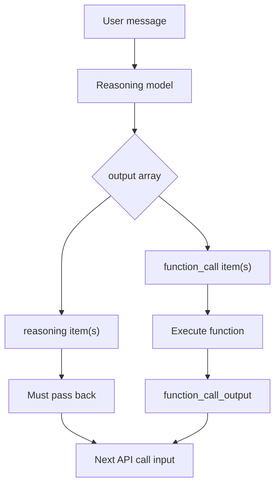

# Reasoning Items

## Introduction

When using OpenAI's reasoning models (GPT-5, o-series) with function calling, the API returns **reasoning items** alongside function call items. These reasoning items contain the model's internal chain-of-thought and must be passed back with your function call results. If you discard them, the model loses its reasoning context and may produce confused or inconsistent responses.

Gemini's latest models have a similar concept called **thought signatures** — cryptographic tokens attached to the model's thinking process that must be preserved. Understanding both patterns is important for building robust function calling loops with frontier reasoning models.

### What we'll cover

- What reasoning items are and why they appear
- Passing reasoning items back with function results
- Encrypted content for stateless / zero-data-retention mode
- Gemini thought signatures
- SDK handling and common mistakes

### Prerequisites

- Provider response structures ([Lesson 02](./02-provider-response-structures.md))
- Call ID matching ([Lesson 04](./04-call-id-matching.md))
- Familiarity with multi-turn function calling

---

## What are reasoning items?

When a reasoning model processes a request that triggers function calls, it generates internal reasoning — a chain-of-thought about which functions to call, what arguments to use, and how to interpret the results. OpenAI surfaces this reasoning as items in the `output` array with `type: "reasoning"`.



The key rule: **every item between the last user message and the function call must be passed back** when you submit function results.

---

## OpenAI reasoning items in practice

### The output array structure

With a reasoning model, the output array typically looks like this:

```python
from openai import OpenAI
import json

client = OpenAI()

tools = [{
    "type": "function",
    "name": "get_stock_price",
    "description": "Get the current stock price.",
    "parameters": {
        "type": "object",
        "properties": {
            "symbol": {"type": "string", "description": "Stock ticker symbol"}
        },
        "required": ["symbol"],
        "additionalProperties": False
    },
    "strict": True
}]

response = client.responses.create(
    model="o4-mini",
    input=[{"role": "user", "content": "What's Apple's stock price?"}],
    tools=tools,
)

# Inspect the output array
for item in response.output:
    print(f"Type: {item.type}")
```

**Output:**
```
Type: reasoning
Type: function_call
```

The reasoning item appears **before** the function call. This is the model's thought process about which function to call and why.

### Passing reasoning items back

You must include **all output items** when sending function results. The simplest approach is to keep the entire output:

```python
# Step 1: Preserve ALL output items (reasoning + function calls)
input_items = list(response.output)

# Step 2: Process function calls and append results
for item in response.output:
    if item.type == "function_call":
        args = json.loads(item.arguments)
        result = get_stock_price(**args)
        
        input_items.append({
            "type": "function_call_output",
            "call_id": item.call_id,
            "output": json.dumps(result),
        })

# Step 3: Send everything back — reasoning items are included
final_response = client.responses.create(
    model="o4-mini",
    input=input_items,
    tools=tools,
)

print(final_response.output_text)
```

**Output:**
```
Apple (AAPL) is currently trading at $213.25.
```

> **Warning:** If you filter out reasoning items and only pass function call outputs, the model loses context. It may hallucinate, repeat function calls, or produce incoherent responses.

### What happens if you drop reasoning items

```python
# ❌ DON'T DO THIS — only passing function call outputs
broken_input = []
for item in response.output:
    if item.type == "function_call":
        args = json.loads(item.arguments)
        broken_input.append(item)  # Missing reasoning items!
        broken_input.append({
            "type": "function_call_output",
            "call_id": item.call_id,
            "output": json.dumps(get_stock_price(**args)),
        })

# Model has no reasoning context — may produce poor results
```

### The simple rule

```python
# ✅ ALWAYS preserve the full output
input_items = list(response.output)  # Includes reasoning + function calls

# Then append your results
for item in response.output:
    if item.type == "function_call":
        input_items.append({
            "type": "function_call_output",
            "call_id": item.call_id,
            "output": json.dumps(execute_function(item)),
        })
```

---

## Encrypted content for stateless mode

### What is zero-data-retention (ZDR)?

Some organizations use OpenAI's zero-data-retention mode, where the API doesn't store conversation data between requests. In this mode, reasoning items need their full internal state to be reconstructable. OpenAI provides **encrypted content** for this purpose.

### Requesting encrypted content

Add `include: ["reasoning.encrypted_content"]` to your API call:

```python
response = client.responses.create(
    model="o4-mini",
    input=[{"role": "user", "content": "What's Apple's stock price?"}],
    tools=tools,
    include=["reasoning.encrypted_content"],  # Enable encrypted content
)

# The reasoning item now contains encrypted_content
for item in response.output:
    if item.type == "reasoning":
        print(f"Has encrypted content: {item.encrypted_content is not None}")
```

**Output:**
```
Has encrypted content: True
```

### When to use encrypted content

| Scenario | Encrypted content needed? |
|----------|--------------------------|
| Standard API usage | No — reasoning items work without it |
| Zero-data-retention (ZDR) | Yes — required for context preservation |
| Stateless / serverless architecture | Yes — can't rely on server-side state |
| Multi-turn with potential state loss | Recommended as a safeguard |

> **Note:** The encrypted content is an opaque blob. You don't decode it — you just pass it back with the reasoning item on the next turn.

---

## Reasoning summaries

For non-ZDR use cases where you want insight into the model's thinking without the full reasoning items, OpenAI offers **reasoning summaries**:

```python
response = client.responses.create(
    model="o4-mini",
    input=[{"role": "user", "content": "What's Apple's stock price?"}],
    tools=tools,
    reasoning={"summary": "auto"},  # Request reasoning summary
)

# Access the summary
for item in response.output:
    if item.type == "reasoning":
        if item.summary:
            for part in item.summary:
                print(f"Summary: {part.text}")
```

**Output:**
```
Summary: The user wants the current Apple stock price. I'll call the get_stock_price function with the symbol "AAPL".
```

### Summary options

| Value | Behavior |
|-------|----------|
| `"auto"` | Generate a summary when helpful |
| `"concise"` | Generate a brief summary |
| `"detailed"` | Generate a thorough summary |

> **Tip:** Summaries are useful for logging and debugging — you can see why the model decided to call a particular function. But they don't replace passing reasoning items back.

---

## Reasoning effort

You can control how much thinking the reasoning model does with the `reasoning.effort` parameter:

```python
# Quick response — less thinking
response = client.responses.create(
    model="o4-mini",
    input=[{"role": "user", "content": "What's Apple's stock price?"}],
    tools=tools,
    reasoning={"effort": "low"},
)

# Deep analysis — more thinking
response = client.responses.create(
    model="o4-mini",
    input=[{"role": "user", "content": "Compare AAPL, MSFT, GOOGL trends over 5 years."}],
    tools=tools,
    reasoning={"effort": "high"},
)
```

| Effort level | Use case |
|-------------|----------|
| `"low"` | Simple lookups, straightforward function calls |
| `"medium"` | Default — balanced reasoning |
| `"high"` | Complex decisions, multi-step planning, choosing among many tools |

---

## Gemini thought signatures

### What are thought signatures?

Gemini 3 models include **thought signatures** — cryptographic tokens attached to the model's thinking when it's in "thinking mode." Like OpenAI's reasoning items, these must be preserved and passed back in multi-turn conversations.

```python
from google import genai
from google.genai import types

client = genai.Client()

config = types.GenerateContentConfig(
    tools=[weather_tool],
    thinking_config=types.ThinkingConfig(
        thinking_budget=1024,  # Allow thinking
    ),
)

response = client.models.generate_content(
    model="gemini-2.5-flash",
    contents=["What's the weather in Paris?"],
    config=config,
)

# Check for thought signatures in the response parts
for part in response.candidates[0].content.parts:
    if hasattr(part, "thought") and part.thought:
        print("This part contains model thinking")
    if hasattr(part, "thought_signature") and part.thought_signature:
        print("This part has a thought signature — must preserve")
```

### Preserving thought signatures

When building the next turn, include the full response content (which contains any thought signatures):

```python
# Preserve the model's full response (including thought signatures)
contents = [
    types.Content(role="user", parts=[types.Part(text="What's the weather?")]),
    response.candidates[0].content,       # Includes thought signatures
    types.Content(role="user", parts=[     # Function response
        types.Part.from_function_response(
            name="get_weather",
            response={"temp": 15},
        )
    ]),
]

# Send back with all context preserved
final_response = client.models.generate_content(
    model="gemini-2.5-flash",
    contents=contents,
    config=config,
)
```

> **🤖 AI Context:** Both OpenAI's reasoning items and Gemini's thought signatures serve the same purpose: preserving the model's chain-of-thought across multi-turn function calling. The principle is always the same — don't discard any part of the model's response.

---

## A unified approach

The safest strategy across all providers is: **keep the full model response and append your results.**

```python
from dataclasses import dataclass
import json
from typing import Any


@dataclass
class TurnBuilder:
    """Build the next API turn preserving all model context."""
    
    provider: str
    model_output: Any       # Full model response
    results: list = None
    
    def __post_init__(self):
        self.results = []
    
    def add_result(self, call_id: str, name: str, output: Any) -> None:
        """Add a function execution result."""
        self.results.append({
            "call_id": call_id,
            "name": name,
            "output": output,
        })
    
    def build_input(self) -> list:
        """Build the input for the next API call."""
        if self.provider == "openai":
            return self._build_openai()
        elif self.provider == "anthropic":
            return self._build_anthropic()
        elif self.provider == "gemini":
            return self._build_gemini()
        raise ValueError(f"Unknown provider: {self.provider}")
    
    def _build_openai(self) -> list:
        """OpenAI: pass ALL output items + function_call_outputs."""
        items = list(self.model_output)  # Includes reasoning items!
        for r in self.results:
            items.append({
                "type": "function_call_output",
                "call_id": r["call_id"],
                "output": json.dumps(r["output"]),
            })
        return items
    
    def _build_anthropic(self) -> list:
        """Anthropic: assistant content + tool_results in user message."""
        tool_results = []
        for r in self.results:
            tool_results.append({
                "type": "tool_result",
                "tool_use_id": r["call_id"],
                "content": json.dumps(r["output"]),
            })
        return tool_results  # Used as the content of the next user message
    
    def _build_gemini(self) -> list:
        """Gemini: function response parts in order."""
        from google.genai import types
        parts = []
        for r in self.results:
            parts.append(
                types.Part.from_function_response(
                    name=r["name"],
                    response=r["output"],
                )
            )
        return parts


# Usage with OpenAI — reasoning items preserved automatically
builder = TurnBuilder(provider="openai", model_output=response.output)

for item in response.output:
    if item.type == "function_call":
        result = execute_function(item.name, json.loads(item.arguments))
        builder.add_result(item.call_id, item.name, result)

next_input = builder.build_input()
# next_input includes: [reasoning_item, function_call_item, function_call_output, ...]
```

---

## Best practices

| Practice | Why it matters |
|----------|---------------|
| Always use `list(response.output)` | Preserves reasoning items without filtering |
| Use `include=["reasoning.encrypted_content"]` in ZDR mode | Without it, reasoning context is lost across turns |
| Request reasoning summaries for logging | Helps you understand why the model chose specific functions |
| Don't parse or inspect reasoning content | It's opaque — just pass it through |
| Preserve Gemini's full candidate content | Thought signatures are embedded in the response parts |
| Set reasoning effort appropriately | `"low"` for simple calls, `"high"` for complex multi-tool decisions |

---

## Common pitfalls

| ❌ Mistake | ✅ Solution |
|-----------|-------------|
| Filtering output to only `function_call` items | Use `list(response.output)` to keep everything |
| Not using encrypted content in ZDR deployments | Add `include=["reasoning.encrypted_content"]` |
| Trying to read/decode reasoning content | Treat it as opaque — just pass it through |
| Skipping `response.candidates[0].content` for Gemini | Always include the model's full response content |
| Mixing reasoning effort with non-reasoning models | Only `o4-mini`, `o3`, `GPT-5`, etc. support `reasoning` parameter |

---

## Hands-on exercise

### Your task

Build a function calling loop that correctly handles reasoning items for OpenAI's reasoning models. The loop should work for both standard and ZDR modes.

### Requirements

1. Accept a `zdr_mode: bool` parameter
2. If ZDR mode, include `reasoning.encrypted_content` in the request
3. Always request reasoning summaries (set to `"auto"`)
4. Preserve all output items (reasoning + function calls)
5. Log reasoning summaries before executing functions
6. Append function results with correct call IDs
7. Return the final response text

### Expected result

```python
result = reasoning_function_loop(
    prompt="What's the weather in Paris?",
    tools=tools,
    registry={"get_weather": get_weather},
    zdr_mode=False,
)
print(result)
# "The weather in Paris is 15°C."
```

<details>
<summary>💡 Hints (click to expand)</summary>

- Build the `include` list conditionally based on `zdr_mode`
- Use `item.summary` to access reasoning summaries (it's a list of objects with `.text`)
- The loop pattern: create → collect output → execute functions → append results → create again

</details>

<details>
<summary>✅ Solution (click to expand)</summary>

```python
from openai import OpenAI
import json
from typing import Callable


def reasoning_function_loop(
    prompt: str,
    tools: list[dict],
    registry: dict[str, Callable],
    zdr_mode: bool = False,
    model: str = "o4-mini",
) -> str:
    """Run a function calling loop with reasoning item handling."""
    client = OpenAI()
    
    # Build optional parameters
    include = []
    if zdr_mode:
        include.append("reasoning.encrypted_content")
    
    # Initial request
    response = client.responses.create(
        model=model,
        input=[{"role": "user", "content": prompt}],
        tools=tools,
        reasoning={"summary": "auto"},
        **({"include": include} if include else {}),
    )
    
    # Check if there are function calls
    has_calls = any(item.type == "function_call" for item in response.output)
    
    if not has_calls:
        return response.output_text
    
    # Log reasoning summaries
    for item in response.output:
        if item.type == "reasoning" and item.summary:
            for part in item.summary:
                print(f"[Reasoning] {part.text}")
    
    # Preserve ALL output items (reasoning + function calls)
    input_items = list(response.output)
    
    # Execute function calls and append results
    for item in response.output:
        if item.type == "function_call":
            name = item.name
            args = json.loads(item.arguments)
            
            func = registry.get(name)
            if func:
                try:
                    result = func(**args)
                except Exception as e:
                    result = {"error": str(e)}
            else:
                result = {"error": f"Unknown function: {name}"}
            
            input_items.append({
                "type": "function_call_output",
                "call_id": item.call_id,
                "output": json.dumps(result),
            })
    
    # Send back with full context
    final_response = client.responses.create(
        model=model,
        input=input_items,
        tools=tools,
        reasoning={"summary": "auto"},
        **({"include": include} if include else {}),
    )
    
    return final_response.output_text
```

</details>

### Bonus challenges

- [ ] Extend the loop to handle multiple rounds of function calling (the model may call more functions after seeing results)
- [ ] Add a counter to prevent infinite loops (max 5 rounds)
- [ ] Compare reasoning summaries between `"low"` and `"high"` effort levels for the same prompt

---

## Summary

✅ Reasoning models (GPT-5, o-series) include `type: "reasoning"` items in the output array — these must be passed back with function results

✅ The simplest approach: always use `list(response.output)` to preserve everything, then append your `function_call_output` items

✅ In zero-data-retention (ZDR) mode, add `include: ["reasoning.encrypted_content"]` to preserve reasoning context across turns

✅ Reasoning summaries (`reasoning.summary: "auto"`) give you readable insight into the model's thinking for logging and debugging

✅ Gemini's thought signatures follow the same principle — preserve the full `response.candidates[0].content` when building the next turn

**Next:** [Argument Validation](./06-argument-validation.md) — Validating function arguments against schemas before execution

---

[← Previous: Call ID Matching](./04-call-id-matching.md) | [Next: Argument Validation →](./06-argument-validation.md)

<!-- 
Sources Consulted:
- OpenAI Reasoning Models Guide: https://platform.openai.com/docs/guides/reasoning
- OpenAI Responses API Reference: https://platform.openai.com/docs/api-reference/responses
- OpenAI Function Calling Guide: https://platform.openai.com/docs/guides/function-calling
- Google Gemini Thinking: https://ai.google.dev/gemini-api/docs/thinking
-->
