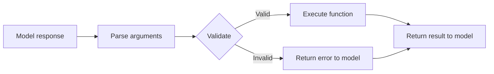

# Argument Validation

## Introduction

Before executing any function, you should validate that the arguments match your expected schema. Even with strict mode enabled, validation adds a critical safety layer — it catches edge cases like semantically valid but logically wrong values (a negative age, an impossible date, or an out-of-range temperature). Without validation, bad arguments can crash your functions, corrupt data, or produce misleading results for the model.

We'll build validation from simple required-field checks to a full schema-aware validator that works with any function definition.

### What we'll cover

- Why validation matters even with strict mode
- Required field checking
- Type verification
- Range and constraint validation
- Schema-aware validation against tool definitions
- Building a reusable argument validator

### Prerequisites

- JSON Schema for parameters ([Lesson 03](../03-json-schema-for-parameters/00-json-schema-for-parameters.md))
- Parsing arguments ([Lesson 03 of this lesson](./03-parsing-arguments.md))

---

## Why validate when strict mode exists?

Strict mode (`strict: True` in OpenAI, Anthropic) guarantees the JSON structure matches your schema — correct types, required fields present, no extra properties. So why add validation?

| What strict mode catches | What it does NOT catch |
|--------------------------|----------------------|
| Missing required fields | Values outside logical range |
| Wrong types (`string` vs `number`) | Invalid business logic (past dates for bookings) |
| Extra properties | Semantically wrong values ("temperature": -500) |
| Malformed JSON | Cross-field dependencies (end_date before start_date) |

```python
# Strict mode guarantees this is valid JSON matching the schema
args = {"temperature": -999.0, "location": ""}

# But is temperature=-999 reasonable? Is an empty location useful?
# Strict mode says yes. Your validator should say no.
```

> **🤖 AI Context:** LLMs occasionally produce values that are technically type-correct but semantically nonsensical. Validation catches these before they reach your functions.

---

## Required field checking

The most basic validation: confirm all required fields exist and are non-empty.

```python
def check_required_fields(
    args: dict,
    required: list[str],
) -> list[str]:
    """Check that all required fields are present and non-empty.
    
    Returns a list of error messages (empty list = valid).
    """
    errors = []
    
    for field in required:
        if field not in args:
            errors.append(f"Missing required field: '{field}'")
        elif args[field] is None:
            errors.append(f"Required field '{field}' is null")
        elif isinstance(args[field], str) and not args[field].strip():
            errors.append(f"Required field '{field}' is empty")
    
    return errors


# Test
args = {"location": "", "units": "celsius"}
required = ["location", "date"]

errors = check_required_fields(args, required)
for e in errors:
    print(f"  ❌ {e}")
```

**Output:**
```
  ❌ Required field 'location' is empty
  ❌ Missing required field: 'date'
```

---

## Type verification

Verify that each argument matches its expected type. This is especially important for Gemini, which doesn't support strict mode the way OpenAI and Anthropic do.

```python
# JSON Schema type → Python type mapping
JSON_TYPE_MAP: dict[str, type | tuple[type, ...]] = {
    "string": str,
    "number": (int, float),
    "integer": int,
    "boolean": bool,
    "array": list,
    "object": dict,
    "null": type(None),
}


def check_types(
    args: dict,
    properties: dict[str, dict],
) -> list[str]:
    """Verify each argument matches its schema type.
    
    Args:
        args: The parsed arguments.
        properties: The 'properties' section of the JSON Schema.
    
    Returns:
        List of type error messages.
    """
    errors = []
    
    for field, value in args.items():
        if field not in properties:
            errors.append(f"Unexpected field: '{field}'")
            continue
        
        schema = properties[field]
        expected_type = schema.get("type")
        
        if expected_type is None:
            continue  # No type constraint
        
        python_type = JSON_TYPE_MAP.get(expected_type)
        if python_type is None:
            continue  # Unknown JSON type
        
        if not isinstance(value, python_type):
            errors.append(
                f"Field '{field}': expected {expected_type}, "
                f"got {type(value).__name__} ({value!r})"
            )
    
    return errors


# Test
properties = {
    "location": {"type": "string"},
    "temperature": {"type": "number"},
    "count": {"type": "integer"},
}

args = {"location": "Paris", "temperature": "warm", "count": 3.5}
errors = check_types(args, properties)
for e in errors:
    print(f"  ❌ {e}")
```

**Output:**
```
  ❌ Field 'temperature': expected number, got str ('warm')
  ❌ Field 'count': expected integer, got float (3.5)
```

---

## Range and constraint validation

JSON Schema supports constraints like `minimum`, `maximum`, `minLength`, `maxLength`, `enum`, and `pattern`. We'll validate these to catch logically wrong values.

```python
import re


def check_constraints(
    args: dict,
    properties: dict[str, dict],
) -> list[str]:
    """Validate values against schema constraints.
    
    Supports: minimum, maximum, minLength, maxLength, enum, pattern.
    """
    errors = []
    
    for field, value in args.items():
        if field not in properties:
            continue
        
        schema = properties[field]
        
        # Numeric range
        if "minimum" in schema and isinstance(value, (int, float)):
            if value < schema["minimum"]:
                errors.append(
                    f"Field '{field}': {value} is below minimum {schema['minimum']}"
                )
        
        if "maximum" in schema and isinstance(value, (int, float)):
            if value > schema["maximum"]:
                errors.append(
                    f"Field '{field}': {value} exceeds maximum {schema['maximum']}"
                )
        
        # String length
        if "minLength" in schema and isinstance(value, str):
            if len(value) < schema["minLength"]:
                errors.append(
                    f"Field '{field}': length {len(value)} below minLength {schema['minLength']}"
                )
        
        if "maxLength" in schema and isinstance(value, str):
            if len(value) > schema["maxLength"]:
                errors.append(
                    f"Field '{field}': length {len(value)} exceeds maxLength {schema['maxLength']}"
                )
        
        # Enum
        if "enum" in schema:
            if value not in schema["enum"]:
                errors.append(
                    f"Field '{field}': '{value}' not in allowed values {schema['enum']}"
                )
        
        # Pattern (regex)
        if "pattern" in schema and isinstance(value, str):
            if not re.match(schema["pattern"], value):
                errors.append(
                    f"Field '{field}': '{value}' doesn't match pattern '{schema['pattern']}'"
                )
    
    return errors


# Test
properties = {
    "age": {"type": "integer", "minimum": 0, "maximum": 150},
    "units": {"type": "string", "enum": ["celsius", "fahrenheit"]},
    "zip_code": {"type": "string", "pattern": r"^\d{5}$"},
}

args = {"age": -5, "units": "kelvin", "zip_code": "ABCDE"}
errors = check_constraints(args, properties)
for e in errors:
    print(f"  ❌ {e}")
```

**Output:**
```
  ❌ Field 'age': -5 is below minimum 0
  ❌ Field 'units': 'kelvin' not in allowed values ['celsius', 'fahrenheit']
  ❌ Field 'zip_code': 'ABCDE' doesn't match pattern '^\d{5}$'
```

---

## Schema-aware validation

Now we combine all checks into a single validator that works with a complete JSON Schema definition:

```python
from dataclasses import dataclass, field


@dataclass
class ValidationResult:
    """Result of argument validation."""
    valid: bool
    errors: list[str] = field(default_factory=list)
    
    def __str__(self) -> str:
        if self.valid:
            return "✅ Valid"
        return "❌ Invalid:\n" + "\n".join(f"  - {e}" for e in self.errors)


def validate_arguments(
    args: dict,
    schema: dict,
) -> ValidationResult:
    """Validate arguments against a JSON Schema definition.
    
    Args:
        args: Parsed function arguments.
        schema: The 'parameters' schema from the tool definition.
    
    Returns:
        ValidationResult with valid flag and any errors.
    """
    errors = []
    properties = schema.get("properties", {})
    required = schema.get("required", [])
    allows_additional = schema.get("additionalProperties", True)
    
    # Check required fields
    errors.extend(check_required_fields(args, required))
    
    # Check for unexpected fields
    if not allows_additional:
        unexpected = set(args.keys()) - set(properties.keys())
        for field_name in unexpected:
            errors.append(f"Unexpected field: '{field_name}'")
    
    # Check types
    errors.extend(check_types(args, properties))
    
    # Check constraints
    errors.extend(check_constraints(args, properties))
    
    return ValidationResult(valid=len(errors) == 0, errors=errors)


# Test with a realistic schema
schema = {
    "type": "object",
    "properties": {
        "location": {
            "type": "string",
            "minLength": 1,
            "description": "City name"
        },
        "units": {
            "type": "string",
            "enum": ["celsius", "fahrenheit"],
        },
        "days": {
            "type": "integer",
            "minimum": 1,
            "maximum": 14,
        },
    },
    "required": ["location"],
    "additionalProperties": False,
}

# Valid arguments
result = validate_arguments(
    {"location": "Paris", "units": "celsius", "days": 7},
    schema,
)
print(result)
print()

# Invalid arguments
result = validate_arguments(
    {"location": "", "units": "kelvin", "days": 30, "extra": True},
    schema,
)
print(result)
```

**Output:**
```
✅ Valid

❌ Invalid:
  - Required field 'location' is empty
  - Unexpected field: 'extra'
  - Field 'units': 'kelvin' not in allowed values ['celsius', 'fahrenheit']
  - Field 'days': 30 exceeds maximum 14
```

---

## Validation in the function calling loop

Here's how validation fits into the full pipeline — between parsing and execution:



```python
import json
from typing import Callable


def process_function_call(
    name: str,
    raw_arguments: str,
    tool_definitions: list[dict],
    registry: dict[str, Callable],
) -> dict:
    """Parse, validate, and execute a function call.
    
    Returns the result dict to send back to the model.
    """
    # Step 1: Find the matching tool definition
    tool_schema = None
    for tool in tool_definitions:
        tool_name = tool.get("name") or tool.get("function", {}).get("name")
        if tool_name == name:
            tool_schema = (
                tool.get("parameters") 
                or tool.get("function", {}).get("parameters")
                or tool.get("input_schema")
            )
            break
    
    if tool_schema is None:
        return {"error": f"No schema found for function: {name}"}
    
    # Step 2: Parse arguments
    try:
        args = json.loads(raw_arguments) if isinstance(raw_arguments, str) else raw_arguments
    except json.JSONDecodeError as e:
        return {"error": f"Invalid JSON arguments: {e}"}
    
    # Step 3: Validate against schema
    validation = validate_arguments(args, tool_schema)
    if not validation.valid:
        return {
            "error": "Argument validation failed",
            "details": validation.errors,
        }
    
    # Step 4: Execute
    func = registry.get(name)
    if func is None:
        return {"error": f"Unknown function: {name}"}
    
    try:
        return func(**args)
    except Exception as e:
        return {"error": f"Execution failed: {e}"}


# Usage
tools = [{
    "type": "function",
    "name": "get_weather",
    "parameters": {
        "type": "object",
        "properties": {
            "location": {"type": "string", "minLength": 1},
            "units": {"type": "string", "enum": ["celsius", "fahrenheit"]},
        },
        "required": ["location"],
        "additionalProperties": False,
    }
}]

# Valid call
result = process_function_call(
    name="get_weather",
    raw_arguments='{"location": "Paris", "units": "celsius"}',
    tool_definitions=tools,
    registry={"get_weather": get_weather},
)
print(f"Valid:   {result}")

# Invalid call
result = process_function_call(
    name="get_weather",
    raw_arguments='{"location": "", "units": "kelvin"}',
    tool_definitions=tools,
    registry={"get_weather": get_weather},
)
print(f"Invalid: {result}")
```

**Output:**
```
Valid:   {'temp': 15, 'units': 'celsius', 'location': 'Paris'}
Invalid: {'error': 'Argument validation failed', 'details': ["Required field 'location' is empty", "Field 'units': 'kelvin' not in allowed values ['celsius', 'fahrenheit']"]}
```

> **Important:** When validation fails, return a descriptive error to the model — not a generic message. The model can use the error details to correct its arguments and try again.

---

## Using jsonschema for production

For production applications, use the `jsonschema` library instead of writing custom validators. It handles the full JSON Schema specification including nested objects, arrays, `oneOf`, `anyOf`, and more.

```python
# pip install jsonschema
from jsonschema import validate, ValidationError


schema = {
    "type": "object",
    "properties": {
        "location": {"type": "string", "minLength": 1},
        "days": {"type": "integer", "minimum": 1, "maximum": 14},
        "options": {
            "type": "object",
            "properties": {
                "include_humidity": {"type": "boolean"},
                "include_wind": {"type": "boolean"},
            },
        },
    },
    "required": ["location"],
    "additionalProperties": False,
}


def validate_with_jsonschema(args: dict, schema: dict) -> ValidationResult:
    """Validate using the jsonschema library."""
    try:
        validate(instance=args, schema=schema)
        return ValidationResult(valid=True)
    except ValidationError as e:
        # Collect all errors using a validator
        from jsonschema import Draft7Validator
        validator = Draft7Validator(schema)
        errors = [err.message for err in validator.iter_errors(args)]
        return ValidationResult(valid=False, errors=errors)


# Test
result = validate_with_jsonschema(
    {"location": "Paris", "days": 7, "options": {"include_humidity": True}},
    schema,
)
print(result)
```

**Output:**
```
✅ Valid
```

> **Tip:** The `jsonschema` library is the standard choice for production. Our custom validators above are useful for learning and for cases where you need custom business logic checks that go beyond JSON Schema.

---

## Best practices

| Practice | Why it matters |
|----------|---------------|
| Always validate before executing | Catches issues before they reach your functions |
| Return detailed errors to the model | The model can self-correct with specific feedback |
| Validate even with strict mode on | Strict mode doesn't check semantic validity |
| Use `jsonschema` in production | Handles the full spec including nested schemas |
| Add business logic checks after schema validation | Range checks, date validity, cross-field rules |
| Log validation failures | Helps identify patterns in model mistakes |

---

## Common pitfalls

| ❌ Mistake | ✅ Solution |
|-----------|-------------|
| Skipping validation because strict mode is on | Always validate — strict mode doesn't check value ranges or business rules |
| Returning generic "invalid arguments" errors | Include specific field names and constraint violations |
| Only checking types, not constraints | Also check `minimum`, `maximum`, `enum`, `pattern`, `minLength`, `maxLength` |
| Forgetting to validate nested objects | Use `jsonschema` library or write recursive validation |
| Crashing on validation errors instead of returning to model | Catch validation errors and return them as function output |

---

## Hands-on exercise

### Your task

Build an `ArgumentValidator` class that validates arguments against a tool definition and supports custom business rules.

### Requirements

1. Accept a JSON Schema and an optional list of custom validation rules
2. Custom rules are functions that take `(args: dict) -> str | None` (return error string or None)
3. Run schema validation first, then custom rules
4. Return a `ValidationResult` with all errors combined
5. Include a method to register custom rules after creation

### Expected result

```python
validator = ArgumentValidator(schema)
validator.add_rule(lambda args: "End date must be after start date" 
                   if args.get("end") and args.get("start") and args["end"] <= args["start"] 
                   else None)

result = validator.validate({"start": "2025-03-15", "end": "2025-03-10"})
# ValidationResult(valid=False, errors=["End date must be after start date"])
```

<details>
<summary>💡 Hints (click to expand)</summary>

- Store custom rules in a `list[Callable[[dict], str | None]]`
- Run `validate_arguments()` first for schema checks, then iterate custom rules
- Custom rules should only run if schema validation passes (or always — your choice)

</details>

<details>
<summary>✅ Solution (click to expand)</summary>

```python
from dataclasses import dataclass, field
from typing import Callable


@dataclass
class ArgumentValidator:
    """Validate function arguments with schema + custom rules."""
    
    schema: dict
    _custom_rules: list[Callable[[dict], str | None]] = field(
        default_factory=list, repr=False
    )
    
    def add_rule(self, rule: Callable[[dict], str | None]) -> None:
        """Register a custom validation rule.
        
        Rule receives args dict and returns error string or None.
        """
        self._custom_rules.append(rule)
    
    def validate(self, args: dict) -> ValidationResult:
        """Run schema validation + custom rules."""
        # Schema validation
        result = validate_arguments(args, self.schema)
        errors = list(result.errors)
        
        # Custom rules (run regardless of schema result)
        for rule in self._custom_rules:
            error = rule(args)
            if error is not None:
                errors.append(error)
        
        return ValidationResult(valid=len(errors) == 0, errors=errors)


# Test
schema = {
    "type": "object",
    "properties": {
        "start": {"type": "string"},
        "end": {"type": "string"},
        "guests": {"type": "integer", "minimum": 1},
    },
    "required": ["start", "end", "guests"],
}

validator = ArgumentValidator(schema)

# Add custom business rules
validator.add_rule(
    lambda args: "End date must be after start date"
    if args.get("end") and args.get("start") and args["end"] <= args["start"]
    else None
)
validator.add_rule(
    lambda args: "Cannot book for more than 20 guests"
    if args.get("guests", 0) > 20
    else None
)

# Valid
result = validator.validate({"start": "2025-03-10", "end": "2025-03-15", "guests": 4})
print(result)

# Invalid (business rule violation)
result = validator.validate({"start": "2025-03-15", "end": "2025-03-10", "guests": 25})
print(result)
```

**Output:**
```
✅ Valid
❌ Invalid:
  - End date must be after start date
  - Cannot book for more than 20 guests
```

</details>

### Bonus challenges

- [ ] Add support for validating nested object schemas recursively
- [ ] Create a decorator `@validated(schema)` that auto-validates function arguments
- [ ] Implement a "coerce and validate" mode that attempts type coercion before failing

---

## Summary

✅ Validation is necessary even with strict mode — strict mode checks structure but not semantic correctness

✅ Layer your validation: required fields → type checks → constraints → business rules

✅ Always return specific error details to the model so it can self-correct on retries

✅ Use the `jsonschema` library in production for full JSON Schema spec compliance

✅ Add custom business rules for cross-field validation and domain-specific constraints

**Next:** [Function Dispatch](./07-function-dispatch.md) — Mapping function names to implementations with a registry pattern

---

[← Previous: Reasoning Items](./05-reasoning-items.md) | [Next: Function Dispatch →](./07-function-dispatch.md)

<!-- 
Sources Consulted:
- JSON Schema Validation: https://json-schema.org/draft/2020-12/json-schema-validation
- OpenAI Structured Outputs / Strict Mode: https://platform.openai.com/docs/guides/function-calling
- Python jsonschema library: https://python-jsonschema.readthedocs.io/
-->
