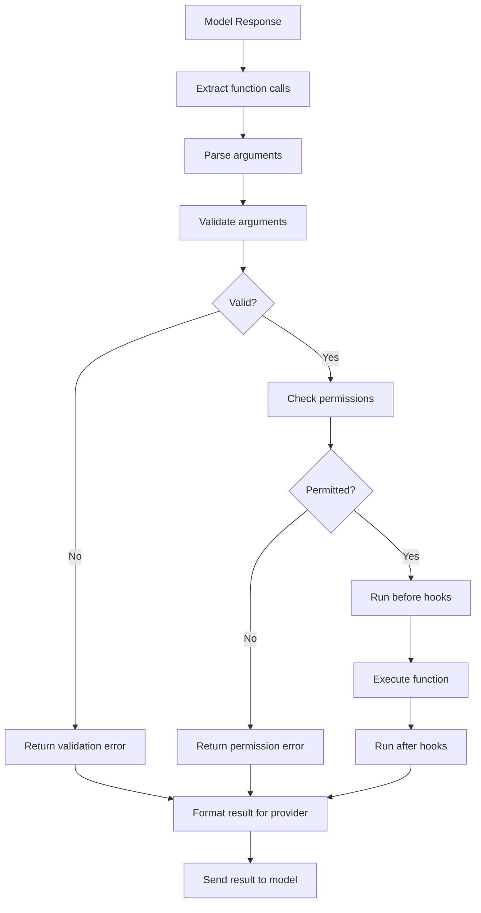

# Function Dispatch

## Introduction

Once you've parsed and validated function arguments, you need to route each call to the correct implementation. Function dispatch is the pattern of mapping function names (strings from the model) to actual callable functions in your code. A well-designed dispatch system makes it easy to add new functions, enforce permissions, add logging, and handle errors consistently.

We'll build from a simple dictionary registry to a decorator-based system with middleware support — a pattern that scales from prototypes to production applications.

### What we'll cover

- Simple dictionary-based function registries
- Decorator-based registration
- Async function dispatch
- Middleware and hooks (logging, rate limiting, permissions)
- The complete dispatch pipeline
- Provider-agnostic dispatch

### Prerequisites

- Parsing arguments ([Lesson 03](./03-parsing-arguments.md))
- Argument validation ([Lesson 06](./06-argument-validation.md))

---

## The function registry pattern

At its core, a function registry is a dictionary that maps function names to callable objects:

```python
from typing import Any, Callable

# The simplest registry
FUNCTION_REGISTRY: dict[str, Callable[..., Any]] = {}


def get_weather(location: str, units: str = "celsius") -> dict:
    """Get current weather for a location."""
    temps = {"Paris": 15, "Tokyo": 25, "New York": 22}
    temp = temps.get(location, 20)
    if units == "fahrenheit":
        temp = temp * 9 / 5 + 32
    return {"location": location, "temperature": temp, "units": units}


def search_products(query: str, max_results: int = 5) -> dict:
    """Search product catalog."""
    return {"query": query, "results": [f"Product matching '{query}'"], "count": 1}


# Register functions
FUNCTION_REGISTRY["get_weather"] = get_weather
FUNCTION_REGISTRY["search_products"] = search_products


# Dispatch a call
def dispatch(name: str, arguments: dict) -> Any:
    """Look up and execute a function by name."""
    func = FUNCTION_REGISTRY.get(name)
    if func is None:
        return {"error": f"Unknown function: {name}"}
    return func(**arguments)


# Usage
result = dispatch("get_weather", {"location": "Paris"})
print(result)
```

**Output:**
```
{'location': 'Paris', 'temperature': 15, 'units': 'celsius'}
```

This works but has limitations: registration is manual, there's no validation, and adding cross-cutting concerns (logging, timing) requires modifying every function.

---

## Decorator-based registration

A decorator pattern automatically registers functions when they're defined:

```python
from typing import Any, Callable
from functools import wraps


class FunctionRegistry:
    """Registry with decorator-based function registration."""
    
    def __init__(self):
        self._functions: dict[str, Callable[..., Any]] = {}
        self._schemas: dict[str, dict] = {}
    
    def register(
        self,
        name: str | None = None,
        schema: dict | None = None,
    ) -> Callable:
        """Decorator to register a function.
        
        Args:
            name: Override function name (defaults to function.__name__).
            schema: JSON Schema for the function's parameters.
        """
        def decorator(func: Callable) -> Callable:
            func_name = name or func.__name__
            self._functions[func_name] = func
            if schema:
                self._schemas[func_name] = schema
            return func
        
        return decorator
    
    def dispatch(self, name: str, arguments: dict) -> Any:
        """Look up and execute a function."""
        func = self._functions.get(name)
        if func is None:
            raise KeyError(f"Unknown function: {name}")
        return func(**arguments)
    
    def list_functions(self) -> list[str]:
        """List all registered function names."""
        return list(self._functions.keys())
    
    def get_schema(self, name: str) -> dict | None:
        """Get the schema for a registered function."""
        return self._schemas.get(name)


# Create a registry
registry = FunctionRegistry()


# Register with decorators
@registry.register(schema={
    "type": "object",
    "properties": {
        "location": {"type": "string"},
        "units": {"type": "string", "enum": ["celsius", "fahrenheit"]},
    },
    "required": ["location"],
})
def get_weather(location: str, units: str = "celsius") -> dict:
    """Get current weather for a location."""
    temps = {"Paris": 15, "Tokyo": 25}
    return {"location": location, "temperature": temps.get(location, 20), "units": units}


@registry.register(name="search", schema={
    "type": "object",
    "properties": {
        "query": {"type": "string"},
        "limit": {"type": "integer", "minimum": 1, "maximum": 20},
    },
    "required": ["query"],
})
def search_products(query: str, limit: int = 5) -> dict:
    """Search the product catalog."""
    return {"query": query, "results": [], "limit": limit}


# Check registered functions
print(f"Registered: {registry.list_functions()}")

# Dispatch
result = registry.dispatch("get_weather", {"location": "Tokyo"})
print(f"Result: {result}")
```

**Output:**
```
Registered: ['get_weather', 'search']
Result: {'location': 'Tokyo', 'temperature': 25, 'units': 'celsius'}
```

> **Note:** The `name` parameter lets you register a function under a different name than its Python name. This is useful when the tool name you give the model differs from your implementation function name.

---

## Async function dispatch

Many functions involve I/O (database queries, API calls, file reads). Supporting async functions prevents blocking:

```python
import asyncio
import inspect
from typing import Any, Callable


class AsyncRegistry:
    """Registry that supports both sync and async functions."""
    
    def __init__(self):
        self._functions: dict[str, Callable] = {}
    
    def register(self, name: str | None = None) -> Callable:
        """Register a sync or async function."""
        def decorator(func: Callable) -> Callable:
            self._functions[name or func.__name__] = func
            return func
        return decorator
    
    async def dispatch(self, name: str, arguments: dict) -> Any:
        """Execute a function, handling both sync and async."""
        func = self._functions.get(name)
        if func is None:
            raise KeyError(f"Unknown function: {name}")
        
        if inspect.iscoroutinefunction(func):
            # Async function — await it
            return await func(**arguments)
        else:
            # Sync function — run in executor to avoid blocking
            loop = asyncio.get_event_loop()
            return await loop.run_in_executor(
                None, lambda: func(**arguments)
            )


# Create registry
async_registry = AsyncRegistry()


@async_registry.register()
def get_weather(location: str) -> dict:
    """Sync function — no I/O needed."""
    return {"location": location, "temp": 15}


@async_registry.register()
async def search_database(query: str) -> dict:
    """Async function — simulates database query."""
    await asyncio.sleep(0.1)  # Simulate I/O
    return {"query": query, "results": ["result1", "result2"]}


# Dispatch both sync and async functions uniformly
async def main():
    r1 = await async_registry.dispatch("get_weather", {"location": "Paris"})
    r2 = await async_registry.dispatch("search_database", {"query": "shoes"})
    print(f"Weather: {r1}")
    print(f"Search:  {r2}")

asyncio.run(main())
```

**Output:**
```
Weather: {'location': 'Paris', 'temp': 15}
Search:  {'query': 'shoes', 'results': ['result1', 'result2']}
```

### Parallel dispatch for parallel calls

When the model makes multiple function calls at once, execute them in parallel:

```python
async def dispatch_parallel(
    registry: AsyncRegistry,
    calls: list[dict],
) -> list[dict]:
    """Execute multiple function calls in parallel."""
    tasks = [
        registry.dispatch(call["name"], call["arguments"])
        for call in calls
    ]
    results = await asyncio.gather(*tasks, return_exceptions=True)
    
    output = []
    for call, result in zip(calls, results):
        if isinstance(result, Exception):
            output.append({
                "call_id": call.get("call_id"),
                "result": {"error": str(result)},
            })
        else:
            output.append({
                "call_id": call.get("call_id"),
                "result": result,
            })
    
    return output
```

---

## Middleware and hooks

Middleware lets you add cross-cutting behavior (logging, timing, rate limiting) without modifying individual functions. We'll implement a hook-based system:

```python
import time
import json
from dataclasses import dataclass, field
from typing import Any, Callable
from datetime import datetime


@dataclass
class CallContext:
    """Context passed through the middleware chain."""
    function_name: str
    arguments: dict
    call_id: str | None = None
    start_time: float = 0.0
    metadata: dict = field(default_factory=dict)


# Middleware type: receives context + next function, returns result
Middleware = Callable[[CallContext, Callable], Any]


class DispatchRegistry:
    """Registry with middleware support."""
    
    def __init__(self):
        self._functions: dict[str, Callable] = {}
        self._before_hooks: list[Callable[[CallContext], None]] = []
        self._after_hooks: list[Callable[[CallContext, Any], None]] = []
        self._middleware: list[Middleware] = []
    
    def register(self, name: str | None = None) -> Callable:
        """Register a function."""
        def decorator(func: Callable) -> Callable:
            self._functions[name or func.__name__] = func
            return func
        return decorator
    
    def before(self, hook: Callable[[CallContext], None]) -> None:
        """Add a hook that runs before function execution."""
        self._before_hooks.append(hook)
    
    def after(self, hook: Callable[[CallContext, Any], None]) -> None:
        """Add a hook that runs after function execution."""
        self._after_hooks.append(hook)
    
    def dispatch(self, name: str, arguments: dict, call_id: str | None = None) -> Any:
        """Dispatch with hooks."""
        func = self._functions.get(name)
        if func is None:
            raise KeyError(f"Unknown function: {name}")
        
        ctx = CallContext(
            function_name=name,
            arguments=arguments,
            call_id=call_id,
            start_time=time.time(),
        )
        
        # Run before hooks
        for hook in self._before_hooks:
            hook(ctx)
        
        # Execute function
        result = func(**arguments)
        
        # Run after hooks
        for hook in self._after_hooks:
            hook(ctx, result)
        
        return result


# Create registry with hooks
dispatch_registry = DispatchRegistry()


# Add logging hooks
def log_before(ctx: CallContext) -> None:
    timestamp = datetime.now().strftime("%H:%M:%S")
    print(f"[{timestamp}] Calling {ctx.function_name}({ctx.arguments})")

def log_after(ctx: CallContext, result: Any) -> None:
    elapsed = (time.time() - ctx.start_time) * 1000
    print(f"  → Completed in {elapsed:.1f}ms: {json.dumps(result)[:80]}")

dispatch_registry.before(log_before)
dispatch_registry.after(log_after)


@dispatch_registry.register()
def get_weather(location: str) -> dict:
    return {"location": location, "temp": 15, "units": "celsius"}


# Dispatch with logging
result = dispatch_registry.dispatch(
    "get_weather", 
    {"location": "Paris"}, 
    call_id="call_abc",
)
```

**Output:**
```
[14:32:05] Calling get_weather({'location': 'Paris'})
  → Completed in 0.1ms: {"location": "Paris", "temp": 15, "units": "celsius"}
```

---

## Permission-based dispatch

In production, you may want to restrict which functions are available based on user roles or API keys:

```python
from dataclasses import dataclass, field
from typing import Any, Callable


@dataclass
class PermissionedRegistry:
    """Registry with role-based function access control."""
    
    _functions: dict[str, Callable] = field(default_factory=dict)
    _permissions: dict[str, set[str]] = field(default_factory=dict)
    
    def register(self, name: str | None = None, roles: set[str] | None = None) -> Callable:
        """Register a function with optional role restrictions."""
        def decorator(func: Callable) -> Callable:
            func_name = name or func.__name__
            self._functions[func_name] = func
            if roles:
                self._permissions[func_name] = roles
            return func
        return decorator
    
    def dispatch(self, name: str, arguments: dict, user_role: str = "user") -> Any:
        """Execute a function if the user has permission."""
        func = self._functions.get(name)
        if func is None:
            raise KeyError(f"Unknown function: {name}")
        
        allowed_roles = self._permissions.get(name)
        if allowed_roles and user_role not in allowed_roles:
            return {
                "error": f"Permission denied: '{name}' requires one of {allowed_roles}"
            }
        
        return func(**arguments)
    
    def available_functions(self, user_role: str) -> list[str]:
        """List functions available to a specific role."""
        available = []
        for name in self._functions:
            allowed = self._permissions.get(name)
            if allowed is None or user_role in allowed:
                available.append(name)
        return available


# Create permissioned registry
secure_registry = PermissionedRegistry()


@secure_registry.register()
def get_weather(location: str) -> dict:
    """Public — available to all roles."""
    return {"location": location, "temp": 15}


@secure_registry.register(roles={"admin", "manager"})
def delete_user(user_id: str) -> dict:
    """Restricted — admin and manager only."""
    return {"deleted": user_id}


# Check available functions per role
print(f"User functions:  {secure_registry.available_functions('user')}")
print(f"Admin functions: {secure_registry.available_functions('admin')}")

# Dispatch with permission check
result = secure_registry.dispatch("delete_user", {"user_id": "123"}, user_role="user")
print(f"User tries delete: {result}")

result = secure_registry.dispatch("delete_user", {"user_id": "123"}, user_role="admin")
print(f"Admin tries delete: {result}")
```

**Output:**
```
User functions:  ['get_weather']
Admin functions: ['get_weather', 'delete_user']
User tries delete: {'error': "Permission denied: 'delete_user' requires one of {'admin', 'manager'}"}
Admin tries delete: {'deleted': '123'}
```

---

## The complete dispatch pipeline

Here's the full pipeline from model response to function result, combining everything:



```python
import json
import time
from dataclasses import dataclass, field
from typing import Any, Callable


@dataclass
class DispatchResult:
    """Result of a function dispatch."""
    success: bool
    call_id: str
    name: str
    result: Any = None
    error: str | None = None
    elapsed_ms: float = 0.0


class FunctionDispatcher:
    """Complete dispatch pipeline with validation, permissions, and hooks."""
    
    def __init__(self):
        self._functions: dict[str, Callable] = {}
        self._schemas: dict[str, dict] = {}
        self._permissions: dict[str, set[str]] = {}
        self._before_hooks: list[Callable] = []
        self._after_hooks: list[Callable] = []
    
    def register(
        self,
        name: str | None = None,
        schema: dict | None = None,
        roles: set[str] | None = None,
    ) -> Callable:
        """Register a function with schema and permissions."""
        def decorator(func: Callable) -> Callable:
            func_name = name or func.__name__
            self._functions[func_name] = func
            if schema:
                self._schemas[func_name] = schema
            if roles:
                self._permissions[func_name] = roles
            return func
        return decorator
    
    def process_call(
        self,
        name: str,
        raw_arguments: str | dict,
        call_id: str = "",
        user_role: str = "user",
    ) -> DispatchResult:
        """Full pipeline: parse → validate → check permissions → execute."""
        start = time.time()
        
        # Step 1: Check function exists
        func = self._functions.get(name)
        if func is None:
            return DispatchResult(
                success=False, call_id=call_id, name=name,
                error=f"Unknown function: {name}",
            )
        
        # Step 2: Parse arguments
        try:
            args = (
                json.loads(raw_arguments) 
                if isinstance(raw_arguments, str) 
                else raw_arguments
            )
        except json.JSONDecodeError as e:
            return DispatchResult(
                success=False, call_id=call_id, name=name,
                error=f"Invalid JSON: {e}",
            )
        
        # Step 3: Validate against schema
        schema = self._schemas.get(name)
        if schema:
            validation = validate_arguments(args, schema)
            if not validation.valid:
                return DispatchResult(
                    success=False, call_id=call_id, name=name,
                    error=f"Validation failed: {'; '.join(validation.errors)}",
                )
        
        # Step 4: Check permissions
        allowed = self._permissions.get(name)
        if allowed and user_role not in allowed:
            return DispatchResult(
                success=False, call_id=call_id, name=name,
                error=f"Permission denied for role '{user_role}'",
            )
        
        # Step 5: Execute
        try:
            result = func(**args)
            elapsed = (time.time() - start) * 1000
            return DispatchResult(
                success=True, call_id=call_id, name=name,
                result=result, elapsed_ms=elapsed,
            )
        except Exception as e:
            elapsed = (time.time() - start) * 1000
            return DispatchResult(
                success=False, call_id=call_id, name=name,
                error=f"Execution error: {e}", elapsed_ms=elapsed,
            )


# Usage
dispatcher = FunctionDispatcher()

@dispatcher.register(schema={
    "type": "object",
    "properties": {
        "location": {"type": "string", "minLength": 1},
    },
    "required": ["location"],
})
def get_weather(location: str) -> dict:
    return {"location": location, "temp": 15}

# Process a call through the full pipeline
result = dispatcher.process_call(
    name="get_weather",
    raw_arguments='{"location": "Paris"}',
    call_id="call_abc",
)
print(f"Success: {result.success}, Result: {result.result}, Time: {result.elapsed_ms:.1f}ms")
```

**Output:**
```
Success: True, Result: {'location': 'Paris', 'temp': 15}, Time: 0.1ms
```

---

## Best practices

| Practice | Why it matters |
|----------|---------------|
| Use a registry — don't dispatch with `if/elif` chains | Registries are extensible; `if/elif` requires modifying dispatch code |
| Support both sync and async functions | Many tool implementations involve I/O |
| Execute parallel calls concurrently | `asyncio.gather()` dramatically improves latency |
| Add logging hooks, not inline logging | Keeps function implementations clean |
| Include permissions checking | Prevents unauthorized function execution |
| Return structured results (not raw values) | `DispatchResult` enables consistent error handling and timing |

---

## Common pitfalls

| ❌ Mistake | ✅ Solution |
|-----------|-------------|
| Using `if name == "func1": ...` chains | Use a dictionary registry or class |
| Calling sync I/O functions without executor | Use `run_in_executor()` to prevent blocking the event loop |
| Processing parallel calls sequentially | Use `asyncio.gather()` to execute concurrently |
| Hardcoding function names as strings everywhere | Register once, reference the registry |
| Not handling unknown function names | Always check `registry.get(name)` before calling |
| Swallowing exceptions silently | Catch, log, and return structured errors |

---

## Hands-on exercise

### Your task

Build a `ToolDispatcher` class that integrates with OpenAI's Responses API to process function calls from a model response.

### Requirements

1. Register functions with decorators (including their tool definitions)
2. Accept a model response and extract all function calls
3. Process each call through the pipeline (parse → validate → dispatch)
4. Return a list of `function_call_output` items ready to send back to the API
5. Preserve all non-function-call output items (reasoning items, etc.)

### Expected result

```python
dispatcher = ToolDispatcher()

@dispatcher.tool(definition={...})
def get_weather(location: str) -> dict:
    return {"temp": 15}

output_items = dispatcher.process_response(response)
# [reasoning_item, function_call_item, {"type": "function_call_output", ...}]
```

<details>
<summary>💡 Hints (click to expand)</summary>

- Store tool definitions so you can generate the `tools` list for the API
- Use `list(response.output)` to preserve reasoning items
- Append `function_call_output` items after the preserved output

</details>

<details>
<summary>✅ Solution (click to expand)</summary>

```python
import json
from typing import Any, Callable
from dataclasses import dataclass, field


class ToolDispatcher:
    """Dispatch function calls from OpenAI Responses API."""
    
    def __init__(self):
        self._functions: dict[str, Callable] = {}
        self._definitions: dict[str, dict] = {}
    
    def tool(self, definition: dict) -> Callable:
        """Decorator to register a tool function."""
        def decorator(func: Callable) -> Callable:
            name = definition.get("name", func.__name__)
            self._functions[name] = func
            self._definitions[name] = definition
            return func
        return decorator
    
    def get_tools(self) -> list[dict]:
        """Get tool definitions for the API."""
        return [
            {"type": "function", **defn}
            for defn in self._definitions.values()
        ]
    
    def process_response(self, response) -> list:
        """Process all function calls in a response.
        
        Returns items ready to use as input for the next API call.
        """
        # Preserve ALL output items (reasoning + function calls)
        items = list(response.output)
        
        # Process function calls
        for item in response.output:
            if item.type == "function_call":
                result = self._execute(item.name, item.arguments)
                items.append({
                    "type": "function_call_output",
                    "call_id": item.call_id,
                    "output": json.dumps(result),
                })
        
        return items
    
    def _execute(self, name: str, raw_arguments: str) -> Any:
        """Parse, validate, and execute a function."""
        func = self._functions.get(name)
        if func is None:
            return {"error": f"Unknown function: {name}"}
        
        try:
            args = json.loads(raw_arguments)
        except json.JSONDecodeError as e:
            return {"error": f"Invalid arguments: {e}"}
        
        try:
            return func(**args)
        except Exception as e:
            return {"error": f"Execution failed: {e}"}


# Usage
dispatcher = ToolDispatcher()

@dispatcher.tool(definition={
    "name": "get_weather",
    "description": "Get weather for a location.",
    "parameters": {
        "type": "object",
        "properties": {"location": {"type": "string"}},
        "required": ["location"],
        "additionalProperties": False,
    },
    "strict": True,
})
def get_weather(location: str) -> dict:
    return {"location": location, "temp": 15, "units": "celsius"}

# Get tools list for the API
print(f"Tools: {[t['name'] for t in dispatcher.get_tools()]}")
```

**Output:**
```
Tools: ['get_weather']
```

</details>

### Bonus challenges

- [ ] Add rate limiting (max N calls per function per minute)
- [ ] Implement retry logic for transient failures
- [ ] Add a `timeout` parameter to each function registration (abort if too slow)

---

## Summary

✅ A function registry maps string names to callable implementations — use a dictionary, not `if/elif` chains

✅ Decorators simplify registration — functions are registered automatically when defined

✅ Support both sync and async functions — use `inspect.iscoroutinefunction()` to handle both uniformly

✅ Middleware (hooks) adds logging, timing, and permissions without modifying function implementations

✅ The full pipeline flows: parse → validate → permission check → execute → format result

**Next:** [Error Handling](./08-error-handling.md) — Handling parse errors, unknown functions, execution failures, and retries

---

[← Previous: Argument Validation](./06-argument-validation.md) | [Next: Error Handling →](./08-error-handling.md)

<!-- 
Sources Consulted:
- OpenAI Function Calling Guide: https://platform.openai.com/docs/guides/function-calling
- Python functools documentation: https://docs.python.org/3/library/functools.html
- Python asyncio documentation: https://docs.python.org/3/library/asyncio.html
-->
