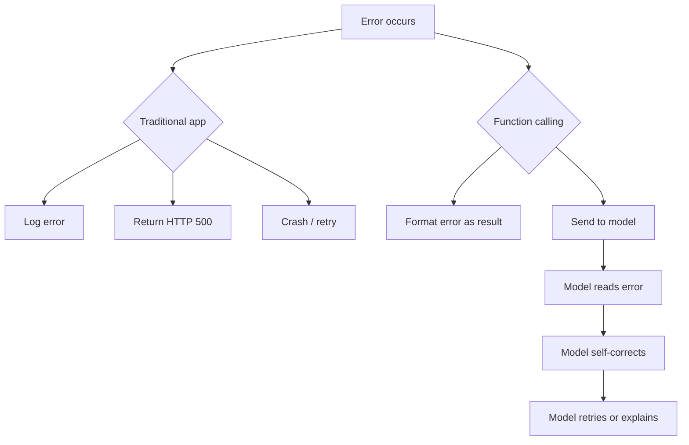

# Error Handling

## Introduction

Every step in the function calling pipeline can fail: JSON parsing can choke on malformed output, the model might call a function that doesn't exist, arguments might fail validation, and the function itself might throw an exception. Your error handling strategy determines whether these failures crash your application, produce confusing responses, or gracefully recover with a helpful message that lets the model try again.

The key insight is that function call errors should be communicated **back to the model** as function results, not raised as exceptions in your application. The model can read error messages, understand what went wrong, and often self-correct on the next attempt.

### What we'll cover

- The error handling philosophy for function calling
- Parse error recovery
- Unknown function handling
- Execution error handling
- Returning errors to the model
- Retry strategies
- Building an error-resilient function calling loop

### Prerequisites

- Parsing arguments ([Lesson 03](./03-parsing-arguments.md))
- Function dispatch ([Lesson 07](./07-function-dispatch.md))

---

## Error handling philosophy

In traditional programming, errors are exceptions you catch or propagate. In function calling, errors are **information for the model**. This changes how you think about them:



```python
# ❌ Traditional — raise exception
def handle_function_call(name, args):
    func = registry.get(name)
    if func is None:
        raise ValueError(f"Unknown function: {name}")  # Crashes your app
    return func(**args)


# ✅ Function calling — return error as result
def handle_function_call(name, args):
    func = registry.get(name)
    if func is None:
        return {"error": f"Unknown function: '{name}'. Available: {list(registry.keys())}"}
    try:
        return func(**args)
    except Exception as e:
        return {"error": f"Function '{name}' failed: {str(e)}"}
```

> **🔑 Key concept:** Never let a function call error crash your application. Always return it as a structured result so the model can respond intelligently.

---

## Parse error recovery

When the model returns malformed JSON in function arguments, you need graceful recovery:

```python
import json
import re


def safe_parse_arguments(raw: str, function_name: str) -> dict | dict:
    """Parse function arguments with multiple fallback strategies.
    
    Returns parsed args dict, or an error dict if all strategies fail.
    """
    # Strategy 1: Direct JSON parse
    try:
        return json.loads(raw)
    except json.JSONDecodeError:
        pass
    
    # Strategy 2: Fix common JSON issues
    fixed = raw
    fixed = re.sub(r",\s*([}\]])", r"\1", fixed)    # Trailing commas
    fixed = fixed.replace("'", '"')                   # Single quotes
    fixed = re.sub(r"(\w+)\s*:", r'"\1":', fixed)     # Unquoted keys
    
    try:
        return json.loads(fixed)
    except json.JSONDecodeError:
        pass
    
    # Strategy 3: Extract JSON from surrounding text
    match = re.search(r"\{[^{}]*\}", raw)
    if match:
        try:
            return json.loads(match.group())
        except json.JSONDecodeError:
            pass
    
    # All strategies failed — return error for the model
    return {
        "error": (
            f"Could not parse arguments for '{function_name}'. "
            f"Received: {raw[:200]}. "
            "Please provide valid JSON arguments."
        )
    }


# Test with malformed JSON
result = safe_parse_arguments(
    "{'location': 'Paris', 'units': 'celsius',}",
    "get_weather",
)
print(f"Recovered: {result}")

# Test with completely broken input
result = safe_parse_arguments(
    "get the weather for Paris please",
    "get_weather",
)
print(f"Error:     {result}")
```

**Output:**
```
Recovered: {'location': 'Paris', 'units': 'celsius'}
Error:     {'error': "Could not parse arguments for 'get_weather'. Received: get the weather for Paris please. Please provide valid JSON arguments."}
```

---

## Unknown function handling

The model might call a function that doesn't exist in your registry — either due to hallucination or a mismatch between your tool definitions and registry:

```python
from typing import Any, Callable


def handle_unknown_function(
    name: str,
    registry: dict[str, Callable],
) -> dict:
    """Generate a helpful error when the model calls an unknown function.
    
    Includes available functions to help the model self-correct.
    """
    available = list(registry.keys())
    
    # Check for close matches (simple Levenshtein-like check)
    suggestions = [
        fn for fn in available
        if fn.startswith(name[:3]) or name in fn or fn in name
    ]
    
    error_msg = f"Unknown function: '{name}'."
    
    if suggestions:
        error_msg += f" Did you mean: {suggestions}?"
    
    error_msg += f" Available functions: {available}"
    
    return {"error": error_msg}


# Test
registry = {
    "get_weather": lambda: None,
    "search_products": lambda: None,
    "get_stock_price": lambda: None,
}

result = handle_unknown_function("get_wether", registry)
print(result)
```

**Output:**
```
{'error': "Unknown function: 'get_wether'. Did you mean: ['get_weather']? Available functions: ['get_weather', 'search_products', 'get_stock_price']"}
```

> **Tip:** Including the list of available functions in the error gives the model everything it needs to self-correct. The model can read this error and call the right function on the next turn.

---

## Execution error handling

Even with valid arguments, the function itself might fail — network timeouts, database errors, permission issues:

```python
import traceback
from dataclasses import dataclass
from typing import Any


@dataclass
class ExecutionError:
    """Structured execution error."""
    function_name: str
    error_type: str
    message: str
    recoverable: bool
    suggestion: str | None = None


def safe_execute(
    func: callable,
    name: str,
    args: dict,
) -> Any:
    """Execute a function with comprehensive error handling.
    
    Returns function result or structured error dict.
    """
    try:
        return func(**args)
    
    except TypeError as e:
        # Wrong arguments — likely a schema mismatch
        return {
            "error": f"Argument error in '{name}': {e}",
            "suggestion": "Check that argument names and types match the function signature.",
            "recoverable": True,
        }
    
    except ConnectionError as e:
        # Network issue — might work on retry
        return {
            "error": f"Connection error in '{name}': {e}",
            "suggestion": "The service may be temporarily unavailable. Try again.",
            "recoverable": True,
        }
    
    except PermissionError as e:
        # Permission denied — won't work on retry
        return {
            "error": f"Permission denied for '{name}': {e}",
            "suggestion": "The current user doesn't have access to this operation.",
            "recoverable": False,
        }
    
    except TimeoutError as e:
        # Timeout — might work on retry with different params
        return {
            "error": f"Timeout in '{name}': {e}",
            "suggestion": "The operation timed out. Try with fewer results or a simpler query.",
            "recoverable": True,
        }
    
    except Exception as e:
        # Catch-all for unexpected errors
        return {
            "error": f"Unexpected error in '{name}': {type(e).__name__}: {e}",
            "recoverable": False,
        }


# Test with a function that raises
def flaky_api_call(query: str) -> dict:
    raise ConnectionError("Service unavailable")

result = safe_execute(flaky_api_call, "search", {"query": "shoes"})
print(result)
```

**Output:**
```
{'error': "Connection error in 'search': Service unavailable", 'suggestion': 'The service may be temporarily unavailable. Try again.', 'recoverable': True}
```

---

## Returning errors to the model

Errors go back to the model in the same format as successful results. The model sees them as function output and responds accordingly:

```python
import json
from openai import OpenAI


def format_error_for_model(
    error: dict | str,
    include_suggestion: bool = True,
) -> str:
    """Format an error as a JSON string for the model.
    
    The model receives this as the function's output.
    """
    if isinstance(error, str):
        error = {"error": error}
    
    # Remove internal fields the model doesn't need
    model_error = {
        "error": error.get("error", str(error)),
    }
    
    if include_suggestion and "suggestion" in error:
        model_error["suggestion"] = error["suggestion"]
    
    return json.dumps(model_error)


# In the function calling loop
def process_and_return(response, registry, tools):
    """Process function calls and return results (including errors)."""
    client = OpenAI()
    
    input_items = list(response.output)
    
    for item in response.output:
        if item.type == "function_call":
            # Parse
            parsed = safe_parse_arguments(item.arguments, item.name)
            
            if "error" in parsed:
                # Parse failed — return error
                output = format_error_for_model(parsed)
            else:
                # Execute
                func = registry.get(item.name)
                if func is None:
                    output = format_error_for_model(
                        handle_unknown_function(item.name, registry)
                    )
                else:
                    result = safe_execute(func, item.name, parsed)
                    if isinstance(result, dict) and "error" in result:
                        output = format_error_for_model(result)
                    else:
                        output = json.dumps(result)
            
            input_items.append({
                "type": "function_call_output",
                "call_id": item.call_id,
                "output": output,
            })
    
    return input_items
```

> **Important:** Always return a result for every function call — even when it errors. If you skip a call, the model won't know what happened and the conversation may break.

---

## Retry strategies

When errors are recoverable, you might want the model to try again. There are two approaches:

### Approach 1: Let the model retry naturally

Send the error back and let the model decide to call the function again with corrected arguments:

```python
def function_calling_loop(
    client,
    model: str,
    messages: list,
    tools: list,
    registry: dict,
    max_rounds: int = 5,
) -> str:
    """Loop that lets the model self-correct on errors.
    
    The model sees error messages and can retry with different arguments.
    """
    for round_num in range(max_rounds):
        response = client.responses.create(
            model=model,
            input=messages,
            tools=tools,
        )
        
        # Check if model wants to call functions
        has_calls = any(
            item.type == "function_call" for item in response.output
        )
        
        if not has_calls:
            # No more function calls — model has its answer
            return response.output_text
        
        # Process calls (errors become function output)
        messages = process_and_return(response, registry, tools)
        print(f"  [Round {round_num + 1}] Processed function calls")
    
    return "Maximum function calling rounds reached."
```

### Approach 2: Application-level retry

Retry recoverable errors before sending them to the model:

```python
import time


def execute_with_retry(
    func: callable,
    name: str,
    args: dict,
    max_retries: int = 3,
    backoff_factor: float = 1.0,
) -> Any:
    """Execute a function with automatic retry on recoverable errors."""
    last_error = None
    
    for attempt in range(max_retries):
        result = safe_execute(func, name, args)
        
        # Check if it's an error
        if isinstance(result, dict) and "error" in result:
            if result.get("recoverable", False) and attempt < max_retries - 1:
                # Recoverable — wait and retry
                wait_time = backoff_factor * (2 ** attempt)
                print(f"  Retry {attempt + 1}/{max_retries} for '{name}' in {wait_time}s...")
                time.sleep(wait_time)
                last_error = result
                continue
            else:
                # Not recoverable or out of retries
                return result
        
        # Success
        return result
    
    return last_error or {"error": f"All {max_retries} retries failed for '{name}'"}


# Test
attempt_count = 0

def flaky_function(query: str) -> dict:
    global attempt_count
    attempt_count += 1
    if attempt_count < 3:
        raise ConnectionError("Service unavailable")
    return {"results": ["found it"]}


result = execute_with_retry(flaky_function, "search", {"query": "shoes"})
print(f"Final result: {result}")
```

**Output:**
```
  Retry 1/3 for 'search' in 1.0s...
  Retry 2/3 for 'search' in 2.0s...
Final result: {'results': ['found it']}
```

---

## Building an error-resilient function calling loop

Here's a complete loop that combines all error handling strategies:

```python
import json
import logging
from typing import Any, Callable
from dataclasses import dataclass, field

logger = logging.getLogger(__name__)


@dataclass
class LoopConfig:
    """Configuration for the function calling loop."""
    max_rounds: int = 10
    max_retries_per_call: int = 3
    retry_backoff: float = 1.0
    log_errors: bool = True


@dataclass
class LoopResult:
    """Result of a function calling loop."""
    response_text: str
    rounds: int
    total_calls: int
    errors: list[dict] = field(default_factory=list)


def resilient_function_loop(
    client,
    model: str,
    prompt: str,
    tools: list[dict],
    registry: dict[str, Callable],
    config: LoopConfig | None = None,
) -> LoopResult:
    """Error-resilient function calling loop.
    
    Handles parse errors, unknown functions, execution failures,
    and lets the model self-correct across multiple rounds.
    """
    config = config or LoopConfig()
    messages = [{"role": "user", "content": prompt}]
    total_calls = 0
    all_errors = []
    
    for round_num in range(config.max_rounds):
        # Make API call
        response = client.responses.create(
            model=model,
            input=messages,
            tools=tools,
        )
        
        # Check for function calls
        calls = [
            item for item in response.output 
            if item.type == "function_call"
        ]
        
        if not calls:
            return LoopResult(
                response_text=response.output_text,
                rounds=round_num + 1,
                total_calls=total_calls,
                errors=all_errors,
            )
        
        # Preserve all output items
        messages = list(response.output)
        
        # Process each function call
        for item in calls:
            total_calls += 1
            
            # Step 1: Parse arguments
            parsed = safe_parse_arguments(item.arguments, item.name)
            
            if "error" in parsed:
                error_info = {"round": round_num, "type": "parse", **parsed}
                all_errors.append(error_info)
                if config.log_errors:
                    logger.warning(f"Parse error: {parsed['error']}")
                output = json.dumps(parsed)
            
            # Step 2: Find function
            elif item.name not in registry:
                error = handle_unknown_function(item.name, registry)
                error_info = {"round": round_num, "type": "unknown", **error}
                all_errors.append(error_info)
                if config.log_errors:
                    logger.warning(f"Unknown function: {item.name}")
                output = json.dumps(error)
            
            # Step 3: Execute with retry
            else:
                result = execute_with_retry(
                    registry[item.name],
                    item.name,
                    parsed,
                    max_retries=config.max_retries_per_call,
                    backoff_factor=config.retry_backoff,
                )
                
                if isinstance(result, dict) and "error" in result:
                    error_info = {"round": round_num, "type": "execution", **result}
                    all_errors.append(error_info)
                    if config.log_errors:
                        logger.warning(f"Execution error: {result['error']}")
                
                output = json.dumps(result)
            
            messages.append({
                "type": "function_call_output",
                "call_id": item.call_id,
                "output": output,
            })
    
    # Exceeded max rounds
    return LoopResult(
        response_text="Maximum rounds exceeded. Could not complete the request.",
        rounds=config.max_rounds,
        total_calls=total_calls,
        errors=all_errors,
    )
```

Usage pattern:

```python
# Configure the loop
config = LoopConfig(
    max_rounds=5,
    max_retries_per_call=2,
    log_errors=True,
)

# Run the loop
result = resilient_function_loop(
    client=client,
    model="gpt-4.1",
    prompt="What's the weather in Paris and Tokyo?",
    tools=tools,
    registry={"get_weather": get_weather},
    config=config,
)

print(f"Response: {result.response_text}")
print(f"Rounds: {result.rounds}, Calls: {result.total_calls}")
if result.errors:
    print(f"Errors encountered: {len(result.errors)}")
    for err in result.errors:
        print(f"  - [{err['type']}] {err.get('error', 'unknown')}")
```

**Output:**
```
Response: It's currently 15°C in Paris and 25°C in Tokyo.
Rounds: 2, Calls: 2
Errors encountered: 0
```

---

## Best practices

| Practice | Why it matters |
|----------|---------------|
| Return errors as function output, don't raise | The model can read and self-correct |
| Include available functions in unknown-function errors | Gives the model the info it needs to retry |
| Distinguish recoverable vs non-recoverable errors | Only retry what might succeed |
| Set a max rounds limit | Prevents infinite retry loops |
| Log all errors with context | Essential for debugging and improving tool definitions |
| Include suggestions in error messages | Helps the model understand what to change |

---

## Common pitfalls

| ❌ Mistake | ✅ Solution |
|-----------|-------------|
| Raising exceptions instead of returning errors | Catch exceptions, format as JSON, return to model |
| Returning generic "error occurred" messages | Include specific details: what failed, why, and how to fix |
| No max rounds limit | Always set `max_rounds` to prevent infinite loops |
| Retrying non-recoverable errors | Check `recoverable` flag before retrying |
| Not returning a result for failed calls | Always send a `function_call_output` — even for errors |
| Logging errors but not including them in the result | Include error info in `LoopResult` for programmatic handling |

---

## Hands-on exercise

### Your task

Build an `ErrorRecoveryManager` that tracks errors across a conversation and implements escalation logic.

### Requirements

1. Track errors by function name and error type
2. After 3 errors for the same function, mark it as "disabled" 
3. Disabled functions return an immediate error without attempting execution
4. Provide a `get_health_report()` method showing error rates per function
5. Allow re-enabling functions manually

### Expected result

```python
manager = ErrorRecoveryManager()

# After 3 failures for "search_products":
result = manager.execute("search_products", search_fn, {"query": "test"})
# {"error": "Function 'search_products' is temporarily disabled after 3 consecutive errors."}

report = manager.get_health_report()
# {"search_products": {"errors": 3, "status": "disabled"}, ...}
```

<details>
<summary>💡 Hints (click to expand)</summary>

- Use a `defaultdict(list)` to track errors per function
- Count consecutive errors (reset on success)
- The `execute` method wraps `safe_execute` with tracking logic

</details>

<details>
<summary>✅ Solution (click to expand)</summary>

```python
from collections import defaultdict
from typing import Any, Callable
from dataclasses import dataclass, field


@dataclass
class FunctionHealth:
    """Track health of a single function."""
    total_calls: int = 0
    total_errors: int = 0
    consecutive_errors: int = 0
    disabled: bool = False
    last_error: str | None = None


class ErrorRecoveryManager:
    """Track errors and disable failing functions."""
    
    def __init__(self, error_threshold: int = 3):
        self._health: dict[str, FunctionHealth] = defaultdict(FunctionHealth)
        self._threshold = error_threshold
    
    def execute(
        self,
        name: str,
        func: Callable,
        args: dict,
    ) -> Any:
        """Execute with error tracking and auto-disable."""
        health = self._health[name]
        health.total_calls += 1
        
        # Check if disabled
        if health.disabled:
            return {
                "error": (
                    f"Function '{name}' is temporarily disabled "
                    f"after {health.consecutive_errors} consecutive errors. "
                    f"Last error: {health.last_error}"
                ),
                "recoverable": False,
            }
        
        # Execute
        result = safe_execute(func, name, args)
        
        # Track result
        if isinstance(result, dict) and "error" in result:
            health.total_errors += 1
            health.consecutive_errors += 1
            health.last_error = result["error"]
            
            # Disable if threshold exceeded
            if health.consecutive_errors >= self._threshold:
                health.disabled = True
        else:
            # Success — reset consecutive counter
            health.consecutive_errors = 0
        
        return result
    
    def enable(self, name: str) -> None:
        """Re-enable a disabled function."""
        if name in self._health:
            self._health[name].disabled = False
            self._health[name].consecutive_errors = 0
    
    def get_health_report(self) -> dict:
        """Get health status of all tracked functions."""
        return {
            name: {
                "total_calls": h.total_calls,
                "total_errors": h.total_errors,
                "consecutive_errors": h.consecutive_errors,
                "status": "disabled" if h.disabled else "active",
                "error_rate": f"{h.total_errors / h.total_calls:.0%}" if h.total_calls > 0 else "0%",
            }
            for name, h in self._health.items()
        }


# Test
manager = ErrorRecoveryManager(error_threshold=3)

def failing_search(query: str) -> dict:
    raise ConnectionError("Database offline")

# Simulate 3 failures → auto-disable
for i in range(4):
    result = manager.execute("search", failing_search, {"query": "test"})
    print(f"Call {i+1}: {result.get('error', 'success')[:60]}")

print(f"\nHealth: {manager.get_health_report()}")

# Re-enable
manager.enable("search")
print(f"After re-enable: {manager.get_health_report()['search']['status']}")
```

**Output:**
```
Call 1: Connection error in 'search': Database offline
Call 2: Connection error in 'search': Database offline
Call 3: Connection error in 'search': Database offline
Call 4: Function 'search' is temporarily disabled after 3 consecuti
Health: {'search': {'total_calls': 4, 'total_errors': 3, 'consecutive_errors': 3, 'status': 'disabled', 'error_rate': '75%'}}
After re-enable: active
```

</details>

### Bonus challenges

- [ ] Add a cooldown period (auto re-enable after N seconds)
- [ ] Implement circuit breaker pattern (half-open state for testing recovery)
- [ ] Send a notification (webhook/log) when a function gets auto-disabled

---

## Summary

✅ Function call errors should be returned to the model as results, not raised as exceptions — this lets the model self-correct

✅ Include specific details in error messages: what failed, why, and what to do differently

✅ Use multiple parse recovery strategies before reporting a parse error

✅ Application-level retries handle transient failures; model-level retries handle argument mistakes

✅ Always set a `max_rounds` limit to prevent infinite function calling loops

✅ Track errors per function to identify patterns and auto-disable failing functions

**Next:** [Function Execution →](../05-function-execution/00-function-execution.md) — Executing functions safely with timeouts, cleanup, and sandboxing

---

[← Previous: Function Dispatch](./07-function-dispatch.md) | [Back to Lesson Overview](./00-handling-function-calls.md)

<!-- 
Sources Consulted:
- OpenAI Function Calling Guide: https://platform.openai.com/docs/guides/function-calling
- OpenAI Error Handling: https://platform.openai.com/docs/guides/error-codes
- Python Exception Handling: https://docs.python.org/3/tutorial/errors.html
-->
