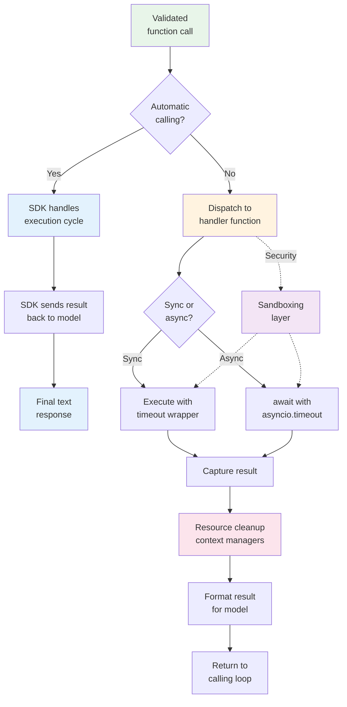
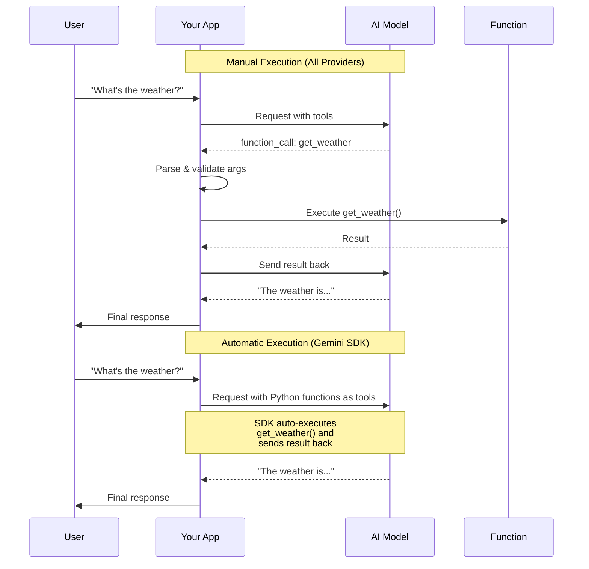

# Function Execution

## Overview

After the model decides which function to call and your code validates the arguments, you need to actually **execute** the function and manage everything that comes with it — from routing the call to the right handler, through handling async operations, to cleaning up resources when things go wrong. This is where function calling stops being about the model and starts being about your application's reliability and security.

The previous lesson covered detecting and parsing function calls. This lesson picks up right after argument validation, covering how to invoke functions safely, manage execution lifecycle, and protect your system from runaway operations. We also explore Google Gemini's automatic function calling SDK feature, which can handle the entire call-response cycle for you.

## Learning objectives

After completing this lesson, you will be able to:

- Execute functions from parsed and validated model requests across all three providers
- Use Google Gemini's automatic function calling to skip the manual dispatch loop
- Handle async functions with `asyncio`, including parallel and sequential execution patterns
- Set timeouts on function executions to prevent runaway operations
- Clean up resources properly with context managers and `try`/`finally` blocks
- Apply sandboxing concepts to isolate function execution for security

## Lesson contents

| # | Topic | Description |
|---|-------|-------------|
| 01 | [Executing Functions](./01-executing-functions.md) | Handler invocation, parameter passing, context injection |
| 02 | [Automatic Function Calling](./02-automatic-function-calling.md) | SDK-managed execution in Gemini, `from_callable`, disabling |
| 03 | [Async Execution](./03-async-execution.md) | Async/await patterns, parallel and sequential execution |
| 04 | [Timeout Management](./04-timeout-management.md) | Setting timeouts, handling partial results, user communication |
| 05 | [Resource Cleanup](./05-resource-cleanup.md) | Connection cleanup, file handles, memory, transaction rollback |
| 06 | [Execution Sandboxing](./06-execution-sandboxing.md) | Isolation approaches, permissions, resource quotas, security |

## How it all fits together

## The execution lifecycle

Once you have a validated function name and arguments, execution follows this lifecycle:

1. **Dispatch** — Route the call to the correct function handler (covered in [Lesson 04, Function Dispatch](../04-handling-function-calls/07-function-dispatch.md))
2. **Context injection** — Pass execution context (user info, request ID, permissions) alongside the model's arguments
3. **Execution** — Run the function, whether synchronous or asynchronous
4. **Timeout enforcement** — Kill executions that exceed time limits
5. **Resource cleanup** — Close connections, release file handles, roll back failed transactions
6. **Result capture** — Collect the return value (or error) for the model

> **🤖 AI Context:** In production AI applications, function execution is where most failures happen — not in the parsing or validation stages. A function that queries a slow database, calls an unreliable external API, or processes a large file needs robust timeout handling, cleanup logic, and sandboxing to prevent cascading failures.

## Provider comparison for execution

| Aspect | OpenAI | Anthropic | Google Gemini |
|--------|--------|-----------|---------------|
| Auto execution | — (manual only) | — (manual only) | ✅ Python SDK auto-calling |
| Schema from code | — | — | `from_callable()` generates declarations |
| Result delivery | `function_call_output` item | `tool_result` content block | `FunctionResponse` part |
| Async support | Manual `async`/`await` | Manual `async`/`await` | SDK handles internally |
| Timeout support | Manual implementation | Manual implementation | Manual implementation |
| Built-in sandboxing | — | — | — (all manual) |

## Automatic vs manual execution

## When to use automatic vs manual execution

| Scenario | Recommended Approach | Why |
|----------|---------------------|-----|
| Simple tools, rapid prototyping | Automatic (Gemini SDK) | Minimal code, fast iteration |
| Production applications | Manual execution | Full control over validation, timeouts, logging |
| Multi-provider support | Manual execution | Consistent behavior across providers |
| Sensitive operations | Manual execution | Add authorization, audit logging, sandboxing |
| Functions needing context | Manual execution | Inject user info, request metadata |
| Learning/tutorials | Automatic first, then manual | Understand the flow before building it |

---

**Next:** [Executing Functions](./01-executing-functions.md) — Handler invocation, parameter passing, and execution context

---

[← Previous: Error Handling](../04-handling-function-calls/08-error-handling.md) | [Next: Executing Functions →](./01-executing-functions.md)

<!-- 
Sources Consulted:
- OpenAI Function Calling: https://platform.openai.com/docs/guides/function-calling
- Anthropic Tool Use: https://platform.claude.com/docs/en/docs/build-with-claude/tool-use
- Google Gemini Function Calling: https://ai.google.dev/gemini-api/docs/function-calling
- Python asyncio: https://docs.python.org/3/library/asyncio-task.html
-->
