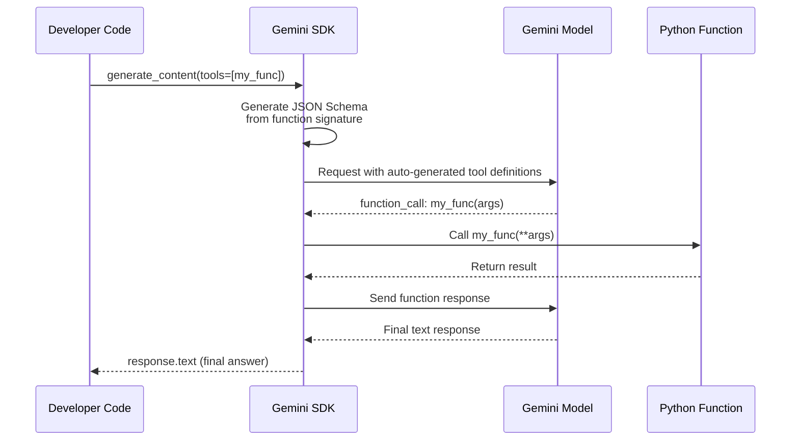

# Automatic Function Calling

## Introduction

What if you didn't have to write any dispatch logic, argument parsing, or result formatting? Google Gemini's Python SDK offers **automatic function calling** — you pass Python functions directly as tools, and the SDK handles the entire call-response cycle: generating JSON Schema from your function signature, detecting when the model wants to call a function, executing it locally, sending the result back, and returning the model's final text response.

This is a fundamentally different developer experience from the manual execution covered in the previous lesson. Automatic calling trades control for convenience, making it ideal for prototyping and simple applications. Understanding when to use it — and when to turn it off — is essential for production AI development.

### What we'll cover

- How automatic function calling works in the Gemini Python SDK
- Passing Python functions directly as tools
- Schema generation with `from_callable()`
- Supported types and Pydantic models
- Google-style docstrings for parameter descriptions
- Compositional (sequential) function calling
- Disabling automatic calling for manual control
- Why OpenAI and Anthropic don't offer this feature

### Prerequisites

- Executing functions manually ([Lesson 05-01](./01-executing-functions.md))
- Function calling concepts ([Lesson 01](../01-function-calling-concepts/00-function-calling-concepts.md))
- Defining functions ([Lesson 02](../02-defining-functions/00-defining-functions.md))

---

## How automatic function calling works

In manual function calling, you write a loop: send request → detect function call → execute → send result → repeat. Gemini's automatic calling eliminates this loop entirely:



The developer writes **one call** and gets back the **final text** — the SDK handles every intermediate step.

---

## Basic automatic function calling

Pass Python functions directly in the `tools` parameter. The SDK inspects the function signature and docstring to generate the tool definition:

```python
from google import genai

client = genai.Client()

# Define a plain Python function — no JSON Schema needed
def get_weather(location: str) -> dict:
    """Get the current weather for a given location.

    Args:
        location: The city and country, e.g. 'Paris, France'
    """
    # In production: call a real weather API
    return {
        "location": location,
        "temperature_celsius": 22,
        "condition": "partly cloudy",
        "humidity": 65
    }

# Pass the function directly — SDK handles everything
response = client.models.generate_content(
    model="gemini-2.5-flash",
    contents="What's the weather like in Paris?",
    config=genai.types.GenerateContentConfig(
        tools=[get_weather]  # Pass the function, not a schema
    ),
)

# The response is the final text — function was already called
print(response.text)
```

**Output:**
```
The weather in Paris is currently 22°C and partly cloudy with 65% humidity.
```

> **Important:** The SDK called `get_weather("Paris, France")` locally on your machine, sent the result back to the model, and returned the model's natural language summary. You never wrote dispatch or result-formatting code.

---

## Inspecting generated schemas

To see what JSON Schema the SDK generates from your function, use `FunctionDeclaration.from_callable()`:

```python
from google.genai import types

# Inspect the auto-generated schema
declaration = types.FunctionDeclaration.from_callable(
    callable=get_weather,
    client=client
)

# Print the generated declaration
import json
print(json.dumps(declaration.to_json_dict(), indent=2))
```

**Output:**
```json
{
  "name": "get_weather",
  "description": "Get the current weather for a given location.",
  "parameters": {
    "type": "OBJECT",
    "properties": {
      "location": {
        "type": "STRING"
      }
    },
    "required": ["location"]
  }
}
```

> **Note:** The SDK sends the **entire docstring** as the top-level `description` field. It does **not** parse individual `Args:` descriptions into property-level description slots. This means your top-level docstring should be clear and specific.

---

## Supported types

The SDK can only auto-generate schemas for specific Python types. Using unsupported types will cause errors:

| Python Type | JSON Schema Type | Works? |
|-------------|-----------------|--------|
| `str` | `STRING` | ✅ |
| `int` | `INTEGER` | ✅ |
| `float` | `NUMBER` | ✅ |
| `bool` | `BOOLEAN` | ✅ |
| `list[str]` | `ARRAY` of `STRING` | ✅ |
| `list[int]` | `ARRAY` of `INTEGER` | ✅ |
| `pydantic.BaseModel` | `OBJECT` with properties | ✅ |
| `dict` | — | ❌ Not supported |
| `Any` | — | ❌ Not supported |
| `Optional[str]` | `STRING` (nullable) | ✅ |

### Using Pydantic models for complex parameters

When functions need structured input, use Pydantic models instead of dictionaries:

```python
from pydantic import BaseModel

class SearchFilters(BaseModel):
    query: str
    category: str = "all"
    max_price: float = 1000.0
    in_stock: bool = True

def search_products(filters: SearchFilters) -> dict:
    """Search the product catalog with the given filters.

    Args:
        filters: Search filters including query, category, price limit, and stock status.
    """
    return {
        "query": filters.query,
        "category": filters.category,
        "results": [
            {"name": "Red Running Shoes", "price": 89.99, "in_stock": True},
            {"name": "Blue Trail Shoes", "price": 129.99, "in_stock": True},
        ],
        "total": 2
    }

response = client.models.generate_content(
    model="gemini-2.5-flash",
    contents="Find me running shoes under $100",
    config=genai.types.GenerateContentConfig(
        tools=[search_products]
    ),
)

print(response.text)
```

**Output:**
```
I found Red Running Shoes for $89.99 that are currently in stock.
```

> **Warning:** Do **not** use `dict` as a parameter type — the SDK cannot generate a schema for untyped dictionaries. Always use Pydantic models or typed primitives.

---

## Google-style docstrings

The SDK uses your docstring to describe the function to the model. **Google-style docstrings** are recommended because they're structured and readable:

```python
def book_flight(
    origin: str,
    destination: str,
    date: str,
    passengers: int = 1,
    cabin_class: str = "economy"
) -> dict:
    """Book a flight between two airports.

    Searches available flights and books the best option for the given
    route and date. Returns booking confirmation with price and flight details.

    Args:
        origin: IATA airport code for departure, e.g. 'JFK'
        destination: IATA airport code for arrival, e.g. 'LAX'
        date: Travel date in YYYY-MM-DD format
        passengers: Number of passengers (1-9)
        cabin_class: Cabin class — 'economy', 'business', or 'first'
    """
    return {
        "booking_id": "BK-20250615-001",
        "origin": origin,
        "destination": destination,
        "date": date,
        "passengers": passengers,
        "cabin_class": cabin_class,
        "price_per_person": 299.00,
        "status": "confirmed"
    }
```

> **🤖 AI Context:** Although the SDK sends the entire docstring as a single description, a well-written docstring still helps the model understand what the function does, what each parameter means, and what constraints apply. Think of the docstring as the model's instruction manual for your function.

---

## Multiple functions

Pass multiple functions and the model chooses which to call:

```python
def get_temperature(city: str) -> dict:
    """Get the current temperature in a city.

    Args:
        city: The city name, e.g. 'London'
    """
    temperatures = {"London": 15, "Tokyo": 28, "New York": 25}
    return {"city": city, "temperature_celsius": temperatures.get(city, 20)}

def get_time(timezone: str) -> dict:
    """Get the current time in a timezone.

    Args:
        timezone: IANA timezone name, e.g. 'America/New_York'
    """
    return {"timezone": timezone, "time": "14:30", "date": "2025-06-15"}

response = client.models.generate_content(
    model="gemini-2.5-flash",
    contents="What's the temperature and time in Tokyo?",
    config=genai.types.GenerateContentConfig(
        tools=[get_temperature, get_time]
    ),
)

print(response.text)
```

**Output:**
```
The current temperature in Tokyo is 28°C and the local time is 14:30 on June 15, 2025.
```

The SDK may call both functions (parallel calling) or call them sequentially in a single `generate_content` invocation.

---

## Compositional (sequential) function calling

The model can chain function calls where the output of one feeds into another. The SDK handles all the intermediate steps automatically:

```python
def get_user_location(user_id: str) -> dict:
    """Look up the current location of a user.

    Args:
        user_id: The user's account ID
    """
    locations = {"user_123": "San Francisco, CA", "user_456": "London, UK"}
    return {"user_id": user_id, "location": locations.get(user_id, "Unknown")}

def get_weather_for_location(location: str) -> dict:
    """Get weather for a specific location.

    Args:
        location: City and region, e.g. 'San Francisco, CA'
    """
    return {"location": location, "temperature": 18, "condition": "foggy"}

def suggest_activity(weather_condition: str, temperature: int) -> dict:
    """Suggest an activity based on weather.

    Args:
        weather_condition: Current weather like 'sunny', 'rainy', 'foggy'
        temperature: Temperature in Celsius
    """
    if weather_condition == "foggy" and temperature < 20:
        return {"suggestion": "Visit a cozy café or museum"}
    return {"suggestion": "Go for a walk in the park"}

# The model chains: get_user_location → get_weather → suggest_activity
response = client.models.generate_content(
    model="gemini-2.5-flash",
    contents="What should user_123 do today based on their local weather?",
    config=genai.types.GenerateContentConfig(
        tools=[get_user_location, get_weather_for_location, suggest_activity]
    ),
)

print(response.text)
```

**Output:**
```
User 123 is in San Francisco, CA where it's currently 18°C and foggy. I'd suggest visiting a cozy café or museum today!
```

The SDK automatically:
1. Called `get_user_location("user_123")` → got "San Francisco, CA"
2. Called `get_weather_for_location("San Francisco, CA")` → got foggy, 18°C
3. Called `suggest_activity("foggy", 18)` → got café/museum suggestion
4. Sent all results to the model for the final response

---

## Disabling automatic function calling

For production applications where you need control over execution (validation, authorization, logging, timeouts), disable automatic calling:

```python
from google.genai import types

# Disable automatic execution — SDK returns function calls without executing
config = types.GenerateContentConfig(
    tools=[get_weather],
    automatic_function_calling=types.AutomaticFunctionCallingConfig(
        disable=True
    ),
)

response = client.models.generate_content(
    model="gemini-2.5-flash",
    contents="What's the weather in London?",
    config=config,
)

# Now you must handle the function call manually
for part in response.candidates[0].content.parts:
    if part.function_call:
        print(f"Function: {part.function_call.name}")
        print(f"Args: {dict(part.function_call.args)}")
        # Now YOU execute, validate, log, timeout, etc.
```

**Output:**
```
Function: get_weather
Args: {'location': 'London'}
```

### When to disable automatic calling

| Scenario | Disable? | Why |
|----------|----------|-----|
| Prototyping and demos | No | Speed of development |
| Functions with side effects | **Yes** | Need authorization, audit logging |
| Functions calling external APIs | **Yes** | Need timeout management, error handling |
| Multi-provider applications | **Yes** | Consistent manual flow across providers |
| Functions needing user confirmation | **Yes** | "Are you sure you want to delete?" |
| Read-only, stateless functions | No | Low risk, convenience wins |

---

## Why other providers don't offer this

Neither OpenAI nor Anthropic provide automatic function calling in their SDKs:

| Feature | OpenAI | Anthropic | Gemini |
|---------|--------|-----------|--------|
| Auto-execute functions | ❌ | ❌ | ✅ Python SDK only |
| Auto-generate schemas | ❌ | ❌ | ✅ `from_callable()` |
| Auto call-response cycle | ❌ | ❌ | ✅ Multi-turn automatic |
| Manual execution | ✅ | ✅ | ✅ (with disable flag) |

**Why the difference?** Automatic execution means the SDK runs arbitrary code on your machine based on the model's output. OpenAI and Anthropic take the position that developers should always be in the loop for execution decisions. Google's approach prioritizes developer convenience for simple use cases while providing the disable flag for production scenarios.

> **Warning:** Automatic function calling executes your Python functions **locally** without any validation, authorization, or sandboxing. For functions with side effects (database writes, API calls, file operations), always disable automatic calling and implement proper safeguards.

---

## Best practices

| Practice | Why It Matters |
|----------|----------------|
| Use `from_callable()` to inspect generated schemas | Verify the model gets the right parameter info before deploying |
| Write detailed Google-style docstrings | The docstring is the model's only guide to using your function correctly |
| Use Pydantic models for complex parameters | Type safety and automatic schema generation for nested objects |
| Disable auto-calling for side-effect functions | Prevent unintended writes, deletes, or external API calls |
| Start with auto-calling, migrate to manual | Learn the flow fast, add control as requirements grow |
| Avoid `dict` type parameters | SDK cannot generate schemas for untyped dictionaries |

---

## Common pitfalls

| ❌ Mistake | ✅ Solution |
|-----------|-------------|
| Using `dict` as a parameter type | Use Pydantic `BaseModel` or typed primitives instead |
| Assuming `Args:` descriptions appear in property slots | They don't — the SDK sends the full docstring as top-level description |
| Enabling auto-calling for destructive operations | Disable automatic calling; add confirmation and authorization |
| Not inspecting the generated schema | Use `from_callable().to_json_dict()` to verify before deploying |
| Expecting auto-calling in OpenAI or Anthropic SDKs | Only Gemini Python SDK supports this; build manual loops for other providers |
| Using auto-calling with context injection | Auto-calling doesn't support injecting `ExecutionContext` — go manual |

---

## Hands-on exercise

### Your task

Build a small assistant using Gemini's automatic function calling that can answer questions about a bookstore inventory. Then disable auto-calling and implement the same flow manually.

### Requirements

1. Create three functions: `search_books(query: str, genre: str)`, `get_book_details(isbn: str)`, and `check_availability(isbn: str, store_location: str)`
2. Use Pydantic models for the return types (optional but recommended for complex returns)
3. First, test with automatic calling — verify it works with a natural language query
4. Then disable automatic calling and implement the manual dispatch loop
5. Compare the code complexity of both approaches

### Expected result

Both approaches return the same final answer, but the manual version includes your own dispatch logic, error handling, and logging.

<details>
<summary>💡 Hints (click to expand)</summary>

- Define return data as hardcoded dictionaries for testing (no real API needed)
- For manual mode, check `part.function_call` on response parts
- Use `types.Part.from_function_response()` to build results in manual mode
- Send results back with `client.models.generate_content()` including conversation history
</details>

<details>
<summary>✅ Solution (click to expand)</summary>

```python
from google import genai
from google.genai import types
import json

client = genai.Client()

# --- Functions ---
def search_books(query: str, genre: str = "all") -> dict:
    """Search the bookstore catalog.

    Args:
        query: Search terms like title, author, or keywords
        genre: Book genre filter — 'fiction', 'nonfiction', 'science', or 'all'
    """
    return {
        "results": [
            {"title": "Dune", "author": "Frank Herbert", "isbn": "978-0441013593", "genre": "fiction"},
            {"title": "Project Hail Mary", "author": "Andy Weir", "isbn": "978-0593135204", "genre": "fiction"},
        ],
        "total": 2
    }

def get_book_details(isbn: str) -> dict:
    """Get detailed information about a specific book.

    Args:
        isbn: The ISBN-13 of the book
    """
    return {
        "isbn": isbn,
        "title": "Dune",
        "author": "Frank Herbert",
        "pages": 688,
        "price": 18.99,
        "rating": 4.7
    }

def check_availability(isbn: str, store_location: str = "main") -> dict:
    """Check if a book is in stock at a store location.

    Args:
        isbn: The ISBN-13 of the book
        store_location: Store branch — 'main', 'downtown', or 'airport'
    """
    return {
        "isbn": isbn,
        "store": store_location,
        "in_stock": True,
        "copies": 3
    }

# --- Approach 1: Automatic ---
print("=== AUTOMATIC ===")
response = client.models.generate_content(
    model="gemini-2.5-flash",
    contents="Do you have Dune in stock at the downtown store?",
    config=types.GenerateContentConfig(
        tools=[search_books, get_book_details, check_availability]
    ),
)
print(response.text)

# --- Approach 2: Manual ---
print("\n=== MANUAL ===")
tools = [search_books, get_book_details, check_availability]
registry = {f.__name__: f for f in tools}

response = client.models.generate_content(
    model="gemini-2.5-flash",
    contents="Do you have Dune in stock at the downtown store?",
    config=types.GenerateContentConfig(
        tools=tools,
        automatic_function_calling=types.AutomaticFunctionCallingConfig(disable=True),
    ),
)

# Manual dispatch loop
history = [
    types.Content(role="user", parts=[types.Part(text="Do you have Dune in stock at the downtown store?")]),
    response.candidates[0].content,  # Model's function call(s)
]

while True:
    function_responses = []
    for part in response.candidates[0].content.parts:
        if part.function_call:
            func = registry[part.function_call.name]
            args = dict(part.function_call.args)
            print(f"  Calling {part.function_call.name}({args})")
            result = func(**args)
            function_responses.append(
                types.Part.from_function_response(
                    name=part.function_call.name,
                    response=result
                )
            )
    
    if not function_responses:
        break
    
    history.append(types.Content(role="user", parts=function_responses))
    response = client.models.generate_content(
        model="gemini-2.5-flash",
        contents=history,
        config=types.GenerateContentConfig(
            tools=tools,
            automatic_function_calling=types.AutomaticFunctionCallingConfig(disable=True),
        ),
    )
    history.append(response.candidates[0].content)

print(response.text)
```

**Output:**
```
=== AUTOMATIC ===
Yes, Dune by Frank Herbert is in stock at the downtown store with 3 copies available. It's priced at $18.99.

=== MANUAL ===
  Calling search_books({'query': 'Dune', 'genre': 'all'})
  Calling check_availability({'isbn': '978-0441013593', 'store_location': 'downtown'})
Yes, Dune by Frank Herbert is in stock at the downtown store with 3 copies available.
```
</details>

### Bonus challenges

- [ ] Add execution timing to the manual version and compare total round-trip time
- [ ] Implement a `max_rounds` limit in the manual loop to prevent infinite chains
- [ ] Use `from_callable()` to inspect all three function schemas and verify parameter descriptions

---

## Summary

✅ Gemini's automatic function calling passes Python functions directly as tools — the SDK generates schemas, executes functions, and returns the final text response

✅ Use `FunctionDeclaration.from_callable()` to inspect the auto-generated JSON Schema before deploying

✅ Only `str`, `int`, `float`, `bool`, `list`, and `pydantic.BaseModel` types are supported — `dict` is not

✅ Disable automatic calling with `AutomaticFunctionCallingConfig(disable=True)` for production systems needing validation, authorization, or logging

✅ OpenAI and Anthropic do not offer automatic function calling — always implement manual dispatch for these providers

**Next:** [Async Execution →](./03-async-execution.md) — Handling async functions with `asyncio`, parallel execution, and sequential dependencies

---

[← Previous: Executing Functions](./01-executing-functions.md) | [Next: Async Execution →](./03-async-execution.md)

<!-- 
Sources Consulted:
- Google Gemini Function Calling: https://ai.google.dev/gemini-api/docs/function-calling
- Google GenAI Python SDK: https://googleapis.github.io/python-genai/
- Pydantic BaseModel: https://docs.pydantic.dev/latest/concepts/models/
- OpenAI Function Calling: https://platform.openai.com/docs/guides/function-calling
- Anthropic Tool Use: https://platform.claude.com/docs/en/docs/build-with-claude/tool-use
-->
