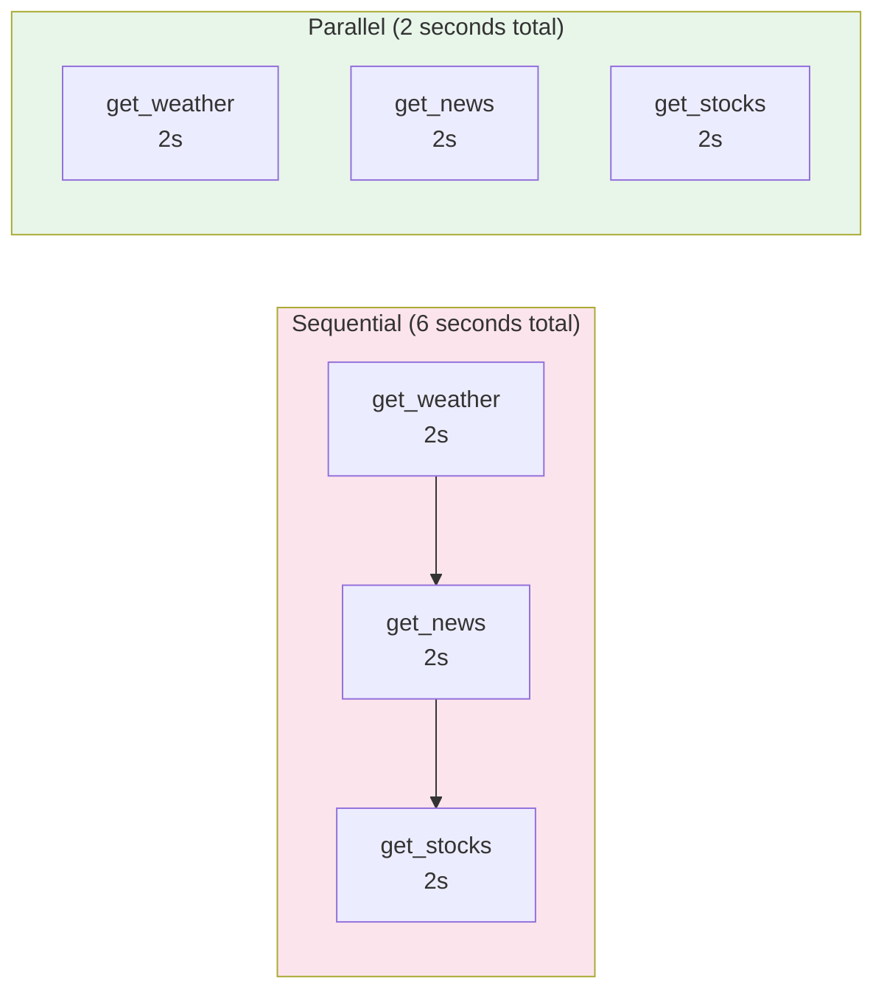

# Async Execution

## Introduction

Many functions you expose to AI models involve I/O operations — querying databases, calling external APIs, reading files, or searching indexes. These operations are slow compared to CPU work, and running them synchronously blocks your entire application while waiting for results. When the model requests multiple function calls in parallel, sequential execution wastes time that concurrent execution could save.

Python's `asyncio` module provides the tools to run I/O-bound functions concurrently. This lesson covers how to integrate `async`/`await` into your function calling pipeline: executing async handlers, running multiple function calls in parallel, handling sync functions in an async context, and managing sequential dependencies where one call depends on another's result.

### What we'll cover

- Why async matters for function calling
- Defining and executing async handler functions
- Parallel execution with `asyncio.gather()` and `TaskGroup`
- Running sync functions in async context with `asyncio.to_thread()`
- Sequential execution for dependent function calls
- Building an async-aware execution layer
- Error handling in concurrent execution

### Prerequisites

- Executing functions ([Lesson 05-01](./01-executing-functions.md))
- Python async/await basics ([Unit 02: Async Programming](../../02-python-for-ai-development/09-async-programming/00-async-programming.md))

---

## Why async matters for function calling

Consider a model that requests three function calls simultaneously — a common pattern when the model needs data from independent sources:



With three I/O-bound functions each taking 2 seconds:
- **Sequential:** 6 seconds total
- **Parallel:** 2 seconds total (3x faster)

In a real application with multiple tool calls per conversation turn, this difference compounds quickly.

---

## Defining async handler functions

An async handler is a coroutine function defined with `async def`. It can `await` I/O operations without blocking:

```python
import asyncio
import aiohttp

async def get_weather(location: str) -> dict:
    """Fetch current weather from an API."""
    async with aiohttp.ClientSession() as session:
        async with session.get(
            "https://api.weatherapi.com/v1/current.json",
            params={"key": "YOUR_KEY", "q": location}
        ) as resp:
            data = await resp.json()
            return {
                "location": location,
                "temperature": data["current"]["temp_c"],
                "condition": data["current"]["condition"]["text"]
            }

async def search_database(query: str, limit: int = 10) -> dict:
    """Search a database asynchronously."""
    # Simulated async database query
    await asyncio.sleep(0.5)  # Simulates DB latency
    return {
        "query": query,
        "results": [{"id": 1, "title": f"Result for '{query}'"}],
        "count": 1
    }
```

### Executing a single async handler

```python
import asyncio
import json

async def execute_async_function(func, args: dict) -> dict:
    """Execute an async handler function."""
    if asyncio.iscoroutinefunction(func):
        return await func(**args)
    else:
        # Sync function — just call it normally
        return func(**args)

# Usage
async def main():
    result = await execute_async_function(
        search_database,
        {"query": "machine learning", "limit": 5}
    )
    print(json.dumps(result, indent=2))

asyncio.run(main())
```

**Output:**
```json
{
  "query": "machine learning",
  "results": [{"id": 1, "title": "Result for 'machine learning'"}],
  "count": 1
}
```

---

## Parallel execution with `asyncio.gather()`

When the model requests multiple independent function calls, execute them concurrently:

```python
import asyncio
import json
import time

# Simulated async functions (each takes ~1 second)
async def get_weather(location: str) -> dict:
    await asyncio.sleep(1)  # Simulates API call
    return {"location": location, "temperature": 22, "condition": "sunny"}

async def get_news(topic: str, count: int = 3) -> dict:
    await asyncio.sleep(1)  # Simulates API call
    return {"topic": topic, "articles": [{"title": f"News about {topic}"}]}

async def get_stock_price(symbol: str) -> dict:
    await asyncio.sleep(1)  # Simulates API call
    return {"symbol": symbol, "price": 185.50, "currency": "USD"}

async def execute_parallel(calls: list[tuple[callable, dict]]) -> list[dict]:
    """Execute multiple function calls concurrently."""
    tasks = [func(**args) for func, args in calls]
    results = await asyncio.gather(*tasks)
    return list(results)

async def main():
    # Three parallel function calls from the model
    calls = [
        (get_weather, {"location": "Tokyo"}),
        (get_news, {"topic": "AI", "count": 5}),
        (get_stock_price, {"symbol": "AAPL"}),
    ]
    
    start = time.monotonic()
    results = await execute_parallel(calls)
    elapsed = time.monotonic() - start
    
    for result in results:
        print(json.dumps(result))
    print(f"\nTotal time: {elapsed:.2f}s (instead of ~3s sequential)")

asyncio.run(main())
```

**Output:**
```
{"location": "Tokyo", "temperature": 22, "condition": "sunny"}
{"topic": "AI", "articles": [{"title": "News about AI"}]}
{"symbol": "AAPL", "price": 185.5, "currency": "USD"}

Total time: 1.00s (instead of ~3s sequential)
```

> **Note:** `asyncio.gather()` preserves the order of results — they match the order of the input tasks, regardless of which finishes first.

---

## Using `TaskGroup` (Python 3.11+)

`TaskGroup` provides structured concurrency with better error handling than `gather()`. If any task fails, all remaining tasks are cancelled:

```python
import asyncio

async def execute_with_taskgroup(calls: list[tuple[callable, dict]]) -> list[dict]:
    """Execute calls concurrently using TaskGroup."""
    results = [None] * len(calls)
    
    async with asyncio.TaskGroup() as tg:
        for i, (func, args) in enumerate(calls):
            async def run(idx=i, f=func, a=args):
                results[idx] = await f(**a)
            tg.create_task(run())
    
    return results

async def main():
    calls = [
        (get_weather, {"location": "Paris"}),
        (get_news, {"topic": "technology"}),
        (get_stock_price, {"symbol": "GOOGL"}),
    ]
    
    results = await execute_with_taskgroup(calls)
    for result in results:
        print(result)

asyncio.run(main())
```

**Output:**
```
{'location': 'Paris', 'temperature': 22, 'condition': 'sunny'}
{'topic': 'technology', 'articles': [{'title': 'News about technology'}]}
{'symbol': 'GOOGL', 'price': 185.5, 'currency': 'USD'}
```

### `gather()` vs `TaskGroup`

| Feature | `asyncio.gather()` | `asyncio.TaskGroup` |
|---------|--------------------|--------------------|
| Python version | 3.4+ | 3.11+ |
| Error handling | First exception propagates; others continue | All tasks cancelled on first error |
| Cancellation | Manual via `gather.cancel()` | Automatic — structured concurrency |
| Return exceptions | `return_exceptions=True` collects all | Use `except*` for exception groups |
| Best for | Independent tasks where partial results OK | Tasks that should all succeed or all fail |

---

## Running sync functions in async context

Not all your handler functions will be async. Database libraries, file I/O wrappers, or third-party SDKs might be synchronous. Use `asyncio.to_thread()` to run them without blocking the event loop:

```python
import asyncio
import time

# Sync function — blocks during execution
def query_legacy_database(sql: str) -> dict:
    """Sync database query (legacy system)."""
    time.sleep(1)  # Simulates blocking I/O
    return {"sql": sql, "rows": [{"id": 1, "name": "Alice"}]}

# Sync function — CPU-bound computation
def calculate_risk_score(portfolio_id: str) -> dict:
    """CPU-intensive risk calculation."""
    time.sleep(0.5)  # Simulates computation
    return {"portfolio_id": portfolio_id, "risk_score": 0.73}

async def execute_function_auto(func, args: dict) -> dict:
    """Execute any function — auto-detects sync vs async."""
    if asyncio.iscoroutinefunction(func):
        return await func(**args)
    else:
        # Run sync function in a thread to avoid blocking
        return await asyncio.to_thread(func, **args)

async def main():
    # Mix of async and sync functions — all run concurrently
    tasks = [
        execute_function_auto(get_weather, {"location": "Berlin"}),        # async
        execute_function_auto(query_legacy_database, {"sql": "SELECT *"}),  # sync → thread
        execute_function_auto(calculate_risk_score, {"portfolio_id": "P1"}), # sync → thread
    ]
    
    start = time.monotonic()
    results = await asyncio.gather(*tasks)
    elapsed = time.monotonic() - start
    
    for r in results:
        print(r)
    print(f"\nTotal: {elapsed:.2f}s")

asyncio.run(main())
```

**Output:**
```
{'location': 'Berlin', 'temperature': 22, 'condition': 'sunny'}
{'sql': 'SELECT *', 'rows': [{'id': 1, 'name': 'Alice'}]}
{'portfolio_id': 'P1', 'risk_score': 0.73}

Total: 1.00s
```

> **Warning:** `asyncio.to_thread()` runs the function in a separate OS thread. This works well for I/O-bound operations. For CPU-bound functions, Python's GIL means you won't get true parallelism — consider `ProcessPoolExecutor` for heavy computation.

---

## Sequential execution for dependent calls

Sometimes function calls are dependent — the second call needs the first call's result. The model handles this through multiple conversation rounds, but within a single execution step, you might need to handle dependencies:

```python
import asyncio

async def get_user_profile(user_id: str) -> dict:
    """Fetch user profile from database."""
    await asyncio.sleep(0.3)
    return {"user_id": user_id, "name": "Alice", "tier": "premium", "region": "us-east"}

async def get_tier_pricing(tier: str, region: str) -> dict:
    """Get pricing based on user tier and region."""
    await asyncio.sleep(0.3)
    pricing = {
        ("premium", "us-east"): {"monthly": 29.99, "annual": 299.99},
        ("basic", "us-east"): {"monthly": 9.99, "annual": 99.99},
    }
    return pricing.get((tier, region), {"monthly": 19.99, "annual": 199.99})

async def execute_dependent_calls():
    """Execute calls where the second depends on the first."""
    # Step 1: Get user profile
    profile = await get_user_profile("user_123")
    print(f"Step 1: {profile}")
    
    # Step 2: Use profile data for the next call
    pricing = await get_tier_pricing(
        tier=profile["tier"],
        region=profile["region"]
    )
    print(f"Step 2: {pricing}")
    
    return {"profile": profile, "pricing": pricing}

asyncio.run(execute_dependent_calls())
```

**Output:**
```
Step 1: {'user_id': 'user_123', 'name': 'Alice', 'tier': 'premium', 'region': 'us-east'}
Step 2: {'monthly': 29.99, 'annual': 299.99}
```

### Mixed parallel and sequential

Real-world scenarios often combine both patterns:

```python
async def execute_mixed(user_id: str):
    """Some calls are parallel, some are sequential."""
    # Step 1: These three are independent — run in parallel
    profile, orders, notifications = await asyncio.gather(
        get_user_profile(user_id),
        get_news(topic="user updates"),     # Independent
        get_stock_price(symbol="AAPL"),      # Independent
    )
    
    # Step 2: This depends on Step 1's profile result
    pricing = await get_tier_pricing(
        tier=profile["tier"],
        region=profile["region"]
    )
    
    return {
        "profile": profile,
        "orders": orders,
        "notifications": notifications,
        "pricing": pricing
    }
```

---

## Async-aware execution layer

Here's a complete execution layer that handles async functions, sync functions, parallel calls, and error collection:

```python
import asyncio
import json
import time
import logging
from dataclasses import dataclass, field
from typing import Callable

logger = logging.getLogger(__name__)

@dataclass
class AsyncCallResult:
    """Result of an async function execution."""
    call_id: str
    name: str
    output: str
    is_error: bool = False
    execution_time_ms: float = 0

async def execute_single(
    func: Callable,
    args: dict,
    call_id: str,
    name: str,
) -> AsyncCallResult:
    """Execute a single function (sync or async) with timing."""
    start = time.monotonic()
    
    try:
        if asyncio.iscoroutinefunction(func):
            result = await func(**args)
        else:
            result = await asyncio.to_thread(func, **args)
        
        elapsed = (time.monotonic() - start) * 1000
        
        return AsyncCallResult(
            call_id=call_id,
            name=name,
            output=json.dumps(result),
            execution_time_ms=round(elapsed, 2)
        )
    
    except Exception as e:
        elapsed = (time.monotonic() - start) * 1000
        logger.error(f"Function {name} failed: {e}")
        
        return AsyncCallResult(
            call_id=call_id,
            name=name,
            output=json.dumps({"error": f"{type(e).__name__}: {e}"}),
            is_error=True,
            execution_time_ms=round(elapsed, 2)
        )

async def execute_all_parallel(
    calls: list[dict],
    registry: dict[str, Callable],
) -> list[AsyncCallResult]:
    """Execute all function calls in parallel."""
    tasks = []
    
    for call in calls:
        func = registry.get(call["name"])
        if func is None:
            # Return error immediately for unknown functions
            tasks.append(asyncio.coroutine(lambda c=call: AsyncCallResult(
                call_id=c["call_id"],
                name=c["name"],
                output=json.dumps({"error": f"Unknown function: {c['name']}"}),
                is_error=True
            ))())
        else:
            tasks.append(
                execute_single(func, call["args"], call["call_id"], call["name"])
            )
    
    results = await asyncio.gather(*tasks, return_exceptions=True)
    
    # Handle any unexpected exceptions from gather
    final = []
    for i, result in enumerate(results):
        if isinstance(result, Exception):
            final.append(AsyncCallResult(
                call_id=calls[i]["call_id"],
                name=calls[i]["name"],
                output=json.dumps({"error": str(result)}),
                is_error=True
            ))
        else:
            final.append(result)
    
    return final

# Usage
async def main():
    registry = {
        "get_weather": get_weather,
        "get_news": get_news,
        "get_stock_price": get_stock_price,
    }
    
    # Simulated parallel calls from the model
    calls = [
        {"name": "get_weather", "args": {"location": "NYC"}, "call_id": "call_1"},
        {"name": "get_news", "args": {"topic": "AI"}, "call_id": "call_2"},
        {"name": "get_stock_price", "args": {"symbol": "MSFT"}, "call_id": "call_3"},
    ]
    
    start = time.monotonic()
    results = await execute_all_parallel(calls, registry)
    elapsed = time.monotonic() - start
    
    for r in results:
        status = "ERROR" if r.is_error else "OK"
        print(f"[{status}] {r.name} ({r.execution_time_ms}ms): {r.output}")
    
    print(f"\nTotal wall time: {elapsed:.2f}s")

asyncio.run(main())
```

**Output:**
```
[OK] get_weather (1001.23ms): {"location": "NYC", "temperature": 22, "condition": "sunny"}
[OK] get_news (1000.89ms): {"topic": "AI", "articles": [{"title": "News about AI"}]}
[OK] get_stock_price (1001.15ms): {"symbol": "MSFT", "price": 185.5, "currency": "USD"}

Total wall time: 1.00s
```

---

## Best practices

| Practice | Why It Matters |
|----------|----------------|
| Use `asyncio.iscoroutinefunction()` to auto-detect | Your execution layer works with both sync and async handlers |
| Use `asyncio.to_thread()` for sync functions | Prevents blocking the event loop during I/O operations |
| Use `asyncio.gather()` with `return_exceptions=True` | Collects all results including errors, doesn't stop on first failure |
| Use `TaskGroup` when all-or-nothing is needed | Automatically cancels remaining tasks if one fails |
| Measure wall time with `time.monotonic()` | More accurate than `time.time()` for performance measurement |
| Keep strong references to background tasks | Weak-referenced tasks can be garbage collected mid-execution |

---

## Common pitfalls

| ❌ Mistake | ✅ Solution |
|-----------|-------------|
| Calling `await` on a sync function | Check with `asyncio.iscoroutinefunction()` first |
| Running sync I/O in async context without threading | Use `asyncio.to_thread()` to avoid blocking |
| Assuming `gather()` cancels on error | It doesn't by default — use `TaskGroup` for cancellation |
| Not handling `ExceptionGroup` from `TaskGroup` | Use `except*` syntax (Python 3.11+) to catch grouped exceptions |
| Executing dependent calls in parallel | Identify dependencies and run those sequentially |
| Forgetting to `await` coroutines | Unawaited coroutines produce `RuntimeWarning` and never execute |

---

## Hands-on exercise

### Your task

Build an async function execution system that processes a batch of model function calls, executing independent calls in parallel and dependent calls sequentially.

### Requirements

1. Define four async functions: `get_user(user_id)`, `get_orders(user_id)`, `get_recommendations(user_id, order_history)`, and `get_weather(location)`
2. `get_recommendations` depends on `get_orders` output — it must run after
3. `get_user`, `get_orders`, and `get_weather` are independent — run them in parallel
4. After the parallel batch, run `get_recommendations` with the orders result
5. Measure and print total wall time — it should be close to the slowest parallel call + the sequential call

### Expected result

Four results returned in approximately 2 seconds (not 4 seconds), with `get_recommendations` using data from `get_orders`.

<details>
<summary>💡 Hints (click to expand)</summary>

- Use `asyncio.gather()` for the first three independent calls
- Extract the orders result from gather, then pass it to `get_recommendations`
- Each function should `await asyncio.sleep(1)` to simulate network latency
- Time the total with `time.monotonic()`
</details>

<details>
<summary>✅ Solution (click to expand)</summary>

```python
import asyncio
import json
import time

async def get_user(user_id: str) -> dict:
    await asyncio.sleep(1)
    return {"user_id": user_id, "name": "Alice", "location": "Seattle"}

async def get_orders(user_id: str) -> dict:
    await asyncio.sleep(1)
    return {
        "user_id": user_id,
        "orders": [
            {"id": "ord_1", "product": "Laptop", "amount": 999.99},
            {"id": "ord_2", "product": "Mouse", "amount": 29.99},
        ]
    }

async def get_recommendations(user_id: str, order_history: list) -> dict:
    await asyncio.sleep(1)
    # Recommendations based on purchase history
    products = [o["product"] for o in order_history]
    return {
        "user_id": user_id,
        "based_on": products,
        "recommendations": ["Keyboard", "Monitor Stand", "USB Hub"]
    }

async def get_weather(location: str) -> dict:
    await asyncio.sleep(1)
    return {"location": location, "temperature": 15, "condition": "cloudy"}

async def main():
    start = time.monotonic()
    
    # Phase 1: Independent calls in parallel
    user, orders, weather = await asyncio.gather(
        get_user("user_123"),
        get_orders("user_123"),
        get_weather("Seattle"),
    )
    
    # Phase 2: Dependent call — needs orders from Phase 1
    recommendations = await get_recommendations(
        user_id="user_123",
        order_history=orders["orders"]
    )
    
    elapsed = time.monotonic() - start
    
    print("User:", json.dumps(user))
    print("Orders:", json.dumps(orders))
    print("Weather:", json.dumps(weather))
    print("Recommendations:", json.dumps(recommendations))
    print(f"\nTotal: {elapsed:.2f}s (parallel phase: ~1s + sequential: ~1s)")

asyncio.run(main())
```

**Output:**
```
User: {"user_id": "user_123", "name": "Alice", "location": "Seattle"}
Orders: {"user_id": "user_123", "orders": [{"id": "ord_1", "product": "Laptop", "amount": 999.99}, {"id": "ord_2", "product": "Mouse", "amount": 29.99}]}
Weather: {"location": "Seattle", "temperature": 15, "condition": "cloudy"}
Recommendations: {"user_id": "user_123", "based_on": ["Laptop", "Mouse"], "recommendations": ["Keyboard", "Monitor Stand", "USB Hub"]}

Total: 2.00s (parallel phase: ~1s + sequential: ~1s)
```
</details>

### Bonus challenges

- [ ] Add error handling with `return_exceptions=True` — what happens if `get_orders` fails but others succeed?
- [ ] Implement `TaskGroup` version that cancels everything if orders fail (since recommendations depend on it)
- [ ] Add a sync function (`calculate_tax`) and use `asyncio.to_thread()` to include it in the parallel batch

---

## Summary

✅ Use `async def` for I/O-bound handler functions to enable concurrent execution

✅ Execute independent parallel function calls with `asyncio.gather()` — results maintain input order

✅ Use `asyncio.to_thread()` to run sync functions without blocking the event loop

✅ Use `asyncio.iscoroutinefunction()` to auto-detect sync vs async handlers in a unified execution layer

✅ Identify dependent calls and execute them sequentially after the parallel batch completes

✅ Use `TaskGroup` (Python 3.11+) when all tasks must succeed or all must be cancelled

**Next:** [Timeout Management →](./04-timeout-management.md) — Setting time limits on function executions to prevent runaway operations

---

[← Previous: Automatic Function Calling](./02-automatic-function-calling.md) | [Next: Timeout Management →](./04-timeout-management.md)

<!-- 
Sources Consulted:
- Python asyncio Tasks and Coroutines: https://docs.python.org/3/library/asyncio-task.html
- Python asyncio.to_thread: https://docs.python.org/3/library/asyncio-task.html#asyncio.to_thread
- Python asyncio.TaskGroup: https://docs.python.org/3/library/asyncio-task.html#task-groups
- Python asyncio.gather: https://docs.python.org/3/library/asyncio-task.html#asyncio.gather
- OpenAI Function Calling: https://platform.openai.com/docs/guides/function-calling
-->
