# Timeout Management

## Introduction

A function that calls an external API might hang indefinitely if the server stops responding. A database query could run for minutes on a poorly indexed table. A file download might stall mid-stream. Without timeouts, a single slow function call blocks your entire function calling loop, leaving the user staring at a spinner while your application waits for a response that may never come.

Timeout management is about setting time limits on function executions, handling the cases when those limits are exceeded, deciding what to tell the model when a function times out, and managing partial results from operations that started but didn't finish.

### What we'll cover

- Why timeouts are critical for function calling
- Using `asyncio.timeout()` for async functions
- Using `asyncio.wait_for()` as an alternative
- Wrapping sync functions with thread-based timeouts
- Handling `TimeoutError` gracefully
- Partial result strategies
- Communicating timeouts to the model
- Per-function timeout configuration

### Prerequisites

- Async execution ([Lesson 05-03](./03-async-execution.md))
- Error handling philosophy ([Lesson 04-08](../04-handling-function-calls/08-error-handling.md))

---

## Why timeouts matter

Without timeouts, a single slow tool can cascade through your system:

```mermaid
flowchart TD
    A[Model requests<br/>3 function calls] --> B[Call 1: get_weather<br/>200ms ✅]
    A --> C[Call 2: search_database<br/>∞ — hangs forever ❌]
    A --> D[Call 3: get_stock<br/>300ms ✅]
    
    C --> E[User waits...]
    E --> F[Connection timeout<br/>after 30+ seconds]
    F --> G[User abandons<br/>conversation]
    
    style C fill:#fce4ec
    style E fill:#fce4ec
    style G fill:#fce4ec
```



With timeouts:

```mermaid
flowchart TD
    A[Model requests<br/>3 function calls] --> B[Call 1: get_weather<br/>200ms ✅]
    A --> C[Call 2: search_database<br/>5s timeout ⏱️]
    A --> D[Call 3: get_stock<br/>300ms ✅]
    
    C --> E[TimeoutError caught]
    E --> F[Return error result<br/>to model]
    F --> G[Model explains:<br/>'Search is slow,<br/>try again later']
    
    style C fill:#fff3e0
    style F fill:#e8f5e9
    style G fill:#e8f5e9
```



---

## `asyncio.timeout()` — the modern approach

Python 3.11+ provides `asyncio.timeout()` as an async context manager. It cancels the enclosed operation if it exceeds the time limit:

```python
import asyncio
import json

async def slow_database_query(query: str) -> dict:
    """Simulates a slow database query."""
    await asyncio.sleep(10)  # Takes 10 seconds
    return {"query": query, "results": [{"id": 1}]}

async def execute_with_timeout(func, args: dict, timeout_seconds: float) -> dict:
    """Execute an async function with a timeout."""
    try:
        async with asyncio.timeout(timeout_seconds):
            result = await func(**args)
            return {"status": "success", "data": result}
    
    except TimeoutError:
        return {
            "status": "timeout",
            "error": f"Function timed out after {timeout_seconds}s",
            "timeout_seconds": timeout_seconds
        }

async def main():
    # This will timeout — function takes 10s, limit is 3s
    result = await execute_with_timeout(
        slow_database_query,
        {"query": "SELECT * FROM large_table"},
        timeout_seconds=3.0
    )
    print(json.dumps(result, indent=2))

asyncio.run(main())
```

**Output:**
```json
{
  "status": "timeout",
  "error": "Function timed out after 3.0s",
  "timeout_seconds": 3.0
}
```

> **Note:** `asyncio.timeout()` works by cancelling the task internally and converting the `CancelledError` to a `TimeoutError`. The `TimeoutError` can **only** be caught **outside** the `async with` block.

---

## `asyncio.wait_for()` — the classic approach

Available since Python 3.4, `wait_for()` wraps a single awaitable with a timeout:

```python
import asyncio

async def external_api_call(endpoint: str) -> dict:
    """Call an external API that might be slow."""
    await asyncio.sleep(8)  # Simulates slow API
    return {"endpoint": endpoint, "data": {"status": "ok"}}

async def main():
    try:
        result = await asyncio.wait_for(
            external_api_call("/api/data"),
            timeout=2.0
        )
        print(f"Success: {result}")
    
    except TimeoutError:
        print("API call timed out after 2 seconds")

asyncio.run(main())
```

**Output:**
```
API call timed out after 2 seconds
```

### `timeout()` vs `wait_for()`

| Feature | `asyncio.timeout()` | `asyncio.wait_for()` |
|---------|---------------------|---------------------|
| Python version | 3.11+ | 3.4+ |
| Syntax | Context manager (`async with`) | Function wrapping awaitable |
| Rescheduling | ✅ `cm.reschedule(new_deadline)` | ❌ |
| Nesting | ✅ Safe to nest | ⚠️ Potential issues |
| Dynamic timeout | ✅ `timeout(None)` then reschedule | ❌ Must know timeout upfront |
| Recommended | ✅ Modern code | Legacy compatibility |

---

## Timeouts for sync functions

Sync functions run in threads via `asyncio.to_thread()`. You can wrap the threaded call with a timeout:

```python
import asyncio
import time

def blocking_file_operation(path: str) -> dict:
    """Sync function that might take too long."""
    time.sleep(15)  # Simulates slow file processing
    return {"path": path, "size_mb": 42}

async def execute_sync_with_timeout(func, args: dict, timeout_seconds: float) -> dict:
    """Run a sync function in a thread with a timeout."""
    try:
        async with asyncio.timeout(timeout_seconds):
            result = await asyncio.to_thread(func, **args)
            return {"status": "success", "data": result}
    
    except TimeoutError:
        return {
            "status": "timeout",
            "error": f"Sync function timed out after {timeout_seconds}s"
        }

async def main():
    result = await execute_sync_with_timeout(
        blocking_file_operation,
        {"path": "/data/large_file.csv"},
        timeout_seconds=5.0
    )
    print(result)

asyncio.run(main())
```

**Output:**
```
{'status': 'timeout', 'error': 'Sync function timed out after 5.0s'}
```

> **Warning:** When a sync function running in a thread times out, `asyncio.timeout()` cancels the **awaiting task**, but the thread itself **continues running** in the background. The sync function will run to completion even though your code has moved on. For truly cancellable operations, you need to check a cancellation flag inside the sync function.

### Cancellable sync functions

```python
import threading

def cancellable_download(url: str, cancel_event: threading.Event) -> dict:
    """A sync function that checks for cancellation."""
    total_chunks = 10
    downloaded = 0
    
    for i in range(total_chunks):
        if cancel_event.is_set():
            return {
                "status": "cancelled",
                "downloaded_chunks": downloaded,
                "total_chunks": total_chunks
            }
        time.sleep(1)  # Download one chunk
        downloaded += 1
    
    return {"status": "complete", "downloaded_chunks": total_chunks}

async def download_with_timeout(url: str, timeout_seconds: float) -> dict:
    """Download with cancellation support."""
    cancel = threading.Event()
    
    try:
        async with asyncio.timeout(timeout_seconds):
            result = await asyncio.to_thread(
                cancellable_download, url, cancel
            )
            return result
    
    except TimeoutError:
        cancel.set()  # Signal the thread to stop
        return {"status": "timeout", "error": f"Download timed out after {timeout_seconds}s"}
```

---

## Per-function timeout configuration

Different functions have different expected execution times. A weather API might respond in 500ms, while a database aggregation might need 30 seconds:

```python
from dataclasses import dataclass
from typing import Callable, Optional

@dataclass
class FunctionConfig:
    """Configuration for a registered function."""
    handler: Callable
    timeout_seconds: float = 10.0
    description: str = ""
    requires_context: bool = False

class TimeoutRegistry:
    """Function registry with per-function timeout configuration."""
    
    def __init__(self, default_timeout: float = 10.0):
        self._functions: dict[str, FunctionConfig] = {}
        self._default_timeout = default_timeout
    
    def register(
        self,
        name: str,
        handler: Callable,
        timeout_seconds: Optional[float] = None,
        description: str = "",
        requires_context: bool = False,
    ):
        self._functions[name] = FunctionConfig(
            handler=handler,
            timeout_seconds=timeout_seconds or self._default_timeout,
            description=description,
            requires_context=requires_context,
        )
    
    def get(self, name: str) -> Optional[FunctionConfig]:
        return self._functions.get(name)
    
    async def execute(self, name: str, args: dict) -> dict:
        """Execute a function with its configured timeout."""
        config = self.get(name)
        if config is None:
            return {"error": f"Unknown function: {name}"}
        
        try:
            async with asyncio.timeout(config.timeout_seconds):
                if asyncio.iscoroutinefunction(config.handler):
                    result = await config.handler(**args)
                else:
                    result = await asyncio.to_thread(config.handler, **args)
                
                return {"status": "success", "data": result}
        
        except TimeoutError:
            return {
                "status": "timeout",
                "error": f"{name} timed out after {config.timeout_seconds}s",
                "function": name,
                "timeout_seconds": config.timeout_seconds
            }
        except Exception as e:
            return {
                "status": "error",
                "error": f"{type(e).__name__}: {e}",
                "function": name
            }

# Configure different timeouts per function
registry = TimeoutRegistry(default_timeout=10.0)

registry.register("get_weather", get_weather_api, timeout_seconds=3.0)
registry.register("search_database", search_large_table, timeout_seconds=30.0)
registry.register("send_email", send_notification, timeout_seconds=5.0)
registry.register("generate_report", build_pdf_report, timeout_seconds=60.0)
```

---

## Communicating timeouts to the model

When a function times out, the model needs to know what happened so it can respond appropriately. The error message should be clear, actionable, and suggest alternatives:

```python
import json

def format_timeout_result(
    function_name: str,
    timeout_seconds: float,
    suggestion: str = ""
) -> str:
    """Format a timeout error for the model to understand."""
    result = {
        "error": "timeout",
        "message": f"The {function_name} function did not complete within {timeout_seconds} seconds.",
        "suggestion": suggestion or f"Try again with simpler parameters or ask the user to wait.",
    }
    return json.dumps(result)

# Example: Send timeout result back to OpenAI
def build_timeout_response_openai(call_id: str, func_name: str, timeout: float) -> dict:
    return {
        "type": "function_call_output",
        "call_id": call_id,
        "output": format_timeout_result(
            func_name, timeout,
            suggestion="The database is under heavy load. Try narrowing the search criteria."
        )
    }

# Example: Send timeout result back to Anthropic
def build_timeout_response_anthropic(tool_use_id: str, func_name: str, timeout: float) -> dict:
    return {
        "type": "tool_result",
        "tool_use_id": tool_use_id,
        "content": format_timeout_result(
            func_name, timeout,
            suggestion="The search is taking too long. Try a more specific query."
        ),
        "is_error": True
    }

# The model sees this and can explain to the user:
print(format_timeout_result("search_database", 30.0, "Try a more specific query."))
```

**Output:**
```json
{"error": "timeout", "message": "The search_database function did not complete within 30.0 seconds.", "suggestion": "Try a more specific query."}
```

> **🤖 AI Context:** Models are surprisingly good at handling timeout errors gracefully. When they receive a timeout result, they typically explain the situation to the user and suggest alternatives — like narrowing a search, trying a different approach, or asking the user to wait while they retry.

---

## Timeout with parallel execution

When running multiple calls in parallel, each should have its own timeout:

```python
import asyncio
import json

async def execute_parallel_with_timeouts(
    calls: list[dict],
    registry: TimeoutRegistry,
) -> list[dict]:
    """Execute calls in parallel, each with its own timeout."""
    
    async def run_one(call: dict) -> dict:
        result = await registry.execute(call["name"], call["args"])
        result["call_id"] = call["call_id"]
        return result
    
    tasks = [run_one(call) for call in calls]
    results = await asyncio.gather(*tasks, return_exceptions=True)
    
    final = []
    for i, result in enumerate(results):
        if isinstance(result, Exception):
            final.append({
                "call_id": calls[i]["call_id"],
                "status": "error",
                "error": str(result)
            })
        else:
            final.append(result)
    
    return final

# Usage
async def main():
    calls = [
        {"name": "get_weather", "args": {"location": "NYC"}, "call_id": "c1"},   # 3s timeout
        {"name": "search_database", "args": {"query": "sales"}, "call_id": "c2"}, # 30s timeout
        {"name": "send_email", "args": {"to": "user@example.com"}, "call_id": "c3"}, # 5s timeout
    ]
    
    results = await execute_parallel_with_timeouts(calls, registry)
    for r in results:
        print(json.dumps(r))
```

Each function respects its own configured timeout, and a timeout in one function doesn't cancel the others (unlike `TaskGroup`).

---

## Best practices

| Practice | Why It Matters |
|----------|----------------|
| Set different timeouts per function | A weather API (3s) and a report generator (60s) have different needs |
| Always have a timeout, even if generous | Prevents infinite hangs from crashing your application |
| Include function name and timeout in error messages | Helps the model explain what happened |
| Add suggestions to timeout errors | Guides the model toward actionable alternatives |
| Use `asyncio.timeout()` over `wait_for()` | Modern, nestable, reschedulable — the recommended approach |
| Implement cancellation for sync functions | Thread-based timeouts don't actually stop the thread |

---

## Common pitfalls

| ❌ Mistake | ✅ Solution |
|-----------|-------------|
| No timeout at all — functions can hang forever | Always wrap execution in `asyncio.timeout()` or `wait_for()` |
| Same timeout for all functions | Configure per-function timeouts based on expected execution time |
| Catching `TimeoutError` inside `async with asyncio.timeout()` | Catch it **outside** the context manager block |
| Assuming sync thread stops on timeout | The thread keeps running; use `threading.Event` for cancellation |
| Generic timeout messages like "operation timed out" | Include function name, timeout duration, and a suggestion |
| Setting timeouts too aggressively | Profile normal execution times and set timeouts at 2-3x the p95 |

---

## Hands-on exercise

### Your task

Build a timeout-aware function execution system with per-function configuration and structured timeout reporting.

### Requirements

1. Create a `TimeoutRegistry` with three functions:
   - `fast_api(query: str)` — 200ms latency, 2s timeout
   - `medium_query(table: str)` — 3s latency, 5s timeout
   - `slow_report(report_type: str)` — 15s latency, 10s timeout (will timeout)
2. Execute all three in parallel
3. The `slow_report` should timeout and return a structured error
4. The other two should succeed
5. Format all results for sending back to the model

### Expected result

Two successes and one timeout error, all returned in under 10 seconds.

<details>
<summary>💡 Hints (click to expand)</summary>

- Use `asyncio.sleep()` to simulate different latencies
- Put per-function timeouts in the registry configuration
- Use `asyncio.gather()` to run all three in parallel
- Format timeout errors with the function name and suggestion
</details>

<details>
<summary>✅ Solution (click to expand)</summary>

```python
import asyncio
import json
import time

async def fast_api(query: str) -> dict:
    await asyncio.sleep(0.2)
    return {"query": query, "result": "API data", "latency_ms": 200}

async def medium_query(table: str) -> dict:
    await asyncio.sleep(3)
    return {"table": table, "rows": 1542, "latency_ms": 3000}

async def slow_report(report_type: str) -> dict:
    await asyncio.sleep(15)  # Will exceed timeout
    return {"report_type": report_type, "pages": 50}

# Registry with per-function timeouts
configs = {
    "fast_api":     {"handler": fast_api, "timeout": 2.0},
    "medium_query": {"handler": medium_query, "timeout": 5.0},
    "slow_report":  {"handler": slow_report, "timeout": 10.0},
}

async def execute_with_config(name: str, args: dict, call_id: str) -> dict:
    config = configs[name]
    start = time.monotonic()
    
    try:
        async with asyncio.timeout(config["timeout"]):
            result = await config["handler"](**args)
            elapsed = (time.monotonic() - start) * 1000
            return {
                "call_id": call_id,
                "status": "success",
                "data": result,
                "execution_ms": round(elapsed, 1)
            }
    except TimeoutError:
        elapsed = (time.monotonic() - start) * 1000
        return {
            "call_id": call_id,
            "status": "timeout",
            "error": f"{name} timed out after {config['timeout']}s",
            "suggestion": "Try with simpler parameters or retry later.",
            "execution_ms": round(elapsed, 1)
        }

async def main():
    calls = [
        ("fast_api", {"query": "weather"}, "c1"),
        ("medium_query", {"table": "orders"}, "c2"),
        ("slow_report", {"report_type": "annual"}, "c3"),
    ]
    
    start = time.monotonic()
    results = await asyncio.gather(
        *[execute_with_config(n, a, c) for n, a, c in calls]
    )
    total = time.monotonic() - start
    
    for r in results:
        status = "✅" if r["status"] == "success" else "⏱️"
        print(f"{status} {r['call_id']}: {json.dumps(r)}")
    
    print(f"\nTotal wall time: {total:.2f}s")

asyncio.run(main())
```

**Output:**
```
✅ c1: {"call_id": "c1", "status": "success", "data": {"query": "weather", "result": "API data", "latency_ms": 200}, "execution_ms": 201.2}
✅ c2: {"call_id": "c2", "status": "success", "data": {"table": "orders", "rows": 1542, "latency_ms": 3000}, "execution_ms": 3001.5}
⏱️ c3: {"call_id": "c3", "status": "timeout", "error": "slow_report timed out after 10.0s", "suggestion": "Try with simpler parameters or retry later.", "execution_ms": 10001.3}

Total wall time: 10.00s
```
</details>

### Bonus challenges

- [ ] Add a `retry_on_timeout` option that automatically retries once with double the timeout
- [ ] Implement a global timeout for the entire batch of parallel calls (e.g., 15s max for all)
- [ ] Track timeout rates per function and automatically increase timeouts for frequently-timing-out functions

---

## Summary

✅ Always set timeouts on function executions — a missing timeout can hang your entire application

✅ Use `asyncio.timeout()` (Python 3.11+) as the modern, nestable approach to time limits

✅ Configure per-function timeouts based on expected execution time — don't use one size for all

✅ Sync functions running in threads don't actually stop on timeout — use `threading.Event` for cancellation

✅ Communicate timeouts to the model with structured error messages including function name and suggestions

**Next:** [Resource Cleanup →](./05-resource-cleanup.md) — Managing connections, file handles, and transactions during function execution

---

[← Previous: Async Execution](./03-async-execution.md) | [Next: Resource Cleanup →](./05-resource-cleanup.md)

<!-- 
Sources Consulted:
- Python asyncio.timeout: https://docs.python.org/3/library/asyncio-task.html#asyncio.timeout
- Python asyncio.wait_for: https://docs.python.org/3/library/asyncio-task.html#asyncio.wait_for
- Python asyncio.to_thread: https://docs.python.org/3/library/asyncio-task.html#asyncio.to_thread
- Python threading.Event: https://docs.python.org/3/library/threading.html#event-objects
- OpenAI Function Calling: https://platform.openai.com/docs/guides/function-calling
-->
