# Resource Cleanup

## Introduction

Functions that query databases open connections. Functions that generate reports create temporary files. Functions that process payments start transactions. When these functions complete normally, cleanup happens naturally. But when they fail — due to exceptions, timeouts, or cancellation — resources can leak: connections pile up until the pool is exhausted, temp files fill the disk, and uncommitted transactions hold locks that block other operations.

In function calling, cleanup is especially important because functions run repeatedly in a loop (detect → execute → return → repeat), often under time pressure and with error recovery. Every execution cycle must clean up after itself, whether it succeeds or fails. Python's context managers and `try`/`finally` blocks make this manageable.

### What we'll cover

- Why resource cleanup matters in function calling loops
- `try`/`finally` for guaranteed cleanup
- Context managers (`with` and `async with`)
- Database connection and transaction management
- File handle cleanup
- HTTP session management
- Memory management for large results
- Building cleanup into your execution layer

### Prerequisites

- Async execution ([Lesson 05-03](./03-async-execution.md))
- Timeout management ([Lesson 05-04](./04-timeout-management.md))
- Python context managers ([Unit 02: Python Fundamentals](../../02-python-for-ai-development/01-python-fundamentals/00-python-fundamentals.md))

---

## Why cleanup matters in function calling

In a typical function calling loop, functions execute many times per conversation:

```mermaid
flowchart TD
    A[Conversation starts] --> B[Model calls function 1]
    B --> C[Execute: open DB connection]
    C --> D{Success?}
    
    D -->|Yes| E[Return result<br/>Close connection ✅]
    D -->|No| F[Exception thrown]
    
    F --> G{Connection<br/>closed?}
    G -->|No cleanup| H[Connection leaked! 💀]
    G -->|With cleanup| I[Close connection ✅<br/>Return error]
    
    E --> J[Model calls function 2]
    I --> J
    H --> J
    
    J --> K[Execute: open DB connection]
    K --> L[... repeats 10+ times per conversation]
    
    H --> M[After 10 leaked connections:<br/>Pool exhausted, app crashes]
    
    style H fill:#fce4ec
    style M fill:#fce4ec
    style E fill:#e8f5e9
    style I fill:#e8f5e9
```



A single leaked connection per failed call doesn't seem bad. But multiply it by concurrent users, multi-turn conversations, and functions that fail regularly, and you have a production outage.

---

## `try`/`finally` — guaranteed cleanup

The `try`/`finally` pattern ensures cleanup code runs regardless of whether the function succeeds, fails, or is cancelled:

```python
import asyncio

async def query_with_cleanup(query: str) -> dict:
    """Database query with guaranteed connection cleanup."""
    conn = None
    try:
        # Acquire resource
        conn = await get_db_connection()
        
        # Use resource
        result = await conn.execute(query)
        rows = await result.fetchall()
        
        return {"rows": [dict(row) for row in rows], "count": len(rows)}
    
    except Exception as e:
        return {"error": f"Query failed: {e}"}
    
    finally:
        # Always runs — success, failure, or cancellation
        if conn is not None:
            await conn.close()
            print("Connection closed")

# Simulated version for demonstration
async def get_db_connection():
    """Simulated database connection."""
    class FakeConnection:
        async def execute(self, query):
            await asyncio.sleep(0.1)
            return self
        async def fetchall(self):
            return [{"id": 1, "name": "Alice"}]
        async def close(self):
            pass
    return FakeConnection()

async def main():
    result = await query_with_cleanup("SELECT * FROM users")
    print(result)

asyncio.run(main())
```

**Output:**
```
Connection closed
{'rows': [{'id': 1, 'name': 'Alice'}], 'count': 1}
```

> **Important:** The `finally` block runs even when `asyncio.CancelledError` is raised (from timeouts or task cancellation). This makes it the right place for critical cleanup operations.

---

## Context managers — the Pythonic approach

Context managers encapsulate the acquire-use-release pattern in a clean syntax. Use `with` for sync resources and `async with` for async resources:

### Sync context managers

```python
import tempfile
import os
import json

def generate_report(report_type: str, data: dict) -> dict:
    """Generate a report, cleaning up temp files on exit."""
    with tempfile.NamedTemporaryFile(
        mode='w', suffix='.json', delete=False
    ) as tmp:
        tmp_path = tmp.name
        json.dump(data, tmp)
    
    try:
        # Process the temp file
        file_size = os.path.getsize(tmp_path)
        return {
            "report_type": report_type,
            "temp_file": tmp_path,
            "size_bytes": file_size,
            "status": "generated"
        }
    finally:
        # Clean up temp file
        if os.path.exists(tmp_path):
            os.unlink(tmp_path)

result = generate_report("sales", {"q1": 50000, "q2": 62000})
print(result)
```

**Output:**
```
{'report_type': 'sales', 'temp_file': '/tmp/tmpXXXXXX.json', 'size_bytes': 28, 'status': 'generated'}
```

### Async context managers

```python
import aiohttp
import asyncio

async def fetch_external_data(url: str) -> dict:
    """Fetch data with automatic session cleanup."""
    async with aiohttp.ClientSession() as session:
        async with session.get(url) as response:
            if response.status == 200:
                data = await response.json()
                return {"url": url, "data": data, "status": response.status}
            else:
                return {"url": url, "error": f"HTTP {response.status}"}
    
    # Session is automatically closed here, even if an exception occurred
```

> **Note:** The `async with` statement calls `__aenter__` when entering and `__aexit__` when leaving (even on exception). This is the cleanest way to manage async resources.

---

## Database connection management

### Connection pooling

For functions that run frequently, opening and closing connections per call is expensive. Use a connection pool:

```python
import asyncio
from contextlib import asynccontextmanager

class ConnectionPool:
    """Simple async connection pool for function execution."""
    
    def __init__(self, max_connections: int = 10):
        self._semaphore = asyncio.Semaphore(max_connections)
        self._pool: list = []
        self._max = max_connections
    
    @asynccontextmanager
    async def acquire(self):
        """Acquire a connection from the pool."""
        await self._semaphore.acquire()
        conn = await self._get_or_create()
        try:
            yield conn
        finally:
            await self._release(conn)
            self._semaphore.release()
    
    async def _get_or_create(self):
        if self._pool:
            return self._pool.pop()
        return await self._create_connection()
    
    async def _release(self, conn):
        # Return connection to pool instead of closing
        self._pool.append(conn)
    
    async def _create_connection(self):
        """Create a new database connection."""
        await asyncio.sleep(0.05)  # Simulates connection time
        return {"id": id(object()), "status": "connected"}
    
    async def close_all(self):
        """Close all pooled connections."""
        for conn in self._pool:
            pass  # Close each connection
        self._pool.clear()

# Global pool — shared across all function executions
db_pool = ConnectionPool(max_connections=10)

async def search_users(name: str, limit: int = 10) -> dict:
    """Search users using a pooled connection."""
    async with db_pool.acquire() as conn:
        # Use the connection
        await asyncio.sleep(0.1)  # Simulates query
        return {
            "query": name,
            "results": [{"name": "Alice"}, {"name": "Alex"}],
            "connection_id": conn["id"]
        }
```

### Transaction management

For functions that modify data, wrap operations in transactions:

```python
from contextlib import asynccontextmanager

@asynccontextmanager
async def transaction(conn):
    """Manage a database transaction with automatic rollback on error."""
    await conn.execute("BEGIN")
    try:
        yield conn
        await conn.execute("COMMIT")
    except Exception:
        await conn.execute("ROLLBACK")
        raise

async def transfer_funds(
    from_account: str,
    to_account: str,
    amount: float
) -> dict:
    """Transfer funds between accounts with transaction safety."""
    async with db_pool.acquire() as conn:
        async with transaction(conn):
            # Both operations succeed or both roll back
            await conn.execute(
                f"UPDATE accounts SET balance = balance - {amount} "
                f"WHERE id = '{from_account}'"
            )
            await conn.execute(
                f"UPDATE accounts SET balance = balance + {amount} "
                f"WHERE id = '{to_account}'"
            )
            
            return {
                "status": "completed",
                "from": from_account,
                "to": to_account,
                "amount": amount
            }
    
    # If any exception occurs:
    # 1. Transaction is rolled back
    # 2. Connection is returned to pool
    # 3. Error propagates to the execution layer
```

> **🤖 AI Context:** Transaction rollback is critical for functions exposed to AI models. If the model calls `transfer_funds` and it partially succeeds (debits one account but fails to credit the other), the transaction ensures atomic behavior — both happen or neither happens.

---

## HTTP session management

For functions that call external APIs, reuse HTTP sessions across calls:

```python
import aiohttp
from contextlib import asynccontextmanager

class HTTPSessionManager:
    """Manage reusable HTTP sessions for function execution."""
    
    def __init__(self):
        self._session: aiohttp.ClientSession | None = None
    
    async def get_session(self) -> aiohttp.ClientSession:
        if self._session is None or self._session.closed:
            self._session = aiohttp.ClientSession(
                timeout=aiohttp.ClientTimeout(total=30)
            )
        return self._session
    
    async def close(self):
        if self._session and not self._session.closed:
            await self._session.close()
            self._session = None

# Global session manager
http_manager = HTTPSessionManager()

async def get_weather(location: str) -> dict:
    """Fetch weather using a managed HTTP session."""
    session = await http_manager.get_session()
    
    try:
        async with session.get(
            "https://api.weatherapi.com/v1/current.json",
            params={"q": location}
        ) as resp:
            data = await resp.json()
            return {"location": location, "temperature": data.get("temp_c", 0)}
    except aiohttp.ClientError as e:
        return {"error": f"HTTP request failed: {e}"}

# Application shutdown
async def shutdown():
    await http_manager.close()
    await db_pool.close_all()
```

---

## Memory management for large results

Functions that return large datasets can consume excessive memory, especially when results are serialized to JSON for the model:

```python
import json
import sys

def search_documents(query: str, max_results: int = 100) -> dict:
    """Search documents with result size limiting."""
    # Simulated large result set
    all_results = [
        {"id": i, "title": f"Document {i}", "content": "x" * 1000}
        for i in range(500)
    ]
    
    # Limit results to prevent memory issues
    limited = all_results[:max_results]
    
    # Check serialized size
    result = {
        "query": query,
        "results": limited,
        "total_available": len(all_results),
        "returned": len(limited)
    }
    
    serialized = json.dumps(result)
    size_kb = sys.getsizeof(serialized) / 1024
    
    if size_kb > 100:  # Over 100KB
        # Truncate results to fit
        result["results"] = limited[:20]
        result["returned"] = 20
        result["truncated"] = True
        result["message"] = f"Results truncated from {len(limited)} to 20 due to size limits"
    
    return result

result = search_documents("machine learning")
print(f"Returned {result['returned']} of {result['total_available']} results")
print(f"Truncated: {result.get('truncated', False)}")
```

**Output:**
```
Returned 20 of 500 results
Truncated: True
```

> **Warning:** Large function results increase token usage (and cost) when sent back to the model. Most models can handle a few KB of results effectively. Results over 10KB should be summarized or paginated.

---

## Building cleanup into the execution layer

Integrate resource cleanup directly into your execution wrapper:

```python
import asyncio
import json
import time
from typing import Callable
from dataclasses import dataclass

@dataclass
class ManagedResult:
    call_id: str
    output: str
    is_error: bool = False
    execution_ms: float = 0
    cleanup_performed: list[str] = None
    
    def __post_init__(self):
        if self.cleanup_performed is None:
            self.cleanup_performed = []

async def managed_execute(
    func: Callable,
    args: dict,
    call_id: str,
    timeout_seconds: float = 10.0,
) -> ManagedResult:
    """Execute with timeout, error handling, and resource cleanup tracking."""
    start = time.monotonic()
    cleanup_actions = []
    
    try:
        async with asyncio.timeout(timeout_seconds):
            if asyncio.iscoroutinefunction(func):
                result = await func(**args)
            else:
                result = await asyncio.to_thread(func, **args)
            
            elapsed = (time.monotonic() - start) * 1000
            return ManagedResult(
                call_id=call_id,
                output=json.dumps(result),
                execution_ms=round(elapsed, 2),
                cleanup_performed=cleanup_actions
            )
    
    except TimeoutError:
        cleanup_actions.append("timeout_cleanup")
        elapsed = (time.monotonic() - start) * 1000
        return ManagedResult(
            call_id=call_id,
            output=json.dumps({"error": "Function timed out"}),
            is_error=True,
            execution_ms=round(elapsed, 2),
            cleanup_performed=cleanup_actions
        )
    
    except Exception as e:
        cleanup_actions.append("error_cleanup")
        elapsed = (time.monotonic() - start) * 1000
        return ManagedResult(
            call_id=call_id,
            output=json.dumps({"error": str(e)}),
            is_error=True,
            execution_ms=round(elapsed, 2),
            cleanup_performed=cleanup_actions
        )
    
    finally:
        # Global cleanup that always runs
        cleanup_actions.append("final_cleanup")
```

---

## Best practices

| Practice | Why It Matters |
|----------|----------------|
| Use `async with` for all I/O resources | Guarantees cleanup even on exceptions and cancellation |
| Pool database connections | Avoids expensive connection creation per function call |
| Wrap data modifications in transactions | Prevents partial updates from leaving data inconsistent |
| Reuse HTTP sessions across calls | Connection reuse improves performance significantly |
| Limit result sizes before serialization | Prevents memory spikes and excessive token usage |
| Run cleanup in `finally` blocks | Executes even when `asyncio.CancelledError` is raised |

---

## Common pitfalls

| ❌ Mistake | ✅ Solution |
|-----------|-------------|
| Opening a new DB connection per function call | Use a connection pool and acquire/release per call |
| Forgetting to close connections in error paths | Use `async with` or `try`/`finally` — never bare `try`/`except` |
| Not rolling back failed transactions | Use a transaction context manager that auto-rolls back |
| Returning entire large datasets to the model | Truncate, paginate, or summarize results to control size |
| Creating temp files without cleanup | Use `tempfile` context managers or `finally` cleanup |
| Holding resources across conversation turns | Acquire and release within each function execution, not across turns |

---

## Hands-on exercise

### Your task

Build a function that queries a simulated database, generates a temp file report, and cleans up all resources correctly — even when errors or timeouts occur.

### Requirements

1. Create a `ConnectionPool` that tracks active vs available connections
2. Write `generate_sales_report(region: str, quarter: str)` that:
   - Acquires a DB connection from the pool
   - "Queries" the database (simulate with `asyncio.sleep`)
   - Writes results to a temp file
   - Returns the report data
3. Ensure connection is returned to pool and temp file is deleted in all cases
4. Test with a normal call, an error call (invalid region), and a timeout call
5. After all calls, verify the pool has no leaked connections

### Expected result

Three calls complete, all resources cleaned up, pool reports 0 active connections.

<details>
<summary>💡 Hints (click to expand)</summary>

- Use `asynccontextmanager` for the pool's `acquire` method
- Use `tempfile.NamedTemporaryFile` with `delete=False`, then clean up in `finally`
- Track active connection count with a counter in the pool
- For the timeout test, make the function sleep longer than the timeout
</details>

<details>
<summary>✅ Solution (click to expand)</summary>

```python
import asyncio
import tempfile
import os
import json
import time
from contextlib import asynccontextmanager

class TrackedPool:
    def __init__(self, max_size: int = 5):
        self._available = []
        self._active = 0
        self._semaphore = asyncio.Semaphore(max_size)
    
    @asynccontextmanager
    async def acquire(self):
        await self._semaphore.acquire()
        self._active += 1
        conn = {"id": id(object()), "acquired_at": time.monotonic()}
        try:
            yield conn
        finally:
            self._active -= 1
            self._semaphore.release()
    
    @property
    def active_count(self):
        return self._active

pool = TrackedPool(max_size=5)

async def generate_sales_report(region: str, quarter: str) -> dict:
    tmp_path = None
    
    async with pool.acquire() as conn:
        try:
            # Validate input
            valid_regions = ["north", "south", "east", "west"]
            if region not in valid_regions:
                raise ValueError(f"Invalid region: {region}. Valid: {valid_regions}")
            
            # Simulate DB query
            await asyncio.sleep(1)
            data = {"region": region, "quarter": quarter, "revenue": 125000}
            
            # Write temp file
            with tempfile.NamedTemporaryFile(
                mode='w', suffix='.json', delete=False
            ) as f:
                tmp_path = f.name
                json.dump(data, f)
            
            return {
                "status": "success",
                "region": region,
                "quarter": quarter,
                "revenue": data["revenue"],
                "connection_id": conn["id"]
            }
        
        except Exception as e:
            return {"status": "error", "error": str(e)}
        
        finally:
            # Clean up temp file
            if tmp_path and os.path.exists(tmp_path):
                os.unlink(tmp_path)
                print(f"  Cleaned up: {tmp_path}")

async def main():
    print("=== Normal Call ===")
    r1 = await generate_sales_report("north", "Q1")
    print(f"  Result: {r1}")
    print(f"  Active connections: {pool.active_count}")
    
    print("\n=== Error Call ===")
    r2 = await generate_sales_report("invalid", "Q2")
    print(f"  Result: {r2}")
    print(f"  Active connections: {pool.active_count}")
    
    print("\n=== Timeout Call ===")
    try:
        async with asyncio.timeout(0.5):
            r3 = await generate_sales_report("south", "Q3")
    except TimeoutError:
        print("  Timed out (expected)")
    print(f"  Active connections: {pool.active_count}")
    
    print(f"\nFinal pool state: {pool.active_count} active connections")

asyncio.run(main())
```

**Output:**
```
=== Normal Call ===
  Cleaned up: /tmp/tmpXXXXXX.json
  Result: {'status': 'success', 'region': 'north', 'quarter': 'Q1', 'revenue': 125000, ...}
  Active connections: 0

=== Error Call ===
  Result: {'status': 'error', 'error': "Invalid region: invalid. Valid: ['north', 'south', 'east', 'west']"}
  Active connections: 0

=== Timeout Call ===
  Timed out (expected)
  Active connections: 0

Final pool state: 0 active connections
```
</details>

### Bonus challenges

- [ ] Add a `cleanup_stale_connections` method that closes connections idle for more than 60 seconds
- [ ] Implement a context manager that wraps both DB connection and temp file in a single `async with`
- [ ] Add result size checking that truncates reports exceeding 50KB

---

## Summary

✅ Use `try`/`finally` or context managers to guarantee cleanup — even during exceptions, timeouts, and cancellation

✅ Pool database connections instead of creating new ones per function call

✅ Wrap data modifications in transactions that auto-rollback on failure

✅ Reuse HTTP sessions across function calls for better performance

✅ Limit result sizes before serializing to JSON — large results waste tokens and memory

✅ Track active resource counts to detect leaks in production

**Next:** [Execution Sandboxing →](./06-execution-sandboxing.md) — Isolating function execution for security with permissions, quotas, and boundaries

---

[← Previous: Timeout Management](./04-timeout-management.md) | [Next: Execution Sandboxing →](./06-execution-sandboxing.md)

<!-- 
Sources Consulted:
- Python Context Managers: https://docs.python.org/3/library/contextlib.html
- Python asyncio: https://docs.python.org/3/library/asyncio-task.html
- Python tempfile: https://docs.python.org/3/library/tempfile.html
- aiohttp ClientSession: https://docs.aiohttp.org/en/stable/client_reference.html
- SQLAlchemy Async: https://docs.sqlalchemy.org/en/20/orm/extensions/asyncio.html
-->
