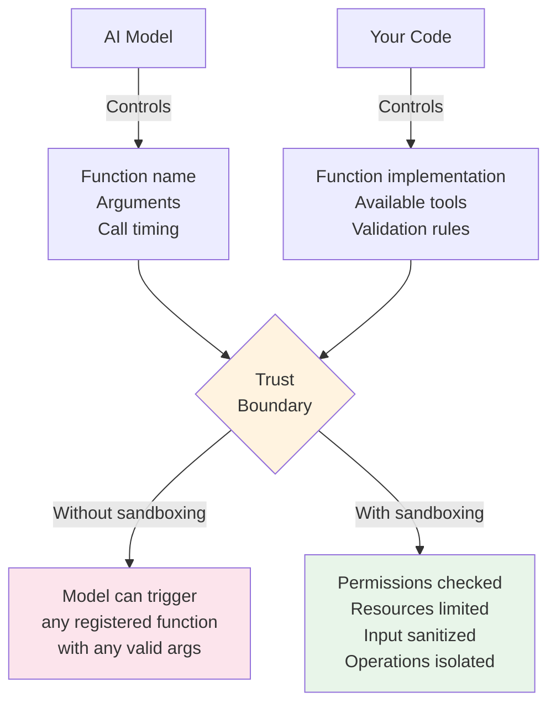

# Execution Sandboxing

## Introduction

When you expose functions to an AI model, the model controls **what** gets called and **what arguments** get passed. Even with validation, this creates a trust boundary: the model might request operations that are technically valid but shouldn't be allowed — querying tables it shouldn't access, writing to restricted paths, or consuming excessive resources. Execution sandboxing adds a security layer between the model's requests and your system's capabilities.

This lesson covers practical sandboxing concepts for function calling: restricting what functions can do, limiting the resources they consume, isolating risky operations, and building permission systems that prevent the model from overstepping its bounds.

### What we'll cover

- The trust boundary between AI models and your code
- Permission-based function execution
- Input sanitization for model-provided arguments
- Resource quotas (CPU, memory, time)
- Process isolation with `subprocess`
- File system restrictions
- Network access controls
- Building a sandboxed execution layer

### Prerequisites

- Executing functions ([Lesson 05-01](./01-executing-functions.md))
- Resource cleanup ([Lesson 05-05](./05-resource-cleanup.md))
- Web security fundamentals ([Unit 01: Web Security](../../01-web-development-fundamentals/11-web-security-fundamentals/00-web-security-fundamentals.md))

---

## The trust boundary

In function calling, you define the functions and the model decides when to call them and with what arguments. This creates a unique security dynamic:



> **🤖 AI Context:** Models don't have malicious intent, but they can be manipulated through prompt injection, produce unexpected argument combinations, or call functions in sequences that create security issues. Sandboxing protects against these scenarios regardless of their origin.

---

## Permission-based execution

Not every user should be able to call every function. A support agent might read orders but not issue refunds. A free-tier user might search products but not access analytics:

```python
from dataclasses import dataclass, field
from typing import Callable
from enum import Enum
from functools import wraps

class Permission(Enum):
    READ_DATA = "read:data"
    WRITE_DATA = "write:data"
    DELETE_DATA = "delete:data"
    ADMIN = "admin"
    READ_ANALYTICS = "read:analytics"
    EXECUTE_QUERIES = "execute:queries"

@dataclass
class SandboxContext:
    """Security context for sandboxed execution."""
    user_id: str
    permissions: set[Permission] = field(default_factory=set)
    rate_limit_remaining: int = 100
    max_result_size_bytes: int = 50_000
    allowed_tables: list[str] = field(default_factory=list)
    
    def has_permission(self, perm: Permission) -> bool:
        return Permission.ADMIN in self.permissions or perm in self.permissions

def requires_permissions(*perms: Permission):
    """Decorator that checks permissions before function execution."""
    def decorator(func: Callable) -> Callable:
        @wraps(func)
        def wrapper(ctx: SandboxContext, *args, **kwargs):
            missing = [p for p in perms if not ctx.has_permission(p)]
            if missing:
                return {
                    "error": "permission_denied",
                    "message": f"Missing permissions: {[p.value for p in missing]}",
                    "required": [p.value for p in perms],
                    "user_id": ctx.user_id
                }
            return func(ctx, *args, **kwargs)
        
        wrapper._required_permissions = perms
        return wrapper
    return decorator

# Functions with permission requirements
@requires_permissions(Permission.READ_DATA)
def get_customer(ctx: SandboxContext, customer_id: str) -> dict:
    return {"customer_id": customer_id, "name": "Alice", "email": "alice@example.com"}

@requires_permissions(Permission.WRITE_DATA)
def update_customer(ctx: SandboxContext, customer_id: str, email: str) -> dict:
    return {"updated": True, "customer_id": customer_id, "new_email": email}

@requires_permissions(Permission.DELETE_DATA)
def delete_customer(ctx: SandboxContext, customer_id: str) -> dict:
    return {"deleted": True, "customer_id": customer_id}

# Test with limited permissions
ctx = SandboxContext(
    user_id="agent_42",
    permissions={Permission.READ_DATA, Permission.WRITE_DATA}
    # Note: no DELETE_DATA
)

print(get_customer(ctx, customer_id="cust_123"))
print(update_customer(ctx, customer_id="cust_123", email="new@example.com"))
print(delete_customer(ctx, customer_id="cust_123"))  # Will be denied
```

**Output:**
```
{'customer_id': 'cust_123', 'name': 'Alice', 'email': 'alice@example.com'}
{'updated': True, 'customer_id': 'cust_123', 'new_email': 'new@example.com'}
{'error': 'permission_denied', 'message': "Missing permissions: ['delete:data']", 'required': ['delete:data'], 'user_id': 'agent_42'}
```

---

## Input sanitization

Even validated arguments can be dangerous. SQL injection, path traversal, and command injection are all possible through model-provided arguments:

```python
import re
import os

class InputSanitizer:
    """Sanitize model-provided arguments before execution."""
    
    @staticmethod
    def sanitize_path(path: str, allowed_base: str = "/data") -> str:
        """Prevent path traversal attacks."""
        # Normalize and resolve the path
        normalized = os.path.normpath(path)
        
        # Remove path traversal attempts
        if ".." in normalized:
            raise ValueError(f"Path traversal detected: {path}")
        
        # Ensure path is within allowed directory
        full_path = os.path.normpath(os.path.join(allowed_base, normalized))
        if not full_path.startswith(os.path.normpath(allowed_base)):
            raise ValueError(f"Path outside allowed directory: {path}")
        
        return full_path
    
    @staticmethod
    def sanitize_sql_identifier(name: str) -> str:
        """Sanitize SQL table/column names."""
        # Only allow alphanumeric and underscores
        if not re.match(r'^[a-zA-Z_][a-zA-Z0-9_]*$', name):
            raise ValueError(f"Invalid SQL identifier: {name}")
        return name
    
    @staticmethod
    def sanitize_string(value: str, max_length: int = 1000) -> str:
        """Sanitize general string input."""
        # Truncate excessive length
        value = value[:max_length]
        # Remove null bytes
        value = value.replace('\x00', '')
        return value
    
    @staticmethod
    def sanitize_url(url: str, allowed_domains: list[str]) -> str:
        """Restrict URLs to allowed domains."""
        from urllib.parse import urlparse
        parsed = urlparse(url)
        
        if parsed.scheme not in ('http', 'https'):
            raise ValueError(f"Invalid URL scheme: {parsed.scheme}")
        
        if parsed.hostname not in allowed_domains:
            raise ValueError(
                f"Domain '{parsed.hostname}' not in allowed list: {allowed_domains}"
            )
        
        return url

sanitizer = InputSanitizer()

# Safe
print(sanitizer.sanitize_path("reports/q1.csv"))

# Dangerous — path traversal
try:
    sanitizer.sanitize_path("../../etc/passwd")
except ValueError as e:
    print(f"Blocked: {e}")

# Dangerous — SQL injection in table name
try:
    sanitizer.sanitize_sql_identifier("users; DROP TABLE users;--")
except ValueError as e:
    print(f"Blocked: {e}")
```

**Output:**
```
/data/reports/q1.csv
Blocked: Path traversal detected: ../../etc/passwd
Blocked: Invalid SQL identifier: users; DROP TABLE users;--
```

### Integrating sanitization into execution

```python
def sanitized_execute(func, args: dict, ctx: SandboxContext) -> dict:
    """Execute with input sanitization applied."""
    sanitized_args = {}
    
    for key, value in args.items():
        if isinstance(value, str):
            # Apply general string sanitization
            sanitized_args[key] = sanitizer.sanitize_string(value)
        else:
            sanitized_args[key] = value
    
    return func(ctx, **sanitized_args)
```

---

## Resource quotas

Limit what functions can consume to prevent denial-of-service, whether from model behavior or malicious prompts:

```python
import asyncio
import resource
import time
from dataclasses import dataclass

@dataclass
class ResourceQuota:
    """Resource limits for function execution."""
    max_memory_mb: int = 256
    max_cpu_seconds: float = 30.0
    max_result_size_bytes: int = 100_000
    max_file_size_bytes: int = 10_000_000  # 10MB
    max_network_requests: int = 10

class ResourceTracker:
    """Track resource usage during function execution."""
    
    def __init__(self, quota: ResourceQuota):
        self.quota = quota
        self._network_count = 0
        self._start_time = 0.0
    
    def start(self):
        self._start_time = time.monotonic()
        self._network_count = 0
    
    def check_time(self):
        elapsed = time.monotonic() - self._start_time
        if elapsed > self.quota.max_cpu_seconds:
            raise ResourceError(
                f"CPU time limit exceeded: {elapsed:.1f}s > {self.quota.max_cpu_seconds}s"
            )
    
    def track_network_request(self):
        self._network_count += 1
        if self._network_count > self.quota.max_network_requests:
            raise ResourceError(
                f"Network request limit exceeded: {self._network_count} > "
                f"{self.quota.max_network_requests}"
            )
    
    def check_result_size(self, result_bytes: int):
        if result_bytes > self.quota.max_result_size_bytes:
            raise ResourceError(
                f"Result size limit exceeded: {result_bytes} > "
                f"{self.quota.max_result_size_bytes} bytes"
            )

class ResourceError(Exception):
    """Raised when a resource quota is exceeded."""
    pass

# Usage in execution
async def quota_execute(
    func, args: dict, quota: ResourceQuota
) -> dict:
    """Execute a function with resource quota enforcement."""
    tracker = ResourceTracker(quota)
    tracker.start()
    
    try:
        result = await func(tracker=tracker, **args)
        
        # Check result size
        import json
        result_json = json.dumps(result)
        tracker.check_result_size(len(result_json.encode()))
        
        return {"status": "success", "data": result}
    
    except ResourceError as e:
        return {
            "status": "quota_exceeded",
            "error": str(e),
            "suggestion": "Try with smaller parameters or fewer results"
        }
```

---

## Process isolation

For truly untrusted operations, run functions in a separate process. This provides memory isolation, CPU limits, and crash protection:

```python
import subprocess
import json
import asyncio
import sys

async def execute_in_subprocess(
    func_module: str,
    func_name: str,
    args: dict,
    timeout_seconds: float = 30.0,
    max_memory_mb: int = 256
) -> dict:
    """Execute a function in an isolated subprocess."""
    
    # Build a Python script that imports and calls the function
    script = f"""
import json
import sys
import resource

# Set memory limit
memory_limit = {max_memory_mb} * 1024 * 1024
resource.setrlimit(resource.RLIMIT_AS, (memory_limit, memory_limit))

# Import and execute
from {func_module} import {func_name}
args = json.loads(sys.stdin.read())
try:
    result = {func_name}(**args)
    print(json.dumps({{"status": "success", "data": result}}))
except Exception as e:
    print(json.dumps({{"status": "error", "error": str(e)}}))
"""
    
    try:
        process = await asyncio.create_subprocess_exec(
            sys.executable, "-c", script,
            stdin=asyncio.subprocess.PIPE,
            stdout=asyncio.subprocess.PIPE,
            stderr=asyncio.subprocess.PIPE,
        )
        
        stdout, stderr = await asyncio.wait_for(
            process.communicate(input=json.dumps(args).encode()),
            timeout=timeout_seconds
        )
        
        if process.returncode != 0:
            return {
                "status": "error",
                "error": f"Process exited with code {process.returncode}",
                "stderr": stderr.decode()[:500]
            }
        
        return json.loads(stdout.decode())
    
    except TimeoutError:
        process.kill()
        return {"status": "timeout", "error": f"Process timed out after {timeout_seconds}s"}
    
    except Exception as e:
        return {"status": "error", "error": str(e)}
```

> **Note:** Process isolation adds significant overhead (100-500ms per call for process startup). Use it only for high-risk operations — not for every function call.

### When to use each isolation level

| Isolation Level | Overhead | Security | Use Case |
|----------------|----------|----------|----------|
| None (in-process) | ~0ms | Low | Trusted, internal functions |
| Permission checks | ~0ms | Medium | Multi-tenant, role-based access |
| Thread isolation | ~1ms | Low | Blocking sync functions |
| Subprocess | ~100-500ms | High | Untrusted code, user-defined functions |
| Container (Docker) | ~1-5s | Very High | Complete isolation, network controls |

---

## File system restrictions

Limit which directories functions can read from and write to:

```python
import os
from pathlib import Path

class FileSystemSandbox:
    """Restrict file system access to allowed directories."""
    
    def __init__(
        self,
        read_dirs: list[str],
        write_dirs: list[str],
        max_file_size: int = 10_000_000
    ):
        self._read_dirs = [Path(d).resolve() for d in read_dirs]
        self._write_dirs = [Path(d).resolve() for d in write_dirs]
        self._max_file_size = max_file_size
    
    def check_read(self, path: str) -> Path:
        """Verify read access is allowed."""
        resolved = Path(path).resolve()
        if not any(self._is_within(resolved, d) for d in self._read_dirs):
            raise PermissionError(
                f"Read access denied: {path} is outside allowed directories"
            )
        return resolved
    
    def check_write(self, path: str) -> Path:
        """Verify write access is allowed."""
        resolved = Path(path).resolve()
        if not any(self._is_within(resolved, d) for d in self._write_dirs):
            raise PermissionError(
                f"Write access denied: {path} is outside allowed directories"
            )
        return resolved
    
    def check_file_size(self, size: int):
        """Check if file size is within limits."""
        if size > self._max_file_size:
            raise ValueError(
                f"File too large: {size} bytes > {self._max_file_size} bytes limit"
            )
    
    @staticmethod
    def _is_within(path: Path, directory: Path) -> bool:
        try:
            path.relative_to(directory)
            return True
        except ValueError:
            return False

# Configure sandbox
fs_sandbox = FileSystemSandbox(
    read_dirs=["/data/reports", "/data/public"],
    write_dirs=["/tmp/function_output"],
    max_file_size=5_000_000  # 5MB
)

# Use in functions
def read_report(path: str) -> dict:
    """Read a report file within the sandbox."""
    safe_path = fs_sandbox.check_read(path)
    
    if not safe_path.exists():
        return {"error": f"File not found: {path}"}
    
    fs_sandbox.check_file_size(safe_path.stat().st_size)
    
    content = safe_path.read_text()
    return {"path": str(safe_path), "content": content[:5000]}  # Truncate for safety

# These would be blocked:
# read_report("/etc/passwd")        → PermissionError
# read_report("../../secrets.env")  → PermissionError
```

---

## Building a sandboxed execution layer

Combine all sandboxing concepts into a unified execution layer:

```python
import asyncio
import json
import time
import logging
from dataclasses import dataclass, field
from typing import Callable, Optional

logger = logging.getLogger(__name__)

@dataclass
class SandboxConfig:
    """Configuration for the execution sandbox."""
    permissions: set[Permission] = field(default_factory=set)
    timeout_seconds: float = 30.0
    max_result_bytes: int = 50_000
    allowed_tables: list[str] = field(default_factory=list)
    allowed_domains: list[str] = field(default_factory=list)
    read_dirs: list[str] = field(default_factory=list)
    write_dirs: list[str] = field(default_factory=list)
    rate_limit_per_minute: int = 60

@dataclass
class SandboxedResult:
    """Result from sandboxed execution."""
    call_id: str
    output: str
    is_error: bool = False
    blocked_reason: Optional[str] = None
    execution_ms: float = 0

class SandboxedExecutor:
    """Execute functions with full sandboxing."""
    
    def __init__(self, config: SandboxConfig):
        self.config = config
        self._call_count = 0
        self._window_start = time.monotonic()
    
    async def execute(
        self,
        func: Callable,
        args: dict,
        call_id: str,
        user_id: str,
    ) -> SandboxedResult:
        """Execute a function with all sandbox protections."""
        start = time.monotonic()
        
        # 1. Check rate limit
        if not self._check_rate_limit():
            return SandboxedResult(
                call_id=call_id,
                output=json.dumps({"error": "Rate limit exceeded"}),
                is_error=True,
                blocked_reason="rate_limit"
            )
        
        # 2. Check permissions
        required = getattr(func, '_required_permissions', [])
        for perm in required:
            if perm not in self.config.permissions:
                elapsed = (time.monotonic() - start) * 1000
                return SandboxedResult(
                    call_id=call_id,
                    output=json.dumps({
                        "error": "permission_denied",
                        "missing": perm.value
                    }),
                    is_error=True,
                    blocked_reason="permission",
                    execution_ms=round(elapsed, 2)
                )
        
        # 3. Sanitize inputs
        sanitized = self._sanitize_args(args)
        
        # 4. Execute with timeout
        try:
            async with asyncio.timeout(self.config.timeout_seconds):
                ctx = SandboxContext(
                    user_id=user_id,
                    permissions=self.config.permissions,
                    allowed_tables=self.config.allowed_tables
                )
                
                if asyncio.iscoroutinefunction(func):
                    result = await func(ctx, **sanitized)
                else:
                    result = await asyncio.to_thread(func, ctx, **sanitized)
            
            # 5. Check result size
            result_json = json.dumps(result)
            if len(result_json.encode()) > self.config.max_result_bytes:
                result_json = json.dumps({
                    "error": "Result too large",
                    "size_bytes": len(result_json.encode()),
                    "limit_bytes": self.config.max_result_bytes
                })
            
            elapsed = (time.monotonic() - start) * 1000
            
            logger.info(
                "Sandboxed execution complete",
                extra={"call_id": call_id, "user": user_id, "ms": elapsed}
            )
            
            return SandboxedResult(
                call_id=call_id,
                output=result_json,
                execution_ms=round(elapsed, 2)
            )
        
        except TimeoutError:
            elapsed = (time.monotonic() - start) * 1000
            return SandboxedResult(
                call_id=call_id,
                output=json.dumps({"error": "Execution timed out"}),
                is_error=True,
                blocked_reason="timeout",
                execution_ms=round(elapsed, 2)
            )
        
        except Exception as e:
            elapsed = (time.monotonic() - start) * 1000
            return SandboxedResult(
                call_id=call_id,
                output=json.dumps({"error": str(e)}),
                is_error=True,
                execution_ms=round(elapsed, 2)
            )
    
    def _check_rate_limit(self) -> bool:
        now = time.monotonic()
        if now - self._window_start > 60:
            self._window_start = now
            self._call_count = 0
        self._call_count += 1
        return self._call_count <= self.config.rate_limit_per_minute
    
    def _sanitize_args(self, args: dict) -> dict:
        sanitized = {}
        for key, value in args.items():
            if isinstance(value, str):
                sanitized[key] = InputSanitizer.sanitize_string(value)
            else:
                sanitized[key] = value
        return sanitized

# Configure for a support agent
support_sandbox = SandboxedExecutor(SandboxConfig(
    permissions={Permission.READ_DATA},
    timeout_seconds=10.0,
    max_result_bytes=50_000,
    allowed_tables=["customers", "orders", "products"],
    rate_limit_per_minute=30,
))

# Configure for an admin
admin_sandbox = SandboxedExecutor(SandboxConfig(
    permissions={Permission.ADMIN},
    timeout_seconds=60.0,
    max_result_bytes=500_000,
    allowed_tables=["*"],
    rate_limit_per_minute=120,
))
```

---

## Best practices

| Practice | Why It Matters |
|----------|----------------|
| Use permission decorators on every function | Makes security requirements explicit and auditable |
| Sanitize all string inputs from the model | Prevents injection attacks through model-provided arguments |
| Set per-user rate limits | Prevents a single conversation from overwhelming your system |
| Limit result sizes | Protects against memory exhaustion and excessive token usage |
| Use subprocess isolation for high-risk functions | Crash and memory protection for untrusted operations |
| Restrict file system access to specific directories | Prevents reading secrets or writing to system directories |

---

## Common pitfalls

| ❌ Mistake | ✅ Solution |
|-----------|-------------|
| Trusting model arguments without sanitization | Always sanitize — models can be manipulated via prompt injection |
| Using the same permissions for all users | Create role-based sandbox configs (support, admin, free-tier) |
| Subprocess for every function call | Only isolate high-risk functions — subprocess overhead adds up |
| Hardcoding permission checks inside functions | Use decorators for consistent, auditable permission enforcement |
| No rate limiting on function calls | A single looping model can exhaust your resources |
| Allowing functions to access arbitrary file paths | Restrict to specific directories with a file system sandbox |

---

## Hands-on exercise

### Your task

Build a sandboxed execution environment for a multi-tenant application where different users have different permission levels.

### Requirements

1. Define three user roles: `viewer` (read only), `editor` (read + write), `admin` (all permissions)
2. Create four functions: `list_items`, `get_item`, `update_item`, `delete_item` — each with appropriate permission requirements
3. Build a `SandboxedExecutor` that checks permissions, sanitizes inputs, and enforces rate limits
4. Test with all three roles — verify that permission-denied errors are returned correctly
5. Test rate limiting by making rapid successive calls

### Expected result

- Viewer can list and get, but gets denied on update and delete
- Editor can list, get, and update, but gets denied on delete
- Admin can do everything
- Rapid calls trigger rate limit after threshold

<details>
<summary>💡 Hints (click to expand)</summary>

- Use `set()` for permissions — makes checking membership fast
- The `@requires_permissions` decorator handles the check automatically
- Set rate limit to something low (like 5/minute) for easy testing
- Return structured error objects, not exceptions
</details>

<details>
<summary>✅ Solution (click to expand)</summary>

```python
from dataclasses import dataclass, field
from enum import Enum
from functools import wraps
import time
import json

class Perm(Enum):
    READ = "read"
    WRITE = "write"
    DELETE = "delete"
    ADMIN = "admin"

ROLES = {
    "viewer": {Perm.READ},
    "editor": {Perm.READ, Perm.WRITE},
    "admin": {Perm.ADMIN},
}

@dataclass
class Ctx:
    user_id: str
    permissions: set[Perm] = field(default_factory=set)

def needs(*perms):
    def deco(func):
        @wraps(func)
        def wrapper(ctx, **kwargs):
            has_admin = Perm.ADMIN in ctx.permissions
            missing = [p for p in perms if p not in ctx.permissions and not has_admin]
            if missing:
                return {"error": "denied", "missing": [p.value for p in missing]}
            return func(ctx, **kwargs)
        return wrapper
    return deco

@needs(Perm.READ)
def list_items(ctx: Ctx, category: str = "all") -> dict:
    return {"items": ["item_1", "item_2"], "category": category}

@needs(Perm.READ)
def get_item(ctx: Ctx, item_id: str) -> dict:
    return {"item_id": item_id, "name": "Widget", "price": 9.99}

@needs(Perm.WRITE)
def update_item(ctx: Ctx, item_id: str, name: str) -> dict:
    return {"updated": True, "item_id": item_id, "name": name}

@needs(Perm.DELETE)
def delete_item(ctx: Ctx, item_id: str) -> dict:
    return {"deleted": True, "item_id": item_id}

# Test each role
for role_name, perms in ROLES.items():
    print(f"\n=== {role_name.upper()} ===")
    ctx = Ctx(user_id=f"{role_name}_1", permissions=perms)
    
    funcs = [
        ("list_items", list_items, {"category": "tools"}),
        ("get_item", get_item, {"item_id": "item_1"}),
        ("update_item", update_item, {"item_id": "item_1", "name": "New Name"}),
        ("delete_item", delete_item, {"item_id": "item_1"}),
    ]
    
    for name, func, args in funcs:
        result = func(ctx, **args)
        status = "❌" if "error" in result else "✅"
        print(f"  {status} {name}: {json.dumps(result)}")

# Rate limit test
print("\n=== RATE LIMIT TEST ===")
call_count = 0
window_start = time.monotonic()
limit = 5

for i in range(8):
    now = time.monotonic()
    if now - window_start > 60:
        window_start = now
        call_count = 0
    call_count += 1
    
    if call_count > limit:
        print(f"  Call {i+1}: ❌ Rate limited")
    else:
        print(f"  Call {i+1}: ✅ Allowed")
```

**Output:**
```
=== VIEWER ===
  ✅ list_items: {"items": ["item_1", "item_2"], "category": "tools"}
  ✅ get_item: {"item_id": "item_1", "name": "Widget", "price": 9.99}
  ❌ update_item: {"error": "denied", "missing": ["write"]}
  ❌ delete_item: {"error": "denied", "missing": ["delete"]}

=== EDITOR ===
  ✅ list_items: {"items": ["item_1", "item_2"], "category": "tools"}
  ✅ get_item: {"item_id": "item_1", "name": "Widget", "price": 9.99}
  ✅ update_item: {"updated": true, "item_id": "item_1", "name": "New Name"}
  ❌ delete_item: {"error": "denied", "missing": ["delete"]}

=== ADMIN ===
  ✅ list_items: {"items": ["item_1", "item_2"], "category": "tools"}
  ✅ get_item: {"item_id": "item_1", "name": "Widget", "price": 9.99}
  ✅ update_item: {"updated": true, "item_id": "item_1", "name": "New Name"}
  ✅ delete_item: {"deleted": true, "item_id": "item_1"}

=== RATE LIMIT TEST ===
  Call 1: ✅ Allowed
  Call 2: ✅ Allowed
  Call 3: ✅ Allowed
  Call 4: ✅ Allowed
  Call 5: ✅ Allowed
  Call 6: ❌ Rate limited
  Call 7: ❌ Rate limited
  Call 8: ❌ Rate limited
```
</details>

### Bonus challenges

- [ ] Add an audit log that records every function call with user ID, function name, result, and timestamp
- [ ] Implement IP-based blocking for suspicious patterns (e.g., repeated permission-denied errors)
- [ ] Build a `FileSystemSandbox` and integrate it with a `read_file` function tool

---

## Summary

✅ Treat the boundary between model decisions and function execution as a security perimeter

✅ Use permission decorators to enforce role-based access control on every function

✅ Sanitize all model-provided string inputs — prevent path traversal, SQL injection, and command injection

✅ Set resource quotas (time, memory, result size, rate limits) to prevent denial-of-service

✅ Use subprocess isolation for high-risk operations, but accept the performance overhead

✅ Restrict file system access to specific directories — never let functions access arbitrary paths

**Next:** [Returning Results →](../06-returning-results/00-returning-results.md) — Formatting and sending function results back to the model

---

[← Previous: Resource Cleanup](./05-resource-cleanup.md) | [Back to Lesson Overview](./00-function-execution.md)

<!-- 
Sources Consulted:
- OWASP Input Validation Cheat Sheet: https://cheatsheetseries.owasp.org/cheatsheets/Input_Validation_Cheat_Sheet.html
- Python subprocess: https://docs.python.org/3/library/subprocess.html
- Python resource module: https://docs.python.org/3/library/resource.html
- Python pathlib: https://docs.python.org/3/library/pathlib.html
- OpenAI Function Calling: https://platform.openai.com/docs/guides/function-calling
- Anthropic Tool Use: https://platform.claude.com/docs/en/docs/build-with-claude/tool-use
-->
