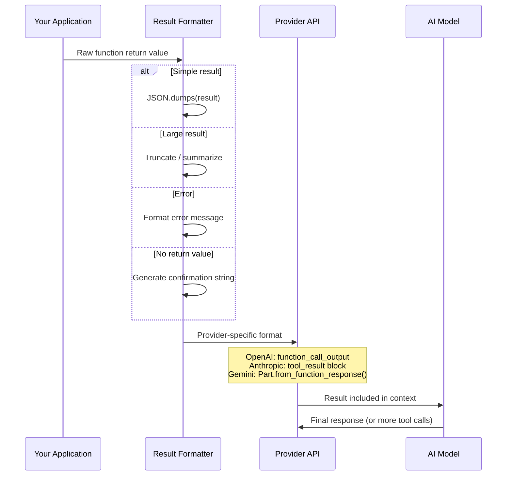

# Returning Results

## Overview

You've executed the function — now what? The model is waiting for an answer. How you format, structure, and deliver function results directly impacts the quality of the model's next response. Send too little information and the model guesses; send too much and you waste tokens or exceed limits. Send it in the wrong format and the API rejects your request entirely.

Each provider has its own result format: OpenAI uses `function_call_output` items with a `call_id`, Anthropic uses `tool_result` content blocks with a `tool_use_id`, and Google Gemini uses `Part.from_function_response()` with a function name. Getting these formats right is non-negotiable — the model can't process your results if they don't match the expected structure.

This lesson covers everything about returning results: from the exact format each provider expects, through serialization strategies for complex data, to handling edge cases like multimodal results, oversized payloads, errors, and functions that don't return anything at all.

## Learning objectives

After completing this lesson, you will be able to:

- Format function results correctly for OpenAI, Anthropic, and Gemini APIs
- Serialize complex Python objects into model-friendly strings
- Include multimodal data (images, documents) in Gemini function responses
- Handle large results with truncation, pagination, and summarization
- Structure error results that help the model recover gracefully
- Return meaningful results from functions with no return value
- Send results back to the model and manage the continuation loop

## Lesson contents

| # | Topic | Description |
|---|-------|-------------|
| 01 | [Result Format Structure](./01-result-format-structure.md) | Provider-specific formats: `function_call_output`, `tool_result`, `function_response` |
| 02 | [Stringifying Results](./02-stringifying-results.md) | JSON serialization, truncation, key field selection, summaries |
| 03 | [Multimodal Results](./03-multimodal-results.md) | Images and documents in Gemini function responses |
| 04 | [Handling Large Results](./04-handling-large-results.md) | Size limits, pagination, token budget management |
| 05 | [Error Result Formatting](./05-error-result-formatting.md) | Error messages, codes, and recovery hints for the model |
| 06 | [No Return Value Handling](./06-no-return-value-handling.md) | Success/failure strings, confirmations, side effects |
| 07 | [Continuing the Conversation](./07-continuing-conversation.md) | Sending results back, follow-up calls, termination |

## How results flow back to the model

## Provider result format comparison

| Aspect | OpenAI (Responses API) | Anthropic (Messages API) | Google Gemini |
|--------|----------------------|------------------------|---------------|
| **Result type** | `function_call_output` | `tool_result` content block | `Part.from_function_response()` |
| **ID reference** | `call_id` | `tool_use_id` | Function `name` |
| **Result value** | String (or array of objects) | String or content array | Dict wrapped in `response` |
| **Error flag** | No explicit flag | `is_error: true` | Error in response dict |
| **Multimodal** | Image/file objects in array | Images via base64 content | `FunctionResponseBlob` with MIME types |
| **Message role** | Appended to `input` list | `user` message with `tool_result` | `user` content with function response |
| **Multiple results** | One item per `call_id` | One block per `tool_use_id` | One Part per function name |

> **🤖 AI Context:** The result you return isn't just data — it's the model's window into what happened. A well-formatted result helps the model give accurate, helpful responses. A poorly formatted result leads to hallucinated details, ignored errors, or confused follow-up questions.

## Key concepts across all providers

### 1. Results must reference the original call

Every provider requires you to link each result back to the specific function call that produced it. Without this link, the API rejects the request:

- **OpenAI:** Match `call_id` from the `function_call` output item
- **Anthropic:** Match `tool_use_id` from the `tool_use` content block
- **Gemini:** Match the function `name` from the `function_call` part

### 2. Results are always strings (mostly)

OpenAI and Anthropic expect string results. Even if your function returns a dictionary, you need to `json.dumps()` it first. Gemini is the exception — it accepts a Python dictionary directly in `Part.from_function_response()`.

### 3. The model interprets results, not your users

When formatting results, remember: the model reads them, not a human. Include data the model needs to answer the user's question, skip visual formatting, and keep results concise.

### 4. Every function call needs a result

If the model makes three function calls, you must return three results — one for each call. Skipping a result causes API errors or model confusion.

---

**Next:** [Result Format Structure →](./01-result-format-structure.md) — The exact format each provider expects for function results

---

[← Previous: Execution Sandboxing](../05-function-execution/06-execution-sandboxing.md) | [Back to Unit Overview](../00-overview.md)

<!-- 
Sources Consulted:
- OpenAI Function Calling Guide: https://platform.openai.com/docs/guides/function-calling
- OpenAI Responses API Reference: https://platform.openai.com/docs/api-reference/responses/create
- Anthropic Tool Use: https://platform.claude.com/docs/en/agents-and-tools/tool-use/overview
- Gemini Function Calling: https://ai.google.dev/gemini-api/docs/function-calling
-->
