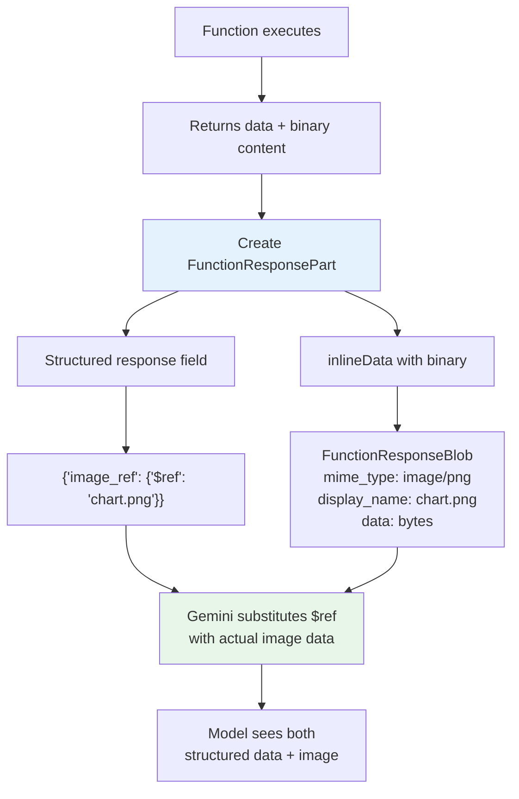

# Multimodal Function Results

## Introduction

Most function results are text or JSON, but sometimes your function needs to return an **image**, a **chart**, or a **document**. Google Gemini 3 series models introduce **multimodal function responses** — the ability to include images and documents directly inside the result you send back to the model. This lets the model see and reason about visual content your function produces.

This is a Gemini-exclusive feature. OpenAI and Anthropic support images in function results through their own mechanisms (URLs or base64), but Gemini's approach is the most structured, using `FunctionResponseBlob` with explicit MIME types and a reference system.

### What we'll cover

- Supported MIME types for multimodal function responses
- Including images in function responses with `inlineData`
- Including documents (PDF, text) in responses
- The `displayName` and `$ref` reference system
- Comparing multimodal result approaches across providers
- Building a multimodal result helper

### Prerequisites

- Result format structure ([Lesson 06-01](./01-result-format-structure.md))
- Gemini function calling basics ([Lesson 05-02](../05-function-execution/02-automatic-function-calling.md))

---

## Supported MIME types

Gemini 3 series models accept the following MIME types in function response parts:

| Category | MIME Types | Use Cases |
|----------|-----------|-----------|
| **Images** | `image/png`, `image/jpeg`, `image/webp` | Charts, screenshots, generated images, photos |
| **Documents** | `application/pdf`, `text/plain` | Reports, exported files, log files |

> **Note:** This feature is available for **Gemini 3** series models only. Earlier models (Gemini 2.x) do not support multimodal content in function responses.

---

## How multimodal function responses work

When you include multimodal data in a function response, you embed it as a **nested part** within the `functionResponse` part. The multimodal part uses `inlineData` to carry the binary content, and a `displayName` to identify it.



The key mechanism:
1. You provide binary data (image bytes) in a `FunctionResponseBlob`
2. You give it a `displayName` (e.g., `"chart.png"`)
3. In the structured `response` field, you reference it with `{"$ref": "chart.png"}`
4. The model substitutes the reference with the actual content when processing

---

## Including images in function responses

Here's a complete example of a function that generates a chart and returns it to the model:

```python
from google import genai
from google.genai import types
import requests


client = genai.Client()

# Step 1: Define a function that returns an image
get_image_declaration = types.FunctionDeclaration(
    name="get_product_photo",
    description="Retrieves the product photo for a specific item.",
    parameters={
        "type": "object",
        "properties": {
            "product_id": {
                "type": "string",
                "description": "The product ID to get the photo for."
            }
        },
        "required": ["product_id"],
    },
)

tool_config = types.Tool(function_declarations=[get_image_declaration])

# Step 2: Get the model to call the function
prompt = "Show me the photo of product PRD-001."
response = client.models.generate_content(
    model="gemini-3-flash-preview",
    contents=[prompt],
    config=types.GenerateContentConfig(tools=[tool_config]),
)

# Step 3: Execute the function and get image bytes
function_call = response.function_calls[0]
product_id = function_call.args["product_id"]

# In production: fetch from your storage/CDN
image_url = f"https://example.com/products/{product_id}.jpg"
image_bytes = requests.get(image_url).content

# Step 4: Build the multimodal function response
function_response_data = {
    "product_id": product_id,
    "image_ref": {"$ref": "product_photo.jpg"},  # Reference the image
}

# Create the inline data part
multimodal_part = types.FunctionResponsePart(
    inline_data=types.FunctionResponseBlob(
        mime_type="image/jpeg",
        display_name="product_photo.jpg",  # Must match the $ref value
        data=image_bytes,
    )
)

# Step 5: Send the result back to the model
history = [
    types.Content(role="user", parts=[types.Part(text=prompt)]),
    response.candidates[0].content,  # Model's function_call turn
    types.Content(
        role="tool",
        parts=[
            types.Part.from_function_response(
                name=function_call.name,
                response=function_response_data,
                parts=[multimodal_part]  # Attach the image here
            )
        ],
    )
]

# Step 6: Get the model's response (it can now see the image)
final_response = client.models.generate_content(
    model="gemini-3-flash-preview",
    contents=history,
    config=types.GenerateContentConfig(tools=[tool_config]),
)

print(final_response.text)
```

**Output:**
```
Here's the photo of product PRD-001. It shows a black wireless mouse with an ergonomic design and USB-C charging port.
```

> **Important:** The `displayName` in the `FunctionResponseBlob` must exactly match the `$ref` value in the structured response. Each `displayName` can only be referenced **once** in the response field.

---

## Including documents in function responses

The same pattern works for PDFs and text files:

```python
# Function that generates a PDF report
def generate_report(report_type: str) -> tuple[dict, bytes]:
    """Generate a report and return both metadata and PDF bytes."""
    # In production: generate actual PDF
    pdf_bytes = create_pdf_report(report_type)  # Your PDF generation logic
    
    metadata = {
        "report_type": report_type,
        "generated_at": "2025-02-06T14:30:00",
        "pages": 5,
        "document_ref": {"$ref": "report.pdf"}
    }
    
    return metadata, pdf_bytes


# Build the response with a PDF
metadata, pdf_bytes = generate_report("quarterly_sales")

multimodal_part = types.FunctionResponsePart(
    inline_data=types.FunctionResponseBlob(
        mime_type="application/pdf",
        display_name="report.pdf",
        data=pdf_bytes,
    )
)

# Include in the function response
result_content = types.Content(
    role="tool",
    parts=[
        types.Part.from_function_response(
            name="generate_report",
            response=metadata,
            parts=[multimodal_part]
        )
    ],
)
```

### Text file example

```python
# Return a log file as part of a function response
log_content = "2025-02-06 14:30:01 INFO Server started\n2025-02-06 14:30:02 INFO Ready"

multimodal_part = types.FunctionResponsePart(
    inline_data=types.FunctionResponseBlob(
        mime_type="text/plain",
        display_name="server.log",
        data=log_content.encode("utf-8"),  # Must be bytes
    )
)

response_data = {
    "status": "retrieved",
    "log_ref": {"$ref": "server.log"},
    "lines": 2
}
```

---

## The `displayName` and `$ref` system

The reference system connects structured JSON data with binary content:

```python
# The structured response references binary parts by displayName
response_data = {
    "analysis": "Sales increased 15% this quarter",
    "chart_ref": {"$ref": "sales_chart.png"},     # References the chart
    "report_ref": {"$ref": "full_report.pdf"},     # References the PDF
}

# Each binary part has a matching displayName
chart_part = types.FunctionResponsePart(
    inline_data=types.FunctionResponseBlob(
        mime_type="image/png",
        display_name="sales_chart.png",   # Matches $ref above
        data=chart_bytes,
    )
)

report_part = types.FunctionResponsePart(
    inline_data=types.FunctionResponseBlob(
        mime_type="application/pdf",
        display_name="full_report.pdf",   # Matches $ref above
        data=report_bytes,
    )
)

# Include both parts in the function response
result = types.Part.from_function_response(
    name="generate_analysis",
    response=response_data,
    parts=[chart_part, report_part]       # Multiple multimodal parts
)
```

### Rules for `displayName` and `$ref`

| Rule | Detail |
|------|--------|
| Must match exactly | `displayName` must be identical to the `$ref` value |
| One reference per part | Each `displayName` can only be referenced once in the response |
| Multiple parts allowed | You can include multiple `FunctionResponseBlob` parts |
| Unique names required | Each `displayName` must be unique within a single function response |

---

## Multimodal results across providers

While Gemini has the most structured multimodal result system, OpenAI and Anthropic also support non-text results:

### OpenAI: Image URLs in output array

```python
# OpenAI supports an array of content objects instead of a string
openai_result = {
    "type": "function_call_output",
    "call_id": "call_abc123",
    "output": [
        {
            "type": "image_url",
            "image_url": {
                "url": "https://example.com/chart.png"
                # Or: "url": "data:image/png;base64,iVBORw0KGgo..."
            }
        }
    ]
}
```

### Anthropic: Base64 images in tool_result content

```python
import base64

# Anthropic supports an array of content blocks in tool_result
anthropic_result = {
    "role": "user",
    "content": [
        {
            "type": "tool_result",
            "tool_use_id": "toolu_abc123",
            "content": [
                {
                    "type": "text",
                    "text": '{"status": "chart generated", "data_points": 12}'
                },
                {
                    "type": "image",
                    "source": {
                        "type": "base64",
                        "media_type": "image/png",
                        "data": base64.b64encode(chart_bytes).decode("utf-8")
                    }
                }
            ]
        }
    ]
}
```

### Provider comparison for multimodal results

| Feature | OpenAI | Anthropic | Gemini |
|---------|--------|-----------|--------|
| **Image in results** | ✅ URL or base64 data URL | ✅ Base64 content block | ✅ `FunctionResponseBlob` |
| **PDF in results** | ❌ Not directly | ❌ Not directly | ✅ `application/pdf` |
| **Reference system** | ❌ | ❌ | ✅ `$ref` / `displayName` |
| **Multiple media** | ✅ Array of objects | ✅ Array of content blocks | ✅ Multiple parts |
| **MIME type support** | Images only | Images only | Images + Documents |
| **Inline binary** | Via data URL | Via base64 | Via `inlineData` bytes |

---

## Building a multimodal result helper

Here's a helper class that handles multimodal results across providers:

```python
import base64
import json
from dataclasses import dataclass, field
from pathlib import Path


@dataclass
class MediaAttachment:
    """A binary attachment to include in a function result."""
    data: bytes
    mime_type: str
    display_name: str


@dataclass
class MultimodalResult:
    """A function result that may include media attachments."""
    structured_data: dict
    attachments: list[MediaAttachment] = field(default_factory=list)
    
    def add_image(self, image_bytes: bytes, name: str, mime_type: str = "image/png"):
        """Add an image attachment."""
        self.attachments.append(MediaAttachment(image_bytes, mime_type, name))
        # Add a reference in the structured data
        self.structured_data[f"{name}_ref"] = {"$ref": name}
    
    def add_document(self, doc_bytes: bytes, name: str, mime_type: str = "application/pdf"):
        """Add a document attachment."""
        self.attachments.append(MediaAttachment(doc_bytes, mime_type, name))
        self.structured_data[f"{name}_ref"] = {"$ref": name}
    
    def format_for_gemini(self, function_name: str):
        """Format for Gemini's multimodal function response."""
        from google.genai import types
        
        parts = []
        for attachment in self.attachments:
            parts.append(types.FunctionResponsePart(
                inline_data=types.FunctionResponseBlob(
                    mime_type=attachment.mime_type,
                    display_name=attachment.display_name,
                    data=attachment.data,
                )
            ))
        
        return types.Part.from_function_response(
            name=function_name,
            response=self.structured_data,
            parts=parts if parts else None
        )
    
    def format_for_openai(self, call_id: str) -> dict:
        """Format for OpenAI — images as data URLs, structured data as text."""
        output_parts = []
        
        # Add structured data as text
        output_parts.append(json.dumps(self.structured_data))
        
        # Add images as data URLs (OpenAI doesn't support PDFs inline)
        for attachment in self.attachments:
            if attachment.mime_type.startswith("image/"):
                b64 = base64.b64encode(attachment.data).decode("utf-8")
                output_parts = [{
                    "type": "image_url",
                    "image_url": {
                        "url": f"data:{attachment.mime_type};base64,{b64}"
                    }
                }]
        
        return {
            "type": "function_call_output",
            "call_id": call_id,
            "output": output_parts if len(output_parts) > 1 else output_parts[0]
        }
    
    def format_for_anthropic(self, tool_use_id: str) -> dict:
        """Format for Anthropic — images as base64 content blocks."""
        content_blocks = []
        
        # Add structured data as text
        content_blocks.append({
            "type": "text",
            "text": json.dumps(self.structured_data)
        })
        
        # Add images as base64 blocks
        for attachment in self.attachments:
            if attachment.mime_type.startswith("image/"):
                content_blocks.append({
                    "type": "image",
                    "source": {
                        "type": "base64",
                        "media_type": attachment.mime_type,
                        "data": base64.b64encode(attachment.data).decode("utf-8")
                    }
                })
        
        return {
            "role": "user",
            "content": [{
                "type": "tool_result",
                "tool_use_id": tool_use_id,
                "content": content_blocks
            }]
        }
```

**Usage:**
```python
# Create a multimodal result
result = MultimodalResult(
    structured_data={
        "product_id": "PRD-001",
        "name": "Wireless Mouse",
        "price": 29.99
    }
)

# Add an image
with open("product_photo.jpg", "rb") as f:
    result.add_image(f.read(), "product.jpg", "image/jpeg")

# Format for any provider
gemini_result = result.format_for_gemini("get_product")
openai_result = result.format_for_openai("call_123")
anthropic_result = result.format_for_anthropic("toolu_123")
```

---

## Best practices

| Practice | Why it matters |
|----------|---------------|
| Use the smallest image resolution that's useful | Large images consume context tokens and slow requests |
| Compress images before including them | JPEG at 80% quality is usually sufficient for the model |
| Always include structured data alongside images | The model benefits from both visual and textual information |
| Check file sizes before embedding | A 10MB image will likely cause API errors or timeouts |
| Use `displayName` values that are descriptive | `"sales_chart_q3.png"` is better than `"image1.png"` |
| Fall back to text descriptions for unsupported providers | If a provider doesn't support inline images, describe what the image shows |

---

## Common pitfalls

| ❌ Mistake | ✅ Solution |
|-----------|-------------|
| Using multimodal responses with Gemini 2.x models | Only Gemini 3 series supports multimodal function responses |
| Mismatched `displayName` and `$ref` values | Copy-paste the exact same string for both |
| Referencing the same `displayName` twice | Each display name can only be referenced once |
| Sending raw file paths instead of bytes | Read the file with `open(path, "rb").read()` first |
| Not encoding bytes for Anthropic | Use `base64.b64encode(data).decode("utf-8")` |
| Including huge images (>5MB) | Resize/compress before embedding |

---

## Hands-on exercise

### Your task

Build a function that generates a simple "chart" (a formatted text representation) and returns it as a multimodal function response for Gemini, along with structured data about the chart.

### Requirements

1. Create a `generate_chart(data_points)` function that returns both structured metadata and "image" bytes (use a text-based chart encoded as bytes for testing)
2. Format the result using `Part.from_function_response()` with a `FunctionResponseBlob`
3. Include a `$ref` reference in the structured data
4. Print out the structured response to verify the format

### Expected result

```python
# The structured response data should look like:
{
    "chart_type": "bar",
    "data_points": 5,
    "chart_ref": {"$ref": "chart.png"}
}
# Plus a FunctionResponseBlob with the chart data
```

<details>
<summary>💡 Hints (click to expand)</summary>

- For testing, create a simple ASCII chart and encode it as bytes: `chart_text.encode("utf-8")`
- Use `text/plain` as the MIME type for text-based charts
- Remember: `displayName` must match the `$ref` value exactly

</details>

<details>
<summary>✅ Solution (click to expand)</summary>

```python
from google.genai import types


def generate_chart(data_points: list[dict]) -> tuple[dict, bytes]:
    """Generate a text-based chart and return metadata + data."""
    # Create a simple text chart
    max_value = max(d["value"] for d in data_points)
    chart_lines = ["Sales by Quarter", "=" * 30]
    
    for dp in data_points:
        bar_length = int((dp["value"] / max_value) * 20)
        bar = "█" * bar_length
        chart_lines.append(f"{dp['label']:>8} | {bar} {dp['value']}")
    
    chart_text = "\n".join(chart_lines)
    chart_bytes = chart_text.encode("utf-8")
    
    metadata = {
        "chart_type": "bar",
        "data_points": len(data_points),
        "max_value": max_value,
        "chart_ref": {"$ref": "sales_chart.txt"}
    }
    
    return metadata, chart_bytes


# Generate the chart
data = [
    {"label": "Q1", "value": 150},
    {"label": "Q2", "value": 220},
    {"label": "Q3", "value": 180},
    {"label": "Q4", "value": 310},
]

metadata, chart_bytes = generate_chart(data)

# Build the Gemini multimodal response
chart_part = types.FunctionResponsePart(
    inline_data=types.FunctionResponseBlob(
        mime_type="text/plain",
        display_name="sales_chart.txt",
        data=chart_bytes,
    )
)

result = types.Part.from_function_response(
    name="generate_chart",
    response=metadata,
    parts=[chart_part]
)

print("Structured data:", metadata)
print("\nChart content:")
print(chart_bytes.decode("utf-8"))
```

**Output:**
```
Structured data: {'chart_type': 'bar', 'data_points': 4, 'max_value': 310, 'chart_ref': {'$ref': 'sales_chart.txt'}}

Chart content:
Sales by Quarter
==============================
      Q1 | █████████ 150
      Q2 | ██████████████ 220
      Q3 | ███████████ 180
      Q4 | ████████████████████ 310
```

</details>

### Bonus challenges

- [ ] Add support for multiple charts in a single response (e.g., bar chart + pie chart)
- [ ] Build a fallback that returns a text description when the provider doesn't support multimodal results
- [ ] Implement image compression using Pillow before embedding

---

## Summary

✅ Gemini 3 series models support images (`png`, `jpeg`, `webp`) and documents (`pdf`, `text/plain`) in function responses

✅ Use `FunctionResponseBlob` with `inlineData` to attach binary content to function results

✅ The `displayName` and `$ref` system links structured JSON data to binary attachments

✅ Each `displayName` can only be referenced once in the structured response

✅ OpenAI supports image URLs/data URIs in output arrays; Anthropic supports base64 image blocks

✅ Always include structured text data alongside multimodal content for richer model understanding

**Next:** [Handling Large Results →](./04-handling-large-results.md) — Managing oversized results with pagination and token budgets

---

[← Previous: Stringifying Results](./02-stringifying-results.md) | [Back to Lesson Overview](./00-returning-results.md)

<!-- 
Sources Consulted:
- Gemini Multimodal Function Responses: https://ai.google.dev/gemini-api/docs/function-calling
- Gemini 3 Models: https://ai.google.dev/gemini-api/docs/gemini-3
- OpenAI Function Calling (output formats): https://platform.openai.com/docs/guides/function-calling
- Anthropic Tool Use (content blocks): https://platform.claude.com/docs/en/agents-and-tools/tool-use/overview
-->
