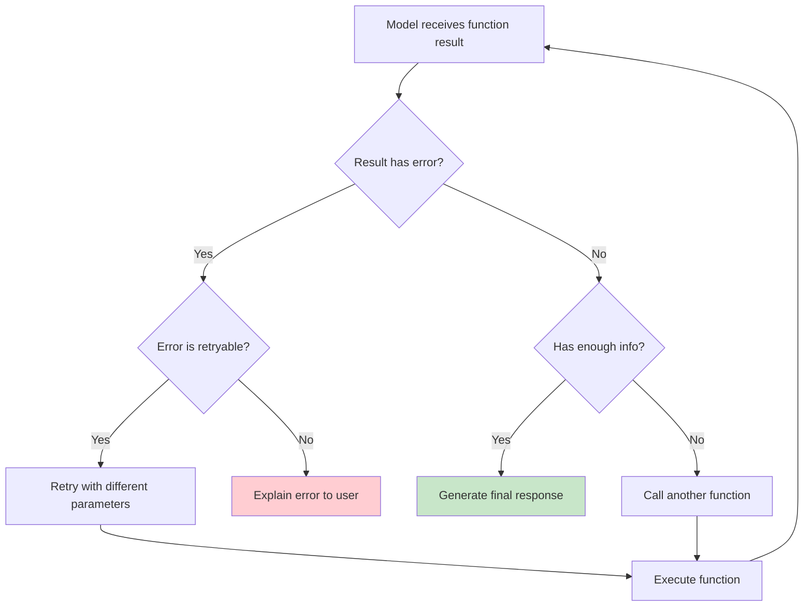

# Continuing the Conversation

## Introduction

Returning a function result is not the end — it's the **middle** of a conversation. After you send the result back, the model processes it and produces a response. That response might be a final answer to the user, or it might be **another function call**. The cycle of call → execute → return → respond can repeat multiple times before the model decides it has enough information.

This lesson covers how to send results back to each provider, how the model interprets results and decides what to do next, how to handle follow-up function calls, and when the conversation should stop.

### What we'll cover

- Sending results back: the complete request for each provider
- How models interpret and use function results
- The function calling loop: detect → execute → return → repeat
- Handling multiple sequential function calls
- Conversation termination: knowing when to stop
- Building a complete conversation loop

### Prerequisites

- Result format structure ([Lesson 06-01](./01-result-format-structure.md))
- Function execution ([Lesson 05](../05-function-execution/00-function-execution.md))

---

## Sending results back to the model

Each provider has a specific way to include function results in the next API request.

### OpenAI: Responses API

With the Responses API, you include the function call output as an item in the `input` array:

```python
from openai import OpenAI

client = OpenAI()

# Step 1: Initial request — model returns a function call
response = client.responses.create(
    model="gpt-4.1",
    tools=[{
        "type": "function",
        "name": "get_weather",
        "description": "Get weather for a city",
        "parameters": {
            "type": "object",
            "properties": {"city": {"type": "string"}},
            "required": ["city"],
        },
    }],
    input=[{"role": "user", "content": "What's the weather in London?"}],
)

# Step 2: Extract the function call
function_call = next(
    item for item in response.output
    if item.type == "function_call"
)

# Step 3: Execute and get the result
weather_data = '{"temperature": 15, "condition": "cloudy", "humidity": 78}'

# Step 4: Send the result back — include the ENTIRE previous output
response_2 = client.responses.create(
    model="gpt-4.1",
    tools=[{
        "type": "function",
        "name": "get_weather",
        "description": "Get weather for a city",
        "parameters": {
            "type": "object",
            "properties": {"city": {"type": "string"}},
            "required": ["city"],
        },
    }],
    input=[
        {"role": "user", "content": "What's the weather in London?"},
        *[item.model_dump() for item in response.output],  # Previous output items
        {
            "type": "function_call_output",
            "call_id": function_call.call_id,
            "output": weather_data,
        },
    ],
)

# Step 5: The model's final response
print(response_2.output_text)
```

**Output:**
```
The weather in London is currently 15°C and cloudy, with a humidity of 78%.
```

> **Important:** With the Responses API, you must include all previous output items (including `reasoning` items for o-series models) when sending the result back. This preserves the model's chain of thought.

### Anthropic: Messages API

With Anthropic, the function result goes in a `user` message with `tool_result` content blocks:

```python
import anthropic

client = anthropic.Anthropic()

# Step 1: Initial request
response = client.messages.create(
    model="claude-sonnet-4-20250514",
    max_tokens=1024,
    tools=[{
        "name": "get_weather",
        "description": "Get weather for a city",
        "input_schema": {
            "type": "object",
            "properties": {"city": {"type": "string"}},
            "required": ["city"],
        },
    }],
    messages=[{"role": "user", "content": "What's the weather in London?"}],
)

# Step 2: Extract the tool use block
tool_use = next(block for block in response.content if block.type == "tool_use")

# Step 3: Send the result back
response_2 = client.messages.create(
    model="claude-sonnet-4-20250514",
    max_tokens=1024,
    tools=[{
        "name": "get_weather",
        "description": "Get weather for a city",
        "input_schema": {
            "type": "object",
            "properties": {"city": {"type": "string"}},
            "required": ["city"],
        },
    }],
    messages=[
        {"role": "user", "content": "What's the weather in London?"},
        {"role": "assistant", "content": response.content},  # The tool_use turn
        {
            "role": "user",   # Tool results are always in user messages
            "content": [
                {
                    "type": "tool_result",
                    "tool_use_id": tool_use.id,
                    "content": '{"temperature": 15, "condition": "cloudy"}',
                }
            ],
        },
    ],
)

# Step 4: Final response
print(response_2.content[0].text)
```

**Output:**
```
The weather in London is currently 15°C with cloudy skies.
```

> **Note:** Anthropic requires strict `user` → `assistant` → `user` message alternation. The tool result must be in a `user` message, and the previous assistant response (with `tool_use`) must be preserved exactly.

### Gemini: Generate Content

With Gemini, you build the conversation history including `tool` role messages:

```python
from google import genai
from google.genai import types

client = genai.Client()

tools = [types.Tool(function_declarations=[
    types.FunctionDeclaration(
        name="get_weather",
        description="Get weather for a city",
        parameters={
            "type": "object",
            "properties": {"city": {"type": "string", "description": "City name"}},
            "required": ["city"],
        },
    )
])]

# Step 1: Initial request
response = client.models.generate_content(
    model="gemini-2.5-flash",
    contents=[types.Content(role="user", parts=[types.Part(text="What's the weather in London?")])],
    config=types.GenerateContentConfig(tools=tools),
)

# Step 2: Extract function call
function_call = response.function_calls[0]

# Step 3: Build the result and send it back
history = [
    types.Content(role="user", parts=[types.Part(text="What's the weather in London?")]),
    response.candidates[0].content,  # Model's function call turn
    types.Content(
        role="tool",
        parts=[
            types.Part.from_function_response(
                name=function_call.name,
                response={"temperature": 15, "condition": "cloudy", "humidity": 78}
            )
        ],
    ),
]

# Step 4: Get the final response
response_2 = client.models.generate_content(
    model="gemini-2.5-flash",
    contents=history,
    config=types.GenerateContentConfig(tools=tools),
)

print(response_2.text)
```

**Output:**
```
The weather in London is currently 15°C and cloudy, with 78% humidity.
```

---

## How models interpret function results

After receiving a function result, the model does several things:

1. **Validates** the result — does it look like expected data?
2. **Extracts** relevant information from the result
3. **Decides** whether it has enough information to answer the user
4. **Either** generates a natural language response **or** makes another function call



### What the model looks for in results

| Result content | Model's interpretation |
|----------------|----------------------|
| `"error": true` | Function failed — consider retrying or telling the user |
| `"has_next": true` or pagination | More data available — may call again with next page |
| Generated IDs | Saves for follow-up calls |
| `"suggestion"` fields | Guidance on how to fix errors or refine queries |
| Numeric data | May perform calculations or comparisons |
| Lists of items | May filter, sort, or summarize for the user |

---

## The function calling loop

A complete function calling interaction is a **loop** that continues until the model generates a text response (no more function calls):

```python
import json


def function_calling_loop(
    client,
    model: str,
    tools: list[dict],
    messages: list[dict],
    available_functions: dict[str, callable],
    max_iterations: int = 10,
) -> str:
    """Run a function calling loop until the model produces a text response.
    
    Args:
        client: The OpenAI client
        model: Model name
        tools: Tool definitions
        messages: Initial messages
        available_functions: Map of function name → callable
        max_iterations: Safety limit to prevent infinite loops
        
    Returns:
        The model's final text response
    """
    input_items = list(messages)
    
    for iteration in range(max_iterations):
        print(f"\n--- Iteration {iteration + 1} ---")
        
        # Call the model
        response = client.responses.create(
            model=model,
            tools=tools,
            input=input_items,
        )
        
        # Check if the model made any function calls
        function_calls = [
            item for item in response.output
            if item.type == "function_call"
        ]
        
        if not function_calls:
            # No function calls — model produced a final response
            print(f"Model responded with text (no more function calls)")
            return response.output_text
        
        # Process each function call
        print(f"Model made {len(function_calls)} function call(s)")
        
        # Add all output items (including reasoning) to the input
        input_items.extend([item.model_dump() for item in response.output])
        
        for fc in function_calls:
            print(f"  Calling: {fc.name}({fc.arguments})")
            
            # Execute the function
            func = available_functions.get(fc.name)
            if func is None:
                result = json.dumps({"error": True, "message": f"Unknown function: {fc.name}"})
            else:
                try:
                    args = json.loads(fc.arguments)
                    result = json.dumps(func(**args), default=str)
                except Exception as e:
                    result = json.dumps({"error": True, "message": str(e)})
            
            # Add the result to the input
            input_items.append({
                "type": "function_call_output",
                "call_id": fc.call_id,
                "output": result,
            })
    
    return "Maximum iterations reached. The model could not complete the task."
```

### Usage example

```python
# Define functions
def get_weather(city: str) -> dict:
    """Get weather for a city."""
    data = {
        "London": {"temp": 15, "condition": "cloudy"},
        "Tokyo": {"temp": 22, "condition": "sunny"},
        "New York": {"temp": 8, "condition": "rainy"},
    }
    if city not in data:
        return {"error": True, "message": f"City '{city}' not found"}
    return data[city]

def get_local_time(city: str) -> dict:
    """Get local time in a city."""
    times = {
        "London": "14:30 GMT",
        "Tokyo": "23:30 JST",
        "New York": "09:30 EST",
    }
    return {"time": times.get(city, "unknown"), "city": city}

# Run the loop
# (The model might call get_weather, then get_local_time, then respond)
final_response = function_calling_loop(
    client=client,
    model="gpt-4.1",
    tools=[...],  # Tool definitions
    messages=[{
        "role": "user",
        "content": "What's the weather and time in London and Tokyo?"
    }],
    available_functions={
        "get_weather": get_weather,
        "get_local_time": get_local_time,
    },
)

print(f"\nFinal: {final_response}")
```

**Output:**
```
--- Iteration 1 ---
Model made 2 function call(s)
  Calling: get_weather({"city": "London"})
  Calling: get_weather({"city": "Tokyo"})

--- Iteration 2 ---
Model made 2 function call(s)
  Calling: get_local_time({"city": "London"})
  Calling: get_local_time({"city": "Tokyo"})

--- Iteration 3 ---
Model responded with text (no more function calls)

Final: Here's the current information:

**London:** 15°C and cloudy, local time is 14:30 GMT
**Tokyo:** 22°C and sunny, local time is 23:30 JST
```

---

## Handling multiple sequential function calls

Models often make **multiple function calls across iterations** to build up context. Here are the common patterns:

### Pattern 1: Gather then respond

The model gathers all needed data first, then synthesizes a response:

```
User: "Compare prices for flights from NYC to London and Paris"
→ Call search_flights({from: "NYC", to: "London"})
→ Call search_flights({from: "NYC", to: "Paris"})
→ Text: "London flights start at $450, Paris at $380..."
```

### Pattern 2: Chain calls (output feeds input)

Each call depends on the result of the previous one:

```
User: "Find the CEO of the most valuable company"
→ Call get_top_companies({sort: "market_cap", limit: 1})
→ Result: {"company": "Apple", "id": "AAPL"}
→ Call get_company_executives({company_id: "AAPL", role: "CEO"})
→ Result: {"name": "Tim Cook", "since": 2011}
→ Text: "Tim Cook has been CEO of Apple since 2011."
```

### Pattern 3: Error recovery

The model retries or adjusts when a function call fails:

```
User: "What's the weather in SF?"
→ Call get_weather({city: "SF"})
→ Error: "City 'SF' not found. Try full name."
→ Call get_weather({city: "San Francisco"})
→ Result: {"temp": 18, "condition": "foggy"}
→ Text: "San Francisco is 18°C and foggy."
```

---

## Conversation termination

The function calling loop should stop when:

| Condition | Action |
|-----------|--------|
| Model returns text with no function calls | ✅ Natural end — return the text |
| Maximum iterations reached | ⚠️ Safety stop — inform the user |
| Same function called with same arguments | ⚠️ Infinite loop — break and explain |
| All function calls return errors | ⚠️ Give up — tell the user what failed |

### Detecting infinite loops

```python
from collections import Counter


class LoopDetector:
    """Detect infinite loops in function calling sequences."""
    
    def __init__(self, max_repeats: int = 3):
        self.max_repeats = max_repeats
        self.call_history: list[str] = []
    
    def record_call(self, function_name: str, arguments: str):
        """Record a function call."""
        call_key = f"{function_name}({arguments})"
        self.call_history.append(call_key)
    
    def is_looping(self) -> bool:
        """Check if the same call has been repeated too many times."""
        if len(self.call_history) < self.max_repeats:
            return False
        
        counts = Counter(self.call_history)
        return any(count >= self.max_repeats for count in counts.values())
    
    def get_repeated_calls(self) -> list[str]:
        """Return calls that have been repeated too many times."""
        counts = Counter(self.call_history)
        return [call for call, count in counts.items() if count >= self.max_repeats]


# Usage in the loop
detector = LoopDetector(max_repeats=3)

# Simulating calls
calls = [
    ("get_weather", '{"city": "Atlantis"}'),
    ("get_weather", '{"city": "Atlantis"}'),
    ("get_weather", '{"city": "Atlantis"}'),  # Third repeat
]

for name, args in calls:
    detector.record_call(name, args)
    if detector.is_looping():
        repeated = detector.get_repeated_calls()
        print(f"⚠️ Loop detected! Repeated calls: {repeated}")
        break
```

**Output:**
```
⚠️ Loop detected! Repeated calls: ['get_weather({"city": "Atlantis"})']
```

---

## Building a complete conversation loop

Here's a production-ready conversation loop with all safety mechanisms:

```python
import json
from dataclasses import dataclass, field
from typing import Any


@dataclass
class ConversationConfig:
    """Configuration for the conversation loop."""
    max_iterations: int = 10
    max_repeat_calls: int = 3
    max_consecutive_errors: int = 3
    verbose: bool = True


@dataclass
class ConversationResult:
    """The result of a complete conversation."""
    response: str
    iterations: int
    total_function_calls: int
    stopped_reason: str  # "completed", "max_iterations", "loop_detected", "error_limit"
    call_log: list[dict] = field(default_factory=list)


class ConversationLoop:
    """A complete function calling conversation loop with safety mechanisms."""
    
    def __init__(
        self,
        functions: dict[str, callable],
        config: ConversationConfig | None = None,
    ):
        self.functions = functions
        self.config = config or ConversationConfig()
        self.detector = LoopDetector(max_repeats=self.config.max_repeat_calls)
        self.call_log: list[dict] = []
        self.consecutive_errors = 0
    
    def execute_function(self, name: str, arguments: str) -> str:
        """Execute a function and return the result as a string."""
        func = self.functions.get(name)
        
        if func is None:
            return json.dumps({
                "error": True,
                "message": f"Function '{name}' not found.",
                "available_functions": list(self.functions.keys()),
            })
        
        try:
            args = json.loads(arguments)
            result = func(**args)
            self.consecutive_errors = 0  # Reset error counter on success
            
            if result is None:
                return json.dumps({"success": True, "message": f"{name} completed."})
            return json.dumps(result, default=str)
        
        except Exception as e:
            self.consecutive_errors += 1
            return json.dumps({
                "error": True,
                "message": f"{name} failed: {str(e)}",
                "severity": "retryable" if self.consecutive_errors < 2 else "permanent",
            })
    
    def run(self, client, model: str, tools: list, messages: list) -> ConversationResult:
        """Run the conversation loop until completion."""
        input_items = list(messages)
        total_calls = 0
        
        for iteration in range(self.config.max_iterations):
            if self.config.verbose:
                print(f"\n=== Iteration {iteration + 1} ===")
            
            # Call the model
            response = client.responses.create(
                model=model, tools=tools, input=input_items
            )
            
            # Check for function calls
            function_calls = [
                item for item in response.output
                if item.type == "function_call"
            ]
            
            if not function_calls:
                return ConversationResult(
                    response=response.output_text,
                    iterations=iteration + 1,
                    total_function_calls=total_calls,
                    stopped_reason="completed",
                    call_log=self.call_log,
                )
            
            # Add output items to conversation
            input_items.extend([item.model_dump() for item in response.output])
            
            # Execute each function call
            for fc in function_calls:
                total_calls += 1
                
                # Check for loops
                self.detector.record_call(fc.name, fc.arguments)
                if self.detector.is_looping():
                    repeated = self.detector.get_repeated_calls()
                    return ConversationResult(
                        response=f"Stopped: repeated calls detected ({repeated}). The function may not support the requested parameters.",
                        iterations=iteration + 1,
                        total_function_calls=total_calls,
                        stopped_reason="loop_detected",
                        call_log=self.call_log,
                    )
                
                # Check for consecutive errors
                if self.consecutive_errors >= self.config.max_consecutive_errors:
                    return ConversationResult(
                        response="Stopped: too many consecutive function errors.",
                        iterations=iteration + 1,
                        total_function_calls=total_calls,
                        stopped_reason="error_limit",
                        call_log=self.call_log,
                    )
                
                # Execute
                if self.config.verbose:
                    print(f"  → {fc.name}({fc.arguments})")
                
                result = self.execute_function(fc.name, fc.arguments)
                
                self.call_log.append({
                    "iteration": iteration + 1,
                    "function": fc.name,
                    "arguments": fc.arguments,
                    "result_preview": result[:200],
                })
                
                input_items.append({
                    "type": "function_call_output",
                    "call_id": fc.call_id,
                    "output": result,
                })
        
        return ConversationResult(
            response="Maximum iterations reached.",
            iterations=self.config.max_iterations,
            total_function_calls=total_calls,
            stopped_reason="max_iterations",
            call_log=self.call_log,
        )
```

### Usage

```python
# Set up functions
functions = {
    "get_weather": lambda city: {"temp": 15, "condition": "cloudy", "city": city},
    "get_time": lambda city: {"time": "14:30", "timezone": "GMT", "city": city},
    "convert_temperature": lambda temp, to_unit: {
        "original": temp,
        "converted": temp * 9/5 + 32 if to_unit == "F" else (temp - 32) * 5/9,
        "unit": to_unit,
    },
}

# Run the conversation
loop = ConversationLoop(
    functions=functions,
    config=ConversationConfig(max_iterations=10, verbose=True),
)

result = loop.run(
    client=client,
    model="gpt-4.1",
    tools=[...],  # Tool definitions
    messages=[{"role": "user", "content": "What's the weather in London in Fahrenheit?"}],
)

print(f"\nResponse: {result.response}")
print(f"Iterations: {result.iterations}")
print(f"Function calls: {result.total_function_calls}")
print(f"Stopped: {result.stopped_reason}")
```

**Output:**
```
=== Iteration 1 ===
  → get_weather({"city": "London"})

=== Iteration 2 ===
  → convert_temperature({"temp": 15, "to_unit": "F"})

=== Iteration 3 ===
Model responded with text

Response: The weather in London is currently 59°F (15°C) and cloudy.
Iterations: 3
Function calls: 2
Stopped: completed
```

---

## Best practices

| Practice | Why it matters |
|----------|---------------|
| Always pass the complete conversation history back | Models need full context to continue coherently |
| Include reasoning/thinking items (OpenAI o-series) | Required for chain-of-thought models to function |
| Set a maximum iteration limit | Prevents infinite loops and runaway costs |
| Detect repeated function calls | Models can get stuck retrying the same failing call |
| Track consecutive errors | Stop early if functions keep failing |
| Log the call history | Debugging requires knowing what happened and in what order |

---

## Common pitfalls

| ❌ Mistake | ✅ Solution |
|-----------|-------------|
| Dropping previous output items from the request | Include ALL output items (function calls, reasoning, text) |
| No maximum iteration limit | Set `max_iterations` to 10-15 as a safety net |
| Not detecting infinite loops | Track call signatures and stop after 3 identical calls |
| Stripping Anthropic's assistant message before tool_result | Preserve the complete `assistant` content including tool_use blocks |
| Assuming one function call per iteration | Models can make multiple parallel calls — handle them all |
| Not including tool definitions in follow-up requests | Tools must be included in every API call within the loop |

---

## Hands-on exercise

### Your task

Build a `ChatAgent` class that implements a complete function calling conversation loop with three functions: `search_products`, `get_product_details`, and `add_to_cart`.

### Requirements

1. Implement a `chat(user_message)` method that runs the conversation loop
2. Support multi-step interactions (search → details → add to cart)
3. Include loop detection and error handling
4. Return the final text response and a summary of function calls made
5. Use mock functions (no real API needed)

### Expected result

```python
agent = ChatAgent()
result = agent.chat("Find me a wireless mouse under $30 and add it to my cart")

# The agent should:
# 1. Call search_products({"query": "wireless mouse", "max_price": 30})
# 2. Call get_product_details({"product_id": "..."})
# 3. Call add_to_cart({"product_id": "...", "quantity": 1})
# 4. Return a text response summarizing what was done
```

<details>
<summary>💡 Hints (click to expand)</summary>

- Define mock functions that return realistic data
- Use the `ConversationLoop` class from this lesson as a base
- For the mock, `search_products` returns a list, `get_product_details` returns one item, `add_to_cart` returns a confirmation
- The model will chain these calls naturally based on the function descriptions

</details>

<details>
<summary>✅ Solution (click to expand)</summary>

```python
import json


# Mock functions
def search_products(query: str, max_price: float = None) -> dict:
    """Search for products matching the query."""
    products = [
        {"id": "PRD-001", "name": "Logitech M185 Wireless Mouse", "price": 14.99},
        {"id": "PRD-002", "name": "HP X3000 Wireless Mouse", "price": 12.99},
        {"id": "PRD-003", "name": "Razer DeathAdder Essential", "price": 29.99},
    ]
    if max_price:
        products = [p for p in products if p["price"] <= max_price]
    return {"results": products, "total": len(products), "query": query}

def get_product_details(product_id: str) -> dict:
    """Get detailed info about a product."""
    details = {
        "PRD-001": {
            "id": "PRD-001", "name": "Logitech M185 Wireless Mouse",
            "price": 14.99, "rating": 4.5, "reviews": 12000,
            "features": ["2.4GHz wireless", "12-month battery", "plug-and-play"],
            "in_stock": True,
        },
    }
    product = details.get(product_id)
    if not product:
        return {"error": True, "message": f"Product '{product_id}' not found"}
    return product

def add_to_cart(product_id: str, quantity: int = 1) -> dict:
    """Add a product to the shopping cart."""
    return {
        "success": True,
        "action": "added_to_cart",
        "product_id": product_id,
        "quantity": quantity,
        "cart_total": 14.99 * quantity,
        "message": f"Added {quantity} item(s) to cart. Cart total: ${14.99 * quantity:.2f}",
    }


class ChatAgent:
    """A simple chat agent with function calling."""
    
    def __init__(self):
        self.functions = {
            "search_products": search_products,
            "get_product_details": get_product_details,
            "add_to_cart": add_to_cart,
        }
        self.tools = [
            {
                "type": "function",
                "name": "search_products",
                "description": "Search for products by name or category",
                "parameters": {
                    "type": "object",
                    "properties": {
                        "query": {"type": "string"},
                        "max_price": {"type": "number"},
                    },
                    "required": ["query"],
                },
            },
            {
                "type": "function",
                "name": "get_product_details",
                "description": "Get full details for a specific product",
                "parameters": {
                    "type": "object",
                    "properties": {
                        "product_id": {"type": "string"},
                    },
                    "required": ["product_id"],
                },
            },
            {
                "type": "function",
                "name": "add_to_cart",
                "description": "Add a product to the user's shopping cart",
                "parameters": {
                    "type": "object",
                    "properties": {
                        "product_id": {"type": "string"},
                        "quantity": {"type": "integer", "default": 1},
                    },
                    "required": ["product_id"],
                },
            },
        ]
    
    def chat(self, user_message: str) -> dict:
        """Handle a user message with function calling."""
        loop = ConversationLoop(
            functions=self.functions,
            config=ConversationConfig(max_iterations=10, verbose=True),
        )
        
        result = loop.run(
            client=client,
            model="gpt-4.1",
            tools=self.tools,
            messages=[{"role": "user", "content": user_message}],
        )
        
        return {
            "response": result.response,
            "function_calls": result.total_function_calls,
            "iterations": result.iterations,
            "stopped_reason": result.stopped_reason,
            "call_log": result.call_log,
        }


# Run it
agent = ChatAgent()
result = agent.chat("Find me a wireless mouse under $30 and add the best one to my cart")
print(f"\nAgent: {result['response']}")
print(f"Calls made: {result['function_calls']}")
```

**Output:**
```
=== Iteration 1 ===
  → search_products({"query": "wireless mouse", "max_price": 30})

=== Iteration 2 ===
  → get_product_details({"product_id": "PRD-001"})

=== Iteration 3 ===
  → add_to_cart({"product_id": "PRD-001", "quantity": 1})

=== Iteration 4 ===
Model responded with text

Agent: I found 3 wireless mice under $30 and added the Logitech M185 (4.5★, $14.99) to your cart. It features 2.4GHz wireless, 12-month battery life, and plug-and-play setup. Your cart total is $14.99.
Calls made: 3
```

</details>

### Bonus challenges

- [ ] Add conversation memory so the agent remembers previous interactions
- [ ] Implement a `max_cost` parameter that estimates token usage and stops before exceeding a budget
- [ ] Add streaming support so the user sees partial responses as they arrive

---

## Summary

✅ Each provider requires specific formatting when sending results back — include the complete conversation history

✅ Models interpret results and decide whether to respond with text or make another function call

✅ The function calling loop repeats call → execute → return until the model produces a final text response

✅ Implement safety mechanisms: maximum iterations, loop detection, and consecutive error limits

✅ Models naturally chain function calls — search → details → action is a common pattern

✅ Log all function calls for debugging and monitoring conversation flow

**Next:** [Multi-Turn Function Calling →](../07-multi-turn-function-calling/00-multi-turn-function-calling.md) — Extended conversations with function calling across multiple user turns

---

[← Previous: No-Return-Value Handling](./06-no-return-value-handling.md) | [Back to Lesson Overview](./00-returning-results.md)

<!-- 
Sources Consulted:
- OpenAI Function Calling Guide: https://platform.openai.com/docs/guides/function-calling
- OpenAI Responses API: https://platform.openai.com/docs/api-reference/responses
- Anthropic Tool Use Overview: https://platform.claude.com/docs/en/agents-and-tools/tool-use/overview
- Gemini Function Calling Tutorial: https://ai.google.dev/gemini-api/docs/function-calling
-->
