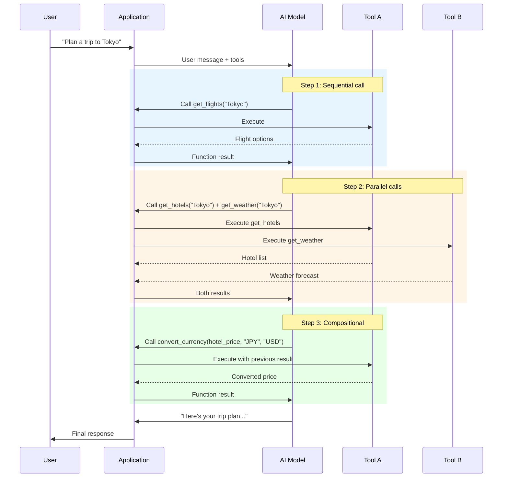

# Multi-Turn Function Calling

## Overview

A single function call is just the beginning. Real-world AI applications rarely finish in one step. A user asks "Plan me a trip to Tokyo" and the model needs to check flights, find hotels, look up weather, convert currency, and book reservations — each step building on the previous one's results. This is multi-turn function calling: extended conversations where the model orchestrates multiple tool invocations across sequential steps, parallel batches, and compositional chains.

In previous lessons, we covered individual function calls and how to return results. Now we zoom out to the full conversation — how models decide which functions to call next, how they handle multiple calls at once, how they chain function outputs as inputs to subsequent calls, and how you maintain coherent state throughout.

Each provider handles multi-turn interactions differently. OpenAI's Responses API supports parallel tool calls and lets you disable them with `parallel_tool_calls: false`. Anthropic returns multiple `tool_use` blocks in a single response and expects matching `tool_result` blocks back. Google Gemini introduces compositional function calling (where the model automatically pipes one function's output into another) and thought signatures (encrypted reasoning state that must be preserved across turns for Gemini 3 models).

This lesson covers all of these patterns — from the basic conversation loop to advanced chain orchestration and provider-specific features like thought signatures.

## Learning objectives

After completing this lesson, you will be able to:

- Manage conversation state across multiple function calling turns
- Implement sequential function call chains with dependency handling
- Handle parallel function calls with concurrent execution and result aggregation
- Use compositional function calling for automatic output-to-input chaining
- Orchestrate multi-step function call chains with loop detection
- Preserve thought signatures for Gemini 3 thinking models
- Maintain context and history across extended function calling conversations

## Lesson contents

| # | Topic | Description |
|---|-------|-------------|
| 01 | [Conversation Flow with Functions](./01-conversation-flow.md) | Message sequence management, state tracking, turn vs. step concepts |
| 02 | [Multiple Sequential Function Calls](./02-sequential-calls.md) | Chain detection, dependency handling, termination conditions |
| 03 | [Parallel Function Calls](./03-parallel-calls.md) | Concurrent execution, result aggregation, disabling parallel calls |
| 04 | [Compositional Function Calling](./04-compositional-calling.md) | Automatic output-to-input chaining, Gemini native support |
| 05 | [Function Call Chains](./05-function-call-chains.md) | Multi-step workflows, intermediate results, loop detection |
| 06 | [Thought Signatures](./06-thought-signatures.md) | Gemini 3 encrypted reasoning state, validation rules, SDK handling |
| 07 | [Maintaining Context Across Calls](./07-maintaining-context.md) | History management, result accumulation, stateful handlers |

## How multi-turn function calling works

## Multi-turn pattern comparison

| Pattern | What happens | When to use | Provider support |
|---------|-------------|-------------|------------------|
| **Sequential** | Model calls functions one at a time, each depending on the previous result | Dependent operations (check stock → place order) | All providers |
| **Parallel** | Model requests multiple independent calls in a single response | Independent queries (weather in 3 cities) | All providers |
| **Compositional** | Model chains function outputs as inputs to subsequent functions automatically | Pipelines (get_location → get_weather) | Gemini (native), others (manual) |
| **Mixed** | Combination of sequential, parallel, and compositional in one conversation | Complex real-world workflows | All providers |

## Provider-specific multi-turn features

| Feature | OpenAI | Anthropic | Google Gemini |
|---------|--------|-----------|---------------|
| **Parallel calls** | Multiple `function_call` items in response | Multiple `tool_use` blocks in response | Multiple `functionCall` parts in response |
| **Disable parallel** | `parallel_tool_calls: false` | Not supported (use `tool_choice`) | Function calling mode config |
| **Compositional** | Manual (loop back results) | Manual (loop back results) | Native in Live API; auto in SDK |
| **Thought signatures** | Reasoning items (pass back) | Not applicable | `thoughtSignature` field (mandatory for Gemini 3) |
| **Max recommended tools** | ≤20 functions | No documented limit | ≤10-20 tools (≤5-10 for Gemini 3) |
| **Stop signal** | `stop_reason: "stop"` or text output | `stop_reason: "end_turn"` | No `functionCall` in response |

> **🤖 AI Context:** Multi-turn function calling is the foundation of AI agents. An agent is essentially a loop: the model calls tools, receives results, and decides what to do next — continuing until the task is complete. Understanding these patterns prepares you for building autonomous AI systems in Unit 11.

## Key terminology

| Term | Definition |
|------|------------|
| **Turn** | A complete user ↔ model exchange, which may span multiple steps |
| **Step** | A single model action within a turn (one function call + result cycle) |
| **Parallel calls** | Multiple independent function calls in a single model response |
| **Sequential calls** | Function calls made one after another, each depending on previous results |
| **Compositional calling** | Model automatically uses one function's output as another function's input |
| **Thought signature** | Encrypted reasoning state from Gemini 3 that must be passed back unchanged |
| **Agentic loop** | The repeat cycle of: model response → execute tools → return results |

---

**Next:** [Conversation Flow with Functions →](./01-conversation-flow.md)

---

[← Previous: Returning Results](../06-returning-results/00-returning-results.md) | [Back to Unit Overview](../00-overview.md)

<!-- 
Sources Consulted:
- OpenAI Function Calling Guide: https://platform.openai.com/docs/guides/function-calling
- Anthropic Tool Use Overview: https://platform.claude.com/docs/en/agents-and-tools/tool-use/overview
- Gemini Function Calling Tutorial: https://ai.google.dev/gemini-api/docs/function-calling
- Gemini Thought Signatures: https://ai.google.dev/gemini-api/docs/thought-signatures
-->
