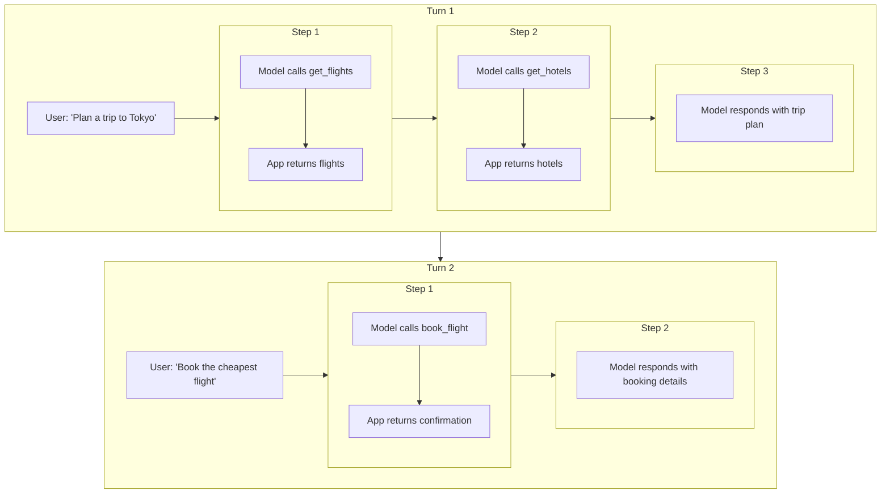

# Conversation Flow with Functions

## Introduction

Every function calling interaction follows a conversation flow — a structured sequence of messages between your application, the AI model, and your tools. Understanding this flow is essential because each provider structures conversations differently, and getting the message sequence wrong means broken API calls, lost context, or infinite loops.

In a simple chatbot, conversation is just user → assistant → user → assistant. Function calling adds new message types to this pattern: tool calls from the model, tool results from your application, and in some cases, reasoning artifacts that must be preserved. A single user question like "What's the weather in London and Tokyo?" might generate a conversation with 6+ messages before the user sees a response.

### What we'll cover

- How turns and steps structure a function calling conversation
- The message sequence each provider expects
- State tracking across multi-step interactions
- Building the conversation loop that drives function calling

### Prerequisites

- Completed [Returning Results](../06-returning-results/00-returning-results.md) lesson
- Understanding of provider-specific result formats
- Familiarity with the basic function calling cycle

---

## Turns vs. steps

Before diving into provider-specific flows, we need to establish two key concepts that govern multi-turn function calling: **turns** and **steps**.

A **turn** is a complete exchange initiated by a user message. Everything that happens before the next user message belongs to the same turn — even if the model makes 5 function calls in between.

A **step** is a single action within a turn. Each function call and its corresponding result is one step.



> **Note:** This distinction matters especially for Google Gemini, where thought signatures are validated per-turn. All function call signatures within the current turn must be preserved, but previous turns' signatures aren't validated.

---

## The universal function calling loop

Despite their API differences, all three providers follow the same conceptual loop:

```
1. Send user message + tool definitions to the model
2. Receive model response
3. Check: did the model request function calls?
   - YES → Execute functions, append results, go to step 2
   - NO  → Return the model's text response to the user
```

This is the **agentic loop** — the fundamental pattern behind every function calling implementation. Here's the logic in pseudocode:

```python
def function_calling_loop(messages: list, tools: list) -> str:
    """The universal agentic loop."""
    while True:
        # Send conversation to model
        response = call_model(messages, tools)
        
        # Check if model wants to call functions
        if has_function_calls(response):
            # Execute each function call
            for call in get_function_calls(response):
                result = execute_function(call)
                append_result(messages, call, result)
        else:
            # Model is done — return text response
            return get_text_response(response)
```

The differences between providers lie in *how* each step works — what the messages look like, how function calls are signaled, and how results are formatted.

---

## OpenAI conversation flow

OpenAI's Responses API uses a flat list of **items** rather than alternating `user`/`assistant` messages. Function calls appear as `function_call` items, and results are `function_call_output` items.

### Message sequence

```
Request:  [user message] + [tool definitions]
Response: [function_call item(s)]
Request:  [previous input] + [function_call items] + [function_call_output items]
Response: [text output] or [more function_call items]
```

### How the model signals function calls

The model includes one or more `function_call` items in the `output` array. Each has a `call_id`, `name`, and `arguments`:

```python
from openai import OpenAI

client = OpenAI()

tools = [
    {
        "type": "function",
        "name": "get_weather",
        "description": "Get current weather for a city",
        "parameters": {
            "type": "object",
            "properties": {
                "city": {"type": "string", "description": "City name"}
            },
            "required": ["city"]
        }
    },
    {
        "type": "function",
        "name": "get_time",
        "description": "Get current time in a timezone",
        "parameters": {
            "type": "object",
            "properties": {
                "timezone": {"type": "string", "description": "IANA timezone"}
            },
            "required": ["timezone"]
        }
    }
]

response = client.responses.create(
    model="gpt-4.1",
    tools=tools,
    input=[{"role": "user", "content": "What's the weather and time in London?"}]
)

# Check for function calls in the output
for item in response.output:
    if item.type == "function_call":
        print(f"Call: {item.name}({item.arguments})")
        print(f"ID:   {item.call_id}")
```

**Output:**
```
Call: get_weather({"city": "London"})
ID:   call_abc123
Call: get_time({"timezone": "Europe/London"})
ID:   call_def456
```

### How to continue the conversation

Append the model's function call items and your results to the input, then send again:

```python
import json

# Start with original input
input_items = [
    {"role": "user", "content": "What's the weather and time in London?"}
]

# Add model's output items (function calls) to input
input_items.extend(response.output)

# Add function results
input_items.append({
    "type": "function_call_output",
    "call_id": "call_abc123",
    "output": json.dumps({"temp": 15, "condition": "cloudy"})
})
input_items.append({
    "type": "function_call_output",
    "call_id": "call_def456",
    "output": json.dumps({"time": "14:30 GMT"})
})

# Send back to model
response2 = client.responses.create(
    model="gpt-4.1",
    tools=tools,
    input=input_items
)

# This time we get text output
print(response2.output_text)
```

**Output:**
```
In London right now, it's 14:30 GMT with cloudy skies and a temperature of 15°C.
```

### Detecting conversation completion

OpenAI signals completion when the output contains a `message` item (text) instead of `function_call` items:

```python
def is_complete(response) -> bool:
    """Check if the model has finished calling functions."""
    return not any(
        item.type == "function_call" 
        for item in response.output
    )
```

---

## Anthropic conversation flow

Anthropic uses strict `user`/`assistant` message alternation. The model's function calls appear as `tool_use` content blocks within an `assistant` message, and your results go in a `user` message as `tool_result` blocks.

### Message sequence

```
Messages: [user message]
Response: assistant message with [tool_use block(s)]  (stop_reason: "tool_use")
Messages: [user] + [assistant with tool_use] + [user with tool_result(s)]
Response: assistant message with [text]  (stop_reason: "end_turn")
```

### How the model signals function calls

The response `stop_reason` is `"tool_use"` and the `content` array contains `tool_use` blocks:

```python
import anthropic
import json

client = anthropic.Anthropic()

tools = [
    {
        "name": "get_weather",
        "description": "Get current weather for a city",
        "input_schema": {
            "type": "object",
            "properties": {
                "city": {"type": "string", "description": "City name"}
            },
            "required": ["city"]
        }
    },
    {
        "name": "get_time",
        "description": "Get current time in a timezone",
        "input_schema": {
            "type": "object",
            "properties": {
                "timezone": {"type": "string", "description": "IANA timezone"}
            },
            "required": ["timezone"]
        }
    }
]

response = client.messages.create(
    model="claude-sonnet-4-20250514",
    max_tokens=1024,
    tools=tools,
    messages=[
        {"role": "user", "content": "What's the weather and time in London?"}
    ]
)

print(f"Stop reason: {response.stop_reason}")
for block in response.content:
    if block.type == "tool_use":
        print(f"Call: {block.name}({json.dumps(block.input)})")
        print(f"ID:   {block.id}")
```

**Output:**
```
Stop reason: tool_use
Call: get_weather({"city": "London"})
ID:   toolu_01ABC
Call: get_time({"timezone": "Europe/London"})
ID:   toolu_02DEF
```

### How to continue the conversation

You must maintain the strict `user` → `assistant` → `user` alternation. The assistant's response (with `tool_use` blocks) becomes part of the message history, and you add a new `user` message with `tool_result` blocks:

```python
messages = [
    {"role": "user", "content": "What's the weather and time in London?"},
    # Include the assistant's full response
    {"role": "assistant", "content": response.content},
    # Add tool results in a user message
    {
        "role": "user",
        "content": [
            {
                "type": "tool_result",
                "tool_use_id": "toolu_01ABC",
                "content": json.dumps({"temp": 15, "condition": "cloudy"})
            },
            {
                "type": "tool_result",
                "tool_use_id": "toolu_02DEF",
                "content": json.dumps({"time": "14:30 GMT"})
            }
        ]
    }
]

response2 = client.messages.create(
    model="claude-sonnet-4-20250514",
    max_tokens=1024,
    tools=tools,
    messages=messages
)

print(response2.content[0].text)
```

**Output:**
```
In London right now, it's 14:30 GMT with cloudy skies and a temperature of 15°C.
```

> **Warning:** Anthropic requires strict message alternation. You cannot send two `user` messages in a row or two `assistant` messages in a row. Every `tool_result` must be in a `user` message that directly follows the `assistant` message containing the corresponding `tool_use`.

### Detecting conversation completion

```python
def is_complete(response) -> bool:
    """Check if Claude has finished calling tools."""
    return response.stop_reason == "end_turn"
```

---

## Google Gemini conversation flow

Gemini uses `user`/`model` role alternation with `Part` objects. Function calls are `functionCall` parts in the model response, and results are `functionResponse` parts in a user message.

### Message sequence

```
Contents: [user part]
Response: model parts with [functionCall(s)]
Contents: [user] + [model with functionCall] + [user with functionResponse(s)]
Response: model parts with [text]  (no functionCall parts)
```

### How the model signals function calls

```python
from google import genai
from google.genai import types

client = genai.Client()

# Define tools
get_weather = types.FunctionDeclaration(
    name="get_weather",
    description="Get current weather for a city",
    parameters=types.Schema(
        type="OBJECT",
        properties={
            "city": types.Schema(type="STRING", description="City name")
        },
        required=["city"]
    )
)

get_time = types.FunctionDeclaration(
    name="get_time",
    description="Get current time in a timezone",
    parameters=types.Schema(
        type="OBJECT",
        properties={
            "timezone": types.Schema(type="STRING", description="IANA timezone")
        },
        required=["timezone"]
    )
)

tool = types.Tool(function_declarations=[get_weather, get_time])

response = client.models.generate_content(
    model="gemini-2.5-flash",
    contents="What's the weather and time in London?",
    config=types.GenerateContentConfig(tools=[tool])
)

# Check for function calls
for part in response.candidates[0].content.parts:
    if part.function_call:
        print(f"Call: {part.function_call.name}({part.function_call.args})")
```

**Output:**
```
Call: get_weather({'city': 'London'})
Call: get_time({'timezone': 'Europe/London'})
```

### How to continue the conversation

Build the full conversation history including the model's function call parts and your function response parts:

```python
# Build conversation history
contents = [
    types.Content(
        role="user",
        parts=[types.Part.from_text("What's the weather and time in London?")]
    ),
    # Model's response with function calls
    response.candidates[0].content,
    # Our function responses
    types.Content(
        role="user",
        parts=[
            types.Part.from_function_response(
                name="get_weather",
                response={"temp": 15, "condition": "cloudy"}
            ),
            types.Part.from_function_response(
                name="get_time",
                response={"time": "14:30 GMT"}
            )
        ]
    )
]

response2 = client.models.generate_content(
    model="gemini-2.5-flash",
    contents=contents,
    config=types.GenerateContentConfig(tools=[tool])
)

print(response2.text)
```

**Output:**
```
In London right now, it's 14:30 GMT with cloudy skies and a temperature of 15°C.
```

### Detecting conversation completion

```python
def is_complete(response) -> bool:
    """Check if Gemini has finished calling functions."""
    return not any(
        part.function_call 
        for part in response.candidates[0].content.parts
    )
```

---

## State tracking in the conversation loop

Every function calling loop needs to track state — not just the messages, but also metadata about the conversation's progress:

```python
from dataclasses import dataclass, field
from typing import Any


@dataclass
class ConversationState:
    """Track state across a function calling conversation."""
    
    # Message history (provider-specific format)
    messages: list = field(default_factory=list)
    
    # Tracking metadata
    total_steps: int = 0
    function_calls_made: list[dict] = field(default_factory=list)
    errors_encountered: int = 0
    consecutive_errors: int = 0
    
    # Safety limits
    max_steps: int = 10
    max_consecutive_errors: int = 3
    
    def record_function_call(self, name: str, args: dict, result: Any) -> None:
        """Record a function call for tracking."""
        self.total_steps += 1
        self.function_calls_made.append({
            "step": self.total_steps,
            "function": name,
            "args": args,
            "result_preview": str(result)[:200]
        })
    
    def record_error(self) -> None:
        """Record an error and check limits."""
        self.errors_encountered += 1
        self.consecutive_errors += 1
    
    def reset_error_streak(self) -> None:
        """Reset consecutive error count on success."""
        self.consecutive_errors = 0
    
    def should_stop(self) -> bool:
        """Check if we should stop the loop."""
        if self.total_steps >= self.max_steps:
            return True
        if self.consecutive_errors >= self.max_consecutive_errors:
            return True
        return False
    
    def summary(self) -> str:
        """Get a summary of the conversation's function calls."""
        calls = [
            f"  Step {c['step']}: {c['function']}({c['args']})"
            for c in self.function_calls_made
        ]
        return f"Total steps: {self.total_steps}\n" + "\n".join(calls)
```

**Usage:**
```python
state = ConversationState(max_steps=15)

# In your loop:
state.record_function_call("get_weather", {"city": "London"}, {"temp": 15})
state.reset_error_streak()

if state.should_stop():
    print("Safety limit reached — stopping loop")

print(state.summary())
```

**Output:**
```
Total steps: 1
  Step 1: get_weather({'city': 'London'})
```

---

## Turn management across user messages

When the conversation spans multiple user messages (true multi-turn), you need to manage the conversation history carefully. Each new user message starts a new turn, but the full history must be preserved:

```python
class MultiTurnManager:
    """Manage a multi-turn function calling conversation."""
    
    def __init__(self, client, model: str, tools: list):
        self.client = client
        self.model = model
        self.tools = tools
        self.messages = []
        self.state = ConversationState()
    
    def send_message(self, user_message: str) -> str:
        """Send a user message and handle all function calls."""
        # Add user message
        self.messages.append({
            "role": "user", 
            "content": user_message
        })
        
        # Reset state for new turn
        self.state.consecutive_errors = 0
        
        # Enter the function calling loop
        while not self.state.should_stop():
            response = self._call_model()
            
            if self._has_function_calls(response):
                self._handle_function_calls(response)
            else:
                # Got text response — turn is complete
                text = self._extract_text(response)
                self.messages.append({
                    "role": "assistant",
                    "content": text
                })
                return text
        
        return "I reached my processing limit. Please try a simpler request."
    
    def _call_model(self):
        """Call the model with current conversation state."""
        # Provider-specific implementation
        raise NotImplementedError
    
    def _has_function_calls(self, response) -> bool:
        """Check if response contains function calls."""
        raise NotImplementedError
    
    def _handle_function_calls(self, response) -> None:
        """Execute function calls and append results."""
        raise NotImplementedError
    
    def _extract_text(self, response) -> str:
        """Extract text from model response."""
        raise NotImplementedError
```

> **Tip:** The `MultiTurnManager` pattern separates conversation management from provider-specific API details. In production, you would create provider-specific subclasses that implement the abstract methods.

---

## Best practices

| Practice | Why it matters |
|----------|----------------|
| Always set a max steps limit | Prevents infinite loops and runaway costs |
| Track consecutive errors | Three errors in a row usually means a systemic problem |
| Preserve the full conversation history | Models need previous context to make good decisions |
| Log every function call and result | Essential for debugging multi-step failures |
| Use the provider's native message format | Mixing formats causes silent failures |
| Check `stop_reason` (not just content) | The most reliable way to detect completion |

---

## Common pitfalls

| ❌ Mistake | ✅ Solution |
|-----------|-------------|
| Breaking Anthropic's `user`/`assistant` alternation | Always put `tool_result` blocks in a `user` message after the `assistant` response |
| Forgetting to include the model's function call in history | Append the model's full response (including `function_call` items) before adding results |
| Not setting a max iteration limit | Always cap your loop (10-25 steps is reasonable for most use cases) |
| Checking only for text to detect completion | Use `stop_reason` or absence of function calls — some responses include both text and calls |
| Resetting conversation history between steps | Keep the full history — the model needs it for context |

---

## Hands-on exercise

### Your task

Build a provider-agnostic conversation tracker that logs every step of a function calling conversation and enforces safety limits.

### Requirements

1. Create a `ConversationTracker` class that records each step (function name, arguments, result, timestamp)
2. Implement `should_continue()` that checks: max steps, max errors, and whether the same function was called with the same arguments more than twice
3. Add a `get_transcript()` method that returns a human-readable log of the conversation
4. Test it by simulating a 5-step conversation

### Expected result

A tracker that outputs a formatted transcript and correctly stops when limits are reached.

<details>
<summary>💡 Hints</summary>

- Use `dataclasses` with `field(default_factory=list)` for mutable defaults
- Track function calls as a list of dicts with `name`, `args`, `result`, and `timestamp`
- For duplicate detection, compare `(name, json.dumps(args, sort_keys=True))` tuples
- Use `datetime.now().isoformat()` for timestamps

</details>

<details>
<summary>✅ Solution</summary>

```python
import json
from dataclasses import dataclass, field
from datetime import datetime


@dataclass
class ConversationTracker:
    """Track and enforce limits on function calling conversations."""
    
    max_steps: int = 10
    max_errors: int = 3
    max_duplicate_calls: int = 2
    
    steps: list[dict] = field(default_factory=list)
    errors: int = 0
    
    def record_step(
        self, 
        function_name: str, 
        args: dict, 
        result: dict, 
        is_error: bool = False
    ) -> None:
        """Record a function call step."""
        self.steps.append({
            "step": len(self.steps) + 1,
            "function": function_name,
            "args": args,
            "result": result,
            "is_error": is_error,
            "timestamp": datetime.now().isoformat()
        })
        if is_error:
            self.errors += 1
    
    def should_continue(self) -> tuple[bool, str]:
        """Check if the conversation should continue."""
        if len(self.steps) >= self.max_steps:
            return False, f"Max steps reached ({self.max_steps})"
        
        if self.errors >= self.max_errors:
            return False, f"Max errors reached ({self.max_errors})"
        
        # Check for duplicate calls
        call_counts: dict[str, int] = {}
        for step in self.steps:
            key = f"{step['function']}:{json.dumps(step['args'], sort_keys=True)}"
            call_counts[key] = call_counts.get(key, 0) + 1
            if call_counts[key] > self.max_duplicate_calls:
                return False, f"Duplicate call detected: {step['function']}"
        
        return True, "OK"
    
    def get_transcript(self) -> str:
        """Get a formatted transcript of the conversation."""
        lines = ["=== Conversation Transcript ===\n"]
        for step in self.steps:
            status = "❌ ERROR" if step["is_error"] else "✅ OK"
            lines.append(
                f"Step {step['step']}: {step['function']}({step['args']}) "
                f"→ {status}"
            )
            lines.append(f"  Result: {json.dumps(step['result'])}")
            lines.append(f"  Time:   {step['timestamp']}\n")
        
        lines.append(f"Total steps: {len(self.steps)}")
        lines.append(f"Errors: {self.errors}")
        can_continue, reason = self.should_continue()
        lines.append(f"Can continue: {can_continue} ({reason})")
        
        return "\n".join(lines)


# Test the tracker
tracker = ConversationTracker(max_steps=10, max_errors=3)

# Simulate a 5-step conversation
tracker.record_step("get_flights", {"dest": "Tokyo"}, {"flights": ["JAL", "ANA"]})
tracker.record_step("get_hotels", {"city": "Tokyo"}, {"hotels": ["Park Hyatt"]})
tracker.record_step("get_weather", {"city": "Tokyo"}, {"temp": 22, "condition": "sunny"})
tracker.record_step("convert_currency", {"amount": 50000, "from": "JPY", "to": "USD"}, {"converted": 340})
tracker.record_step("book_flight", {"flight": "JAL-101"}, {"error": "sold out"}, is_error=True)

print(tracker.get_transcript())
```

**Output:**
```
=== Conversation Transcript ===

Step 1: get_flights({'dest': 'Tokyo'}) → ✅ OK
  Result: {"flights": ["JAL", "ANA"]}
  Time:   2025-01-15T10:30:00.123456

Step 2: get_hotels({'city': 'Tokyo'}) → ✅ OK
  Result: {"hotels": ["Park Hyatt"]}
  Time:   2025-01-15T10:30:01.234567

Step 3: get_weather({'city': 'Tokyo'}) → ✅ OK
  Result: {"temp": 22, "condition": "sunny"}
  Time:   2025-01-15T10:30:02.345678

Step 4: convert_currency({'amount': 50000, 'from': 'JPY', 'to': 'USD'}) → ✅ OK
  Result: {"converted": 340}
  Time:   2025-01-15T10:30:03.456789

Step 5: book_flight({'flight': 'JAL-101'}) → ❌ ERROR
  Result: {"error": "sold out"}
  Time:   2025-01-15T10:30:04.567890

Total steps: 5
Errors: 1
Can continue: True (OK)
```

</details>

### Bonus challenges

- [ ] Add a `get_call_graph()` method that shows which functions were called in what order using arrows (e.g., `get_flights → get_hotels → get_weather`)
- [ ] Implement rate limiting — no more than 5 function calls per 10-second window

---

## Summary

✅ Function calling conversations are structured as **turns** (user-initiated exchanges) containing multiple **steps** (individual function calls)

✅ All providers follow the same conceptual loop: send → check for calls → execute → return results → repeat

✅ OpenAI uses a flat item list, Anthropic uses strict `user`/`assistant` alternation, Gemini uses `Content` objects with `Part` arrays

✅ State tracking (step counts, error counts, call history) is essential for safe, debuggable multi-turn conversations

✅ Always set maximum iteration limits and track consecutive errors to prevent infinite loops

**Next:** [Multiple Sequential Function Calls →](./02-sequential-calls.md) — How models chain function calls where each depends on the previous result

---

[← Previous: Lesson Overview](./00-multi-turn-function-calling.md) | [Back to Lesson Overview](./00-multi-turn-function-calling.md)

<!-- 
Sources Consulted:
- OpenAI Function Calling Guide: https://platform.openai.com/docs/guides/function-calling
- Anthropic Tool Use Overview: https://platform.claude.com/docs/en/agents-and-tools/tool-use/overview
- Gemini Function Calling Tutorial: https://ai.google.dev/gemini-api/docs/function-calling
- Gemini Thought Signatures: https://ai.google.dev/gemini-api/docs/thought-signatures
-->
