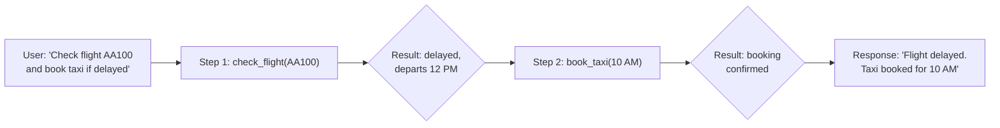

# Multiple Sequential Function Calls

## Introduction

Sequential function calling is the most common multi-turn pattern. The model makes one function call, waits for the result, then decides what to call next based on what it learned. Each call depends on the previous call's output — you can't check a flight's gate number until you've looked up the flight status, and you can't book a taxi to the airport until you know the departure time.

This dependency chain is what separates sequential calls from parallel calls. In a parallel scenario, the model requests everything at once because the calls are independent. In a sequential scenario, the model *must* wait — it needs data from step 1 before it can formulate step 2.

### What we'll cover

- How models decide to make sequential function calls
- Detecting and handling dependency chains across providers
- Managing intermediate state between calls
- Setting termination conditions to prevent runaway loops

### Prerequisites

- Understanding of the [conversation flow](./01-conversation-flow.md) and agentic loop
- Familiarity with function call and result formats for all three providers

---

## How sequential calls work

In a sequential function calling scenario, the model's reasoning follows a chain:



The model doesn't know it needs to call `book_taxi` until it sees that the flight is delayed. Each step's output informs the next step's decision.

### The decision process

After receiving each function result, the model evaluates:

1. **Do I have enough information to answer the user?** → If yes, generate text response
2. **Do I need more data?** → If yes, make another function call
3. **Has something changed the plan?** → Adapt (e.g., flight not delayed → skip taxi)

This evaluation happens automatically — you don't need to tell the model to "check the result and decide." The model's training enables it to reason about when to continue and when to stop.

---

## Sequential calls with OpenAI

With the Responses API, sequential calls happen naturally in the agentic loop. The model returns one (or more) `function_call` items, you execute them and return results, and the model either calls more functions or responds with text.

```python
from openai import OpenAI
import json

client = OpenAI()

tools = [
    {
        "type": "function",
        "name": "check_flight",
        "description": "Check the status of a flight by flight number",
        "parameters": {
            "type": "object",
            "properties": {
                "flight_number": {
                    "type": "string",
                    "description": "Flight number like AA100"
                }
            },
            "required": ["flight_number"]
        }
    },
    {
        "type": "function",
        "name": "book_taxi",
        "description": "Book a taxi for a given time",
        "parameters": {
            "type": "object",
            "properties": {
                "pickup_time": {
                    "type": "string",
                    "description": "Pickup time, e.g. '10:00 AM'"
                },
                "destination": {
                    "type": "string",
                    "description": "Where to go"
                }
            },
            "required": ["pickup_time", "destination"]
        }
    }
]

# Simulated function implementations
def check_flight(flight_number: str) -> dict:
    """Simulate checking a flight status."""
    return {
        "flight": flight_number,
        "status": "delayed",
        "original_departure": "10:00 AM",
        "new_departure": "12:00 PM",
        "gate": "B42"
    }

def book_taxi(pickup_time: str, destination: str) -> dict:
    """Simulate booking a taxi."""
    return {
        "confirmation": "TAXI-7829",
        "pickup_time": pickup_time,
        "destination": destination,
        "estimated_fare": "$35"
    }

available_functions = {
    "check_flight": check_flight,
    "book_taxi": book_taxi
}

def run_sequential_openai():
    """Demonstrate sequential function calling with OpenAI."""
    input_items = [
        {
            "role": "user",
            "content": "Check flight AA100. If it's delayed, book a taxi "
                       "to the airport 2 hours before the new departure time."
        }
    ]
    
    step = 0
    max_steps = 5
    
    while step < max_steps:
        step += 1
        print(f"\n--- Step {step} ---")
        
        response = client.responses.create(
            model="gpt-4.1",
            tools=tools,
            input=input_items
        )
        
        # Collect function calls from output
        function_calls = [
            item for item in response.output
            if item.type == "function_call"
        ]
        
        if not function_calls:
            # No more function calls — model is responding with text
            print(f"Final response: {response.output_text}")
            return response.output_text
        
        # Execute each function call
        # Add model's output to input for next round
        input_items.extend(response.output)
        
        for call in function_calls:
            args = json.loads(call.arguments)
            print(f"Calling: {call.name}({args})")
            
            # Execute the function
            result = available_functions[call.name](**args)
            print(f"Result:  {result}")
            
            # Append result
            input_items.append({
                "type": "function_call_output",
                "call_id": call.call_id,
                "output": json.dumps(result)
            })
    
    print("Max steps reached")
    return None

# Run the example
# run_sequential_openai()
```

**Expected output:**
```
--- Step 1 ---
Calling: check_flight({'flight_number': 'AA100'})
Result:  {'flight': 'AA100', 'status': 'delayed', 'new_departure': '12:00 PM', ...}

--- Step 2 ---
Calling: book_taxi({'pickup_time': '10:00 AM', 'destination': 'airport'})
Result:  {'confirmation': 'TAXI-7829', 'pickup_time': '10:00 AM', ...}

--- Step 3 ---
Final response: Your flight AA100 is delayed. The new departure is 12:00 PM from gate B42. I've booked a taxi (confirmation TAXI-7829) to pick you up at 10:00 AM for $35.
```

Notice how the model:
1. First calls `check_flight` to get the flight status
2. Sees the flight is delayed with a new departure at 12:00 PM
3. Calculates 2 hours before (10:00 AM) and calls `book_taxi`
4. Combines both results into a final response

---

## Sequential calls with Anthropic

Anthropic's flow is identical in concept but uses `tool_use`/`tool_result` blocks with strict message alternation:

```python
import anthropic
import json

client = anthropic.Anthropic()

tools = [
    {
        "name": "check_flight",
        "description": "Check the status of a flight by flight number",
        "input_schema": {
            "type": "object",
            "properties": {
                "flight_number": {
                    "type": "string",
                    "description": "Flight number like AA100"
                }
            },
            "required": ["flight_number"]
        }
    },
    {
        "name": "book_taxi",
        "description": "Book a taxi for a given time",
        "input_schema": {
            "type": "object",
            "properties": {
                "pickup_time": {
                    "type": "string",
                    "description": "Pickup time, e.g. '10:00 AM'"
                },
                "destination": {
                    "type": "string",
                    "description": "Where to go"
                }
            },
            "required": ["pickup_time", "destination"]
        }
    }
]

def run_sequential_anthropic():
    """Demonstrate sequential function calling with Anthropic."""
    messages = [
        {
            "role": "user",
            "content": "Check flight AA100. If it's delayed, book a taxi "
                       "to the airport 2 hours before the new departure time."
        }
    ]
    
    step = 0
    max_steps = 5
    
    while step < max_steps:
        step += 1
        print(f"\n--- Step {step} ---")
        
        response = client.messages.create(
            model="claude-sonnet-4-20250514",
            max_tokens=1024,
            tools=tools,
            messages=messages
        )
        
        # Check if model wants to use tools
        if response.stop_reason != "tool_use":
            # Model is done — extract text
            text = next(
                block.text for block in response.content
                if hasattr(block, "text")
            )
            print(f"Final response: {text}")
            return text
        
        # Add assistant response to history
        messages.append({
            "role": "assistant",
            "content": response.content
        })
        
        # Process tool calls and collect results
        tool_results = []
        for block in response.content:
            if block.type == "tool_use":
                print(f"Calling: {block.name}({block.input})")
                result = available_functions[block.name](**block.input)
                print(f"Result:  {result}")
                
                tool_results.append({
                    "type": "tool_result",
                    "tool_use_id": block.id,
                    "content": json.dumps(result)
                })
        
        # Add tool results as a user message (Anthropic requires this)
        messages.append({
            "role": "user",
            "content": tool_results
        })
    
    print("Max steps reached")
    return None

# run_sequential_anthropic()
```

**Expected output:**
```
--- Step 1 ---
Calling: check_flight({'flight_number': 'AA100'})
Result:  {'flight': 'AA100', 'status': 'delayed', 'new_departure': '12:00 PM', ...}

--- Step 2 ---
Calling: book_taxi({'pickup_time': '10:00 AM', 'destination': 'airport'})
Result:  {'confirmation': 'TAXI-7829', ...}

--- Step 3 ---
Final response: Your flight AA100 is delayed...
```

> **Important:** With Anthropic, the model might include both a `text` block and a `tool_use` block in the same response. The `text` block contains the model's reasoning (e.g., "The flight is delayed, so I'll book a taxi"). Check `stop_reason`, not the presence of text, to determine if the model is done.

---

## Sequential calls with Google Gemini

Gemini follows the same pattern using `functionCall` and `functionResponse` parts:

```python
from google import genai
from google.genai import types
import json

client = genai.Client()

check_flight_decl = types.FunctionDeclaration(
    name="check_flight",
    description="Check the status of a flight by flight number",
    parameters=types.Schema(
        type="OBJECT",
        properties={
            "flight_number": types.Schema(
                type="STRING",
                description="Flight number like AA100"
            )
        },
        required=["flight_number"]
    )
)

book_taxi_decl = types.FunctionDeclaration(
    name="book_taxi",
    description="Book a taxi for a given time",
    parameters=types.Schema(
        type="OBJECT",
        properties={
            "pickup_time": types.Schema(
                type="STRING",
                description="Pickup time"
            ),
            "destination": types.Schema(
                type="STRING",
                description="Where to go"
            )
        },
        required=["pickup_time", "destination"]
    )
)

tool = types.Tool(function_declarations=[check_flight_decl, book_taxi_decl])

def run_sequential_gemini():
    """Demonstrate sequential function calling with Gemini."""
    contents = [
        types.Content(
            role="user",
            parts=[types.Part.from_text(
                "Check flight AA100. If it's delayed, book a taxi "
                "to the airport 2 hours before the new departure time."
            )]
        )
    ]
    
    config = types.GenerateContentConfig(tools=[tool])
    step = 0
    max_steps = 5
    
    while step < max_steps:
        step += 1
        print(f"\n--- Step {step} ---")
        
        response = client.models.generate_content(
            model="gemini-2.5-flash",
            contents=contents,
            config=config
        )
        
        # Check for function calls
        function_calls = [
            part for part in response.candidates[0].content.parts
            if part.function_call
        ]
        
        if not function_calls:
            print(f"Final response: {response.text}")
            return response.text
        
        # Add model response to history
        contents.append(response.candidates[0].content)
        
        # Execute and collect function responses
        response_parts = []
        for part in function_calls:
            fc = part.function_call
            args = dict(fc.args)
            print(f"Calling: {fc.name}({args})")
            
            result = available_functions[fc.name](**args)
            print(f"Result:  {result}")
            
            response_parts.append(
                types.Part.from_function_response(
                    name=fc.name,
                    response=result
                )
            )
        
        # Add function responses as user content
        contents.append(types.Content(
            role="user",
            parts=response_parts
        ))
    
    print("Max steps reached")
    return None

# run_sequential_gemini()
```

---

## Detecting dependency chains

Not all multi-step scenarios are sequential — some function calls are independent and could run in parallel. The key question is: **does step N need data from step N-1?**

```python
def analyze_call_dependencies(calls: list[dict]) -> dict:
    """Analyze whether function calls have dependencies.
    
    Args:
        calls: List of {"name": str, "args": dict, "result": dict}
    
    Returns:
        Analysis of dependencies between calls
    """
    dependencies = []
    
    for i, current in enumerate(calls):
        for j, previous in enumerate(calls[:i]):
            # Check if current call's args reference previous result values
            current_args_str = json.dumps(current["args"])
            previous_result_str = json.dumps(previous["result"])
            
            # Simple check: do any values from previous result 
            # appear in current args?
            for key, value in previous["result"].items():
                if isinstance(value, str) and value in current_args_str:
                    dependencies.append({
                        "step": i + 1,
                        "depends_on": j + 1,
                        "function": current["name"],
                        "uses_field": key,
                        "from_function": previous["name"]
                    })
    
    return {
        "total_calls": len(calls),
        "dependencies": dependencies,
        "is_sequential": len(dependencies) > 0,
        "could_parallelize": len(dependencies) == 0
    }


# Example: dependent calls
calls = [
    {
        "name": "check_flight",
        "args": {"flight_number": "AA100"},
        "result": {"status": "delayed", "new_departure": "12:00 PM"}
    },
    {
        "name": "book_taxi",
        "args": {"pickup_time": "10:00 AM", "destination": "airport"},
        "result": {"confirmation": "TAXI-7829"}
    }
]

analysis = analyze_call_dependencies(calls)
print(f"Sequential: {analysis['is_sequential']}")
print(f"Dependencies: {analysis['dependencies']}")
```

**Output:**
```
Sequential: False
Dependencies: []
```

> **Note:** In practice, dependency detection is difficult to automate perfectly because the model transforms data between calls (e.g., "12:00 PM" becomes "10:00 AM" after subtracting 2 hours). The model handles dependency reasoning internally — this analysis is primarily useful for logging and understanding patterns.

---

## Handling intermediate state

Between sequential calls, you often need to track intermediate results for logging, debugging, or passing to subsequent business logic:

```python
class SequentialCallHandler:
    """Handle sequential function calls with intermediate state tracking."""
    
    def __init__(self):
        self.intermediate_results: list[dict] = []
        self.call_chain: list[str] = []
    
    def execute_and_track(
        self, 
        function_name: str, 
        args: dict, 
        executor: callable
    ) -> dict:
        """Execute a function call and track the intermediate result."""
        result = executor(**args)
        
        self.call_chain.append(function_name)
        self.intermediate_results.append({
            "step": len(self.intermediate_results) + 1,
            "function": function_name,
            "args": args,
            "result": result,
            "chain_so_far": " → ".join(self.call_chain)
        })
        
        return result
    
    def get_chain_summary(self) -> str:
        """Get a summary of the call chain."""
        return " → ".join(self.call_chain)
    
    def get_result_at_step(self, step: int) -> dict | None:
        """Retrieve the result from a specific step."""
        if 0 < step <= len(self.intermediate_results):
            return self.intermediate_results[step - 1]["result"]
        return None


# Usage
handler = SequentialCallHandler()

# Step 1
result1 = handler.execute_and_track(
    "check_flight", 
    {"flight_number": "AA100"}, 
    check_flight
)

# Step 2 (uses data from step 1)
result2 = handler.execute_and_track(
    "book_taxi",
    {"pickup_time": "10:00 AM", "destination": "airport"},
    book_taxi
)

print(f"Chain: {handler.get_chain_summary()}")
print(f"Step 1 result: {handler.get_result_at_step(1)}")
```

**Output:**
```
Chain: check_flight → book_taxi
Step 1 result: {'flight': 'AA100', 'status': 'delayed', 'new_departure': '12:00 PM', 'gate': 'B42'}
```

---

## Termination conditions

Sequential calls need clear termination rules. Without them, a model might keep calling functions indefinitely — especially if it encounters errors or ambiguous results:

```python
from enum import Enum


class TerminationReason(Enum):
    """Reasons why a sequential call chain stopped."""
    COMPLETED = "completed"          # Model responded with text
    MAX_STEPS = "max_steps"          # Hit step limit
    MAX_ERRORS = "max_errors"        # Too many errors
    DUPLICATE_CALL = "duplicate"     # Same call repeated
    USER_CANCEL = "user_cancel"      # User interrupted
    TIMEOUT = "timeout"              # Time limit exceeded


class TerminationChecker:
    """Check various termination conditions for sequential calls."""
    
    def __init__(
        self,
        max_steps: int = 10,
        max_errors: int = 3,
        max_duplicate_calls: int = 2,
        timeout_seconds: float = 60.0
    ):
        self.max_steps = max_steps
        self.max_errors = max_errors
        self.max_duplicate_calls = max_duplicate_calls
        self.timeout_seconds = timeout_seconds
        
        self.steps = 0
        self.errors = 0
        self.call_history: list[str] = []
        self.start_time = None
    
    def start(self) -> None:
        """Start the timer."""
        import time
        self.start_time = time.time()
    
    def record_call(self, function_name: str, args: dict) -> None:
        """Record a function call."""
        self.steps += 1
        key = f"{function_name}:{json.dumps(args, sort_keys=True)}"
        self.call_history.append(key)
    
    def record_error(self) -> None:
        """Record an error."""
        self.errors += 1
    
    def check(self) -> tuple[bool, TerminationReason | None]:
        """Check if we should terminate.
        
        Returns:
            (should_continue, reason_if_stopping)
        """
        import time
        
        if self.steps >= self.max_steps:
            return False, TerminationReason.MAX_STEPS
        
        if self.errors >= self.max_errors:
            return False, TerminationReason.MAX_ERRORS
        
        # Check for duplicate calls
        from collections import Counter
        counts = Counter(self.call_history)
        for call, count in counts.items():
            if count > self.max_duplicate_calls:
                return False, TerminationReason.DUPLICATE_CALL
        
        # Check timeout
        if self.start_time and (time.time() - self.start_time) > self.timeout_seconds:
            return False, TerminationReason.TIMEOUT
        
        return True, None


# Usage in the agentic loop
checker = TerminationChecker(max_steps=10, max_errors=3)
checker.start()

# In each iteration:
checker.record_call("check_flight", {"flight_number": "AA100"})
can_continue, reason = checker.check()
print(f"Continue: {can_continue}, Reason: {reason}")
```

**Output:**
```
Continue: True, Reason: None
```

---

## Best practices

| Practice | Why it matters |
|----------|----------------|
| Let the model decide the chain | Don't hardcode "call A then B" — the model adapts based on results |
| Track every intermediate result | Essential for debugging when step 4 fails because of bad data from step 2 |
| Set both step limits and time limits | Step limits prevent infinite loops; time limits prevent hung connections |
| Log the full call chain | `check_flight → book_taxi → send_confirmation` tells you the story at a glance |
| Handle "no more calls needed" gracefully | The model might stop early if the first result answers the question |
| Don't assume a fixed number of steps | The model might need 1 step or 7 — depends on the data it receives |

---

## Common pitfalls

| ❌ Mistake | ✅ Solution |
|-----------|-------------|
| Assuming step 2 always happens | The model might stop after step 1 if the answer is already clear |
| Not passing previous results to the model | The model needs the full conversation history to make informed decisions |
| Hardcoding the call sequence | Let the model reason about what to call next — that's the whole point |
| No timeout on the overall chain | Set a wall-clock timeout (60-120 seconds) in addition to step limits |
| Ignoring duplicate calls | If the model calls the same function with the same args twice, something is wrong |

---

## Hands-on exercise

### Your task

Build a sequential function calling system for a customer support scenario with three tools: `lookup_order`, `check_refund_eligibility`, and `process_refund`.

### Requirements

1. Define three tools: `lookup_order(order_id)`, `check_refund_eligibility(order_id, days_since_purchase)`, and `process_refund(order_id, amount, reason)`
2. Implement simulated function handlers that return realistic data
3. Build the sequential loop that handles the chain: lookup → check eligibility → process refund
4. Add termination checking with max 5 steps and max 2 errors
5. Log the call chain summary at the end

### Expected result

A system that processes: "I want to refund order #12345" through the sequential chain, logging each step.

<details>
<summary>💡 Hints</summary>

- `lookup_order` should return order details including `purchase_date`
- Calculate `days_since_purchase` from the order data before checking eligibility
- `check_refund_eligibility` should return `{"eligible": true/false, "reason": "..."}`
- The model will decide whether to call `process_refund` based on eligibility
- Use the `SequentialCallHandler` class from above to track intermediate results

</details>

<details>
<summary>✅ Solution</summary>

```python
import json
from datetime import datetime, timedelta


# Simulated function implementations
def lookup_order(order_id: str) -> dict:
    """Look up order details."""
    orders = {
        "12345": {
            "order_id": "12345",
            "product": "Wireless Headphones",
            "amount": 79.99,
            "purchase_date": (datetime.now() - timedelta(days=5)).strftime("%Y-%m-%d"),
            "status": "delivered"
        },
        "99999": {
            "order_id": "99999",
            "product": "USB Cable",
            "amount": 12.99,
            "purchase_date": (datetime.now() - timedelta(days=45)).strftime("%Y-%m-%d"),
            "status": "delivered"
        }
    }
    if order_id not in orders:
        return {"error": True, "message": f"Order {order_id} not found"}
    return orders[order_id]

def check_refund_eligibility(order_id: str, days_since_purchase: int) -> dict:
    """Check if an order is eligible for refund."""
    if days_since_purchase > 30:
        return {
            "eligible": False,
            "reason": "Purchase was more than 30 days ago",
            "order_id": order_id
        }
    return {
        "eligible": True,
        "reason": "Within 30-day return window",
        "order_id": order_id
    }

def process_refund(order_id: str, amount: float, reason: str) -> dict:
    """Process a refund for an order."""
    return {
        "refund_id": "REF-78234",
        "order_id": order_id,
        "amount": amount,
        "status": "processed",
        "estimated_return": "3-5 business days",
        "reason": reason
    }


# Tool definitions (OpenAI format)
tools = [
    {
        "type": "function",
        "name": "lookup_order",
        "description": "Look up order details by order ID",
        "parameters": {
            "type": "object",
            "properties": {
                "order_id": {
                    "type": "string",
                    "description": "The order ID to look up"
                }
            },
            "required": ["order_id"]
        }
    },
    {
        "type": "function",
        "name": "check_refund_eligibility",
        "description": "Check if an order is eligible for a refund",
        "parameters": {
            "type": "object",
            "properties": {
                "order_id": {
                    "type": "string",
                    "description": "The order ID"
                },
                "days_since_purchase": {
                    "type": "integer",
                    "description": "Number of days since the purchase"
                }
            },
            "required": ["order_id", "days_since_purchase"]
        }
    },
    {
        "type": "function",
        "name": "process_refund",
        "description": "Process a refund for an order",
        "parameters": {
            "type": "object",
            "properties": {
                "order_id": {"type": "string"},
                "amount": {"type": "number", "description": "Refund amount"},
                "reason": {"type": "string", "description": "Reason for refund"}
            },
            "required": ["order_id", "amount", "reason"]
        }
    }
]

available_functions = {
    "lookup_order": lookup_order,
    "check_refund_eligibility": check_refund_eligibility,
    "process_refund": process_refund
}

# The sequential loop
handler = SequentialCallHandler()
checker = TerminationChecker(max_steps=5, max_errors=2)
checker.start()

# Simulate the sequential chain
print("=== Customer Support Refund Flow ===\n")

# Step 1: Look up the order
result1 = handler.execute_and_track(
    "lookup_order", 
    {"order_id": "12345"}, 
    lookup_order
)
checker.record_call("lookup_order", {"order_id": "12345"})
print(f"Step 1: {result1}")

# Step 2: Check eligibility (uses data from step 1)
result2 = handler.execute_and_track(
    "check_refund_eligibility",
    {"order_id": "12345", "days_since_purchase": 5},
    check_refund_eligibility
)
checker.record_call("check_refund_eligibility", {"order_id": "12345", "days_since_purchase": 5})
print(f"Step 2: {result2}")

# Step 3: Process refund (only if eligible)
if result2.get("eligible"):
    result3 = handler.execute_and_track(
        "process_refund",
        {"order_id": "12345", "amount": 79.99, "reason": "Customer request"},
        process_refund
    )
    checker.record_call("process_refund", {"order_id": "12345", "amount": 79.99, "reason": "Customer request"})
    print(f"Step 3: {result3}")

print(f"\nCall chain: {handler.get_chain_summary()}")

can_continue, reason = checker.check()
print(f"Can continue: {can_continue} (reason: {reason})")
```

**Output:**
```
=== Customer Support Refund Flow ===

Step 1: {'order_id': '12345', 'product': 'Wireless Headphones', 'amount': 79.99, ...}
Step 2: {'eligible': True, 'reason': 'Within 30-day return window', ...}
Step 3: {'refund_id': 'REF-78234', 'amount': 79.99, 'status': 'processed', ...}

Call chain: lookup_order → check_refund_eligibility → process_refund
Can continue: True (reason: None)
```

</details>

### Bonus challenges

- [ ] Modify the exercise to handle order #99999 (45 days old — not eligible) and verify the chain stops at step 2
- [ ] Add a `notify_customer` function that sends a confirmation email after a successful refund

---

## Summary

✅ Sequential function calls happen when each step depends on the previous step's result — the model waits for data before deciding what to call next

✅ The model automatically reasons about dependencies — you don't need to hardcode the call sequence

✅ Track intermediate results for debugging, logging, and understanding the call chain

✅ Set multiple termination conditions: max steps, max errors, duplicate detection, and timeouts

✅ All three providers handle sequential calls through the same loop pattern — only the message format differs

**Next:** [Parallel Function Calls →](./03-parallel-calls.md) — When the model requests multiple independent calls at once

---

[← Previous: Conversation Flow](./01-conversation-flow.md) | [Back to Lesson Overview](./00-multi-turn-function-calling.md)

<!-- 
Sources Consulted:
- OpenAI Function Calling Guide: https://platform.openai.com/docs/guides/function-calling
- Anthropic Tool Use Overview: https://platform.claude.com/docs/en/agents-and-tools/tool-use/overview
- Gemini Function Calling Tutorial: https://ai.google.dev/gemini-api/docs/function-calling
- Gemini Thought Signatures: https://ai.google.dev/gemini-api/docs/thought-signatures
-->
