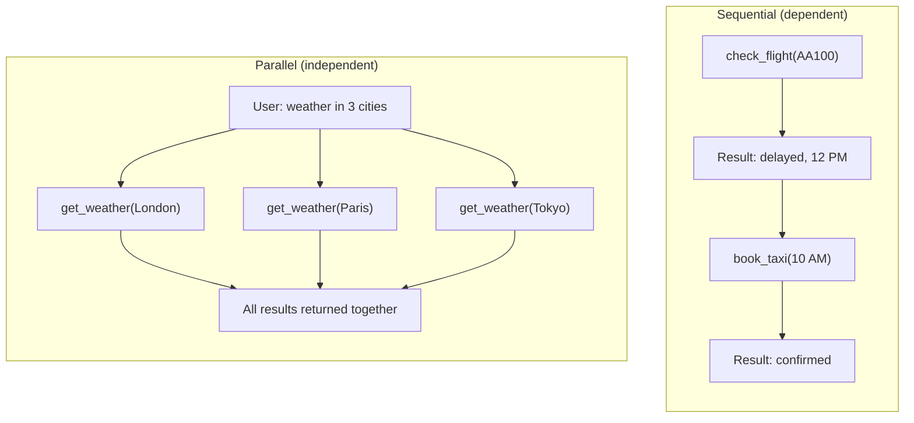

# Parallel Function Calls

## Introduction

When a user asks "What's the weather in London, Paris, and Tokyo?", the three weather lookups are completely independent. There's no reason to call them one at a time — they can all execute simultaneously. This is parallel function calling: the model requests multiple function calls in a single response, and your application executes them concurrently.

Parallel calling is faster and more efficient than sequential calling for independent operations. Instead of three round trips to the model (call → result → call → result → call → result), you make one: the model requests all three calls at once, you execute them in parallel, return all results together, and the model responds.

All three major providers support parallel function calling, but they handle it differently — and each gives you a way to disable it when you need guaranteed one-at-a-time execution.

### What we'll cover

- How models request parallel function calls
- Executing calls concurrently and aggregating results
- Disabling parallel calls when order matters
- Provider-specific parallel calling behavior and limitations

### Prerequisites

- Understanding of [sequential function calls](./02-sequential-calls.md)
- Familiarity with the agentic loop pattern
- Basic knowledge of Python's `asyncio` or `concurrent.futures` for concurrent execution

---

## How parallel calls differ from sequential

The key difference is **independence**: parallel calls don't depend on each other's results.



| Aspect | Sequential | Parallel |
|--------|-----------|----------|
| **Dependencies** | Each call needs previous result | Calls are independent |
| **Model responses** | One call per response | Multiple calls in one response |
| **Round trips** | N calls = N model round trips | N calls = 1 model round trip |
| **Execution** | One at a time | All at once |
| **Speed** | Slower (serial latency) | Faster (parallel latency) |

---

## Parallel calls with OpenAI

When the model determines that multiple function calls are independent, it returns them all in a single response. Each `function_call` item has its own `call_id`:

```python
from openai import OpenAI
import json
import concurrent.futures

client = OpenAI()

tools = [
    {
        "type": "function",
        "name": "get_weather",
        "description": "Get the current weather for a city",
        "parameters": {
            "type": "object",
            "properties": {
                "city": {
                    "type": "string",
                    "description": "City name"
                }
            },
            "required": ["city"]
        }
    }
]

def get_weather(city: str) -> dict:
    """Simulated weather lookup."""
    weather_data = {
        "London": {"temp": 15, "condition": "cloudy", "humidity": 78},
        "Paris": {"temp": 18, "condition": "sunny", "humidity": 55},
        "Tokyo": {"temp": 22, "condition": "clear", "humidity": 45},
    }
    return weather_data.get(city, {"error": f"No data for {city}"})

# Request that triggers parallel calls
response = client.responses.create(
    model="gpt-4.1",
    tools=tools,
    input=[{
        "role": "user",
        "content": "What's the weather in London, Paris, and Tokyo?"
    }]
)

# The model returns multiple function_call items
function_calls = [
    item for item in response.output 
    if item.type == "function_call"
]

print(f"Number of parallel calls: {len(function_calls)}")
for call in function_calls:
    print(f"  {call.name}({call.arguments}) — ID: {call.call_id}")
```

**Output:**
```
Number of parallel calls: 3
  get_weather({"city": "London"}) — ID: call_abc1
  get_weather({"city": "Paris"}) — ID: call_abc2
  get_weather({"city": "Tokyo"}) — ID: call_abc3
```

### Executing in parallel and returning results

Since the calls are independent, we can execute them concurrently:

```python
def execute_parallel_calls(function_calls, available_functions):
    """Execute multiple function calls concurrently."""
    results = {}
    
    with concurrent.futures.ThreadPoolExecutor() as executor:
        # Submit all calls at once
        future_to_call = {}
        for call in function_calls:
            args = json.loads(call.arguments)
            func = available_functions[call.name]
            future = executor.submit(func, **args)
            future_to_call[future] = call
        
        # Collect results as they complete
        for future in concurrent.futures.as_completed(future_to_call):
            call = future_to_call[future]
            try:
                result = future.result()
                results[call.call_id] = {
                    "name": call.name,
                    "result": result,
                    "error": False
                }
            except Exception as e:
                results[call.call_id] = {
                    "name": call.name,
                    "result": {"error": str(e)},
                    "error": True
                }
    
    return results


# Execute all calls in parallel
results = execute_parallel_calls(
    function_calls,
    {"get_weather": get_weather}
)

# Build the next request with all results
input_items = [
    {"role": "user", "content": "What's the weather in London, Paris, and Tokyo?"}
]

# Add model's function calls to input
input_items.extend(response.output)

# Add all results
for call_id, data in results.items():
    input_items.append({
        "type": "function_call_output",
        "call_id": call_id,
        "output": json.dumps(data["result"])
    })

# Get the final response
response2 = client.responses.create(
    model="gpt-4.1",
    tools=tools,
    input=input_items
)

print(response2.output_text)
```

**Output:**
```
Here's the current weather:
- **London**: 15°C, cloudy, 78% humidity
- **Paris**: 18°C, sunny, 55% humidity  
- **Tokyo**: 22°C, clear skies, 45% humidity
```

### Disabling parallel calls in OpenAI

Sometimes you want to force sequential execution — perhaps because you're logging calls for compliance, or because your tools have side effects that must happen in order. OpenAI provides the `parallel_tool_calls` parameter:

```python
# Force one function call at a time
response = client.responses.create(
    model="gpt-4.1",
    tools=tools,
    parallel_tool_calls=False,  # Force sequential
    input=[{
        "role": "user",
        "content": "What's the weather in London, Paris, and Tokyo?"
    }]
)

# Now the model returns only ONE function call per response
function_calls = [
    item for item in response.output 
    if item.type == "function_call"
]
print(f"Calls in response: {len(function_calls)}")  # 1, not 3
```

**Output:**
```
Calls in response: 1
```

> **Warning:** With `parallel_tool_calls: false`, the model returns only one function call per response. You need to loop back for each subsequent call. This means 3 separate round trips for 3 weather lookups — slower, but deterministic.

> **Note:** Some smaller models like `gpt-4.1-nano` may occasionally make duplicate parallel calls (calling the same function with the same arguments twice). If this happens, deduplicate by checking argument equality before execution.

---

## Parallel calls with Anthropic

Anthropic returns multiple `tool_use` blocks within a single `assistant` response. You must return all corresponding `tool_result` blocks in a single `user` message:

```python
import anthropic
import json

client = anthropic.Anthropic()

tools = [
    {
        "name": "get_weather",
        "description": "Get the current weather for a city",
        "input_schema": {
            "type": "object",
            "properties": {
                "city": {
                    "type": "string",
                    "description": "City name"
                }
            },
            "required": ["city"]
        }
    }
]

response = client.messages.create(
    model="claude-sonnet-4-20250514",
    max_tokens=1024,
    tools=tools,
    messages=[{
        "role": "user",
        "content": "What's the weather in London, Paris, and Tokyo?"
    }]
)

# Collect all tool_use blocks
tool_uses = [
    block for block in response.content 
    if block.type == "tool_use"
]

print(f"Parallel calls: {len(tool_uses)}")
for use in tool_uses:
    print(f"  {use.name}({use.input}) — ID: {use.id}")
```

**Output:**
```
Parallel calls: 3
  get_weather({'city': 'London'}) — ID: toolu_01ABC
  get_weather({'city': 'Paris'}) — ID: toolu_02DEF
  get_weather({'city': 'Tokyo'}) — ID: toolu_03GHI
```

### Returning parallel results to Anthropic

All `tool_result` blocks go in a single `user` message — one per `tool_use_id`:

```python
# Execute all calls (can use concurrent.futures here too)
tool_results = []
for use in tool_uses:
    result = get_weather(**use.input)
    tool_results.append({
        "type": "tool_result",
        "tool_use_id": use.id,
        "content": json.dumps(result)
    })

# Build messages for continuation
messages = [
    {"role": "user", "content": "What's the weather in London, Paris, and Tokyo?"},
    {"role": "assistant", "content": response.content},
    {"role": "user", "content": tool_results}  # All results in one message
]

response2 = client.messages.create(
    model="claude-sonnet-4-20250514",
    max_tokens=1024,
    tools=tools,
    messages=messages
)

print(response2.content[0].text)
```

**Output:**
```
Here's the weather right now:
- **London**: 15°C and cloudy (78% humidity)
- **Paris**: 18°C and sunny (55% humidity)
- **Tokyo**: 22°C with clear skies (45% humidity)
```

### Controlling parallel behavior in Anthropic

Anthropic doesn't have a direct `parallel_tool_calls: false` parameter. Instead, you can use `tool_choice` to force the model to use a specific tool (which naturally results in one call at a time):

```python
# Force a specific tool (results in one call)
response = client.messages.create(
    model="claude-sonnet-4-20250514",
    max_tokens=1024,
    tools=tools,
    tool_choice={"type": "tool", "name": "get_weather"},
    messages=[{
        "role": "user",
        "content": "What's the weather in London, Paris, and Tokyo?"
    }]
)

# Model will only call get_weather once
tool_uses = [b for b in response.content if b.type == "tool_use"]
print(f"Calls: {len(tool_uses)}")  # Typically 1
```

---

## Parallel calls with Google Gemini

Gemini returns multiple `functionCall` parts in a single model response. You return all `functionResponse` parts together:

```python
from google import genai
from google.genai import types

client = genai.Client()

get_weather_decl = types.FunctionDeclaration(
    name="get_weather",
    description="Get the current weather for a city",
    parameters=types.Schema(
        type="OBJECT",
        properties={
            "city": types.Schema(type="STRING", description="City name")
        },
        required=["city"]
    )
)

tool = types.Tool(function_declarations=[get_weather_decl])

response = client.models.generate_content(
    model="gemini-2.5-flash",
    contents="What's the weather in London, Paris, and Tokyo?",
    config=types.GenerateContentConfig(tools=[tool])
)

# Check for parallel function calls
function_calls = [
    part for part in response.candidates[0].content.parts
    if part.function_call
]

print(f"Parallel calls: {len(function_calls)}")
for part in function_calls:
    print(f"  {part.function_call.name}({dict(part.function_call.args)})")
```

**Output:**
```
Parallel calls: 3
  get_weather({'city': 'London'})
  get_weather({'city': 'Paris'})
  get_weather({'city': 'Tokyo'})
```

### Returning parallel results to Gemini

All function responses go in a single `user` content:

```python
# Execute and build response parts
response_parts = []
for part in function_calls:
    fc = part.function_call
    result = get_weather(**dict(fc.args))
    response_parts.append(
        types.Part.from_function_response(
            name=fc.name,
            response=result
        )
    )

# Build full conversation
contents = [
    types.Content(role="user", parts=[
        types.Part.from_text("What's the weather in London, Paris, and Tokyo?")
    ]),
    response.candidates[0].content,  # Model's parallel calls
    types.Content(role="user", parts=response_parts)  # All results together
]

response2 = client.models.generate_content(
    model="gemini-2.5-flash",
    contents=contents,
    config=types.GenerateContentConfig(tools=[tool])
)

print(response2.text)
```

### Controlling parallel behavior in Gemini

Gemini uses function calling mode configuration:

```python
# Force one call at a time using ANY mode with allowed functions
config = types.GenerateContentConfig(
    tools=[tool],
    tool_config=types.ToolConfig(
        function_calling_config=types.FunctionCallingConfig(
            mode="ANY",  # Must call a function
            allowed_function_names=["get_weather"]  # Only this one
        )
    )
)
```

> **Note:** Gemini's function calling modes are `AUTO` (model decides), `ANY` (must call at least one function), `NONE` (no function calling), and `VALIDATED` (preview — ensures schema adherence). The `ANY` mode doesn't explicitly limit to one call, but combined with specific allowed functions, it constrains behavior.

---

## Concurrent execution patterns

When you receive parallel calls, you should execute them concurrently for best performance. Here are two approaches:

### Using `concurrent.futures` (synchronous code)

```python
import concurrent.futures
import json


def execute_calls_threaded(
    calls: list[dict], 
    functions: dict[str, callable],
    timeout: float = 30.0
) -> list[dict]:
    """Execute function calls concurrently using threads."""
    results = []
    
    with concurrent.futures.ThreadPoolExecutor(max_workers=10) as executor:
        futures = {}
        for i, call in enumerate(calls):
            func = functions[call["name"]]
            future = executor.submit(func, **call["args"])
            futures[future] = (i, call)
        
        for future in concurrent.futures.as_completed(futures, timeout=timeout):
            index, call = futures[future]
            try:
                result = future.result()
                results.append({
                    "index": index,
                    "call_id": call.get("call_id"),
                    "name": call["name"],
                    "result": result,
                    "success": True
                })
            except Exception as e:
                results.append({
                    "index": index,
                    "call_id": call.get("call_id"),
                    "name": call["name"],
                    "result": {"error": str(e)},
                    "success": False
                })
    
    # Sort by original order
    results.sort(key=lambda r: r["index"])
    return results
```

### Using `asyncio` (asynchronous code)

```python
import asyncio


async def execute_calls_async(
    calls: list[dict],
    functions: dict[str, callable],
    timeout: float = 30.0
) -> list[dict]:
    """Execute function calls concurrently using asyncio."""
    
    async def execute_one(call: dict, index: int) -> dict:
        func = functions[call["name"]]
        try:
            # If function is async, await it; otherwise run in thread
            if asyncio.iscoroutinefunction(func):
                result = await func(**call["args"])
            else:
                loop = asyncio.get_event_loop()
                result = await loop.run_in_executor(
                    None, lambda: func(**call["args"])
                )
            return {
                "index": index,
                "call_id": call.get("call_id"),
                "name": call["name"],
                "result": result,
                "success": True
            }
        except Exception as e:
            return {
                "index": index,
                "call_id": call.get("call_id"),
                "name": call["name"],
                "result": {"error": str(e)},
                "success": False
            }
    
    tasks = [execute_one(call, i) for i, call in enumerate(calls)]
    results = await asyncio.wait_for(
        asyncio.gather(*tasks),
        timeout=timeout
    )
    
    return sorted(results, key=lambda r: r["index"])
```

> **Tip:** Always maintain result order to match the original call order. While execution may complete in any order, returning results in a predictable sequence helps the model correlate calls with results.

---

## Result aggregation

After parallel execution, you need to format all results for the provider's API. Here's a provider-agnostic aggregation function:

```python
def aggregate_parallel_results(
    calls_and_results: list[dict],
    provider: str
) -> list[dict]:
    """Format parallel results for the target provider.
    
    Args:
        calls_and_results: List of {"call_id", "name", "result"} dicts
        provider: "openai", "anthropic", or "gemini"
    
    Returns:
        Provider-formatted result items
    """
    if provider == "openai":
        return [
            {
                "type": "function_call_output",
                "call_id": cr["call_id"],
                "output": json.dumps(cr["result"])
            }
            for cr in calls_and_results
        ]
    
    elif provider == "anthropic":
        return [
            {
                "type": "tool_result",
                "tool_use_id": cr["call_id"],
                "content": json.dumps(cr["result"])
            }
            for cr in calls_and_results
        ]
    
    elif provider == "gemini":
        from google.genai import types
        return [
            types.Part.from_function_response(
                name=cr["name"],
                response=cr["result"]
            )
            for cr in calls_and_results
        ]
    
    else:
        raise ValueError(f"Unknown provider: {provider}")
```

---

## When to disable parallel calls

Parallel calling is the default behavior (and usually desired), but there are cases where you should disable it:

| Scenario | Why disable parallel |
|----------|---------------------|
| **Side effects with ordering** | Creating a user before assigning permissions |
| **Rate-limited external APIs** | Concurrent calls might hit rate limits |
| **Compliance/audit logging** | Need to log each call individually with exact ordering |
| **Debugging** | Easier to trace issues with one call at a time |
| **Idempotency concerns** | Preventing duplicate charges or actions |

```python
# OpenAI: explicit parameter
response = client.responses.create(
    model="gpt-4.1",
    tools=tools,
    parallel_tool_calls=False,  # ← Disable parallel
    input=messages
)

# Anthropic: use tool_choice to limit
response = client.messages.create(
    model="claude-sonnet-4-20250514",
    tools=tools,
    tool_choice={"type": "auto"},  # auto allows parallel
    # tool_choice={"type": "tool", "name": "specific_tool"}  # limits to one
    messages=messages
)

# Gemini: function calling config
config = types.GenerateContentConfig(
    tools=[tool],
    tool_config=types.ToolConfig(
        function_calling_config=types.FunctionCallingConfig(
            mode="AUTO"  # AUTO allows parallel; ANY with one function limits
        )
    )
)
```

---

## Best practices

| Practice | Why it matters |
|----------|----------------|
| Execute parallel calls concurrently | Don't negate the performance benefit by running them serially |
| Set a timeout for concurrent execution | One slow call shouldn't block all results |
| Return all results together | Providers expect all parallel results in a single follow-up |
| Handle partial failures gracefully | If 1 of 3 calls fails, still return the 2 successful results with an error for the third |
| Maintain result order | Helps the model match results to calls |
| Use `parallel_tool_calls: false` for side effects | When order matters, force sequential execution |

---

## Common pitfalls

| ❌ Mistake | ✅ Solution |
|-----------|-------------|
| Executing parallel calls one at a time | Use `ThreadPoolExecutor` or `asyncio.gather` for true concurrency |
| Returning results in wrong order for Gemini | Match `functionResponse` order to `functionCall` order — don't interleave with the function call parts |
| Ignoring partial failures | Return error results for failed calls so the model can adapt |
| Disabling parallel calls "just in case" | Parallel is faster and cheaper — only disable when you have a specific reason |
| Not deduplicating identical parallel calls | Some models occasionally request the same call twice — check and deduplicate |
| Mixing parallel results across separate messages | All results for a batch of parallel calls go in ONE follow-up message |

---

## Hands-on exercise

### Your task

Build a parallel weather dashboard that fetches weather for 5 cities concurrently and handles partial failures gracefully.

### Requirements

1. Define a `get_weather` function that simulates API calls (include a random failure for one city)
2. Implement concurrent execution using `concurrent.futures.ThreadPoolExecutor`
3. Handle partial failures — if one city fails, still return results for the others
4. Format the results for OpenAI's Responses API (as `function_call_output` items)
5. Print a summary showing successful and failed calls

### Expected result

A system that executes 5 weather lookups concurrently and handles 1 failure gracefully.

<details>
<summary>💡 Hints</summary>

- Use `random.random() < 0.2` to simulate a 20% failure rate
- `concurrent.futures.as_completed()` yields futures as they finish
- Wrap each execution in try/except to catch failures
- Track successful vs. failed calls separately for the summary

</details>

<details>
<summary>✅ Solution</summary>

```python
import json
import random
import time
import concurrent.futures


def get_weather_with_failure(city: str) -> dict:
    """Simulated weather API that occasionally fails."""
    # Simulate network latency
    time.sleep(random.uniform(0.1, 0.5))
    
    # Simulate occasional failures
    if city == "Sydney":  # Deterministic failure for testing
        raise ConnectionError(f"API timeout for {city}")
    
    weather_data = {
        "London": {"temp": 15, "condition": "cloudy", "humidity": 78},
        "Paris": {"temp": 18, "condition": "sunny", "humidity": 55},
        "Tokyo": {"temp": 22, "condition": "clear", "humidity": 45},
        "New York": {"temp": 8, "condition": "rainy", "humidity": 90},
        "Sydney": {"temp": 25, "condition": "sunny", "humidity": 60},
    }
    return weather_data.get(city, {"temp": 0, "condition": "unknown"})


def fetch_weather_parallel(cities: list[str]) -> dict:
    """Fetch weather for multiple cities concurrently."""
    results = {"successful": [], "failed": []}
    
    with concurrent.futures.ThreadPoolExecutor(max_workers=5) as executor:
        future_to_city = {
            executor.submit(get_weather_with_failure, city): city
            for city in cities
        }
        
        for future in concurrent.futures.as_completed(future_to_city):
            city = future_to_city[future]
            try:
                weather = future.result(timeout=10)
                results["successful"].append({
                    "city": city,
                    "weather": weather,
                    "call_id": f"call_{city.lower()}"
                })
            except Exception as e:
                results["failed"].append({
                    "city": city,
                    "error": str(e),
                    "call_id": f"call_{city.lower()}"
                })
    
    return results


# Execute parallel weather fetches
cities = ["London", "Paris", "Tokyo", "New York", "Sydney"]
results = fetch_weather_parallel(cities)

# Format for OpenAI
output_items = []

for success in results["successful"]:
    output_items.append({
        "type": "function_call_output",
        "call_id": success["call_id"],
        "output": json.dumps(success["weather"])
    })

for failure in results["failed"]:
    output_items.append({
        "type": "function_call_output",
        "call_id": failure["call_id"],
        "output": json.dumps({
            "error": True,
            "message": f"Failed to fetch weather: {failure['error']}"
        })
    })

# Print summary
print("=== Parallel Weather Dashboard ===\n")
print(f"Successful: {len(results['successful'])}")
for s in results["successful"]:
    w = s["weather"]
    print(f"  {s['city']}: {w['temp']}°C, {w['condition']}")

print(f"\nFailed: {len(results['failed'])}")
for f in results["failed"]:
    print(f"  {f['city']}: {f['error']}")

print(f"\nTotal output items: {len(output_items)}")
```

**Output:**
```
=== Parallel Weather Dashboard ===

Successful: 4
  London: 15°C, cloudy
  Paris: 18°C, sunny
  Tokyo: 22°C, clear
  New York: 8°C, rainy

Failed: 1
  Sydney: API timeout for Sydney

Total output items: 5
```

</details>

### Bonus challenges

- [ ] Add timing — measure total execution time and compare with sequential execution time
- [ ] Implement retry logic: if a call fails, retry up to 2 times before marking it as failed

---

## Summary

✅ Parallel function calls happen when the model requests multiple independent operations in a single response

✅ Execute parallel calls concurrently using `ThreadPoolExecutor` or `asyncio.gather` — don't negate the performance benefit by running them serially

✅ All results for a batch of parallel calls must be returned in a single follow-up message

✅ OpenAI offers `parallel_tool_calls: false` to force one call at a time; Anthropic uses `tool_choice`; Gemini uses function calling mode config

✅ Handle partial failures gracefully — return error results for failed calls so the model can adapt its response

**Next:** [Compositional Function Calling →](./04-compositional-calling.md) — When the model automatically chains function outputs as inputs to other functions

---

[← Previous: Sequential Calls](./02-sequential-calls.md) | [Back to Lesson Overview](./00-multi-turn-function-calling.md)

<!-- 
Sources Consulted:
- OpenAI Function Calling Guide: https://platform.openai.com/docs/guides/function-calling
- Anthropic Tool Use Overview: https://platform.claude.com/docs/en/agents-and-tools/tool-use/overview
- Gemini Function Calling Tutorial: https://ai.google.dev/gemini-api/docs/function-calling
-->
