# Compositional Function Calling

## Introduction

Compositional function calling takes sequential calls a step further: instead of the model simply requesting one function after another, it logically chains function outputs as inputs to subsequent functions. "Get my location, then use that location to check the weather" is a compositional pattern — the output of `get_location()` feeds directly into `get_weather(location)`.

What makes compositional calling special is that in some cases, the model or platform can handle this chaining automatically. Google Gemini supports compositional function calling natively — with automatic function calling enabled in the Python SDK, the SDK executes functions and feeds results back to the model without you writing any loop code. For OpenAI and Anthropic, compositional patterns work through the standard agentic loop, but the model still reasons about dependencies and chains calls logically.

### What we'll cover

- What compositional function calling means and how it differs from basic sequential calls
- How Gemini handles compositional calls natively with automatic function calling
- Implementing compositional patterns with OpenAI and Anthropic
- Automatic dependency resolution — how models figure out what to chain

### Prerequisites

- Understanding of [sequential calls](./02-sequential-calls.md) and the agentic loop
- Understanding of [parallel calls](./03-parallel-calls.md) for contrast
- Familiarity with the Google GenAI Python SDK

---

## What makes calls "compositional"

In a sequential call, each call depends on the previous result. In a compositional call, the dependency is explicit: the *output* of one function becomes the *input parameter* of another.

```mermaid
flowchart LR
    A["get_location()"] -->|"Returns: 'San Francisco'"| B["get_weather('San Francisco')"]
    B -->|"Returns: {temp: 18, wind: 12}"| C["set_thermostat(72)"]
    C -->|"Returns: 'Set to 72°F'"| D["Model: 'Done! Thermostat adjusted.'"]
```



The distinction matters because:
- **Sequential**: Model calls functions one at a time, reasoning about what to do next
- **Compositional**: Model recognizes that function A's output is function B's required input and plans the full chain

| Aspect | Sequential | Compositional |
|--------|-----------|---------------|
| **Dependency** | Model infers after seeing result | Model plans the chain upfront |
| **Automation** | Requires manual agentic loop | Can be automated (Gemini SDK) |
| **Efficiency** | N round trips | Can be optimized to fewer round trips |
| **Example** | "Check flight, then maybe book taxi" | "Get location → get weather for that location" |

---

## Compositional calling with Google Gemini

Gemini has first-class support for compositional function calling. When you enable **automatic function calling** in the Python SDK, the SDK handles the entire chain for you — executing functions and feeding results back to the model automatically.

### Automatic function calling with the Python SDK

With automatic function calling, you provide Python functions directly, and the SDK:
1. Generates the function declaration schema automatically
2. Executes the function when the model calls it
3. Feeds the result back to the model
4. Repeats until the model produces a text response

```python
from google import genai
from google.genai import types

client = genai.Client()


def get_current_location() -> dict:
    """Get the user's current location.
    
    Returns:
        A dictionary with city and country.
    """
    # Simulated — in production, use GPS or IP geolocation
    return {"city": "San Francisco", "country": "USA"}


def get_weather_forecast(city: str, days: int = 1) -> dict:
    """Get weather forecast for a city.
    
    Args:
        city: The city to get weather for.
        days: Number of days to forecast (1-7).
    
    Returns:
        Weather forecast data.
    """
    forecasts = {
        "San Francisco": {"temp": 18, "condition": "foggy", "wind_mph": 12},
        "London": {"temp": 15, "condition": "cloudy", "wind_mph": 8},
        "Tokyo": {"temp": 22, "condition": "clear", "wind_mph": 5},
    }
    return forecasts.get(city, {"temp": 0, "condition": "unknown"})


def set_thermostat(temperature_f: int) -> dict:
    """Set the home thermostat temperature.
    
    Args:
        temperature_f: Target temperature in Fahrenheit.
    
    Returns:
        Confirmation of the thermostat setting.
    """
    return {
        "status": "success",
        "set_to": temperature_f,
        "message": f"Thermostat set to {temperature_f}°F"
    }


# Automatic function calling — SDK handles the loop
response = client.models.generate_content(
    model="gemini-2.5-flash",
    contents="Find my location, check the weather there, and if it's "
             "cold (below 60°F) set the thermostat to 72°F.",
    config=types.GenerateContentConfig(
        tools=[get_current_location, get_weather_forecast, set_thermostat],
        # Automatic function calling is enabled by default in the Python SDK
    )
)

# The SDK handled all function calls automatically
print(response.text)
```

**Output:**
```
I found your location in San Francisco. The weather there is 18°C (about 64°F) and foggy with 12 mph winds. Since it's above 60°F, I didn't need to adjust the thermostat.
```

> **Note:** Automatic function calling is **enabled by default** in the Google GenAI Python SDK. The SDK converts your Python functions to `FunctionDeclaration` objects automatically using `types.FunctionDeclaration.from_callable()`.

### Disabling automatic function calling

If you want to handle the loop yourself (for logging, error handling, or custom logic), disable automatic function calling:

```python
response = client.models.generate_content(
    model="gemini-2.5-flash",
    contents="Find my location and check the weather.",
    config=types.GenerateContentConfig(
        tools=[get_current_location, get_weather_forecast],
        automatic_function_calling=types.AutomaticFunctionCallingConfig(
            disable=True  # Handle the loop manually
        )
    )
)

# Now you get function call parts in the response
for part in response.candidates[0].content.parts:
    if part.function_call:
        print(f"Model wants to call: {part.function_call.name}")
```

**Output:**
```
Model wants to call: get_current_location
```

### Using the chat interface for automatic composing

The Gemini SDK's chat interface is particularly powerful for compositional calling because it maintains conversation history automatically:

```python
# Chat interface handles history + automatic function calling
chat = client.chats.create(
    model="gemini-2.5-flash",
    config=types.GenerateContentConfig(
        tools=[get_current_location, get_weather_forecast, set_thermostat]
    )
)

# The SDK handles the full compositional chain internally
response = chat.send_message(
    "What's the weather at my current location?"
)
print(response.text)

# Follow-up in the same chat — history is maintained
response2 = chat.send_message(
    "Now set the thermostat based on that weather."
)
print(response2.text)
```

**Output:**
```
You're in San Francisco. The current weather is 18°C (64°F) and foggy with 12 mph winds.

Based on the current temperature of 64°F in San Francisco, I've set the thermostat to 72°F to keep you comfortable.
```

---

## Compositional calling with OpenAI

OpenAI doesn't have a dedicated "compositional" mode, but the model naturally chains function calls when it recognizes dependencies. You implement this through the standard agentic loop:

```python
from openai import OpenAI
import json

client = OpenAI()

tools = [
    {
        "type": "function",
        "name": "get_current_location",
        "description": "Get the user's current location",
        "parameters": {"type": "object", "properties": {}}
    },
    {
        "type": "function",
        "name": "get_weather_forecast",
        "description": "Get weather forecast for a city",
        "parameters": {
            "type": "object",
            "properties": {
                "city": {"type": "string", "description": "City name"},
                "days": {"type": "integer", "description": "Forecast days (1-7)"}
            },
            "required": ["city"]
        }
    },
    {
        "type": "function",
        "name": "set_thermostat",
        "description": "Set home thermostat temperature in Fahrenheit",
        "parameters": {
            "type": "object",
            "properties": {
                "temperature_f": {
                    "type": "integer",
                    "description": "Target temperature in °F"
                }
            },
            "required": ["temperature_f"]
        }
    }
]

available_functions = {
    "get_current_location": get_current_location,
    "get_weather_forecast": get_weather_forecast,
    "set_thermostat": set_thermostat
}

def run_compositional_openai(user_message: str) -> str:
    """Run a compositional function calling chain with OpenAI."""
    input_items = [{"role": "user", "content": user_message}]
    
    for step in range(10):  # Max 10 steps
        response = client.responses.create(
            model="gpt-4.1",
            tools=tools,
            input=input_items
        )
        
        function_calls = [
            item for item in response.output
            if item.type == "function_call"
        ]
        
        if not function_calls:
            return response.output_text
        
        # Add model's output to conversation
        input_items.extend(response.output)
        
        # Execute each function call
        for call in function_calls:
            args = json.loads(call.arguments)
            result = available_functions[call.name](**args)
            
            print(f"Step {step + 1}: {call.name}({args}) → {result}")
            
            input_items.append({
                "type": "function_call_output",
                "call_id": call.call_id,
                "output": json.dumps(result)
            })
    
    return "Max steps reached"

# The model automatically chains: location → weather → thermostat
# result = run_compositional_openai(
#     "Find my location, check the weather, and set the thermostat "
#     "to something comfortable if it's cold."
# )
# print(f"\nFinal: {result}")
```

**Expected output:**
```
Step 1: get_current_location({}) → {'city': 'San Francisco', 'country': 'USA'}
Step 2: get_weather_forecast({'city': 'San Francisco'}) → {'temp': 18, 'condition': 'foggy', ...}
Step 3: set_thermostat({'temperature_f': 72}) → {'status': 'success', ...}

Final: I found you in San Francisco where it's 18°C (64°F) and foggy. Since it's a bit cool, I've set the thermostat to 72°F.
```

---

## Compositional calling with Anthropic

Anthropic follows the same pattern — the model chains calls through the `tool_use`/`tool_result` cycle:

```python
import anthropic
import json

client = anthropic.Anthropic()

tools = [
    {
        "name": "get_current_location",
        "description": "Get the user's current location",
        "input_schema": {
            "type": "object",
            "properties": {}
        }
    },
    {
        "name": "get_weather_forecast",
        "description": "Get weather forecast for a city",
        "input_schema": {
            "type": "object",
            "properties": {
                "city": {"type": "string", "description": "City name"}
            },
            "required": ["city"]
        }
    },
    {
        "name": "set_thermostat",
        "description": "Set home thermostat temperature in Fahrenheit",
        "input_schema": {
            "type": "object",
            "properties": {
                "temperature_f": {
                    "type": "integer",
                    "description": "Target temperature in °F"
                }
            },
            "required": ["temperature_f"]
        }
    }
]

def run_compositional_anthropic(user_message: str) -> str:
    """Run a compositional function calling chain with Anthropic."""
    messages = [{"role": "user", "content": user_message}]
    
    for step in range(10):
        response = client.messages.create(
            model="claude-sonnet-4-20250514",
            max_tokens=1024,
            tools=tools,
            messages=messages
        )
        
        if response.stop_reason != "tool_use":
            return next(
                block.text for block in response.content
                if hasattr(block, "text")
            )
        
        # Add assistant response to history
        messages.append({"role": "assistant", "content": response.content})
        
        # Process and return tool results
        tool_results = []
        for block in response.content:
            if block.type == "tool_use":
                result = available_functions[block.name](**block.input)
                print(f"Step {step + 1}: {block.name}({block.input}) → {result}")
                tool_results.append({
                    "type": "tool_result",
                    "tool_use_id": block.id,
                    "content": json.dumps(result)
                })
        
        messages.append({"role": "user", "content": tool_results})
    
    return "Max steps reached"

# result = run_compositional_anthropic(
#     "Find my location and check the weather there."
# )
```

---

## Automatic dependency resolution

The key to compositional calling is that the model understands function signatures and recognizes when one function's output satisfies another function's required parameter.

### How models reason about dependencies

When the model sees these tool definitions:

```json
[
  {"name": "get_location", "returns": {"city": "string"}},
  {"name": "get_weather", "parameters": {"city": "string"}}
]
```

It recognizes that `get_location` produces a `city` value that `get_weather` needs. This is automatic — you don't need to specify the dependency explicitly.

### Helping the model with clear descriptions

The quality of compositional chaining depends on clear function descriptions:

```python
# ❌ Vague — model may not connect the dots
tools_vague = [
    {
        "type": "function",
        "name": "func_a",
        "description": "Gets some data",
        "parameters": {
            "type": "object",
            "properties": {
                "id": {"type": "string"}
            }
        }
    },
    {
        "type": "function",
        "name": "func_b",
        "description": "Processes data",
        "parameters": {
            "type": "object",
            "properties": {
                "input_id": {"type": "string"}
            }
        }
    }
]

# ✅ Clear — model understands the chain
tools_clear = [
    {
        "type": "function",
        "name": "get_user_profile",
        "description": "Get a user's profile by username. Returns user_id, name, and email.",
        "parameters": {
            "type": "object",
            "properties": {
                "username": {
                    "type": "string",
                    "description": "The username to look up"
                }
            },
            "required": ["username"]
        }
    },
    {
        "type": "function",
        "name": "get_user_orders",
        "description": "Get order history for a user. Requires the user_id from get_user_profile.",
        "parameters": {
            "type": "object",
            "properties": {
                "user_id": {
                    "type": "string",
                    "description": "The user's ID (from get_user_profile)"
                }
            },
            "required": ["user_id"]
        }
    }
]
```

> **Tip:** Mentioning related functions in descriptions (e.g., "Requires the user_id from get_user_profile") helps models build the compositional chain reliably. This is especially valuable when parameter names don't match exactly between functions.

---

## Compositional vs. parallel: mixed patterns

In real workflows, compositional and parallel patterns often combine. The model might call independent functions in parallel, then use their combined results for a compositional follow-up:

```python
# Example: Plan a dinner party
# Step 1 (Parallel): Get guest dietary restrictions + check pantry inventory
# Step 2 (Compositional): Suggest recipes based on restrictions AND inventory
# Step 3 (Compositional): Generate shopping list based on chosen recipe

tools_dinner = [
    {
        "type": "function",
        "name": "get_dietary_restrictions",
        "description": "Get dietary restrictions for a list of guests",
        "parameters": {
            "type": "object",
            "properties": {
                "guest_names": {
                    "type": "array",
                    "items": {"type": "string"},
                    "description": "Names of the guests"
                }
            },
            "required": ["guest_names"]
        }
    },
    {
        "type": "function",
        "name": "check_pantry",
        "description": "Check what ingredients are available in the pantry",
        "parameters": {"type": "object", "properties": {}}
    },
    {
        "type": "function",
        "name": "suggest_recipes",
        "description": "Suggest recipes based on dietary restrictions and available ingredients",
        "parameters": {
            "type": "object",
            "properties": {
                "restrictions": {
                    "type": "array",
                    "items": {"type": "string"},
                    "description": "Dietary restrictions to accommodate"
                },
                "available_ingredients": {
                    "type": "array",
                    "items": {"type": "string"},
                    "description": "Ingredients available in the pantry"
                }
            },
            "required": ["restrictions", "available_ingredients"]
        }
    }
]
```


---

## Best practices

| Practice | Why it matters |
|----------|----------------|
| Use clear, descriptive function names and descriptions | Models rely on descriptions to build compositional chains |
| Mention related functions in descriptions | "Returns user_id used by get_orders" helps the model chain correctly |
| Use Gemini's automatic function calling for simple chains | Eliminates boilerplate loop code |
| Disable automatic calling when you need custom logic | Error handling, logging, or validation between steps |
| Test with various phrasings | "Get my location then weather" vs. "What's the weather where I am" should both work |

---

## Common pitfalls

| ❌ Mistake | ✅ Solution |
|-----------|-------------|
| Mismatched parameter names between functions | Use consistent naming (`city` everywhere, not `city` in one and `location` in another) |
| Not describing what a function returns | Include return value descriptions so the model knows what data is available for chaining |
| Relying on automatic calling for critical flows | Disable it and implement the loop yourself when you need error handling or logging |
| Assuming the model will always chain in the right order | Validate the chain — models occasionally skip steps or call in wrong order |
| Using Gemini automatic calling with side-effect functions | The SDK executes functions automatically — dangerous for functions that modify data |

---

## Hands-on exercise

### Your task

Build a compositional function calling pipeline for a "smart home assistant" that chains three functions: detect the user's room → check the room's temperature → adjust the climate control.

### Requirements

1. Define three functions: `detect_room()`, `get_room_temperature(room: str)`, and `adjust_climate(room: str, target_temp: int)`
2. Implement the compositional chain using the standard agentic loop (any provider)
3. Log each step showing how output from one function feeds into the next
4. Handle the case where the room temperature is already comfortable (no adjustment needed)

### Expected result

A chain that detects "Living Room" → gets temperature 65°F → adjusts to 72°F, with clear logging.

<details>
<summary>💡 Hints</summary>

- `detect_room` should return `{"room": "Living Room", "confidence": 0.95}`
- `get_room_temperature` should return `{"room": "Living Room", "current_temp_f": 65}`
- Define "comfortable" as 68-74°F — only adjust if outside this range
- The model should decide whether to call `adjust_climate` based on the temperature result

</details>

<details>
<summary>✅ Solution</summary>

```python
import json


def detect_room() -> dict:
    """Detect which room the user is currently in."""
    return {"room": "Living Room", "confidence": 0.95}

def get_room_temperature(room: str) -> dict:
    """Get the current temperature in a room."""
    temps = {
        "Living Room": 65,
        "Bedroom": 70,
        "Kitchen": 73,
        "Office": 62
    }
    return {
        "room": room,
        "current_temp_f": temps.get(room, 68),
        "humidity_pct": 45
    }

def adjust_climate(room: str, target_temp: int) -> dict:
    """Adjust the climate control in a room."""
    return {
        "room": room,
        "previous_temp": 65,
        "target_temp": target_temp,
        "status": "adjusting",
        "estimated_time_minutes": 15
    }


available = {
    "detect_room": detect_room,
    "get_room_temperature": get_room_temperature,
    "adjust_climate": adjust_climate
}

# Simulate the compositional chain
print("=== Smart Home Compositional Chain ===\n")

# Step 1: Detect room
step1_result = detect_room()
print(f"Step 1: detect_room() → {step1_result}")
print(f"  → Output feeds into: get_room_temperature(room='{step1_result['room']}')\n")

# Step 2: Get temperature (uses room from step 1)
step2_result = get_room_temperature(step1_result["room"])
print(f"Step 2: get_room_temperature('{step1_result['room']}') → {step2_result}")

# Step 3: Decide whether to adjust (compositional decision)
current = step2_result["current_temp_f"]
if current < 68 or current > 74:
    target = 72  # Comfortable target
    print(f"  → Temperature {current}°F is outside comfort range (68-74°F)")
    print(f"  → Output feeds into: adjust_climate(room='{step1_result['room']}', target_temp={target})\n")
    
    step3_result = adjust_climate(step1_result["room"], target)
    print(f"Step 3: adjust_climate('{step1_result['room']}', {target}) → {step3_result}")
else:
    print(f"  → Temperature {current}°F is within comfort range — no adjustment needed")

print("\n=== Chain Complete ===")
print(f"Chain: detect_room → get_room_temperature → {'adjust_climate' if current < 68 or current > 74 else '(no action needed)'}")
```

**Output:**
```
=== Smart Home Compositional Chain ===

Step 1: detect_room() → {'room': 'Living Room', 'confidence': 0.95}
  → Output feeds into: get_room_temperature(room='Living Room')

Step 2: get_room_temperature('Living Room') → {'room': 'Living Room', 'current_temp_f': 65, ...}
  → Temperature 65°F is outside comfort range (68-74°F)
  → Output feeds into: adjust_climate(room='Living Room', target_temp=72)

Step 3: adjust_climate('Living Room', 72) → {'room': 'Living Room', 'target_temp': 72, 'status': 'adjusting', ...}

=== Chain Complete ===
Chain: detect_room → get_room_temperature → adjust_climate
```

</details>

### Bonus challenges

- [ ] Implement the same pipeline using Gemini's automatic function calling (pass the functions directly, no manual loop)
- [ ] Add a fourth function `send_notification(message: str)` that the model calls to confirm the adjustment

---

## Summary

✅ Compositional function calling is when the output of one function becomes the input parameter of another — the model plans the chain based on function signatures

✅ Google Gemini supports compositional calling natively through automatic function calling in the Python SDK — the SDK handles the loop automatically

✅ OpenAI and Anthropic achieve compositional patterns through the standard agentic loop — the model naturally chains calls when descriptions are clear

✅ Clear function descriptions with return value documentation are critical for reliable compositional chains

✅ Real-world workflows often mix compositional and parallel patterns — independent calls execute in parallel, then their combined results feed into compositional follow-ups

**Next:** [Function Call Chains →](./05-function-call-chains.md) — Orchestrating complex multi-step workflows with intermediate results

---

[← Previous: Parallel Calls](./03-parallel-calls.md) | [Back to Lesson Overview](./00-multi-turn-function-calling.md)

<!-- 
Sources Consulted:
- OpenAI Function Calling Guide: https://platform.openai.com/docs/guides/function-calling
- Anthropic Tool Use Overview: https://platform.claude.com/docs/en/agents-and-tools/tool-use/overview
- Gemini Function Calling Tutorial: https://ai.google.dev/gemini-api/docs/function-calling
-->
