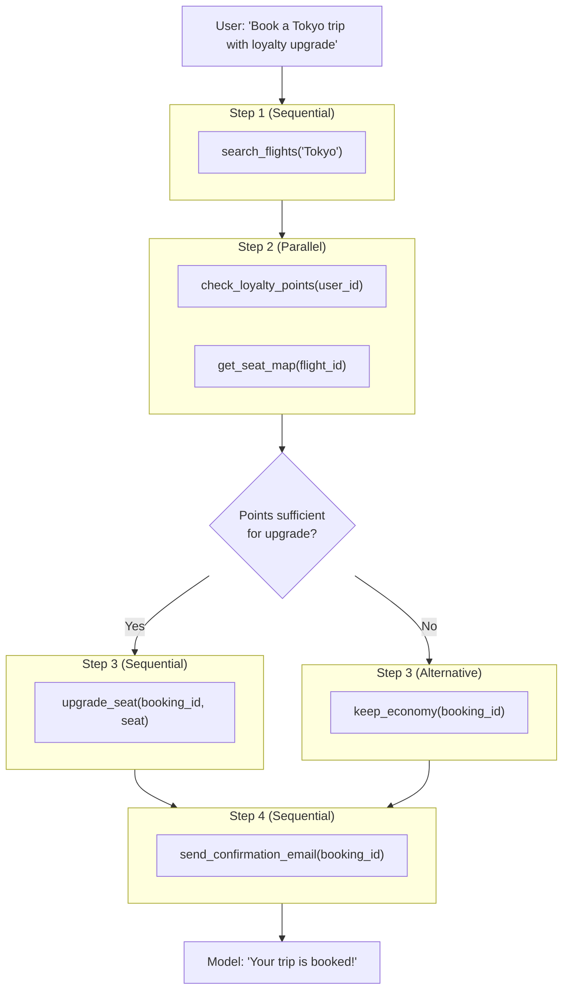

# Function Call Chains

## Introduction

Real-world AI tasks aren't solved with two or three function calls. A customer asks "Find me a flight to Tokyo, check if my loyalty points cover an upgrade, and if so, upgrade my seat and email me the confirmation." That's four dependent functions in a chain, with conditional logic in the middle. The model orchestrates the entire workflow — but you need infrastructure to manage it.

Function call chains are multi-step workflows where the model makes a series of function calls, potentially mixing sequential, parallel, and compositional patterns. This topic focuses on the orchestration layer: how you track intermediate results, detect and prevent infinite loops, handle branching logic, and build robust chain management systems.

### What we'll cover

- Orchestrating multi-step workflows with a chain manager
- Tracking and accessing intermediate results throughout a chain
- Detecting and preventing loops (same function, same arguments, no progress)
- Building a reusable chain runner that works with any provider

### Prerequisites

- Understanding of [sequential](./02-sequential-calls.md), [parallel](./03-parallel-calls.md), and [compositional](./04-compositional-calling.md) calling patterns
- Familiarity with the agentic loop

---

## Anatomy of a function call chain

A chain is a series of steps where each step may be sequential, parallel, or compositional:



The model handles branching automatically — it decides whether to upgrade based on the loyalty points result. Your job is to provide the infrastructure that:

1. Executes whatever the model requests
2. Tracks all intermediate results
3. Prevents runaway loops
4. Reports what happened at the end

---

## Building a chain manager

A robust chain manager handles the orchestration, tracking, and safety concerns:

```python
import json
import time
from dataclasses import dataclass, field
from typing import Any, Callable
from collections import Counter


@dataclass
class ChainStep:
    """Record of a single step in a function call chain."""
    step_number: int
    function_name: str
    arguments: dict
    result: Any
    duration_ms: float
    is_error: bool = False
    timestamp: float = field(default_factory=time.time)


class ChainManager:
    """Manage and track function call chains."""
    
    def __init__(
        self,
        functions: dict[str, Callable],
        max_steps: int = 15,
        max_duplicate_calls: int = 2,
        timeout_seconds: float = 120.0
    ):
        self.functions = functions
        self.max_steps = max_steps
        self.max_duplicate_calls = max_duplicate_calls
        self.timeout_seconds = timeout_seconds
        
        self.steps: list[ChainStep] = []
        self.start_time: float | None = None
    
    def start(self) -> None:
        """Start the chain timer."""
        self.start_time = time.time()
        self.steps = []
    
    def execute(self, function_name: str, arguments: dict) -> dict:
        """Execute a function call and record it.
        
        Returns:
            The function result, or an error dict.
        """
        if function_name not in self.functions:
            error_result = {
                "error": True,
                "message": f"Unknown function: {function_name}"
            }
            self._record_step(function_name, arguments, error_result, 0, True)
            return error_result
        
        start = time.time()
        try:
            result = self.functions[function_name](**arguments)
            duration_ms = (time.time() - start) * 1000
            self._record_step(function_name, arguments, result, duration_ms, False)
            return result
        except Exception as e:
            duration_ms = (time.time() - start) * 1000
            error_result = {"error": True, "message": str(e)}
            self._record_step(function_name, arguments, error_result, duration_ms, True)
            return error_result
    
    def _record_step(
        self, name: str, args: dict, result: Any, 
        duration_ms: float, is_error: bool
    ) -> None:
        """Record a step in the chain."""
        self.steps.append(ChainStep(
            step_number=len(self.steps) + 1,
            function_name=name,
            arguments=args,
            result=result,
            duration_ms=duration_ms,
            is_error=is_error
        ))
    
    def can_continue(self) -> tuple[bool, str]:
        """Check if the chain should continue.
        
        Returns:
            (can_continue, reason_if_not)
        """
        # Check step limit
        if len(self.steps) >= self.max_steps:
            return False, f"Max steps reached ({self.max_steps})"
        
        # Check timeout
        if self.start_time:
            elapsed = time.time() - self.start_time
            if elapsed > self.timeout_seconds:
                return False, f"Timeout ({self.timeout_seconds}s)"
        
        # Check for loops (duplicate calls)
        call_keys = [
            f"{s.function_name}:{json.dumps(s.arguments, sort_keys=True)}"
            for s in self.steps
        ]
        counts = Counter(call_keys)
        for key, count in counts.items():
            if count > self.max_duplicate_calls:
                func = key.split(":")[0]
                return False, f"Loop detected: {func} called {count} times with same args"
        
        return True, "OK"
    
    def get_result_at(self, step: int) -> Any:
        """Get the result from a specific step (1-indexed)."""
        if 0 < step <= len(self.steps):
            return self.steps[step - 1].result
        return None
    
    def get_results_by_function(self, function_name: str) -> list[Any]:
        """Get all results from calls to a specific function."""
        return [
            s.result for s in self.steps 
            if s.function_name == function_name
        ]
    
    def get_chain_visualization(self) -> str:
        """Get a visual representation of the chain."""
        if not self.steps:
            return "(empty chain)"
        
        lines = []
        for i, step in enumerate(self.steps):
            status = "❌" if step.is_error else "✅"
            connector = "→ " if i > 0 else "  "
            lines.append(
                f"{connector}{status} Step {step.step_number}: "
                f"{step.function_name}({step.arguments}) "
                f"[{step.duration_ms:.0f}ms]"
            )
        
        total_time = sum(s.duration_ms for s in self.steps)
        errors = sum(1 for s in self.steps if s.is_error)
        lines.append(f"\nTotal: {len(self.steps)} steps, "
                     f"{errors} errors, {total_time:.0f}ms")
        
        return "\n".join(lines)
    
    def get_chain_summary(self) -> str:
        """Get a compact arrow-notation summary."""
        names = [s.function_name for s in self.steps]
        return " → ".join(names)
```

### Using the chain manager

```python
# Define functions
def search_flights(destination: str) -> dict:
    return {"flight_id": "JAL-101", "price": 850, "departure": "10:00 AM"}

def check_loyalty_points(user_id: str) -> dict:
    return {"points": 50000, "status": "Gold", "upgrade_eligible": True}

def upgrade_seat(booking_id: str, seat_class: str) -> dict:
    return {"booking_id": booking_id, "upgraded_to": seat_class, "points_used": 25000}

def send_confirmation(booking_id: str, email: str) -> dict:
    return {"sent": True, "email": email, "booking_id": booking_id}

# Create chain manager
chain = ChainManager(
    functions={
        "search_flights": search_flights,
        "check_loyalty_points": check_loyalty_points,
        "upgrade_seat": upgrade_seat,
        "send_confirmation": send_confirmation
    },
    max_steps=10,
    max_duplicate_calls=2
)

chain.start()

# Simulate the model's chain of calls
chain.execute("search_flights", {"destination": "Tokyo"})
chain.execute("check_loyalty_points", {"user_id": "user_123"})
chain.execute("upgrade_seat", {"booking_id": "BK-001", "seat_class": "Business"})
chain.execute("send_confirmation", {"booking_id": "BK-001", "email": "user@example.com"})

print(chain.get_chain_visualization())
print(f"\nChain: {chain.get_chain_summary()}")
```

**Output:**
```
  ✅ Step 1: search_flights({'destination': 'Tokyo'}) [1ms]
→ ✅ Step 2: check_loyalty_points({'user_id': 'user_123'}) [0ms]
→ ✅ Step 3: upgrade_seat({'booking_id': 'BK-001', 'seat_class': 'Business'}) [0ms]
→ ✅ Step 4: send_confirmation({'booking_id': 'BK-001', 'email': 'user@example.com'}) [0ms]

Total: 4 steps, 0 errors, 1ms

Chain: search_flights → check_loyalty_points → upgrade_seat → send_confirmation
```

---

## Loop detection and prevention

Infinite loops are the biggest risk in function call chains. A model might keep calling the same function if:
- The result is ambiguous and doesn't satisfy the model's condition
- An error occurs and the model retries indefinitely
- The model misinterprets a result and re-requests the same data

### Simple loop detection

The `ChainManager` above checks for exact duplicate calls (same function + same arguments). But loops can be subtler:

```python
class AdvancedLoopDetector:
    """Detect various types of loops in function call chains."""
    
    def __init__(self, max_exact_duplicates: int = 2, window_size: int = 6):
        self.max_exact_duplicates = max_exact_duplicates
        self.window_size = window_size
        self.calls: list[tuple[str, str]] = []  # (function, args_hash)
    
    def record(self, function_name: str, arguments: dict) -> None:
        """Record a function call."""
        args_key = json.dumps(arguments, sort_keys=True)
        self.calls.append((function_name, args_key))
    
    def check(self) -> tuple[bool, str | None]:
        """Check for loops.
        
        Returns:
            (is_loop, description_if_loop)
        """
        if not self.calls:
            return False, None
        
        # Check 1: Exact duplicate calls
        counts = Counter(self.calls)
        for (func, args), count in counts.items():
            if count > self.max_exact_duplicates:
                return True, f"Exact duplicate: {func} called {count} times"
        
        # Check 2: Repeating pattern in recent calls
        # e.g., A → B → A → B → A → B (cycle of length 2)
        recent_funcs = [c[0] for c in self.calls[-self.window_size:]]
        if len(recent_funcs) >= 4:
            for cycle_len in range(1, len(recent_funcs) // 2 + 1):
                pattern = recent_funcs[-cycle_len:]
                prior = recent_funcs[-2*cycle_len:-cycle_len]
                if pattern == prior:
                    cycle = " → ".join(pattern)
                    return True, f"Repeating pattern detected: {cycle}"
        
        # Check 3: Same function called repeatedly (different args)
        recent = self.calls[-self.window_size:]
        func_counts = Counter(func for func, _ in recent)
        for func, count in func_counts.items():
            if count >= self.window_size - 1:
                return True, f"Function {func} dominates recent calls ({count}/{self.window_size})"
        
        return False, None


# Example: detecting a loop
detector = AdvancedLoopDetector()
detector.record("search", {"query": "hotels"})
detector.record("filter", {"criteria": "price"})
detector.record("search", {"query": "hotels"})
detector.record("filter", {"criteria": "price"})
detector.record("search", {"query": "hotels"})

is_loop, description = detector.check()
print(f"Loop detected: {is_loop}")
print(f"Description: {description}")
```

**Output:**
```
Loop detected: True
Description: Exact duplicate: search called 3 times
```

---

## Handling branching chains

Models make conditional decisions during chains. The `check_loyalty_points` result determines whether the model calls `upgrade_seat` or skips to `send_confirmation`. You don't need to handle this branching — the model does it. But you should log the decision path:

```python
class BranchTracker:
    """Track branching decisions in function call chains."""
    
    def __init__(self):
        self.branches: list[dict] = []
    
    def record_branch(
        self, 
        condition: str,
        chosen_path: str,
        alternative_paths: list[str]
    ) -> None:
        """Record a branching decision."""
        self.branches.append({
            "condition": condition,
            "chosen": chosen_path,
            "alternatives": alternative_paths,
            "step": len(self.branches) + 1
        })
    
    def get_decision_tree(self) -> str:
        """Get a text representation of branching decisions."""
        lines = ["=== Decision Tree ==="]
        for branch in self.branches:
            lines.append(f"\nBranch {branch['step']}: {branch['condition']}")
            lines.append(f"  ✅ Chosen: {branch['chosen']}")
            for alt in branch['alternatives']:
                lines.append(f"  ⬜ Skipped: {alt}")
        return "\n".join(lines)


# Example
tracker = BranchTracker()
tracker.record_branch(
    condition="loyalty_points >= 25000",
    chosen_path="upgrade_seat(Business)",
    alternative_paths=["keep_economy()", "check_paid_upgrade_price()"]
)
print(tracker.get_decision_tree())
```

**Output:**
```
=== Decision Tree ===

Branch 1: loyalty_points >= 25000
  ✅ Chosen: upgrade_seat(Business)
  ⬜ Skipped: keep_economy()
  ⬜ Skipped: check_paid_upgrade_price()
```

> **Note:** The model makes branching decisions internally — you observe them by seeing which functions it calls after receiving results. This logging is for debugging and auditing, not for controlling the model's behavior.

---

## Integrating the chain manager with the agentic loop

Here's how the `ChainManager` integrates with a real agentic loop:

```python
from openai import OpenAI
import json

client = OpenAI()


def run_chain(
    user_message: str,
    tools: list[dict],
    chain: ChainManager
) -> str:
    """Run a function call chain with full tracking."""
    chain.start()
    
    input_items = [{"role": "user", "content": user_message}]
    
    while True:
        # Check if we can continue
        can_go, reason = chain.can_continue()
        if not can_go:
            print(f"\n⚠️  Chain stopped: {reason}")
            return f"I couldn't complete your request: {reason}"
        
        response = client.responses.create(
            model="gpt-4.1",
            tools=tools,
            input=input_items
        )
        
        function_calls = [
            item for item in response.output
            if item.type == "function_call"
        ]
        
        if not function_calls:
            # Chain complete — return text response
            print(f"\n✅ Chain complete!")
            print(chain.get_chain_visualization())
            return response.output_text
        
        # Add model's output to input
        input_items.extend(response.output)
        
        # Execute each function call through the chain manager
        for call in function_calls:
            args = json.loads(call.arguments)
            result = chain.execute(call.name, args)
            
            input_items.append({
                "type": "function_call_output",
                "call_id": call.call_id,
                "output": json.dumps(result)
            })

# Usage:
# chain = ChainManager(functions=available_functions)
# result = run_chain("Book a flight to Tokyo...", tools, chain)
```

---

## Best practices

| Practice | Why it matters |
|----------|----------------|
| Always set a max step limit | Prevents runaway chains that burn through your API budget |
| Use multiple loop detection strategies | Exact duplicates, repeating patterns, and function dominance |
| Log the full chain for debugging | When step 6 fails, you need to see what happened in steps 1-5 |
| Track execution time per step | Identifies slow functions that bottleneck the chain |
| Let the model handle branching | Don't hardcode if/else logic — the model decides based on results |
| Make intermediate results accessible | The chain manager should let you query results from any step |

---

## Common pitfalls

| ❌ Mistake | ✅ Solution |
|-----------|-------------|
| No loop detection at all | Always implement at least duplicate call detection |
| Only checking exact duplicates | Also check for repeating patterns (A→B→A→B) |
| Hardcoding the chain sequence | Let the model orchestrate — it may skip steps or add new ones |
| Not tracking intermediate results | Store every result — you'll need them for debugging |
| Ignoring chain performance | Track milliseconds per step to identify bottlenecks |
| No timeout on the entire chain | Set a wall-clock timeout (60-120s) separate from step limits |

---

## Hands-on exercise

### Your task

Build a chain manager for an e-commerce order processing workflow.

### Requirements

1. Define 5 functions: `validate_cart(cart_id)`, `check_inventory(product_ids)`, `calculate_shipping(address, weight)`, `apply_discount(code)`, `process_payment(amount, payment_method)`
2. Implement the `ChainManager` with loop detection
3. Simulate a successful 5-step chain
4. Simulate a chain that loops (e.g., `check_inventory` returns "out of stock" and the model retries)
5. Show the chain visualization for both scenarios

### Expected result

Two chain visualizations: one successful (5 steps), one stopped by loop detection.

<details>
<summary>💡 Hints</summary>

- For the loop scenario, make `check_inventory` always return "out of stock" for a specific product
- The loop detector should trigger after the same call happens 3 times
- Use the `ChainManager` class from above — it already has loop detection built in
- Track the reason the chain stopped in both scenarios

</details>

<details>
<summary>✅ Solution</summary>

```python
import json
import time

# E-commerce functions
def validate_cart(cart_id: str) -> dict:
    return {"cart_id": cart_id, "items": ["Widget A", "Widget B"], "valid": True}

def check_inventory(product_ids: list) -> dict:
    # Simulate: Widget A always in stock, Widget B sometimes not
    return {
        "Widget A": {"in_stock": True, "quantity": 50},
        "Widget B": {"in_stock": True, "quantity": 3}
    }

def check_inventory_failing(product_ids: list) -> dict:
    """Version that always returns out of stock."""
    return {
        "Widget A": {"in_stock": False, "quantity": 0},
        "Widget B": {"in_stock": False, "quantity": 0}
    }

def calculate_shipping(address: str, weight_kg: float) -> dict:
    return {"method": "Standard", "cost": 9.99, "days": 5}

def apply_discount(code: str) -> dict:
    if code == "SAVE20":
        return {"discount_pct": 20, "valid": True}
    return {"discount_pct": 0, "valid": False, "message": "Invalid code"}

def process_payment(amount: float, payment_method: str) -> dict:
    return {"status": "approved", "transaction_id": "TXN-98765", "amount": amount}


# Scenario 1: Successful chain
print("=== Scenario 1: Successful Chain ===\n")
chain1 = ChainManager(
    functions={
        "validate_cart": validate_cart,
        "check_inventory": check_inventory,
        "calculate_shipping": calculate_shipping,
        "apply_discount": apply_discount,
        "process_payment": process_payment
    },
    max_steps=10,
    max_duplicate_calls=2
)
chain1.start()

chain1.execute("validate_cart", {"cart_id": "CART-001"})
chain1.execute("check_inventory", {"product_ids": ["Widget A", "Widget B"]})
chain1.execute("calculate_shipping", {"address": "123 Main St", "weight_kg": 2.5})
chain1.execute("apply_discount", {"code": "SAVE20"})
chain1.execute("process_payment", {"amount": 67.99, "payment_method": "credit_card"})

print(chain1.get_chain_visualization())
print(f"Chain: {chain1.get_chain_summary()}")

# Scenario 2: Loop detected
print("\n\n=== Scenario 2: Loop Detected ===\n")
chain2 = ChainManager(
    functions={
        "validate_cart": validate_cart,
        "check_inventory": check_inventory_failing,
        "calculate_shipping": calculate_shipping,
    },
    max_steps=10,
    max_duplicate_calls=2
)
chain2.start()

chain2.execute("validate_cart", {"cart_id": "CART-002"})
chain2.execute("check_inventory", {"product_ids": ["Widget A"]})
chain2.execute("check_inventory", {"product_ids": ["Widget A"]})
chain2.execute("check_inventory", {"product_ids": ["Widget A"]})

can_go, reason = chain2.can_continue()
print(chain2.get_chain_visualization())
print(f"\nCan continue: {can_go}")
print(f"Reason: {reason}")
```

**Output:**
```
=== Scenario 1: Successful Chain ===

  ✅ Step 1: validate_cart({'cart_id': 'CART-001'}) [0ms]
→ ✅ Step 2: check_inventory({'product_ids': ['Widget A', 'Widget B']}) [0ms]
→ ✅ Step 3: calculate_shipping({'address': '123 Main St', 'weight_kg': 2.5}) [0ms]
→ ✅ Step 4: apply_discount({'code': 'SAVE20'}) [0ms]
→ ✅ Step 5: process_payment({'amount': 67.99, 'payment_method': 'credit_card'}) [0ms]

Total: 5 steps, 0 errors, 0ms
Chain: validate_cart → check_inventory → calculate_shipping → apply_discount → process_payment


=== Scenario 2: Loop Detected ===

  ✅ Step 1: validate_cart({'cart_id': 'CART-002'}) [0ms]
→ ✅ Step 2: check_inventory({'product_ids': ['Widget A']}) [0ms]
→ ✅ Step 3: check_inventory({'product_ids': ['Widget A']}) [0ms]
→ ✅ Step 4: check_inventory({'product_ids': ['Widget A']}) [0ms]

Total: 4 steps, 0 errors, 0ms

Can continue: False
Reason: Loop detected: check_inventory called 3 times with same args
```

</details>

### Bonus challenges

- [ ] Add a `get_cost_estimate()` method that calculates total API cost based on step count and estimated tokens per step
- [ ] Implement chain replay — save a chain's steps to JSON and replay them for testing

---

## Summary

✅ Function call chains are multi-step workflows where the model orchestrates sequential, parallel, and compositional calls

✅ A `ChainManager` tracks intermediate results, enforces limits, and detects loops

✅ Loop detection should check for exact duplicates, repeating patterns, and function dominance

✅ Let the model handle branching logic — it decides what to call based on results

✅ Always log the full chain visualization for debugging — when step 6 fails, you need to see steps 1-5

**Next:** [Thought Signatures →](./06-thought-signatures.md) — How Gemini 3's thinking models preserve reasoning across function calls

---

[← Previous: Compositional Calling](./04-compositional-calling.md) | [Back to Lesson Overview](./00-multi-turn-function-calling.md)

<!-- 
Sources Consulted:
- OpenAI Function Calling Guide: https://platform.openai.com/docs/guides/function-calling
- Anthropic Tool Use Overview: https://platform.claude.com/docs/en/agents-and-tools/tool-use/overview
- Gemini Function Calling Tutorial: https://ai.google.dev/gemini-api/docs/function-calling
-->
