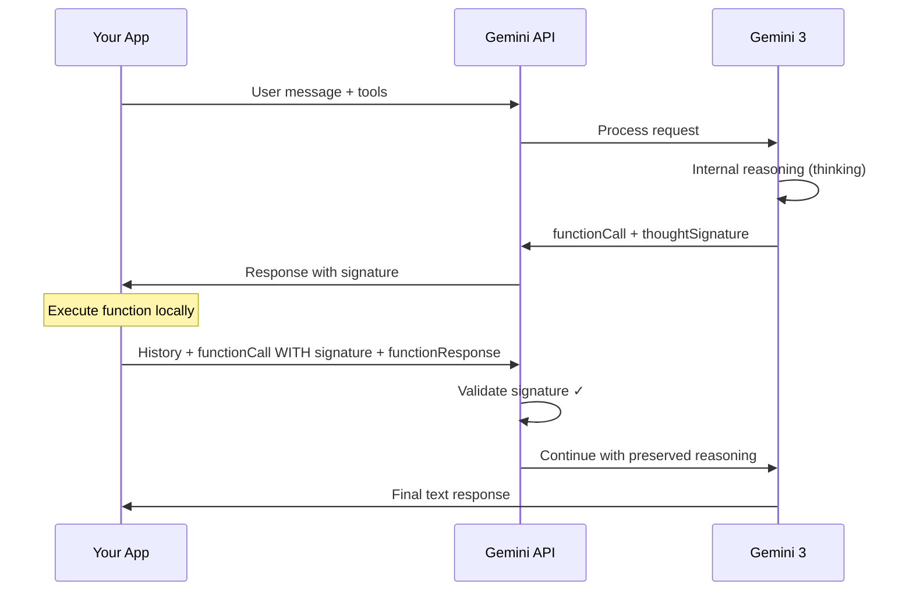

# Thought Signatures

## Introduction

Google's Gemini 3 models are "thinking" models — they perform internal reasoning before responding. When function calling is involved, this reasoning state needs to persist across the multi-step conversation. Gemini solves this with **thought signatures**: encrypted strings attached to function call responses that encode the model's reasoning context. You must pass these signatures back unchanged in the conversation history, or the API returns a validation error.

This is a Gemini-specific feature that doesn't exist in OpenAI or Anthropic's APIs. However, OpenAI has an analogous concept with "reasoning items" in models like o4-mini and GPT-5, where reasoning output must be passed back in subsequent requests. Understanding thought signatures prepares you for both ecosystems.

### What we'll cover

- What thought signatures are and why they exist
- Validation rules: when signatures are required vs. optional
- How signatures work in sequential and parallel function calls
- How the Google GenAI SDK handles signatures automatically
- Differences between Gemini 3 and Gemini 2.5 signature behavior

### Prerequisites

- Understanding of [multi-turn conversation flow](./01-conversation-flow.md) — turns and steps
- Familiarity with the Gemini API's `Content`/`Part` structure
- Knowledge of [sequential](./02-sequential-calls.md) and [parallel](./03-parallel-calls.md) function calling patterns

---

## What are thought signatures?

When a Gemini 3 model makes a function call, it does internal reasoning first: "The user wants flight info, so I should call `check_flight`. If the result shows a delay, I'll need to book a taxi." This reasoning is encrypted into a `thoughtSignature` field attached to the function call part in the model's response.

The signature is opaque — you can't read or modify it. Your only job is to **pass it back exactly as received** when sending the conversation history in the next request.



> **Warning:** If you omit or modify a thought signature for Gemini 3 models, the API returns a **400 error**. This is strictly enforced — there is no "best effort" fallback.

---

## When signatures appear

Thought signatures show up in specific places depending on the type of function call:

| Scenario | Where the signature appears | Required? |
|----------|---------------------------|-----------|
| **Single function call** | On the `functionCall` part | ✅ Yes (Gemini 3) |
| **Parallel function calls** | On the **first** `functionCall` part only | ✅ Yes (first part only) |
| **Sequential steps** | On each step's `functionCall` part | ✅ Yes (all steps in current turn) |
| **Text response (no function call)** | On the last `text` part | 🟡 Recommended, not enforced |
| **Previous turns** | In conversation history | ❌ Not validated (only current turn) |

> **Important:** The API validates signatures for the **current turn** only. It finds the most recent user message with text content (not a `functionResponse`), and all model `functionCall` turns after that must include valid signatures.

---

## Sequential function calling with signatures

In a sequential chain, each step produces a function call with its own signature. You must preserve **all** signatures from all steps in the current turn.

### Step-by-step example

Let's trace a complete sequential flow: "Check flight AA100 and book a taxi if delayed."

**Step 1: Send the user request**

```python
from google import genai
from google.genai import types

client = genai.Client()

# Define tools
check_flight = types.FunctionDeclaration(
    name="check_flight",
    description="Gets the current status of a flight",
    parameters=types.Schema(
        type="OBJECT",
        properties={
            "flight": types.Schema(
                type="STRING",
                description="The flight number to check"
            )
        },
        required=["flight"]
    )
)

book_taxi = types.FunctionDeclaration(
    name="book_taxi",
    description="Book a taxi for a given time",
    parameters=types.Schema(
        type="OBJECT",
        properties={
            "time": types.Schema(
                type="STRING",
                description="Pickup time"
            )
        },
        required=["time"]
    )
)

tool = types.Tool(function_declarations=[check_flight, book_taxi])

# Initial request
contents = [
    types.Content(
        role="user",
        parts=[types.Part.from_text(
            "Check flight status for AA100 and book a taxi "
            "2 hours before if delayed."
        )]
    )
]

response1 = client.models.generate_content(
    model="gemini-3-flash-preview",
    contents=contents,
    config=types.GenerateContentConfig(tools=[tool])
)
```

**Step 1 model response — includes thought signature:**

```python
# The model response contains a functionCall with a thoughtSignature
model_content = response1.candidates[0].content
# model_content.parts[0] looks like:
# Part(
#     function_call=FunctionCall(name="check_flight", args={"flight": "AA100"}),
#     thought_signature="<encrypted_signature_A>"
# )

print(f"Function: {model_content.parts[0].function_call.name}")
print(f"Has signature: {model_content.parts[0].thought_signature is not None}")
```

**Output:**
```
Function: check_flight
Has signature: True
```

**Step 2: Send function result — preserve the signature**

```python
# Add the model's response (WITH signature) to history
contents.append(model_content)

# Add our function response
contents.append(
    types.Content(
        role="user",
        parts=[
            types.Part.from_function_response(
                name="check_flight",
                response={
                    "status": "delayed",
                    "departure_time": "12 PM"
                }
            )
        ]
    )
)

# Send again — the API validates that Signature A is present
response2 = client.models.generate_content(
    model="gemini-3-flash-preview",
    contents=contents,
    config=types.GenerateContentConfig(tools=[tool])
)
```

**Step 2 model response — new signature for the second call:**

```python
model_content2 = response2.candidates[0].content
# Part(
#     function_call=FunctionCall(name="book_taxi", args={"time": "10 AM"}),
#     thought_signature="<encrypted_signature_B>"
# )
```

**Step 3: Send second function result — preserve BOTH signatures**

```python
# Add model's second response (with Signature B)
contents.append(model_content2)

# Add taxi booking result
contents.append(
    types.Content(
        role="user",
        parts=[
            types.Part.from_function_response(
                name="book_taxi",
                response={"booking_status": "success"}
            )
        ]
    )
)

# The API validates BOTH Signature A and Signature B in the history
response3 = client.models.generate_content(
    model="gemini-3-flash-preview",
    contents=contents,
    config=types.GenerateContentConfig(tools=[tool])
)

# Final text response
print(response3.text)
```

**Output:**
```
Flight AA100 is delayed until 12 PM. I've booked a taxi for 10 AM. Your booking is confirmed!
```

> **🔑 Key concept:** In sequential function calling, each step generates a new signature. When you send the history for step 3, the API checks that ALL signatures from the current turn (Signature A from step 1 AND Signature B from step 2) are present and unmodified.

---

## Parallel function calling with signatures

In parallel function calls, the signature appears only on the **first** `functionCall` part. Subsequent parallel calls in the same response don't have signatures:

```python
# User asks for weather in two cities
contents = [
    types.Content(
        role="user",
        parts=[types.Part.from_text("Check the weather in Paris and London.")]
    )
]

response = client.models.generate_content(
    model="gemini-3-flash-preview",
    contents=contents,
    config=types.GenerateContentConfig(tools=[weather_tool])
)

model_content = response.candidates[0].content

# Part 0: functionCall("get_weather", {"city": "Paris"}) + thoughtSignature
# Part 1: functionCall("get_weather", {"city": "London"}) — NO signature

for i, part in enumerate(model_content.parts):
    if part.function_call:
        has_sig = part.thought_signature is not None
        print(f"Part {i}: {part.function_call.name} — signature: {has_sig}")
```

**Output:**
```
Part 0: get_weather — signature: True
Part 1: get_weather — signature: False
```

### Returning parallel results — preserve the signature on the first part

```python
# Add model response (with signature on first part)
contents.append(model_content)

# Add function responses — ALL in one Content block
# IMPORTANT: Don't interleave functionCall and functionResponse
contents.append(
    types.Content(
        role="user",
        parts=[
            types.Part.from_function_response(
                name="get_weather",
                response={"temp": "15C"}
            ),
            types.Part.from_function_response(
                name="get_weather",
                response={"temp": "12C"}
            )
        ]
    )
)

response2 = client.models.generate_content(
    model="gemini-3-flash-preview",
    contents=contents,
    config=types.GenerateContentConfig(tools=[weather_tool])
)
```

> **Warning:** When returning parallel function responses, do NOT interleave them with the function call parts. The expected format is: model content (FC1 + signature, FC2), then user content (FR1, FR2). Interleaving like (FC1 + signature, FR1, FC2, FR2) causes a **400 error**.

---

## The SDK handles signatures automatically

If you use the Google GenAI SDK's chat interface or automatic function calling, **you don't need to manage signatures manually**. The SDK handles them transparently:

```python
from google import genai
from google.genai import types

client = genai.Client()


def check_flight(flight: str) -> dict:
    """Check flight status."""
    return {"status": "delayed", "departure_time": "12 PM"}

def book_taxi(time: str) -> dict:
    """Book a taxi."""
    return {"booking_status": "success"}


# Using the chat interface — signatures handled automatically
chat = client.chats.create(
    model="gemini-3-flash-preview",
    config=types.GenerateContentConfig(
        tools=[check_flight, book_taxi]
        # Automatic function calling is on by default
    )
)

# The SDK:
# 1. Calls check_flight automatically
# 2. Preserves the thought signature
# 3. Calls book_taxi if needed
# 4. Preserves both signatures
# 5. Returns the final text response
response = chat.send_message(
    "Check flight AA100 and book a taxi 2 hours before if delayed."
)

print(response.text)
```

**Output:**
```
Flight AA100 is delayed. The new departure is 12 PM. I've booked a taxi for 10 AM.
```

> **Tip:** For most use cases, the SDK's automatic handling is sufficient and recommended. Only manage signatures manually when you need custom logic between function calls (validation, logging, error recovery).

---

## Gemini 3 vs. Gemini 2.5 signature behavior

The signature rules differ between model generations:

| Behavior | Gemini 3 (Pro/Flash) | Gemini 2.5 (Pro/Flash) |
|----------|---------------------|----------------------|
| **Signature location (with FC)** | First `functionCall` part | First part (any type) |
| **Signature validation** | ✅ Strictly enforced (400 error) | 🟡 Optional (no error if omitted) |
| **Signature on text parts** | Last part if model generated a thought | Not included |
| **Missing signature error** | "Function call `FC` in the `N.` content block is missing a `thought_signature`" | No error |
| **Thinking level `minimal`** | Still requires signatures | N/A |

> **Important:** Even with the `minimal` thinking level in Gemini 3 Flash, thought signatures are still required. There is no way to opt out of signature validation for Gemini 3 models.

---

## Handling signatures in non-function-call parts

Gemini 3 may also return thought signatures on text parts (not just function calls). These appear on the **last part** of a response when the model generates internal reasoning:

```python
# Model response with text + signature (no function call)
# Part(
#     text="I need to calculate the risk. Let me think step-by-step...",
#     thought_signature="<Signature_C>"
# )
```

For non-function-call signatures:
- **Recommended** to pass them back for better reasoning quality
- **Not enforced** — omitting them won't cause an error
- Helps the model maintain complex reasoning across turns

```python
# If you omit the text signature, no error occurs
# But the model's reasoning quality may degrade for complex tasks
```

---

## Dummy signatures for edge cases

In rare scenarios, you might need to inject function call parts that weren't generated by the API (e.g., transferring a conversation from a different model, or replaying a trace). For these cases, Gemini provides two dummy signatures:

```python
# Dummy signatures to bypass validation
# Use ONLY when you can't provide real signatures

dummy_signature_1 = "context_engineering_is_the_way_to_go"
dummy_signature_2 = "skip_thought_signature_validator"

# Example: Injecting a function call from a different source
injected_content = types.Content(
    role="model",
    parts=[
        types.Part(
            function_call=types.FunctionCall(
                name="check_flight",
                args={"flight": "AA100"}
            ),
            thought_signature="skip_thought_signature_validator"
        )
    ]
)
```

> **Warning:** Using dummy signatures is strongly discouraged for normal operations. They skip the reasoning context entirely, which can degrade response quality. Use them only when transferring conversations between models or replaying saved traces.

---

## Comparison with OpenAI reasoning items

OpenAI has an analogous concept for thinking models (o4-mini, GPT-5). These models return "reasoning items" in their output that must be passed back in subsequent requests:

```python
# OpenAI reasoning items (analogous to thought signatures)
response = client.responses.create(
    model="o4-mini",
    tools=tools,
    input=messages
)

# The output may contain reasoning items
for item in response.output:
    if item.type == "reasoning":
        # Must include in next request
        print("Reasoning item — must pass back")

# Pass ALL output items (including reasoning) in the next request
next_input = messages + list(response.output)
```

| Feature | Gemini 3 thought signatures | OpenAI reasoning items |
|---------|---------------------------|----------------------|
| **Format** | `thoughtSignature` on Part | `reasoning` type in output |
| **Content** | Encrypted, opaque | Encrypted summary of reasoning |
| **Validation** | Strict (400 error) | Required (may error if missing) |
| **SDK handling** | Automatic in chat interface | Must include manually |

---

## Best practices

| Practice | Why it matters |
|----------|----------------|
| Use the SDK's chat interface when possible | Automatic signature handling eliminates manual tracking |
| Always pass back the full model response | Includes signatures without you needing to extract them |
| Don't merge parts with different signatures | Each part's signature is tied to that specific reasoning context |
| Test with `minimal` thinking level too | Gemini 3 Flash still requires signatures even at minimal thinking |
| Handle streaming carefully | During streaming, the signature may arrive in an empty text part — parse until `finish_reason` |

---

## Common pitfalls

| ❌ Mistake | ✅ Solution |
|-----------|-------------|
| Stripping thought signatures from model responses | Always preserve the full model response object — don't filter out signatures |
| Interleaving parallel FC and FR parts | Keep model's function calls together, then your function responses together |
| Using dummy signatures for normal operations | Only use `skip_thought_signature_validator` for trace replay or model transfer |
| Assuming Gemini 2.5 rules apply to Gemini 3 | Gemini 3 is strictly enforced — 2.5 was optional |
| Not handling signatures during streaming | Parse the entire streamed response until `finish_reason` — signature may be in a part with empty text |
| Modifying the signature string | Signatures are cryptographic — any modification invalidates them |

---

## Hands-on exercise

### Your task

Build a signature-aware conversation manager for Gemini that correctly preserves thought signatures across a multi-step function calling chain.

### Requirements

1. Create a `GeminiConversationManager` class that stores conversation contents
2. Implement `add_model_response(response)` that automatically extracts and preserves thought signatures
3. Implement `add_function_results(results: list)` that correctly formats function responses
4. Add a `validate_signatures()` method that checks the current turn's history for missing signatures
5. Test with a simulated 3-step sequential chain

### Expected result

A manager that tracks signatures and can detect when one is missing from the conversation history.

<details>
<summary>💡 Hints</summary>

- Store contents as a list of dicts representing the conversation
- Track signatures separately for validation: `{step: int, signature: str}`
- For validation, walk backward from the end to find the current turn's start
- The current turn starts at the most recent user message with text (not a `functionResponse`)

</details>

<details>
<summary>✅ Solution</summary>

```python
from dataclasses import dataclass, field


@dataclass
class SignatureRecord:
    """Record of a thought signature in the conversation."""
    step: int
    function_name: str
    signature: str
    is_first_in_parallel: bool = True


class GeminiConversationManager:
    """Manage Gemini conversations with thought signature tracking."""
    
    def __init__(self):
        self.contents: list[dict] = []
        self.signatures: list[SignatureRecord] = []
        self.step_count: int = 0
    
    def add_user_message(self, text: str) -> None:
        """Add a user text message (starts a new turn)."""
        self.contents.append({
            "role": "user",
            "type": "text",
            "text": text
        })
    
    def add_model_response(
        self, 
        function_calls: list[dict],
        text: str | None = None
    ) -> None:
        """Add a model response with function calls and signatures.
        
        Args:
            function_calls: List of {"name", "args", "signature"} dicts
            text: Optional text response (no function calls)
        """
        self.step_count += 1
        
        if text and not function_calls:
            self.contents.append({
                "role": "model",
                "type": "text",
                "text": text
            })
            return
        
        parts = []
        for i, fc in enumerate(function_calls):
            part = {
                "function_call": {"name": fc["name"], "args": fc["args"]}
            }
            
            # Signature on first part only (parallel) or each step (sequential)
            if fc.get("signature"):
                part["thought_signature"] = fc["signature"]
                self.signatures.append(SignatureRecord(
                    step=self.step_count,
                    function_name=fc["name"],
                    signature=fc["signature"],
                    is_first_in_parallel=(i == 0)
                ))
            
            parts.append(part)
        
        self.contents.append({
            "role": "model",
            "type": "function_calls",
            "parts": parts
        })
    
    def add_function_results(self, results: list[dict]) -> None:
        """Add function results as a user message.
        
        Args:
            results: List of {"name", "response"} dicts
        """
        parts = [
            {"function_response": {"name": r["name"], "response": r["response"]}}
            for r in results
        ]
        self.contents.append({
            "role": "user",
            "type": "function_responses",
            "parts": parts
        })
    
    def validate_signatures(self) -> tuple[bool, list[str]]:
        """Validate that all required signatures are present.
        
        Returns:
            (is_valid, list_of_issues)
        """
        issues = []
        
        # Find current turn start (most recent user text message)
        current_turn_start = None
        for i in range(len(self.contents) - 1, -1, -1):
            if (self.contents[i]["role"] == "user" and 
                self.contents[i]["type"] == "text"):
                current_turn_start = i
                break
        
        if current_turn_start is None:
            return True, []  # No turn to validate
        
        # Check all model function call entries after turn start
        for i in range(current_turn_start, len(self.contents)):
            entry = self.contents[i]
            if entry["role"] == "model" and entry["type"] == "function_calls":
                # First part must have a signature
                first_part = entry["parts"][0]
                if "thought_signature" not in first_part:
                    fc_name = first_part["function_call"]["name"]
                    issues.append(
                        f"Missing signature on {fc_name} in content block {i}"
                    )
        
        return len(issues) == 0, issues
    
    def get_signature_summary(self) -> str:
        """Get a summary of all tracked signatures."""
        if not self.signatures:
            return "No signatures recorded"
        
        lines = ["=== Thought Signatures ==="]
        for sig in self.signatures:
            lines.append(
                f"  Step {sig.step}: {sig.function_name} — "
                f"signature: {sig.signature[:20]}..."
            )
        return "\n".join(lines)


# Test: 3-step sequential chain with signatures
manager = GeminiConversationManager()

# User request (starts Turn 1)
manager.add_user_message(
    "Check flight AA100 and book a taxi if delayed."
)

# Step 1: Model calls check_flight with Signature A
manager.add_model_response([{
    "name": "check_flight",
    "args": {"flight": "AA100"},
    "signature": "<encrypted_signature_A>"
}])

# Step 1 result
manager.add_function_results([{
    "name": "check_flight",
    "response": {"status": "delayed", "departure_time": "12 PM"}
}])

# Step 2: Model calls book_taxi with Signature B
manager.add_model_response([{
    "name": "book_taxi",
    "args": {"time": "10 AM"},
    "signature": "<encrypted_signature_B>"
}])

# Step 2 result
manager.add_function_results([{
    "name": "book_taxi",
    "response": {"booking_status": "success"}
}])

# Step 3: Model responds with text
manager.add_model_response([], text="Flight is delayed. Taxi booked for 10 AM!")

# Validate
is_valid, issues = manager.validate_signatures()
print(f"Valid: {is_valid}")
print(f"Issues: {issues}")
print()
print(manager.get_signature_summary())

# Test: Missing signature
print("\n--- Testing missing signature ---")
manager2 = GeminiConversationManager()
manager2.add_user_message("Check weather in Paris")
manager2.add_model_response([{
    "name": "get_weather",
    "args": {"city": "Paris"}
    # No signature!
}])

is_valid2, issues2 = manager2.validate_signatures()
print(f"Valid: {is_valid2}")
print(f"Issues: {issues2}")
```

**Output:**
```
Valid: True
Issues: []

=== Thought Signatures ===
  Step 1: check_flight — signature: <encrypted_signatur...
  Step 2: book_taxi — signature: <encrypted_signatur...

--- Testing missing signature ---
Valid: False
Issues: ['Missing signature on get_weather in content block 1']
```

</details>

### Bonus challenges

- [ ] Extend the validator to handle parallel function calls (signature on first part only)
- [ ] Add a `strip_old_signatures(keep_turns: int)` method that removes signatures from turns older than N (since the API doesn't validate them)

---

## Summary

✅ Thought signatures are encrypted reasoning state that Gemini 3 attaches to function call responses — they must be passed back unchanged

✅ For sequential calls, each step has its own signature — all must be preserved within the current turn

✅ For parallel calls, only the **first** `functionCall` part has a signature

✅ The Google GenAI SDK handles signatures automatically through the chat interface and automatic function calling

✅ Gemini 3 strictly enforces signatures (400 error if missing); Gemini 2.5 treats them as optional

✅ Dummy signatures (`skip_thought_signature_validator`) exist for edge cases like model transfer, but should be avoided in normal use

**Next:** [Maintaining Context Across Calls →](./07-maintaining-context.md) — Managing conversation history and state in extended function calling sessions

---

[← Previous: Function Call Chains](./05-function-call-chains.md) | [Back to Lesson Overview](./00-multi-turn-function-calling.md)

<!-- 
Sources Consulted:
- Gemini Thought Signatures: https://ai.google.dev/gemini-api/docs/thought-signatures
- Gemini Function Calling: https://ai.google.dev/gemini-api/docs/function-calling
- OpenAI Function Calling Guide: https://platform.openai.com/docs/guides/function-calling
-->
