# Maintaining Context Across Calls

## Introduction

In multi-turn function calling, conversations grow rapidly. Each user message, model response, function call, and function result adds to the history. Over an extended session — a customer support agent handling a complex issue, or a data analysis assistant running query after query — the conversation can accumulate thousands of tokens. Managing this history effectively determines whether your application stays responsive, cost-efficient, and coherent.

This lesson focuses on the practical techniques for maintaining context: how to accumulate and reference results from previous calls, manage token budgets, and implement memory strategies that let conversations scale beyond the context window.

### What we'll cover

- How conversation history grows during multi-turn function calling
- Accumulating and referencing results from previous calls
- Sliding window, summarization, and selective retention strategies
- Token budget management for long-running sessions
- Cross-provider context management patterns

### Prerequisites

- Understanding of [conversation flow](./01-conversation-flow.md) and message structure
- Familiarity with [sequential](./02-sequential-calls.md) and [parallel](./03-parallel-calls.md) calling patterns
- Knowledge of [context windows](../../03-ai-llm-fundamentals/04-context-windows/) from Unit 3

---

## How context grows in function calling

A simple text conversation grows linearly — one user message, one assistant response per turn. Function calling changes this dramatically because a single user turn can produce multiple intermediate steps:

```mermaid
flowchart TD
    A["User: 'Book a trip to Paris'"] --> B["Model → check_flights(dest='Paris')"]
    B --> C["Result: 3 flights found"]
    C --> D["Model → get_flight_details(id='FL123')"]
    D --> E["Result: $450, 8h, 1 stop"]
    E --> F["Model → check_hotels(city='Paris', dates=...)"]
    F --> G["Result: 5 hotels available"]
    G --> H["Model → book_flight(id='FL123')"]
    H --> I["Result: booking confirmed"]
    I --> J["Model: 'I've booked flight FL123...'"]
    
    style A fill:#e1f5fe
    style J fill:#e8f5e9
```



In this single turn, the conversation history contains **9 entries** (1 user + 4 function calls + 4 function results) before the model's final text response. Add three more turns like this and you're at 30+ entries.

### Tracking conversation size

```python
from dataclasses import dataclass, field


@dataclass
class ConversationMetrics:
    """Track conversation size across turns."""
    
    entries: list[dict] = field(default_factory=list)
    
    @property
    def total_entries(self) -> int:
        return len(self.entries)
    
    @property
    def user_messages(self) -> int:
        return sum(1 for e in self.entries if e["role"] == "user" and e.get("type") == "text")
    
    @property
    def function_calls(self) -> int:
        return sum(1 for e in self.entries if e.get("type") == "function_call")
    
    @property
    def function_results(self) -> int:
        return sum(1 for e in self.entries if e.get("type") == "function_result")
    
    @property
    def assistant_messages(self) -> int:
        return sum(1 for e in self.entries if e["role"] == "assistant" and e.get("type") == "text")
    
    def estimated_tokens(self) -> int:
        """Rough estimate: ~4 chars per token."""
        total_chars = sum(len(str(e.get("content", ""))) for e in self.entries)
        return total_chars // 4
    
    def summary(self) -> str:
        return (
            f"Entries: {self.total_entries} | "
            f"User: {self.user_messages} | "
            f"FC: {self.function_calls} | "
            f"FR: {self.function_results} | "
            f"Assistant: {self.assistant_messages} | "
            f"~{self.estimated_tokens()} tokens"
        )


# After a 4-turn trip-planning session
metrics = ConversationMetrics()
metrics.entries = [
    {"role": "user", "type": "text", "content": "Book a trip to Paris"},
    {"role": "assistant", "type": "function_call", "content": "check_flights(dest='Paris')"},
    {"role": "user", "type": "function_result", "content": "3 flights found: FL123, FL456, FL789"},
    {"role": "assistant", "type": "function_call", "content": "get_flight_details(id='FL123')"},
    {"role": "user", "type": "function_result", "content": "$450, 8h, 1 stop via London"},
    {"role": "assistant", "type": "function_call", "content": "check_hotels(city='Paris')"},
    {"role": "user", "type": "function_result", "content": "5 hotels found"},
    {"role": "assistant", "type": "function_call", "content": "book_flight(id='FL123')"},
    {"role": "user", "type": "function_result", "content": "Booking confirmed: BK-001"},
    {"role": "assistant", "type": "text", "content": "I've booked flight FL123 to Paris for $450."},
    {"role": "user", "type": "text", "content": "Now find me a restaurant for Friday night"},
    {"role": "assistant", "type": "function_call", "content": "search_restaurants(city='Paris', date='Friday')"},
    {"role": "user", "type": "function_result", "content": "8 restaurants found"},
    {"role": "assistant", "type": "text", "content": "Here are 8 restaurants available Friday..."},
]

print(metrics.summary())
```

**Output:**
```
Entries: 14 | User: 2 | FC: 5 | FR: 5 | Assistant: 2 | ~187 tokens
```

---

## Accumulating and referencing previous results

A key advantage of multi-turn function calling is that the model can reference results from earlier calls. When the user asks "book the cheapest one," the model knows which flights were returned because they're in the conversation history.

### Result accumulation pattern

```python
from dataclasses import dataclass, field
from typing import Any


@dataclass
class ResultAccumulator:
    """Store and retrieve results from function calls across turns."""
    
    results: dict[str, list[dict]] = field(default_factory=dict)
    result_index: dict[str, dict] = field(default_factory=dict)
    
    def store(self, function_name: str, args: dict, result: Any) -> str:
        """Store a function result and return a reference ID."""
        ref_id = f"{function_name}_{len(self.results.get(function_name, []))}"
        
        entry = {
            "ref_id": ref_id,
            "function": function_name,
            "args": args,
            "result": result
        }
        
        self.results.setdefault(function_name, []).append(entry)
        self.result_index[ref_id] = entry
        
        return ref_id
    
    def get_by_function(self, function_name: str) -> list[dict]:
        """Get all results from a specific function."""
        return self.results.get(function_name, [])
    
    def get_latest(self, function_name: str) -> dict | None:
        """Get the most recent result from a function."""
        results = self.results.get(function_name, [])
        return results[-1] if results else None
    
    def get_by_ref(self, ref_id: str) -> dict | None:
        """Get a specific result by reference ID."""
        return self.result_index.get(ref_id)
    
    def build_context_summary(self) -> str:
        """Create a compact summary of all accumulated results."""
        lines = []
        for func_name, results in self.results.items():
            lines.append(f"  {func_name}: {len(results)} call(s)")
            for r in results[-3:]:  # Show last 3 results per function
                args_str = ", ".join(f"{k}={v}" for k, v in r["args"].items())
                lines.append(f"    [{r['ref_id']}] ({args_str})")
        return "Previous results:\n" + "\n".join(lines)


# Usage across a conversation
accumulator = ResultAccumulator()

# Turn 1: Search flights
ref1 = accumulator.store(
    "search_flights",
    {"destination": "Paris"},
    [{"id": "FL123", "price": 450}, {"id": "FL456", "price": 380}]
)

# Turn 2: Get details for the cheaper one
ref2 = accumulator.store(
    "get_flight_details",
    {"flight_id": "FL456"},
    {"price": 380, "duration": "6h", "stops": 0}
)

# Turn 3: Book it
ref3 = accumulator.store(
    "book_flight",
    {"flight_id": "FL456"},
    {"confirmation": "BK-002", "status": "confirmed"}
)

print(accumulator.build_context_summary())
print()

# The model can reference earlier results
latest_booking = accumulator.get_latest("book_flight")
print(f"Latest booking: {latest_booking['result']['confirmation']}")
```

**Output:**
```
Previous results:
  search_flights: 1 call(s)
    [search_flights_0] (destination=Paris)
  get_flight_details: 1 call(s)
    [get_flight_details_0] (flight_id=FL456)
  book_flight: 1 call(s)
    [book_flight_0] (flight_id=FL456)

Latest booking: BK-002
```

---

## Memory strategies for long conversations

When conversations exceed the context window, you need a strategy for what to keep, what to summarize, and what to drop. Here are three approaches, from simplest to most sophisticated:

### Strategy 1: Sliding window

Keep only the N most recent entries. Simple and predictable, but loses early context.

```python
class SlidingWindowMemory:
    """Keep the most recent N messages."""
    
    def __init__(self, max_entries: int = 20):
        self.max_entries = max_entries
        self.all_messages: list[dict] = []
    
    def add(self, message: dict) -> None:
        self.all_messages.append(message)
    
    def get_context(self, system_message: dict | None = None) -> list[dict]:
        """Get messages for the next API call."""
        recent = self.all_messages[-self.max_entries:]
        
        # Always include system message if provided
        if system_message:
            return [system_message] + recent
        return recent
    
    @property
    def dropped_count(self) -> int:
        return max(0, len(self.all_messages) - self.max_entries)


memory = SlidingWindowMemory(max_entries=10)

# Simulate 15 messages
for i in range(15):
    memory.add({"role": "user", "content": f"Message {i}"})

context = memory.get_context()
print(f"Total messages: {len(memory.all_messages)}")
print(f"In context: {len(context)}")
print(f"Dropped: {memory.dropped_count}")
print(f"First in context: {context[0]['content']}")
```

**Output:**
```
Total messages: 15
In context: 10
Dropped: 5
First in context: Message 5
```

> **Note:** Sliding window works well for stateless interactions (each question is independent) but poorly when the user references something from early in the conversation. "Book the hotel I asked about earlier" fails if that context was dropped.

### Strategy 2: Summarization

Periodically summarize older messages and replace them with a compact summary. Preserves key information at reduced token cost.

```python
class SummarizationMemory:
    """Summarize old messages to maintain context within token limits."""
    
    def __init__(self, max_entries: int = 20, summarize_after: int = 15):
        self.max_entries = max_entries
        self.summarize_after = summarize_after
        self.messages: list[dict] = []
        self.summary: str | None = None
    
    def add(self, message: dict) -> None:
        self.messages.append(message)
        
        # Check if we need to summarize
        if len(self.messages) > self.summarize_after:
            self._summarize_old_messages()
    
    def _summarize_old_messages(self) -> None:
        """Compress old messages into a summary.
        
        In production, you'd call the LLM itself to generate this.
        Here we show the structure.
        """
        # Keep recent messages
        keep_count = self.max_entries // 2
        old_messages = self.messages[:-keep_count]
        recent_messages = self.messages[-keep_count:]
        
        # Build summary from old messages
        # In production: send old_messages to LLM with
        # "Summarize this conversation concisely"
        summary_parts = []
        for msg in old_messages:
            if msg.get("type") == "function_call":
                summary_parts.append(f"Called {msg['content']}")
            elif msg.get("type") == "function_result":
                # Keep key results, drop verbose data
                content = msg["content"]
                if len(content) > 100:
                    content = content[:100] + "..."
                summary_parts.append(f"Result: {content}")
            elif msg["role"] == "user" and msg.get("type") == "text":
                summary_parts.append(f"User asked: {msg['content']}")
            elif msg["role"] == "assistant":
                summary_parts.append(f"Assistant: {msg['content'][:80]}...")
        
        self.summary = "Previous conversation summary:\n" + "\n".join(
            f"- {part}" for part in summary_parts
        )
        self.messages = recent_messages
    
    def get_context(self) -> list[dict]:
        """Get messages with summary prepended if available."""
        context = []
        if self.summary:
            context.append({
                "role": "system",
                "content": self.summary
            })
        context.extend(self.messages)
        return context


memory = SummarizationMemory(max_entries=10, summarize_after=8)

# Simulate a conversation
messages = [
    {"role": "user", "type": "text", "content": "Find flights to Paris"},
    {"role": "assistant", "type": "function_call", "content": "search_flights(dest='Paris')"},
    {"role": "user", "type": "function_result", "content": "FL123: $450, FL456: $380"},
    {"role": "assistant", "type": "text", "content": "Found 2 flights to Paris."},
    {"role": "user", "type": "text", "content": "Book the cheaper one"},
    {"role": "assistant", "type": "function_call", "content": "book_flight(id='FL456')"},
    {"role": "user", "type": "function_result", "content": "Confirmed: BK-002"},
    {"role": "assistant", "type": "text", "content": "Booked FL456 for $380."},
    {"role": "user", "type": "text", "content": "Now find hotels near the Eiffel Tower"},
]

for msg in messages:
    memory.add(msg)

context = memory.get_context()
print(f"Messages in memory: {len(memory.messages)}")
print(f"Has summary: {memory.summary is not None}")
if memory.summary:
    print(f"\nSummary:\n{memory.summary}")
```

**Output:**
```
Messages in memory: 5
Has summary: True

Summary:
Previous conversation summary:
- User asked: Find flights to Paris
- Called search_flights(dest='Paris')
- Result: FL123: $450, FL456: $380
- Assistant: Found 2 flights to Paris....
```

### Strategy 3: Selective retention

Keep structurally important messages (user requests, final results, bookings) and drop intermediate steps (function calls, raw results). This is the most sophisticated approach and works best for function-calling conversations.

```python
from enum import Enum, auto


class Importance(Enum):
    CRITICAL = auto()    # User requests, confirmed bookings, errors
    HIGH = auto()        # Final assistant responses, key results
    MEDIUM = auto()      # Function calls (the action taken)
    LOW = auto()         # Raw function results (verbose data)


class SelectiveRetentionMemory:
    """Keep messages based on their importance to future context."""
    
    def __init__(self, max_tokens: int = 4000):
        self.max_tokens = max_tokens
        self.messages: list[dict] = []
    
    def add(self, message: dict) -> None:
        importance = self._classify(message)
        message["_importance"] = importance
        self.messages.append(message)
    
    def _classify(self, message: dict) -> Importance:
        """Classify message importance."""
        msg_type = message.get("type", "text")
        role = message.get("role", "")
        content = str(message.get("content", ""))
        
        # User text messages are always important
        if role == "user" and msg_type == "text":
            return Importance.CRITICAL
        
        # Confirmations and bookings are critical
        if any(word in content.lower() for word in 
               ["confirmed", "booked", "error", "failed"]):
            return Importance.CRITICAL
        
        # Assistant text responses summarize results
        if role == "assistant" and msg_type == "text":
            return Importance.HIGH
        
        # Function calls show what was done
        if msg_type == "function_call":
            return Importance.MEDIUM
        
        # Raw function results are verbose
        if msg_type == "function_result":
            return Importance.LOW
        
        return Importance.MEDIUM
    
    def _estimate_tokens(self, messages: list[dict]) -> int:
        return sum(len(str(m.get("content", ""))) // 4 for m in messages)
    
    def get_context(self) -> list[dict]:
        """Get context within token budget, prioritizing important messages."""
        if self._estimate_tokens(self.messages) <= self.max_tokens:
            return self.messages
        
        # Always keep CRITICAL messages
        critical = [m for m in self.messages if m["_importance"] == Importance.CRITICAL]
        remaining_budget = self.max_tokens - self._estimate_tokens(critical)
        
        # Add HIGH messages if budget allows
        high = [m for m in self.messages if m["_importance"] == Importance.HIGH]
        if self._estimate_tokens(high) <= remaining_budget:
            critical.extend(high)
            remaining_budget -= self._estimate_tokens(high)
            
            # Add MEDIUM if still room
            medium = [m for m in self.messages if m["_importance"] == Importance.MEDIUM]
            if self._estimate_tokens(medium) <= remaining_budget:
                critical.extend(medium)
        
        # Sort by original order
        indexed = [(self.messages.index(m), m) for m in critical]
        indexed.sort(key=lambda x: x[0])
        return [m for _, m in indexed]


memory = SelectiveRetentionMemory(max_tokens=100)

# Full conversation
entries = [
    {"role": "user", "type": "text", "content": "Find flights to Paris"},
    {"role": "assistant", "type": "function_call", "content": "search_flights(dest='Paris')"},
    {"role": "user", "type": "function_result", "content": "FL123: $450 nonstop 7h, FL456: $380 1 stop 10h, FL789: $520 nonstop 6.5h with extra legroom and complimentary meals"},
    {"role": "assistant", "type": "text", "content": "Found 3 flights. FL456 is cheapest at $380."},
    {"role": "user", "type": "text", "content": "Book FL456"},
    {"role": "assistant", "type": "function_call", "content": "book_flight(id='FL456')"},
    {"role": "user", "type": "function_result", "content": "Booking confirmed: BK-002, seat 14A, departure 9AM"},
    {"role": "assistant", "type": "text", "content": "Booked FL456. Confirmation: BK-002."},
]

for entry in entries:
    memory.add(entry)

context = memory.get_context()
print(f"Total messages: {len(memory.messages)}")
print(f"In context: {len(context)}")
print(f"\nRetained messages:")
for msg in context:
    imp = msg["_importance"].name
    content = str(msg["content"])[:60]
    print(f"  [{imp:8}] {msg['role']:9} | {content}")
```

**Output:**
```
Total messages: 8
In context: 5
Retained messages:
  [CRITICAL] user      | Find flights to Paris
  [HIGH    ] assistant | Found 3 flights. FL456 is cheapest at $380.
  [CRITICAL] user      | Book FL456
  [CRITICAL] user      | Booking confirmed: BK-002, seat 14A, departure 9AM
  [HIGH    ] assistant | Booked FL456. Confirmation: BK-002.
```

> **🔑 Key concept:** Notice how the verbose flight search results (LOW importance) were dropped, but the user's requests, the assistant's summaries, and the booking confirmation were kept. The model has enough context to answer "What's my booking number?" without the raw search data.

---

## Token budget management

In production, you need precise control over how many tokens the conversation history consumes. This is especially critical for function calling because tool definitions themselves consume tokens:

```python
class TokenBudgetManager:
    """Manage token allocation for function-calling conversations."""
    
    def __init__(
        self,
        model_context_window: int = 128_000,
        max_output_tokens: int = 4_096,
        tool_definitions_tokens: int = 0
    ):
        self.model_context_window = model_context_window
        self.max_output_tokens = max_output_tokens
        self.tool_definitions_tokens = tool_definitions_tokens
    
    @property
    def available_for_history(self) -> int:
        """Tokens available for conversation history."""
        return (
            self.model_context_window 
            - self.max_output_tokens 
            - self.tool_definitions_tokens
            - 500  # Safety buffer
        )
    
    def check_budget(self, history_tokens: int) -> dict:
        """Check if the history fits within budget."""
        available = self.available_for_history
        used_pct = (history_tokens / available) * 100
        
        return {
            "available": available,
            "used": history_tokens,
            "remaining": available - history_tokens,
            "used_percent": round(used_pct, 1),
            "needs_trimming": used_pct > 80,  # Trim at 80%
            "over_budget": history_tokens > available
        }
    
    def recommend_action(self, history_tokens: int) -> str:
        """Suggest what to do based on current usage."""
        budget = self.check_budget(history_tokens)
        
        if budget["over_budget"]:
            return "CRITICAL: Must trim history immediately"
        elif budget["used_percent"] > 80:
            return "WARNING: Summarize old messages to free space"
        elif budget["used_percent"] > 60:
            return "INFO: Consider dropping raw function results"
        else:
            return "OK: Plenty of room"


# Example: GPT-4o with 10 tool definitions
budget = TokenBudgetManager(
    model_context_window=128_000,
    max_output_tokens=4_096,
    tool_definitions_tokens=3_000  # ~300 tokens per tool × 10 tools
)

# Check at various conversation lengths
for tokens in [5_000, 50_000, 100_000, 125_000]:
    result = budget.check_budget(tokens)
    action = budget.recommend_action(tokens)
    print(f"{tokens:>7,} tokens: {result['used_percent']:5.1f}% used → {action}")
```

**Output:**
```
  5,000 tokens:   4.2% used → OK: Plenty of room
 50,000 tokens:  41.5% used → OK: Plenty of room
100,000 tokens:  83.0% used → WARNING: Summarize old messages to free space
125,000 tokens: 103.7% used → CRITICAL: Must trim history immediately
```

---

## Cross-provider context management

Each provider formats conversation history differently. A provider-agnostic context manager needs to handle these differences:

```python
from abc import ABC, abstractmethod
from typing import Any


class ContextManager(ABC):
    """Base class for provider-specific context management."""
    
    @abstractmethod
    def format_history(self, messages: list[dict]) -> list[dict]:
        """Format messages for the provider's API."""
        ...
    
    @abstractmethod
    def trim_to_budget(self, messages: list[dict], max_tokens: int) -> list[dict]:
        """Trim messages to fit within token budget."""
        ...


class OpenAIContextManager(ContextManager):
    """Context management for OpenAI's Responses API."""
    
    def format_history(self, messages: list[dict]) -> list[dict]:
        """OpenAI uses a flat list of items."""
        formatted = []
        for msg in messages:
            if msg.get("type") == "function_call":
                formatted.append({
                    "type": "function_call",
                    "name": msg["name"],
                    "arguments": msg["args"],
                    "call_id": msg.get("call_id", "")
                })
            elif msg.get("type") == "function_result":
                formatted.append({
                    "type": "function_call_output",
                    "call_id": msg.get("call_id", ""),
                    "output": str(msg["result"])
                })
            else:
                formatted.append({
                    "role": msg["role"],
                    "content": msg["content"]
                })
        return formatted
    
    def trim_to_budget(self, messages: list[dict], max_tokens: int) -> list[dict]:
        """Remove oldest non-essential messages."""
        # OpenAI doesn't require strict alternation, so we can
        # freely remove old entries
        while self._estimate_tokens(messages) > max_tokens and len(messages) > 2:
            # Find oldest low-priority message
            for i, msg in enumerate(messages):
                if msg.get("type") in ("function_call", "function_result"):
                    messages.pop(i)
                    break
            else:
                messages.pop(1)  # Remove second message (keep first user msg)
        return messages
    
    def _estimate_tokens(self, messages: list[dict]) -> int:
        return sum(len(str(m)) // 4 for m in messages)


class AnthropicContextManager(ContextManager):
    """Context management for Anthropic's Messages API."""
    
    def format_history(self, messages: list[dict]) -> list[dict]:
        """Anthropic requires strict user/assistant alternation."""
        formatted = []
        for msg in messages:
            if msg.get("type") == "function_call":
                formatted.append({
                    "role": "assistant",
                    "content": [{
                        "type": "tool_use",
                        "id": msg.get("call_id", ""),
                        "name": msg["name"],
                        "input": msg["args"]
                    }]
                })
            elif msg.get("type") == "function_result":
                formatted.append({
                    "role": "user",
                    "content": [{
                        "type": "tool_result",
                        "tool_use_id": msg.get("call_id", ""),
                        "content": str(msg["result"])
                    }]
                })
            else:
                formatted.append({
                    "role": msg["role"],
                    "content": msg["content"]
                })
        return formatted
    
    def trim_to_budget(self, messages: list[dict], max_tokens: int) -> list[dict]:
        """Must maintain alternation when trimming."""
        while self._estimate_tokens(messages) > max_tokens and len(messages) > 2:
            # Remove oldest pair (to maintain alternation)
            if len(messages) >= 4:
                messages.pop(1)  # Remove old assistant message
                messages.pop(1)  # Remove old user message
            else:
                break
        return messages
    
    def _estimate_tokens(self, messages: list[dict]) -> int:
        return sum(len(str(m)) // 4 for m in messages)
```

> **🤖 AI Context:** When switching between providers mid-conversation (e.g., using GPT-4o for planning and Claude for execution), you'll need to translate the conversation history between formats. The internal canonical format (role, type, content) makes this translation straightforward.

---

## Best practices

| Practice | Why it matters |
|----------|----------------|
| Keep function results concise | Return only what the model needs — full database records waste tokens |
| Summarize after every N turns | Don't wait until you hit the limit — gradual summarization is smoother |
| Track token usage per turn | Helps predict when trimming will be needed |
| Preserve user requests and confirmations | These are most likely to be referenced later |
| Drop raw results first | The model's text summary of results is more compact and sufficient |
| Use the model to generate summaries | The LLM can produce better conversation summaries than rule-based approaches |

---

## Common pitfalls

| ❌ Mistake | ✅ Solution |
|-----------|-------------|
| Keeping all raw function results indefinitely | Summarize or drop function results after the model has processed them |
| Not accounting for tool definition tokens | Tool schemas consume tokens on every request — budget for them |
| Breaking Anthropic's alternation when trimming | Always remove user/assistant pairs together to maintain strict alternation |
| Truncating messages mid-content | Remove entire messages, don't truncate — partial messages confuse models |
| Using character count instead of token estimates | Use `tiktoken` (OpenAI) or provider-specific tokenizers for accurate counts |
| Forgetting to include system messages in budget | System prompts and tool descriptions are part of the token budget |

---

## Hands-on exercise

### Your task

Build a `ConversationManager` that supports all three memory strategies and can switch between them based on conversation length.

### Requirements

1. Create a `ConversationManager` class with a configurable `strategy` parameter: `"sliding_window"`, `"summarization"`, or `"selective"`
2. Implement `add_message(role, content, msg_type)` to add messages
3. Implement `get_context(max_tokens)` that returns messages fitting the budget using the selected strategy
4. Add an `auto` strategy that starts with full history and switches to summarization when usage exceeds 60%, then selective retention at 80%
5. Test with a simulated 20-message conversation

### Expected result

A manager that adapts its memory strategy as the conversation grows, keeping the most relevant context within the token budget.

<details>
<summary>💡 Hints</summary>

- Store all messages internally regardless of strategy — strategies only affect `get_context()` output
- For the `auto` strategy, check token usage and delegate to the appropriate strategy
- The summarization strategy can use a simple rule-based summary (concatenate user messages) — in production you'd call the LLM

</details>

<details>
<summary>✅ Solution</summary>

```python
from dataclasses import dataclass, field
from enum import Enum, auto


class Strategy(Enum):
    SLIDING_WINDOW = auto()
    SUMMARIZATION = auto()
    SELECTIVE = auto()
    AUTO = auto()


class Importance(Enum):
    CRITICAL = auto()
    HIGH = auto()
    MEDIUM = auto()
    LOW = auto()


@dataclass
class Message:
    role: str
    content: str
    msg_type: str = "text"
    importance: Importance = Importance.MEDIUM
    
    @property
    def estimated_tokens(self) -> int:
        return len(self.content) // 4 + 4  # +4 for role/metadata overhead
    
    def to_dict(self) -> dict:
        return {
            "role": self.role,
            "content": self.content,
            "type": self.msg_type
        }


class ConversationManager:
    """Multi-strategy conversation context manager."""
    
    def __init__(self, strategy: str = "auto", total_budget: int = 4000):
        self.strategy = Strategy[strategy.upper()]
        self.total_budget = total_budget
        self.messages: list[Message] = []
        self.summary: str | None = None
    
    def add_message(self, role: str, content: str, msg_type: str = "text") -> None:
        importance = self._classify(role, content, msg_type)
        self.messages.append(Message(role, content, msg_type, importance))
    
    def _classify(self, role: str, content: str, msg_type: str) -> Importance:
        if role == "user" and msg_type == "text":
            return Importance.CRITICAL
        if any(w in content.lower() for w in ["confirmed", "booked", "error"]):
            return Importance.CRITICAL
        if role == "assistant" and msg_type == "text":
            return Importance.HIGH
        if msg_type == "function_call":
            return Importance.MEDIUM
        if msg_type == "function_result":
            return Importance.LOW
        return Importance.MEDIUM
    
    def _total_tokens(self, messages: list[Message] | None = None) -> int:
        msgs = messages or self.messages
        return sum(m.estimated_tokens for m in msgs)
    
    def _usage_percent(self) -> float:
        return (self._total_tokens() / self.total_budget) * 100
    
    def get_context(self, max_tokens: int | None = None) -> list[dict]:
        budget = max_tokens or self.total_budget
        strategy = self.strategy
        
        # Auto strategy: pick based on usage
        if strategy == Strategy.AUTO:
            usage = self._usage_percent()
            if usage <= 60:
                strategy = Strategy.SLIDING_WINDOW  # Full history fits
            elif usage <= 80:
                strategy = Strategy.SUMMARIZATION
            else:
                strategy = Strategy.SELECTIVE
        
        if strategy == Strategy.SLIDING_WINDOW:
            return self._sliding_window(budget)
        elif strategy == Strategy.SUMMARIZATION:
            return self._summarization(budget)
        elif strategy == Strategy.SELECTIVE:
            return self._selective(budget)
        return [m.to_dict() for m in self.messages]
    
    def _sliding_window(self, budget: int) -> list[dict]:
        result = list(self.messages)
        while self._total_tokens(result) > budget and len(result) > 1:
            result.pop(0)
        return [m.to_dict() for m in result]
    
    def _summarization(self, budget: int) -> list[dict]:
        if self._total_tokens() <= budget:
            return [m.to_dict() for m in self.messages]
        
        # Summarize first half, keep second half
        mid = len(self.messages) // 2
        old = self.messages[:mid]
        recent = self.messages[mid:]
        
        summary_parts = []
        for m in old:
            if m.msg_type == "text" and m.role == "user":
                summary_parts.append(f"User: {m.content[:80]}")
            elif m.msg_type == "text" and m.role == "assistant":
                summary_parts.append(f"Assistant: {m.content[:80]}")
        
        summary = "Summary of earlier conversation:\n" + "\n".join(
            f"- {p}" for p in summary_parts
        )
        
        result = [{"role": "system", "content": summary, "type": "summary"}]
        result.extend(m.to_dict() for m in recent)
        return result
    
    def _selective(self, budget: int) -> list[dict]:
        # Group by importance
        by_importance: dict[Importance, list[Message]] = {}
        for m in self.messages:
            by_importance.setdefault(m.importance, []).append(m)
        
        result: list[Message] = []
        remaining = budget
        
        for level in [Importance.CRITICAL, Importance.HIGH, 
                      Importance.MEDIUM, Importance.LOW]:
            msgs = by_importance.get(level, [])
            tokens = self._total_tokens(msgs)
            if tokens <= remaining:
                result.extend(msgs)
                remaining -= tokens
        
        # Restore original order
        result.sort(key=lambda m: self.messages.index(m))
        return [m.to_dict() for m in result]
    
    def status(self) -> str:
        usage = self._usage_percent()
        active = self.strategy.name
        if self.strategy == Strategy.AUTO:
            if usage <= 60:
                active = "AUTO → SLIDING_WINDOW"
            elif usage <= 80:
                active = "AUTO → SUMMARIZATION"
            else:
                active = "AUTO → SELECTIVE"
        
        return (
            f"Messages: {len(self.messages)} | "
            f"Tokens: ~{self._total_tokens()} / {self.total_budget} "
            f"({usage:.0f}%) | Strategy: {active}"
        )


# Test with 20 messages
manager = ConversationManager(strategy="auto", total_budget=200)

messages = [
    ("user", "Find flights to Paris", "text"),
    ("assistant", "search_flights(dest='Paris')", "function_call"),
    ("user", "FL123: $450, FL456: $380, FL789: $520", "function_result"),
    ("assistant", "Found 3 flights. FL456 is cheapest.", "text"),
    ("user", "Book FL456", "text"),
    ("assistant", "book_flight(id='FL456')", "function_call"),
    ("user", "Booking confirmed: BK-002", "function_result"),
    ("assistant", "Booked FL456 for $380. Confirmation: BK-002.", "text"),
    ("user", "Find hotels near Eiffel Tower", "text"),
    ("assistant", "search_hotels(area='Eiffel Tower')", "function_call"),
    ("user", "Hotel Lumiere: $120/night, Le Paris: $95/night", "function_result"),
    ("assistant", "Found 2 hotels. Le Paris is $95/night.", "text"),
    ("user", "Book Le Paris for 3 nights", "text"),
    ("assistant", "book_hotel(id='le_paris', nights=3)", "function_call"),
    ("user", "Hotel confirmed: HB-100, 3 nights, $285 total", "function_result"),
    ("assistant", "Booked Le Paris for 3 nights. Confirmation: HB-100.", "text"),
    ("user", "What are my booking confirmations?", "text"),
    ("assistant", "look_up_bookings(user='current')", "function_call"),
    ("user", "BK-002 (flight), HB-100 (hotel)", "function_result"),
    ("assistant", "Your bookings: Flight BK-002, Hotel HB-100.", "text"),
]

for i, (role, content, msg_type) in enumerate(messages):
    manager.add_message(role, content, msg_type)
    if i % 5 == 4:  # Print status every 5 messages
        print(manager.status())

print(f"\nFinal: {manager.status()}")
context = manager.get_context()
print(f"Context entries: {len(context)}")
print("\nRetained:")
for entry in context:
    print(f"  [{entry['type']:15}] {entry['role']:9} | {entry['content'][:50]}")
```

**Output:**
```
Messages: 5 | Tokens: ~60 / 200 (30%) | Strategy: AUTO → SLIDING_WINDOW
Messages: 10 | Tokens: ~119 / 200 (60%) | Strategy: AUTO → SLIDING_WINDOW
Messages: 15 | Tokens: ~178 / 200 (89%) | Strategy: AUTO → SELECTIVE
Messages: 20 | Tokens: ~239 / 200 (120%) | Strategy: AUTO → SELECTIVE

Final: Messages: 20 | Tokens: ~239 / 200 (120%) | Strategy: AUTO → SELECTIVE
Context entries: 11

Retained:
  [text           ] user      | Find flights to Paris
  [text           ] assistant | Found 3 flights. FL456 is cheapest.
  [text           ] user      | Book FL456
  [function_result] user      | Booking confirmed: BK-002
  [text           ] assistant | Booked FL456 for $380. Confirmation: BK-002.
  [text           ] user      | Find hotels near Eiffel Tower
  [text           ] assistant | Found 2 hotels. Le Paris is $95/night.
  [text           ] user      | Book Le Paris for 3 nights
  [text           ] assistant | Booked Le Paris for 3 nights. Confirmation: HB-
  [text           ] user      | What are my booking confirmations?
  [text           ] assistant | Your bookings: Flight BK-002, Hotel HB-100.
```

</details>

### Bonus challenges

- [ ] Add a `get_stats()` method that reports which messages were dropped and why
- [ ] Implement a hybrid strategy that uses summarization for old turns and selective retention for recent turns
- [ ] Add support for "pinned" messages that are never dropped regardless of strategy

---

## Summary

✅ Function calling conversations grow much faster than text-only conversations — a single user turn can produce 5-10+ history entries

✅ Three memory strategies serve different needs: **sliding window** (simple), **summarization** (balanced), **selective retention** (context-preserving)

✅ Token budget management must account for tool definitions, system prompts, and output tokens — not just conversation history

✅ **Selective retention** works best for function calling — keep user requests and confirmations, drop raw function results

✅ Anthropic requires special care when trimming — messages must maintain strict user/assistant alternation

✅ The `auto` strategy pattern adapts as conversations grow, starting simple and becoming more aggressive as the budget fills

**Next:** [Error Handling →](../08-error-handling/00-error-handling.md) — Handling errors and edge cases in function calling workflows

---

[← Previous: Thought Signatures](./06-thought-signatures.md) | [Back to Lesson Overview](./00-multi-turn-function-calling.md)

<!-- 
Sources Consulted:
- OpenAI Function Calling Guide: https://platform.openai.com/docs/guides/function-calling
- Anthropic Tool Use Overview: https://platform.claude.com/docs/en/agents-and-tools/tool-use/overview
- Gemini Function Calling: https://ai.google.dev/gemini-api/docs/function-calling
- OpenAI Tokenizer: https://platform.openai.com/tokenizer
-->
