# Error Handling in Function Calling

## Overview

Function calling introduces a unique category of errors that don't exist in standard text generation. When a model calls a function, things can fail at multiple points: the model might request a function that doesn't exist, pass invalid arguments, your function might crash during execution, external services might time out, or the model might refuse the request entirely for safety reasons. Each of these failure modes requires a different handling strategy.

Robust error handling is what separates prototype-quality AI integrations from production-ready systems. A well-handled error can be invisible to the user — the model retries with corrected arguments, falls back to an alternative function, or gracefully explains what went wrong. A poorly handled error crashes your application or sends the model into an infinite retry loop.

This lesson covers the complete error handling lifecycle: from detecting errors at each stage of the function calling flow, to communicating them back to the model in a way it can understand, to implementing recovery strategies that keep conversations moving forward.

## What we'll cover

| # | Topic | File | Description |
|---|-------|------|-------------|
| 01 | [Function Not Found Errors](./01-function-not-found.md) | `01-function-not-found.md` | Handling unknown function requests, version mismatches, and graceful degradation |
| 02 | [Invalid Argument Errors](./02-invalid-arguments.md) | `02-invalid-arguments.md` | Validation failures, helpful error messages, retry guidance, and fallback values |
| 03 | [Execution Failures](./03-execution-failures.md) | `03-execution-failures.md` | Runtime errors, external service failures, network errors, and exception formatting |
| 04 | [Timeout Errors](./04-timeout-errors.md) | `04-timeout-errors.md` | Timeout detection, partial results, retry decisions, and user communication |
| 05 | [Safety Refusal Handling](./05-safety-refusal.md) | `05-safety-refusal.md` | Detecting refusals, the `refusal` field, safety filters, and conditional logic |
| 06 | [Communicating Errors to AI](./06-communicating-errors.md) | `06-communicating-errors.md` | Error message formatting, recovery instructions, and alternative suggestions |
| 07 | [Recovery Strategies](./07-recovery-strategies.md) | `07-recovery-strategies.md` | Retry with backoff, alternative functions, user intervention, and graceful failure |

## Error taxonomy

Errors in function calling occur at different stages of the flow. Understanding where each error type originates helps you build targeted handlers:

```mermaid
flowchart TD
    A["User Request"] --> B["Model Processes Request"]
    B --> C{"Model Decision"}
    C -->|"Refuses"| D["🔴 Safety Refusal<br/>Lesson 05"]
    C -->|"Calls function"| E{"Function Exists?"}
    E -->|"No"| F["🔴 Function Not Found<br/>Lesson 01"]
    E -->|"Yes"| G{"Arguments Valid?"}
    G -->|"No"| H["🔴 Invalid Arguments<br/>Lesson 02"]
    G -->|"Yes"| I["Execute Function"]
    I -->|"Crashes"| J["🔴 Execution Failure<br/>Lesson 03"]
    I -->|"Too slow"| K["🔴 Timeout Error<br/>Lesson 04"]
    I -->|"Success"| L["Return Result"]
    
    D --> M["🟡 Communicate Error<br/>Lesson 06"]
    F --> M
    H --> M
    J --> M
    K --> M
    M --> N["🟢 Recovery Strategy<br/>Lesson 07"]
    N --> O{"Resolved?"}
    O -->|"Yes"| P["Continue Conversation"]
    O -->|"No"| Q["Graceful Failure"]

    style D fill:#fee2e2
    style F fill:#fee2e2
    style H fill:#fee2e2
    style J fill:#fee2e2
    style K fill:#fee2e2
    style M fill:#fef9c3
    style N fill:#dcfce7
```

## Error types by stage

| Stage | Error Type | Cause | Severity |
|-------|-----------|-------|----------|
| **Model decision** | Safety refusal | Model refuses for safety/policy reasons | Medium — expected behavior |
| **Dispatch** | Function not found | Model calls a function not in your registry | High — likely a bug or mismatch |
| **Validation** | Invalid arguments | Arguments fail schema or business rule validation | Medium — model can often self-correct |
| **Execution** | Runtime failure | Code crash, exception, assertion error | High — needs immediate handling |
| **Execution** | External service failure | API down, database unavailable, auth expired | High — transient, may resolve |
| **Execution** | Network error | DNS failure, connection refused, SSL error | High — transient |
| **Execution** | Timeout | Function takes too long to respond | Medium — may have partial results |

## Provider error comparison

Each provider surfaces errors differently. Understanding these differences is essential for building cross-provider error handling:

| Feature | OpenAI | Anthropic | Gemini |
|---------|--------|-----------|--------|
| **Safety refusal indicator** | `refusal` field on response output | `stop_reason: "end_turn"` with no tool call | `finishReason: "SAFETY"` or blocked response |
| **Invalid tool error** | 400 `BadRequestError` | 400 `invalid_request_error` | 400 `INVALID_ARGUMENT` |
| **Strict mode validation** | `strict: true` — guaranteed schema adherence | `strict: true` — guaranteed schema conformance | `VALIDATED` mode (preview) |
| **Rate limit error** | 429 `RateLimitError` | 429 `rate_limit_error` or 529 `overloaded_error` | 429 `RESOURCE_EXHAUSTED` |
| **Timeout handling** | `APITimeoutError` exception | SDK timeout config | 504 `DEADLINE_EXCEEDED` |
| **Error result format** | `function_call_output` with error string | `tool_result` with `is_error: true` | `functionResponse` with error in response dict |
| **Python SDK exception** | `openai.APIError` hierarchy | `anthropic.APIError` hierarchy | `google.api_core.exceptions` hierarchy |

## Key terminology

| Term | Definition |
|------|-----------|
| **Dispatch error** | Error when routing a function call to its handler (function not found, version mismatch) |
| **Validation error** | Error when function arguments fail schema or business rule checks |
| **Execution error** | Error during actual function execution (runtime crash, external service failure) |
| **Transient error** | Temporary failure that may resolve on retry (network timeout, rate limit, service overload) |
| **Permanent error** | Error that won't resolve without code changes (function not found, schema mismatch) |
| **Safety refusal** | Model declines to call a function for safety/policy reasons |
| **Graceful degradation** | Providing a reduced but functional response when a function fails |
| **Error propagation** | Formatting error information for the model to understand and act on |
| **Circuit breaker** | Pattern that stops calling a failing service after repeated failures |
| **Exponential backoff** | Retry strategy with increasing delays between attempts |

---

**Next:** [Function Not Found Errors →](./01-function-not-found.md) — Handling unknown function requests, version mismatches, and graceful degradation

---

[← Previous: Maintaining Context](../07-multi-turn-function-calling/07-maintaining-context.md) | [Back to Unit Overview](../00-overview.md)

<!-- 
Sources Consulted:
- OpenAI Function Calling Guide: https://platform.openai.com/docs/guides/function-calling
- OpenAI Error Codes: https://platform.openai.com/docs/guides/error-codes
- Anthropic Tool Use Overview: https://platform.claude.com/docs/en/agents-and-tools/tool-use/overview
- Anthropic Errors: https://platform.claude.com/docs/en/api/errors
- Gemini Function Calling: https://ai.google.dev/gemini-api/docs/function-calling
- Gemini Troubleshooting: https://ai.google.dev/gemini-api/docs/troubleshooting
-->
