# Function Not Found Errors

## Introduction

A "function not found" error occurs when the model requests a function that doesn't exist in your application's function registry. This can happen for several reasons: the model hallucinates a function name, there's a version mismatch between the tools you defined and what the model calls, or the model combines parts of multiple function names into a non-existent one. These errors need to be caught at the dispatch layer — before any execution is attempted.

This is the first error type in the function calling flow, and it's one of the easiest to prevent. With proper validation and clear tool definitions, function-not-found errors become rare. But when they do occur, your system needs to handle them gracefully rather than crashing.

### What we'll cover

- How function-not-found errors happen across providers
- Building a function dispatch registry with validation
- Version mismatch detection and handling
- Graceful degradation when a function is unavailable
- Notifying users when tool capabilities change

### Prerequisites

- Understanding of [function calling concepts](../01-function-calling-concepts/00-function-calling-concepts.md)
- Familiarity with [handling function calls](../04-handling-function-calls/00-handling-function-calls.md)
- Knowledge of the [agentic loop](../07-multi-turn-function-calling/01-conversation-flow.md)

---

## How function-not-found errors happen

When a model returns a function call, your application must route it to the correct handler. If no handler exists, you have a dispatch error:

```mermaid
flowchart LR
    A["Model: call get_flight_info()"] --> B{"Lookup in Registry"}
    B -->|"Found"| C["Execute Handler"]
    B -->|"Not Found"| D["🔴 Dispatch Error"]
    D --> E["Return Error to Model"]
```



### Common causes

| Cause | Example | How to prevent |
|-------|---------|----------------|
| **Model hallucination** | Model invents `search_flights` when only `get_flights` is defined | Use descriptive, unambiguous function names |
| **Typo in function name** | Model calls `get_wether` instead of `get_weather` | Enable strict mode for schema adherence |
| **Version mismatch** | Code updated to rename `lookup_user` to `find_user`, but cached tools still use old name | Version your tool definitions |
| **Dynamic tool removal** | Function was available in previous turn but removed mid-conversation | Track tool availability per conversation |
| **Name collision** | Two tools with similar names cause model to pick the wrong one | Use distinct, prefixed names (`db_query`, `api_search`) |

> **Note:** With strict mode enabled (OpenAI `strict: true`, Anthropic `strict: true`, Gemini `VALIDATED` mode), the model is constrained to only call functions you've defined. This dramatically reduces hallucinated function names — but it doesn't eliminate version mismatches or dynamic removal scenarios.

---

## Building a function dispatch registry

The first line of defense is a registry that validates function names before attempting execution:

```python
from dataclasses import dataclass, field
from typing import Callable, Any
from enum import Enum, auto


class DispatchError(Exception):
    """Raised when a function call cannot be dispatched."""
    
    def __init__(self, function_name: str, reason: str, suggestions: list[str] | None = None):
        self.function_name = function_name
        self.reason = reason
        self.suggestions = suggestions or []
        super().__init__(f"Cannot dispatch '{function_name}': {reason}")


class FunctionStatus(Enum):
    ACTIVE = auto()
    DEPRECATED = auto()
    REMOVED = auto()
    DISABLED = auto()


@dataclass
class FunctionEntry:
    """A registered function with metadata."""
    name: str
    handler: Callable
    status: FunctionStatus = FunctionStatus.ACTIVE
    version: str = "1.0"
    replacement: str | None = None  # For deprecated functions
    description: str = ""


class FunctionRegistry:
    """Registry that validates and dispatches function calls."""
    
    def __init__(self):
        self._functions: dict[str, FunctionEntry] = {}
        self._aliases: dict[str, str] = {}  # old_name -> current_name
    
    def register(
        self,
        name: str,
        handler: Callable,
        version: str = "1.0",
        description: str = "",
        aliases: list[str] | None = None
    ) -> None:
        """Register a function handler."""
        self._functions[name] = FunctionEntry(
            name=name,
            handler=handler,
            status=FunctionStatus.ACTIVE,
            version=version,
            description=description
        )
        for alias in (aliases or []):
            self._aliases[alias] = name
    
    def deprecate(self, name: str, replacement: str) -> None:
        """Mark a function as deprecated with its replacement."""
        if name in self._functions:
            self._functions[name].status = FunctionStatus.DEPRECATED
            self._functions[name].replacement = replacement
            self._aliases[name] = replacement
    
    def remove(self, name: str) -> None:
        """Mark a function as removed (keep for error messages)."""
        if name in self._functions:
            self._functions[name].status = FunctionStatus.REMOVED
    
    def dispatch(self, function_name: str, arguments: dict) -> Any:
        """Dispatch a function call with validation.
        
        Returns:
            The function result on success.
            
        Raises:
            DispatchError: If the function cannot be found or is unavailable.
        """
        # Check aliases first (handles renamed functions)
        resolved_name = self._aliases.get(function_name, function_name)
        
        # Look up the function
        entry = self._functions.get(resolved_name)
        
        if entry is None:
            # Function truly not found — suggest similar names
            suggestions = self._find_similar(function_name)
            raise DispatchError(
                function_name,
                reason="Function not found in registry",
                suggestions=suggestions
            )
        
        # Check function status
        if entry.status == FunctionStatus.REMOVED:
            raise DispatchError(
                function_name,
                reason=f"Function '{function_name}' has been removed",
                suggestions=[entry.replacement] if entry.replacement else []
            )
        
        if entry.status == FunctionStatus.DISABLED:
            raise DispatchError(
                function_name,
                reason=f"Function '{function_name}' is temporarily disabled"
            )
        
        if entry.status == FunctionStatus.DEPRECATED:
            # Still works, but log a warning
            print(f"WARNING: '{function_name}' is deprecated. "
                  f"Use '{entry.replacement}' instead.")
        
        # Execute the function
        return entry.handler(**arguments)
    
    def _find_similar(self, name: str, max_results: int = 3) -> list[str]:
        """Find function names similar to the requested one."""
        scored = []
        for registered_name in self._functions:
            if self._functions[registered_name].status == FunctionStatus.ACTIVE:
                score = self._similarity(name, registered_name)
                if score > 0.4:  # Minimum similarity threshold
                    scored.append((registered_name, score))
        
        scored.sort(key=lambda x: x[1], reverse=True)
        return [name for name, _ in scored[:max_results]]
    
    @staticmethod
    def _similarity(a: str, b: str) -> float:
        """Simple character-based similarity (Jaccard on character bigrams)."""
        if not a or not b:
            return 0.0
        bigrams_a = {a[i:i+2] for i in range(len(a) - 1)}
        bigrams_b = {b[i:i+2] for i in range(len(b) - 1)}
        if not bigrams_a or not bigrams_b:
            return 0.0
        intersection = bigrams_a & bigrams_b
        union = bigrams_a | bigrams_b
        return len(intersection) / len(union)


# Usage
def get_weather(location: str, units: str = "celsius") -> dict:
    return {"temperature": 22, "units": units, "location": location}

def get_forecast(location: str, days: int = 3) -> dict:
    return {"forecast": [{"day": i, "temp": 20 + i} for i in range(days)]}


registry = FunctionRegistry()
registry.register("get_weather", get_weather, version="2.0",
                   aliases=["check_weather", "weather_lookup"])
registry.register("get_forecast", get_forecast, version="1.0")

# Successful dispatch
result = registry.dispatch("get_weather", {"location": "Paris"})
print(f"Success: {result}")

# Alias works too
result2 = registry.dispatch("check_weather", {"location": "London"})
print(f"Alias: {result2}")

# Unknown function
try:
    registry.dispatch("get_wether", {"location": "Berlin"})
except DispatchError as e:
    print(f"Error: {e}")
    print(f"Suggestions: {e.suggestions}")
```

**Output:**
```
Success: {'temperature': 22, 'units': 'celsius', 'location': 'Paris'}
Alias: {'temperature': 22, 'units': 'celsius', 'location': 'London'}
Error: Cannot dispatch 'get_wether': Function not found in registry
Suggestions: ['get_weather']
```

---

## Provider-specific detection

Each provider presents function-not-found scenarios differently. Here's how to detect and handle them:

### OpenAI — Responses API

OpenAI returns the function name in the `function_call` output item. If the name doesn't match your registry, you catch it at the dispatch layer:

```python
import json
from openai import OpenAI

client = OpenAI()


def handle_openai_function_calls(response, registry: FunctionRegistry):
    """Process OpenAI function calls with not-found handling."""
    results = []
    
    for item in response.output:
        if item.type != "function_call":
            continue
        
        try:
            args = json.loads(item.arguments)
            result = registry.dispatch(item.name, args)
            results.append({
                "type": "function_call_output",
                "call_id": item.call_id,
                "output": json.dumps(result)
            })
        except DispatchError as e:
            # Return error as function output — model can react
            error_response = {
                "error": True,
                "message": f"Function '{e.function_name}' is not available.",
                "reason": e.reason
            }
            if e.suggestions:
                error_response["available_alternatives"] = e.suggestions
            
            results.append({
                "type": "function_call_output",
                "call_id": item.call_id,
                "output": json.dumps(error_response)
            })
    
    return results
```

> **Important:** For OpenAI reasoning models (GPT-5, o4-mini), always pass back reasoning items from the response along with your function call outputs. Even when a function is not found, the reasoning context must be preserved.

### Anthropic — Messages API

Anthropic uses `tool_use` content blocks with a `tool_use_id`. For errors, return a `tool_result` with `is_error: true`:

```python
import anthropic


def handle_anthropic_function_calls(response, registry: FunctionRegistry):
    """Process Anthropic tool_use blocks with not-found handling."""
    results = []
    
    for block in response.content:
        if block.type != "tool_use":
            continue
        
        try:
            result = registry.dispatch(block.name, block.input)
            results.append({
                "type": "tool_result",
                "tool_use_id": block.id,
                "content": str(result)
            })
        except DispatchError as e:
            # Anthropic's is_error flag tells the model this is an error
            error_msg = f"Function '{e.function_name}' is not available. "
            error_msg += f"Reason: {e.reason}. "
            if e.suggestions:
                error_msg += f"Did you mean: {', '.join(e.suggestions)}?"
            
            results.append({
                "type": "tool_result",
                "tool_use_id": block.id,
                "content": error_msg,
                "is_error": True  # Anthropic-specific error flag
            })
    
    return results
```

> **🔑 Key concept:** Anthropic's `is_error: true` flag on `tool_result` is specifically designed for this scenario. It signals to Claude that the function execution failed and the model should adjust its approach — possibly trying a different function or explaining the limitation to the user.

### Gemini — Google GenAI SDK

Gemini function calls are returned as `Part` objects with `function_call` fields. Errors are communicated through the function response:

```python
from google.genai import types


def handle_gemini_function_calls(response, registry: FunctionRegistry):
    """Process Gemini function calls with not-found handling."""
    results = []
    
    for part in response.candidates[0].content.parts:
        if not part.function_call:
            continue
        
        fc = part.function_call
        
        try:
            result = registry.dispatch(fc.name, dict(fc.args))
            results.append(
                types.Part.from_function_response(
                    name=fc.name,
                    response={"result": result}
                )
            )
        except DispatchError as e:
            # Return error in the function response
            error_response = {
                "error": True,
                "message": f"Function '{e.function_name}' is not available.",
                "reason": e.reason
            }
            if e.suggestions:
                error_response["suggestions"] = e.suggestions
            
            results.append(
                types.Part.from_function_response(
                    name=fc.name,
                    response=error_response
                )
            )
    
    return results
```

---

## Version mismatch handling

Version mismatches occur when the model's tool definitions are out of sync with your application code. This is common during deployments, when tools are updated but the model's cached tool list references old names or parameters:

```python
from dataclasses import dataclass


@dataclass
class ToolVersion:
    """Track tool versions for mismatch detection."""
    name: str
    current_version: str
    min_supported_version: str
    changelog: list[str]


class VersionedRegistry(FunctionRegistry):
    """Registry with version tracking and migration support."""
    
    def __init__(self):
        super().__init__()
        self._versions: dict[str, ToolVersion] = {}
        self._migrations: dict[str, dict] = {}  # old_name -> {new_name, arg_map}
    
    def register_with_version(
        self,
        name: str,
        handler,
        version: str,
        min_version: str = "1.0",
        replaces: str | None = None,
        arg_map: dict[str, str] | None = None
    ):
        """Register a function with version info and optional migration."""
        self.register(name, handler, version=version)
        self._versions[name] = ToolVersion(
            name=name,
            current_version=version,
            min_supported_version=min_version,
            changelog=[]
        )
        
        if replaces:
            self._migrations[replaces] = {
                "new_name": name,
                "arg_map": arg_map or {}
            }
            self._aliases[replaces] = name
    
    def dispatch(self, function_name: str, arguments: dict):
        """Dispatch with automatic argument migration."""
        # Check if this is a migrated function
        if function_name in self._migrations:
            migration = self._migrations[function_name]
            new_name = migration["new_name"]
            arg_map = migration["arg_map"]
            
            # Remap arguments
            migrated_args = {}
            for old_key, value in arguments.items():
                new_key = arg_map.get(old_key, old_key)
                migrated_args[new_key] = value
            
            print(f"MIGRATION: '{function_name}' → '{new_name}', "
                  f"args: {arguments} → {migrated_args}")
            
            return super().dispatch(new_name, migrated_args)
        
        return super().dispatch(function_name, arguments)


# Example: search_users was renamed to find_users with different arg names
def find_users(query: str, max_results: int = 10) -> dict:
    return {"users": [{"name": "Alice"}, {"name": "Bob"}][:max_results]}


versioned = VersionedRegistry()
versioned.register_with_version(
    "find_users", find_users,
    version="2.0",
    replaces="search_users",      # Old name
    arg_map={"search_term": "query", "limit": "max_results"}  # Old → new
)

# Old function name + old argument names still work
result = versioned.dispatch(
    "search_users",
    {"search_term": "admin", "limit": 5}
)
print(f"Migrated result: {result}")
```

**Output:**
```
MIGRATION: 'search_users' → 'find_users', args: {'search_term': 'admin', 'limit': 5} → {'query': 'admin', 'max_results': 5}
Migrated result: {'users': [{'name': 'Alice'}, {'name': 'Bob'}]}
```

---

## Graceful degradation

When a function is unavailable (removed, disabled, or service down), provide a degraded but still useful response:

```python
def handle_with_degradation(
    function_name: str,
    arguments: dict,
    registry: FunctionRegistry
) -> dict:
    """Handle function calls with graceful degradation."""
    try:
        return {"success": True, "result": registry.dispatch(function_name, arguments)}
    
    except DispatchError as e:
        # Try to provide a useful fallback
        fallback = get_fallback_response(function_name, arguments)
        
        if fallback:
            return {
                "success": True,
                "result": fallback,
                "warning": f"Used fallback data. '{function_name}' is unavailable: {e.reason}"
            }
        
        return {
            "success": False,
            "error": e.reason,
            "suggestions": e.suggestions,
            "user_message": build_user_message(e)
        }


def get_fallback_response(function_name: str, arguments: dict) -> dict | None:
    """Provide cached or default data when a function is unavailable."""
    fallbacks = {
        "get_weather": lambda args: {
            "note": "Live weather data is temporarily unavailable",
            "suggestion": f"Check weather.com for current conditions in {args.get('location', 'your area')}"
        },
        "get_stock_price": lambda args: {
            "note": "Real-time stock data is temporarily unavailable",
            "suggestion": f"Visit finance.yahoo.com for current {args.get('symbol', '')} pricing"
        }
    }
    
    handler = fallbacks.get(function_name)
    return handler(arguments) if handler else None


def build_user_message(error: DispatchError) -> str:
    """Build a user-friendly error message."""
    msg = f"I wasn't able to use the {error.function_name} tool. "
    
    if error.suggestions:
        msg += f"I can try using {error.suggestions[0]} instead. "
    else:
        msg += "Let me try to help you another way. "
    
    return msg


# Test: unavailable function with fallback
result = handle_with_degradation(
    "get_weather",
    {"location": "Tokyo"},
    FunctionRegistry()  # Empty registry — nothing registered
)
print(result)
```

**Output:**
```
{'success': True, 'result': {'note': 'Live weather data is temporarily unavailable', 'suggestion': 'Check weather.com for current conditions in Tokyo'}, 'warning': "Used fallback data. 'get_weather' is unavailable: Function not found in registry"}
```

---

## Best practices

| Practice | Why it matters |
|----------|----------------|
| Enable strict mode on all providers | Prevents model from hallucinating function names |
| Use a registry pattern for dispatch | Centralizes validation and provides consistent error handling |
| Support aliases for renamed functions | Smooth migration path when tools evolve |
| Return errors as function outputs, not exceptions | The model can react to errors and try alternatives |
| Include suggestions in error responses | Helps the model self-correct on the next attempt |
| Log all dispatch errors | Reveals patterns — if the model keeps calling a non-existent function, your tool descriptions need improvement |

---

## Common pitfalls

| ❌ Mistake | ✅ Solution |
|-----------|-------------|
| Crashing the application on unknown function names | Catch `DispatchError` and return a structured error response to the model |
| Using `if/elif` chains instead of a registry | Build a registry with `dict` lookup — `O(1)` instead of `O(n)`, and easier to extend |
| Silently ignoring unknown function calls | Always return something to the model — silence causes the model to retry or get confused |
| Not handling deprecated functions during migration | Support old names via aliases during a transition period |
| Hard-coding function names in error messages | Use the registry's metadata to generate dynamic, accurate error messages |
| Returning raw Python exceptions to the model | Format errors as structured data the model can parse (JSON with `error`, `reason`, `suggestions` fields) |

---

## Hands-on exercise

### Your task

Build a `ResilientFunctionDispatcher` that handles function-not-found errors gracefully and integrates with an agentic loop.

### Requirements

1. Create a `ResilientFunctionDispatcher` with a registry, alias support, and similarity-based suggestions
2. Implement `dispatch(name, args)` that returns a standardized result: `{"success": bool, "result": Any, "error": str | None}`
3. Add `add_fallback(name, handler)` for registering fallback responses
4. Implement `format_for_model(dispatch_result, provider)` that formats the result correctly for OpenAI, Anthropic, or Gemini
5. Test with a scenario where the model calls 3 functions: one exists, one is deprecated, and one is unknown

### Expected result

The dispatcher handles all three cases without crashing and returns appropriate responses for each.

<details>
<summary>💡 Hints</summary>

- Store functions, aliases, and fallbacks as separate dictionaries
- The `format_for_model` method needs a `call_id` or `tool_use_id` parameter for OpenAI and Anthropic
- For the similarity search, character bigram Jaccard similarity works well enough
- Return the dispatch result as a dataclass or dict with consistent keys

</details>

<details>
<summary>✅ Solution</summary>

```python
from dataclasses import dataclass
from typing import Any, Callable
import json


@dataclass
class DispatchResult:
    """Standardized result from function dispatch."""
    success: bool
    function_name: str
    result: Any = None
    error: str | None = None
    suggestions: list[str] | None = None
    was_migrated: bool = False
    used_fallback: bool = False


class ResilientFunctionDispatcher:
    """Dispatch function calls with resilient error handling."""
    
    def __init__(self):
        self._handlers: dict[str, Callable] = {}
        self._aliases: dict[str, str] = {}
        self._fallbacks: dict[str, Callable] = {}
        self._deprecated: dict[str, str] = {}  # old -> new
    
    def register(self, name: str, handler: Callable, 
                 aliases: list[str] | None = None) -> None:
        self._handlers[name] = handler
        for alias in (aliases or []):
            self._aliases[alias] = name
    
    def deprecate(self, old_name: str, new_name: str) -> None:
        self._deprecated[old_name] = new_name
        self._aliases[old_name] = new_name
    
    def add_fallback(self, name: str, handler: Callable) -> None:
        self._fallbacks[name] = handler
    
    def dispatch(self, name: str, args: dict) -> DispatchResult:
        was_migrated = False
        
        # Resolve aliases and deprecated names
        resolved = name
        if name in self._aliases:
            resolved = self._aliases[name]
            was_migrated = name in self._deprecated
        
        # Try the registered handler
        if resolved in self._handlers:
            try:
                result = self._handlers[resolved](** args)
                return DispatchResult(
                    success=True,
                    function_name=name,
                    result=result,
                    was_migrated=was_migrated
                )
            except Exception as e:
                return DispatchResult(
                    success=False,
                    function_name=name,
                    error=f"Execution failed: {str(e)}"
                )
        
        # Try fallback
        if name in self._fallbacks:
            try:
                result = self._fallbacks[name](args)
                return DispatchResult(
                    success=True,
                    function_name=name,
                    result=result,
                    used_fallback=True
                )
            except Exception:
                pass
        
        # Not found — suggest similar
        suggestions = self._find_similar(name)
        return DispatchResult(
            success=False,
            function_name=name,
            error=f"Function '{name}' not found",
            suggestions=suggestions
        )
    
    def _find_similar(self, name: str) -> list[str]:
        scored = []
        for registered in self._handlers:
            bigrams_a = {name[i:i+2] for i in range(len(name)-1)}
            bigrams_b = {registered[i:i+2] for i in range(len(registered)-1)}
            if bigrams_a and bigrams_b:
                score = len(bigrams_a & bigrams_b) / len(bigrams_a | bigrams_b)
                if score > 0.3:
                    scored.append((registered, score))
        scored.sort(key=lambda x: x[1], reverse=True)
        return [n for n, _ in scored[:3]]
    
    def format_for_model(
        self, result: DispatchResult, provider: str, 
        call_id: str = ""
    ) -> dict:
        """Format dispatch result for a specific provider."""
        if provider == "openai":
            output = json.dumps(result.result) if result.success else json.dumps({
                "error": result.error,
                "suggestions": result.suggestions
            })
            return {
                "type": "function_call_output",
                "call_id": call_id,
                "output": output
            }
        
        elif provider == "anthropic":
            if result.success:
                return {
                    "type": "tool_result",
                    "tool_use_id": call_id,
                    "content": json.dumps(result.result)
                }
            else:
                msg = result.error or "Unknown error"
                if result.suggestions:
                    msg += f" Try: {', '.join(result.suggestions)}"
                return {
                    "type": "tool_result",
                    "tool_use_id": call_id,
                    "content": msg,
                    "is_error": True
                }
        
        elif provider == "gemini":
            if result.success:
                return {"result": result.result}
            else:
                return {
                    "error": True,
                    "message": result.error,
                    "suggestions": result.suggestions
                }
        
        return {}


# Test all three scenarios
dispatcher = ResilientFunctionDispatcher()

# Register active function
dispatcher.register("get_weather", 
    lambda location, units="celsius": {
        "temp": 22, "units": units, "location": location
    })

# Register and deprecate old function
dispatcher.register("find_users",
    lambda query, limit=10: {"users": ["Alice", "Bob"][:limit]})
dispatcher.deprecate("search_users", "find_users")

# Add fallback for removed function
dispatcher.add_fallback("get_stock_price",
    lambda args: {"note": "Stock data unavailable", 
                  "suggestion": f"Check finance.yahoo.com for {args.get('symbol', '')}"})

# Scenario 1: Active function
r1 = dispatcher.dispatch("get_weather", {"location": "Paris"})
print(f"Active:     success={r1.success}, result={r1.result}")

# Scenario 2: Deprecated function (still works)
r2 = dispatcher.dispatch("search_users", {"query": "admin", "limit": 5})
print(f"Deprecated: success={r2.success}, migrated={r2.was_migrated}, result={r2.result}")

# Scenario 3: Unknown function with suggestions
r3 = dispatcher.dispatch("get_wether", {"location": "Tokyo"})
print(f"Unknown:    success={r3.success}, error='{r3.error}', suggestions={r3.suggestions}")

# Format for each provider
print("\nOpenAI format:", dispatcher.format_for_model(r3, "openai", "call_123"))
print("Anthropic format:", dispatcher.format_for_model(r3, "anthropic", "tu_456"))
print("Gemini format:", dispatcher.format_for_model(r3, "gemini"))
```

**Output:**
```
Active:     success=True, result={'temp': 22, 'units': 'celsius', 'location': 'Paris'}
Deprecated: success=True, migrated=True, result={'users': ['Alice', 'Bob']}
Unknown:    success=False, error='Function 'get_wether' not found', suggestions=['get_weather']

OpenAI format: {'type': 'function_call_output', 'call_id': 'call_123', 'output': '{"error": "Function \'get_wether\' not found", "suggestions": ["get_weather"]}'}
Anthropic format: {'type': 'tool_result', 'tool_use_id': 'tu_456', 'content': "Function 'get_wether' not found Try: get_weather", 'is_error': True}
Gemini format: {'error': True, 'message': "Function 'get_wether' not found", 'suggestions': ['get_weather']}
```

</details>

### Bonus challenges

- [ ] Add a `_call_log` that tracks all dispatch attempts (including failures) for debugging
- [ ] Implement automatic retry: if `suggestions` has exactly one match with similarity > 0.8, auto-dispatch to that function instead

---

## Summary

✅ Function-not-found errors occur at the dispatch layer — before any function execution happens

✅ A registry pattern with dictionary lookup provides `O(1)` dispatch and centralized validation

✅ Aliases and version migration support smooth transitions when tools are renamed or updated

✅ Always return structured error data to the model rather than crashing — include the error reason and suggestions for alternatives

✅ Anthropic's `is_error: true` flag on `tool_result` explicitly signals errors to the model

✅ Graceful degradation with fallback responses keeps conversations useful even when tools are unavailable

**Next:** [Invalid Argument Errors →](./02-invalid-arguments.md) — Handling validation failures, type mismatches, and providing retry guidance

---

[← Previous: Lesson Overview](./00-error-handling.md) | [Back to Lesson Overview](./00-error-handling.md)

<!-- 
Sources Consulted:
- OpenAI Function Calling Guide: https://platform.openai.com/docs/guides/function-calling
- OpenAI Error Codes: https://platform.openai.com/docs/guides/error-codes
- Anthropic Tool Use Overview: https://platform.claude.com/docs/en/agents-and-tools/tool-use/overview
- Gemini Function Calling: https://ai.google.dev/gemini-api/docs/function-calling
-->
