# Invalid Argument Errors

## Introduction

When a model calls the right function but provides wrong, missing, or malformed arguments, we have an invalid argument error. This is the most common type of function calling error in production systems. The model might send a string where a number is expected, omit a required field, or include values outside the acceptable range.

Strict mode (`strict: true` in OpenAI and Anthropic, `VALIDATED` mode in Gemini) can prevent many of these errors by constraining the model's output to match your schema exactly. But strict mode doesn't catch semantic errors — like passing `"yesterday"` for a date field when the API expects ISO 8601 format. Your validation layer needs to handle both structural and semantic argument errors.

### What we'll cover

- Types of argument validation errors (structural, type, semantic, range)
- Implementing multi-layer argument validation
- Provider-specific strict mode behavior
- Generating helpful error messages that guide the model to retry correctly
- Coercion strategies for recoverable type mismatches

### Prerequisites

- Understanding of [function schemas](../02-defining-functions/00-defining-functions.md)
- Familiarity with [handling function calls](../04-handling-function-calls/00-handling-function-calls.md)
- Knowledge of [function-not-found errors](./01-function-not-found.md)

---

## Categories of argument errors

Argument errors fall into four categories, each requiring a different handling strategy:

```mermaid
flowchart TD
    A["Model sends arguments"] --> B{"Structural Check"}
    B -->|"Missing required field"| E["🔴 Structural Error"]
    B -->|"Extra unknown field"| E
    B -->|"OK"| C{"Type Check"}
    C -->|"Wrong type"| F["🟡 Type Error (maybe coercible)"]
    C -->|"OK"| D{"Semantic Check"}
    D -->|"Out of range"| G["🔴 Semantic Error"]
    D -->|"Invalid format"| G
    D -->|"OK"| H["✅ Valid — Execute"]
```



| Category | Example | Recoverable? |
|----------|---------|--------------|
| **Structural** | Missing `location` in `get_weather({units: "celsius"})` | No — must retry |
| **Type** | `temperature: "seventy"` instead of `temperature: 70` | Sometimes — try coercion |
| **Semantic** | `date: "2025-13-45"` (invalid date) | No — must retry with guidance |
| **Range** | `limit: -5` (must be positive) | Sometimes — can clamp to nearest valid value |

---

## Building an argument validator

A robust validator checks arguments in stages — structural first, then types, then semantic rules:

```python
from dataclasses import dataclass, field
from typing import Any
from enum import Enum, auto
import json


class ErrorSeverity(Enum):
    WARNING = auto()   # Can be auto-fixed (coercion)
    ERROR = auto()     # Must be corrected by the model


@dataclass
class ValidationError:
    """A single validation error with fix guidance."""
    field: str
    message: str
    severity: ErrorSeverity
    expected: str
    received: Any
    suggestion: str = ""


@dataclass
class ValidationResult:
    """Result of argument validation."""
    valid: bool
    errors: list[ValidationError] = field(default_factory=list)
    warnings: list[ValidationError] = field(default_factory=list)
    coerced_args: dict = field(default_factory=dict)
    
    def error_summary(self) -> str:
        """Format errors for model consumption."""
        if self.valid:
            return "All arguments valid"
        
        parts = []
        for e in self.errors:
            msg = f"- {e.field}: {e.message}"
            if e.suggestion:
                msg += f" (suggestion: {e.suggestion})"
            parts.append(msg)
        
        for w in self.warnings:
            msg = f"- {w.field}: [auto-fixed] {w.message}"
            parts.append(msg)
        
        return "Argument validation failed:\n" + "\n".join(parts)


@dataclass
class ParamSpec:
    """Specification for a single parameter."""
    name: str
    param_type: type | tuple[type, ...]
    required: bool = True
    default: Any = None
    min_value: float | None = None
    max_value: float | None = None
    allowed_values: list | None = None
    pattern: str | None = None  # Regex pattern
    coerce: bool = True  # Attempt type coercion?
    description: str = ""


class ArgumentValidator:
    """Multi-stage argument validator for function calls."""
    
    def __init__(self, specs: list[ParamSpec]):
        self._specs = {s.name: s for s in specs}
    
    def validate(self, arguments: dict) -> ValidationResult:
        """Validate arguments against specifications."""
        result = ValidationResult(valid=True, coerced_args=dict(arguments))
        
        # Stage 1: Structural — check required fields
        self._check_structure(arguments, result)
        
        # Stage 2: Type — check and optionally coerce types
        self._check_types(arguments, result)
        
        # Stage 3: Semantic — check ranges, formats, allowed values
        self._check_semantics(result.coerced_args, result)
        
        # If any ERROR-severity issues, mark invalid
        if result.errors:
            result.valid = False
        
        return result
    
    def _check_structure(self, arguments: dict, result: ValidationResult):
        """Check for missing required fields and unknown fields."""
        # Missing required
        for name, spec in self._specs.items():
            if spec.required and name not in arguments:
                result.errors.append(ValidationError(
                    field=name,
                    message=f"Required parameter '{name}' is missing",
                    severity=ErrorSeverity.ERROR,
                    expected=f"A {spec.param_type.__name__} value",
                    received=None,
                    suggestion=spec.description or f"Provide a value for '{name}'"
                ))
        
        # Unknown fields
        for name in arguments:
            if name not in self._specs:
                result.warnings.append(ValidationError(
                    field=name,
                    message=f"Unknown parameter '{name}' — will be ignored",
                    severity=ErrorSeverity.WARNING,
                    expected="(not expected)",
                    received=arguments[name]
                ))
                # Remove from coerced args
                result.coerced_args.pop(name, None)
    
    def _check_types(self, arguments: dict, result: ValidationResult):
        """Check types and attempt coercion."""
        for name, value in arguments.items():
            spec = self._specs.get(name)
            if not spec:
                continue
            
            if isinstance(value, spec.param_type):
                continue  # Type is correct
            
            # Attempt coercion
            if spec.coerce:
                coerced = self._try_coerce(value, spec.param_type)
                if coerced is not None:
                    result.coerced_args[name] = coerced
                    result.warnings.append(ValidationError(
                        field=name,
                        message=f"Coerced '{value}' ({type(value).__name__}) → {coerced} ({type(coerced).__name__})",
                        severity=ErrorSeverity.WARNING,
                        expected=spec.param_type.__name__,
                        received=value
                    ))
                    continue
            
            # Coercion failed or not allowed
            result.errors.append(ValidationError(
                field=name,
                message=f"Expected {spec.param_type.__name__}, got {type(value).__name__}",
                severity=ErrorSeverity.ERROR,
                expected=spec.param_type.__name__,
                received=value,
                suggestion=f"Provide '{name}' as a {spec.param_type.__name__}"
            ))
    
    def _check_semantics(self, arguments: dict, result: ValidationResult):
        """Check value constraints — ranges, allowed values, patterns."""
        import re
        
        for name, value in arguments.items():
            spec = self._specs.get(name)
            if not spec:
                continue
            
            # Range check
            if spec.min_value is not None and isinstance(value, (int, float)):
                if value < spec.min_value:
                    result.errors.append(ValidationError(
                        field=name,
                        message=f"Value {value} is below minimum {spec.min_value}",
                        severity=ErrorSeverity.ERROR,
                        expected=f">= {spec.min_value}",
                        received=value,
                        suggestion=f"Use a value of {spec.min_value} or higher"
                    ))
            
            if spec.max_value is not None and isinstance(value, (int, float)):
                if value > spec.max_value:
                    result.errors.append(ValidationError(
                        field=name,
                        message=f"Value {value} exceeds maximum {spec.max_value}",
                        severity=ErrorSeverity.ERROR,
                        expected=f"<= {spec.max_value}",
                        received=value,
                        suggestion=f"Use a value of {spec.max_value} or lower"
                    ))
            
            # Allowed values
            if spec.allowed_values and value not in spec.allowed_values:
                result.errors.append(ValidationError(
                    field=name,
                    message=f"Value '{value}' is not allowed",
                    severity=ErrorSeverity.ERROR,
                    expected=f"One of: {spec.allowed_values}",
                    received=value,
                    suggestion=f"Choose from: {', '.join(str(v) for v in spec.allowed_values)}"
                ))
            
            # Pattern check
            if spec.pattern and isinstance(value, str):
                if not re.match(spec.pattern, value):
                    result.errors.append(ValidationError(
                        field=name,
                        message=f"Value '{value}' does not match required format",
                        severity=ErrorSeverity.ERROR,
                        expected=f"Pattern: {spec.pattern}",
                        received=value,
                        suggestion=f"Provide '{name}' in the correct format"
                    ))
    
    @staticmethod
    def _try_coerce(value: Any, target_type: type | tuple) -> Any:
        """Attempt safe type coercion."""
        if isinstance(target_type, tuple):
            target_type = target_type[0]
        
        try:
            if target_type == int and isinstance(value, str):
                return int(value)
            if target_type == float and isinstance(value, str):
                return float(value)
            if target_type == str and isinstance(value, (int, float)):
                return str(value)
            if target_type == bool and isinstance(value, str):
                if value.lower() in ("true", "yes", "1"):
                    return True
                if value.lower() in ("false", "no", "0"):
                    return False
            if target_type == list and isinstance(value, str):
                # Try JSON parsing
                parsed = json.loads(value)
                if isinstance(parsed, list):
                    return parsed
        except (ValueError, json.JSONDecodeError):
            pass
        
        return None


# Define validation specs for a weather function
weather_specs = [
    ParamSpec("location", str, required=True, 
              description="City name or coordinates"),
    ParamSpec("units", str, required=False, default="celsius",
              allowed_values=["celsius", "fahrenheit", "kelvin"]),
    ParamSpec("days", int, required=False, default=1,
              min_value=1, max_value=14,
              description="Forecast days (1-14)")
]

validator = ArgumentValidator(weather_specs)

# Test 1: Valid arguments
r1 = validator.validate({"location": "Paris", "units": "celsius", "days": 5})
print(f"Valid args: valid={r1.valid}")

# Test 2: Missing required + wrong type + out of range
r2 = validator.validate({"units": "imperial", "days": "twenty"})
print(f"\nInvalid args: valid={r2.valid}")
print(r2.error_summary())

# Test 3: Coercible type
r3 = validator.validate({"location": "Tokyo", "days": "7"})
print(f"\nCoerced args: valid={r3.valid}, args={r3.coerced_args}")
```

**Output:**
```
Valid args: valid=True

Invalid args: valid=False
Argument validation failed:
- location: Required parameter 'location' is missing (suggestion: City name or coordinates)
- days: Expected int, got str (suggestion: Provide 'days' as a int)
- units: Value 'imperial' is not allowed (suggestion: Choose from: celsius, fahrenheit, kelvin)

Coerced args: valid=True, args={'location': 'Tokyo', 'days': 7}
```

---

## Strict mode across providers

Strict mode constrains the model's output to match your JSON Schema exactly. This prevents structural errors but not semantic ones:

### OpenAI strict mode

```python
# OpenAI: strict mode guarantees schema adherence
tools = [
    {
        "type": "function",
        "name": "get_weather",
        "description": "Get current weather for a location",
        "parameters": {
            "type": "object",
            "properties": {
                "location": {
                    "type": "string",
                    "description": "City name"
                },
                "units": {
                    "type": "string",
                    "enum": ["celsius", "fahrenheit"]
                }
            },
            "required": ["location"],
            "additionalProperties": False  # Required for strict mode
        },
        "strict": True  # Enforce exact schema adherence
    }
]
```

> **Important:** OpenAI strict mode requires `additionalProperties: false` and ALL properties listed in `required`. Optional parameters should use a union type like `{"type": ["string", "null"]}` with a default of `null`.

### Anthropic strict mode

```python
# Anthropic: strict mode works similarly
tools = [
    {
        "name": "get_weather",
        "description": "Get current weather for a location",
        "input_schema": {
            "type": "object",
            "properties": {
                "location": {
                    "type": "string",
                    "description": "City name"
                },
                "units": {
                    "type": "string",
                    "enum": ["celsius", "fahrenheit"]
                }
            },
            "required": ["location"]
        },
        "strict": True  # Enforces schema adherence
    }
]
```

### Gemini validated mode

```python
from google.genai import types

# Gemini: VALIDATED mode constrains function calls
tool_config = types.ToolConfig(
    function_calling_config=types.FunctionCallingConfig(
        mode="VALIDATED"  # Validates against schema
    )
)
```

> **Warning:** Gemini's `VALIDATED` mode is a preview feature and may not be available for all models. Check the [Gemini function calling docs](https://ai.google.dev/gemini-api/docs/function-calling) for current availability.

### What strict mode prevents vs. what it doesn't

| Error type | Strict mode prevents? | Example |
|-----------|----------------------|---------|
| Missing required field | ✅ Yes | `{}` for function requiring `location` |
| Unknown extra field | ✅ Yes | `{location: "Paris", foo: "bar"}` |
| Wrong type | ✅ Yes | `{location: 42}` instead of string |
| Invalid enum value | ✅ Yes | `{units: "imperial"}` when enum is `["celsius", "fahrenheit"]` |
| Out-of-range number | ❌ No | `{days: 999}` when max is 14 |
| Wrong date format | ❌ No | `{date: "tomorrow"}` when ISO 8601 expected |
| Semantically invalid | ❌ No | `{latitude: 999}` (valid number, invalid coordinate) |

---

## Returning validation errors to the model

When validation fails, return a structured error that helps the model correct itself:

```python
def format_validation_error_for_model(
    function_name: str,
    validation_result: ValidationResult
) -> dict:
    """Format a validation error as a structured response."""
    error_details = []
    for err in validation_result.errors:
        error_details.append({
            "field": err.field,
            "issue": err.message,
            "expected": err.expected,
            "received": str(err.received),
            "fix": err.suggestion
        })
    
    return {
        "error": True,
        "error_type": "invalid_arguments",
        "function": function_name,
        "message": f"The call to '{function_name}' had {len(error_details)} invalid argument(s).",
        "details": error_details,
        "instruction": "Please retry the function call with corrected arguments."
    }


# Example: model sent bad arguments
bad_result = validator.validate({"units": "imperial", "days": 30})
error_response = format_validation_error_for_model("get_weather", bad_result)

print(json.dumps(error_response, indent=2))
```

**Output:**
```json
{
  "error": true,
  "error_type": "invalid_arguments",
  "function": "get_weather",
  "message": "The call to 'get_weather' had 3 invalid argument(s).",
  "details": [
    {
      "field": "location",
      "issue": "Required parameter 'location' is missing",
      "expected": "A str value",
      "received": "None",
      "fix": "City name or coordinates"
    },
    {
      "field": "units",
      "issue": "Value 'imperial' is not allowed",
      "expected": "One of: ['celsius', 'fahrenheit', 'kelvin']",
      "received": "imperial",
      "fix": "Choose from: celsius, fahrenheit, kelvin"
    },
    {
      "field": "days",
      "issue": "Value 30 exceeds maximum 14",
      "expected": "<= 14",
      "received": "30",
      "fix": "Use a value of 14 or lower"
    }
  ],
  "instruction": "Please retry the function call with corrected arguments."
}
```

> **Tip:** Including the `instruction` field with "Please retry with corrected arguments" is critical. Without it, the model may try to explain the error to the user rather than retrying the function call.

---

## Best practices

| Practice | Why it matters |
|----------|----------------|
| Enable strict mode on all providers | Eliminates structural and type errors at the model level |
| Validate semantics in your application code | Strict mode doesn't cover ranges, formats, or business rules |
| Attempt type coercion before rejecting | `"7"` → `7` is a safe fix; failing on it frustrates the model |
| Include specific fix suggestions in errors | `"Choose from: celsius, fahrenheit"` is more helpful than `"invalid value"` |
| Return all errors at once, not one at a time | The model can fix everything in one retry instead of iterating |
| Use `enum` in schemas for constrained values | Strict mode enforces enums; free-text fields invite invalid values |

---

## Common pitfalls

| ❌ Mistake | ✅ Solution |
|-----------|-------------|
| Relying solely on strict mode for validation | Add application-level validation for semantic checks (ranges, formats, business rules) |
| Returning raw Python `TypeError` messages | Format errors as structured JSON with field names, expected values, and suggestions |
| Rejecting coercible types like `"7"` for an integer | Implement safe coercion: string-to-number, string-to-boolean conversions |
| Returning errors one at a time | Validate all arguments first, then return all errors together |
| Using vague error messages like "invalid input" | Specify which field, what was wrong, and how to fix it |
| Not setting `additionalProperties: false` with OpenAI strict mode | OpenAI requires this for strict mode to work — omitting it silently disables strict mode |

---

## Hands-on exercise

### Your task

Build a `ValidatedFunctionExecutor` that validates arguments before execution and returns clear retry guidance on failure.

### Requirements

1. Define parameter specs for two functions: `search_flights` (origin, destination, date, passengers) and `book_hotel` (city, check_in, check_out, guests, room_type)
2. Implement validation with coercion for recoverable type errors
3. On validation failure, return a structured error response with per-field fix suggestions
4. Test with a scenario where the model sends a mix of valid and invalid arguments
5. Show how the error response guides the model to retry correctly

### Expected result

The executor validates arguments, coerces safe type mismatches, rejects invalid values with clear guidance, and produces a structured error the model can act on.

<details>
<summary>💡 Hints</summary>

- Use a regex pattern for date validation: `r"^\d{4}-\d{2}-\d{2}$"`
- Passengers and guests should have min/max ranges
- Room types should use an `allowed_values` list
- Test with `passengers: "2"` (coercible) and `date: "next Friday"` (not coercible)

</details>

<details>
<summary>✅ Solution</summary>

```python
import json
import re
from dataclasses import dataclass, field
from typing import Any


@dataclass
class ParamSpec:
    name: str
    param_type: type
    required: bool = True
    default: Any = None
    min_value: float | None = None
    max_value: float | None = None
    allowed_values: list | None = None
    pattern: str | None = None
    pattern_description: str = ""
    description: str = ""


@dataclass
class FieldError:
    field: str
    issue: str
    expected: str
    received: str
    fix: str


class ValidatedFunctionExecutor:
    def __init__(self):
        self._specs: dict[str, list[ParamSpec]] = {}
        self._handlers: dict[str, callable] = {}
    
    def register(self, name: str, handler, specs: list[ParamSpec]):
        self._handlers[name] = handler
        self._specs[name] = specs
    
    def execute(self, name: str, arguments: dict) -> dict:
        if name not in self._specs:
            return {"error": True, "message": f"Function '{name}' not found"}
        
        specs = {s.name: s for s in self._specs[name]}
        errors = []
        coerced = dict(arguments)
        
        # Check required
        for param_name, spec in specs.items():
            if spec.required and param_name not in arguments:
                errors.append(FieldError(
                    param_name, "Missing required parameter",
                    spec.description or f"A {spec.param_type.__name__}",
                    "not provided",
                    f"Include '{param_name}' in the function call"
                ))
        
        # Check types + coerce
        for param_name, value in arguments.items():
            spec = specs.get(param_name)
            if not spec:
                continue
            
            if not isinstance(value, spec.param_type):
                # Try coercion
                if spec.param_type == int and isinstance(value, str):
                    try:
                        coerced[param_name] = int(value)
                        continue
                    except ValueError:
                        pass
                
                errors.append(FieldError(
                    param_name, f"Expected {spec.param_type.__name__}, got {type(value).__name__}",
                    spec.param_type.__name__, str(value),
                    f"Provide as {spec.param_type.__name__}"
                ))
                continue
            
            # Range check
            if spec.min_value is not None and isinstance(value, (int, float)):
                if value < spec.min_value:
                    errors.append(FieldError(
                        param_name, f"Below minimum ({spec.min_value})",
                        f">= {spec.min_value}", str(value),
                        f"Use at least {spec.min_value}"
                    ))
            
            if spec.max_value is not None and isinstance(value, (int, float)):
                if value > spec.max_value:
                    errors.append(FieldError(
                        param_name, f"Exceeds maximum ({spec.max_value})",
                        f"<= {spec.max_value}", str(value),
                        f"Use at most {spec.max_value}"
                    ))
            
            # Pattern check
            if spec.pattern and isinstance(value, str):
                if not re.match(spec.pattern, value):
                    errors.append(FieldError(
                        param_name, f"Invalid format",
                        spec.pattern_description or spec.pattern, value,
                        f"Use format: {spec.pattern_description}"
                    ))
            
            # Allowed values
            if spec.allowed_values and value not in spec.allowed_values:
                errors.append(FieldError(
                    param_name, f"'{value}' is not a valid option",
                    f"One of: {spec.allowed_values}", str(value),
                    f"Choose from: {', '.join(spec.allowed_values)}"
                ))
        
        if errors:
            return {
                "error": True,
                "error_type": "invalid_arguments",
                "function": name,
                "message": f"{len(errors)} argument error(s) in '{name}'",
                "details": [
                    {"field": e.field, "issue": e.issue, 
                     "expected": e.expected, "received": e.received, "fix": e.fix}
                    for e in errors
                ],
                "instruction": "Please retry with corrected arguments."
            }
        
        # Execute with coerced arguments
        result = self._handlers[name](**coerced)
        return {"success": True, "result": result}


# Set up
executor = ValidatedFunctionExecutor()

executor.register("search_flights",
    lambda origin, destination, date, passengers=1: {
        "flights": [{"route": f"{origin} → {destination}", "date": date}]
    },
    specs=[
        ParamSpec("origin", str, description="Airport code (e.g., JFK)"),
        ParamSpec("destination", str, description="Airport code (e.g., LAX)"),
        ParamSpec("date", str, pattern=r"^\d{4}-\d{2}-\d{2}$",
                  pattern_description="YYYY-MM-DD"),
        ParamSpec("passengers", int, required=False, default=1,
                  min_value=1, max_value=9)
    ]
)

# Test: mix of valid, coercible, and invalid arguments
result = executor.execute("search_flights", {
    "origin": "JFK",
    "destination": "LAX",
    "date": "next Friday",     # Invalid format
    "passengers": "2"          # Coercible string → int
})

print(json.dumps(result, indent=2))
```

**Output:**
```json
{
  "error": true,
  "error_type": "invalid_arguments",
  "function": "search_flights",
  "message": "1 argument error(s) in 'search_flights'",
  "details": [
    {
      "field": "date",
      "issue": "Invalid format",
      "expected": "YYYY-MM-DD",
      "received": "next Friday",
      "fix": "Use format: YYYY-MM-DD"
    }
  ],
  "instruction": "Please retry with corrected arguments."
}
```

Note that `passengers: "2"` was silently coerced to `2` — only the non-recoverable `date` error was reported.

</details>

### Bonus challenges

- [ ] Add `dependencies` to `ParamSpec` — e.g., `check_out` must be after `check_in`
- [ ] Implement a retry limit: after 3 failed validations for the same function, return a hard error to the user

---

## Summary

✅ Argument errors fall into four categories: structural, type, semantic, and range — each requiring different handling

✅ Strict mode (`strict: true` / `VALIDATED`) prevents structural and type errors but not semantic ones

✅ Type coercion for safe conversions (string → int, string → bool) reduces unnecessary retries

✅ Return all validation errors at once with per-field fix suggestions so the model can correct everything in one retry

✅ OpenAI strict mode requires `additionalProperties: false` and all fields in `required`

✅ Always include an `instruction` field telling the model to retry — without it, the model may explain the error to the user instead of fixing it

**Next:** [Execution Failures →](./03-execution-failures.md) — Handling runtime errors, external service failures, and exception formatting

---

[← Previous: Function Not Found](./01-function-not-found.md) | [Back to Lesson Overview](./00-error-handling.md)

<!-- 
Sources Consulted:
- OpenAI Function Calling Guide (strict mode): https://platform.openai.com/docs/guides/function-calling
- Anthropic Tool Use Overview (strict: true): https://platform.claude.com/docs/en/agents-and-tools/tool-use/overview
- Gemini Function Calling (VALIDATED mode): https://ai.google.dev/gemini-api/docs/function-calling
- OpenAI Error Codes: https://platform.openai.com/docs/guides/error-codes
-->
