# Execution Failures

## Introduction

Your function was found, arguments validated, and dispatch succeeded — but the function itself fails during execution. Runtime exceptions, external service outages, network errors, and unexpected data conditions all cause execution failures. These are fundamentally different from dispatch or validation errors because the error happens *inside* the function, often in code you don't fully control.

The challenge is transforming unpredictable runtime exceptions into structured, model-consumable error responses. A raw Python traceback means nothing to an LLM. But a well-formatted error message like *"The weather API returned a 503 Service Unavailable error. The service may be temporarily down. Try again in a few minutes."* gives the model actionable context.

### What we'll cover

- Types of execution failures (runtime errors, external service errors, network errors)
- Wrapping function handlers with structured error catching
- Formatting exceptions for model consumption
- Provider-specific error result formatting
- Isolating function execution for safety

### Prerequisites

- Familiarity with [handling function calls](../04-handling-function-calls/00-handling-function-calls.md)
- Understanding of [function-not-found errors](./01-function-not-found.md) and the registry pattern
- Understanding of [argument validation](./02-invalid-arguments.md)

---

## Types of execution failures

Execution failures happen after dispatch and validation — during the actual function logic:

```mermaid
flowchart TD
    A["Execute Function"] --> B{"Error Type?"}
    B --> C["🔴 Runtime Error"]
    B --> D["🔴 External Service Error"]
    B --> E["🔴 Network Error"]
    B --> F["✅ Success"]
    
    C --> C1["TypeError, KeyError,\nValueError, ZeroDivisionError"]
    D --> D1["API 500, Auth Expired,\nRate Limited, Data Not Found"]
    E --> E1["DNS Failure, Connection Refused,\nSSL Error, Timeout"]
```



| Category | Examples | Transient? | Retry? |
|----------|----------|-----------|--------|
| **Runtime errors** | `TypeError`, `KeyError`, `IndexError`, `ValueError` | No | Not usually — fix the code |
| **External API errors** | HTTP 500, 502, 503; Auth token expired; API deprecated | Often yes | Yes, with backoff |
| **Data errors** | Record not found, empty result, corrupt data | No | No — inform the model |
| **Network errors** | DNS failure, connection refused, SSL handshake error | Often yes | Yes, with backoff |
| **Resource errors** | Out of memory, disk full, file not found | No | Not usually |

> **🔑 Key concept:** The critical distinction is **transient vs. permanent** errors. Transient errors (server overload, network blip) should be retried. Permanent errors (record not found, invalid API key) should be reported to the model immediately.

---

## Wrapping handlers with structured error catching

Instead of letting exceptions propagate up and crash your agentic loop, wrap every function execution in a structured error handler:

```python
import traceback
import time
from dataclasses import dataclass
from typing import Any, Callable
from enum import Enum, auto


class ErrorCategory(Enum):
    RUNTIME = auto()
    EXTERNAL_SERVICE = auto()
    NETWORK = auto()
    DATA = auto()
    RESOURCE = auto()
    UNKNOWN = auto()


@dataclass
class ExecutionResult:
    """Structured result from function execution."""
    success: bool
    function_name: str
    result: Any = None
    error_category: ErrorCategory | None = None
    error_message: str = ""
    is_transient: bool = False
    retry_after: float | None = None  # Seconds
    raw_exception: Exception | None = None


def classify_exception(exc: Exception) -> tuple[ErrorCategory, bool]:
    """Classify an exception into category and transience."""
    import requests  # Only if available
    
    # Runtime errors — not transient
    if isinstance(exc, (TypeError, ValueError, KeyError, IndexError,
                        AttributeError, ZeroDivisionError)):
        return ErrorCategory.RUNTIME, False
    
    # Network errors — usually transient
    if isinstance(exc, (ConnectionError, TimeoutError, OSError)):
        return ErrorCategory.NETWORK, True
    
    # HTTP errors from requests library
    try:
        if isinstance(exc, requests.exceptions.ConnectionError):
            return ErrorCategory.NETWORK, True
        if isinstance(exc, requests.exceptions.Timeout):
            return ErrorCategory.NETWORK, True
        if isinstance(exc, requests.HTTPError):
            status = exc.response.status_code if exc.response else 500
            if status in (429, 500, 502, 503, 504):
                return ErrorCategory.EXTERNAL_SERVICE, True
            if status in (401, 403):
                return ErrorCategory.EXTERNAL_SERVICE, False  # Auth — not transient
            if status == 404:
                return ErrorCategory.DATA, False
            return ErrorCategory.EXTERNAL_SERVICE, False
    except (ImportError, AttributeError):
        pass
    
    # File/resource errors
    if isinstance(exc, (FileNotFoundError, PermissionError, MemoryError)):
        return ErrorCategory.RESOURCE, False
    
    return ErrorCategory.UNKNOWN, False


def safe_execute(
    function_name: str,
    handler: Callable,
    arguments: dict,
    timeout_seconds: float | None = None
) -> ExecutionResult:
    """Execute a function handler with comprehensive error catching."""
    start_time = time.time()
    
    try:
        result = handler(**arguments)
        elapsed = time.time() - start_time
        
        return ExecutionResult(
            success=True,
            function_name=function_name,
            result=result
        )
    
    except Exception as exc:
        elapsed = time.time() - start_time
        category, is_transient = classify_exception(exc)
        
        # Build human-readable error message
        error_msg = format_error_for_model(
            function_name, exc, category, is_transient
        )
        
        return ExecutionResult(
            success=False,
            function_name=function_name,
            error_category=category,
            error_message=error_msg,
            is_transient=is_transient,
            retry_after=5.0 if is_transient else None,
            raw_exception=exc
        )


def format_error_for_model(
    function_name: str,
    exc: Exception,
    category: ErrorCategory,
    is_transient: bool
) -> str:
    """Format an exception into a model-readable error message."""
    messages = {
        ErrorCategory.RUNTIME: (
            f"The function '{function_name}' encountered an internal error: "
            f"{type(exc).__name__}: {str(exc)}. "
            f"This is likely due to unexpected input data."
        ),
        ErrorCategory.EXTERNAL_SERVICE: (
            f"The external service used by '{function_name}' returned an error: "
            f"{str(exc)}. "
            + ("This is temporary — the service may recover shortly."
               if is_transient else
               "This appears to be a persistent issue.")
        ),
        ErrorCategory.NETWORK: (
            f"A network error occurred while executing '{function_name}': "
            f"{str(exc)}. "
            f"The service may be temporarily unreachable."
        ),
        ErrorCategory.DATA: (
            f"The data requested by '{function_name}' was not found or is invalid: "
            f"{str(exc)}. "
            f"The requested resource may not exist."
        ),
        ErrorCategory.RESOURCE: (
            f"A system resource error occurred in '{function_name}': "
            f"{str(exc)}. "
            f"This is a server-side issue."
        ),
        ErrorCategory.UNKNOWN: (
            f"An unexpected error occurred in '{function_name}': "
            f"{type(exc).__name__}: {str(exc)}."
        ),
    }
    
    return messages.get(category, messages[ErrorCategory.UNKNOWN])


# Example: Functions that fail in different ways
def get_user_profile(user_id: int) -> dict:
    """Simulates a function that fails with a data error."""
    users = {1: {"name": "Alice"}, 2: {"name": "Bob"}}
    if user_id not in users:
        raise KeyError(f"User {user_id} not found in database")
    return users[user_id]


def fetch_stock_price(symbol: str) -> dict:
    """Simulates an external API failure."""
    raise ConnectionError("Failed to connect to finance API: DNS resolution failed")


def calculate_ratio(numerator: float, denominator: float) -> float:
    """Simulates a runtime error."""
    return numerator / denominator  # Will fail if denominator is 0


# Test each failure type
results = [
    safe_execute("get_user_profile", get_user_profile, {"user_id": 999}),
    safe_execute("fetch_stock_price", fetch_stock_price, {"symbol": "AAPL"}),
    safe_execute("calculate_ratio", calculate_ratio, 
                 {"numerator": 10, "denominator": 0}),
]

for r in results:
    status = "✅" if r.success else "❌"
    print(f"{status} {r.function_name}: category={r.error_category}, "
          f"transient={r.is_transient}")
    if not r.success:
        print(f"   Message: {r.error_message}")
    print()
```

**Output:**
```
❌ get_user_profile: category=ErrorCategory.RUNTIME, transient=False
   Message: The function 'get_user_profile' encountered an internal error: KeyError: "User 999 not found in database". This is likely due to unexpected input data.

❌ fetch_stock_price: category=ErrorCategory.NETWORK, transient=True
   Message: A network error occurred while executing 'fetch_stock_price': Failed to connect to finance API: DNS resolution failed. The service may be temporarily unreachable.

❌ calculate_ratio: category=ErrorCategory.RUNTIME, transient=False
   Message: The function 'calculate_ratio' encountered an internal error: ZeroDivisionError: float division by zero. This is likely due to unexpected input data.
```

---

## Formatting errors for each provider

Each provider has a specific format for returning execution failures:

### OpenAI — Responses API

```python
import json


def format_execution_error_openai(
    exec_result: ExecutionResult,
    call_id: str
) -> dict:
    """Format execution failure for OpenAI."""
    error_payload = {
        "error": True,
        "error_type": exec_result.error_category.name.lower() 
                      if exec_result.error_category else "unknown",
        "message": exec_result.error_message,
        "is_temporary": exec_result.is_transient
    }
    
    if exec_result.is_transient and exec_result.retry_after:
        error_payload["retry_after_seconds"] = exec_result.retry_after
    
    return {
        "type": "function_call_output",
        "call_id": call_id,
        "output": json.dumps(error_payload)
    }


# Example
failed = ExecutionResult(
    success=False,
    function_name="get_weather",
    error_category=ErrorCategory.EXTERNAL_SERVICE,
    error_message="Weather API returned 503 Service Unavailable",
    is_transient=True,
    retry_after=10.0
)

openai_format = format_execution_error_openai(failed, "call_abc123")
print(json.dumps(openai_format, indent=2))
```

**Output:**
```json
{
  "type": "function_call_output",
  "call_id": "call_abc123",
  "output": "{\"error\": true, \"error_type\": \"external_service\", \"message\": \"Weather API returned 503 Service Unavailable\", \"is_temporary\": true, \"retry_after_seconds\": 10.0}"
}
```

### Anthropic — Messages API with `is_error`

```python
def format_execution_error_anthropic(
    exec_result: ExecutionResult,
    tool_use_id: str
) -> dict:
    """Format execution failure for Anthropic with is_error flag."""
    error_msg = exec_result.error_message
    
    if exec_result.is_transient:
        error_msg += " This is a temporary issue."
    
    return {
        "type": "tool_result",
        "tool_use_id": tool_use_id,
        "content": error_msg,
        "is_error": True  # Signals to Claude that execution failed
    }


anthropic_format = format_execution_error_anthropic(failed, "toolu_xyz789")
print(json.dumps(anthropic_format, indent=2))
```

**Output:**
```json
{
  "type": "tool_result",
  "tool_use_id": "toolu_xyz789",
  "content": "Weather API returned 503 Service Unavailable This is a temporary issue.",
  "is_error": true
}
```

### Gemini — Function response

```python
from google.genai import types


def format_execution_error_gemini(
    exec_result: ExecutionResult,
    function_name: str
) -> types.Part:
    """Format execution failure for Gemini."""
    error_response = {
        "error": True,
        "error_type": exec_result.error_category.name.lower()
                      if exec_result.error_category else "unknown",
        "message": exec_result.error_message,
        "is_temporary": exec_result.is_transient
    }
    
    return types.Part.from_function_response(
        name=function_name,
        response=error_response
    )
```

---

## Isolating function execution

Functions from external sources or user-defined handlers should run in isolation to prevent them from affecting your main application:

```python
import concurrent.futures
import signal
from typing import Callable, Any


class IsolatedExecutor:
    """Execute functions with isolation and resource limits."""
    
    def __init__(self, default_timeout: float = 30.0, 
                 max_retries: int = 0):
        self.default_timeout = default_timeout
        self.max_retries = max_retries
    
    def execute(
        self,
        function_name: str,
        handler: Callable,
        arguments: dict,
        timeout: float | None = None
    ) -> ExecutionResult:
        """Execute a function in a thread pool with timeout."""
        timeout = timeout or self.default_timeout
        
        attempt = 0
        last_result = None
        
        while attempt <= self.max_retries:
            result = self._execute_once(
                function_name, handler, arguments, timeout
            )
            
            if result.success:
                return result
            
            # Only retry transient errors
            if not result.is_transient or attempt >= self.max_retries:
                return result
            
            # Wait before retry (simple exponential backoff)
            wait_time = min(2 ** attempt, 30)  # Cap at 30 seconds
            print(f"  Retrying '{function_name}' in {wait_time}s "
                  f"(attempt {attempt + 1}/{self.max_retries})...")
            time.sleep(wait_time)
            attempt += 1
            last_result = result
        
        return last_result or result
    
    def _execute_once(
        self,
        function_name: str,
        handler: Callable,
        arguments: dict,
        timeout: float
    ) -> ExecutionResult:
        """Single execution attempt with timeout."""
        with concurrent.futures.ThreadPoolExecutor(max_workers=1) as pool:
            future = pool.submit(handler, **arguments)
            
            try:
                result = future.result(timeout=timeout)
                return ExecutionResult(
                    success=True,
                    function_name=function_name,
                    result=result
                )
            except concurrent.futures.TimeoutError:
                future.cancel()
                return ExecutionResult(
                    success=False,
                    function_name=function_name,
                    error_category=ErrorCategory.NETWORK,
                    error_message=(
                        f"Function '{function_name}' timed out after "
                        f"{timeout} seconds."
                    ),
                    is_transient=True,
                    retry_after=timeout
                )
            except Exception as exc:
                category, is_transient = classify_exception(exc)
                return ExecutionResult(
                    success=False,
                    function_name=function_name,
                    error_category=category,
                    error_message=format_error_for_model(
                        function_name, exc, category, is_transient
                    ),
                    is_transient=is_transient,
                    retry_after=5.0 if is_transient else None,
                    raw_exception=exc
                )


# Usage
executor = IsolatedExecutor(default_timeout=5.0, max_retries=1)

# Function that times out
def slow_search(query: str) -> dict:
    time.sleep(10)  # Simulates a slow API call
    return {"results": []}

result = executor.execute("slow_search", slow_search, {"query": "test"})
print(f"Timed out: success={result.success}")
print(f"Message: {result.error_message}")
```

**Output:**
```
Timed out: success=False
Message: Function 'slow_search' timed out after 5.0 seconds.
```

> **Warning:** Thread-based timeout using `concurrent.futures` doesn't truly kill long-running I/O operations. The thread may continue running in the background. For truly dangerous functions, consider process-based isolation with `multiprocessing` or containerized execution.

---

## Best practices

| Practice | Why it matters |
|----------|----------------|
| Classify exceptions into categories | Enables different handling strategies (retry vs. report) |
| Distinguish transient from permanent errors | Prevents wasting retries on unrecoverable failures |
| Never expose raw tracebacks to the model | Format errors as structured, actionable messages |
| Set execution timeouts on all functions | Prevents infinite hangs from blocking the agentic loop |
| Log raw exceptions server-side | You need full tracebacks for debugging — just don't send them to the model |
| Include transience information in error responses | Helps the model decide whether to retry or inform the user |

---

## Common pitfalls

| ❌ Mistake | ✅ Solution |
|-----------|-------------|
| Catching only specific exception types | Use a broad `except Exception` wrapper around function execution (catch everything, classify later) |
| Sending Python tracebacks to the model | Format errors as natural-language messages with context |
| Retrying permanent errors (auth failure, data not found) | Classify exceptions and only retry transient ones |
| No timeout on function execution | Always use `concurrent.futures.ThreadPoolExecutor` or `asyncio.wait_for` with a deadline |
| Losing the original exception context | Store `raw_exception` for server-side logging while sending formatted message to model |
| Treating all HTTP errors the same | A 404 (not found) is fundamentally different from a 503 (service unavailable) — handle accordingly |

---

## Hands-on exercise

### Your task

Build a `ResilientExecutor` that wraps function calls with error classification, structured error formatting, and optional retry logic.

### Requirements

1. Create `safe_execute(name, handler, args)` that catches all exceptions and returns `ExecutionResult`
2. Implement `classify_exception(exc)` that maps Python exceptions to `ErrorCategory` and a `transient` flag
3. Add retry logic: automatically retry transient errors up to 2 times with exponential backoff
4. Format error messages differently for each category (runtime, network, external service, data)
5. Test with three functions: one that raises `KeyError`, one that raises `ConnectionError`, and one that succeeds

### Expected result

The executor catches all errors, classifies them correctly, retries only the transient one, and returns structured results.

<details>
<summary>💡 Hints</summary>

- `ConnectionError` is transient — retry it
- `KeyError` is runtime — don't retry
- Use `time.sleep(2 ** attempt)` for exponential backoff
- Return all information (category, message, transience) in the result object

</details>

<details>
<summary>✅ Solution</summary>

```python
import time
from dataclasses import dataclass
from typing import Any, Callable
from enum import Enum, auto


class ErrorCategory(Enum):
    RUNTIME = auto()
    NETWORK = auto()
    EXTERNAL_SERVICE = auto()
    DATA = auto()
    UNKNOWN = auto()


@dataclass
class ExecutionResult:
    success: bool
    function_name: str
    result: Any = None
    error_category: ErrorCategory | None = None
    error_message: str = ""
    is_transient: bool = False
    attempts: int = 1


def classify(exc: Exception) -> tuple[ErrorCategory, bool]:
    if isinstance(exc, (TypeError, ValueError, KeyError, 
                        IndexError, ZeroDivisionError)):
        return ErrorCategory.RUNTIME, False
    if isinstance(exc, (ConnectionError, TimeoutError, OSError)):
        return ErrorCategory.NETWORK, True
    if isinstance(exc, FileNotFoundError):
        return ErrorCategory.DATA, False
    return ErrorCategory.UNKNOWN, False


def format_msg(name: str, exc: Exception, category: ErrorCategory) -> str:
    templates = {
        ErrorCategory.RUNTIME: f"Internal error in '{name}': {exc}",
        ErrorCategory.NETWORK: f"Network error in '{name}': {exc}. Service may be temporarily down.",
        ErrorCategory.DATA: f"Data not found in '{name}': {exc}",
    }
    return templates.get(category, f"Error in '{name}': {exc}")


class ResilientExecutor:
    def __init__(self, max_retries: int = 2):
        self.max_retries = max_retries
    
    def safe_execute(self, name: str, handler: Callable, 
                     args: dict) -> ExecutionResult:
        attempt = 0
        while True:
            try:
                result = handler(**args)
                return ExecutionResult(True, name, result=result, 
                                      attempts=attempt + 1)
            except Exception as exc:
                category, transient = classify(exc)
                msg = format_msg(name, exc, category)
                
                if transient and attempt < self.max_retries:
                    wait = 2 ** attempt
                    print(f"  ⏳ Retry {attempt+1}/{self.max_retries} "
                          f"for '{name}' in {wait}s...")
                    time.sleep(wait)
                    attempt += 1
                    continue
                
                return ExecutionResult(
                    False, name,
                    error_category=category,
                    error_message=msg,
                    is_transient=transient,
                    attempts=attempt + 1
                )


# Test functions
call_count = 0

def flaky_api(query: str) -> dict:
    global call_count
    call_count += 1
    if call_count < 3:
        raise ConnectionError("Connection refused")
    return {"results": ["data"]}

def bad_lookup(user_id: int) -> dict:
    raise KeyError(f"User {user_id} not found")

def good_function(x: int) -> dict:
    return {"doubled": x * 2}


executor = ResilientExecutor(max_retries=2)

# Test 1: Transient error — succeeds on 3rd try
call_count = 0
r1 = executor.safe_execute("flaky_api", flaky_api, {"query": "test"})
print(f"flaky_api: success={r1.success}, attempts={r1.attempts}, "
      f"result={r1.result}")

# Test 2: Permanent error — no retry
r2 = executor.safe_execute("bad_lookup", bad_lookup, {"user_id": 999})
print(f"bad_lookup: success={r2.success}, attempts={r2.attempts}, "
      f"category={r2.error_category}")

# Test 3: Success
r3 = executor.safe_execute("good_function", good_function, {"x": 21})
print(f"good_function: success={r3.success}, result={r3.result}")
```

**Output:**
```
  ⏳ Retry 1/2 for 'flaky_api' in 1s...
  ⏳ Retry 2/2 for 'flaky_api' in 2s...
flaky_api: success=True, attempts=3, result={'results': ['data']}
bad_lookup: success=False, attempts=1, category=ErrorCategory.RUNTIME
good_function: success=True, result={'doubled': 42}
```

</details>

### Bonus challenges

- [ ] Add execution time tracking and include it in `ExecutionResult`
- [ ] Implement a "circuit breaker" that stops calling a function after 5 consecutive failures

---

## Summary

✅ Execution failures happen inside the function handler — after dispatch and validation succeed

✅ Classify exceptions into categories (runtime, network, external service, data) for appropriate handling

✅ Transient errors (network, overloaded services) should be retried; permanent errors (data not found, auth invalid) should be reported immediately

✅ Never expose raw Python tracebacks to the model — format errors as structured, actionable messages

✅ Use thread pool execution with timeouts to prevent any single function from blocking the agentic loop

✅ Each provider has specific error response formats: OpenAI uses `function_call_output`, Anthropic uses `tool_result` with `is_error: true`, Gemini uses `functionResponse` with an error dict

**Next:** [Timeout and Rate Limit Errors →](./04-timeout-errors.md) — Handling deadlines, rate limits, and partial results

---

[← Previous: Invalid Arguments](./02-invalid-arguments.md) | [Back to Lesson Overview](./00-error-handling.md)

<!-- 
Sources Consulted:
- OpenAI Error Codes: https://platform.openai.com/docs/guides/error-codes
- Anthropic Errors: https://docs.anthropic.com/en/api/errors
- Gemini Troubleshooting: https://ai.google.dev/gemini-api/docs/troubleshooting
- OpenAI Function Calling Guide: https://platform.openai.com/docs/guides/function-calling
-->
