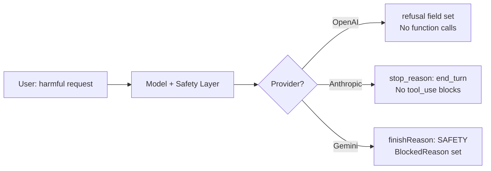

# Safety Refusals

## Introduction

AI models have safety systems that can block function calls when the request involves harmful, dangerous, or policy-violating content. A safety refusal occurs when the model *decides not to call a function* — or when the API itself blocks the request before the model can respond. This is fundamentally different from other error types because the system is working as intended. The model (or safety layer) is protecting users.

Your application must detect safety refusals, distinguish them from other errors, and communicate them to users clearly. Each provider signals refusals differently — OpenAI uses a `refusal` field, Anthropic adjusts its `stop_reason`, and Gemini uses `finishReason: "SAFETY"`. Understanding these signals is essential for building applications that handle sensitive content gracefully.

### What we'll cover

- How each provider signals safety refusals
- Detecting refusals vs. normal function calls
- Communicating refusals to users appropriately
- Designing tools to minimize unnecessary refusals
- Handling edge cases: partial refusals and ambiguous situations

### Prerequisites

- Understanding of [function calling concepts](../01-function-calling-concepts/00-function-calling-concepts.md)
- Familiarity with [execution failures](./03-execution-failures.md)
- Understanding of [AI model safety](../../18-security-privacy-ethics/00-overview.md) concepts

---

## How providers signal safety refusals

Each provider has a different mechanism for communicating that a safety system blocked the request:



| Provider | Signal | Where to check | Additional info |
|----------|--------|----------------|-----------------|
| **OpenAI** | `refusal` field on response | `response.output[0].content[0].refusal` | Contains the refusal reason text |
| **Anthropic** | No `tool_use` blocks in response | `response.stop_reason == "end_turn"` | Model explains refusal in `text` block |
| **Gemini** | `finish_reason` is `SAFETY` | `response.candidates[0].finish_reason` | `safety_ratings` contain category + probability |

---

## Detecting safety refusals — OpenAI

OpenAI's Responses API includes a dedicated `refusal` field when the model refuses a request. This field is separate from the normal response content:

```python
import json
from openai import OpenAI


def detect_openai_refusal(response) -> dict:
    """Detect safety refusal in OpenAI response."""
    result = {
        "refused": False,
        "refusal_reason": None,
        "has_function_calls": False,
        "function_calls": []
    }
    
    for item in response.output:
        # Check for refusal in message content
        if item.type == "message":
            for content in item.content:
                if hasattr(content, 'refusal') and content.refusal:
                    result["refused"] = True
                    result["refusal_reason"] = content.refusal
                    return result
        
        # Track function calls
        if item.type == "function_call":
            result["has_function_calls"] = True
            result["function_calls"].append({
                "name": item.name,
                "arguments": item.arguments,
                "call_id": item.call_id
            })
    
    return result


# Simulated usage (without making real API call)
print("OpenAI refusal detection:")
print("- Check response.output for items with type='message'")
print("- Look for content blocks with a 'refusal' field")
print("- If refusal is present, no function calls will be made")
print("- The refusal text explains why the request was blocked")
```

> **Note:** When using OpenAI's structured outputs with `strict: true`, the model may return a `refusal` instead of the expected JSON structure. Always check for the `refusal` field before attempting to parse function call arguments.

---

## Detecting safety refusals — Anthropic

Anthropic (Claude) handles refusals differently — the model simply responds with text instead of generating `tool_use` blocks. There's no special refusal field; you detect refusals by the *absence* of tool calls:

```python
import anthropic


def detect_anthropic_refusal(response) -> dict:
    """Detect safety refusal in Anthropic response."""
    result = {
        "refused": False,
        "refusal_reason": None,
        "has_function_calls": False,
        "function_calls": []
    }
    
    has_tool_use = False
    text_content = []
    
    for block in response.content:
        if block.type == "tool_use":
            has_tool_use = True
            result["has_function_calls"] = True
            result["function_calls"].append({
                "name": block.name,
                "arguments": block.input,
                "tool_use_id": block.id
            })
        elif block.type == "text":
            text_content.append(block.text)
    
    # Heuristic: If the model was expected to use tools but didn't,
    # and the text contains refusal language, it's a safety refusal
    if not has_tool_use and text_content:
        combined_text = " ".join(text_content).lower()
        refusal_indicators = [
            "i can't", "i cannot", "i'm not able",
            "i won't", "i shouldn't", "i'm unable",
            "not appropriate", "against my guidelines",
            "i don't think i should", "potentially harmful",
            "safety", "ethical"
        ]
        
        if any(indicator in combined_text for indicator in refusal_indicators):
            result["refused"] = True
            result["refusal_reason"] = " ".join(text_content)
    
    return result


# Detection patterns
print("Anthropic refusal detection:")
print("- Check if response.stop_reason == 'end_turn' (no tool calls)")
print("- Look for absence of tool_use blocks when tools were expected")
print("- Examine text content for refusal language patterns")
print("- Claude typically explains WHY it refused in the text response")
```

> **🔑 Key concept:** Anthropic's approach means refusals look like normal text responses. The key signal is `stop_reason: "end_turn"` combined with no `tool_use` blocks in a context where tools were available. The model's text typically explains its reasoning.

---

## Detecting safety refusals — Gemini

Gemini uses a `finish_reason` field with explicit safety-related values. It also provides detailed `safety_ratings` with categories and probabilities:

```python
from google.genai import types


def detect_gemini_refusal(response) -> dict:
    """Detect safety refusal in Gemini response."""
    result = {
        "refused": False,
        "refusal_reason": None,
        "finish_reason": None,
        "safety_ratings": [],
        "has_function_calls": False,
        "function_calls": []
    }
    
    if not response.candidates:
        # No candidates at all — likely blocked at input level
        result["refused"] = True
        result["refusal_reason"] = "Request blocked before processing"
        
        # Check prompt_feedback for block reason
        if hasattr(response, 'prompt_feedback'):
            feedback = response.prompt_feedback
            if hasattr(feedback, 'block_reason'):
                result["refusal_reason"] = (
                    f"Blocked: {feedback.block_reason}"
                )
        return result
    
    candidate = response.candidates[0]
    result["finish_reason"] = str(candidate.finish_reason)
    
    # Check finish_reason for safety blocks
    safety_reasons = {"SAFETY", "BLOCKLIST", "PROHIBITED_CONTENT",
                      "SPII"}  # Sensitive Personally Identifiable Info
    
    if str(candidate.finish_reason) in safety_reasons:
        result["refused"] = True
        result["refusal_reason"] = (
            f"Response blocked due to {candidate.finish_reason}"
        )
    
    # Extract safety ratings
    if hasattr(candidate, 'safety_ratings') and candidate.safety_ratings:
        for rating in candidate.safety_ratings:
            result["safety_ratings"].append({
                "category": str(rating.category),
                "probability": str(rating.probability)
            })
    
    # Check for function calls (if not refused)
    if not result["refused"] and candidate.content and candidate.content.parts:
        for part in candidate.content.parts:
            if hasattr(part, 'function_call') and part.function_call:
                result["has_function_calls"] = True
                result["function_calls"].append({
                    "name": part.function_call.name,
                    "arguments": dict(part.function_call.args)
                })
    
    return result


print("Gemini refusal detection:")
print("- Check candidates[0].finish_reason for 'SAFETY'")
print("- Check prompt_feedback.block_reason for input-level blocks")
print("- Review safety_ratings for category breakdown")
print("- BlockedReason.OTHER indicates non-safety content issues")
```

> **Warning:** Gemini can block at two levels: *input* (the prompt itself is blocked before processing) and *output* (the model's response is blocked after generation). Input blocks produce empty `candidates`, while output blocks set `finish_reason: "SAFETY"` with partial or no content.

---

## Universal refusal handler

A unified handler that works across all three providers:

```python
from dataclasses import dataclass
from enum import Enum, auto


class RefusalType(Enum):
    SAFETY = auto()       # Content safety violation
    POLICY = auto()       # Provider policy violation
    CAPABILITY = auto()   # Model can't perform the task
    AMBIGUOUS = auto()    # Unclear if refusal or normal response


@dataclass
class RefusalResult:
    """Unified refusal detection result."""
    is_refusal: bool
    refusal_type: RefusalType | None = None
    provider: str = ""
    reason: str = ""
    user_message: str = ""
    raw_text: str = ""


class UniversalRefusalDetector:
    """Detect safety refusals across providers."""
    
    def check_openai(self, response) -> RefusalResult:
        """Check OpenAI response for refusals."""
        for item in response.output:
            if item.type == "message":
                for content in item.content:
                    if hasattr(content, 'refusal') and content.refusal:
                        return RefusalResult(
                            is_refusal=True,
                            refusal_type=RefusalType.SAFETY,
                            provider="openai",
                            reason=content.refusal,
                            user_message=self._user_message(content.refusal),
                            raw_text=content.refusal
                        )
        
        return RefusalResult(is_refusal=False, provider="openai")
    
    def check_anthropic(self, response, tools_expected: bool = True) -> RefusalResult:
        """Check Anthropic response for refusals."""
        has_tool_use = any(
            block.type == "tool_use" for block in response.content
        )
        
        if tools_expected and not has_tool_use:
            text = " ".join(
                block.text for block in response.content
                if block.type == "text"
            )
            
            if self._looks_like_refusal(text):
                return RefusalResult(
                    is_refusal=True,
                    refusal_type=RefusalType.SAFETY,
                    provider="anthropic",
                    reason=text,
                    user_message=self._user_message(text),
                    raw_text=text
                )
        
        return RefusalResult(is_refusal=False, provider="anthropic")
    
    def check_gemini(self, response) -> RefusalResult:
        """Check Gemini response for refusals."""
        if not response.candidates:
            reason = "Request blocked before processing"
            if hasattr(response, 'prompt_feedback'):
                if hasattr(response.prompt_feedback, 'block_reason'):
                    reason = f"Blocked: {response.prompt_feedback.block_reason}"
            
            return RefusalResult(
                is_refusal=True,
                refusal_type=RefusalType.SAFETY,
                provider="gemini",
                reason=reason,
                user_message=self._user_message(reason)
            )
        
        finish_reason = str(response.candidates[0].finish_reason)
        if finish_reason in {"SAFETY", "BLOCKLIST", "PROHIBITED_CONTENT"}:
            return RefusalResult(
                is_refusal=True,
                refusal_type=RefusalType.SAFETY,
                provider="gemini",
                reason=f"Blocked due to {finish_reason}",
                user_message=self._user_message(f"content safety ({finish_reason})")
            )
        
        return RefusalResult(is_refusal=False, provider="gemini")
    
    @staticmethod
    def _looks_like_refusal(text: str) -> bool:
        """Heuristic check for refusal language."""
        indicators = [
            "i can't", "i cannot", "i'm not able",
            "i won't", "i shouldn't", "i'm unable",
            "not appropriate", "against my guidelines",
            "potentially harmful", "safety concern"
        ]
        lower = text.lower()
        return any(ind in lower for ind in indicators)
    
    @staticmethod
    def _user_message(reason: str) -> str:
        """Generate a user-friendly refusal message."""
        return (
            "I'm not able to help with that specific request. "
            "This is a safety measure to ensure responsible AI use. "
            "Could you rephrase your request or ask about something else?"
        )


# Usage in an agentic loop
detector = UniversalRefusalDetector()

# Example: handling refusal in the loop
def process_model_response(response, provider: str, tools_expected: bool = True):
    """Process a model response with refusal detection."""
    # Step 1: Check for refusal
    if provider == "openai":
        refusal = detector.check_openai(response)
    elif provider == "anthropic":
        refusal = detector.check_anthropic(response, tools_expected)
    elif provider == "gemini":
        refusal = detector.check_gemini(response)
    else:
        refusal = RefusalResult(is_refusal=False)
    
    if refusal.is_refusal:
        print(f"🛡️ Safety refusal detected ({refusal.provider})")
        print(f"   Reason: {refusal.reason}")
        print(f"   User message: {refusal.user_message}")
        return {"action": "inform_user", "message": refusal.user_message}
    
    # Step 2: Normal processing — extract and execute function calls
    return {"action": "process_function_calls"}


# Simulated refusal detection
print("Universal refusal detection ready.")
print("Checks: OpenAI (refusal field), Anthropic (text heuristics), "
      "Gemini (finish_reason)")
```

---

## Designing tools to minimize unnecessary refusals

Sometimes the model refuses a function call not because the user's intent is harmful, but because the function *description* triggers safety filters. Careful tool design can reduce false-positive refusals:

### Tool naming and descriptions

| ❌ Triggers refusals | ✅ Safer alternative |
|---------------------|---------------------|
| `search_vulnerabilities` | `check_security_status` |
| `inject_code` | `execute_code_snippet` |
| `exploit_weakness` | `test_endpoint_resilience` |
| `scrape_personal_data` | `retrieve_user_profile` |
| `bypass_authentication` | `test_auth_flow` |

### Function description best practices

```python
# ❌ Description that may trigger safety filters
bad_tool = {
    "name": "analyze_target",
    "description": "Analyze a target system for weaknesses and vulnerabilities "
                   "that can be exploited to gain unauthorized access."
}

# ✅ Same functionality, neutral description
good_tool = {
    "name": "security_audit",
    "description": "Perform a security audit on a specified system. "
                   "Returns a report of findings including configuration issues, "
                   "outdated software, and recommended patches."
}
```

### Context matters

The model considers the full conversation context, not just the function definition. Providing professional context can help:

```python
# System prompt that provides professional context
system_prompt = """You are a security audit assistant for a cybersecurity firm.
Users are certified security professionals performing authorized penetration testing
on systems they have permission to test. All activities comply with written 
authorization agreements."""

# This context helps the model understand that security-related
# function calls are part of authorized professional work
```

---

## Handling edge cases

### Partial refusals

Sometimes the model calls *some* functions but refuses others in the same turn:

```python
def handle_partial_refusal(
    response,
    provider: str,
    detector: UniversalRefusalDetector
) -> dict:
    """Handle responses where some function calls succeed but 
    others are refused."""
    function_calls = []
    refusal_text = None
    
    # OpenAI: check each output item
    if provider == "openai":
        for item in response.output:
            if item.type == "function_call":
                function_calls.append({
                    "name": item.name,
                    "arguments": item.arguments,
                    "call_id": item.call_id
                })
            elif item.type == "message":
                for content in item.content:
                    if hasattr(content, 'refusal') and content.refusal:
                        refusal_text = content.refusal
    
    if function_calls and refusal_text:
        # Partial refusal — some calls made, some refused
        return {
            "type": "partial_refusal",
            "approved_calls": function_calls,
            "refusal_reason": refusal_text,
            "action": "execute_approved_and_inform_user"
        }
    elif refusal_text:
        return {"type": "full_refusal", "reason": refusal_text}
    else:
        return {"type": "normal", "function_calls": function_calls}


print("Partial refusal handling:")
print("- Execute the approved function calls normally")
print("- Inform the user about the refused portion")
print("- Don't retry the refused request — the model's decision is intentional")
```

### Distinguishing refusals from normal "no tool needed" responses

Not every response without function calls is a refusal. The model may simply answer directly:

```python
def is_genuine_refusal(response_text: str, tools_were_expected: bool) -> bool:
    """Distinguish a genuine safety refusal from a direct answer."""
    if not tools_were_expected:
        return False  # Model just answered directly — that's fine
    
    # Check for safety-specific language (not just "I don't know")
    safety_language = [
        "safety", "harmful", "dangerous", "inappropriate",
        "policy", "guidelines", "ethical", "responsible"
    ]
    
    general_decline = [
        "i don't have", "i'm not sure", "i don't know",
        "let me think", "that's a good question"
    ]
    
    lower = response_text.lower()
    
    has_safety = any(word in lower for word in safety_language)
    has_general = any(phrase in lower for phrase in general_decline)
    
    # Safety language + explicit inability → refusal
    # General uncertainty → not a refusal
    return has_safety and not has_general
```

---

## Best practices

| Practice | Why it matters |
|----------|----------------|
| Check for refusals before processing function calls | A response with a `refusal` field should never be treated as a function call |
| Use neutral, professional tool names and descriptions | Reduces false-positive refusals from safety filters |
| Provide professional context in system prompts | Helps the model understand authorized use cases |
| Never retry safety refusals automatically | The model's safety decision is intentional — retrying won't change it |
| Inform users clearly but without exposing internal safety logic | "I can't help with that request" — not "Safety filter XYZ blocked this" |
| Log refusals for monitoring | Track patterns — too many refusals may indicate tool description issues |

---

## Common pitfalls

| ❌ Mistake | ✅ Solution |
|-----------|-------------|
| Automatically retrying safety refusals | Safety refusals are intentional — don't retry |
| Treating all "no function call" responses as refusals | Check for safety-specific language; the model may just be answering directly |
| Using aggressive/threatening language in tool descriptions | Use professional, neutral descriptions |
| Exposing raw refusal reasons to users | Provide a friendly message: "I can't help with that" |
| Not checking the Gemini `finish_reason` field | `SAFETY` finish reason means the response was blocked — don't try to parse content |
| Ignoring `prompt_feedback` in Gemini responses | Input-level blocks produce empty candidates — check `prompt_feedback.block_reason` |

---

## Hands-on exercise

### Your task

Build a `SafetyAwareRouter` that detects refusals across all three providers and handles them appropriately.

### Requirements

1. Create a unified `detect_refusal(response, provider)` method
2. Handle three scenarios: full refusal, partial refusal (some tools approved), and no refusal
3. Generate appropriate user messages for each scenario
4. Include logging that tracks refusal patterns (function name, provider, timestamp)
5. Test with simulated responses from each provider

### Expected result

The router correctly detects refusals from all providers, handles partial refusals by executing approved calls, and generates clear user messages.

<details>
<summary>💡 Hints</summary>

- For OpenAI, check the `refusal` attribute on content items
- For Anthropic, check `stop_reason` and look for refusal language in text blocks
- For Gemini, check `finish_reason` and `prompt_feedback.block_reason`
- Store refusal logs as a list of dicts with `timestamp`, `provider`, `function`, `reason`

</details>

<details>
<summary>✅ Solution</summary>

```python
import time
from dataclasses import dataclass, field
from typing import Any


@dataclass
class RefusalLog:
    timestamp: float
    provider: str
    function_names: list[str]
    reason: str


class SafetyAwareRouter:
    def __init__(self):
        self.refusal_logs: list[RefusalLog] = []
    
    def detect_refusal(self, response: dict, provider: str) -> dict:
        """Detect refusal from a simulated response.
        
        Simulated response format:
        {
            "items": [...],  # function calls or messages
            "finish_reason": str,
            "refusal": str | None,
            "safety_ratings": [...]
        }
        """
        if provider == "openai":
            return self._check_openai(response)
        elif provider == "anthropic":
            return self._check_anthropic(response)
        elif provider == "gemini":
            return self._check_gemini(response)
        return {"status": "unknown", "provider": provider}
    
    def _check_openai(self, response: dict) -> dict:
        refusal = response.get("refusal")
        function_calls = [i for i in response.get("items", []) 
                         if i.get("type") == "function_call"]
        
        if refusal and not function_calls:
            self._log("openai", [], refusal)
            return {
                "status": "full_refusal",
                "user_message": self._user_msg(refusal),
                "reason": refusal
            }
        elif refusal and function_calls:
            self._log("openai", 
                      [f["name"] for f in function_calls], refusal)
            return {
                "status": "partial_refusal",
                "approved_calls": function_calls,
                "user_message": (
                    "I was able to help with part of your request, "
                    "but some actions weren't possible."
                )
            }
        return {"status": "ok", "function_calls": function_calls}
    
    def _check_anthropic(self, response: dict) -> dict:
        items = response.get("items", [])
        tool_calls = [i for i in items if i.get("type") == "tool_use"]
        text_items = [i for i in items if i.get("type") == "text"]
        
        if not tool_calls and text_items:
            text = " ".join(t.get("text", "") for t in text_items)
            refusal_words = ["i can't", "i cannot", "not appropriate",
                            "safety", "harmful"]
            if any(w in text.lower() for w in refusal_words):
                self._log("anthropic", [], text)
                return {
                    "status": "full_refusal",
                    "user_message": self._user_msg(text),
                    "reason": text
                }
        
        return {"status": "ok", "function_calls": tool_calls}
    
    def _check_gemini(self, response: dict) -> dict:
        finish = response.get("finish_reason", "")
        
        if finish == "SAFETY":
            reason = response.get("block_reason", "Content safety")
            self._log("gemini", [], reason)
            return {
                "status": "full_refusal",
                "user_message": self._user_msg(reason),
                "safety_ratings": response.get("safety_ratings", [])
            }
        
        function_calls = [i for i in response.get("items", [])
                         if i.get("type") == "function_call"]
        return {"status": "ok", "function_calls": function_calls}
    
    def _log(self, provider: str, functions: list, reason: str):
        self.refusal_logs.append(RefusalLog(
            timestamp=time.time(),
            provider=provider,
            function_names=functions,
            reason=reason[:200]
        ))
    
    @staticmethod
    def _user_msg(reason: str) -> str:
        return (
            "I'm not able to help with that specific request. "
            "Could you rephrase or ask about something else?"
        )


# Test all three providers
router = SafetyAwareRouter()

# OpenAI: full refusal
r1 = router.detect_refusal({
    "refusal": "I cannot assist with creating harmful content.",
    "items": []
}, "openai")
print(f"OpenAI: {r1['status']} — {r1.get('user_message', 'N/A')}")

# Anthropic: refusal via text
r2 = router.detect_refusal({
    "items": [{"type": "text", "text": "I can't help with that request "
               "as it involves potentially harmful activities."}]
}, "anthropic")
print(f"Anthropic: {r2['status']}")

# Gemini: safety block
r3 = router.detect_refusal({
    "finish_reason": "SAFETY",
    "block_reason": "HARM_CATEGORY_DANGEROUS_CONTENT",
    "items": [],
    "safety_ratings": [{"category": "DANGEROUS", "probability": "HIGH"}]
}, "gemini")
print(f"Gemini: {r3['status']}")

# OpenAI: no refusal
r4 = router.detect_refusal({
    "refusal": None,
    "items": [{"type": "function_call", "name": "get_weather", 
               "arguments": {"location": "Paris"}}]
}, "openai")
print(f"Normal: {r4['status']}, calls={len(r4['function_calls'])}")

# Check logs
print(f"\nRefusal logs: {len(router.refusal_logs)} entries")
for log in router.refusal_logs:
    print(f"  [{log.provider}] {log.reason[:60]}...")
```

**Output:**
```
OpenAI: full_refusal — I'm not able to help with that specific request. Could you rephrase or ask about something else?
Anthropic: full_refusal
Gemini: full_refusal
Normal: ok, calls=1

Refusal logs: 3 entries
  [openai] I cannot assist with creating harmful content....
  [anthropic] I can't help with that request as it involves potentially ...
  [gemini] HARM_CATEGORY_DANGEROUS_CONTENT...
```

</details>

### Bonus challenges

- [ ] Add refusal rate monitoring: alert if more than 10% of requests in a window are refused
- [ ] Implement tool description auto-review: check function names/descriptions against a list of flagged keywords

---

## Summary

✅ Safety refusals are intentional — the model or safety layer is working as designed; don't retry them

✅ Each provider signals refusals differently: OpenAI uses a `refusal` field, Anthropic omits `tool_use` blocks, Gemini sets `finishReason: "SAFETY"`

✅ Distinguish genuine safety refusals from normal "no tools needed" responses by checking for safety-specific language

✅ Use neutral, professional tool names and descriptions to minimize false-positive refusals

✅ Provide clear, friendly user messages — don't expose internal safety system details

✅ Log refusals for monitoring — high refusal rates may indicate tool description issues rather than user behavior

**Next:** [Communicating Errors to the Model →](./06-communicating-errors.md) — Formatting error responses that help the model recover

---

[← Previous: Timeout Errors](./04-timeout-errors.md) | [Back to Lesson Overview](./00-error-handling.md)

<!-- 
Sources Consulted:
- OpenAI Function Calling Guide (refusal field): https://platform.openai.com/docs/guides/function-calling
- Anthropic Tool Use Overview (stop_reason behavior): https://platform.claude.com/docs/en/agents-and-tools/tool-use/overview
- Gemini Function Calling (finishReason, safety): https://ai.google.dev/gemini-api/docs/function-calling
- Gemini Troubleshooting (BlockedReason.OTHER, safety issues): https://ai.google.dev/gemini-api/docs/troubleshooting
-->
