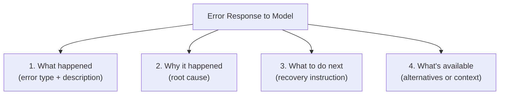

# Communicating Errors to the Model

## Introduction

When a function call fails — for any reason — you must communicate the failure back to the model in a way it can understand and act on. The model can't see your Python tracebacks, server logs, or HTTP status codes directly. It receives a text string (or structured JSON) as the function result. The quality of this error message determines whether the model recovers gracefully or enters a confused loop of retries.

This is the critical bridge between your error handling code and the model's reasoning. A good error message tells the model *what* went wrong, *why* it happened, and *what to do next*. A bad error message — or worse, no message at all — leaves the model guessing.

### What we'll cover

- Structuring error responses for model consumption
- Provider-specific error result formats
- The `is_error` flag (Anthropic) and its effect on model behavior
- Writing instructions that guide the model's next action
- Anti-patterns: error messages that confuse models

### Prerequisites

- Understanding of all error types: [function not found](./01-function-not-found.md), [invalid arguments](./02-invalid-arguments.md), [execution failures](./03-execution-failures.md), [timeouts](./04-timeout-errors.md), [safety refusals](./05-safety-refusal.md)
- Familiarity with [handling function calls](../04-handling-function-calls/00-handling-function-calls.md)

---

## The anatomy of a good error message

An effective error message for a model contains four components:



| Component | Purpose | Example |
|-----------|---------|---------|
| **What** | Name the error clearly | `"error_type": "function_not_found"` |
| **Why** | Explain the cause | `"reason": "The function 'get_wether' does not exist"` |
| **Do next** | Tell the model what action to take | `"instruction": "Try 'get_weather' instead"` |
| **Context** | Provide alternatives or available info | `"alternatives": ["get_weather", "get_forecast"]` |

### Standard error response schema

```python
import json
from typing import Any


def create_error_response(
    error_type: str,
    message: str,
    function_name: str,
    instruction: str,
    details: dict | None = None,
    alternatives: list[str] | None = None,
    is_transient: bool = False,
    partial_result: Any = None
) -> dict:
    """Create a standardized error response for model consumption."""
    response = {
        "error": True,
        "error_type": error_type,
        "function": function_name,
        "message": message,
        "instruction": instruction
    }
    
    if details:
        response["details"] = details
    
    if alternatives:
        response["alternatives"] = alternatives
    
    if is_transient:
        response["is_temporary"] = True
        response["instruction"] += " You may retry this call."
    
    if partial_result is not None:
        response["partial_result"] = partial_result
        response["instruction"] += (
            " Partial data is available in 'partial_result'."
        )
    
    return response


# Example: Different error types produce different messages
errors = [
    create_error_response(
        error_type="function_not_found",
        message="Function 'get_wether' does not exist.",
        function_name="get_wether",
        instruction="Use 'get_weather' instead.",
        alternatives=["get_weather", "get_forecast"]
    ),
    create_error_response(
        error_type="invalid_arguments",
        message="Parameter 'days' must be between 1 and 14.",
        function_name="get_forecast",
        instruction="Retry with 'days' set to 14 or less.",
        details={"field": "days", "received": 30, "max": 14}
    ),
    create_error_response(
        error_type="service_unavailable",
        message="Weather API returned 503 Service Unavailable.",
        function_name="get_weather",
        instruction="Inform the user that the weather service is temporarily down.",
        is_transient=True
    ),
    create_error_response(
        error_type="timeout",
        message="Search timed out after 10 seconds.",
        function_name="search_documents",
        instruction="Present the partial results to the user and offer to search again.",
        partial_result=[{"title": "Python Basics", "id": 1}]
    ),
]

for err in errors:
    print(f"\n{err['error_type'].upper()}:")
    print(json.dumps(err, indent=2))
```

**Output:**
```
FUNCTION_NOT_FOUND:
{
  "error": true,
  "error_type": "function_not_found",
  "function": "get_wether",
  "message": "Function 'get_wether' does not exist.",
  "instruction": "Use 'get_weather' instead.",
  "alternatives": ["get_weather", "get_forecast"]
}

INVALID_ARGUMENTS:
{
  "error": true,
  "error_type": "invalid_arguments",
  "function": "get_forecast",
  "message": "Parameter 'days' must be between 1 and 14.",
  "instruction": "Retry with 'days' set to 14 or less.",
  "details": {"field": "days", "received": 30, "max": 14}
}

SERVICE_UNAVAILABLE:
{
  "error": true,
  "error_type": "service_unavailable",
  "function": "get_weather",
  "message": "Weather API returned 503 Service Unavailable.",
  "instruction": "Inform the user that the weather service is temporarily down. You may retry this call.",
  "is_temporary": true
}

TIMEOUT:
{
  "error": true,
  "error_type": "timeout",
  "function": "search_documents",
  "message": "Search timed out after 10 seconds.",
  "instruction": "Present the partial results to the user and offer to search again. Partial data is available in 'partial_result'.",
  "partial_result": [{"title": "Python Basics", "id": 1}]
}
```

---

## Provider-specific error result formats

Each provider has a different mechanism for sending error results back. Here's the complete pattern for each:

### OpenAI — `function_call_output`

OpenAI uses the `function_call_output` item type. The `output` field is always a string — typically JSON-serialized:

```python
def send_error_openai(error_response: dict, call_id: str) -> dict:
    """Format an error as an OpenAI function_call_output."""
    return {
        "type": "function_call_output",
        "call_id": call_id,  # Must match the original function_call's call_id
        "output": json.dumps(error_response)
    }


# The output goes into the conversation as an input item:
# response = client.responses.create(
#     model="gpt-4o",
#     input=[
#         *previous_input,
#         *response.output,           # Include model's output (with function_call)
#         send_error_openai(error, "call_abc123")  # Error result
#     ]
# )

error = create_error_response(
    error_type="invalid_arguments",
    message="'temperature' must be a number, got string 'warm'.",
    function_name="set_thermostat",
    instruction="Retry with a numeric temperature value (e.g., 72)."
)

openai_result = send_error_openai(error, "call_abc123")
print("OpenAI format:")
print(json.dumps(openai_result, indent=2))
```

**Output:**
```json
{
  "type": "function_call_output",
  "call_id": "call_abc123",
  "output": "{\"error\": true, \"error_type\": \"invalid_arguments\", \"function\": \"set_thermostat\", \"message\": \"'temperature' must be a number, got string 'warm'.\", \"instruction\": \"Retry with a numeric temperature value (e.g., 72).\"}"
}
```

> **Important:** For OpenAI reasoning models (GPT-5, o4-mini), you must also pass back any reasoning items from the model's previous response. The reasoning context is needed for the model to process the error correctly.

### Anthropic — `tool_result` with `is_error: true`

Anthropic has a dedicated `is_error` flag on the `tool_result` block. When set to `true`, Claude knows this is an error and adjusts its behavior:

```python
def send_error_anthropic(
    error_response: dict,
    tool_use_id: str,
    use_is_error: bool = True
) -> dict:
    """Format an error as an Anthropic tool_result."""
    result = {
        "role": "user",
        "content": [
            {
                "type": "tool_result",
                "tool_use_id": tool_use_id,  # Must match tool_use block's id
                "content": json.dumps(error_response)
            }
        ]
    }
    
    if use_is_error:
        result["content"][0]["is_error"] = True
    
    return result


error = create_error_response(
    error_type="execution_failure",
    message="Database connection timed out.",
    function_name="query_database",
    instruction="Inform the user the database is temporarily unavailable.",
    is_transient=True
)

anthropic_result = send_error_anthropic(error, "toolu_xyz789")
print("Anthropic format:")
print(json.dumps(anthropic_result, indent=2))
```

**Output:**
```json
{
  "role": "user",
  "content": [
    {
      "type": "tool_result",
      "tool_use_id": "toolu_xyz789",
      "content": "{\"error\": true, \"error_type\": \"execution_failure\", \"function\": \"query_database\", \"message\": \"Database connection timed out.\", \"instruction\": \"Inform the user the database is temporarily unavailable. You may retry this call.\", \"is_temporary\": true}",
      "is_error": true
    }
  ]
}
```

> **🔑 Key concept:** The `is_error: true` flag on Anthropic's `tool_result` has a meaningful effect on Claude's behavior. It signals that the tool execution failed, causing Claude to:
> 1. Avoid repeating the same call immediately
> 2. Consider alternative approaches
> 3. Potentially explain the issue to the user
> 
> Without `is_error: true`, Claude treats the response as a successful result — even if the content describes an error. Always use the flag for genuine errors.

### Gemini — `functionResponse` with error dict

Gemini receives errors through the `functionResponse` part. There's no special error flag — the error information goes in the response content:

```python
from google.genai import types


def send_error_gemini(
    error_response: dict,
    function_name: str
) -> types.Part:
    """Format an error as a Gemini function response."""
    return types.Part.from_function_response(
        name=function_name,
        response=error_response
    )


# Usage:
# gemini_error = send_error_gemini(error, "get_weather")
# response = client.models.generate_content(
#     model="gemini-2.0-flash",
#     contents=[...previous_content, gemini_error]
# )

print("Gemini format:")
print("- Use types.Part.from_function_response()")
print("- Include error details in the response dict")
print("- No special error flag — Gemini reads the 'error: true' key")
print("- Best practice: also check finishReason for SAFETY blocks")
```

---

## Writing effective recovery instructions

The `instruction` field is the most important part of your error response. It directly guides the model's next action:

### Instruction patterns by error type

| Error type | Bad instruction ❌ | Good instruction ✅ |
|-----------|-------------------|---------------------|
| **Not found** | "Function not found" | "Use 'get_weather' instead of 'get_wether'. Available functions: get_weather, get_forecast" |
| **Invalid args** | "Invalid arguments" | "Retry the call with 'days' set to 14 or less. The 'date' parameter must be in YYYY-MM-DD format" |
| **Timeout** | "Timed out" | "The search timed out. Present the 2 partial results to the user and offer to try a narrower search" |
| **Rate limit** | "Rate limited" | "Inform the user there will be a brief delay. Do not retry for at least 30 seconds" |
| **Service down** | "Service unavailable" | "The weather service is temporarily down. Suggest the user check weather.com directly or try again later" |
| **Data not found** | "Not found" | "No user with ID 999 exists. Ask the user to verify the user ID or search by name instead" |

### Compound instructions

For complex errors, provide a prioritized list of actions:

```python
def create_compound_instruction(
    primary_action: str,
    fallback_action: str,
    user_communication: str
) -> str:
    """Create a multi-step recovery instruction."""
    return (
        f"Primary action: {primary_action}. "
        f"If that fails: {fallback_action}. "
        f"Inform the user: {user_communication}"
    )


# Example
instruction = create_compound_instruction(
    primary_action="Retry 'get_weather' with location='London,UK' (more specific)",
    fallback_action="Use 'get_forecast' which may have cached data",
    user_communication="'I'm having trouble getting live weather data. Let me try an alternative.'"
)

print(f"Compound instruction:\n{instruction}")
```

**Output:**
```
Compound instruction:
Primary action: Retry 'get_weather' with location='London,UK' (more specific). If that fails: Use 'get_forecast' which may have cached data. Inform the user: 'I'm having trouble getting live weather data. Let me try an alternative.'
```

---

## Anti-patterns: error messages that confuse models

### ❌ Anti-pattern 1: Empty or missing error response

```python
# BAD: Returning empty string or null
bad_result = {
    "type": "function_call_output",
    "call_id": "call_123",
    "output": ""  # Model has no idea what happened
}

# GOOD: Always include error details
good_result = {
    "type": "function_call_output",
    "call_id": "call_123",
    "output": json.dumps({
        "error": True,
        "message": "Function execution failed.",
        "instruction": "Try an alternative approach."
    })
}
```

### ❌ Anti-pattern 2: Raw Python tracebacks

```python
# BAD: Model receives a Python traceback
bad_output = """Traceback (most recent call last):
  File "/app/handlers.py", line 42, in get_weather
    response = requests.get(url, timeout=5)
  File "/usr/lib/python3.12/site-packages/requests/api.py", line 73, in get
    return request("GET", url, **kwargs)
requests.exceptions.ConnectionError: HTTPSConnectionPool(host='api.weather.com', port=443): Max retries exceeded"""

# GOOD: Structured, actionable message
good_output = json.dumps({
    "error": True,
    "error_type": "service_unavailable",
    "message": "Could not connect to the weather service.",
    "instruction": "Inform the user that weather data is temporarily unavailable.",
    "is_temporary": True
})
```

### ❌ Anti-pattern 3: Ambiguous success/error

```python
# BAD: Is this an error or a valid result?
ambiguous = json.dumps({
    "status": "failed",
    "data": None,
    "info": "something went wrong"
})

# GOOD: Unambiguous error flag
clear = json.dumps({
    "error": True,  # Clear signal: this is an error
    "error_type": "execution_failure",
    "message": "Database query failed: connection refused.",
    "instruction": "Try again or use cached data."
})
```

### ❌ Anti-pattern 4: Overly technical details

```python
# BAD: Model doesn't need to know about SQL errors
bad_msg = ("sqlalchemy.exc.OperationalError: (psycopg2.OperationalError) "
           "connection to server at '10.0.1.5', port 5432 failed: "
           "Connection refused")

# GOOD: Relevant context only
good_msg = ("The database is currently unavailable. "
            "This is a temporary issue. "
            "Ask the user to try again in a few minutes.")
```

---

## Building a universal error formatter

```python
class ModelErrorFormatter:
    """Format errors consistently across all providers."""
    
    def format(
        self,
        error_type: str,
        message: str,
        function_name: str,
        provider: str,
        call_id: str = "",
        instruction: str = "",
        alternatives: list[str] | None = None,
        is_transient: bool = False,
        partial_result: Any = None
    ) -> dict:
        """Create a provider-formatted error response."""
        # Build the error payload
        error_payload = create_error_response(
            error_type=error_type,
            message=message,
            function_name=function_name,
            instruction=instruction or self._default_instruction(error_type),
            alternatives=alternatives,
            is_transient=is_transient,
            partial_result=partial_result
        )
        
        # Format for specific provider
        if provider == "openai":
            return {
                "type": "function_call_output",
                "call_id": call_id,
                "output": json.dumps(error_payload)
            }
        
        elif provider == "anthropic":
            return {
                "type": "tool_result",
                "tool_use_id": call_id,
                "content": json.dumps(error_payload),
                "is_error": True
            }
        
        elif provider == "gemini":
            return error_payload  # Gemini uses the dict directly
        
        return error_payload
    
    @staticmethod
    def _default_instruction(error_type: str) -> str:
        """Provide a default instruction for common error types."""
        defaults = {
            "function_not_found": (
                "Check the function name and try again. "
                "See 'alternatives' for available functions."
            ),
            "invalid_arguments": (
                "Check the error details and retry with corrected arguments."
            ),
            "execution_failure": (
                "Inform the user that this operation failed. "
                "Try an alternative approach if available."
            ),
            "timeout": (
                "The operation took too long. Try a simpler query "
                "or inform the user about the delay."
            ),
            "rate_limit": (
                "Too many requests. Wait before retrying. "
                "Inform the user about a brief delay."
            ),
            "service_unavailable": (
                "The service is temporarily down. "
                "Inform the user and suggest trying again later."
            ),
        }
        return defaults.get(error_type, "Inform the user about this error.")


# Usage across all providers
formatter = ModelErrorFormatter()

# Same error, three formats
for provider in ["openai", "anthropic", "gemini"]:
    result = formatter.format(
        error_type="execution_failure",
        message="Weather API returned 503.",
        function_name="get_weather",
        provider=provider,
        call_id="call_123",
        is_transient=True
    )
    print(f"\n{provider.upper()}:")
    print(json.dumps(result, indent=2))
```

**Output:**
```
OPENAI:
{
  "type": "function_call_output",
  "call_id": "call_123",
  "output": "{\"error\": true, \"error_type\": \"execution_failure\", \"function\": \"get_weather\", \"message\": \"Weather API returned 503.\", \"instruction\": \"Inform the user that this operation failed. Try an alternative approach if available. You may retry this call.\", \"is_temporary\": true}"
}

ANTHROPIC:
{
  "type": "tool_result",
  "tool_use_id": "call_123",
  "content": "{\"error\": true, \"error_type\": \"execution_failure\", \"function\": \"get_weather\", \"message\": \"Weather API returned 503.\", \"instruction\": \"Inform the user that this operation failed. Try an alternative approach if available. You may retry this call.\", \"is_temporary\": true}",
  "is_error": true
}

GEMINI:
{
  "error": true,
  "error_type": "execution_failure",
  "function": "get_weather",
  "message": "Weather API returned 503.",
  "instruction": "Inform the user that this operation failed. Try an alternative approach if available. You may retry this call.",
  "is_temporary": true
}
```

---

## Best practices

| Practice | Why it matters |
|----------|----------------|
| Always include an `instruction` field | Without it, the model guesses what to do — often incorrectly |
| Use the `is_error: true` flag for Anthropic | Claude changes behavior when it knows the result is an error |
| Keep error messages under 500 characters | Long error messages waste tokens and can confuse the model |
| Use `"error": true` as the first field | Makes the error unambiguous — the model can't mistake it for a valid result |
| Include alternatives when available | Gives the model concrete options instead of vague "try something else" |
| Distinguish transient from permanent errors | The model should retry transient errors but report permanent ones |

---

## Common pitfalls

| ❌ Mistake | ✅ Solution |
|-----------|-------------|
| Returning empty strings as error responses | Always include structured error data with type, message, and instruction |
| Sending Python tracebacks to the model | Format errors as human-readable messages with actionable guidance |
| Not using `is_error: true` on Anthropic `tool_result` | Claude treats non-flagged errors as successful results |
| Vague instructions like "an error occurred" | Be specific: what error, why, and what the model should do next |
| Not distinguishing error types | Use `error_type` to differentiate `function_not_found` from `timeout` from `rate_limit` |
| Including internal system details (IP addresses, file paths) | Only include information relevant to the model's recovery decision |

---

## Hands-on exercise

### Your task

Build a `SmartErrorResponder` that creates tailored error messages for different error types and formats them for all three providers.

### Requirements

1. Define error templates for 5 error types: `function_not_found`, `invalid_arguments`, `execution_failure`, `timeout`, `rate_limit`
2. Each template should include a customizable `message` and a type-specific default `instruction`
3. Implement `respond(error_type, function_name, provider, call_id, **kwargs)` that returns a properly formatted error for the specified provider
4. Test with all 5 error types across all 3 providers (15 combinations)
5. Verify that Anthropic responses include `is_error: true`

### Expected result

All 15 error responses are properly formatted for their respective providers, with clear instructions tailored to each error type.

<details>
<summary>💡 Hints</summary>

- Store templates as a dict mapping error_type → {message_template, default_instruction}
- Use `str.format()` or f-strings for customizable parts of templates
- Test one provider at a time to verify format correctness
- Remember: OpenAI needs `call_id`, Anthropic needs `tool_use_id`, Gemini doesn't need either

</details>

<details>
<summary>✅ Solution</summary>

```python
import json


class SmartErrorResponder:
    TEMPLATES = {
        "function_not_found": {
            "instruction": "Check available functions and retry with a valid name."
        },
        "invalid_arguments": {
            "instruction": "Review the error details and retry with corrected arguments."
        },
        "execution_failure": {
            "instruction": "Inform the user this operation failed. Try an alternative if available."
        },
        "timeout": {
            "instruction": "The operation was too slow. Try a simpler request or inform the user."
        },
        "rate_limit": {
            "instruction": "Too many requests. Wait before retrying. Inform user of a brief delay."
        }
    }
    
    def respond(self, error_type: str, function_name: str, 
                provider: str, call_id: str = "",
                message: str = "", **kwargs) -> dict:
        template = self.TEMPLATES.get(error_type, {})
        instruction = kwargs.get("instruction", template.get("instruction", ""))
        
        payload = {
            "error": True,
            "error_type": error_type,
            "function": function_name,
            "message": message or f"{error_type} error in '{function_name}'",
            "instruction": instruction
        }
        
        # Add optional fields
        for key in ("alternatives", "details", "partial_result"):
            if key in kwargs:
                payload[key] = kwargs[key]
        
        if kwargs.get("is_transient"):
            payload["is_temporary"] = True
        
        # Format for provider
        if provider == "openai":
            return {"type": "function_call_output", "call_id": call_id,
                    "output": json.dumps(payload)}
        elif provider == "anthropic":
            return {"type": "tool_result", "tool_use_id": call_id,
                    "content": json.dumps(payload), "is_error": True}
        else:  # gemini
            return payload
    

responder = SmartErrorResponder()

error_types = [
    ("function_not_found", "get_wether", "Function not found"),
    ("invalid_arguments", "get_forecast", "days must be 1-14"),
    ("execution_failure", "query_db", "Database connection refused"),
    ("timeout", "search_docs", "Timed out after 10s"),
    ("rate_limit", "get_weather", "Rate limit exceeded"),
]

for error_type, func, msg in error_types:
    for provider in ["openai", "anthropic", "gemini"]:
        result = responder.respond(
            error_type, func, provider, 
            call_id="id_123", message=msg
        )
        # Verify Anthropic has is_error
        if provider == "anthropic":
            assert result.get("is_error") == True, "Missing is_error!"
        
        print(f"✅ {error_type} × {provider}: OK")

print(f"\nAll 15 combinations verified!")
```

**Output:**
```
✅ function_not_found × openai: OK
✅ function_not_found × anthropic: OK
✅ function_not_found × gemini: OK
✅ invalid_arguments × openai: OK
✅ invalid_arguments × anthropic: OK
✅ invalid_arguments × gemini: OK
✅ execution_failure × openai: OK
✅ execution_failure × anthropic: OK
✅ execution_failure × gemini: OK
✅ timeout × openai: OK
✅ timeout × anthropic: OK
✅ timeout × gemini: OK
✅ rate_limit × openai: OK
✅ rate_limit × anthropic: OK
✅ rate_limit × gemini: OK

All 15 combinations verified!
```

</details>

### Bonus challenges

- [ ] Add error message compression: if the message exceeds 500 characters, summarize it
- [ ] Implement error response caching: for identical errors, reuse the same response to save tokens

---

## Summary

✅ A good error message has four parts: what happened, why, what to do next, and what alternatives exist

✅ Always include an `instruction` field — it's the most important part of the error response

✅ Use Anthropic's `is_error: true` flag — without it, Claude treats error content as a successful result

✅ Never send raw Python tracebacks — format errors as structured, human-readable messages

✅ Keep error messages under 500 characters to avoid token waste

✅ Use a universal formatter to produce correctly-structured errors for each provider from a single error definition

**Next:** [Recovery Strategies →](./07-recovery-strategies.md) — Implementing retry policies, circuit breakers, and graceful failure modes

---

[← Previous: Safety Refusals](./05-safety-refusal.md) | [Back to Lesson Overview](./00-error-handling.md)

<!-- 
Sources Consulted:
- OpenAI Function Calling Guide (function_call_output format): https://platform.openai.com/docs/guides/function-calling
- Anthropic Tool Use Overview (is_error flag, tool_result format): https://platform.claude.com/docs/en/agents-and-tools/tool-use/overview
- Gemini Function Calling (functionResponse format): https://ai.google.dev/gemini-api/docs/function-calling
- Gemini Best Practices (error handling guidance): https://ai.google.dev/gemini-api/docs/function-calling#best_practices
-->
