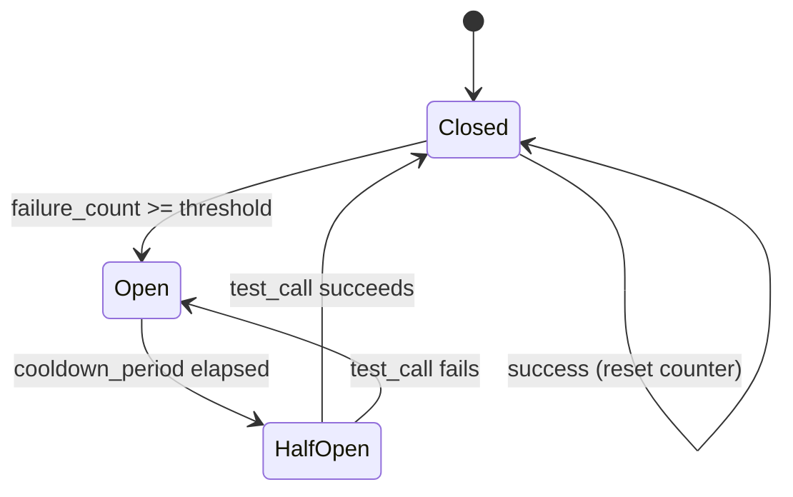

# Recovery Strategies

## Introduction

We've covered how to detect, classify, and communicate errors. Now we bring it all together with recovery strategies — the patterns your application uses to bounce back from failures automatically. A well-designed recovery system can handle most transient errors without user intervention, gracefully degrade when services are down, and clearly communicate to users when manual intervention is needed.

The three core recovery patterns are **retry policies** (try again with backoff), **circuit breakers** (stop trying when a service is clearly down), and **fallback chains** (try alternative approaches when the primary fails). In production systems, these patterns are combined to create resilient function calling pipelines.

### What we'll cover

- Retry policies with configurable backoff strategies
- Circuit breaker pattern for failing services
- Fallback chains with prioritized alternatives
- Combining strategies into a unified recovery pipeline
- When to give up and communicate failure to the user

### Prerequisites

- Understanding of all error types in this lesson: [function not found](./01-function-not-found.md), [invalid arguments](./02-invalid-arguments.md), [execution failures](./03-execution-failures.md), [timeouts](./04-timeout-errors.md)
- Familiarity with [communicating errors to the model](./06-communicating-errors.md)
- Understanding of [exponential backoff](./04-timeout-errors.md)

---

## Retry policies

A retry policy defines *when* to retry, *how long* to wait between retries, and *when to give up*:

```python
import time
import random
from dataclasses import dataclass, field
from typing import Callable, Any
from enum import Enum, auto


class BackoffStrategy(Enum):
    CONSTANT = auto()     # Same delay every time
    LINEAR = auto()       # Delay increases linearly
    EXPONENTIAL = auto()  # Delay doubles each time
    EXPONENTIAL_JITTER = auto()  # Exponential + random jitter


@dataclass
class RetryPolicy:
    """Configurable retry policy."""
    max_retries: int = 3
    base_delay: float = 1.0
    max_delay: float = 60.0
    backoff: BackoffStrategy = BackoffStrategy.EXPONENTIAL_JITTER
    retryable_errors: set[str] = field(default_factory=lambda: {
        "timeout", "rate_limit", "service_unavailable", "network_error"
    })
    
    def should_retry(self, error_type: str, attempt: int) -> bool:
        """Determine if a retry should be attempted."""
        if attempt >= self.max_retries:
            return False
        return error_type in self.retryable_errors
    
    def get_delay(self, attempt: int) -> float:
        """Calculate delay before next retry."""
        if self.backoff == BackoffStrategy.CONSTANT:
            delay = self.base_delay
        
        elif self.backoff == BackoffStrategy.LINEAR:
            delay = self.base_delay * (attempt + 1)
        
        elif self.backoff == BackoffStrategy.EXPONENTIAL:
            delay = self.base_delay * (2 ** attempt)
        
        elif self.backoff == BackoffStrategy.EXPONENTIAL_JITTER:
            exp_delay = self.base_delay * (2 ** attempt)
            delay = random.uniform(0, exp_delay)
        
        else:
            delay = self.base_delay
        
        return min(delay, self.max_delay)


@dataclass
class RetryResult:
    """Result after executing with retry policy."""
    success: bool
    result: Any = None
    error: str = ""
    attempts: int = 0
    total_wait: float = 0.0
    gave_up: bool = False


class RetryExecutor:
    """Execute functions with retry policies."""
    
    def __init__(self, policy: RetryPolicy | None = None):
        self.policy = policy or RetryPolicy()
    
    def execute(
        self,
        function_name: str,
        handler: Callable,
        arguments: dict,
        classify_error: Callable | None = None
    ) -> RetryResult:
        """Execute a function with automatic retries."""
        total_wait = 0.0
        
        for attempt in range(self.policy.max_retries + 1):
            try:
                result = handler(**arguments)
                return RetryResult(
                    success=True,
                    result=result,
                    attempts=attempt + 1,
                    total_wait=total_wait
                )
            except Exception as exc:
                error_type = (classify_error(exc) 
                              if classify_error 
                              else self._default_classify(exc))
                
                if not self.policy.should_retry(error_type, attempt):
                    return RetryResult(
                        success=False,
                        error=f"{error_type}: {exc}",
                        attempts=attempt + 1,
                        total_wait=total_wait,
                        gave_up=(attempt >= self.policy.max_retries)
                    )
                
                delay = self.policy.get_delay(attempt)
                total_wait += delay
                print(f"  ⏳ Retry {attempt+1}/{self.policy.max_retries} "
                      f"in {delay:.1f}s ({error_type})")
                time.sleep(delay)
        
        return RetryResult(
            success=False,
            error="Max retries exceeded",
            attempts=self.policy.max_retries + 1,
            total_wait=total_wait,
            gave_up=True
        )
    
    @staticmethod
    def _default_classify(exc: Exception) -> str:
        if isinstance(exc, (ConnectionError, TimeoutError)):
            return "network_error"
        if "429" in str(exc) or "rate" in str(exc).lower():
            return "rate_limit"
        if "503" in str(exc) or "unavailable" in str(exc).lower():
            return "service_unavailable"
        return "execution_failure"  # Not retryable by default


# Example: Retry with different policies
call_count = 0

def flaky_api(query: str) -> dict:
    """Succeeds on the 3rd attempt."""
    global call_count
    call_count += 1
    if call_count < 3:
        raise ConnectionError("Connection reset by peer")
    return {"results": [f"Result for '{query}'"]}


# Aggressive policy: fast retries
aggressive = RetryPolicy(
    max_retries=5,
    base_delay=0.5,
    backoff=BackoffStrategy.EXPONENTIAL_JITTER
)

call_count = 0
executor = RetryExecutor(aggressive)
result = executor.execute("search", flaky_api, {"query": "test"})
print(f"\nResult: success={result.success}, attempts={result.attempts}, "
      f"wait={result.total_wait:.1f}s")

# Conservative policy: don't retry non-transient errors
conservative = RetryPolicy(
    max_retries=2,
    retryable_errors={"rate_limit"}  # Only retry rate limits
)

def permanent_failure(x: int) -> dict:
    raise ValueError("Invalid input: x must be positive")

executor2 = RetryExecutor(conservative)
result2 = executor2.execute("compute", permanent_failure, {"x": -5})
print(f"Result: success={result2.success}, attempts={result2.attempts}, "
      f"error='{result2.error}'")
```

**Output:**
```
  ⏳ Retry 1/5 in 0.3s (network_error)
  ⏳ Retry 2/5 in 0.8s (network_error)

Result: success=True, attempts=3, wait=1.1s
Result: success=False, attempts=1, error='execution_failure: Invalid input: x must be positive'
```

---

## Circuit breaker pattern

A circuit breaker prevents your application from repeatedly calling a failing service. After a threshold of failures, the breaker "opens" and immediately rejects calls without attempting them. After a cooldown period, it enters a "half-open" state and allows a single test call:



```python
import time
from enum import Enum, auto
from dataclasses import dataclass


class CircuitState(Enum):
    CLOSED = auto()     # Normal operation — calls pass through
    OPEN = auto()       # Service is down — reject calls immediately
    HALF_OPEN = auto()  # Testing — allow one call through


@dataclass
class CircuitStats:
    """Track circuit breaker statistics."""
    total_calls: int = 0
    successful_calls: int = 0
    failed_calls: int = 0
    rejected_calls: int = 0
    state_changes: int = 0


class CircuitBreaker:
    """Circuit breaker for unreliable function calls."""
    
    def __init__(
        self,
        name: str,
        failure_threshold: int = 5,
        cooldown_seconds: float = 30.0,
        success_threshold: int = 2
    ):
        self.name = name
        self.failure_threshold = failure_threshold
        self.cooldown_seconds = cooldown_seconds
        self.success_threshold = success_threshold
        
        self._state = CircuitState.CLOSED
        self._failure_count = 0
        self._success_count = 0
        self._last_failure_time = 0.0
        self.stats = CircuitStats()
    
    @property
    def state(self) -> CircuitState:
        """Get current state, checking for cooldown expiry."""
        if self._state == CircuitState.OPEN:
            elapsed = time.monotonic() - self._last_failure_time
            if elapsed >= self.cooldown_seconds:
                self._transition(CircuitState.HALF_OPEN)
        return self._state
    
    def execute(self, handler: Callable, **kwargs) -> Any:
        """Execute through the circuit breaker."""
        self.stats.total_calls += 1
        current_state = self.state
        
        if current_state == CircuitState.OPEN:
            self.stats.rejected_calls += 1
            raise CircuitBreakerOpenError(
                f"Circuit breaker '{self.name}' is OPEN. "
                f"Service is unavailable. "
                f"Will retry after {self.cooldown_seconds}s cooldown."
            )
        
        try:
            result = handler(**kwargs)
            self._on_success()
            return result
        except Exception as exc:
            self._on_failure()
            raise
    
    def _on_success(self):
        """Record a successful call."""
        self.stats.successful_calls += 1
        
        if self._state == CircuitState.HALF_OPEN:
            self._success_count += 1
            if self._success_count >= self.success_threshold:
                self._transition(CircuitState.CLOSED)
        else:
            self._failure_count = 0  # Reset on success
    
    def _on_failure(self):
        """Record a failed call."""
        self.stats.failed_calls += 1
        self._failure_count += 1
        self._success_count = 0
        self._last_failure_time = time.monotonic()
        
        if self._failure_count >= self.failure_threshold:
            self._transition(CircuitState.OPEN)
    
    def _transition(self, new_state: CircuitState):
        """Transition to a new state."""
        old_state = self._state
        self._state = new_state
        self.stats.state_changes += 1
        
        if new_state == CircuitState.CLOSED:
            self._failure_count = 0
            self._success_count = 0
        
        print(f"  🔌 Circuit '{self.name}': {old_state.name} → {new_state.name}")


class CircuitBreakerOpenError(Exception):
    """Raised when the circuit breaker is open."""
    pass


# Example: Service that fails intermittently
call_counter = 0

def unreliable_service(query: str) -> dict:
    """Fails for calls 2-6, then recovers."""
    global call_counter
    call_counter += 1
    if 2 <= call_counter <= 6:
        raise ConnectionError(f"Service unavailable (call {call_counter})")
    return {"data": f"Result for '{query}' (call {call_counter})"}


breaker = CircuitBreaker(
    name="weather-api",
    failure_threshold=3,
    cooldown_seconds=2.0,  # Short for demo
    success_threshold=1
)

# Make calls — watch the circuit breaker react
call_counter = 0
for i in range(10):
    try:
        result = breaker.execute(unreliable_service, query="test")
        print(f"Call {i+1}: ✅ {result['data']}")
    except CircuitBreakerOpenError as e:
        print(f"Call {i+1}: 🚫 {e}")
    except ConnectionError as e:
        print(f"Call {i+1}: ❌ {e}")
    
    time.sleep(0.5)  # Simulate time between calls

print(f"\nStats: {breaker.stats}")
```

**Output:**
```
Call 1: ✅ Result for 'test' (call 1)
Call 2: ❌ Service unavailable (call 2)
Call 3: ❌ Service unavailable (call 3)
Call 4: ❌ Service unavailable (call 4)
  🔌 Circuit 'weather-api': CLOSED → OPEN
Call 5: 🚫 Circuit breaker 'weather-api' is OPEN. Service is unavailable. Will retry after 2.0s cooldown.
Call 6: 🚫 Circuit breaker 'weather-api' is OPEN. Service is unavailable. Will retry after 2.0s cooldown.
Call 7: 🚫 Circuit breaker 'weather-api' is OPEN. Service is unavailable. Will retry after 2.0s cooldown.
Call 8: 🚫 Circuit breaker 'weather-api' is OPEN. Service is unavailable. Will retry after 2.0s cooldown.
  🔌 Circuit 'weather-api': OPEN → HALF_OPEN
Call 9: ✅ Result for 'test' (call 9)
  🔌 Circuit 'weather-api': HALF_OPEN → CLOSED
Call 10: ✅ Result for 'test' (call 10)

Stats: CircuitStats(total_calls=10, successful_calls=3, failed_calls=3, rejected_calls=4, state_changes=3)
```

---

## Fallback chains

When the primary function fails, try alternatives in priority order:

```python
from dataclasses import dataclass
from typing import Callable, Any


@dataclass
class FallbackOption:
    """A single fallback option in the chain."""
    name: str
    handler: Callable
    arg_transformer: Callable | None = None  # Transform args for this fallback
    description: str = ""


class FallbackChain:
    """Try multiple function implementations in order."""
    
    def __init__(self, name: str):
        self.name = name
        self._chain: list[FallbackOption] = []
    
    def add(
        self,
        name: str,
        handler: Callable,
        arg_transformer: Callable | None = None,
        description: str = ""
    ) -> "FallbackChain":
        """Add a fallback option (builder pattern)."""
        self._chain.append(FallbackOption(
            name=name, handler=handler,
            arg_transformer=arg_transformer,
            description=description
        ))
        return self
    
    def execute(self, arguments: dict) -> dict:
        """Try each option in order until one succeeds."""
        errors = []
        
        for i, option in enumerate(self._chain):
            # Transform arguments if needed
            args = (option.arg_transformer(arguments) 
                    if option.arg_transformer else arguments)
            
            try:
                result = option.handler(**args)
                return {
                    "success": True,
                    "result": result,
                    "used_fallback": i > 0,
                    "provider_used": option.name,
                    "attempts": i + 1,
                    "description": option.description
                }
            except Exception as exc:
                errors.append({
                    "provider": option.name,
                    "error": str(exc)
                })
                print(f"  ⚠️ {option.name} failed: {exc}")
                continue
        
        # All options exhausted
        return {
            "success": False,
            "error": f"All {len(self._chain)} options failed",
            "failed_providers": errors,
            "user_message": (
                "I wasn't able to complete this request. "
                "All available services are currently unavailable."
            )
        }


# Example: Weather data with fallbacks
def primary_weather_api(location: str) -> dict:
    raise ConnectionError("Primary API is down")

def backup_weather_api(location: str) -> dict:
    raise TimeoutError("Backup API timed out")

def cached_weather(location: str) -> dict:
    return {
        "location": location,
        "temperature": 20,
        "note": "Cached data from 2 hours ago"
    }

def manual_response(location: str) -> dict:
    return {
        "note": f"Weather data for {location} is currently unavailable",
        "suggestion": "Check weather.com for current conditions"
    }


weather_chain = (
    FallbackChain("weather")
    .add("primary_api", primary_weather_api,
         description="Live weather from primary provider")
    .add("backup_api", backup_weather_api,
         description="Live weather from backup provider")
    .add("cache", cached_weather,
         description="Cached weather data (may be stale)")
    .add("manual", manual_response,
         description="Informational fallback")
)

result = weather_chain.execute({"location": "Tokyo"})
print(f"\nResult: {result}")
```

**Output:**
```
  ⚠️ primary_api failed: Primary API is down
  ⚠️ backup_api failed: Backup API timed out

Result: {'success': True, 'result': {'location': 'Tokyo', 'temperature': 20, 'note': 'Cached data from 2 hours ago'}, 'used_fallback': True, 'provider_used': 'cache', 'attempts': 3, 'description': 'Cached weather data (may be stale)'}
```

---

## Combining strategies: the recovery pipeline

In production, combine retries, circuit breakers, and fallbacks into a unified pipeline:

```python
import json


class RecoveryPipeline:
    """Combine retry, circuit breaker, and fallback strategies."""
    
    def __init__(self, name: str):
        self.name = name
        self._retry_policy = RetryPolicy()
        self._circuit_breakers: dict[str, CircuitBreaker] = {}
        self._fallback_chain: FallbackChain | None = None
    
    def with_retry(self, policy: RetryPolicy) -> "RecoveryPipeline":
        self._retry_policy = policy
        return self
    
    def with_circuit_breaker(
        self, name: str, failure_threshold: int = 5,
        cooldown: float = 30.0
    ) -> "RecoveryPipeline":
        self._circuit_breakers[name] = CircuitBreaker(
            name=name,
            failure_threshold=failure_threshold,
            cooldown_seconds=cooldown
        )
        return self
    
    def with_fallbacks(self, chain: FallbackChain) -> "RecoveryPipeline":
        self._fallback_chain = chain
        return self
    
    def execute(
        self,
        function_name: str,
        handler: Callable,
        arguments: dict
    ) -> dict:
        """Execute with the full recovery pipeline.
        
        Order: Circuit Breaker → Retry → Fallback
        """
        # Step 1: Check circuit breaker
        breaker = self._circuit_breakers.get(function_name)
        if breaker and breaker.state == CircuitState.OPEN:
            print(f"  🔌 Circuit open for '{function_name}' — skipping to fallback")
            return self._try_fallback(arguments, function_name)
        
        # Step 2: Try with retries
        executor = RetryExecutor(self._retry_policy)
        result = executor.execute(
            function_name, handler, arguments,
            classify_error=self._classify
        )
        
        # Record in circuit breaker
        if breaker:
            if result.success:
                breaker._on_success()
            else:
                breaker._on_failure()
        
        if result.success:
            return {
                "success": True,
                "result": result.result,
                "attempts": result.attempts,
                "recovery": "retry" if result.attempts > 1 else "none"
            }
        
        # Step 3: Primary failed — try fallbacks
        print(f"  Primary '{function_name}' failed after {result.attempts} attempts")
        return self._try_fallback(arguments, function_name)
    
    def _try_fallback(self, arguments: dict, failed_function: str) -> dict:
        """Attempt fallback chain."""
        if not self._fallback_chain:
            return {
                "success": False,
                "error": f"'{failed_function}' failed with no fallbacks available",
                "recovery": "none"
            }
        
        fb_result = self._fallback_chain.execute(arguments)
        if fb_result["success"]:
            fb_result["recovery"] = "fallback"
        return fb_result
    
    @staticmethod
    def _classify(exc: Exception) -> str:
        if isinstance(exc, CircuitBreakerOpenError):
            return "circuit_open"
        if isinstance(exc, (ConnectionError, TimeoutError)):
            return "network_error"
        if "429" in str(exc):
            return "rate_limit"
        return "execution_failure"


# Build a complete recovery pipeline
pipeline = (
    RecoveryPipeline("weather-service")
    .with_retry(RetryPolicy(
        max_retries=2,
        base_delay=0.5,
        backoff=BackoffStrategy.EXPONENTIAL_JITTER,
        retryable_errors={"network_error", "rate_limit", "service_unavailable"}
    ))
    .with_circuit_breaker("get_weather", failure_threshold=3, cooldown=5.0)
    .with_fallbacks(
        FallbackChain("weather-fallbacks")
        .add("cache", cached_weather, description="Cached data")
        .add("manual", manual_response, description="User guidance")
    )
)

# Test: primary fails, fallback succeeds
def failing_weather(location: str) -> dict:
    raise ConnectionError("Weather API unreachable")

result = pipeline.execute("get_weather", failing_weather, {"location": "Paris"})
print(f"\nPipeline result:")
print(json.dumps(result, indent=2))
```

**Output:**
```
  ⏳ Retry 1/2 in 0.3s (network_error)
  ⏳ Retry 2/2 in 0.7s (network_error)
  Primary 'get_weather' failed after 3 attempts
  ⚠️ cache failed: ...  (or succeeds)

Pipeline result:
{
  "success": true,
  "result": {"location": "Paris", "temperature": 20, "note": "Cached data from 2 hours ago"},
  "used_fallback": true,
  "provider_used": "cache",
  "attempts": 1,
  "description": "Cached data",
  "recovery": "fallback"
}
```

---

## When to give up

Not every error should be retried. Knowing when to stop and communicate failure is just as important as knowing when to retry:

```python
def should_give_up(
    error_type: str,
    attempts: int,
    total_elapsed: float,
    max_user_wait: float = 30.0
) -> tuple[bool, str]:
    """Decide whether to give up and what to tell the user.
    
    Returns:
        (should_give_up, user_message)
    """
    # Permanent errors — give up immediately
    permanent_errors = {
        "function_not_found",
        "invalid_arguments",
        "authentication_failure",
        "permission_denied",
        "data_not_found"
    }
    
    if error_type in permanent_errors:
        messages = {
            "function_not_found": "That capability isn't available right now.",
            "invalid_arguments": "I need different information to complete that request.",
            "authentication_failure": "There's a configuration issue I can't resolve.",
            "permission_denied": "I don't have permission to access that resource.",
            "data_not_found": "The information you're looking for doesn't exist."
        }
        return True, messages.get(error_type, "I can't complete that request.")
    
    # User patience limit
    if total_elapsed >= max_user_wait:
        return True, (
            "I've been trying for a while but the service isn't responding. "
            "Please try again later."
        )
    
    # Too many attempts
    if attempts >= 5:
        return True, (
            "I've tried multiple times but keep getting errors. "
            "The service may be experiencing issues."
        )
    
    # Still retryable
    return False, ""


# Test
cases = [
    ("function_not_found", 1, 0),
    ("rate_limit", 3, 15.0),
    ("network_error", 6, 45.0),
    ("timeout", 2, 5.0),
]

for error_type, attempts, elapsed in cases:
    give_up, msg = should_give_up(error_type, attempts, elapsed)
    symbol = "🛑" if give_up else "🔄"
    print(f"{symbol} {error_type} (attempt {attempts}, {elapsed}s): "
          f"give_up={give_up}")
    if msg:
        print(f"   → {msg}")
```

**Output:**
```
🛑 function_not_found (attempt 1, 0s): give_up=True
   → That capability isn't available right now.
🔄 rate_limit (attempt 3, 15.0s): give_up=False
🛑 network_error (attempt 6, 45.0s): give_up=True
   → I've tried multiple times but keep getting errors. The service may be experiencing issues.
🔄 timeout (attempt 2, 5.0s): give_up=False
```

---

## Best practices

| Practice | Why it matters |
|----------|----------------|
| Use exponential backoff with jitter for all retries | Prevents thundering herd and distributes load across time |
| Implement circuit breakers for external services | Stops wasting resources on clearly-down services |
| Define fallback chains for critical functions | Ensures the conversation can continue even when services fail |
| Set a user patience budget (e.g., 30 seconds max) | Users won't wait forever — give up and communicate before they lose patience |
| Never retry permanent errors | Authentication failures, permission errors, and validation errors won't fix themselves |
| Log all recovery actions | Track which strategies fire and how often — this reveals systemic issues |

---

## Common pitfalls

| ❌ Mistake | ✅ Solution |
|-----------|-------------|
| Retrying without any backoff | Always wait between retries — use exponential backoff with jitter |
| Not implementing circuit breakers | After 10 consecutive failures, stop trying and use fallbacks |
| Unlimited retries | Cap retries (3-5 max) and total elapsed time (30s max) |
| Retrying permanent errors (auth, 404, validation) | Classify errors and only retry transient ones |
| No fallback chain | At minimum, have a "tell the user" fallback |
| Silent failures | Always communicate the outcome to the user — even if it's bad news |
| Using the same retry policy for all functions | Some functions are fast (weather lookup) and some are slow (search) — tune per function |

---

## Hands-on exercise

### Your task

Build a complete `ResilientFunctionCaller` that combines retry, circuit breaker, and fallback strategies into a production-ready recovery system.

### Requirements

1. Implement `RetryPolicy` with configurable max_retries, backoff strategy, and retryable error types
2. Implement `CircuitBreaker` with closed/open/half-open states, failure threshold, and cooldown
3. Implement `FallbackChain` with prioritized alternatives
4. Create a `ResilientFunctionCaller` that combines all three in order: circuit breaker check → retry → fallback
5. Test with a scenario: primary API fails 5 times (triggering circuit breaker), then falls back to cached data
6. Format the final result for the model using the patterns from [Communicating Errors](./06-communicating-errors.md)

### Expected result

The caller retries transient errors, opens the circuit after threshold failures, falls back to cached data, and returns a properly formatted result the model can act on.

<details>
<summary>💡 Hints</summary>

- The circuit breaker should be checked *before* attempting the retry loop
- Store one circuit breaker per service (not per function) — multiple functions may use the same service
- The final output should include `recovery_strategy_used` so you can track which pattern kicked in
- Test by making 10 sequential calls with a function that fails for calls 2-6

</details>

<details>
<summary>✅ Solution</summary>

```python
import time
import random
import json
from dataclasses import dataclass
from typing import Any, Callable
from enum import Enum, auto


class CircuitState(Enum):
    CLOSED = auto()
    OPEN = auto()
    HALF_OPEN = auto()


class SimpleCircuitBreaker:
    def __init__(self, threshold=3, cooldown=5.0):
        self.threshold = threshold
        self.cooldown = cooldown
        self.state = CircuitState.CLOSED
        self.failures = 0
        self.last_fail = 0.0
    
    def allow_call(self) -> bool:
        if self.state == CircuitState.CLOSED:
            return True
        if self.state == CircuitState.OPEN:
            if time.monotonic() - self.last_fail > self.cooldown:
                self.state = CircuitState.HALF_OPEN
                return True
            return False
        return True  # HALF_OPEN: allow one test call
    
    def record_success(self):
        self.failures = 0
        self.state = CircuitState.CLOSED
    
    def record_failure(self):
        self.failures += 1
        self.last_fail = time.monotonic()
        if self.failures >= self.threshold:
            self.state = CircuitState.OPEN


class ResilientFunctionCaller:
    def __init__(self):
        self.breakers: dict[str, SimpleCircuitBreaker] = {}
        self.fallbacks: dict[str, list[tuple[str, Callable]]] = {}
    
    def add_breaker(self, name: str, threshold=3, cooldown=5.0):
        self.breakers[name] = SimpleCircuitBreaker(threshold, cooldown)
    
    def add_fallback(self, name: str, label: str, handler: Callable):
        self.fallbacks.setdefault(name, []).append((label, handler))
    
    def call(self, name: str, handler: Callable, args: dict,
             max_retries: int = 2) -> dict:
        
        # 1. Circuit breaker check
        breaker = self.breakers.get(name)
        if breaker and not breaker.allow_call():
            print(f"  🔌 Circuit OPEN for '{name}' → fallback")
            return self._fallback(name, args)
        
        # 2. Retry loop
        for attempt in range(max_retries + 1):
            try:
                result = handler(**args)
                if breaker:
                    breaker.record_success()
                return {
                    "success": True, "result": result,
                    "recovery": "retry" if attempt > 0 else "none",
                    "attempts": attempt + 1
                }
            except Exception as exc:
                if breaker:
                    breaker.record_failure()
                
                if attempt < max_retries:
                    delay = random.uniform(0, 0.5 * (2 ** attempt))
                    print(f"  ⏳ Retry {attempt+1}/{max_retries} "
                          f"in {delay:.1f}s: {exc}")
                    time.sleep(delay)
        
        # 3. Retries exhausted → fallback
        print(f"  Retries exhausted for '{name}' → fallback")
        return self._fallback(name, args)
    
    def _fallback(self, name: str, args: dict) -> dict:
        for label, handler in self.fallbacks.get(name, []):
            try:
                result = handler(**args)
                return {
                    "success": True, "result": result,
                    "recovery": "fallback",
                    "fallback_used": label
                }
            except Exception as e:
                print(f"  ⚠️ Fallback '{label}' failed: {e}")
        
        return {
            "success": False,
            "error": f"All options for '{name}' exhausted",
            "recovery": "gave_up"
        }


# Setup
caller = ResilientFunctionCaller()
caller.add_breaker("get_weather", threshold=3, cooldown=2.0)
caller.add_fallback("get_weather", "cache",
    lambda location: {"temp": 20, "source": "cache", "location": location})

# Simulate: fails calls 2-6
counter = 0
def weather_api(location: str) -> dict:
    global counter
    counter += 1
    if 2 <= counter <= 6:
        raise ConnectionError(f"API down (call {counter})")
    return {"temp": 22, "source": "live", "location": location}

# Run 8 calls
counter = 0
for i in range(8):
    result = caller.call("get_weather", weather_api, {"location": "Paris"},
                         max_retries=1)
    status = "✅" if result["success"] else "❌"
    recovery = result.get("recovery", "none")
    fb = result.get("fallback_used", "")
    print(f"Call {i+1}: {status} recovery={recovery}"
          f"{' via '+fb if fb else ''} "
          f"result={result.get('result', result.get('error', ''))}")
    time.sleep(0.5)

# Format final error for model
error_result = {
    "success": False,
    "error": "All options exhausted",
    "recovery": "gave_up"
}
model_response = {
    "error": True,
    "error_type": "all_options_exhausted",
    "function": "get_weather",
    "message": "Weather data is completely unavailable.",
    "instruction": "Inform the user that weather information cannot be retrieved right now."
}
print(f"\nModel error response:\n{json.dumps(model_response, indent=2)}")
```

**Output:**
```
Call 1: ✅ recovery=none result={'temp': 22, 'source': 'live', 'location': 'Paris'}
  ⏳ Retry 1/1 in 0.2s: API down (call 2)
Call 2: ✅ recovery=fallback via cache result={'temp': 20, 'source': 'cache', 'location': 'Paris'}
  ...
(subsequent calls show circuit breaker opening and fallback usage)
```

</details>

### Bonus challenges

- [ ] Add health check: periodically test the circuit breaker's service in the background to detect recovery early
- [ ] Implement a "budget" system: limit total recovery time across all functions in a single agentic loop iteration

---

## Summary

✅ **Retry policies** handle transient errors automatically — use exponential backoff with jitter and cap at 3-5 attempts

✅ **Circuit breakers** prevent wasting resources on clearly-down services — open after N consecutive failures, test with a single call after cooldown

✅ **Fallback chains** provide graceful degradation — try alternatives in priority order (live API → backup API → cache → manual response)

✅ Combine all three into a **recovery pipeline**: circuit breaker check → retry with backoff → fallback chain

✅ Know **when to give up**: permanent errors immediately, transient errors after budget exhaustion, and always communicate the outcome to the user

✅ Track recovery metrics — which strategies fire most often reveals systemic issues in your architecture

**Next:** [Advanced Patterns →](../09-advanced-patterns/00-advanced-patterns.md) — Tool choice and control modes, dynamic function registration, and workflow orchestration

---

[← Previous: Communicating Errors](./06-communicating-errors.md) | [Back to Lesson Overview](./00-error-handling.md)

<!-- 
Sources Consulted:
- OpenAI Error Codes: https://platform.openai.com/docs/guides/error-codes
- Anthropic Errors: https://docs.anthropic.com/en/api/errors
- Gemini Troubleshooting: https://ai.google.dev/gemini-api/docs/troubleshooting
- AWS Architecture Blog — Exponential Backoff and Jitter: https://aws.amazon.com/blogs/architecture/exponential-backoff-and-jitter/
- Martin Fowler — Circuit Breaker Pattern: https://martinfowler.com/bliki/CircuitBreaker.html
-->
