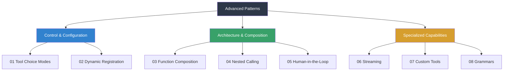

# Advanced Patterns

## Overview

The previous lessons in this unit covered the core mechanics of function calling — defining tools, executing them, handling results, and managing errors. Now we move beyond the basics into **advanced patterns** that give you precise control over how, when, and whether the model invokes tools.

These patterns are what separate prototype-level integrations from production-grade systems. Tool choice modes let you dictate model behavior. Dynamic registration lets you adapt tool sets at runtime. Function composition lets you build complex workflows from simple building blocks. And streaming lets you surface tool call progress in real time.

## What we'll cover

This lesson explores eight advanced patterns across all three major providers:

| # | Topic | What You'll Learn |
|---|-------|-------------------|
| 01 | [Tool Choice & Control](./01-tool-choice-control.md) | Force, restrict, or disable tool calls with `auto`, `required`, `none`, forced function, `allowed_tools`, and `validated` modes |
| 02 | [Dynamic Registration](./02-dynamic-registration.md) | Add/remove tools at runtime based on context, user permissions, and conversation state |
| 03 | [Function Composition](./03-function-composition.md) | Combine simple tools into macros, workflows, and abstraction layers |
| 04 | [Nested Function Calling](./04-nested-function-calling.md) | Handle functions that trigger other functions, with depth limits and cycle prevention |
| 05 | [Human-in-the-Loop](./05-human-in-the-loop.md) | Implement confirmation workflows, approval gates, and preview-before-execute patterns |
| 06 | [Function Call Streaming](./06-function-call-streaming.md) | Stream tool call arguments as they generate, with delta events and progressive UI |
| 07 | [Custom Tools](./07-custom-tools.md) | Build OpenAI custom tools with plain text input instead of JSON schemas |
| 08 | [Context-Free Grammars](./08-context-free-grammars.md) | Constrain model output with Lark and regex grammars via LLGuidance |

## Prerequisites

Before starting this lesson, you should have completed:

- [Lesson 01: Function Calling Concepts](../01-function-calling-concepts/00-function-calling-concepts.md) — Core mental model
- [Lesson 02: Defining Functions](../02-defining-functions/00-defining-functions.md) — Schema structure
- [Lesson 04: Executing Functions](../04-executing-functions/00-executing-functions.md) — Dispatch and results
- [Lesson 07: Multi-Turn Function Calling](../07-multi-turn-function-calling/00-multi-turn-function-calling.md) — Conversation loops
- [Lesson 08: Error Handling](../08-error-handling/00-error-handling.md) — Error taxonomy and recovery

## Patterns taxonomy

The eight topics in this lesson fall into three categories:

**Control & Configuration** — How you tell the model what it can and cannot do with tools. These patterns affect every request.

**Architecture & Composition** — How you structure complex tool interactions. These patterns shape your overall system design.

**Specialized Capabilities** — Provider-specific features that unlock new use cases. Streaming improves UX; custom tools and grammars expand what tools can express.

## Provider coverage

| Pattern | OpenAI | Anthropic | Gemini |
|---------|--------|-----------|--------|
| Tool choice modes | `auto`, `required`, forced, `none`, `allowed_tools` | `auto`, `any`, `tool` (specific), `none` | `AUTO`, `ANY`, `NONE`, `VALIDATED` |
| Dynamic registration | ✅ Per-request `tools` | ✅ Per-request `tools` | ✅ Per-request `tools` |
| Function composition | ✅ Multi-step loops | ✅ Sequential tools | ✅ Compositional calling |
| Nested calling | ✅ Manual recursion | ✅ Manual recursion | ✅ Manual recursion |
| Human-in-the-loop | ✅ Application-level | ✅ Application-level | ✅ Application-level |
| Function call streaming | ✅ `response.function_call_arguments.delta` | ✅ `input_json_delta` | ✅ SDK streaming |
| Custom tools | ✅ `type: "custom"` | ❌ Not supported | ❌ Not supported |
| Context-free grammars | ✅ Lark + Regex CFG | ❌ Not supported | ❌ Not supported |

> **🤖 AI Context:** Custom tools and context-free grammars are currently OpenAI-exclusive features. The other six patterns work across all providers, though the API syntax differs.

---

**Next:** [Tool Choice & Control →](./01-tool-choice-control.md)

---

[← Previous Lesson: Error Handling](../08-error-handling/00-error-handling.md) | [Unit Overview](../00-overview.md)
