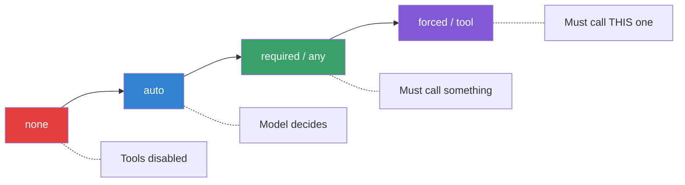

# Tool Choice & Control Modes

## Introduction

By default, the model decides whether to call a tool. But in production systems, you often need tighter control — force the model to always use a tool, prevent it from calling tools entirely, or restrict which tools it can pick from. Every major provider offers **tool choice modes** that give you this control.

Mastering tool choice modes is the difference between hoping the model does the right thing and *guaranteeing* it does.

### What we'll cover

- The `auto` mode and when it's the right default
- Forcing tool calls with `required` / `any`
- Targeting a specific function by name
- Disabling tools with `none`
- Restricting to a subset with `allowed_tools` and `allowed_function_names`
- The `validated` mode (Gemini preview)
- Controlling parallel tool calls

### Prerequisites

- [Lesson 01: Function Calling Concepts](../01-function-calling-concepts/00-function-calling-concepts.md)
- [Lesson 02: Defining Functions](../02-defining-functions/00-defining-functions.md)
- Familiarity with the Responses API (OpenAI), Messages API (Anthropic), and Gemini SDK

---

## The tool choice spectrum

Tool choice modes sit on a spectrum from "model decides everything" to "you dictate exactly what happens":



Every provider supports this spectrum, but the syntax differs. We will cover each mode with side-by-side examples.

---

## Auto mode (default)

In `auto` mode, the model decides whether to call zero, one, or multiple tools based on the conversation context. This is the default behavior when you provide tools but don't specify `tool_choice`.

### OpenAI (Responses API)

```python
from openai import OpenAI

client = OpenAI()

response = client.responses.create(
    model="gpt-4.1",
    input=[{"role": "user", "content": "What's the weather in Paris?"}],
    tools=tools,
    tool_choice="auto"  # This is the default — can be omitted
)
```

### Anthropic (Messages API)

```python
import anthropic

client = anthropic.Anthropic()

response = client.messages.create(
    model="claude-sonnet-4-20250514",
    max_tokens=1024,
    tools=tools,
    tool_choice={"type": "auto"},  # Default — can be omitted
    messages=[{"role": "user", "content": "What's the weather in Paris?"}]
)
```

### Google Gemini

```python
from google import genai
from google.genai import types

client = genai.Client()

config = types.GenerateContentConfig(
    tools=[tools],
    tool_config=types.ToolConfig(
        function_calling_config=types.FunctionCallingConfig(
            mode="AUTO"  # Default — can be omitted
        )
    )
)

response = client.models.generate_content(
    model="gemini-2.5-flash",
    contents="What's the weather in Paris?",
    config=config
)
```

### When to use auto

| ✅ Good for | ❌ Not ideal for |
|------------|-----------------|
| General-purpose assistants | Extraction pipelines that must always produce structured output |
| Conversational flows where tools are optional | Workflows where a specific tool must run |
| Prototyping and experimentation | Strict compliance requirements |

> **Note:** In `auto` mode, the model may respond with plain text even when a tool would be more accurate. If you need guaranteed tool use, switch to `required` or force a specific function.

---

## Required / Any mode

This mode forces the model to call **at least one** tool, but lets it choose which one(s) from the available set.

### OpenAI

```python
response = client.responses.create(
    model="gpt-4.1",
    input=[{"role": "user", "content": "What's the weather in Paris?"}],
    tools=tools,
    tool_choice="required"  # Must call at least one tool
)
```

### Anthropic

Anthropic uses `"any"` instead of `"required"`:

```python
response = client.messages.create(
    model="claude-sonnet-4-20250514",
    max_tokens=1024,
    tools=tools,
    tool_choice={"type": "any"},  # Must call at least one tool
    messages=[{"role": "user", "content": "What's the weather in Paris?"}]
)
```

### Gemini

Gemini also uses `"ANY"`:

```python
config = types.GenerateContentConfig(
    tools=[tools],
    tool_config=types.ToolConfig(
        function_calling_config=types.FunctionCallingConfig(
            mode="ANY"  # Must call a function
        )
    )
)
```

### When to use required / any

Use this mode for **extraction and structured output pipelines** where you always want the model to produce tool calls rather than free-text responses:

```python
# Data extraction — always produce structured output
extraction_tools = [
    {
        "type": "function",
        "name": "extract_contact_info",
        "description": "Extract name, email, and phone from text.",
        "parameters": {
            "type": "object",
            "properties": {
                "name": {"type": "string"},
                "email": {"type": ["string", "null"]},
                "phone": {"type": ["string", "null"]}
            },
            "required": ["name", "email", "phone"],
            "additionalProperties": False
        },
        "strict": True
    }
]

response = client.responses.create(
    model="gpt-4.1",
    input=[{
        "role": "user",
        "content": "Contact John Smith at john@example.com or 555-0123"
    }],
    tools=extraction_tools,
    tool_choice="required"  # Guarantees structured extraction
)
```

**Output:**
```json
{
    "name": "John Smith",
    "email": "john@example.com",
    "phone": "555-0123"
}
```

---

## Forced specific function

This mode forces the model to call **one specific function** by name. The model has no choice about *which* tool to call — only what arguments to provide.

### OpenAI

```python
response = client.responses.create(
    model="gpt-4.1",
    input=[{"role": "user", "content": "Tell me about Paris"}],
    tools=tools,
    tool_choice={
        "type": "function",
        "name": "get_weather"  # Must call exactly this function
    }
)
```

### Anthropic

Anthropic uses `"tool"` type with a `name`:

```python
response = client.messages.create(
    model="claude-sonnet-4-20250514",
    max_tokens=1024,
    tools=tools,
    tool_choice={
        "type": "tool",
        "name": "get_weather"  # Must call exactly this function
    },
    messages=[{"role": "user", "content": "Tell me about Paris"}]
)
```

### Gemini

Gemini uses `"ANY"` mode with `allowed_function_names` restricted to one function:

```python
config = types.GenerateContentConfig(
    tools=[tools],
    tool_config=types.ToolConfig(
        function_calling_config=types.FunctionCallingConfig(
            mode="ANY",
            allowed_function_names=["get_weather"]  # Only this function
        )
    )
)
```

### When to use forced function

| Use Case | Why Force? |
|----------|-----------|
| First turn of a known workflow | You know which function starts the pipeline |
| Testing a specific tool | Validate that the model fills arguments correctly |
| Single-purpose endpoints | An API route always maps to one function |
| Re-routing after failure | Force retry of a specific failed function |

> **Warning:** If the user's message has nothing to do with the forced function, the model will still call it — often with fabricated arguments. Only force when you're confident the context is appropriate.

---

## None mode

Disabling tool calling entirely with `none` is useful for temporarily preventing tool use without removing tool definitions from your request.

### OpenAI

```python
response = client.responses.create(
    model="gpt-4.1",
    input=[{"role": "user", "content": "What's the weather in Paris?"}],
    tools=tools,
    tool_choice="none"  # Tools defined but disabled
)
# Model will respond with text only
```

### Anthropic

```python
response = client.messages.create(
    model="claude-sonnet-4-20250514",
    max_tokens=1024,
    tools=tools,
    tool_choice={"type": "none"},  # Prevent tool use
    messages=[{"role": "user", "content": "What's the weather in Paris?"}]
)
```

### Gemini

```python
config = types.GenerateContentConfig(
    tools=[tools],
    tool_config=types.ToolConfig(
        function_calling_config=types.FunctionCallingConfig(
            mode="NONE"
        )
    )
)
```

### Why use none instead of removing tools?

There are two practical reasons:

1. **Prompt caching** — Tools definitions count as input tokens. If you remove tools from one request and add them back in the next, you break the cache. Keeping tools and setting `none` preserves the cached prefix.

2. **Summarization turns** — After a series of tool calls, you may want the model to synthesize results into a final response without making additional calls:

```python
# After multiple tool calls, get a summary without more calls
input_messages.append({
    "role": "user",
    "content": "Now summarize everything you found."
})

response = client.responses.create(
    model="gpt-4.1",
    input=input_messages,
    tools=tools,
    tool_choice="none"  # Summarize, don't call more tools
)
```

---

## Allowed tools (subset restriction)

OpenAI and Gemini let you restrict the model to a **subset** of available tools per request. This is more granular than `required` — you keep all tools defined but only allow certain ones.

### OpenAI — `allowed_tools`

```python
response = client.responses.create(
    model="gpt-4.1",
    input=[{"role": "user", "content": "What's the weather?"}],
    tools=all_tools,  # 10 tools defined
    tool_choice={
        "type": "allowed_tools",
        "mode": "auto",  # Can also be "required"
        "tools": [
            {"type": "function", "name": "get_weather"},
            {"type": "function", "name": "get_forecast"}
        ]
    }
)
```

> **🔑 Key concept:** The primary use case for `allowed_tools` is **prompt caching optimization**. You pass the full tool set in every request (maximizing cache hits) but dynamically restrict which tools the model can actually call based on the current conversation step.

### Gemini — `allowed_function_names`

```python
config = types.GenerateContentConfig(
    tools=[all_tools],  # All tools defined
    tool_config=types.ToolConfig(
        function_calling_config=types.FunctionCallingConfig(
            mode="ANY",
            allowed_function_names=["get_weather", "get_forecast"]
        )
    )
)
```

### Anthropic

Anthropic does not currently have an `allowed_tools` equivalent. To restrict tools, you must modify the `tools` list itself:

```python
# Anthropic: filter tools manually
allowed = {"get_weather", "get_forecast"}
filtered_tools = [t for t in all_tools if t["name"] in allowed]

response = client.messages.create(
    model="claude-sonnet-4-20250514",
    max_tokens=1024,
    tools=filtered_tools,
    messages=messages
)
```

### Step-based tool restriction

A common pattern is restricting tools based on the workflow step:

```python
class StepBasedToolController:
    """Restrict available tools based on workflow step."""
    
    def __init__(self, all_tools: list[dict]):
        self.all_tools = all_tools
        self.step_permissions = {
            "gather_info": ["search_database", "get_user_profile"],
            "process": ["calculate_price", "apply_discount"],
            "finalize": ["create_order", "send_confirmation"],
        }
    
    def get_tool_choice(self, step: str) -> dict:
        """Build tool_choice config for the current step."""
        allowed = self.step_permissions.get(step, [])
        return {
            "type": "allowed_tools",
            "mode": "auto",
            "tools": [
                {"type": "function", "name": name}
                for name in allowed
            ]
        }

# Usage
controller = StepBasedToolController(all_tools)

response = client.responses.create(
    model="gpt-4.1",
    input=messages,
    tools=all_tools,  # Always the same — cache-friendly
    tool_choice=controller.get_tool_choice("gather_info")
)
```

**Output:**
```
Step: gather_info → allowed: [search_database, get_user_profile]
Step: process → allowed: [calculate_price, apply_discount]
Step: finalize → allowed: [create_order, send_confirmation]
```

---

## Validated mode (Gemini preview)

Gemini offers a `VALIDATED` mode that sits between `AUTO` and `ANY`. The model can choose to respond with text **or** a function call, but when it does call a function, the call is **guaranteed to conform to the schema**.

```python
config = types.GenerateContentConfig(
    tools=[tools],
    tool_config=types.ToolConfig(
        function_calling_config=types.FunctionCallingConfig(
            mode="VALIDATED"  # Schema enforcement without forcing calls
        )
    )
)
```

### How VALIDATED differs from AUTO

| Aspect | AUTO | VALIDATED |
|--------|------|-----------|
| Can respond with text? | Yes | Yes |
| Can call functions? | Yes | Yes |
| Guarantees schema adherence? | Best effort | ✅ Yes |
| Available status | Stable | Preview |

> **Note:** `VALIDATED` mode is currently in preview on Gemini. For OpenAI, strict mode (`"strict": true` on the function definition) provides equivalent schema enforcement.

---

## Controlling parallel tool calls

By default, models may call multiple functions in a single turn. OpenAI lets you control this behavior:

```python
# Allow parallel calls (default)
response = client.responses.create(
    model="gpt-4.1",
    input=messages,
    tools=tools,
    parallel_tool_calls=True  # Default
)

# Force sequential: zero or one tool per turn
response = client.responses.create(
    model="gpt-4.1",
    input=messages,
    tools=tools,
    parallel_tool_calls=False  # Max one tool call per turn
)
```

### When to disable parallel calls

| ✅ Disable when | ❌ Keep enabled when |
|----------------|---------------------|
| Tools have side effects and order matters | Tools are read-only and independent |
| You need to confirm each action individually | You want faster resolution (fewer round trips) |
| Using `gpt-4.1-nano` (which may duplicate calls) | Using standard models |

> **Note:** Parallel tool calls are not possible when using OpenAI's built-in tools (web search, code interpreter, etc.).

---

## Cross-provider reference

| Mode | OpenAI | Anthropic | Gemini |
|------|--------|-----------|--------|
| Model decides | `"auto"` | `{"type": "auto"}` | `"AUTO"` |
| Must call a tool | `"required"` | `{"type": "any"}` | `"ANY"` |
| Must call specific tool | `{"type": "function", "name": "X"}` | `{"type": "tool", "name": "X"}` | `"ANY"` + `allowed_function_names=["X"]` |
| No tools allowed | `"none"` | `{"type": "none"}` | `"NONE"` |
| Subset restriction | `{"type": "allowed_tools", ...}` | Filter `tools` list manually | `allowed_function_names=[...]` |
| Schema enforced | `strict: true` on function | `strict: true` on tool | `"VALIDATED"` |
| Disable parallel | `parallel_tool_calls=False` | — | — |

---

## Best practices

| Practice | Why It Matters |
|----------|----------------|
| Start with `auto`, tighten as needed | Over-constraining early hides model capabilities |
| Use `required`/`any` for extraction | Guarantees structured output every time |
| Force specific functions only when the context is known | Forced calls on irrelevant input produce hallucinated arguments |
| Use `none` for summarization turns | Prevents unnecessary tool calls after data gathering |
| Use `allowed_tools` with prompt caching | Same tool list = cache hit, subset = control |
| Disable parallel calls for side-effect tools | Prevents race conditions and ordering issues |

---

## Common pitfalls

| ❌ Mistake | ✅ Solution |
|-----------|-------------|
| Forcing a function when user intent is unclear | Use `auto` and check if the model chose to call a tool |
| Using `required` for chat-style responses | The model will fabricate a tool call — use `auto` instead |
| Removing tools to disable them (breaking cache) | Use `tool_choice: "none"` to preserve cached prefix |
| Ignoring `parallel_tool_calls` with side-effect tools | Set `parallel_tool_calls=False` when order matters |
| Using Gemini `ANY` without `allowed_function_names` for forced calls | Without restriction, the model picks any available function |

---

## Hands-on exercise

### Your task

Build a multi-step order processing system that uses different tool choice modes at each step:

1. **Step 1 (auto):** Let the model decide whether to look up the customer
2. **Step 2 (forced):** Force the `calculate_total` function
3. **Step 3 (required):** Require a tool call, but let the model choose between `apply_discount` or `process_payment`
4. **Step 4 (none):** Generate a natural language confirmation — no tool calls

### Requirements

1. Define four tools: `lookup_customer`, `calculate_total`, `apply_discount`, `process_payment`
2. Implement each step with the correct `tool_choice` setting
3. Print which tool was called (or "no tool call") at each step

### Expected result

```
Step 1 (auto): Called lookup_customer
Step 2 (forced): Called calculate_total
Step 3 (required): Called apply_discount
Step 4 (none): No tool call — text response generated
```

<details>
<summary>💡 Hints (click to expand)</summary>

- Step 2 uses `tool_choice={"type": "function", "name": "calculate_total"}`
- Step 3 uses `tool_choice="required"` — the model picks between the two available tools
- Step 4 uses `tool_choice="none"` — the model must respond with text only
- Check `response.output` for items with `type == "function_call"` (OpenAI)

</details>

<details>
<summary>✅ Solution (click to expand)</summary>

```python
from openai import OpenAI
import json

client = OpenAI()

# Define tools
tools = [
    {
        "type": "function",
        "name": "lookup_customer",
        "description": "Look up customer details by name or ID.",
        "parameters": {
            "type": "object",
            "properties": {
                "customer_id": {"type": "string"}
            },
            "required": ["customer_id"],
            "additionalProperties": False
        },
        "strict": True
    },
    {
        "type": "function",
        "name": "calculate_total",
        "description": "Calculate order total from item list.",
        "parameters": {
            "type": "object",
            "properties": {
                "items": {
                    "type": "array",
                    "items": {"type": "string"}
                }
            },
            "required": ["items"],
            "additionalProperties": False
        },
        "strict": True
    },
    {
        "type": "function",
        "name": "apply_discount",
        "description": "Apply discount code to an order.",
        "parameters": {
            "type": "object",
            "properties": {
                "code": {"type": "string"},
                "order_total": {"type": "number"}
            },
            "required": ["code", "order_total"],
            "additionalProperties": False
        },
        "strict": True
    },
    {
        "type": "function",
        "name": "process_payment",
        "description": "Process payment for an order.",
        "parameters": {
            "type": "object",
            "properties": {
                "amount": {"type": "number"},
                "method": {"type": "string", "enum": ["card", "paypal"]}
            },
            "required": ["amount", "method"],
            "additionalProperties": False
        },
        "strict": True
    }
]

steps = [
    ("auto", "auto", "Look up customer #42 and their order history"),
    ("forced", {"type": "function", "name": "calculate_total"},
     "Calculate total for: widget, gadget, gizmo"),
    ("required", "required",
     "The customer has code SAVE20 on a $150 order"),
    ("none", "none",
     "Summarize the order and confirm it's ready to ship"),
]

for label, tool_choice, prompt in steps:
    response = client.responses.create(
        model="gpt-4.1",
        input=[{"role": "user", "content": prompt}],
        tools=tools,
        tool_choice=tool_choice
    )
    
    called = [
        item.name for item in response.output 
        if item.type == "function_call"
    ]
    
    if called:
        print(f"Step ({label}): Called {', '.join(called)}")
    else:
        print(f"Step ({label}): No tool call — text response")
```

</details>

### Bonus challenges

- [ ] Implement the same flow using Anthropic's `tool_choice` syntax
- [ ] Add `allowed_tools` to Step 3 so the model can only pick `apply_discount` or `process_payment` (not the other two)
- [ ] Test what happens when you force `calculate_total` on a prompt about weather — observe the hallucinated arguments

---

## Summary

✅ **`auto`** is the default — the model decides whether to call tools, making it ideal for general-purpose assistants

✅ **`required` / `any`** forces at least one tool call — essential for extraction pipelines and structured output

✅ **Forced function** (`tool`/specific name) guarantees a specific tool runs — use only when context clearly matches

✅ **`none`** disables tools without removing definitions — preserves prompt caching and enables summarization turns

✅ **`allowed_tools`** restricts available tools per-request while keeping the full list cached — perfect for step-based workflows

✅ **`validated`** (Gemini) and **`strict: true`** (OpenAI/Anthropic) guarantee schema adherence for tool call arguments

**Next:** [Dynamic Registration →](./02-dynamic-registration.md)

---

[← Previous: Lesson Overview](./00-advanced-patterns.md) | [Back to Lesson Overview](./00-advanced-patterns.md)

<!-- 
Sources Consulted:
- OpenAI Function Calling Guide: https://platform.openai.com/docs/guides/function-calling
- Anthropic Tool Use Documentation: https://platform.claude.com/docs/en/docs/build-with-claude/tool-use
- Google Gemini Function Calling: https://ai.google.dev/gemini-api/docs/function-calling
- Anthropic Pricing (tool_choice tokens): https://platform.claude.com/docs/en/docs/build-with-claude/tool-use#pricing
-->
