# Dynamic Function Registration

## Introduction

In the examples we have seen so far, the tool list is defined once and stays the same for every request. But real applications have dynamic requirements — different users have different permissions, conversation context changes what tools are relevant, and some tools only make sense after certain conditions are met. **Dynamic function registration** is the pattern of building and modifying your tool list at runtime.

This is an application-level pattern. The APIs themselves are stateless — you send a `tools` array with every request. Dynamic registration means you control *what goes in that array* based on your application's state.

### What we'll cover

- Runtime tool addition and removal
- Conditional tools based on conversation context
- User-based tool permissions (role-based access)
- Context-aware tool sets that evolve mid-conversation
- A reusable `ToolRegistry` class

### Prerequisites

- [Tool Choice & Control](./01-tool-choice-control.md) — Understanding of `tool_choice` modes
- [Lesson 02: Defining Functions](../02-defining-functions/00-defining-functions.md) — JSON schema definitions
- Basic Python class design

---

## Why dynamic registration matters

Consider a customer support agent. When the conversation starts, the agent should have general tools: `search_faq`, `lookup_order`. But once the customer provides an order ID and the agent verifies it, destructive actions like `cancel_order` or `issue_refund` should become available. Making all tools available from the start creates two problems:

1. **Security risk** — The model might call `cancel_order` before verifying the customer's identity
2. **Decision overload** — More tools means more chance the model picks the wrong one

```mermaid
sequenceDiagram
    participant User
    participant App
    participant Model
    
    Note over App: Tools: [search_faq, lookup_order]
    User->>App: "Where's my order #1234?"
    App->>Model: Request with 2 tools
    Model->>App: call lookup_order(#1234)
    App->>App: Verify customer identity ✅
    
    Note over App: Tools: [search_faq, lookup_order,<br/>cancel_order, issue_refund]
    User->>App: "I want to return it"
    App->>Model: Request with 4 tools
    Model->>App: call issue_refund(#1234)
```



---

## Building a ToolRegistry

A `ToolRegistry` centralizes tool management. Tools are registered with metadata — who can use them, when they become available, and under what conditions.

```python
from dataclasses import dataclass, field
from typing import Callable, Optional


@dataclass
class ToolDefinition:
    """A tool with its schema and access metadata."""
    name: str
    schema: dict
    handler: Callable
    requires_auth: bool = False
    required_role: Optional[str] = None
    condition: Optional[Callable[..., bool]] = None
    tags: list[str] = field(default_factory=list)


class ToolRegistry:
    """Manages dynamic tool registration and filtering."""
    
    def __init__(self):
        self._tools: dict[str, ToolDefinition] = {}
    
    def register(self, tool_def: ToolDefinition) -> None:
        """Register a tool in the registry."""
        self._tools[tool_def.name] = tool_def
        print(f"  ✅ Registered: {tool_def.name}")
    
    def unregister(self, name: str) -> None:
        """Remove a tool from the registry."""
        if name in self._tools:
            del self._tools[name]
            print(f"  ❌ Unregistered: {name}")
    
    def get_tools_for_request(
        self,
        user_role: Optional[str] = None,
        is_authenticated: bool = False,
        context: Optional[dict] = None
    ) -> list[dict]:
        """Build the tools array for an API request."""
        context = context or {}
        available = []
        
        for tool in self._tools.values():
            # Check authentication requirement
            if tool.requires_auth and not is_authenticated:
                continue
            
            # Check role requirement
            if tool.required_role and user_role != tool.required_role:
                continue
            
            # Check dynamic condition
            if tool.condition and not tool.condition(context):
                continue
            
            available.append(tool.schema)
        
        return available
    
    def get_handler(self, name: str) -> Optional[Callable]:
        """Look up the handler function for a tool."""
        tool = self._tools.get(name)
        return tool.handler if tool else None
    
    def list_registered(self) -> list[str]:
        """List all registered tool names."""
        return list(self._tools.keys())
```

**Output:**
```
registry = ToolRegistry()
registry.register(ToolDefinition(name="search_faq", ...))
registry.register(ToolDefinition(name="cancel_order", ...))
  ✅ Registered: search_faq
  ✅ Registered: cancel_order

registry.list_registered()
# ['search_faq', 'cancel_order']
```

---

## Conditional tools based on context

Some tools only make sense in certain conversation states. We define conditions as functions that receive the current context:

```python
# Tool handlers (simplified)
def search_faq(query: str) -> dict:
    return {"results": [f"FAQ result for: {query}"]}

def lookup_order(order_id: str) -> dict:
    return {"order_id": order_id, "status": "shipped", "total": 49.99}

def cancel_order(order_id: str, reason: str) -> dict:
    return {"cancelled": True, "order_id": order_id, "refund": 49.99}

def issue_refund(order_id: str, amount: float) -> dict:
    return {"refunded": True, "amount": amount}


# Condition functions
def order_verified(context: dict) -> bool:
    """Only available after an order has been looked up."""
    return context.get("order_verified", False)

def within_return_window(context: dict) -> bool:
    """Only available if the order is within the return window."""
    return (
        context.get("order_verified", False) 
        and context.get("days_since_delivery", 999) <= 30
    )


# Register tools with conditions
registry = ToolRegistry()

# Always available
registry.register(ToolDefinition(
    name="search_faq",
    schema={
        "type": "function",
        "name": "search_faq",
        "description": "Search the FAQ knowledge base.",
        "parameters": {
            "type": "object",
            "properties": {
                "query": {"type": "string", "description": "Search query"}
            },
            "required": ["query"],
            "additionalProperties": False
        },
        "strict": True
    },
    handler=search_faq
))

# Always available
registry.register(ToolDefinition(
    name="lookup_order",
    schema={
        "type": "function",
        "name": "lookup_order",
        "description": "Look up order details by order ID.",
        "parameters": {
            "type": "object",
            "properties": {
                "order_id": {"type": "string"}
            },
            "required": ["order_id"],
            "additionalProperties": False
        },
        "strict": True
    },
    handler=lookup_order
))

# Only after order verified
registry.register(ToolDefinition(
    name="cancel_order",
    schema={
        "type": "function",
        "name": "cancel_order",
        "description": "Cancel an order and initiate refund.",
        "parameters": {
            "type": "object",
            "properties": {
                "order_id": {"type": "string"},
                "reason": {"type": "string"}
            },
            "required": ["order_id", "reason"],
            "additionalProperties": False
        },
        "strict": True
    },
    handler=cancel_order,
    requires_auth=True,
    condition=order_verified
))

# Only within return window
registry.register(ToolDefinition(
    name="issue_refund",
    schema={
        "type": "function",
        "name": "issue_refund",
        "description": "Issue a refund for a returned item.",
        "parameters": {
            "type": "object",
            "properties": {
                "order_id": {"type": "string"},
                "amount": {"type": "number"}
            },
            "required": ["order_id", "amount"],
            "additionalProperties": False
        },
        "strict": True
    },
    handler=issue_refund,
    requires_auth=True,
    condition=within_return_window
))
```

Now the tool list changes as the conversation progresses:

```python
# Before authentication — only general tools
context = {}
tools = registry.get_tools_for_request(
    is_authenticated=False,
    context=context
)
print(f"Before auth: {[t['name'] for t in tools]}")

# After authentication + order lookup
context = {"order_verified": True, "days_since_delivery": 5}
tools = registry.get_tools_for_request(
    is_authenticated=True,
    context=context
)
print(f"After verify: {[t['name'] for t in tools]}")

# After return window expired
context = {"order_verified": True, "days_since_delivery": 45}
tools = registry.get_tools_for_request(
    is_authenticated=True,
    context=context
)
print(f"Window expired: {[t['name'] for t in tools]}")
```

**Output:**
```
Before auth: ['search_faq', 'lookup_order']
After verify: ['search_faq', 'lookup_order', 'cancel_order', 'issue_refund']
Window expired: ['search_faq', 'lookup_order', 'cancel_order']
```

---

## User-based tool permissions

In multi-user systems, different roles need different tools. A support agent can look up orders, but only a manager can issue refunds above a threshold:

```python
class RoleBasedToolRegistry(ToolRegistry):
    """Extends ToolRegistry with role-based access control."""
    
    def __init__(self):
        super().__init__()
        self._role_permissions: dict[str, set[str]] = {}
    
    def set_role_permissions(
        self, role: str, allowed_tools: list[str]
    ) -> None:
        """Define which tools a role can access."""
        self._role_permissions[role] = set(allowed_tools)
    
    def get_tools_for_request(
        self,
        user_role: Optional[str] = None,
        is_authenticated: bool = False,
        context: Optional[dict] = None
    ) -> list[dict]:
        """Filter tools by role permissions."""
        # Get base filtered tools
        base_tools = super().get_tools_for_request(
            user_role=user_role,
            is_authenticated=is_authenticated,
            context=context
        )
        
        # Apply role-based filtering
        if user_role and user_role in self._role_permissions:
            allowed = self._role_permissions[user_role]
            return [t for t in base_tools if t["name"] in allowed]
        
        return base_tools


# Configure role permissions
registry = RoleBasedToolRegistry()

# ... (register all tools as before) ...

registry.set_role_permissions("agent", [
    "search_faq", "lookup_order", "cancel_order"
])
registry.set_role_permissions("manager", [
    "search_faq", "lookup_order", "cancel_order", 
    "issue_refund", "override_policy"
])
registry.set_role_permissions("viewer", [
    "search_faq", "lookup_order"
])

# Agent gets 3 tools
agent_tools = registry.get_tools_for_request(
    user_role="agent", is_authenticated=True,
    context={"order_verified": True}
)
print(f"Agent tools: {[t['name'] for t in agent_tools]}")

# Manager gets full access
manager_tools = registry.get_tools_for_request(
    user_role="manager", is_authenticated=True,
    context={"order_verified": True}
)
print(f"Manager tools: {[t['name'] for t in manager_tools]}")
```

**Output:**
```
Agent tools: ['search_faq', 'lookup_order', 'cancel_order']
Manager tools: ['search_faq', 'lookup_order', 'cancel_order', 'issue_refund']
```

---

## Context-aware tool sets

The most sophisticated pattern adapts the tool set based on conversation analysis — what topics are being discussed, what entities have been mentioned, and what the user's intent appears to be:

```python
class ContextAwareRegistry(ToolRegistry):
    """Selects tools based on conversation topic detection."""
    
    def __init__(self):
        super().__init__()
        self._topic_tools: dict[str, list[str]] = {}
    
    def register_topic(
        self, topic: str, tool_names: list[str]
    ) -> None:
        """Associate tools with a conversation topic."""
        self._topic_tools[topic] = tool_names
    
    def detect_topics(self, messages: list[dict]) -> list[str]:
        """Simple keyword-based topic detection."""
        last_message = ""
        for msg in reversed(messages):
            if msg.get("role") == "user":
                last_message = msg.get("content", "").lower()
                break
        
        detected = []
        topic_keywords = {
            "billing": ["bill", "charge", "payment", "invoice", "price"],
            "shipping": ["ship", "deliver", "track", "package", "mail"],
            "technical": ["error", "bug", "crash", "broken", "not working"],
            "account": ["password", "login", "account", "profile", "email"],
        }
        
        for topic, keywords in topic_keywords.items():
            if any(kw in last_message for kw in keywords):
                detected.append(topic)
        
        return detected or ["general"]
    
    def get_tools_for_conversation(
        self,
        messages: list[dict],
        user_role: str = "agent",
        is_authenticated: bool = True,
        context: Optional[dict] = None
    ) -> list[dict]:
        """Build tool list based on detected conversation topics."""
        topics = self.detect_topics(messages)
        
        # Collect tool names from all detected topics
        relevant_names = set()
        for topic in topics:
            names = self._topic_tools.get(topic, [])
            relevant_names.update(names)
        
        # Always include general tools
        general = self._topic_tools.get("general", [])
        relevant_names.update(general)
        
        # Get all eligible tools, then filter to relevant ones
        all_tools = self.get_tools_for_request(
            user_role=user_role,
            is_authenticated=is_authenticated,
            context=context
        )
        
        return [t for t in all_tools if t["name"] in relevant_names]


# Setup
registry = ContextAwareRegistry()
# ... (register tools) ...

registry.register_topic("general", ["search_faq"])
registry.register_topic("billing", [
    "lookup_order", "issue_refund", "check_balance"
])
registry.register_topic("shipping", [
    "lookup_order", "track_package", "update_address"
])
registry.register_topic("technical", [
    "search_faq", "create_ticket", "check_status"
])

# Conversation about billing
messages = [
    {"role": "user", "content": "I was charged twice for my order"}
]
tools = registry.get_tools_for_conversation(messages)
print(f"Billing topic: {[t['name'] for t in tools]}")

# Conversation about shipping
messages = [
    {"role": "user", "content": "Where is my package? It hasn't been delivered"}
]
tools = registry.get_tools_for_conversation(messages)
print(f"Shipping topic: {[t['name'] for t in tools]}")
```

**Output:**
```
Billing topic: ['search_faq', 'lookup_order', 'issue_refund', 'check_balance']
Shipping topic: ['search_faq', 'lookup_order', 'track_package', 'update_address']
```

---

## Combining with allowed_tools for caching

Dynamic registration changes the `tools` array between requests, which breaks prompt caching. A production-ready approach uses `allowed_tools` (OpenAI) to get the best of both worlds:

```python
class CacheAwareRegistry(ToolRegistry):
    """Uses allowed_tools for caching while dynamically filtering."""
    
    def get_all_schemas(self) -> list[dict]:
        """Get ALL tool schemas — never changes, enables caching."""
        return [t.schema for t in self._tools.values()]
    
    def get_allowed_tools_choice(
        self,
        user_role: str,
        is_authenticated: bool,
        context: dict
    ) -> dict:
        """Build tool_choice with allowed_tools restriction."""
        # Get dynamically filtered tool names
        eligible = self.get_tools_for_request(
            user_role=user_role,
            is_authenticated=is_authenticated,
            context=context
        )
        allowed_names = [t["name"] for t in eligible]
        
        return {
            "type": "allowed_tools",
            "mode": "auto",
            "tools": [
                {"type": "function", "name": name}
                for name in allowed_names
            ]
        }


# Usage with OpenAI
registry = CacheAwareRegistry()
# ... (register all tools) ...

all_tools = registry.get_all_schemas()  # Always the same list

tool_choice = registry.get_allowed_tools_choice(
    user_role="agent",
    is_authenticated=True,
    context={"order_verified": True}
)

response = client.responses.create(
    model="gpt-4.1",
    input=messages,
    tools=all_tools,      # Static — prompt cache hits
    tool_choice=tool_choice  # Dynamic — controls access
)
```

> **🔑 Key concept:** Send the same `tools` array every time for cache efficiency. Use `tool_choice.allowed_tools` to dynamically restrict which ones the model can call.

---

## Best practices

| Practice | Why It Matters |
|----------|----------------|
| Start with minimal tools, expand as context grows | Fewer tools = better model accuracy |
| Gate destructive actions behind conditions | Prevents premature cancellations or deletions |
| Use role-based filtering for multi-user systems | Enforces access control at the tool level |
| Combine dynamic filtering with `allowed_tools` for caching | Static tool list = cache hits, dynamic restriction = control |
| Log tool availability per request | Audit trail for debugging and compliance |
| Keep the tool count under 20 per request | Provider-recommended limit for accuracy |

---

## Common pitfalls

| ❌ Mistake | ✅ Solution |
|-----------|-------------|
| Making all tools available from the start | Unlock tools progressively as context accumulates |
| Filtering tools only by role, ignoring context | Combine role checks with conversation-state conditions |
| Changing the `tools` array every request (breaking cache) | Use `allowed_tools` with a static tool list |
| No fallback when zero tools match filters | Always include at least one general tool (e.g., `search_faq`) |
| Hardcoding conditions in tool schemas | Use external condition functions that can be updated independently |

---

## Hands-on exercise

### Your task

Build a `ToolRegistry` for a banking chatbot that progressively unlocks tools:

1. **Unauthenticated:** Only `get_branch_hours` and `get_exchange_rates` available
2. **Authenticated:** Add `check_balance` and `transaction_history`
3. **After balance check:** Add `transfer_funds` (only if balance > $0)
4. **Manager role:** Add `override_limit` and `freeze_account`

### Requirements

1. Create a `ToolRegistry` with at least 6 tools
2. Implement condition functions for progressive unlocking
3. Demonstrate tool list changes at each stage with printed output

### Expected result

```
Unauthenticated: ['get_branch_hours', 'get_exchange_rates']
Authenticated: ['get_branch_hours', 'get_exchange_rates', 'check_balance', 'transaction_history']
After balance check: ['get_branch_hours', 'get_exchange_rates', 'check_balance', 'transaction_history', 'transfer_funds']
Manager: ['get_branch_hours', ..., 'override_limit', 'freeze_account']
```

<details>
<summary>💡 Hints (click to expand)</summary>

- Use `requires_auth=True` for balance and history tools
- Use a `condition` function that checks `context.get("balance_checked")` for transfers
- Use `required_role="manager"` for admin tools
- Test with different combinations of `is_authenticated`, `context`, and `user_role`

</details>

<details>
<summary>✅ Solution (click to expand)</summary>

```python
from dataclasses import dataclass, field
from typing import Callable, Optional


@dataclass
class ToolDefinition:
    name: str
    schema: dict
    handler: Callable
    requires_auth: bool = False
    required_role: Optional[str] = None
    condition: Optional[Callable[..., bool]] = None
    tags: list[str] = field(default_factory=list)


class ToolRegistry:
    def __init__(self):
        self._tools: dict[str, ToolDefinition] = {}
    
    def register(self, tool_def: ToolDefinition) -> None:
        self._tools[tool_def.name] = tool_def
    
    def get_tools_for_request(
        self,
        user_role: Optional[str] = None,
        is_authenticated: bool = False,
        context: Optional[dict] = None
    ) -> list[dict]:
        context = context or {}
        available = []
        for tool in self._tools.values():
            if tool.requires_auth and not is_authenticated:
                continue
            if (tool.required_role 
                    and user_role != tool.required_role):
                continue
            if tool.condition and not tool.condition(context):
                continue
            available.append(tool.schema)
        return available


def make_schema(name: str, desc: str, props: dict) -> dict:
    return {
        "type": "function",
        "name": name,
        "description": desc,
        "parameters": {
            "type": "object",
            "properties": props,
            "required": list(props.keys()),
            "additionalProperties": False
        },
        "strict": True
    }


# Condition: balance must be checked and positive
def can_transfer(ctx: dict) -> bool:
    return (ctx.get("balance_checked", False) 
            and ctx.get("balance", 0) > 0)

# Build registry
registry = ToolRegistry()

registry.register(ToolDefinition(
    name="get_branch_hours",
    schema=make_schema("get_branch_hours", 
        "Get branch operating hours.",
        {"branch_id": {"type": "string"}}),
    handler=lambda **kw: {"hours": "9am-5pm"}
))

registry.register(ToolDefinition(
    name="get_exchange_rates",
    schema=make_schema("get_exchange_rates",
        "Get current exchange rates.",
        {"currency": {"type": "string"}}),
    handler=lambda **kw: {"rate": 1.08}
))

registry.register(ToolDefinition(
    name="check_balance",
    schema=make_schema("check_balance",
        "Check account balance.",
        {"account_id": {"type": "string"}}),
    handler=lambda **kw: {"balance": 1500.00},
    requires_auth=True
))

registry.register(ToolDefinition(
    name="transaction_history",
    schema=make_schema("transaction_history",
        "Get recent transactions.",
        {"account_id": {"type": "string"}}),
    handler=lambda **kw: {"transactions": []},
    requires_auth=True
))

registry.register(ToolDefinition(
    name="transfer_funds",
    schema=make_schema("transfer_funds",
        "Transfer funds between accounts.",
        {"from_account": {"type": "string"},
         "to_account": {"type": "string"},
         "amount": {"type": "number"}}),
    handler=lambda **kw: {"success": True},
    requires_auth=True,
    condition=can_transfer
))

registry.register(ToolDefinition(
    name="override_limit",
    schema=make_schema("override_limit",
        "Override daily transfer limit.",
        {"account_id": {"type": "string"},
         "new_limit": {"type": "number"}}),
    handler=lambda **kw: {"overridden": True},
    requires_auth=True,
    required_role="manager"
))

registry.register(ToolDefinition(
    name="freeze_account",
    schema=make_schema("freeze_account",
        "Freeze a customer account.",
        {"account_id": {"type": "string"},
         "reason": {"type": "string"}}),
    handler=lambda **kw: {"frozen": True},
    requires_auth=True,
    required_role="manager"
))

# Test progression
stages = [
    ("Unauthenticated", False, None, {}),
    ("Authenticated", True, "agent", {}),
    ("After balance", True, "agent", 
     {"balance_checked": True, "balance": 1500}),
    ("Manager", True, "manager",
     {"balance_checked": True, "balance": 1500}),
]

for label, auth, role, ctx in stages:
    tools = registry.get_tools_for_request(
        user_role=role, is_authenticated=auth, context=ctx
    )
    names = [t["name"] for t in tools]
    print(f"{label}: {names}")
```

</details>

### Bonus challenges

- [ ] Add tool tagging (e.g., `tags=["read-only", "destructive"]`) and filter by tag
- [ ] Implement a `get_allowed_tools_choice()` method that uses OpenAI's `allowed_tools` for cache-friendly filtering
- [ ] Add audit logging that records which tools were available vs. which were called for each request

---

## Summary

✅ **Dynamic registration** means building the `tools` array at runtime based on application state — the APIs are stateless, your app controls what's available

✅ A **ToolRegistry** centralizes tool management with conditions, role checks, and authentication gates

✅ **Conditional tools** unlock progressively as conversation context accumulates — don't give the model destructive tools until conditions are met

✅ **Role-based permissions** restrict tools by user role — agents get basic tools, managers get full access

✅ **Context-aware selection** matches tools to conversation topics, reducing decision overload for the model

✅ Combine dynamic filtering with **`allowed_tools`** to preserve prompt caching while controlling access

**Next:** [Function Composition →](./03-function-composition.md)

---

[← Previous: Tool Choice & Control](./01-tool-choice-control.md) | [Back to Lesson Overview](./00-advanced-patterns.md)

<!-- 
Sources Consulted:
- OpenAI Function Calling Guide (allowed_tools): https://platform.openai.com/docs/guides/function-calling
- OpenAI Prompt Caching: https://platform.openai.com/docs/guides/prompt-caching
- Anthropic Tool Use Documentation: https://platform.claude.com/docs/en/docs/build-with-claude/tool-use
- Google Gemini Function Calling (function calling modes): https://ai.google.dev/gemini-api/docs/function-calling
-->
