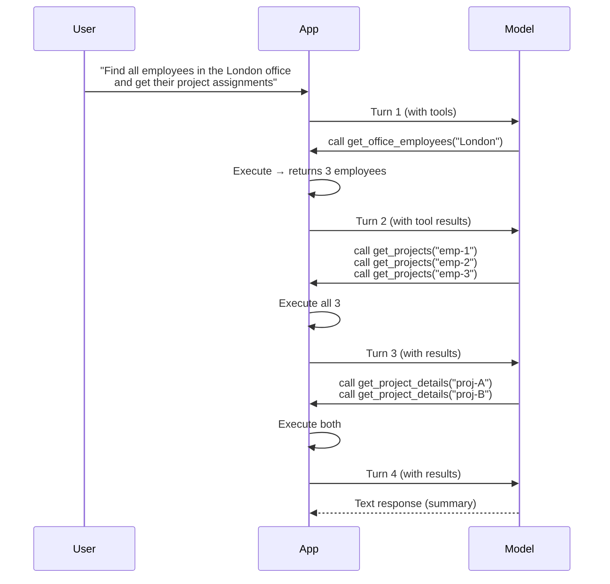

# Nested Function Calling

## Introduction

In agentic systems, a single user request can trigger a chain of tool calls where executing one function reveals the need for another. This creates **nested function calling** — a pattern where the model iteratively calls tools, each building on the results of the last, sometimes triggering the same tool multiple times.

While the model itself doesn't "recursively" call functions (each tool call is a separate turn), the application-level loop can produce recursive-like behavior. Without guardrails, this leads to infinite loops, runaway costs, and stack-like depth explosions.

### What we'll cover

- How nested calling works in the agentic loop
- Depth limits to prevent runaway chains
- Cycle detection to catch infinite loops
- Call budgets for cost control
- A `NestedCallController` that combines all three

### Prerequisites

- [Lesson 07: Multi-Turn Function Calling](../07-multi-turn-function-calling/00-multi-turn-function-calling.md) — The agentic loop
- [Function Composition](./03-function-composition.md) — Chaining tools
- [Lesson 08: Error Handling](../08-error-handling/00-error-handling.md) — Error recovery patterns

---

## How nesting happens

The model doesn't call functions inside functions. Rather, the agentic loop creates nesting:



This is 4 turns deep with 6 total tool calls. Without limits, a poorly-designed tool set can go much deeper.

---

## The danger of unbounded nesting

Consider a tool that searches for related items. The model might keep exploring:

```python
# ❌ Dangerous: model can chain indefinitely
def find_related(item_id: str) -> dict:
    """Find items related to the given item."""
    # Each result is another item the model might explore
    return {
        "related": [
            {"id": "item-A", "name": "Widget A"},
            {"id": "item-B", "name": "Widget B"},
            {"id": "item-C", "name": "Widget C"}
        ]
    }

# The model might do:
# Turn 1: find_related("item-1")  → gets A, B, C
# Turn 2: find_related("item-A"), find_related("item-B"), ...
# Turn 3: find_related("item-D"), find_related("item-E"), ...
# Turn N: Still going...
```

---

## Depth limiting

A **depth limit** caps how many consecutive turns of tool calls are allowed. After the limit, the model must produce a final text response:

```python
class DepthLimitedLoop:
    """Agentic loop with maximum nesting depth."""
    
    def __init__(self, client, model: str, tools: list, max_depth: int = 5):
        self.client = client
        self.model = model
        self.tools = tools
        self.max_depth = max_depth
    
    def run(self, messages: list[dict]) -> str:
        """Run the agentic loop with depth limiting."""
        depth = 0
        input_messages = list(messages)
        
        while depth < self.max_depth:
            response = self.client.responses.create(
                model=self.model,
                input=input_messages,
                tools=self.tools
            )
            
            # Check if model made tool calls
            tool_calls = [
                item for item in response.output
                if item.type == "function_call"
            ]
            
            if not tool_calls:
                # Model produced text — we're done
                return response.output_text
            
            depth += 1
            print(f"  Depth {depth}/{self.max_depth}: "
                  f"{len(tool_calls)} tool call(s)")
            
            # Add model output to conversation
            input_messages += response.output
            
            # Execute tools and add results
            for call in tool_calls:
                result = execute_function(call.name, call.arguments)
                input_messages.append({
                    "type": "function_call_output",
                    "call_id": call.call_id,
                    "output": json.dumps(result)
                })
        
        # Depth exceeded — force text response
        print(f"  ⚠️ Depth limit ({self.max_depth}) reached")
        input_messages.append({
            "role": "user",
            "content": (
                "You've used all available tool calls. "
                "Please respond with what you have so far."
            )
        })
        
        response = self.client.responses.create(
            model=self.model,
            input=input_messages,
            tools=self.tools,
            tool_choice="none"  # Force text response
        )
        
        return response.output_text
```

**Output:**
```
  Depth 1/5: 1 tool call(s)
  Depth 2/5: 3 tool call(s)
  Depth 3/5: 2 tool call(s)
  Final response: "Here are the London office employees and their projects..."
```

---

## Cycle detection

Depth limits prevent infinite chains, but they don't catch **cycles** — the model calling the same function with the same arguments repeatedly:

```python
class CycleDetector:
    """Detect and prevent repeated identical tool calls."""
    
    def __init__(self, max_repeats: int = 2):
        self.max_repeats = max_repeats
        self._call_history: list[tuple[str, str]] = []
    
    def check(self, name: str, arguments: str) -> bool:
        """Return True if this call is allowed, False if it's a cycle."""
        call_signature = (name, arguments)
        
        # Count how many times we've seen this exact call
        repeat_count = self._call_history.count(call_signature)
        
        if repeat_count >= self.max_repeats:
            print(f"  🔄 Cycle detected: {name}({arguments}) "
                  f"called {repeat_count} times")
            return False
        
        self._call_history.append(call_signature)
        return True
    
    def reset(self) -> None:
        """Clear history for a new conversation."""
        self._call_history.clear()
    
    @property
    def total_calls(self) -> int:
        return len(self._call_history)


# Usage
detector = CycleDetector(max_repeats=2)

# First call — allowed
print(detector.check("search", '{"query": "Python"}'))  # True

# Same call again — allowed (under limit)
print(detector.check("search", '{"query": "Python"}'))  # True

# Third identical call — blocked
print(detector.check("search", '{"query": "Python"}'))  # False

# Different arguments — allowed
print(detector.check("search", '{"query": "JavaScript"}'))  # True
```

**Output:**
```
True
True
  🔄 Cycle detected: search({"query": "Python"}) called 2 times
False
True
```

---

## Call budgets

A **call budget** limits the total number of tool calls across all depths. This is the most reliable cost control:

```python
class CallBudget:
    """Track and enforce a maximum number of total tool calls."""
    
    def __init__(self, max_calls: int = 20):
        self.max_calls = max_calls
        self.calls_made = 0
        self.call_log: list[dict] = []
    
    def can_call(self) -> bool:
        """Check if budget has remaining calls."""
        return self.calls_made < self.max_calls
    
    def record_call(self, name: str, arguments: str) -> None:
        """Record a tool call against the budget."""
        self.calls_made += 1
        self.call_log.append({
            "call_number": self.calls_made,
            "name": name,
            "arguments": arguments
        })
    
    @property
    def remaining(self) -> int:
        return self.max_calls - self.calls_made
    
    @property
    def utilization(self) -> float:
        return self.calls_made / self.max_calls if self.max_calls else 0
    
    def summary(self) -> dict:
        """Return budget usage summary."""
        return {
            "total_calls": self.calls_made,
            "max_calls": self.max_calls,
            "remaining": self.remaining,
            "utilization": f"{self.utilization:.0%}"
        }


# Usage
budget = CallBudget(max_calls=10)

for i in range(12):
    if budget.can_call():
        budget.record_call("search", f'{{"page": {i}}}')
        print(f"  Call {budget.calls_made}: ✅ ({budget.remaining} remaining)")
    else:
        print(f"  Call attempt {i + 1}: ❌ Budget exhausted")

print(f"\n{budget.summary()}")
```

**Output:**
```
  Call 1: ✅ (9 remaining)
  Call 2: ✅ (8 remaining)
  ...
  Call 10: ✅ (0 remaining)
  Call attempt 11: ❌ Budget exhausted
  Call attempt 12: ❌ Budget exhausted

{'total_calls': 10, 'max_calls': 10, 'remaining': 0, 'utilization': '100%'}
```

---

## The NestedCallController

Combining depth limits, cycle detection, and call budgets into a single controller:

```python
import json
from dataclasses import dataclass


@dataclass
class ControllerConfig:
    max_depth: int = 5
    max_total_calls: int = 20
    max_call_repeats: int = 2


class NestedCallController:
    """Unified controller for nested function calling safety."""
    
    def __init__(self, config: ControllerConfig = None):
        self.config = config or ControllerConfig()
        self._depth = 0
        self._budget = CallBudget(self.config.max_total_calls)
        self._cycle_detector = CycleDetector(self.config.max_call_repeats)
    
    def begin_turn(self) -> None:
        """Called at the start of each agentic loop turn."""
        self._depth += 1
    
    def can_continue(self) -> tuple[bool, str]:
        """Check if the loop should continue."""
        if self._depth >= self.config.max_depth:
            return False, f"Depth limit ({self.config.max_depth}) reached"
        if not self._budget.can_call():
            return False, f"Call budget ({self.config.max_total_calls}) exhausted"
        return True, "OK"
    
    def approve_call(self, name: str, arguments: str) -> tuple[bool, str]:
        """Check if a specific tool call is allowed."""
        # Check budget
        if not self._budget.can_call():
            return False, "Budget exhausted"
        
        # Check for cycles
        if not self._cycle_detector.check(name, arguments):
            return False, f"Cycle detected for {name}"
        
        # Approved — record it
        self._budget.record_call(name, arguments)
        return True, "Approved"
    
    def report(self) -> dict:
        """Generate a summary report."""
        return {
            "depth_reached": self._depth,
            "max_depth": self.config.max_depth,
            "budget": self._budget.summary(),
            "unique_calls": len(set(
                (c["name"], c["arguments"]) 
                for c in self._budget.call_log
            ))
        }
    
    def reset(self) -> None:
        """Reset for a new conversation."""
        self._depth = 0
        self._budget = CallBudget(self.config.max_total_calls)
        self._cycle_detector = CycleDetector(self.config.max_call_repeats)


def run_controlled_loop(
    client,
    model: str,
    tools: list[dict],
    messages: list[dict],
    config: ControllerConfig = None
) -> dict:
    """Agentic loop with full nested call control."""
    controller = NestedCallController(config)
    input_messages = list(messages)
    
    while True:
        controller.begin_turn()
        
        # Check if we should continue
        can_go, reason = controller.can_continue()
        if not can_go:
            print(f"  ⚠️ Stopping: {reason}")
            break
        
        response = client.responses.create(
            model=model,
            input=input_messages,
            tools=tools
        )
        
        tool_calls = [
            item for item in response.output
            if item.type == "function_call"
        ]
        
        if not tool_calls:
            # Model produced final text
            return {
                "response": response.output_text,
                "report": controller.report()
            }
        
        input_messages += response.output
        
        # Process each tool call through the controller
        approved_calls = []
        for call in tool_calls:
            allowed, msg = controller.approve_call(
                call.name, call.arguments
            )
            
            if allowed:
                result = execute_function(call.name, call.arguments)
                approved_calls.append((call, result))
                print(f"  ✅ {call.name}: approved")
            else:
                # Return error for blocked calls
                approved_calls.append((call, {
                    "error": f"Call blocked: {msg}",
                    "suggestion": "Please work with the data you have."
                }))
                print(f"  ❌ {call.name}: {msg}")
        
        # Add all results to conversation
        for call, result in approved_calls:
            input_messages.append({
                "type": "function_call_output",
                "call_id": call.call_id,
                "output": json.dumps(result)
            })
    
    # Forced termination — get final response without tools
    input_messages.append({
        "role": "user",
        "content": "Please summarize your findings with the data you have."
    })
    
    response = client.responses.create(
        model=model,
        input=input_messages,
        tools=tools,
        tool_choice="none"
    )
    
    return {
        "response": response.output_text,
        "report": controller.report(),
        "terminated_early": True
    }
```

---

## Practical example: recursive data exploration

Here we see how the controller handles a model that tries to explore a tree structure:

```python
# Simulated org chart
org_chart = {
    "CEO": ["VP-Eng", "VP-Sales", "VP-Ops"],
    "VP-Eng": ["Dir-Backend", "Dir-Frontend"],
    "VP-Sales": ["Dir-NA", "Dir-EU"],
    "VP-Ops": ["Dir-HR", "Dir-Finance"],
    "Dir-Backend": ["Lead-API", "Lead-DB"],
    "Dir-Frontend": ["Lead-Web", "Lead-Mobile"],
    "Dir-NA": [],
    "Dir-EU": [],
    "Dir-HR": [],
    "Dir-Finance": [],
    "Lead-API": [],
    "Lead-DB": [],
    "Lead-Web": [],
    "Lead-Mobile": []
}

def get_direct_reports(manager: str) -> dict:
    reports = org_chart.get(manager, [])
    return {
        "manager": manager,
        "direct_reports": reports,
        "count": len(reports)
    }

# Without limits, the model could call get_direct_reports
# for every person in the tree: 14 calls across 5 depth levels.

# With limits:
config = ControllerConfig(
    max_depth=3,       # Stop after 3 levels
    max_total_calls=8, # Max 8 total calls
    max_call_repeats=1 # Each person looked up once
)

# The controller would produce:
# Turn 1: get_direct_reports("CEO") → 3 reports
# Turn 2: get_direct_reports("VP-Eng"), ("VP-Sales"), ("VP-Ops") → 3 calls
# Turn 3: get_direct_reports("Dir-Backend"), ("Dir-Frontend") → 2 calls
# Total: 6 calls, depth 3 — within limits
# Model forced to summarize with what it has
```

**Output:**
```
  ✅ get_direct_reports("CEO"): approved
  ✅ get_direct_reports("VP-Eng"): approved
  ✅ get_direct_reports("VP-Sales"): approved
  ✅ get_direct_reports("VP-Ops"): approved
  ✅ get_direct_reports("Dir-Backend"): approved
  ✅ get_direct_reports("Dir-Frontend"): approved
  ⚠️ Stopping: Depth limit (3) reached

Report: {'depth_reached': 3, 'budget': {'total_calls': 6, ...}}
```

---

## Best practices

| Practice | Why It Matters |
|----------|----------------|
| Always set a depth limit (3-5 for most applications) | Prevents runaway API costs and latency |
| Use call budgets in addition to depth limits | Parallel calls can exhaust resources at shallow depth |
| Detect cycles on exact `(name, arguments)` pairs | Catches the model re-requesting identical data |
| Force `tool_choice="none"` when terminating | Ensures the model produces a final text response |
| Include remaining budget in system prompts | Helps the model prioritize which calls to make |
| Log controller reports for every conversation | Reveals patterns — which tools chain most, where limits trigger |

---

## Common pitfalls

| ❌ Mistake | ✅ Solution |
|-----------|-------------|
| No depth limit on the agentic loop | Always set `max_depth` (default: 5) |
| Only limiting depth, not total calls | Add a `CallBudget` — parallel calls bypass depth limits |
| Silently dropping blocked calls | Return an error result so the model knows the call was blocked |
| Identical cycle detection across different conversations | Reset the controller between conversations |
| Setting limits too low for legitimate workflows | Profile typical conversation depths before choosing limits |

---

## Hands-on exercise

### Your task

Build a `NestedCallController` that manages a file system exploration agent:

1. The agent has `list_directory(path)` and `read_file(path)` tools
2. Starting from `/project`, the model explores subdirectories to find configuration files
3. Implement depth limit (3), call budget (10), and cycle detection

### Requirements

1. Create mock `list_directory` and `read_file` handlers
2. Build a `NestedCallController` with the specified limits
3. Simulate the agentic loop (mock the model's tool call decisions)
4. Show the controller blocking calls when limits are reached

### Expected result

```
  Turn 1: list_directory("/project") → approved
  Turn 2: list_directory("/project/src") → approved
  Turn 2: list_directory("/project/config") → approved
  Turn 3: read_file("/project/config/app.yaml") → approved
  Turn 3: list_directory("/project/src") → BLOCKED (cycle)
  Turn 3: ⚠️ Depth limit reached
  Report: depth=3, calls=4, blocked=1
```

<details>
<summary>💡 Hints (click to expand)</summary>

- Mock the file system as a nested dictionary
- Each turn, decide which calls the "model" would make based on previous results
- Use `controller.approve_call()` before executing each call
- After the loop, call `controller.report()` for the summary

</details>

<details>
<summary>✅ Solution (click to expand)</summary>

```python
import json

# Mock file system
mock_fs = {
    "/project": {"type": "dir", "children": ["src", "config", "README.md"]},
    "/project/src": {"type": "dir", "children": ["main.py", "utils.py"]},
    "/project/config": {"type": "dir", "children": ["app.yaml", "db.yaml"]},
    "/project/README.md": {"type": "file", "content": "# Project"},
    "/project/src/main.py": {"type": "file", "content": "print('hello')"},
    "/project/config/app.yaml": {"type": "file", "content": "port: 8080"},
    "/project/config/db.yaml": {"type": "file", "content": "host: localhost"},
}

def list_directory(path: str) -> dict:
    entry = mock_fs.get(path)
    if not entry or entry["type"] != "dir":
        return {"error": f"Not a directory: {path}"}
    return {"path": path, "entries": entry["children"]}

def read_file(path: str) -> dict:
    entry = mock_fs.get(path)
    if not entry or entry["type"] != "file":
        return {"error": f"Not a file: {path}"}
    return {"path": path, "content": entry["content"]}

# Simulate the agentic loop
config = ControllerConfig(max_depth=3, max_total_calls=10, max_call_repeats=1)
controller = NestedCallController(config)

# Simulated model decisions per turn
planned_calls = [
    # Turn 1
    [("list_directory", '{"path": "/project"}')],
    # Turn 2
    [("list_directory", '{"path": "/project/src"}'),
     ("list_directory", '{"path": "/project/config"}')],
    # Turn 3
    [("read_file", '{"path": "/project/config/app.yaml"}'),
     ("list_directory", '{"path": "/project/src"}')],  # Cycle!
]

blocked = 0
for turn_calls in planned_calls:
    controller.begin_turn()
    can_go, reason = controller.can_continue()
    if not can_go:
        print(f"  ⚠️ {reason}")
        break
    
    for name, args in turn_calls:
        allowed, msg = controller.approve_call(name, args)
        parsed = json.loads(args)
        path = parsed.get("path", "")
        
        if allowed:
            handler = list_directory if name == "list_directory" else read_file
            result = handler(**parsed)
            print(f"  ✅ {name}(\"{path}\"): {msg}")
        else:
            blocked += 1
            print(f"  ❌ {name}(\"{path}\"): BLOCKED ({msg})")

report = controller.report()
print(f"\nReport: depth={report['depth_reached']}, "
      f"calls={report['budget']['total_calls']}, "
      f"blocked={blocked}")
```

</details>

### Bonus challenges

- [ ] Add a `per_tool_budget` that limits individual tools (e.g., max 5 `list_directory` calls but only 3 `read_file` calls)
- [ ] Implement a "warn before block" mode: return a warning on the second-to-last allowed call
- [ ] Add the remaining budget to the system prompt so the model can prioritize which calls to make

---

## Summary

✅ **Nested function calling** happens when the agentic loop processes chains of tool calls — each turn's results trigger new calls

✅ **Depth limits** cap the number of consecutive tool-calling turns — prevents unbounded exploration

✅ **Cycle detection** catches the model calling the same function with identical arguments — prevents infinite loops

✅ **Call budgets** limit total tool calls across all depths — the most reliable cost control mechanism

✅ The **NestedCallController** combines all three — depth, cycles, and budget — into a single safety layer

✅ When limits trigger, force `tool_choice="none"` and ask the model to summarize with what it has

**Next:** [Human-in-the-Loop →](./05-human-in-the-loop.md)

---

[← Previous: Function Composition](./03-function-composition.md) | [Back to Lesson Overview](./00-advanced-patterns.md)

<!-- 
Sources Consulted:
- OpenAI Function Calling Guide (tool calling flow): https://platform.openai.com/docs/guides/function-calling
- OpenAI Agents SDK: https://platform.openai.com/docs/guides/agents
- Anthropic Tool Use Documentation: https://platform.claude.com/docs/en/docs/build-with-claude/tool-use
- Google Gemini Function Calling (compositional): https://ai.google.dev/gemini-api/docs/function-calling
-->
