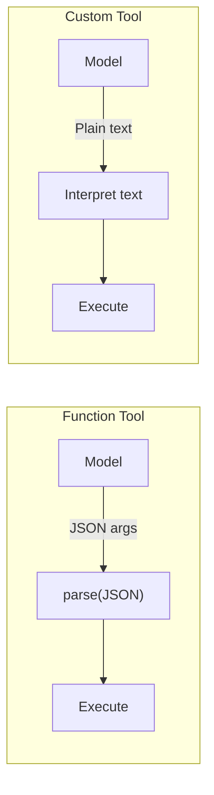

# Custom Tools

## Introduction

Standard function calling gives the model tools that accept **JSON arguments** — structured, schema-validated input. OpenAI's **custom tools** break this pattern entirely: they accept **plain text input** and return plain text output, opening the door to tools where natural language *is* the interface.

This is an **OpenAI-only feature** as of mid-2025. Neither Anthropic nor Google Gemini offer an equivalent. It was introduced alongside the Responses API.

### What we'll cover

- What custom tools are and how they differ from function tools
- When to use custom tools vs. function tools
- Building and registering custom tools
- The `custom_tool_call` output type
- Practical use cases: code interpreters, search, and free-form queries

### Prerequisites

- [Tool Choice Control](./01-tool-choice-control.md) — Tool configuration basics
- [Lesson 03: Your First Function Call](../03-your-first-function-call/00-your-first-function-call.md) — Standard function calling
- Familiarity with the OpenAI Responses API

---

## Function tools vs. custom tools

Standard function tools define a JSON Schema for their parameters. The model generates JSON that conforms to the schema. Custom tools have **no schema** — the model generates a plain text string:



| Aspect | Function Tool | Custom Tool |
|--------|--------------|-------------|
| Input format | JSON (schema-validated) | Plain text string |
| Schema | Required JSON Schema | No schema |
| Type | `"function"` | `"custom"` |
| Output type | `function_call` | `custom_tool_call` |
| Structured output | Yes (strict mode) | No |
| Provider support | OpenAI, Anthropic, Gemini | OpenAI only |

---

## Defining a custom tool

A custom tool has a `type` of `"custom"`, a `name`, and a `description`. No `parameters` field:

```python
from openai import OpenAI
import json

client = OpenAI()

tools = [
    {
        "type": "custom",
        "name": "code_runner",
        "description": (
            "Execute a code snippet. The input is the raw code "
            "to run. Supports Python and JavaScript. Return the "
            "stdout output of the execution."
        )
    },
    {
        "type": "custom",
        "name": "natural_language_query",
        "description": (
            "Query a database using natural language. The input "
            "is a plain English question about the data. Examples: "
            "'How many orders were placed last month?', "
            "'What is the average order value by region?'"
        )
    },
    {
        "type": "function",
        "name": "get_user",
        "description": "Look up a user by ID",
        "parameters": {
            "type": "object",
            "properties": {
                "user_id": {"type": "string"}
            },
            "required": ["user_id"]
        }
    }
]
```

> **Note:** You can mix custom tools and function tools in the same request. The model decides which type to call based on the task.

---

## Handling custom tool calls

When the model calls a custom tool, the output item has type `custom_tool_call` with an `input` field containing the plain text string:

```python
response = client.responses.create(
    model="gpt-4.1",
    input=[{
        "role": "user",
        "content": "Run this Python code: print(sum(range(1, 101)))"
    }],
    tools=tools
)

for item in response.output:
    if item.type == "custom_tool_call":
        print(f"Tool: {item.name}")
        print(f"Input (plain text): {item.input}")
        print(f"Call ID: {item.id}")
    elif item.type == "function_call":
        print(f"Function: {item.name}")
        print(f"Arguments (JSON): {item.arguments}")
```

**Output:**
```
Tool: code_runner
Input (plain text): print(sum(range(1, 101)))
Call ID: call_abc123
```

Notice the input is **not JSON** — it's the raw Python code string.

---

## Executing and returning results

Custom tool results go back as `custom_tool_call_output` items:

```python
import subprocess
import json

def execute_code(code: str) -> str:
    """Execute Python code and capture stdout."""
    try:
        result = subprocess.run(
            ["python3", "-c", code],
            capture_output=True,
            text=True,
            timeout=10
        )
        if result.returncode == 0:
            return result.stdout.strip()
        else:
            return f"Error: {result.stderr.strip()}"
    except subprocess.TimeoutExpired:
        return "Error: Code execution timed out (10s limit)"


def handle_custom_tool(item) -> dict:
    """Route a custom tool call to its handler."""
    handlers = {
        "code_runner": execute_code,
        "natural_language_query": run_nl_query,
    }
    
    handler = handlers.get(item.name)
    if not handler:
        return {
            "type": "custom_tool_call_output",
            "id": item.id,
            "output": f"Unknown tool: {item.name}"
        }
    
    result = handler(item.input)
    return {
        "type": "custom_tool_call_output",
        "id": item.id,
        "output": result
    }


# Full agentic loop with custom tools
def run_with_custom_tools(user_message: str) -> str:
    input_messages = [{"role": "user", "content": user_message}]
    
    while True:
        response = client.responses.create(
            model="gpt-4.1",
            input=input_messages,
            tools=tools
        )
        
        # Collect tool calls
        tool_outputs = []
        has_tool_calls = False
        
        for item in response.output:
            if item.type == "custom_tool_call":
                has_tool_calls = True
                output = handle_custom_tool(item)
                tool_outputs.append(output)
                
            elif item.type == "function_call":
                has_tool_calls = True
                result = execute_function(item.name, item.arguments)
                tool_outputs.append({
                    "type": "function_call_output",
                    "call_id": item.call_id,
                    "output": json.dumps(result)
                })
        
        if not has_tool_calls:
            return response.output_text
        
        # Add model output and tool results to conversation
        input_messages = (
            input_messages 
            + response.output 
            + tool_outputs
        )


# Example usage
result = run_with_custom_tools(
    "Calculate the sum of all numbers from 1 to 100 using Python"
)
print(result)
```

**Output:**
```
The sum of all numbers from 1 to 100 is 5050.
```

---

## Use case: natural language database queries

Custom tools are ideal when the input is inherently unstructured — like asking questions in English:

```python
import sqlite3

def run_nl_query(question: str) -> str:
    """Convert a natural language question to SQL and execute it."""
    
    # Use another LLM call to convert NL → SQL
    sql_response = client.responses.create(
        model="gpt-4.1-mini",
        input=[{
            "role": "system",
            "content": (
                "Convert the following question to a SQL query "
                "for a database with tables: orders(id, customer_id, "
                "amount, created_at), customers(id, name, region). "
                "Return ONLY the SQL query, nothing else."
            )
        }, {
            "role": "user",
            "content": question
        }]
    )
    
    sql = sql_response.output_text.strip()
    
    # Execute against the database
    conn = sqlite3.connect("app.db")
    try:
        cursor = conn.execute(sql)
        columns = [desc[0] for desc in cursor.description]
        rows = cursor.fetchall()
        
        # Format as readable table
        result_lines = [" | ".join(columns)]
        result_lines.append("-" * len(result_lines[0]))
        for row in rows:
            result_lines.append(" | ".join(str(v) for v in row))
        
        return f"Query: {sql}\n\n" + "\n".join(result_lines)
    except Exception as e:
        return f"Query failed: {sql}\nError: {e}"
    finally:
        conn.close()


# With a function tool, you'd need to define every possible
# query pattern as parameters. With a custom tool, the model
# just writes the question naturally.
```

---

## When to use custom tools

| Use Custom Tools When... | Use Function Tools When... |
|--------------------------|---------------------------|
| Input is naturally unstructured (code, queries, prose) | Input has a fixed structure (IDs, amounts, dates) |
| The space of possible inputs is too large for a schema | You need strict input validation |
| The tool interprets natural language | The tool needs exact parameter types |
| You're wrapping another language model | You're calling a REST API |
| Flexibility matters more than validation | Reliability and type safety matter more |

> **Warning:** Custom tools bypass JSON Schema validation. You lose the guarantee that the model's output conforms to a structure. Use them only when the input genuinely cannot be expressed as a schema.

---

## Combining custom and function tools

A powerful pattern is using custom tools for complex input alongside function tools for structured operations:

```python
tools = [
    # Custom tool for flexible search
    {
        "type": "custom",
        "name": "search",
        "description": (
            "Search the knowledge base. Input is a natural language "
            "search query. Returns relevant documents."
        )
    },
    # Function tool for precise actions
    {
        "type": "function",
        "name": "create_ticket",
        "description": "Create a support ticket",
        "parameters": {
            "type": "object",
            "properties": {
                "title": {"type": "string"},
                "priority": {
                    "type": "string", 
                    "enum": ["low", "medium", "high"]
                },
                "description": {"type": "string"}
            },
            "required": ["title", "priority"]
        }
    }
]

# The model can:
# 1. Use the custom "search" tool with flexible natural language
# 2. Use the structured "create_ticket" tool for precise ticket creation
# Both in the same conversation
```

---

## Best practices

| Practice | Why It Matters |
|----------|----------------|
| Write detailed descriptions for custom tools | No schema to guide the model — the description *is* the contract |
| Include input examples in the description | Shows the model what format you expect |
| Validate and sanitize custom tool input server-side | No schema validation means you must handle bad input yourself |
| Use custom tools sparingly alongside function tools | Function tools provide stronger guarantees for structured operations |
| Set execution timeouts on custom tool handlers | Plain text input (especially code) can produce long-running operations |
| Log all custom tool inputs for debugging | Without schema validation, unexpected inputs are more common |

---

## Common pitfalls

| ❌ Mistake | ✅ Solution |
|-----------|-------------|
| Using custom tools when a JSON schema would work | Prefer function tools for structured input — they're more reliable |
| No input validation in the handler | Always validate and sanitize — the model can send anything |
| Vague tool descriptions | Be specific: include examples, constraints, and expected format |
| Running arbitrary code without sandboxing | Use containers, timeouts, and restricted environments for code execution tools |
| Expecting structured output from custom tool input | Custom tool input is a string — parse it yourself or use it as-is |

---

## Hands-on exercise

### Your task

Build a system with two tools: a **custom tool** for natural language math evaluation and a **function tool** for storing results.

### Requirements

1. Create a custom tool `math_eval` that accepts natural language math expressions (e.g., "What is 15% of 230?")
2. Create a function tool `save_result` with parameters `label` (string) and `value` (number)
3. Write a handler for `math_eval` that evaluates the expression
4. Simulate a conversation where the model evaluates a math problem and saves the result

### Expected result

```
User: "Calculate 15% of 230 and save it as 'tip_amount'"

Model calls: math_eval("15% of 230")
→ Result: "34.5"

Model calls: save_result({"label": "tip_amount", "value": 34.5})
→ Result: {"status": "saved", "label": "tip_amount", "value": 34.5}

Model: "15% of 230 is 34.50. I've saved this as 'tip_amount'."
```

<details>
<summary>💡 Hints (click to expand)</summary>

- For `math_eval`, you can use Python's `eval()` after extracting numbers and operations, or call another LLM to convert natural language to a math expression
- The custom tool handler receives plain text, not JSON
- The function tool handler receives JSON arguments
- Handle both tool types in your agentic loop

</details>

<details>
<summary>✅ Solution (click to expand)</summary>

```python
import re
import json

# Tool definitions
tools = [
    {
        "type": "custom",
        "name": "math_eval",
        "description": (
            "Evaluate a math expression described in natural language. "
            "Input examples: '15% of 230', 'square root of 144', "
            "'what is 3 * 17 + 5'. Returns the numeric result."
        )
    },
    {
        "type": "function",
        "name": "save_result",
        "description": "Save a calculated result with a label",
        "parameters": {
            "type": "object",
            "properties": {
                "label": {
                    "type": "string",
                    "description": "A descriptive label for the result"
                },
                "value": {
                    "type": "number",
                    "description": "The numeric value to save"
                }
            },
            "required": ["label", "value"]
        }
    }
]

# Handlers
saved_results = {}

def handle_math_eval(expression: str) -> str:
    """Evaluate a natural language math expression."""
    # Simple pattern matching for common expressions
    # In production, use a proper NL→math parser or LLM
    expression = expression.lower().strip()
    
    # Handle "X% of Y"
    pct_match = re.match(r"(\d+(?:\.\d+)?)%\s+of\s+(\d+(?:\.\d+)?)", expression)
    if pct_match:
        pct, value = float(pct_match.group(1)), float(pct_match.group(2))
        return str(pct / 100 * value)
    
    # Handle basic arithmetic
    try:
        # Remove unsafe characters, keep math operators
        safe = re.sub(r"[^0-9+\-*/().%\s]", "", expression)
        return str(eval(safe))
    except Exception:
        return f"Could not evaluate: {expression}"

def handle_save_result(label: str, value: float) -> dict:
    """Save a result with a label."""
    saved_results[label] = value
    return {"status": "saved", "label": label, "value": value}

# Simulated agentic loop
print("Custom tool call: math_eval('15% of 230')")
math_result = handle_math_eval("15% of 230")
print(f"  → Result: {math_result}")

print("\nFunction tool call: save_result")
save_result = handle_save_result("tip_amount", float(math_result))
print(f"  → Result: {json.dumps(save_result)}")

print(f"\nSaved results: {saved_results}")
```

</details>

### Bonus challenges

- [ ] Add a custom tool for "regex_search" that accepts a natural language pattern description and converts it to a regex
- [ ] Implement input sanitization for the `math_eval` handler to prevent code injection
- [ ] Build a logging layer that records all custom tool inputs for audit purposes

---

## Summary

✅ **Custom tools** accept plain text input instead of JSON — no schema required

✅ They use `type: "custom"` in the tool definition and produce `custom_tool_call` output items

✅ Results are returned as `custom_tool_call_output` with a plain text `output` field

✅ **Use custom tools when** input is inherently unstructured: code, natural language queries, free-form descriptions

✅ **Prefer function tools** when input has a fixed structure — JSON schemas provide stronger validation

✅ This is **OpenAI-only** as of mid-2025 — Anthropic and Gemini don't have an equivalent feature

**Next:** [Context-Free Grammars →](./08-context-free-grammars.md)

---

[← Previous: Function Call Streaming](./06-function-call-streaming.md) | [Back to Lesson Overview](./00-advanced-patterns.md)

<!-- 
Sources Consulted:
- OpenAI Function Calling Guide (Custom tools): https://platform.openai.com/docs/guides/function-calling
- OpenAI Responses API Reference: https://platform.openai.com/docs/api-reference/responses
-->
