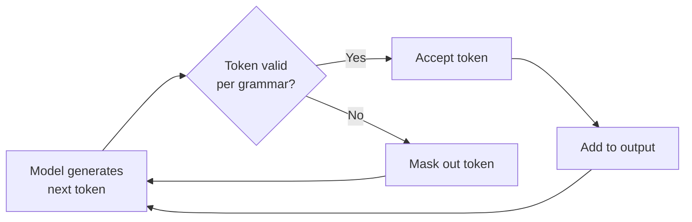
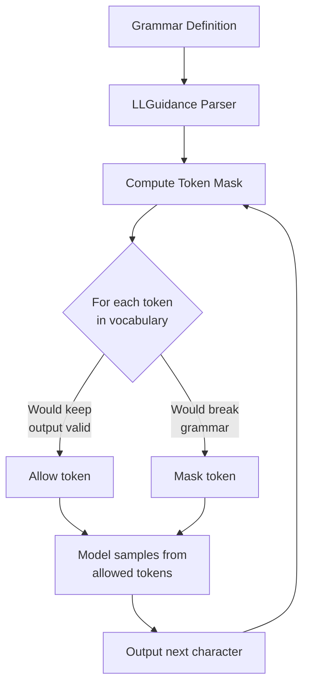

# Context-Free Grammars for Tool Output

## Introduction

What if you could make an AI model's output follow a strict grammar — not just JSON Schema, but arbitrary structured formats like SQL, XML, DSLs, or custom configuration languages? OpenAI's **context-free grammar (CFG) support** does exactly this, constraining the model's token generation to produce output that is syntactically valid according to a formal grammar definition.

This is powered by **LLGuidance**, an open-source constrained decoding engine that operates at the token sampling level. It adds approximately 50 microseconds per token — fast enough that you won't notice.

This is an **OpenAI-only feature** and is applied through the `format` parameter on custom tools.

### What we'll cover

- What constrained decoding is and why it matters
- Lark CFG syntax for defining grammars
- Regex CFG syntax for simpler patterns
- Applying grammars to custom tools
- LLGuidance and how it works under the hood
- Practical examples: SQL, XML, and custom DSLs

### Prerequisites

- [Custom Tools](./07-custom-tools.md) — Custom tool basics
- Basic understanding of formal grammars (helpful, not required)
- Familiarity with regular expressions

---

## What is constrained decoding?

Normally, a language model can output any token at each step. **Constrained decoding** restricts the set of allowed tokens at each generation step to only those that keep the output valid according to a grammar:



The result: the model's output is **guaranteed** to be syntactically valid. Not just "usually correct" — *always* valid. Every output parses successfully.

> **🤖 AI Context:** This is the same technology behind OpenAI's Structured Outputs (JSON Schema mode). CFG support extends it to arbitrary grammars beyond JSON.

---

## Lark CFG syntax

OpenAI uses a variation of the **Lark parser** format for defining grammars. Lark is a Python parsing library that uses EBNF-like notation:

```
// A simple arithmetic expression grammar
start: expr

expr: term (("+"|"-") term)*
term: factor (("*"|"/") factor)*
factor: NUMBER | "(" expr ")"

// Terminal rules (uppercase or regex)
NUMBER: /[0-9]+(\.[0-9]+)?/
```

### Key Lark syntax rules

| Element | Syntax | Example |
|---------|--------|---------|
| Rule (non-terminal) | lowercase name | `expr: term "+" term` |
| Terminal (literal) | Quoted string | `"SELECT"` |
| Terminal (pattern) | Uppercase name with regex | `NAME: /[a-zA-Z_]+/` |
| Alternation | `\|` | `op: "+" \| "-"` |
| Optional | `?` | `clause?` |
| Zero or more | `*` | `item ("," item)*` |
| One or more | `+` | `digit+` |
| Grouping | `( )` | `("+" \| "-")` |
| Start rule | Must be named `start` | `start: expr` |

> **Important:** Terminal patterns use the **Rust `regex` crate** syntax, not Python's `re` module. Most common patterns are the same, but advanced features differ. Notable: Rust regex doesn't support backreferences or lookaround.

---

## Applying a grammar to a custom tool

Grammars are specified through the `format` parameter on custom tools:

```python
from openai import OpenAI

client = OpenAI()

# Define a grammar for simple SQL SELECT statements
sql_grammar = r"""
start: select_stmt

select_stmt: "SELECT " columns " FROM " table_name where_clause? order_clause? ";"

columns: column ("," " " column)*
column: IDENTIFIER | IDENTIFIER " AS " IDENTIFIER

table_name: IDENTIFIER

where_clause: " WHERE " condition
condition: IDENTIFIER " " comparison " " value
comparison: "=" | "!=" | ">" | "<" | ">=" | "<="
value: STRING | NUMBER

order_clause: " ORDER BY " IDENTIFIER " " direction
direction: "ASC" | "DESC"

IDENTIFIER: /[a-zA-Z_][a-zA-Z0-9_]*/
STRING: "'" /[^']*/ "'"
NUMBER: /[0-9]+(\.[0-9]+)?/
"""

tools = [
    {
        "type": "custom",
        "name": "sql_query",
        "description": (
            "Generate a SQL SELECT query based on the user's request. "
            "The output must be a valid SELECT statement."
        ),
        "format": {
            "type": "grammar",
            "syntax": "lark",
            "definition": sql_grammar
        }
    }
]

response = client.responses.create(
    model="gpt-4.1",
    input=[{
        "role": "user",
        "content": "Find all orders over $100 sorted by date"
    }],
    tools=tools
)

for item in response.output:
    if item.type == "custom_tool_call":
        print(f"Generated SQL: {item.input}")
```

**Output:**
```
Generated SQL: SELECT * FROM orders WHERE amount > 100 ORDER BY created_at DESC;
```

The grammar **guarantees** that the output is a syntactically valid SQL SELECT statement. It can't produce `SELCT` or forget the semicolon.

---

## Regex CFG syntax

For simpler patterns, you can use regex instead of a full Lark grammar:

```python
# Constrain output to a semantic version string
tools = [
    {
        "type": "custom",
        "name": "suggest_version",
        "description": "Suggest the next semantic version number",
        "format": {
            "type": "grammar",
            "syntax": "regex",
            "definition": r"[0-9]+\.[0-9]+\.[0-9]+(-[a-z]+(\.[0-9]+)?)?"
        }
    }
]

# The model can output: "2.1.0", "3.0.0-beta.1", "1.5.3-rc.2"
# But NOT: "version 2.1", "v2.1.0", "two.one.zero"
```

### When to use regex vs. Lark

| Use Regex When... | Use Lark When... |
|-------------------|------------------|
| Pattern is a single flat format | Output has nested structure |
| No recursive rules needed | Grammar has recursive rules |
| Pattern fits in one regular expression | Multiple distinct syntactic elements |
| Simple validation (IDs, versions, dates) | Complex languages (SQL, XML, DSLs) |

---

## Practical example: XML configuration

Generate valid XML that conforms to a specific schema:

```python
xml_grammar = r"""
start: xml_doc

xml_doc: config_element

config_element: "<config>" setting+ "</config>"

setting: server_setting | database_setting | logging_setting

server_setting: "<server>" "<host>" HOSTNAME "</host>" "<port>" PORT "</port>" "</server>"

database_setting: "<database>" "<url>" DB_URL "</url>" "<pool>" POOL_SIZE "</pool>" "</database>"

logging_setting: "<logging>" "<level>" LOG_LEVEL "</level>" "</logging>"

HOSTNAME: /[a-zA-Z0-9._-]+/
PORT: /[0-9]{2,5}/
DB_URL: /[a-zA-Z0-9:/@._-]+/
POOL_SIZE: /[0-9]{1,3}/
LOG_LEVEL: "DEBUG" | "INFO" | "WARN" | "ERROR"
"""

tools = [
    {
        "type": "custom",
        "name": "generate_config",
        "description": (
            "Generate an XML configuration file for the application. "
            "Include server, database, and logging settings."
        ),
        "format": {
            "type": "grammar",
            "syntax": "lark",
            "definition": xml_grammar
        }
    }
]

response = client.responses.create(
    model="gpt-4.1",
    input=[{
        "role": "user",
        "content": (
            "Create a production config with the database at "
            "postgres://prod-db:5432/app, server on port 8080, "
            "and WARN level logging"
        )
    }],
    tools=tools
)

for item in response.output:
    if item.type == "custom_tool_call":
        print(item.input)
```

**Output:**
```xml
<config><server><host>0.0.0.0</host><port>8080</port></server><database><url>postgres://prod-db:5432/app</url><pool>10</pool></database><logging><level>WARN</level></logging></config>
```

Every output is guaranteed to be well-formed XML matching the grammar's structure.

---

## Practical example: custom DSL

Define a domain-specific language for workflow automation:

```python
workflow_grammar = r"""
start: workflow

workflow: "WORKFLOW " IDENTIFIER ":" step+

step: "  STEP " IDENTIFIER ":" action

action: run_action | wait_action | branch_action

run_action: " RUN " COMMAND
wait_action: " WAIT " DURATION
branch_action: " IF " CONDITION " THEN " IDENTIFIER " ELSE " IDENTIFIER

COMMAND: /[a-zA-Z_][a-zA-Z0-9_.-]*/
IDENTIFIER: /[a-zA-Z_][a-zA-Z0-9_]*/
DURATION: /[0-9]+[smh]/
CONDITION: /[a-zA-Z_][a-zA-Z0-9_.=<>!]+/
"""

tools = [
    {
        "type": "custom",
        "name": "create_workflow",
        "description": (
            "Create a workflow definition in the custom DSL format. "
            "Steps can RUN commands, WAIT for durations, or IF/THEN/ELSE branch."
        ),
        "format": {
            "type": "grammar",
            "syntax": "lark",
            "definition": workflow_grammar
        }
    }
]

response = client.responses.create(
    model="gpt-4.1",
    input=[{
        "role": "user",
        "content": (
            "Create a deployment workflow that builds, runs tests, "
            "waits 30 seconds, then deploys"
        )
    }],
    tools=tools
)

for item in response.output:
    if item.type == "custom_tool_call":
        print(item.input)
```

**Output:**
```
WORKFLOW deploy:
  STEP build: RUN npm_build
  STEP test: RUN npm_test
  STEP cooldown: WAIT 30s
  STEP release: RUN deploy_prod
```

---

## How LLGuidance works

LLGuidance is the engine powering grammar-constrained generation. Understanding it helps you write better grammars:



Key implementation details:

| Aspect | Detail |
|--------|--------|
| Performance | ~50μs per token for 128k tokenizer |
| Algorithm | Earley's algorithm on derivatives of regular expressions |
| Language | Rust with Python bindings |
| Lark support | A subset of the Lark format |
| Regex engine | Rust `regex` crate (no backreferences, no lookaround) |
| Open source | `github.com/guidance-ai/llguidance` (MIT license) |

> **🤖 AI Context:** LLGuidance also powers OpenAI's JSON Schema Structured Outputs. When you use `strict: true` with function tools, the same constrained decoding engine ensures the output matches the JSON Schema exactly.

---

## Grammar writing best practices

| Practice | Why It Matters |
|----------|----------------|
| Keep grammars simple — fewer rules, fewer issues | Complex grammars can constrain the model too much, reducing output quality |
| Use a single bounded terminal per regex | Unbounded alternation in terminals can slow down the mask computation |
| Don't split a single concept across multiple rules | Each token is validated against the current rule — keep rules self-contained |
| Test grammars with the Lark Python library first | Validate that your grammar parses expected outputs before using it with the API |
| Use `regex` syntax for flat patterns | Only use Lark when you need recursion or nested structure |
| Provide clear descriptions alongside grammars | The grammar constrains syntax, but the description guides semantics |

---

## Common pitfalls

| ❌ Mistake | ✅ Solution |
|-----------|-------------|
| Grammar is too restrictive — model can't express what it needs | Add flexibility: use `*` for optional repetition, `?` for optional elements |
| Using Python regex features unsupported by Rust | Stick to basic patterns: no backreferences (`\1`), no lookahead (`(?=...)`), no lookbehind |
| Forgetting the `start` rule | Every Lark grammar must have a `start` rule — it's the entry point |
| Grammar allows infinite recursion without base case | Add base cases: `expr: atom | expr "+" atom` not `expr: expr "+" expr` |
| Not testing the grammar independently | Use Python's `lark` library to test parsing before deploying with OpenAI |
| Applying grammars to function tools | Grammars work with **custom tools** only (type: `"custom"`), not function tools |

---

## Testing grammars locally

Before using a grammar with the API, validate it with the Python `lark` library:

```python
from lark import Lark

# Define the grammar
grammar = r"""
start: expr
expr: term (("+"|"-") term)*
term: factor (("*"|"/") factor)*
factor: NUMBER | "(" expr ")"
NUMBER: /[0-9]+(\.[0-9]+)?/
%ignore /\s+/
"""

parser = Lark(grammar)

# Test valid inputs
test_cases = [
    "42",
    "3+5",
    "2*3+4",
    "(1+2)*3",
]

for test in test_cases:
    try:
        tree = parser.parse(test)
        print(f"✅ '{test}' → valid")
    except Exception as e:
        print(f"❌ '{test}' → {e}")

# Test invalid inputs
invalid_cases = [
    "abc",
    "3 +",
    "((3)",
]

for test in invalid_cases:
    try:
        tree = parser.parse(test)
        print(f"⚠️ '{test}' → unexpectedly valid")
    except Exception:
        print(f"✅ '{test}' → correctly rejected")
```

**Output:**
```
✅ '42' → valid
✅ '3+5' → valid
✅ '2*3+4' → valid
✅ '(1+2)*3' → valid
✅ 'abc' → correctly rejected
✅ '3 +' → correctly rejected
✅ '((3)' → correctly rejected
```

---

## Hands-on exercise

### Your task

Create a grammar that constrains the model to output valid **cron expressions** (Unix cron schedule format).

### Requirements

1. Write a Lark grammar that accepts standard 5-field cron expressions: `minute hour day-of-month month day-of-week`
2. Each field should accept: numbers, `*`, ranges (`1-5`), and lists (`1,3,5`)
3. Apply it to a custom tool called `schedule_task`
4. Test the grammar locally with the `lark` library

### Expected result

```
✅ "0 9 * * 1-5" → valid (9 AM weekdays)
✅ "*/15 * * * *" → valid (every 15 minutes)
✅ "30 2 1,15 * *" → valid (2:30 AM on 1st and 15th)
❌ "9AM weekdays" → rejected (natural language)
❌ "0 25 * * *" → depends on grammar strictness
```

<details>
<summary>💡 Hints (click to expand)</summary>

- The 5 cron fields are separated by spaces
- Each field can be: `*`, a number, a range (`N-N`), a list (`N,N,N`), or a step (`*/N`)
- Use Lark rule composition: `field: star | range | list | step | number`
- Test with Python's `lark` library: `pip install lark`

</details>

<details>
<summary>✅ Solution (click to expand)</summary>

```python
from lark import Lark

cron_grammar = r"""
start: field " " field " " field " " field " " field

field: star_step | range_field | list_field | number

star_step: "*" ("/" NUMBER)?
range_field: NUMBER "-" NUMBER ("/" NUMBER)?
list_field: NUMBER ("," NUMBER)+
number: NUMBER

NUMBER: /[0-9]{1,2}/

%ignore /(?![\s])\s/
"""

parser = Lark(cron_grammar)

# Valid cron expressions
valid = [
    "0 9 * * 1-5",
    "30 2 1,15 * *",
    "0 0 * * 0",
    "*/5 * * * *",
]

# Invalid expressions
invalid = [
    "9AM weekdays",
    "every 5 minutes",
    "0 9",
]

print("=== Valid expressions ===")
for expr in valid:
    try:
        parser.parse(expr)
        print(f"  ✅ '{expr}'")
    except Exception as e:
        print(f"  ❌ '{expr}' → {e}")

print("\n=== Invalid expressions ===")
for expr in invalid:
    try:
        parser.parse(expr)
        print(f"  ⚠️ '{expr}' → unexpectedly valid")
    except Exception:
        print(f"  ✅ '{expr}' → correctly rejected")

# Custom tool definition
tools = [
    {
        "type": "custom",
        "name": "schedule_task",
        "description": (
            "Schedule a recurring task using cron syntax. "
            "Input must be a 5-field cron expression: "
            "minute hour day-of-month month day-of-week"
        ),
        "format": {
            "type": "grammar",
            "syntax": "lark",
            "definition": cron_grammar
        }
    }
]

print("\nTool definition ready for OpenAI API")
```

</details>

### Bonus challenges

- [ ] Extend the grammar to support named days (`MON-FRI`) and months (`JAN-DEC`)
- [ ] Add a 6th field for seconds (non-standard but common)
- [ ] Write a grammar for a simple key-value configuration format: `key = value` per line

---

## Summary

✅ **Context-free grammars** constrain model output at the token level — every output is syntactically valid by construction

✅ **Lark syntax** handles complex nested grammars with rules, terminals, and recursion

✅ **Regex syntax** is simpler for flat patterns like version strings, IDs, and dates

✅ Grammars are applied through the `format` parameter on **custom tools** (`type: "custom"`)

✅ **LLGuidance** powers the constrained decoding engine — ~50μs per token, open source, also powers JSON Schema Structured Outputs

✅ This is **OpenAI-only** as of mid-2025 — test grammars locally with Python's `lark` library before deploying

**Next:** [Tool Design Best Practices →](../10-tool-design-best-practices/00-tool-design-best-practices.md)

---

[← Previous: Custom Tools](./07-custom-tools.md) | [Back to Lesson Overview](./00-advanced-patterns.md)

<!-- 
Sources Consulted:
- OpenAI Function Calling Guide (Grammars): https://platform.openai.com/docs/guides/function-calling
- LLGuidance GitHub repository: https://github.com/guidance-ai/llguidance
- Lark parser documentation: https://lark-parser.readthedocs.io/
- Rust regex crate syntax: https://docs.rs/regex/latest/regex/#syntax
-->
