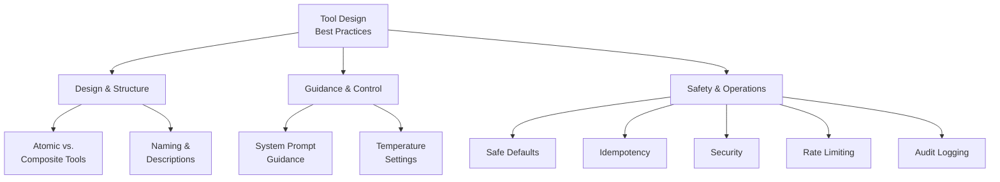

# Tool Design Best Practices

## Overview

Defining tools is only half the challenge — designing them well is what separates fragile demos from production systems. This lesson covers the principles that make tool sets reliable, secure, and maintainable: from how to name and describe functions, to how to handle security, rate limiting, and audit logging.

These best practices apply across all three providers (OpenAI, Anthropic, and Google Gemini) and are grounded in their official documentation and real-world production patterns.

---

## Lesson contents

| # | Topic | Description |
|---|-------|-------------|
| 01 | [Atomic vs. Composite Tools](./01-atomic-vs-composite-tools.md) | Single responsibility, composable primitives, and when to combine |
| 02 | [Naming and Descriptions](./02-naming-and-descriptions.md) | Self-documenting names, comprehensive descriptions, the "intern test" |
| 03 | [System Prompt Guidance](./03-system-prompt-guidance.md) | Instructing the model when to use (and not use) each tool |
| 04 | [Safe Defaults](./04-safe-defaults.md) | Read-before-write, confirmation gates, limited scope |
| 05 | [Temperature Settings](./05-temperature-settings.md) | Provider-specific recommendations for deterministic tool calls |
| 06 | [Idempotency](./06-idempotency.md) | Retry-safe operations, state verification, duplicate prevention |
| 07 | [Security Best Practices](./07-security-best-practices.md) | Auth, input sanitization, data exposure, least privilege |
| 08 | [Rate Limiting](./08-rate-limiting.md) | Per-tool and per-user limits, backpressure, quota management |
| 09 | [Audit Logging](./09-audit-logging.md) | Call and result logging, user attribution, compliance |

---

## The design principles taxonomy

---

## Provider guidance at a glance

All three providers emphasize the same core principles in their official documentation:

| Principle | OpenAI | Anthropic | Gemini |
|-----------|--------|-----------|--------|
| Clear descriptions | "Write clear and detailed function names, parameter descriptions" | "Tool descriptions are shorter than would be ideal to ensure best performance" (their example caveat) | "Be extremely clear and specific in your descriptions" |
| Keep tool count low | "Aim for fewer than 20 functions at any one time" | System prompt overhead: 346 tokens per request | "Aim to keep the active set to a maximum of 10-20" |
| Use enums | "Use enums and object structure to make invalid states unrepresentable" | Strict mode with `strict: true` | "Use an enum to list the allowed values" |
| System prompt guidance | "Describe when (and when not) to use each function" | Use system prompts for tool routing context | "Provide context, give instructions, encourage clarification" |
| Low temperature | Not specified by default | Not specified by default | "Use a low temperature (e.g., 0) for more deterministic and reliable function calls" |
| Gemini 3 caveat | — | — | "Keep temperature at default 1.0 — lower values may cause looping" |
| Validation | "Offload the burden from the model and use code where possible" | Strict mode for schema conformance | "Validate the call with the user before executing it" |
| Security | Implicit via strict mode | "Avoid exposing sensitive data" | "Use appropriate authentication and authorization mechanisms" |

---

## Prerequisites

Before diving into these topics, you should be comfortable with:

- [Lesson 02: Defining Functions](../02-defining-functions/00-defining-functions.md) — Tool schemas
- [Lesson 03: JSON Schema for Parameters](../03-json-schema-for-parameters/00-json-schema-for-parameters.md) — Parameter design
- [Lesson 09: Advanced Patterns](../09-advanced-patterns/00-advanced-patterns.md) — Tool choice, composition, and streaming

---

**Start with:** [Atomic vs. Composite Tools →](./01-atomic-vs-composite-tools.md)

---

[← Previous Lesson: Advanced Patterns](../09-advanced-patterns/00-advanced-patterns.md) | [Unit Overview](../00-overview.md)

<!-- 
Sources Consulted:
- OpenAI Function Calling Guide (Best Practices): https://platform.openai.com/docs/guides/function-calling
- Anthropic Tool Use Overview: https://platform.claude.com/docs/en/agents-and-tools/tool-use/overview
- Google Gemini Function Calling (Best Practices): https://ai.google.dev/gemini-api/docs/function-calling
-->
