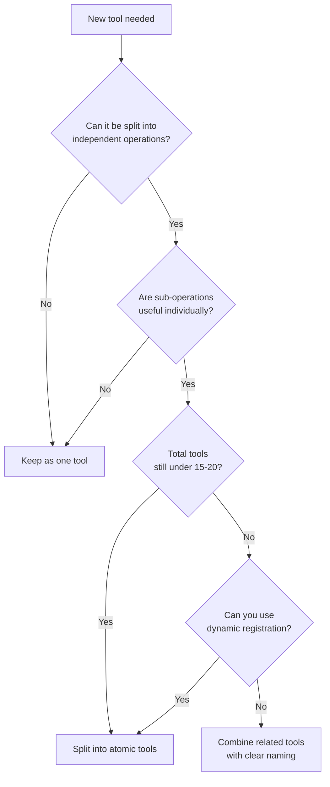

# Atomic vs. Composite Tools

## Introduction

Should `create_order` be one tool that does everything, or should it be decomposed into `validate_cart`, `check_inventory`, `calculate_total`, `process_payment`, and `confirm_order`? This is the fundamental design question for every tool set: **atomic** (single-purpose) vs. **composite** (multi-purpose).

Get it wrong and you'll either overwhelm the model with dozens of tiny tools it can't navigate, or give it monolithic tools it can't use flexibly. The answer, as with most engineering decisions, depends on context — but there are clear principles.

### What we'll cover

- The single responsibility principle for tools
- Building composable tool primitives
- When to combine tools into composites
- Tool count limits and their impact on accuracy
- A framework for deciding tool granularity

### Prerequisites

- [Lesson 02: Defining Functions](../02-defining-functions/00-defining-functions.md) — Tool definitions
- [Function Composition](../09-advanced-patterns/03-function-composition.md) — Chaining tools

---

## The single responsibility principle

Each tool should do **one thing well**. This mirrors the software engineering principle: a function should have one reason to change.

```python
# ❌ Monolithic tool — does too many things
tools = [
    {
        "type": "function",
        "name": "manage_order",
        "description": "Create, update, cancel, or refund an order",
        "parameters": {
            "type": "object",
            "properties": {
                "action": {
                    "type": "string",
                    "enum": ["create", "update", "cancel", "refund"]
                },
                "order_id": {"type": "string"},
                "items": {"type": "array", "items": {"type": "object"}},
                "reason": {"type": "string"},
                "refund_amount": {"type": "number"}
            },
            "required": ["action"]
        }
    }
]
```

The problem: most parameters are only valid for specific actions. `refund_amount` doesn't apply to `create`. `items` doesn't apply to `cancel`. The model has to reason about which parameters to include for which action — an unnecessary burden.

```python
# ✅ Atomic tools — each does one thing
tools = [
    {
        "type": "function",
        "name": "create_order",
        "description": "Create a new order with the given items",
        "parameters": {
            "type": "object",
            "properties": {
                "items": {
                    "type": "array",
                    "items": {
                        "type": "object",
                        "properties": {
                            "product_id": {"type": "string"},
                            "quantity": {"type": "integer"}
                        },
                        "required": ["product_id", "quantity"]
                    }
                }
            },
            "required": ["items"]
        }
    },
    {
        "type": "function",
        "name": "cancel_order",
        "description": "Cancel an existing order by ID",
        "parameters": {
            "type": "object",
            "properties": {
                "order_id": {"type": "string"}
            },
            "required": ["order_id"]
        }
    },
    {
        "type": "function",
        "name": "refund_order",
        "description": "Issue a refund for a cancelled or returned order",
        "parameters": {
            "type": "object",
            "properties": {
                "order_id": {"type": "string"},
                "amount": {"type": "number"},
                "reason": {"type": "string"}
            },
            "required": ["order_id", "amount"]
        }
    }
]
```

Each tool has **only** the parameters it needs. No ambiguity, no invalid states.

---

## Composable primitives

Atomic tools become powerful when they compose. Think of them as LEGO bricks — individually simple, collectively capable:

```python
# Composable primitives for a customer support agent
primitives = [
    # READ operations
    {"name": "get_customer", "description": "Look up customer by ID or email"},
    {"name": "get_order", "description": "Get order details by order ID"},
    {"name": "get_order_history", "description": "List recent orders for a customer"},
    {"name": "check_inventory", "description": "Check if a product is in stock"},
    
    # WRITE operations
    {"name": "update_shipping_address", "description": "Change the shipping address on an order"},
    {"name": "apply_discount", "description": "Apply a discount code to an order"},
    {"name": "initiate_return", "description": "Start a return process for an order"},
    {"name": "issue_refund", "description": "Issue a refund to the customer"},
]
```

The model can compose these as needed:

```
User: "I want to return my last order and get a refund"

Model's plan:
1. get_order_history(customer_id) → finds most recent order
2. get_order(order_id) → confirms order details
3. initiate_return(order_id) → starts the return
4. issue_refund(order_id, amount) → processes the refund
```

No single tool could handle this flexibly. The model sequences them based on what the user actually needs.

---

## When to combine tools

Not everything should be atomic. Here are the clear signals that tools should be combined:

### 1. Tools that are always called together

If `validate_address` is always followed by `geocode_address`, merge them:

```python
# ❌ Always called in sequence
tools = [
    {"name": "validate_address", "description": "Check if address is valid"},
    {"name": "geocode_address", "description": "Get lat/lng for a valid address"}
]

# ✅ Combine — the model never calls geocode without validate
tools = [
    {
        "name": "validate_and_geocode_address",
        "description": (
            "Validate a street address and return its coordinates. "
            "Returns validation errors if the address is invalid, "
            "or lat/lng coordinates if valid."
        ),
        "parameters": {
            "type": "object",
            "properties": {
                "street": {"type": "string"},
                "city": {"type": "string"},
                "state": {"type": "string"},
                "zip": {"type": "string"}
            },
            "required": ["street", "city", "state", "zip"]
        }
    }
]
```

> **Note:** OpenAI specifically recommends this: "Combine functions that are always called in sequence."

### 2. The model already has the information

If you already know the `order_id` from the conversation context, don't make the model pass it:

```python
# ❌ Model has to repeat information it already provided
{"name": "submit_refund", "parameters": {"order_id": "string", "amount": "number"}}

# ✅ Server-side injection — order_id handled by your code
{"name": "submit_refund", "parameters": {"amount": "number"}}

# Your handler fills in order_id from session state
def submit_refund(amount: float, session: Session) -> dict:
    order_id = session.current_order_id  # Already known
    return process_refund(order_id, amount)
```

> **Note:** OpenAI's guidance: "Don't make the model fill arguments you already know."

### 3. Too many tools degrade accuracy

All three providers warn about tool count:

| Provider | Recommendation |
|----------|---------------|
| OpenAI | "Aim for fewer than 20 functions at any one time" |
| Gemini | "Keep the active set to a maximum of 10-20" |
| Anthropic | Each tool adds tokens (346 base + per-tool schema) |

If you have 30+ atomic tools, the model will struggle. Options:
- **Combine** closely related tools
- **Use dynamic registration** to show only relevant tools per turn (see [Lesson 09](../09-advanced-patterns/02-dynamic-registration.md))
- **Group into categories** and provide a category-selection tool first

---

## The granularity decision framework



### Decision checklist

| Question | If Yes → | If No → |
|----------|----------|---------|
| Is the tool useful on its own? | Keep it atomic | Combine with its dependency |
| Are some parameters only valid for certain modes? | Split into separate tools | Keep as one tool |
| Will the model ever call just one of the sub-operations? | Keep them separate | Combine them |
| Does combining reduce your tool count below 20? | Combine | Use dynamic registration instead |
| Are the sub-operations always sequential? | Combine (per OpenAI guidance) | Keep separate for flexibility |

---

## Practical example: designing a file management tool set

Let's apply these principles to a file management assistant:

```python
# Start with atomic primitives
file_tools = [
    {
        "type": "function",
        "name": "list_files",
        "description": "List files in a directory. Returns file names, sizes, and modification dates.",
        "parameters": {
            "type": "object",
            "properties": {
                "directory": {
                    "type": "string",
                    "description": "Absolute path to the directory, e.g. '/home/user/documents'"
                },
                "pattern": {
                    "type": "string",
                    "description": "Glob pattern to filter files, e.g. '*.pdf'"
                }
            },
            "required": ["directory"]
        }
    },
    {
        "type": "function",
        "name": "read_file",
        "description": "Read the contents of a text file. Returns the file content as a string.",
        "parameters": {
            "type": "object",
            "properties": {
                "path": {
                    "type": "string",
                    "description": "Absolute path to the file"
                }
            },
            "required": ["path"]
        }
    },
    {
        "type": "function",
        "name": "write_file",
        "description": "Write content to a file. Creates the file if it doesn't exist, overwrites if it does.",
        "parameters": {
            "type": "object",
            "properties": {
                "path": {"type": "string"},
                "content": {"type": "string"}
            },
            "required": ["path", "content"]
        }
    },
    {
        "type": "function",
        "name": "delete_file",
        "description": "Permanently delete a file. This action cannot be undone.",
        "parameters": {
            "type": "object",
            "properties": {
                "path": {"type": "string"}
            },
            "required": ["path"]
        }
    }
]

# Notice: we did NOT create separate tools for:
# - "check_if_file_exists" → built into read_file's error handling
# - "get_file_size" → returned by list_files
# - "create_directory" → could be added if needed, but not always
# - "rename_file" → separate tool only if independently useful
```

Four tools that cover the core CRUD operations. The model can compose them: list files → read one → modify → write back.

---

## Best practices

| Practice | Why It Matters |
|----------|----------------|
| Start with atomic tools, combine only when needed | Easier to merge later than to split a monolith |
| Each tool should have a single "verb" | `get_`, `create_`, `update_`, `delete_` — not `manage_` |
| Remove parameters the model doesn't need to know | Inject known values server-side from session context |
| Target 8-15 tools for a focused agent | Sweet spot between flexibility and accuracy |
| Use enums to prevent invalid combinations | `"enum": ["create", "update"]` is better than free-text action fields |
| Document which tools compose well together | System prompt can say "Use get_order before issue_refund" |

---

## Common pitfalls

| ❌ Mistake | ✅ Solution |
|-----------|-------------|
| One giant "do everything" tool | Split by verb: create, read, update, delete |
| 40+ atomic tools overwhelming the model | Group related ones, use dynamic registration |
| Tools with parameters that are only sometimes valid | Split into separate tools per action |
| Making the model provide data your app already has | Inject `user_id`, `session_id`, etc. server-side |
| Splitting tools that are never used independently | Combine tools that are always called together |

---

## Hands-on exercise

### Your task

Design a tool set for a **restaurant reservation assistant** that can:
- Search for available restaurants by cuisine and location
- Check table availability for a specific restaurant, date, and party size
- Make a reservation
- Modify an existing reservation (date, time, or party size)
- Cancel a reservation

### Requirements

1. Apply the single responsibility principle
2. Keep the total tool count under 10
3. Each tool should have clear, non-overlapping parameters
4. Consider which operations compose naturally

### Expected result

A list of 4-6 tool definitions (names + descriptions + parameters) that cover all five capabilities without any "manage_reservation" catch-all.

<details>
<summary>💡 Hints (click to expand)</summary>

- "Modify" and "cancel" are clearly separate actions (different parameters)
- "Search" and "check availability" might feel similar but have different inputs/outputs
- The reservation ID flows from "make" to "modify" and "cancel"
- Consider whether the model needs a `get_reservation` tool or if it comes from context

</details>

<details>
<summary>✅ Solution (click to expand)</summary>

```python
reservation_tools = [
    {
        "type": "function",
        "name": "search_restaurants",
        "description": (
            "Search for restaurants by cuisine type and/or location. "
            "Returns a list of matching restaurants with names, addresses, "
            "and cuisine types."
        ),
        "parameters": {
            "type": "object",
            "properties": {
                "cuisine": {
                    "type": "string",
                    "description": "Type of cuisine, e.g. 'Italian', 'Japanese', 'Mexican'"
                },
                "location": {
                    "type": "string",
                    "description": "City or neighborhood, e.g. 'Downtown Seattle'"
                }
            },
            "required": ["location"]
        }
    },
    {
        "type": "function",
        "name": "check_availability",
        "description": (
            "Check table availability at a specific restaurant for a given "
            "date, time, and party size. Returns available time slots."
        ),
        "parameters": {
            "type": "object",
            "properties": {
                "restaurant_id": {"type": "string"},
                "date": {
                    "type": "string",
                    "description": "Date in YYYY-MM-DD format"
                },
                "time": {
                    "type": "string",
                    "description": "Preferred time in HH:MM format (24-hour)"
                },
                "party_size": {
                    "type": "integer",
                    "description": "Number of guests (1-20)"
                }
            },
            "required": ["restaurant_id", "date", "time", "party_size"]
        }
    },
    {
        "type": "function",
        "name": "make_reservation",
        "description": (
            "Book a table at a restaurant. Returns a confirmation "
            "with a reservation ID."
        ),
        "parameters": {
            "type": "object",
            "properties": {
                "restaurant_id": {"type": "string"},
                "date": {"type": "string"},
                "time": {"type": "string"},
                "party_size": {"type": "integer"},
                "guest_name": {"type": "string"},
                "special_requests": {
                    "type": ["string", "null"],
                    "description": "Dietary restrictions, accessibility needs, etc."
                }
            },
            "required": [
                "restaurant_id", "date", "time",
                "party_size", "guest_name", "special_requests"
            ]
        }
    },
    {
        "type": "function",
        "name": "modify_reservation",
        "description": (
            "Change the date, time, or party size of an existing "
            "reservation. Cannot change the restaurant."
        ),
        "parameters": {
            "type": "object",
            "properties": {
                "reservation_id": {"type": "string"},
                "new_date": {"type": ["string", "null"]},
                "new_time": {"type": ["string", "null"]},
                "new_party_size": {"type": ["integer", "null"]}
            },
            "required": [
                "reservation_id", "new_date",
                "new_time", "new_party_size"
            ]
        }
    },
    {
        "type": "function",
        "name": "cancel_reservation",
        "description": "Cancel an existing reservation by its ID.",
        "parameters": {
            "type": "object",
            "properties": {
                "reservation_id": {"type": "string"}
            },
            "required": ["reservation_id"]
        }
    }
]
# 5 tools — clean, composable, no overlap
```

</details>

### Bonus challenges

- [ ] Add a `get_reservation` tool and decide whether it's necessary or redundant
- [ ] Reduce to 4 tools by combining the two operations that most naturally pair
- [ ] Add a 6th tool for "waitlist" functionality and evaluate if the set is still clean

---

## Summary

✅ **Single responsibility** — each tool should do one thing with only the parameters it needs

✅ **Compose, don't monolith** — atomic tools combine to handle complex workflows

✅ **Combine when always sequential** — tools that are never called independently should be merged

✅ **Inject known values server-side** — don't make the model repeat information your app already has

✅ **Target 8-15 tools** for focused agents — all three providers recommend under 20

✅ Start atomic, combine only when accuracy or tool count demands it

**Next:** [Naming and Descriptions →](./02-naming-and-descriptions.md)

---

[← Previous: Lesson Overview](./00-tool-design-best-practices.md) | [Back to Lesson Overview](./00-tool-design-best-practices.md)

<!-- 
Sources Consulted:
- OpenAI Function Calling Guide (Best Practices): https://platform.openai.com/docs/guides/function-calling
- Google Gemini Function Calling (Best Practices): https://ai.google.dev/gemini-api/docs/function-calling
- Anthropic Tool Use Overview: https://platform.claude.com/docs/en/agents-and-tools/tool-use/overview
-->
