# Model Context Protocol (MCP)

## Introduction

Every AI tool integration you've built so far has been hand-wired — you define function schemas, register handlers, and connect them to a specific provider's API. What happens when you want to switch providers, share tools across projects, or connect to third-party tool servers without rewriting everything? That's the problem the **Model Context Protocol (MCP)** solves.

MCP is an open standard created by Anthropic and now maintained under the Linux Foundation that provides a universal protocol for connecting AI applications to external tools, data sources, and services. Think of it as **USB-C for AI** — one standardized interface that works everywhere, regardless of which model or host application you're using.

### What we'll cover

In this lesson, we explore MCP end-to-end:

- **What MCP is** and why the industry is adopting it
- **Architecture**: hosts, clients, and servers
- **Server primitives**: tools, resources, and prompts
- **Building MCP servers** with the Python SDK
- **Implementing MCP clients** that discover and call tools
- **SDK integration** across OpenAI, Anthropic, and Google Gemini
- **Ecosystem, limitations, and security** considerations

### Prerequisites

- Solid understanding of function calling (Lessons 01–05 in this unit)
- Python async/await fundamentals
- Familiarity with JSON Schema for tool definitions
- Experience with at least one AI provider SDK (OpenAI, Anthropic, or Google)

---

## Why MCP matters

Before MCP, every integration between an AI model and an external service required custom code. If you built a database query tool for OpenAI, you couldn't reuse it with Claude or Gemini without rewriting the integration layer. This created an **M×N problem** — M AI applications times N tool providers, each needing a unique connector.

MCP transforms this into an **M+N solution**. Each application implements the MCP client protocol once, and each tool provider implements an MCP server once. Any client can then communicate with any server through the standardized protocol.

### Industry adoption

MCP has gained rapid adoption across the AI ecosystem:

| Organization | MCP Support | Details |
|---|---|---|
| **Anthropic** | Native | Claude Desktop, Claude Code, and the Anthropic SDK all support MCP natively |
| **OpenAI** | Responses API | Built-in `mcp` tool type connects to remote MCP servers via the Responses API |
| **Google** | Gemini SDK | Pass `ClientSession` directly as a tool in the Gemini Python SDK |
| **Microsoft** | VS Code / Copilot | GitHub Copilot and VS Code support MCP server connections |
| **Development Tools** | Broad | Cursor, Windsurf, Zed, and other AI-native editors integrate MCP |

> **🤖 AI Context:** MCP is on track to become the standard interface layer for AI tool integration — much like HTTP standardized web communication. Understanding MCP positions you to build portable, interoperable AI applications.

---

## MCP at a glance

The protocol operates on a **client-server architecture** using **JSON-RPC 2.0** for message exchange. Here's a high-level overview of how the pieces fit together:

```mermaid
flowchart TD
    Host["🖥️ Host Application<br/>(Claude Desktop, IDE, Custom App)"]
    Host --> Client1["MCP Client 1"]
    Host --> Client2["MCP Client 2"]
    Client1 <-->|"JSON-RPC 2.0<br/>(stdio / HTTP)"| Server1["MCP Server A<br/>(Database Tools)"]
    Client2 <-->|"JSON-RPC 2.0<br/>(stdio / HTTP)"| Server2["MCP Server B<br/>(File System Tools)"]
    Server1 --> DB[(Database)]
    Server2 --> FS[📁 File System]
```

**Three key roles:**

| Role | Responsibility | Example |
|------|----------------|---------|
| **Host** | The AI application that initiates connections | Claude Desktop, VS Code, your custom app |
| **Client** | Manages a 1:1 connection with one MCP server | SDK-managed (e.g., `ClientSession`) |
| **Server** | Exposes tools, resources, and prompts | A weather server, a database server |

MCP servers expose three types of **primitives** to clients:

| Primitive | Purpose | Controlled By | Example |
|-----------|---------|---------------|---------|
| **Tools** | Functions the LLM can invoke | Model decides | `searchFlights()`, `queryDatabase()` |
| **Resources** | Read-only data for context | Application decides | `file:///docs/readme.md`, `db://schema` |
| **Prompts** | Reusable interaction templates | User selects | "Plan a vacation", "Summarize meetings" |

---

## Lesson roadmap

This lesson is organized into six focused sub-lessons:

| # | Sub-Lesson | What You'll Learn |
|---|------------|-------------------|
| 01 | [Architecture and transports](./01-architecture-and-transports.md) | Host/client/server roles, JSON-RPC 2.0, stdio vs Streamable HTTP, protocol lifecycle |
| 02 | [Server primitives](./02-server-primitives.md) | Tools, resources, and prompts — how servers expose capabilities |
| 03 | [Building MCP servers](./03-building-mcp-servers.md) | Python SDK (`FastMCP`), tool registration, server structure, testing |
| 04 | [Client implementation](./04-client-implementation.md) | `ClientSession`, tool discovery, tool execution, query processing |
| 05 | [SDK integration](./05-sdk-integration.md) | Built-in MCP support in OpenAI, Anthropic, and Google Gemini SDKs |
| 06 | [Ecosystem and security](./06-ecosystem-and-security.md) | Community servers, current limitations, MCP vs function calling, security |

---

## Summary

✅ MCP is an open standard that provides a universal protocol for AI-tool integration — "USB-C for AI"

✅ It transforms the M×N integration problem into an M+N solution through standardized client-server communication

✅ All major AI providers (OpenAI, Anthropic, Google) now support MCP in their SDKs

✅ MCP servers expose three primitives: tools (model-controlled actions), resources (application-controlled data), and prompts (user-controlled templates)

✅ The protocol uses JSON-RPC 2.0 over stdio (local) or Streamable HTTP (remote) transports

**Next:** [Architecture and Transports →](./01-architecture-and-transports.md)

---

## Further Reading

- [MCP Official Introduction](https://modelcontextprotocol.io/introduction) - The authoritative overview from the MCP project
- [MCP Specification](https://spec.modelcontextprotocol.io/) - Full protocol specification
- [MCP GitHub Organization](https://github.com/modelcontextprotocol) - SDKs, servers, and examples
- [OpenAI Connectors and MCP](https://platform.openai.com/docs/guides/tools-connectors-mcp) - OpenAI's MCP integration guide

---

*Previous:* [Tool Design Best Practices](../10-tool-design-best-practices/05-testing-and-monitoring-tools.md) | *Next:* [Architecture and Transports →](./01-architecture-and-transports.md)

<!--
Sources Consulted:
- MCP Introduction: https://modelcontextprotocol.io/introduction
- MCP Architecture: https://modelcontextprotocol.io/docs/learn/architecture
- MCP Server Concepts: https://modelcontextprotocol.io/docs/learn/server-concepts
- OpenAI Connectors and MCP: https://platform.openai.com/docs/guides/tools-connectors-mcp
- Google Gemini Function Calling (MCP section): https://ai.google.dev/gemini-api/docs/function-calling
-->
