# Architecture and Transports

## Introduction

Understanding MCP's architecture is essential before writing a single line of integration code. MCP isn't just another API wrapper — it's a **stateful protocol** built on JSON-RPC 2.0 with a well-defined lifecycle, capability negotiation, and multiple transport options. In this sub-lesson, we break down how hosts, clients, and servers interact, how messages flow between them, and how to choose the right transport for your deployment.

### What we'll cover

- The three-role architecture: hosts, clients, and servers
- JSON-RPC 2.0 message format and protocol structure
- Transport layers: stdio (local) and Streamable HTTP (remote)
- The MCP lifecycle: initialization, capability negotiation, and operation
- How tool discovery and invocation work at the protocol level

### Prerequisites

- Completed the [MCP overview](./00-model-context-protocol-mcp.md)
- Basic understanding of client-server communication patterns
- Familiarity with JSON and HTTP concepts

---

## The three-role architecture

MCP defines three distinct roles that work together to connect AI models with external capabilities.

### Hosts

A **host** is the AI application that users interact with directly. It creates and manages one or more MCP clients, each connecting to a different server. The host is responsible for:

- User interaction (UI, chat interface)
- Managing AI model access (API keys, model selection)
- Coordinating between multiple MCP clients
- Enforcing security policies and user consent

Examples of hosts include Claude Desktop, VS Code with Copilot, Cursor, and any custom AI application you build.

### Clients

A **client** maintains a 1:1 connection with a single MCP server. The client is typically managed by an SDK (like the `mcp` Python package) and handles:

- Establishing the transport connection
- Protocol lifecycle management (initialization, capability exchange)
- Sending requests and receiving responses
- Routing notifications between host and server

> **Note:** Each client connects to exactly one server. If your host needs to communicate with three different MCP servers (say, a database server, a file system server, and a weather server), it creates three separate client instances.

### Servers

A **server** exposes capabilities — tools, resources, and prompts — to clients through the MCP protocol. Servers are lightweight programs that:

- Register and expose tool definitions
- Handle tool execution requests
- Provide data through resources
- Offer reusable prompt templates
- Manage their own external connections (databases, APIs, file systems)

```mermaid
flowchart TD
    User([👤 User]) --> Host

    subgraph Host["Host Application"]
        AI[AI Model / LLM]
        C1[MCP Client 1]
        C2[MCP Client 2]
        C3[MCP Client 3]
    end

    C1 <-->|"1:1 Connection"| S1["MCP Server<br/>📁 Filesystem"]
    C2 <-->|"1:1 Connection"| S2["MCP Server<br/>🗄️ Database"]
    C3 <-->|"1:1 Connection"| S3["MCP Server<br/>🌐 Web APIs"]

    S1 --> FS[Local Files]
    S2 --> DB[(PostgreSQL)]
    S3 --> API[External APIs]
```



### Separation of concerns

This three-layer design creates a clean separation:

| Concern | Who Handles It |
|---------|---------------|
| User interaction, consent | Host |
| Protocol management, message routing | Client |
| Tool logic, data access | Server |
| Security policies | Host + Server |
| Model selection, API keys | Host |
| External service connections | Server |

---

## JSON-RPC 2.0: the message format

All MCP communication uses **JSON-RPC 2.0**, a lightweight remote procedure call protocol. Every message is a JSON object with a specific structure.

### Request messages

A client or server sends a request when it expects a response:

```json
{
  "jsonrpc": "2.0",
  "id": 1,
  "method": "tools/list",
  "params": {}
}
```

**Key fields:**
- `jsonrpc` — Always `"2.0"`
- `id` — A unique identifier for matching requests to responses
- `method` — The MCP method being called (e.g., `tools/list`, `tools/call`)
- `params` — Method-specific parameters (optional)

### Response messages

The receiving end replies with a response that includes the same `id`:

```json
{
  "jsonrpc": "2.0",
  "id": 1,
  "result": {
    "tools": [
      {
        "name": "get_weather",
        "description": "Get weather forecast for a location",
        "inputSchema": {
          "type": "object",
          "properties": {
            "city": { "type": "string" }
          },
          "required": ["city"]
        }
      }
    ]
  }
}
```

### Notification messages

Notifications are one-way messages that don't expect a response — no `id` field:

```json
{
  "jsonrpc": "2.0",
  "method": "notifications/tools/list_changed"
}
```

Servers send notifications to inform clients of changes (e.g., a tool was added or removed), and clients can then re-fetch the tool list.

### Error responses

When something goes wrong, the response includes an `error` object instead of `result`:

```json
{
  "jsonrpc": "2.0",
  "id": 1,
  "error": {
    "code": -32602,
    "message": "Invalid params: missing required field 'city'"
  }
}
```

> **Tip:** Standard JSON-RPC error codes apply: `-32700` (parse error), `-32600` (invalid request), `-32601` (method not found), `-32602` (invalid params), `-32603` (internal error).

---

## Transport layers

MCP defines two standard transports for client-server communication. The transport layer handles how JSON-RPC messages are physically sent and received.

### stdio: local process communication

With **stdio transport**, the client launches the MCP server as a **subprocess** and communicates through standard input/output streams:


**How it works:**
- Each message is a single JSON-RPC object on one line (newline-delimited)
- Messages **must not** contain embedded newlines
- The server reads from `stdin` and writes to `stdout`
- Logging goes to `stderr` only — writing anything else to `stdout` corrupts the protocol

**When to use stdio:**
- Local tool servers running on the same machine
- Development and testing
- IDE integrations (VS Code, Cursor)
- When you want process-level isolation

```python
from mcp import StdioServerParameters

# Client-side: define how to launch the server
server_params = StdioServerParameters(
    command="python",           # or "node", "uv", etc.
    args=["weather_server.py"], # path to server script
    env=None                    # optional environment variables
)
```

> **Warning:** In Python MCP servers using stdio, **never use `print()`**. It writes to `stdout` and corrupts JSON-RPC messages. Use `logging` (which writes to `stderr`) instead.

### Streamable HTTP: remote server communication

**Streamable HTTP** is the transport for remote MCP servers accessible over the network. It replaced the earlier "HTTP with SSE" transport starting with protocol version `2025-03-26`.

**How it works:**
- The server exposes a single HTTP endpoint (e.g., `https://example.com/mcp`)
- Clients send JSON-RPC messages via **HTTP POST** requests
- Servers respond with either `application/json` (single response) or `text/event-stream` (SSE stream for multiple messages)
- Clients can optionally **GET** the endpoint to open an SSE stream for server-initiated messages


**Key features:**
- **Session management**: Servers can assign a session ID via the `Mcp-Session-Id` header, creating stateful connections
- **Resumability**: SSE events can include IDs for reconnection, and clients can send `Last-Event-ID` to resume
- **Protocol version header**: Clients include `MCP-Protocol-Version: 2025-06-18` in requests

**When to use Streamable HTTP:**
- Remote tool servers accessible over the internet
- Multi-tenant server deployments
- Production environments requiring authentication
- When multiple clients need to share one server

### Choosing the right transport

| Criteria | stdio | Streamable HTTP |
|----------|-------|-----------------|
| **Deployment** | Local process | Remote server |
| **Latency** | Very low (IPC) | Network dependent |
| **Isolation** | Process-level | Network-level |
| **Authentication** | Environment-based | OAuth 2.1 / tokens |
| **Multi-client** | No (1:1 process) | Yes |
| **Use case** | Dev tools, IDEs | Production, cloud |

---

## The MCP lifecycle

Every MCP connection follows a defined lifecycle: initialization, operation, and shutdown.

### Phase 1: initialization

The client sends an `initialize` request with its capabilities and protocol version. The server responds with its own capabilities:

```json
// Client → Server
{
  "jsonrpc": "2.0",
  "id": 1,
  "method": "initialize",
  "params": {
    "protocolVersion": "2025-06-18",
    "capabilities": {
      "sampling": {}
    },
    "clientInfo": {
      "name": "MyAIApp",
      "version": "1.0.0"
    }
  }
}
```

```json
// Server → Client
{
  "jsonrpc": "2.0",
  "id": 1,
  "result": {
    "protocolVersion": "2025-06-18",
    "capabilities": {
      "tools": { "listChanged": true }
    },
    "serverInfo": {
      "name": "weather-server",
      "version": "2.0.0"
    }
  }
}
```

After receiving the server's response, the client sends an `initialized` notification to signal that it's ready:

```json
{
  "jsonrpc": "2.0",
  "method": "notifications/initialized"
}
```

### Phase 2: capability negotiation

During initialization, both sides declare what they support. This is critical because not every client or server implements every MCP feature:

| Capability | Direction | Meaning |
|------------|-----------|---------|
| `tools` | Server → Client | Server offers callable tools |
| `tools.listChanged` | Server → Client | Server will notify when tools change |
| `resources` | Server → Client | Server offers data resources |
| `prompts` | Server → Client | Server offers prompt templates |
| `sampling` | Client → Server | Client can fulfill LLM completion requests |
| `elicitation` | Client → Server | Client can request user input on behalf of server |

### Phase 3: operation

Once initialized, the client and server exchange messages freely. The most common operations involve tool discovery and execution:


### Phase 4: shutdown

For stdio transport, the client closes `stdin` and terminates the subprocess. For Streamable HTTP, the client sends an HTTP `DELETE` request with the session ID to explicitly end the session.

---

## Tool discovery and invocation protocol

Understanding the exact protocol messages for tools helps you debug integrations and build custom solutions.

### Discovering tools: `tools/list`

The client requests available tools:

```json
// Request
{ "jsonrpc": "2.0", "id": 2, "method": "tools/list" }

// Response
{
  "jsonrpc": "2.0",
  "id": 2,
  "result": {
    "tools": [
      {
        "name": "get_forecast",
        "title": "Weather Forecast",
        "description": "Get weather forecast for a location",
        "inputSchema": {
          "type": "object",
          "properties": {
            "latitude": { "type": "number", "description": "Latitude" },
            "longitude": { "type": "number", "description": "Longitude" }
          },
          "required": ["latitude", "longitude"]
        }
      }
    ]
  }
}
```

Each tool definition includes:
- `name` — Unique identifier for invoking the tool
- `title` — Human-readable display name (optional)
- `description` — What the tool does (used by the LLM to decide when to call it)
- `inputSchema` — JSON Schema describing the expected arguments

### Invoking tools: `tools/call`

When the LLM decides to use a tool, the client sends a `tools/call` request:

```json
// Request
{
  "jsonrpc": "2.0",
  "id": 3,
  "method": "tools/call",
  "params": {
    "name": "get_forecast",
    "arguments": {
      "latitude": 40.7128,
      "longitude": -74.0060
    }
  }
}
```

```json
// Response
{
  "jsonrpc": "2.0",
  "id": 3,
  "result": {
    "content": [
      {
        "type": "text",
        "text": "Today: 72°F, partly cloudy. Tonight: 58°F, clear skies."
      }
    ]
  }
}
```

The `content` array can contain multiple items of different types — text, images, or resource references — giving servers flexibility in what they return.

---

## Best practices

| Practice | Why It Matters |
|----------|----------------|
| Declare capabilities accurately | Prevents clients from requesting unsupported features |
| Use stdio for local development | Simpler setup, no network configuration needed |
| Use Streamable HTTP for production | Supports authentication, multi-client, and session management |
| Never write to `stdout` in stdio servers | Corrupts JSON-RPC message stream |
| Handle `notifications/tools/list_changed` | Keeps tool lists fresh when servers update dynamically |
| Validate protocol version during init | Ensures client and server speak the same protocol dialect |

---

## Common pitfalls

| ❌ Mistake | ✅ Solution |
|-----------|-------------|
| Using `print()` in Python stdio servers | Use `logging.info()` which writes to `stderr` |
| Ignoring capability negotiation | Always check server capabilities before calling features |
| Hardcoding tool lists | Use `tools/list` for dynamic discovery; handle `list_changed` |
| Not handling initialization errors | Wrap `session.initialize()` in try/except for graceful fallback |
| Mixing transport assumptions | Check transport type before applying stdio-specific or HTTP-specific logic |
| Skipping session cleanup | Always close connections — use `AsyncExitStack` for resource management |

---

## Hands-on exercise

### Your task

Trace through an MCP initialization and tool call sequence by hand. Given the messages below, identify what role sends each message, what phase of the lifecycle it belongs to, and what the expected next message would be.

### Requirements

1. Read each JSON-RPC message below
2. Label it as: Request, Response, or Notification
3. Identify the sender: Client or Server
4. Name the lifecycle phase: Initialization, Operation, or Shutdown
5. Write the expected next message for Message C

**Message A:**
```json
{"jsonrpc": "2.0", "id": 1, "method": "initialize", "params": {"protocolVersion": "2025-06-18", "capabilities": {"sampling": {}}, "clientInfo": {"name": "TestApp", "version": "1.0"}}}
```

**Message B:**
```json
{"jsonrpc": "2.0", "id": 1, "result": {"protocolVersion": "2025-06-18", "capabilities": {"tools": {"listChanged": true}}, "serverInfo": {"name": "weather", "version": "2.0"}}}
```

**Message C:**
```json
{"jsonrpc": "2.0", "method": "notifications/initialized"}
```

### Expected result

You should be able to identify all three message types, their senders, lifecycle phases, and write a valid `tools/list` request as the next message.

<details>
<summary>💡 Hints (click to expand)</summary>

- Message A has an `id` and a `method` — what type of JSON-RPC message has both?
- Message B has an `id` and a `result` — who sends results?
- Message C has no `id` — what does that make it?
- After initialization completes, what's the first thing a client typically does?

</details>

<details>
<summary>✅ Solution (click to expand)</summary>

| Message | Type | Sender | Phase |
|---------|------|--------|-------|
| A | Request | Client | Initialization |
| B | Response | Server | Initialization |
| C | Notification | Client | Initialization (completing) |

**Next expected message (from Client):**
```json
{"jsonrpc": "2.0", "id": 2, "method": "tools/list", "params": {}}
```

This begins the **Operation** phase — the client discovers what tools the server offers.

</details>

### Bonus challenges

- [ ] Draw a complete sequence diagram for a multi-tool scenario where the client calls two tools sequentially
- [ ] Write the JSON-RPC messages for a `notifications/tools/list_changed` flow where the server adds a new tool

---

## Summary

✅ MCP uses a three-role architecture: **hosts** manage the application, **clients** handle protocol connections, and **servers** expose capabilities

✅ All communication uses **JSON-RPC 2.0** with requests (id + method), responses (id + result), and notifications (method only)

✅ **stdio** transport is ideal for local development — the client launches the server as a subprocess and communicates via stdin/stdout

✅ **Streamable HTTP** transport supports remote servers with session management, SSE streaming, and OAuth 2.1 authentication

✅ The lifecycle follows a strict sequence: **initialize** → **capability negotiation** → **operation** → **shutdown**

✅ Tool discovery uses `tools/list` and tool invocation uses `tools/call` — both return structured JSON-RPC responses

**Next:** [Server Primitives →](./02-server-primitives.md)

---

*Previous:* [MCP Overview](./00-model-context-protocol-mcp.md) | *Next:* [Server Primitives →](./02-server-primitives.md)

<!--
Sources Consulted:
- MCP Architecture: https://modelcontextprotocol.io/docs/learn/architecture
- MCP Transports Specification: https://modelcontextprotocol.io/specification/2025-06-18/basic/transports
- MCP Authorization: https://modelcontextprotocol.io/specification/2025-06-18/basic/authorization
- MCP Build Server Guide: https://modelcontextprotocol.io/docs/develop/build-server
- MCP Build Client Guide: https://modelcontextprotocol.io/docs/develop/build-client
-->
