# Server Primitives: Tools, Resources, and Prompts

## Introduction

MCP servers don't just expose random functionality — they organize capabilities into three distinct **primitives**, each serving a different purpose and controlled by a different part of the system. Understanding these primitives is fundamental to designing effective MCP servers and knowing when to use tools versus resources versus prompts.

In this sub-lesson, we explore each primitive in depth: how it works at the protocol level, what it looks like in practice, and how the three primitives work together in real-world scenarios.

### What we'll cover

- **Tools**: model-controlled functions with JSON Schema inputs
- **Resources**: application-controlled data sources with URI-based access
- **Prompts**: user-controlled interaction templates with arguments
- How the three primitives interact in a complete workflow
- Protocol operations for each primitive

### Prerequisites

- Completed [Architecture and Transports](./01-architecture-and-transports.md)
- Understanding of JSON Schema basics
- Familiarity with URI patterns

---

## Tools: actions the model can take

**Tools** are the most commonly used MCP primitive. They represent executable functions that the LLM can decide to invoke based on the user's request. Tools are **model-controlled** — the AI decides when and how to use them.

### How tools work

Each tool has a **name**, a **description** (which the LLM reads to decide when to call it), and an **input schema** (a JSON Schema defining expected parameters). When the LLM decides a tool is needed, the client sends a `tools/call` request to the server.


### Protocol operations

| Method | Purpose | Returns |
|--------|---------|---------|
| `tools/list` | Discover available tools | Array of tool definitions with schemas |
| `tools/call` | Execute a specific tool | Tool execution result (content array) |

### Tool definition structure

A tool definition tells the LLM everything it needs to decide whether and how to call the tool:

```json
{
  "name": "searchFlights",
  "title": "Search Flights",
  "description": "Search for available flights between two cities on a specific date",
  "inputSchema": {
    "type": "object",
    "properties": {
      "origin": {
        "type": "string",
        "description": "Departure city or airport code (e.g., 'NYC' or 'JFK')"
      },
      "destination": {
        "type": "string",
        "description": "Arrival city or airport code (e.g., 'Barcelona' or 'BCN')"
      },
      "date": {
        "type": "string",
        "format": "date",
        "description": "Travel date in YYYY-MM-DD format"
      }
    },
    "required": ["origin", "destination", "date"]
  }
}
```

**Key fields:**
- `name` — Unique identifier used in `tools/call` requests. Use `snake_case` or `camelCase` without spaces
- `title` — Optional human-readable display name
- `description` — **Critical for the LLM**. This is what the model reads to decide when to use the tool. Be specific and include examples
- `inputSchema` — Standard JSON Schema. Include `description` for each property to help the LLM provide correct values

### Tool execution and results

When invoking a tool, the server returns a `content` array that can contain multiple items:

```json
{
  "content": [
    {
      "type": "text",
      "text": "Found 3 flights:\n1. AA101 - $450 - Departs 8:00 AM\n2. BA202 - $520 - Departs 11:30 AM\n3. IB303 - $380 - Departs 3:15 PM"
    }
  ]
}
```

Content items can be different types:

| Content Type | Use Case | Example |
|---|---|---|
| `text` | Plain text results | Search results, calculations, status messages |
| `image` | Visual output | Charts, screenshots, generated images |
| `resource` | Reference to a resource | Link to a document or data source |

### User interaction model for tools

While the model decides *when* to call tools, MCP emphasizes **human oversight**. Applications should implement:

- **Tool visibility** — Show users which tools are available
- **Approval dialogs** — Confirm before executing sensitive operations
- **Permission settings** — Pre-approve safe operations (like read-only queries)
- **Activity logs** — Record all tool executions and their results

> **Important:** Tools may require user consent before execution. This is especially critical for tools that modify data, send communications, or access sensitive information.

---

## Resources: data for context

**Resources** provide structured, read-only access to data that the AI application can retrieve and use as context. Unlike tools (which perform actions), resources simply **expose information**. Resources are **application-controlled** — the host application decides which resources to fetch and how to use them.

### How resources work

Each resource has a unique **URI** (like `file:///docs/readme.md` or `db://schema/users`) and a declared **MIME type**. Resources support two discovery patterns:

1. **Direct resources** — Fixed URIs pointing to specific data
2. **Resource templates** — Dynamic URIs with parameters for flexible queries


### Protocol operations

| Method | Purpose | Returns |
|--------|---------|---------|
| `resources/list` | List available direct resources | Array of resource descriptors |
| `resources/templates/list` | Discover resource templates | Array of template definitions |
| `resources/read` | Retrieve resource contents | Resource data with metadata |
| `resources/subscribe` | Monitor resource changes | Subscription confirmation |

### Direct resource example

A direct resource has a fixed URI:

```json
{
  "uri": "calendar://events/2024",
  "name": "calendar-2024",
  "title": "2024 Calendar Events",
  "description": "All calendar events for 2024",
  "mimeType": "application/json"
}
```

### Resource template example

A resource template uses URI parameters for dynamic access:

```json
{
  "uriTemplate": "weather://forecast/{city}/{date}",
  "name": "weather-forecast",
  "title": "Weather Forecast",
  "description": "Get weather forecast for any city and date",
  "mimeType": "application/json"
}
```

Templates enable flexible queries — `weather://forecast/london/2025-03-15` returns the London forecast for that date. Templates also support **parameter completion**, where the server suggests valid values as the user types (e.g., typing "Par" suggests "Paris" or "Park City").

### How resources differ from tools

| Aspect | Tools | Resources |
|--------|-------|-----------|
| **Purpose** | Perform actions | Provide data |
| **Read/Write** | Can modify state | Read-only |
| **Controlled by** | Model decides when to call | Application decides what to fetch |
| **Discovery** | `tools/list` | `resources/list` + `resources/templates/list` |
| **Invocation** | `tools/call` with arguments | `resources/read` with URI |
| **Use case** | Send email, query API | Load document, read schema |

### User interaction model for resources

Applications have flexibility in how they present resources:

- **Tree/list views** for browsing in folder-like structures
- **Search and filter** interfaces for finding specific resources
- **Automatic context inclusion** based on conversation relevance
- **Bulk selection** for including multiple resources at once

> **🤖 AI Context:** Resources are how you give an LLM **background knowledge** — database schemas, configuration files, past conversations — without the LLM having to "ask" for it through tool calls.

---

## Prompts: reusable interaction templates

**Prompts** are structured templates that define parameterized interaction patterns. They're **user-controlled** — rather than the model automatically invoking them, the user explicitly selects a prompt to guide the conversation.

### How prompts work

Each prompt has a name, a description, and optional arguments. When the user selects a prompt, the client fetches its full definition and uses it to structure the interaction:


### Protocol operations

| Method | Purpose | Returns |
|--------|---------|---------|
| `prompts/list` | Discover available prompts | Array of prompt descriptors |
| `prompts/get` | Retrieve prompt details | Full prompt definition with arguments |

### Prompt definition example

```json
{
  "name": "plan-vacation",
  "title": "Plan a Vacation",
  "description": "Guide through vacation planning process",
  "arguments": [
    {
      "name": "destination",
      "type": "string",
      "required": true
    },
    {
      "name": "duration",
      "type": "number",
      "description": "Number of days"
    },
    {
      "name": "budget",
      "type": "number",
      "required": false
    },
    {
      "name": "interests",
      "type": "array",
      "items": { "type": "string" }
    }
  ]
}
```

When invoked with arguments like `{destination: "Barcelona", duration: 7, budget: 3000, interests: ["beaches", "architecture"]}`, the server returns a structured set of messages that the application sends to the LLM — possibly including instructions to use specific tools and resources.

### User interaction model for prompts

Since prompts are user-controlled, applications typically expose them through:

- **Slash commands** — Typing `/` shows available prompts (e.g., `/plan-vacation`)
- **Command palettes** — Searchable list of all prompts
- **UI buttons** — Dedicated buttons for frequently used prompts
- **Context menus** — Suggest relevant prompts based on current conversation

> **Note:** Prompts are fundamentally different from "system prompts" or "prompt engineering." MCP prompts are **discoverable, parameterized templates** that server authors provide to help users get the most out of their MCP server.

---

## Bringing it all together: multi-server workflows

The real power of MCP emerges when tools, resources, and prompts from multiple servers work together. Here's how a travel planning scenario combines all three primitives:

```mermaid
flowchart TD
    User([👤 User]) -->|"Selects prompt"| Prompt["📋 Prompt<br/>plan-vacation<br/>(Travel Server)"]

    Prompt -->|"Structured interaction"| LLM[🤖 AI Model]

    LLM -->|"Reads context"| R1["📄 Resource<br/>calendar://events/June<br/>(Calendar Server)"]
    LLM -->|"Reads context"| R2["📄 Resource<br/>travel://preferences<br/>(Travel Server)"]

    LLM -->|"Calls tool"| T1["🔧 Tool<br/>searchFlights()<br/>(Travel Server)"]
    LLM -->|"Calls tool"| T2["🔧 Tool<br/>checkWeather()<br/>(Weather Server)"]
    LLM -->|"Calls tool"| T3["🔧 Tool<br/>createCalendarEvent()<br/>(Calendar Server)"]

    T1 --> Result["✅ Complete Trip Plan"]
    T2 --> Result
    T3 --> Result
    R1 --> LLM
    R2 --> LLM
```



**The complete flow:**

1. **User invokes the prompt** `plan-vacation` with parameters (Barcelona, 7 days, $3000)
2. **Application fetches resources** — calendar availability, travel preferences, past trip history
3. **LLM uses tools** — searches flights, checks weather, books hotels
4. **LLM generates response** — a complete trip plan using all gathered context
5. **Additional tools fire** — creates calendar events, sends confirmation emails

Each server stays focused on its domain (travel, weather, calendar), but through MCP, they seamlessly compose into a unified workflow.

---

## Best practices

| Practice | Why It Matters |
|----------|----------------|
| Write detailed tool descriptions | The LLM relies on descriptions to decide when and how to call tools |
| Include `description` for every input property | Helps the model provide accurate parameter values |
| Use resources for read-only data access | Keeps data retrieval separate from state-changing actions |
| Provide parameter completion for templates | Makes resource discovery intuitive for users and applications |
| Design prompts for common workflows | Reduces friction — users don't have to figure out the right tool combination |
| Declare `mimeType` on resources | Enables proper content handling by applications |

---

## Common pitfalls

| ❌ Mistake | ✅ Solution |
|-----------|-------------|
| Vague tool descriptions ("Does stuff") | Be specific: "Search for available flights between two cities on a given date" |
| Using tools when resources would suffice | If the operation is read-only and provides context, use a resource |
| Making prompts too rigid | Use arguments to make prompts flexible and reusable |
| Ignoring the `required` field in schemas | Always specify which parameters are mandatory |
| Not implementing `listChanged` notifications | Clients can't detect when your server adds/removes tools dynamically |
| Returning tool results as raw JSON | Format results as human-readable text — the LLM passes this to the user |

---

## Hands-on exercise

### Your task

Design the MCP primitive definitions (tools, resources, and prompts) for a **project management MCP server** that helps developers manage their tasks.

### Requirements

1. Define **2 tools** with complete JSON schemas:
   - `create_task` — Creates a new task with title, description, priority, and assignee
   - `update_task_status` — Updates a task's status (todo, in-progress, done)

2. Define **2 resources**:
   - A direct resource for the current sprint's task list
   - A resource template for individual task details by task ID

3. Define **1 prompt**:
   - A "Sprint Planning" prompt that takes a sprint goal and team size as arguments

### Expected result

You should have 5 complete JSON definitions following the MCP schema conventions shown in this lesson.

<details>
<summary>💡 Hints (click to expand)</summary>

- Tool schemas use standard JSON Schema — include `type`, `properties`, `required`
- Resources need a `uri` (direct) or `uriTemplate` (template), plus `name`, `title`, `mimeType`
- Prompts have `name`, `description`, and an `arguments` array
- Think about what `description` text would help an LLM understand each capability

</details>

<details>
<summary>✅ Solution (click to expand)</summary>

**Tool 1: create_task**
```json
{
  "name": "create_task",
  "title": "Create Task",
  "description": "Create a new task in the project management system with a title, description, priority level, and optional assignee",
  "inputSchema": {
    "type": "object",
    "properties": {
      "title": {
        "type": "string",
        "description": "Short title for the task (e.g., 'Fix login bug')"
      },
      "description": {
        "type": "string",
        "description": "Detailed description of what needs to be done"
      },
      "priority": {
        "type": "string",
        "enum": ["low", "medium", "high", "critical"],
        "description": "Priority level of the task"
      },
      "assignee": {
        "type": "string",
        "description": "Username of the person assigned to this task"
      }
    },
    "required": ["title", "priority"]
  }
}
```

**Tool 2: update_task_status**
```json
{
  "name": "update_task_status",
  "title": "Update Task Status",
  "description": "Update the status of an existing task by its ID",
  "inputSchema": {
    "type": "object",
    "properties": {
      "task_id": {
        "type": "string",
        "description": "The unique identifier of the task to update"
      },
      "status": {
        "type": "string",
        "enum": ["todo", "in-progress", "review", "done"],
        "description": "The new status for the task"
      }
    },
    "required": ["task_id", "status"]
  }
}
```

**Resource 1: Current sprint tasks (direct)**
```json
{
  "uri": "project://sprints/current/tasks",
  "name": "current-sprint-tasks",
  "title": "Current Sprint Tasks",
  "description": "All tasks in the current active sprint",
  "mimeType": "application/json"
}
```

**Resource 2: Task details (template)**
```json
{
  "uriTemplate": "project://tasks/{task_id}",
  "name": "task-details",
  "title": "Task Details",
  "description": "Get full details for a specific task by its ID",
  "mimeType": "application/json"
}
```

**Prompt: Sprint Planning**
```json
{
  "name": "sprint-planning",
  "title": "Sprint Planning",
  "description": "Guide through sprint planning by analyzing current backlog, team capacity, and sprint goals",
  "arguments": [
    {
      "name": "sprint_goal",
      "type": "string",
      "required": true,
      "description": "The main objective for this sprint"
    },
    {
      "name": "team_size",
      "type": "number",
      "required": true,
      "description": "Number of developers available for this sprint"
    },
    {
      "name": "sprint_duration_days",
      "type": "number",
      "required": false,
      "description": "Length of sprint in days (default: 14)"
    }
  ]
}
```

</details>

### Bonus challenges

- [ ] Add a third tool `assign_task` that transfers a task to a different team member
- [ ] Design a resource template for filtering tasks by status: `project://tasks?status={status}`
- [ ] Create a "Daily Standup" prompt that summarizes yesterday's progress and today's plan

---

## Summary

✅ **Tools** are model-controlled functions with JSON Schema inputs — the LLM decides when to call them based on their descriptions

✅ **Resources** are application-controlled data sources with URI-based access — they provide context without performing actions

✅ **Prompts** are user-controlled interaction templates — users explicitly select them to structure conversations

✅ Each primitive has dedicated protocol operations: `tools/list` + `tools/call`, `resources/list` + `resources/read`, `prompts/list` + `prompts/get`

✅ The three primitives compose naturally — a prompt can guide the LLM to use specific tools while resources provide background context

✅ Good descriptions are critical for tools — the LLM relies on them to make correct invocation decisions

**Next:** [Building MCP Servers →](./03-building-mcp-servers.md)

---

*Previous:* [Architecture and Transports](./01-architecture-and-transports.md) | *Next:* [Building MCP Servers →](./03-building-mcp-servers.md)

<!--
Sources Consulted:
- MCP Server Concepts: https://modelcontextprotocol.io/docs/learn/server-concepts
- MCP Architecture: https://modelcontextprotocol.io/docs/learn/architecture
- MCP Tools Specification: https://modelcontextprotocol.io/specification/2025-06-18/server/tools
- MCP Build Server Guide: https://modelcontextprotocol.io/docs/develop/build-server
-->
