# MCP Client Implementation

## Introduction

In the previous sub-lesson, we built MCP servers that expose tools. Now we flip to the other side of the protocol — building **MCP clients** that discover and invoke those tools. An MCP client connects to a server, negotiates capabilities, discovers available tools, and orchestrates the interaction between an AI model and the server's functionality.

In this sub-lesson, we build a complete MCP client from scratch using the Python SDK, connecting it to an AI model that can automatically decide when and how to call tools.

### What we'll cover

- Setting up `ClientSession` to connect to MCP servers
- Launching servers via stdio transport
- Tool discovery with `session.list_tools()`
- Tool execution with `session.call_tool()`
- Building a query processing loop that integrates with an AI model
- Managing resources and connection lifecycle

### Prerequisites

- Completed [Building MCP Servers](./03-building-mcp-servers.md)
- An Anthropic API key (for the Claude integration example)
- Familiarity with Python async context managers

---

## Setting up the project

Create a client project with the necessary dependencies:

```bash
# Create project directory
uv init mcp-client
cd mcp-client

# Create and activate virtual environment
uv venv
source .venv/bin/activate

# Install dependencies
uv add mcp anthropic python-dotenv

# Create the client file
touch client.py
```

Store your API key securely:

```bash
echo "ANTHROPIC_API_KEY=your-api-key-here" > .env
echo ".env" >> .gitignore
```

> **Warning:** Never commit API keys to version control. Use environment variables or `.env` files.

---

## Core client structure

The MCP client has three main responsibilities: managing the connection, discovering tools, and processing queries. Here's the foundational structure:

```python
import asyncio
from typing import Optional
from contextlib import AsyncExitStack

from mcp import ClientSession, StdioServerParameters
from mcp.client.stdio import stdio_client

from anthropic import Anthropic
from dotenv import load_dotenv

load_dotenv()


class MCPClient:
    def __init__(self):
        self.session: Optional[ClientSession] = None
        self.exit_stack = AsyncExitStack()
        self.anthropic = Anthropic()
```

**Key components:**
- `ClientSession` — The MCP SDK class that manages the protocol connection
- `AsyncExitStack` — Ensures proper cleanup of async resources (connections, processes)
- `StdioServerParameters` — Configuration for launching a server subprocess

---

## Connecting to an MCP server

The `connect_to_server` method launches the MCP server as a subprocess, establishes the transport, and initializes the session:

```python
async def connect_to_server(self, server_script_path: str):
    """Connect to an MCP server.

    Args:
        server_script_path: Path to the server script (.py or .js)
    """
    is_python = server_script_path.endswith(".py")
    is_js = server_script_path.endswith(".js")
    if not (is_python or is_js):
        raise ValueError("Server script must be a .py or .js file")

    command = "python" if is_python else "node"
    server_params = StdioServerParameters(
        command=command,
        args=[server_script_path],
        env=None,
    )

    # Launch the server subprocess and get transport streams
    stdio_transport = await self.exit_stack.enter_async_context(
        stdio_client(server_params)
    )
    self.stdio, self.write = stdio_transport

    # Create and initialize the session
    self.session = await self.exit_stack.enter_async_context(
        ClientSession(self.stdio, self.write)
    )

    await self.session.initialize()

    # List available tools
    response = await self.session.list_tools()
    tools = response.tools
    print(f"\nConnected to server with tools: {[tool.name for tool in tools]}")
```

**What happens step by step:**


---

## Discovering tools

After initialization, you can query the server for its available tools at any time:

```python
async def get_available_tools(self) -> list[dict]:
    """Fetch tools from the server and format them for the AI model."""
    response = await self.session.list_tools()

    return [
        {
            "name": tool.name,
            "description": tool.description,
            "input_schema": tool.inputSchema,
        }
        for tool in response.tools
    ]
```

Each tool object has:
- `tool.name` — The unique identifier for calling the tool
- `tool.description` — What the tool does (passed to the LLM)
- `tool.inputSchema` — JSON Schema defining expected parameters

> **Note:** Tool lists can change dynamically. If the server supports `listChanged` notifications, you should re-fetch tools when you receive a `notifications/tools/list_changed` message.

---

## Processing queries with tool calls

The core of the client is the query processing loop. This is where we:
1. Send the user's query to the AI model along with available tool definitions
2. Check if the model wants to call a tool
3. Execute the tool via MCP
4. Send the result back to the model for a final response

```python
async def process_query(self, query: str) -> str:
    """Process a query using Claude and available MCP tools."""
    messages = [{"role": "user", "content": query}]

    # Get available tools from the MCP server
    response = await self.session.list_tools()
    available_tools = [
        {
            "name": tool.name,
            "description": tool.description,
            "input_schema": tool.inputSchema,
        }
        for tool in response.tools
    ]

    # Send to Claude with tool definitions
    response = self.anthropic.messages.create(
        model="claude-sonnet-4-20250514",
        max_tokens=1000,
        messages=messages,
        tools=available_tools,
    )

    # Process the response
    final_text = []
    assistant_content = []

    for block in response.content:
        if block.type == "text":
            final_text.append(block.text)
            assistant_content.append(block)

        elif block.type == "tool_use":
            tool_name = block.name
            tool_args = block.input

            # Execute the tool via MCP
            result = await self.session.call_tool(tool_name, tool_args)
            final_text.append(
                f"[Called {tool_name} with {tool_args}]"
            )

            # Build the conversation for the follow-up
            assistant_content.append(block)
            messages.append({"role": "assistant", "content": assistant_content})
            messages.append({
                "role": "user",
                "content": [
                    {
                        "type": "tool_result",
                        "tool_use_id": block.id,
                        "content": result.content,
                    }
                ],
            })

            # Get Claude's final response with the tool result
            response = self.anthropic.messages.create(
                model="claude-sonnet-4-20250514",
                max_tokens=1000,
                messages=messages,
                tools=available_tools,
            )

            final_text.append(response.content[0].text)

    return "\n".join(final_text)
```

### The tool call flow

```mermaid
sequenceDiagram
    participant User as User
    participant Client as MCP Client
    participant Claude as Claude API
    participant Server as MCP Server

    User->>Client: "What's the weather in NYC?"
    Client->>Claude: User query + tool definitions
    Claude-->>Client: tool_use: get_forecast(lat, lon)

    Client->>Server: tools/call get_forecast
    Server-->>Client: "Today: 72°F, partly cloudy"

    Client->>Claude: tool_result with forecast data
    Claude-->>Client: "The weather in NYC is 72°F..."
    Client->>User: Final formatted response
```



---

## Interactive chat loop

Wrap the query processing in an interactive loop:

```python
async def chat_loop(self):
    """Run an interactive chat loop."""
    print("\nMCP Client Started!")
    print("Type your queries or 'quit' to exit.\n")

    while True:
        try:
            query = input("Query: ").strip()

            if query.lower() == "quit":
                break

            response = await self.process_query(query)
            print(f"\n{response}\n")

        except Exception as e:
            print(f"\nError: {e}\n")


async def cleanup(self):
    """Clean up resources."""
    await self.exit_stack.aclose()
```

---

## Putting it all together

The complete entry point:

```python
import sys

async def main():
    if len(sys.argv) < 2:
        print("Usage: python client.py <path_to_server_script>")
        sys.exit(1)

    client = MCPClient()
    try:
        await client.connect_to_server(sys.argv[1])
        await client.chat_loop()
    finally:
        await client.cleanup()


if __name__ == "__main__":
    asyncio.run(main())
```

Run it:

```bash
uv run client.py path/to/weather_server.py
```

**Expected output:**

```
Connected to server with tools: ['get_alerts', 'get_forecast']

MCP Client Started!
Type your queries or 'quit' to exit.

Query: What's the weather in Sacramento?
[Called get_forecast with {'latitude': 38.5816, 'longitude': -121.4944}]
The weather in Sacramento is currently 85°F with clear skies...

Query: Any weather alerts in Texas?
[Called get_alerts with {'state': 'TX'}]
There are 3 active weather alerts in Texas...

Query: quit
```

---

## Multi-server client

A production client often connects to multiple MCP servers simultaneously. Here's how to manage multiple connections:

```python
class MultiServerClient:
    def __init__(self):
        self.sessions: dict[str, ClientSession] = {}
        self.exit_stack = AsyncExitStack()
        self.anthropic = Anthropic()

    async def add_server(self, name: str, script_path: str):
        """Connect to an additional MCP server."""
        command = "python" if script_path.endswith(".py") else "node"
        server_params = StdioServerParameters(
            command=command,
            args=[script_path],
            env=None,
        )

        transport = await self.exit_stack.enter_async_context(
            stdio_client(server_params)
        )
        read, write = transport

        session = await self.exit_stack.enter_async_context(
            ClientSession(read, write)
        )
        await session.initialize()
        self.sessions[name] = session

        tools = await session.list_tools()
        print(f"Connected to '{name}' with tools: {[t.name for t in tools.tools]}")

    async def get_all_tools(self) -> list[dict]:
        """Aggregate tools from all connected servers."""
        all_tools = []
        for name, session in self.sessions.items():
            response = await session.list_tools()
            for tool in response.tools:
                all_tools.append({
                    "name": tool.name,
                    "description": tool.description,
                    "input_schema": tool.inputSchema,
                    "_server": name,  # Track which server owns this tool
                })
        return all_tools
```

> **Tip:** When aggregating tools from multiple servers, ensure tool names are unique. If two servers have a tool named `search`, you'll need a strategy to disambiguate them (e.g., prefix with server name).

---

## Best practices

| Practice | Why It Matters |
|----------|----------------|
| Use `AsyncExitStack` for resource management | Ensures connections close properly even on errors |
| Re-fetch tools on `list_changed` notifications | Keeps the tool list current as servers evolve |
| Cache `mcp_list_tools` results when possible | Reduces latency on subsequent API calls |
| Handle server disconnection gracefully | Servers can crash — implement reconnection logic |
| Validate tool arguments before calling | Catch schema mismatches before sending to the server |
| Use absolute paths for server scripts | Relative paths break if the working directory changes |

---

## Common pitfalls

| ❌ Mistake | ✅ Solution |
|-----------|-------------|
| Not calling `session.initialize()` | Always initialize before any other operations |
| Forgetting to clean up resources | Use `AsyncExitStack` and call `aclose()` in a `finally` block |
| Blocking the event loop with sync calls | Use `asyncio.run()` as the single entry point, keep everything async |
| Ignoring tool call errors | Wrap `session.call_tool()` in try/except, return error messages to the model |
| Hardcoding the server path | Accept it as a CLI argument or configuration value |
| Not handling multi-turn tool calls | The model may request multiple sequential tool calls — loop until done |

---

## Hands-on exercise

### Your task

Build an MCP client that connects to the **bookmark-manager** server from the previous exercise and provides an interactive chat interface.

### Requirements

1. Create `bookmark_client.py` using the `MCPClient` pattern shown above
2. Connect to the bookmark server via stdio transport
3. Integrate with any AI provider (Anthropic, OpenAI, or Google) for natural language understanding
4. Support a chat loop where the user can:
   - Add bookmarks: "Save https://python.org as Python Docs with tag python"
   - Search: "Find my Python bookmarks"
   - List: "Show all bookmarks tagged tutorial"
5. Display tool calls being made (for transparency)

### Expected result

An interactive CLI where natural language requests are translated into MCP tool calls and results are returned in a conversational format.

<details>
<summary>💡 Hints (click to expand)</summary>

- Follow the `MCPClient` pattern exactly — `connect_to_server`, `process_query`, `chat_loop`, `cleanup`
- Pass the bookmark server path as a CLI argument: `python bookmark_client.py bookmark_server.py`
- You can use any AI provider — the tool schema format (`name`, `description`, `input_schema`) works with all three
- Print the tool call details between brackets for transparency: `[Called add_bookmark with ...]`

</details>

<details>
<summary>✅ Solution (click to expand)</summary>

```python
"""MCP Client for the Bookmark Manager server."""

import asyncio
import sys
from typing import Optional
from contextlib import AsyncExitStack

from mcp import ClientSession, StdioServerParameters
from mcp.client.stdio import stdio_client
from anthropic import Anthropic
from dotenv import load_dotenv

load_dotenv()


class BookmarkClient:
    def __init__(self):
        self.session: Optional[ClientSession] = None
        self.exit_stack = AsyncExitStack()
        self.anthropic = Anthropic()

    async def connect(self, server_path: str):
        """Connect to the bookmark MCP server."""
        server_params = StdioServerParameters(
            command="python",
            args=[server_path],
            env=None,
        )

        transport = await self.exit_stack.enter_async_context(
            stdio_client(server_params)
        )
        read, write = transport

        self.session = await self.exit_stack.enter_async_context(
            ClientSession(read, write)
        )
        await self.session.initialize()

        tools = await self.session.list_tools()
        print(f"Connected! Tools: {[t.name for t in tools.tools]}")

    async def query(self, user_input: str) -> str:
        """Process a user query with Claude + MCP tools."""
        messages = [{"role": "user", "content": user_input}]

        response = await self.session.list_tools()
        tools = [
            {
                "name": t.name,
                "description": t.description,
                "input_schema": t.inputSchema,
            }
            for t in response.tools
        ]

        response = self.anthropic.messages.create(
            model="claude-sonnet-4-20250514",
            max_tokens=1000,
            messages=messages,
            tools=tools,
        )

        result_parts = []
        for block in response.content:
            if block.type == "text":
                result_parts.append(block.text)
            elif block.type == "tool_use":
                print(f"  [Calling {block.name}({block.input})]")
                tool_result = await self.session.call_tool(
                    block.name, block.input
                )

                messages.append({"role": "assistant", "content": [block]})
                messages.append({
                    "role": "user",
                    "content": [{
                        "type": "tool_result",
                        "tool_use_id": block.id,
                        "content": tool_result.content,
                    }],
                })

                follow_up = self.anthropic.messages.create(
                    model="claude-sonnet-4-20250514",
                    max_tokens=1000,
                    messages=messages,
                    tools=tools,
                )
                result_parts.append(follow_up.content[0].text)

        return "\n".join(result_parts)

    async def run(self):
        """Interactive chat loop."""
        print("\nBookmark Manager (type 'quit' to exit)\n")
        while True:
            user_input = input("You: ").strip()
            if user_input.lower() == "quit":
                break
            response = await self.query(user_input)
            print(f"\nAssistant: {response}\n")

    async def cleanup(self):
        await self.exit_stack.aclose()


async def main():
    if len(sys.argv) < 2:
        print("Usage: python bookmark_client.py <server_path>")
        sys.exit(1)

    client = BookmarkClient()
    try:
        await client.connect(sys.argv[1])
        await client.run()
    finally:
        await client.cleanup()


if __name__ == "__main__":
    asyncio.run(main())
```

</details>

### Bonus challenges

- [ ] Add support for connecting to multiple MCP servers (e.g., bookmark server + weather server)
- [ ] Implement conversation history so the model remembers previous interactions
- [ ] Add a `--verbose` flag that prints raw JSON-RPC messages for debugging

---

## Summary

✅ `ClientSession` from the MCP SDK manages the full protocol lifecycle — initialization, tool discovery, and tool execution

✅ Use `stdio_client()` with `StdioServerParameters` to launch MCP servers as subprocesses

✅ Tool discovery via `session.list_tools()` returns tool definitions with names, descriptions, and JSON schemas

✅ Tool execution via `session.call_tool(name, arguments)` sends `tools/call` requests and returns results

✅ The client bridges the AI model and MCP server — it translates model tool-use decisions into protocol messages

✅ Use `AsyncExitStack` for proper resource cleanup across connections and processes

**Next:** [SDK Integration →](./05-sdk-integration.md)

---

*Previous:* [Building MCP Servers](./03-building-mcp-servers.md) | *Next:* [SDK Integration →](./05-sdk-integration.md)

<!--
Sources Consulted:
- MCP Build Client Guide: https://modelcontextprotocol.io/docs/develop/build-client
- MCP Architecture: https://modelcontextprotocol.io/docs/learn/architecture
- MCP Python SDK: https://github.com/modelcontextprotocol/python-sdk
- MCP Client Concepts: https://modelcontextprotocol.io/docs/learn/client-concepts
-->
