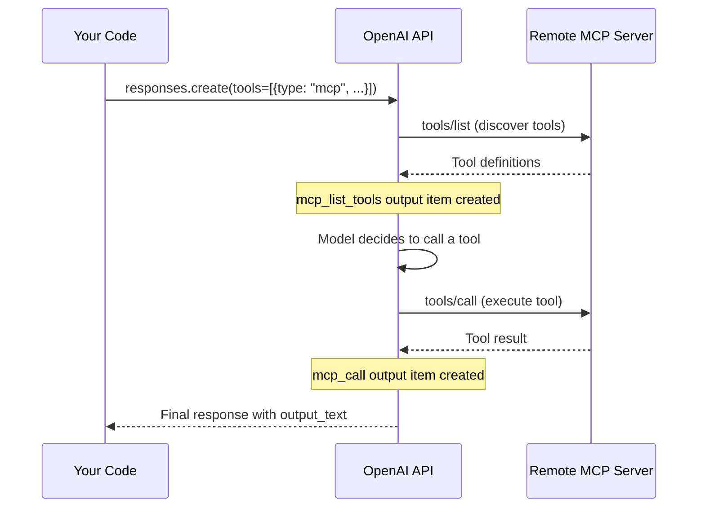
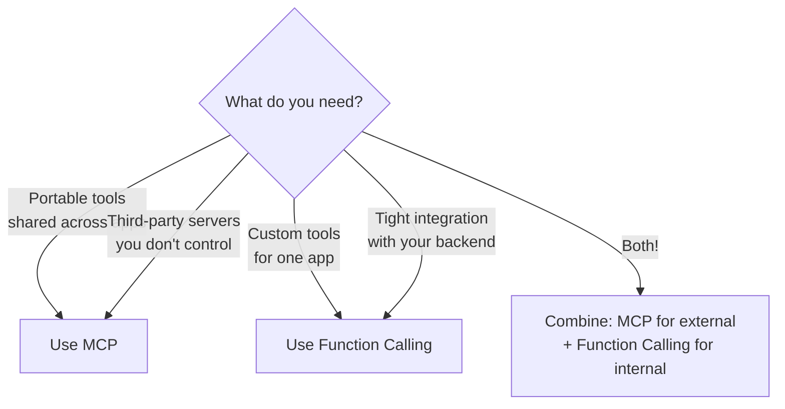

# SDK Integration: MCP Across Providers

## Introduction

In the previous sub-lessons, we built MCP servers and clients from scratch using the low-level protocol. But in practice, major AI providers now offer **built-in MCP support** in their SDKs — letting you connect to MCP servers with minimal boilerplate. Each provider has a slightly different integration pattern, and understanding these differences is key to writing portable AI applications.

This sub-lesson shows how to use MCP with OpenAI's Responses API, Anthropic's Claude Desktop and SDK, and Google Gemini's built-in session support. We also compare MCP with traditional function calling to clarify when to use each approach.

### What we'll cover

- OpenAI: remote MCP servers via the Responses API
- Anthropic: native MCP in Claude Desktop and the Python SDK
- Google Gemini: passing `ClientSession` as a tool
- MCP vs. function calling: a detailed comparison
- Automatic function calling with MCP tools

### Prerequisites

- Completed [Client Implementation](./04-client-implementation.md)
- API keys for at least one provider (OpenAI, Anthropic, or Google)
- Understanding of each provider's function calling basics (Unit 10, Lessons 01–05)

---

## OpenAI: MCP via the Responses API

OpenAI supports MCP through a built-in `mcp` tool type in the **Responses API**. Unlike the manual client we built earlier, OpenAI handles the MCP connection server-side — you provide a URL and OpenAI connects to the remote MCP server directly.

### Basic usage

```python
from openai import OpenAI

client = OpenAI()

response = client.responses.create(
    model="gpt-4.1",
    tools=[
        {
            "type": "mcp",
            "server_label": "weather",
            "server_description": "A weather data MCP server",
            "server_url": "https://weather-mcp.example.com/mcp",
            "require_approval": "never",
        },
    ],
    input="What's the weather in New York?",
)

print(response.output_text)
```

**Key parameters:**
- `type: "mcp"` — Tells OpenAI this is an MCP server (not a function)
- `server_label` — A short identifier for this server
- `server_url` — The remote MCP server endpoint (Streamable HTTP or HTTP+SSE)
- `require_approval` — Controls whether tool calls need explicit approval

> **Important:** OpenAI connects to **remote** MCP servers only. The server must be accessible over the internet via Streamable HTTP transport. Local stdio servers don't work with OpenAI's API directly.

### How it works behind the scenes

When you include an MCP tool, the API performs these steps automatically:



### Filtering tools

Some MCP servers expose dozens of tools. Use `allowed_tools` to limit which ones the model can use:

```python
response = client.responses.create(
    model="gpt-4.1",
    tools=[
        {
            "type": "mcp",
            "server_label": "github",
            "server_url": "https://api.githubcopilot.com/mcp/",
            "require_approval": "never",
            "allowed_tools": ["search_repositories", "get_file_contents"],
        },
    ],
    input="Find the most starred Python MCP server repos",
)
```

### Approval workflow

By default, OpenAI requires approval before calling MCP tools. This creates an `mcp_approval_request` output item that you must respond to:

```python
# First request — triggers approval
response = client.responses.create(
    model="gpt-4.1",
    tools=[
        {
            "type": "mcp",
            "server_label": "database",
            "server_url": "https://db-mcp.example.com/mcp",
            "require_approval": "always",
        },
    ],
    input="Delete all inactive users",
)

# Check for approval request in response.output
for item in response.output:
    if item.type == "mcp_approval_request":
        # Review the tool call, then approve or deny
        follow_up = client.responses.create(
            model="gpt-4.1",
            tools=[...],  # Same tools
            previous_response_id=response.id,
            input=[
                {
                    "type": "mcp_approval_response",
                    "approve": True,  # or False to deny
                    "approval_request_id": item.id,
                }
            ],
        )
        print(follow_up.output_text)
```

### Authentication

Most production MCP servers require authentication. Pass an OAuth token using the `authorization` field:

```python
response = client.responses.create(
    model="gpt-4.1",
    tools=[
        {
            "type": "mcp",
            "server_label": "stripe",
            "server_url": "https://mcp.stripe.com",
            "authorization": "Bearer sk_live_...",  # OAuth access token
        },
    ],
    input="Create a payment link for $20",
)
```

> **Warning:** The `authorization` value is not stored by OpenAI. You must include it in every request. Keep tokens secure and never log them.

### OpenAI connectors

OpenAI also offers **connectors** — pre-built MCP wrappers for popular services:

| Connector | ID | Capabilities |
|---|---|---|
| Gmail | `connector_gmail` | Read, search, send emails |
| Google Drive | `connector_googledrive` | List, read files |
| Google Calendar | `connector_googlecalendar` | View, create events |
| Dropbox | `connector_dropbox` | List, read files |
| Microsoft Teams | `connector_microsoftteams` | Read messages, channels |
| SharePoint | `connector_sharepoint` | Access documents |

```python
response = client.responses.create(
    model="gpt-4.1",
    tools=[
        {
            "type": "mcp",
            "server_label": "calendar",
            "connector_id": "connector_googlecalendar",
            "authorization": "ya29.A0AS3H6...",  # Google OAuth token
            "require_approval": "never",
        },
    ],
    input="What's on my calendar today?",
)
```

---

## Anthropic: native MCP support

Anthropic built MCP, so their integration is the most mature. MCP works natively in **Claude Desktop**, **Claude Code**, and the **Anthropic Python SDK**.

### Claude Desktop integration

Claude Desktop launches MCP servers as local subprocesses. Configuration lives in a JSON file:

**macOS/Linux:** `~/Library/Application Support/Claude/claude_desktop_config.json`

```json
{
  "mcpServers": {
    "weather": {
      "command": "uv",
      "args": ["--directory", "/path/to/weather-server", "run", "server.py"]
    },
    "filesystem": {
      "command": "npx",
      "args": ["-y", "@modelcontextprotocol/server-filesystem", "/home/user/docs"]
    },
    "github": {
      "command": "npx",
      "args": ["-y", "@modelcontextprotocol/server-github"],
      "env": {
        "GITHUB_PERSONAL_ACCESS_TOKEN": "ghp_..."
      }
    }
  }
}
```

After restarting Claude Desktop, the tools from all configured servers appear automatically. Claude can use them in conversation without any additional code.

### Anthropic SDK with MCP client

For programmatic access, use the pattern from the [Client Implementation](./04-client-implementation.md) sub-lesson — the Anthropic SDK's `messages.create()` accepts MCP tool definitions directly:

```python
from anthropic import Anthropic
from mcp import ClientSession, StdioServerParameters
from mcp.client.stdio import stdio_client

anthropic = Anthropic()

# ... connect to MCP server and get session ...

# List tools from MCP server
response = await session.list_tools()
tools = [
    {
        "name": tool.name,
        "description": tool.description,
        "input_schema": tool.inputSchema,
    }
    for tool in response.tools
]

# Pass MCP tools to Claude
response = anthropic.messages.create(
    model="claude-sonnet-4-20250514",
    max_tokens=1000,
    messages=[{"role": "user", "content": "What's the weather?"}],
    tools=tools,  # MCP tool schemas work directly
)
```

The tool schemas from MCP are fully compatible with Anthropic's tool use format — no conversion needed.

---

## Google Gemini: session-based MCP

Google's Gemini SDK takes a unique approach — you pass the MCP `ClientSession` object directly as a tool, and the SDK handles everything automatically:

```python
import asyncio
from mcp import ClientSession, StdioServerParameters
from mcp.client.stdio import stdio_client
from google import genai
from google.genai import types

client = genai.Client()

# Configure the MCP server
server_params = StdioServerParameters(
    command="npx",
    args=["-y", "@philschmid/weather-mcp"],
    env=None,
)


async def run():
    async with stdio_client(server_params) as (read, write):
        async with ClientSession(read, write) as session:
            # Initialize the MCP connection
            await session.initialize()

            # Pass the session directly as a tool!
            response = await client.aio.models.generate_content(
                model="gemini-2.5-flash",
                contents="What is the weather in London today?",
                config=types.GenerateContentConfig(
                    temperature=0,
                    tools=[session],  # MCP session as a tool
                ),
            )
            print(response.text)


asyncio.run(run())
```

**What makes Gemini's approach special:**
- **No manual tool schema extraction** — the SDK reads tools from the session automatically
- **Automatic function calling** — the SDK executes MCP tools and sends results back to the model in a loop
- The session object acts as both tool source and tool executor

### Disabling automatic function calling

If you want to handle tool calls manually (for logging, approval, etc.):

```python
config = types.GenerateContentConfig(
    tools=[session],
    automatic_function_calling=types.AutomaticFunctionCallingConfig(
        disable=True
    ),
)
```

### Current limitations

Google's MCP integration has some constraints:

| Limitation | Details |
|---|---|
| **Tools only** | Resources and prompts are not supported through the session interface |
| **Python and JS SDKs only** | Other language SDKs don't support MCP sessions yet |
| **Experimental** | Breaking changes may occur in future releases |

---

## MCP vs. function calling: when to use each

Both MCP and function calling let AI models invoke external capabilities, but they serve different purposes:



### Detailed comparison

| Aspect | Function Calling | MCP |
|--------|-----------------|-----|
| **Scope** | Per-application | Universal standard |
| **Portability** | Provider-specific schemas | Works across all MCP-compatible providers |
| **Tool source** | Defined in your code | Discovered from external servers |
| **Execution** | Your code executes the function | MCP server executes the function |
| **Discovery** | Static (you define tools at build time) | Dynamic (`tools/list` at runtime) |
| **Ecosystem** | Custom per project | Community servers, shared registries |
| **Setup complexity** | Lower (just define schemas) | Higher (need server + client) |
| **Best for** | Application-specific logic | Reusable, shareable tool servers |

### When to use function calling

- **Custom business logic** — Tools tightly coupled to your application
- **Simple integrations** — One-off API calls that don't need reuse
- **Maximum control** — You handle every aspect of tool execution
- **Single provider** — You're committed to one AI provider

### When to use MCP

- **Reusable tools** — Tools shared across multiple applications or teams
- **Third-party services** — Connecting to servers you don't control
- **Multi-provider** — Same tools work with OpenAI, Anthropic, and Google
- **Dynamic discovery** — Tools change at runtime, new servers added without code changes
- **Ecosystem tools** — Using community-built MCP servers

### Combining both

In practice, most production applications use **both**:

```python
# Function calling for app-specific logic
custom_tools = [
    {
        "type": "function",
        "function": {
            "name": "calculate_shipping",
            "description": "Calculate shipping cost for an order",
            "parameters": {...}
        }
    }
]

# MCP for external services
mcp_tools = [
    {
        "type": "mcp",
        "server_label": "inventory",
        "server_url": "https://inventory-mcp.company.com/mcp",
        "require_approval": "never",
    }
]

# Use both together
response = client.responses.create(
    model="gpt-4.1",
    tools=custom_tools + mcp_tools,
    input="Check inventory for SKU-12345 and calculate shipping to NYC",
)
```

---

## Cross-provider compatibility matrix

| Feature | OpenAI | Anthropic | Google Gemini |
|---------|--------|-----------|---------------|
| **MCP tool discovery** | ✅ Via API | ✅ Via SDK/Desktop | ✅ Via SDK |
| **MCP tool execution** | ✅ Server-side | ✅ Client-side | ✅ Automatic |
| **Remote MCP servers** | ✅ Built-in | ⚠️ Manual setup | ⚠️ Manual setup |
| **Local MCP servers** | ❌ Not supported | ✅ Native (stdio) | ✅ Via SDK |
| **Approval workflow** | ✅ Built-in | ✅ Host-managed | ❌ Not built-in |
| **Connectors** | ✅ Pre-built | ❌ — | ❌ — |
| **Resources support** | ❌ Tools only | ✅ Full | ❌ Tools only |
| **Prompts support** | ❌ Tools only | ✅ Full | ❌ Tools only |
| **Session as tool** | ❌ — | ❌ — | ✅ Unique feature |

---

## Best practices

| Practice | Why It Matters |
|----------|----------------|
| Use MCP for shared, reusable tools | Maximizes portability across providers and applications |
| Use function calling for app-specific logic | Simpler setup, tighter control for custom code |
| Trust only official MCP servers | Third-party servers can exfiltrate data from model context |
| Always implement approval flows for sensitive tools | Prevents unintended actions on external systems |
| Keep `mcp_list_tools` in conversation context | Avoids re-fetching tool definitions on every turn |
| Test with MCP Inspector before integrating with providers | Catches schema issues before they hit production |

---

## Common pitfalls

| ❌ Mistake | ✅ Solution |
|-----------|-------------|
| Trying to use stdio servers with OpenAI API | OpenAI only supports remote (HTTP) MCP servers |
| Storing OAuth tokens in code | Use environment variables or secret managers |
| Exposing all tools from a large MCP server | Use `allowed_tools` to limit what the model can access |
| Ignoring approval requests in OpenAI | Check for `mcp_approval_request` items and respond appropriately |
| Assuming all providers support resources/prompts | Currently only Anthropic supports the full MCP feature set |
| Not handling MCP server errors | Check the `error` field in `mcp_call` output items |

---

## Hands-on exercise

### Your task

Write a Python script that connects to the same MCP server using **two different providers** and compares their behavior.

### Requirements

1. Build or reuse an MCP server with at least 2 tools (e.g., the weather server)
2. Write **Client A** using the Anthropic SDK with manual MCP client connection
3. Write **Client B** using the Google Gemini SDK with session-as-tool
4. Send the same query to both: "What's the weather in San Francisco?"
5. Compare the results — do both models call the same tool with the same arguments?

### Expected result

Both clients should discover the same tools and produce similar (though not identical) responses, demonstrating MCP's portability.

<details>
<summary>💡 Hints (click to expand)</summary>

- Both clients connect to the same MCP server — use two separate `ClientSession` instances
- For Anthropic, extract tool schemas manually and pass to `messages.create()`
- For Gemini, pass `session` directly as a tool
- Print the tool calls each model makes to compare behavior

</details>

<details>
<summary>✅ Solution (click to expand)</summary>

```python
"""Compare MCP tool usage across Anthropic and Google Gemini."""

import asyncio
from mcp import ClientSession, StdioServerParameters
from mcp.client.stdio import stdio_client
from anthropic import Anthropic
from google import genai
from google.genai import types
from dotenv import load_dotenv

load_dotenv()

SERVER_PATH = "weather_server.py"
QUERY = "What's the weather in San Francisco?"


async def test_anthropic():
    """Test with Anthropic Claude."""
    print("=== Anthropic Claude ===")
    anthropic = Anthropic()

    server_params = StdioServerParameters(
        command="python", args=[SERVER_PATH], env=None
    )

    async with stdio_client(server_params) as (read, write):
        async with ClientSession(read, write) as session:
            await session.initialize()

            response = await session.list_tools()
            tools = [
                {
                    "name": t.name,
                    "description": t.description,
                    "input_schema": t.inputSchema,
                }
                for t in response.tools
            ]
            print(f"Tools discovered: {[t['name'] for t in tools]}")

            result = anthropic.messages.create(
                model="claude-sonnet-4-20250514",
                max_tokens=1000,
                messages=[{"role": "user", "content": QUERY}],
                tools=tools,
            )

            for block in result.content:
                if block.type == "tool_use":
                    print(f"Tool call: {block.name}({block.input})")
                    tool_result = await session.call_tool(block.name, block.input)
                    print(f"Result: {tool_result.content}")


async def test_gemini():
    """Test with Google Gemini."""
    print("\n=== Google Gemini ===")
    client = genai.Client()

    server_params = StdioServerParameters(
        command="python", args=[SERVER_PATH], env=None
    )

    async with stdio_client(server_params) as (read, write):
        async with ClientSession(read, write) as session:
            await session.initialize()

            tools_response = await session.list_tools()
            print(f"Tools discovered: {[t.name for t in tools_response.tools]}")

            response = await client.aio.models.generate_content(
                model="gemini-2.5-flash",
                contents=QUERY,
                config=types.GenerateContentConfig(
                    temperature=0,
                    tools=[session],
                ),
            )
            print(f"Response: {response.text}")


async def main():
    await test_anthropic()
    await test_gemini()


if __name__ == "__main__":
    asyncio.run(main())
```

</details>

### Bonus challenges

- [ ] Add OpenAI as a third provider (requires deploying the MCP server remotely)
- [ ] Log the exact JSON-RPC messages exchanged and compare them across providers
- [ ] Measure and compare latency between the two approaches

---

## Summary

✅ **OpenAI** connects to remote MCP servers via the Responses API — provide a `server_url` and OpenAI handles connection and tool calls server-side

✅ **Anthropic** offers the deepest MCP integration — native support in Claude Desktop (local servers) and the SDK (programmatic access)

✅ **Google Gemini** provides the simplest API — pass a `ClientSession` directly as a tool and the SDK handles everything automatically

✅ MCP and function calling serve different purposes: MCP for **portable, reusable** tools; function calling for **app-specific** logic

✅ Currently only Anthropic supports the full MCP feature set (tools + resources + prompts); OpenAI and Gemini support tools only

✅ In production, most applications **combine both** — MCP for external services, function calling for custom business logic

**Next:** [Ecosystem and Security →](./06-ecosystem-and-security.md)

---

*Previous:* [Client Implementation](./04-client-implementation.md) | *Next:* [Ecosystem and Security →](./06-ecosystem-and-security.md)

<!--
Sources Consulted:
- OpenAI Connectors and MCP: https://platform.openai.com/docs/guides/tools-connectors-mcp
- Google Gemini Function Calling (MCP section): https://ai.google.dev/gemini-api/docs/function-calling
- MCP Build Client Guide: https://modelcontextprotocol.io/docs/develop/build-client
- MCP Introduction: https://modelcontextprotocol.io/introduction
- MCP Architecture: https://modelcontextprotocol.io/docs/learn/architecture
-->
