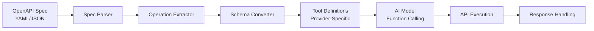

# OpenAPI/Swagger Integration

## Overview

OpenAPI (formerly Swagger) provides a standardized, machine-readable description of HTTP APIs. When combined with AI function calling, OpenAPI specifications become a powerful bridge — enabling AI systems to automatically discover, understand, and invoke any API that publishes a spec. Instead of manually writing tool definitions for every endpoint, we can parse an OpenAPI document and generate function declarations programmatically.

This lesson explores how to turn OpenAPI specifications into AI-ready tools — from parsing specs and converting schemas, to dynamically registering tools at runtime and keeping them synchronized as APIs evolve.

## What we'll cover

This lesson is divided into five topics:

1. **Auto-generating tools from OpenAPI specs** — Parsing spec documents, generating function declarations, mapping parameters, and understanding the automation benefits
2. **Schema conversion to function definitions** — Mapping OpenAPI types to provider-specific schemas, handling required fields, extracting descriptions, and resolving `$ref` references
3. **API discovery for AI** — Exposing available operations, generating useful descriptions, categorizing endpoints, and surfacing API capabilities to AI models
4. **Dynamic tool registration from specs** — Loading specs at runtime, hot-reloading when specs change, handling version differences, and validating tool integrity
5. **Keeping tools in sync with APIs** — Detecting spec changes, automating tool updates, handling breaking changes gracefully, and supporting deprecated endpoints

## Prerequisites

Before starting this lesson, you should be comfortable with:

- Defining tools and function schemas for AI (Lessons 01–04)
- JSON Schema fundamentals (Lesson 02)
- Working with all three providers — OpenAI, Anthropic, Google Gemini (Lessons 01–04)
- Python `requests` or `httpx` for HTTP calls
- Basic understanding of REST API concepts (HTTP methods, status codes, request/response bodies)

## Why OpenAPI integration matters

Manually defining tool schemas works for a handful of functions, but production systems often interact with APIs that have dozens or hundreds of endpoints. OpenAPI integration solves this scaling problem:

| Manual Approach | OpenAPI Approach |
|----------------|------------------|
| Write each tool definition by hand | Auto-generate from spec |
| Update tools when API changes | Detect changes automatically |
| Hope descriptions stay accurate | Descriptions come from the API author |
| Error-prone parameter mapping | Schema-validated parameter types |
| Scales linearly with endpoints | Scales to any size API |

> **🤖 AI Context:** OpenAPI specs use JSON Schema (the same foundation as AI function calling schemas), making the conversion natural. OpenAI, Anthropic, and Google Gemini all accept JSON Schema-based tool definitions — and OpenAPI specs are essentially a collection of these schemas organized by endpoint.

## Key concepts at a glance

The pipeline flows from a single source of truth (the OpenAPI spec) through parsing, extraction, and conversion stages to produce tool definitions that any AI provider can consume.

---

## Lessons in this section

| # | Topic | Description |
|---|-------|-------------|
| 01 | [Auto-Generating Tools from Specs](./01-auto-generating-tools-from-specs.md) | Parse OpenAPI documents and generate function declarations automatically |
| 02 | [Schema Conversion to Function Definitions](./02-schema-conversion-to-function-definitions.md) | Map OpenAPI types to provider-specific tool schemas |
| 03 | [API Discovery for AI](./03-api-discovery-for-ai.md) | Expose and categorize API capabilities for AI consumption |
| 04 | [Dynamic Tool Registration](./04-dynamic-tool-registration.md) | Load and register tools at runtime from live specs |
| 05 | [Keeping Tools in Sync](./05-keeping-tools-in-sync.md) | Detect changes, handle updates, and manage deprecation |

---

**Previous:** [Model Context Protocol (MCP)](../11-model-context-protocol-mcp/06-ecosystem-and-security.md)

**Next:** [Auto-Generating Tools from Specs →](./01-auto-generating-tools-from-specs.md)

<!--
Sources Consulted:
- OpenAPI Specification v3.1.1: https://spec.openapis.org/oas/v3.1.1.html
- OpenAI Function Calling Guide: https://platform.openai.com/docs/guides/function-calling
- Google Gemini Function Calling: https://ai.google.dev/gemini-api/docs/function-calling
- Unit 10 Overview: 00-overview.md
-->
