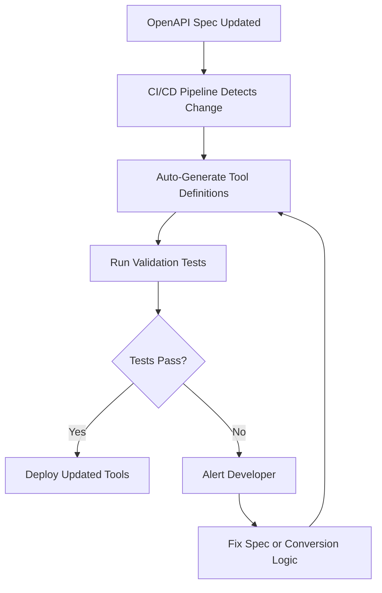

# Auto-Generating Tools from OpenAPI Specs

## Introduction

Every API that publishes an OpenAPI specification is already describing its capabilities in a structured, machine-readable format — operation names, parameter types, descriptions, and expected responses. This is remarkably close to what AI providers need when you define function calling tools. The gap between an OpenAPI spec and an AI tool definition is small enough to bridge automatically.

In this lesson, we build a pipeline that takes any OpenAPI 3.x specification and produces ready-to-use tool definitions for OpenAI, Anthropic, and Google Gemini. We start by understanding the structure of an OpenAPI document, then extract operations, map parameters, and generate provider-specific function declarations.

### What we'll cover

- Anatomy of an OpenAPI specification
- Parsing specs from YAML/JSON files and URLs
- Extracting operations and their metadata
- Generating tool definitions for all three providers
- Automating the entire pipeline

### Prerequisites

- Familiarity with JSON Schema and tool definitions (Lessons 01–04)
- Python basics including dictionaries, loops, and file I/O
- Understanding of HTTP methods (GET, POST, PUT, DELETE)

---

## Anatomy of an OpenAPI specification

An OpenAPI document describes an API's surface area. The key sections relevant to tool generation are:

```yaml
openapi: "3.1.1"
info:
  title: Pet Store API
  version: "1.0.0"
  description: A sample API for managing pets
paths:
  /pets:
    get:
      operationId: listPets
      summary: List all pets
      description: Returns all pets from the system
      parameters:
        - name: limit
          in: query
          description: Maximum number of pets to return
          required: false
          schema:
            type: integer
            format: int32
      responses:
        "200":
          description: A list of pets
    post:
      operationId: createPet
      summary: Create a pet
      description: Creates a new pet in the store
      requestBody:
        required: true
        content:
          application/json:
            schema:
              $ref: "#/components/schemas/NewPet"
components:
  schemas:
    NewPet:
      type: object
      required:
        - name
      properties:
        name:
          type: string
          description: The pet's name
        tag:
          type: string
          description: Optional tag for categorization
```

The fields that map directly to tool definitions are:

| OpenAPI Field | Tool Definition Field | Purpose |
|---------------|----------------------|---------|
| `operationId` | `name` | Unique function identifier |
| `summary` / `description` | `description` | What the function does |
| `parameters` | `parameters.properties` | Input arguments (query, path, header) |
| `requestBody.content.*.schema` | `parameters.properties` | Request body fields |
| `parameters[].required` | `required` | Which arguments are mandatory |
| `parameters[].schema.type` | Property `type` | Data types for each argument |

> **Note:** The `operationId` is the most important field for tool generation. It becomes the function name. If an operation lacks an `operationId`, we must generate one from the HTTP method and path (e.g., `get_pets`).

---

## Parsing OpenAPI specs

We start by loading and parsing an OpenAPI specification. Specs can be YAML or JSON, hosted locally or at a URL.

```python
import json
import yaml
import httpx


def load_openapi_spec(source: str) -> dict:
    """Load an OpenAPI spec from a file path or URL.
    
    Args:
        source: File path (.yaml/.json) or URL to the spec
        
    Returns:
        Parsed OpenAPI specification as a dictionary
    """
    if source.startswith(("http://", "https://")):
        response = httpx.get(source)
        response.raise_for_status()
        content = response.text
    else:
        with open(source, "r") as f:
            content = f.read()
    
    # Try YAML first (YAML is a superset of JSON)
    try:
        spec = yaml.safe_load(content)
    except yaml.YAMLError:
        spec = json.loads(content)
    
    # Validate it's an OpenAPI spec
    if "openapi" not in spec:
        raise ValueError("Not a valid OpenAPI spec: missing 'openapi' field")
    
    version = spec["openapi"]
    if not version.startswith("3."):
        raise ValueError(f"Unsupported OpenAPI version: {version}. Expected 3.x")
    
    print(f"Loaded OpenAPI spec: {spec['info']['title']} v{spec['info']['version']}")
    print(f"OpenAPI version: {version}")
    
    return spec
```

**Output:**
```
Loaded OpenAPI spec: Pet Store API v1.0.0
OpenAPI version: 3.1.1
```

> **Tip:** The `pyyaml` package handles both YAML and JSON. Install it with `pip install pyyaml`. For HTTP fetching, `httpx` is recommended (`pip install httpx`).

---

## Extracting operations

Each path in the spec can have multiple HTTP methods, and each method is an operation. We extract these into a flat list of operation descriptors:

```python
HTTP_METHODS = {"get", "post", "put", "patch", "delete", "head", "options", "trace"}


def extract_operations(spec: dict) -> list[dict]:
    """Extract all operations from an OpenAPI spec.
    
    Args:
        spec: Parsed OpenAPI specification
        
    Returns:
        List of operation descriptors with path, method, and metadata
    """
    operations = []
    paths = spec.get("paths", {})
    
    for path, path_item in paths.items():
        # Collect path-level parameters (shared across methods)
        path_params = path_item.get("parameters", [])
        
        for method in HTTP_METHODS:
            if method not in path_item:
                continue
            
            operation = path_item[method]
            operation_id = operation.get("operationId")
            
            # Generate operationId if missing
            if not operation_id:
                # /pets/{petId} + GET -> get_pets_by_petId
                clean_path = path.replace("/", "_").replace("{", "").replace("}", "")
                operation_id = f"{method}{clean_path}"
            
            # Merge path-level and operation-level parameters
            op_params = operation.get("parameters", [])
            all_params = _merge_parameters(path_params, op_params)
            
            operations.append({
                "operation_id": operation_id,
                "method": method.upper(),
                "path": path,
                "summary": operation.get("summary", ""),
                "description": operation.get("description", ""),
                "parameters": all_params,
                "request_body": operation.get("requestBody"),
                "deprecated": operation.get("deprecated", False),
                "tags": operation.get("tags", []),
            })
    
    return operations


def _merge_parameters(path_params: list, op_params: list) -> list:
    """Merge path-level and operation-level parameters.
    
    Operation-level params override path-level params with the same name+in.
    """
    merged = {(p["name"], p["in"]): p for p in path_params}
    for p in op_params:
        merged[(p["name"], p["in"])] = p  # Override path-level
    return list(merged.values())
```

**Output (for the Pet Store spec above):**
```python
operations = extract_operations(spec)
for op in operations:
    print(f"  {op['method']} {op['path']} -> {op['operation_id']}")

# Output:
#   GET /pets -> listPets
#   POST /pets -> createPet
```

---

## Generating tool definitions

Now we convert extracted operations into provider-specific tool definitions. The core logic is the same for all providers — the differences are in the wrapper format.

### Building the parameter schema

Before generating provider-specific formats, we build a unified parameter schema from an operation's parameters and request body:

```python
def build_parameter_schema(
    operation: dict,
    spec: dict,
) -> dict:
    """Build a JSON Schema for an operation's parameters.
    
    Combines query/path/header parameters and request body 
    into a single schema object.
    
    Args:
        operation: Extracted operation descriptor
        spec: Full OpenAPI spec (for resolving $ref)
        
    Returns:
        JSON Schema object describing the function parameters
    """
    properties = {}
    required = []
    
    # Process query, path, header parameters
    for param in operation.get("parameters", []):
        param_name = param["name"]
        param_schema = resolve_ref(param.get("schema", {}), spec)
        
        # Build property definition
        prop = {"type": param_schema.get("type", "string")}
        
        if "description" in param:
            prop["description"] = param["description"]
        elif "description" in param_schema:
            prop["description"] = param_schema["description"]
        
        if "enum" in param_schema:
            prop["enum"] = param_schema["enum"]
        
        if "format" in param_schema:
            prop["format"] = param_schema["format"]
        
        properties[param_name] = prop
        
        if param.get("required", False):
            required.append(param_name)
    
    # Process request body
    request_body = operation.get("request_body")
    if request_body:
        body_schema = _extract_body_schema(request_body, spec)
        if body_schema:
            body_resolved = resolve_ref(body_schema, spec)
            # Merge body properties into the parameter schema
            if body_resolved.get("type") == "object":
                for prop_name, prop_def in body_resolved.get("properties", {}).items():
                    properties[prop_name] = resolve_ref(prop_def, spec)
                required.extend(body_resolved.get("required", []))
            else:
                # Non-object body — wrap as "body" parameter
                properties["body"] = body_resolved
                if request_body.get("required", False):
                    required.append("body")
    
    schema = {
        "type": "object",
        "properties": properties,
    }
    
    if required:
        schema["required"] = list(set(required))  # Deduplicate
    
    return schema


def _extract_body_schema(request_body: dict, spec: dict) -> dict | None:
    """Extract the schema from a request body, preferring JSON."""
    content = request_body.get("content", {})
    
    # Prefer application/json
    for media_type in ["application/json", "application/x-www-form-urlencoded"]:
        if media_type in content:
            return content[media_type].get("schema")
    
    # Fall back to first available content type
    if content:
        first_content = next(iter(content.values()))
        return first_content.get("schema")
    
    return None


def resolve_ref(schema: dict, spec: dict) -> dict:
    """Resolve a $ref reference in the OpenAPI spec.
    
    Args:
        schema: Schema that may contain a $ref
        spec: Full OpenAPI spec for resolution
        
    Returns:
        Resolved schema (with $ref replaced by actual content)
    """
    if "$ref" not in schema:
        return schema
    
    ref_path = schema["$ref"]  # e.g., "#/components/schemas/NewPet"
    
    if not ref_path.startswith("#/"):
        raise ValueError(f"External $ref not supported: {ref_path}")
    
    # Navigate the spec to resolve the reference
    parts = ref_path.lstrip("#/").split("/")
    resolved = spec
    for part in parts:
        resolved = resolved[part]
    
    return resolved
```

### OpenAI format

```python
def to_openai_tools(operations: list[dict], spec: dict) -> list[dict]:
    """Convert operations to OpenAI function calling format.
    
    Args:
        operations: List of extracted operation descriptors
        spec: Full OpenAPI spec for resolving references
        
    Returns:
        List of OpenAI-compatible tool definitions
    """
    tools = []
    
    for op in operations:
        if op.get("deprecated"):
            continue  # Skip deprecated operations
        
        description = op["summary"] or op["description"] or f"{op['method']} {op['path']}"
        param_schema = build_parameter_schema(op, spec)
        
        # OpenAI strict mode requires additionalProperties: false
        param_schema["additionalProperties"] = False
        
        # In strict mode, all properties must be in required
        if "properties" in param_schema:
            param_schema["required"] = list(param_schema["properties"].keys())
        
        tool = {
            "type": "function",
            "name": op["operation_id"],
            "description": description,
            "parameters": param_schema,
            "strict": True,
        }
        
        tools.append(tool)
    
    return tools
```

**Output:**
```python
tools = to_openai_tools(operations, spec)
print(json.dumps(tools[0], indent=2))
```

```json
{
  "type": "function",
  "name": "listPets",
  "description": "List all pets",
  "parameters": {
    "type": "object",
    "properties": {
      "limit": {
        "type": "integer",
        "description": "Maximum number of pets to return",
        "format": "int32"
      }
    },
    "required": ["limit"],
    "additionalProperties": false
  },
  "strict": true
}
```

### Anthropic format

```python
def to_anthropic_tools(operations: list[dict], spec: dict) -> list[dict]:
    """Convert operations to Anthropic tool use format.
    
    Args:
        operations: List of extracted operation descriptors
        spec: Full OpenAPI spec for resolving references
        
    Returns:
        List of Anthropic-compatible tool definitions
    """
    tools = []
    
    for op in operations:
        if op.get("deprecated"):
            continue
        
        description = op["summary"] or op["description"] or f"{op['method']} {op['path']}"
        param_schema = build_parameter_schema(op, spec)
        
        tool = {
            "name": op["operation_id"],
            "description": description,
            "input_schema": param_schema,
        }
        
        tools.append(tool)
    
    return tools
```

**Output:**
```json
{
  "name": "listPets",
  "description": "List all pets",
  "input_schema": {
    "type": "object",
    "properties": {
      "limit": {
        "type": "integer",
        "description": "Maximum number of pets to return",
        "format": "int32"
      }
    },
    "required": []
  }
}
```

### Google Gemini format

```python
from google.genai import types


def to_gemini_tools(operations: list[dict], spec: dict) -> list[types.Tool]:
    """Convert operations to Google Gemini function declaration format.
    
    Args:
        operations: List of extracted operation descriptors
        spec: Full OpenAPI spec for resolving references
        
    Returns:
        List of Gemini Tool objects with function declarations
    """
    declarations = []
    
    for op in operations:
        if op.get("deprecated"):
            continue
        
        description = op["summary"] or op["description"] or f"{op['method']} {op['path']}"
        param_schema = build_parameter_schema(op, spec)
        
        declaration = {
            "name": op["operation_id"],
            "description": description,
            "parameters": param_schema,
        }
        
        declarations.append(declaration)
    
    return [types.Tool(function_declarations=declarations)]
```

**Output:**
```python
# Gemini receives function declarations as part of a Tool object
# The schema format is identical to JSON Schema
```

---

## Complete pipeline

Here is the full pipeline that takes a spec source and produces tools for any provider:

```python
def generate_tools_from_spec(
    source: str,
    provider: str = "openai",
) -> list[dict]:
    """Generate AI tool definitions from an OpenAPI spec.
    
    Args:
        source: Path or URL to the OpenAPI spec
        provider: Target provider ("openai", "anthropic", or "gemini")
        
    Returns:
        List of provider-specific tool definitions
    """
    # Step 1: Load the spec
    spec = load_openapi_spec(source)
    
    # Step 2: Extract operations
    operations = extract_operations(spec)
    print(f"Found {len(operations)} operations")
    
    # Step 3: Filter out deprecated operations
    active_ops = [op for op in operations if not op.get("deprecated")]
    print(f"Active operations: {len(active_ops)}")
    
    # Step 4: Generate provider-specific tools
    generators = {
        "openai": to_openai_tools,
        "anthropic": to_anthropic_tools,
        "gemini": to_gemini_tools,
    }
    
    generator = generators.get(provider)
    if not generator:
        raise ValueError(f"Unknown provider: {provider}. Use: {list(generators.keys())}")
    
    tools = generator(active_ops, spec)
    print(f"Generated {len(tools)} tool definitions for {provider}")
    
    return tools


# Usage
tools = generate_tools_from_spec("petstore.yaml", provider="openai")
```

**Output:**
```
Loaded OpenAPI spec: Pet Store API v1.0.0
OpenAPI version: 3.1.1
Found 2 operations
Active operations: 2
Generated 2 tool definitions for openai
```

---

## Automation benefits

Automating tool generation from OpenAPI specs provides several advantages over manual definitions:



| Benefit | Manual Tools | Auto-Generated Tools |
|---------|-------------|---------------------|
| ⏱️ Time to add 50 endpoints | Hours/days | Seconds |
| 🔄 Sync with API changes | Requires manual review | Automatic with CI/CD |
| 📝 Description accuracy | Depends on developer | Comes from API authors |
| ✅ Type safety | Error-prone | Schema-validated |
| 🧪 Testability | Hard to verify coverage | Automated coverage checks |
| 📊 Scalability | Linear effort | Constant effort |

> **🤖 AI Context:** Large organizations may expose hundreds of internal APIs. Auto-generating tools from OpenAPI specs lets an AI agent access all of them without any per-API engineering work. This is the foundation of "universal API agents."

---

## Best practices

| Practice | Why it matters |
|----------|---------------|
| Always validate the spec before parsing | Malformed specs produce broken tools |
| Generate `operationId` from path + method if missing | Every tool needs a unique, descriptive name |
| Skip deprecated operations by default | Prevents the AI from using soon-to-be-removed endpoints |
| Prefer `summary` over `description` for tool descriptions | Summaries are concise; descriptions can be verbose |
| Set `strict: true` for OpenAI tools | Guarantees schema adherence in function calls |
| Limit tool count to 10–20 per request | Too many tools reduce model accuracy |

---

## Common pitfalls

| ❌ Mistake | ✅ Solution |
|-----------|-------------|
| Not resolving `$ref` references | Always recursively resolve all `$ref` before building schemas |
| Including file upload endpoints as tools | Filter out operations with `multipart/form-data` body content |
| Using path parameter names without context | Prefix descriptions with location: "Path parameter: pet ID" |
| Generating tools for health check endpoints | Filter by tags or path patterns to include only business logic endpoints |
| Ignoring `enum` constraints from the spec | Pass `enum` values through to tool schemas for constrained choices |
| Using raw paths as function names | Sanitize to valid identifiers: `/pets/{petId}` → `getPetById` |

---

## Hands-on exercise

### Your task

Build a tool generator that converts the [Swagger Petstore](https://petstore3.swagger.io/api/v3/openapi.json) OpenAPI spec into tool definitions for all three providers.

### Requirements

1. Load the Petstore spec from the URL above
2. Extract all non-deprecated operations
3. Generate tool definitions for OpenAI, Anthropic, and Gemini
4. Print a summary showing operation names and parameter counts
5. Save the generated tools to JSON files (`tools_openai.json`, `tools_anthropic.json`)

### Expected result

A summary table showing each operation with its method, path, name, and parameter count. Three JSON files with valid tool definitions.

<details>
<summary>💡 Hints (click to expand)</summary>

- Use `httpx.get()` to fetch the spec from the URL
- The Petstore spec has components with `$ref` references — make sure to resolve them
- Some operations have both path parameters and request bodies — merge them into a single schema
- Use `json.dumps(tools, indent=2)` to write pretty-printed JSON files

</details>

<details>
<summary>✅ Solution (click to expand)</summary>

```python
import json
import httpx
import yaml


def load_openapi_spec(source: str) -> dict:
    """Load an OpenAPI spec from a file path or URL."""
    if source.startswith(("http://", "https://")):
        response = httpx.get(source)
        response.raise_for_status()
        content = response.text
    else:
        with open(source, "r") as f:
            content = f.read()
    
    try:
        spec = yaml.safe_load(content)
    except yaml.YAMLError:
        spec = json.loads(content)
    
    return spec


def resolve_ref(schema: dict, spec: dict) -> dict:
    """Resolve $ref references recursively."""
    if not isinstance(schema, dict) or "$ref" not in schema:
        return schema
    
    ref_path = schema["$ref"]
    if not ref_path.startswith("#/"):
        return schema
    
    parts = ref_path.lstrip("#/").split("/")
    resolved = spec
    for part in parts:
        resolved = resolved[part]
    return resolved


def extract_operations(spec: dict) -> list[dict]:
    """Extract operations from the spec."""
    methods = {"get", "post", "put", "patch", "delete"}
    operations = []
    
    for path, path_item in spec.get("paths", {}).items():
        path_params = path_item.get("parameters", [])
        
        for method in methods:
            if method not in path_item:
                continue
            op = path_item[method]
            op_id = op.get("operationId", f"{method}_{path.replace('/', '_')}")
            
            all_params = path_params.copy()
            for p in op.get("parameters", []):
                all_params = [
                    x for x in all_params
                    if not (x["name"] == p["name"] and x["in"] == p["in"])
                ]
                all_params.append(p)
            
            operations.append({
                "operation_id": op_id,
                "method": method.upper(),
                "path": path,
                "summary": op.get("summary", ""),
                "description": op.get("description", ""),
                "parameters": all_params,
                "request_body": op.get("requestBody"),
                "deprecated": op.get("deprecated", False),
            })
    
    return operations


def build_params(op: dict, spec: dict) -> dict:
    """Build parameter schema from operation."""
    properties = {}
    required = []
    
    for param in op.get("parameters", []):
        p_schema = resolve_ref(param.get("schema", {}), spec)
        prop = {"type": p_schema.get("type", "string")}
        if "description" in param:
            prop["description"] = param["description"]
        if "enum" in p_schema:
            prop["enum"] = p_schema["enum"]
        properties[param["name"]] = prop
        if param.get("required"):
            required.append(param["name"])
    
    rb = op.get("request_body")
    if rb:
        content = rb.get("content", {})
        json_content = content.get("application/json", {})
        body_schema = resolve_ref(json_content.get("schema", {}), spec)
        if body_schema.get("type") == "object":
            for k, v in body_schema.get("properties", {}).items():
                properties[k] = resolve_ref(v, spec)
            required.extend(body_schema.get("required", []))
    
    return {"type": "object", "properties": properties, "required": required}


# Main execution
spec = load_openapi_spec("https://petstore3.swagger.io/api/v3/openapi.json")
operations = [op for op in extract_operations(spec) if not op["deprecated"]]

print(f"\n{'Operation':<30} {'Method':<8} {'Path':<35} {'Params':>6}")
print("-" * 85)

openai_tools = []
anthropic_tools = []

for op in operations:
    params = build_params(op, spec)
    param_count = len(params.get("properties", {}))
    print(f"{op['operation_id']:<30} {op['method']:<8} {op['path']:<35} {param_count:>6}")
    
    # OpenAI format
    openai_tools.append({
        "type": "function",
        "name": op["operation_id"],
        "description": op["summary"] or op["description"],
        "parameters": {**params, "additionalProperties": False},
        "strict": True,
    })
    
    # Anthropic format
    anthropic_tools.append({
        "name": op["operation_id"],
        "description": op["summary"] or op["description"],
        "input_schema": params,
    })

with open("tools_openai.json", "w") as f:
    json.dump(openai_tools, f, indent=2)

with open("tools_anthropic.json", "w") as f:
    json.dump(anthropic_tools, f, indent=2)

print(f"\nGenerated {len(openai_tools)} OpenAI tools -> tools_openai.json")
print(f"Generated {len(anthropic_tools)} Anthropic tools -> tools_anthropic.json")
```

</details>

### Bonus challenges

- [ ] Add support for OpenAPI 2.0 (Swagger) specs by converting the `definitions` section to `components/schemas`
- [ ] Handle `allOf`, `oneOf`, and `anyOf` composition in request body schemas
- [ ] Generate TypeScript type definitions alongside the tool schemas

---

## Summary

✅ OpenAPI specs contain everything needed to generate AI tool definitions automatically — operation names, descriptions, parameter types, and required fields

✅ The pipeline is: **load spec → extract operations → build parameter schemas → generate provider-specific tools**

✅ All three providers (OpenAI, Anthropic, Gemini) use JSON Schema-based formats, making conversion straightforward

✅ Auto-generation scales from 2 endpoints to 200+ with the same code, and stays in sync with the API source of truth

✅ Always resolve `$ref` references, skip deprecated operations, and validate the spec before processing

---

**Previous:** [OpenAPI/Swagger Integration Overview](./00-openapi-swagger-integration.md)

**Next:** [Schema Conversion to Function Definitions →](./02-schema-conversion-to-function-definitions.md)

<!--
Sources Consulted:
- OpenAPI Specification v3.1.1: https://spec.openapis.org/oas/v3.1.1.html
- OpenAI Function Calling Guide: https://platform.openai.com/docs/guides/function-calling
- Google Gemini Function Calling: https://ai.google.dev/gemini-api/docs/function-calling
- Anthropic Tool Use: https://docs.anthropic.com/en/docs/build-with-claude/tool-use
- Swagger Petstore Example: https://petstore3.swagger.io/
-->
