```mermaid
sequenceDiagram
    participant User
    participant App
    participant Registry
    participant Watcher
    participant AI as AI Provider

    Watcher->>Registry: Spec changed → reload tools
    User->>App: "List all pets"
    App->>Registry: get_all()
    Registry-->>App: Current tool definitions
    App->>AI: Chat + tools
    AI-->>App: Tool call: listPets
    App-->>User: Results
```

# Dynamic Tool Registration

## Introduction

Static tool definitions work when your API surface is fixed and known at development time. But production systems are rarely that simple. APIs deploy new versions overnight, microservices spin up and down, and feature flags enable or disable endpoints dynamically. An AI agent that only loads tools at startup will quickly fall out of sync with the real API landscape.

Dynamic tool registration solves this by loading OpenAPI specs at runtime, watching for changes, and updating the tool set without restarting the application. In this lesson, we build a registry that can add, remove, and update tools on the fly — keeping the AI agent's capabilities aligned with the live API environment.

### What we'll cover

- Runtime spec loading and tool registration
- Building a tool registry with lifecycle management
- Hot reloading specs on file changes
- Version-aware registration
- Validation gates before registration

### Prerequisites

- Completed Lessons 01–03 on tool generation, schema conversion, and API discovery
- Familiarity with Python's `asyncio` and file watching
- Understanding of semantic versioning basics

---

## The tool registry

A tool registry is the central data structure that manages the lifecycle of tool definitions. It supports adding, removing, and querying tools, and it tracks which spec version each tool came from:

```python
from dataclasses import dataclass, field
from datetime import datetime
from typing import Any
import json
import hashlib


@dataclass
class RegisteredTool:
    """A tool registered in the registry with metadata."""
    
    name: str
    definition: dict          # Provider-specific tool definition
    source_spec: str          # Name/path of the source OpenAPI spec
    spec_version: str         # Version of the spec when tool was generated
    registered_at: datetime = field(default_factory=datetime.now)
    schema_hash: str = ""     # Hash of the parameter schema for change detection
    
    def __post_init__(self):
        if not self.schema_hash:
            schema_str = json.dumps(self.definition, sort_keys=True)
            self.schema_hash = hashlib.sha256(schema_str.encode()).hexdigest()[:16]


class ToolRegistry:
    """Central registry for dynamic tool management.
    
    Supports add, remove, update, and query operations
    with source tracking and version awareness.
    """
    
    def __init__(self):
        self._tools: dict[str, RegisteredTool] = {}
        self._spec_tools: dict[str, set[str]] = {}  # spec_name -> tool names
        self._listeners: list[callable] = []
    
    def register(
        self,
        name: str,
        definition: dict,
        source_spec: str,
        spec_version: str,
    ) -> RegisteredTool:
        """Register a new tool or update an existing one.
        
        Args:
            name: Unique tool name (operationId)
            definition: Provider-specific tool definition
            source_spec: Name of the source OpenAPI spec
            spec_version: Version string from the spec
            
        Returns:
            The registered tool entry
        """
        tool = RegisteredTool(
            name=name,
            definition=definition,
            source_spec=source_spec,
            spec_version=spec_version,
        )
        
        is_update = name in self._tools
        self._tools[name] = tool
        self._spec_tools.setdefault(source_spec, set()).add(name)
        
        action = "Updated" if is_update else "Registered"
        print(f"  {action}: {name} (from {source_spec} v{spec_version})")
        
        self._notify("update" if is_update else "add", tool)
        return tool
    
    def unregister(self, name: str) -> bool:
        """Remove a tool from the registry.
        
        Args:
            name: Tool name to remove
            
        Returns:
            True if the tool was found and removed
        """
        tool = self._tools.pop(name, None)
        if not tool:
            return False
        
        # Clean up spec index
        spec_tools = self._spec_tools.get(tool.source_spec, set())
        spec_tools.discard(name)
        if not spec_tools:
            del self._spec_tools[tool.source_spec]
        
        print(f"  Unregistered: {name}")
        self._notify("remove", tool)
        return True
    
    def unregister_spec(self, source_spec: str) -> int:
        """Remove all tools from a specific spec.
        
        Args:
            source_spec: Name of the spec to remove
            
        Returns:
            Number of tools removed
        """
        tool_names = self._spec_tools.pop(source_spec, set())
        count = 0
        for name in tool_names:
            if name in self._tools:
                tool = self._tools.pop(name)
                self._notify("remove", tool)
                count += 1
        
        print(f"  Unregistered {count} tools from {source_spec}")
        return count
    
    def get(self, name: str) -> RegisteredTool | None:
        """Look up a tool by name."""
        return self._tools.get(name)
    
    def get_all(self) -> list[dict]:
        """Get all tool definitions for passing to a provider."""
        return [tool.definition for tool in self._tools.values()]
    
    def get_by_spec(self, source_spec: str) -> list[RegisteredTool]:
        """Get all tools from a specific spec."""
        names = self._spec_tools.get(source_spec, set())
        return [self._tools[n] for n in names if n in self._tools]
    
    def on_change(self, callback: callable) -> None:
        """Register a listener for tool changes.
        
        Args:
            callback: Function called with (action, tool) on changes
        """
        self._listeners.append(callback)
    
    def _notify(self, action: str, tool: RegisteredTool) -> None:
        """Notify all listeners of a change."""
        for listener in self._listeners:
            try:
                listener(action, tool)
            except Exception as e:
                print(f"  Listener error: {e}")
    
    def summary(self) -> str:
        """Generate a summary of the registry state."""
        lines = [f"Tool Registry: {len(self._tools)} tools from {len(self._spec_tools)} specs\n"]
        
        for spec_name, tool_names in sorted(self._spec_tools.items()):
            tools = [self._tools[n] for n in sorted(tool_names) if n in self._tools]
            if tools:
                version = tools[0].spec_version
                lines.append(f"  [{spec_name} v{version}] ({len(tools)} tools)")
                for t in tools:
                    lines.append(f"    - {t.name} (hash: {t.schema_hash})")
        
        return "\n".join(lines)
```

**Output:**
```python
registry = ToolRegistry()

registry.register(
    name="listPets",
    definition={"type": "function", "name": "listPets", "description": "List all pets"},
    source_spec="Petstore",
    spec_version="1.0.0",
)

registry.register(
    name="createPet",
    definition={"type": "function", "name": "createPet", "description": "Create a pet"},
    source_spec="Petstore",
    spec_version="1.0.0",
)

print(registry.summary())
```

```
  Registered: listPets (from Petstore v1.0.0)
  Registered: createPet (from Petstore v1.0.0)
Tool Registry: 2 tools from 1 specs

  [Petstore v1.0.0] (2 tools)
    - createPet (hash: a3b7c9d1e5f2a8b4)
    - listPets (hash: f1e2d3c4b5a69870)
```

---

## Runtime spec loading

The dynamic loader fetches OpenAPI specs at runtime and registers all operations in a single call:

```python
import yaml
import httpx


class DynamicToolLoader:
    """Load OpenAPI specs at runtime and register tools dynamically."""
    
    def __init__(
        self,
        registry: ToolRegistry,
        provider: str = "openai",
    ):
        self.registry = registry
        self.provider = provider
        self._loaded_specs: dict[str, dict] = {}  # source -> spec
    
    def load_spec(self, source: str, api_name: str | None = None) -> int:
        """Load an OpenAPI spec and register all its tools.
        
        Args:
            source: File path or URL to the spec
            api_name: Override name for this API
            
        Returns:
            Number of tools registered
        """
        # Fetch and parse
        spec = self._fetch_spec(source)
        info = spec.get("info", {})
        name = api_name or info.get("title", source)
        version = info.get("version", "0.0.0")
        
        print(f"Loading spec: {name} v{version}")
        
        # Unregister previous version of this spec
        self.registry.unregister_spec(name)
        
        # Extract operations and generate tool definitions
        operations = self._extract_operations(spec)
        count = 0
        
        for op in operations:
            if op.get("deprecated"):
                continue
            
            definition = self._to_tool_definition(op, spec)
            self.registry.register(
                name=op["operation_id"],
                definition=definition,
                source_spec=name,
                spec_version=version,
            )
            count += 1
        
        self._loaded_specs[name] = spec
        print(f"Loaded {count} tools from {name}")
        return count
    
    def reload_spec(self, source: str, api_name: str | None = None) -> dict:
        """Reload a spec and return a change summary.
        
        Args:
            source: File path or URL to the spec
            api_name: Override name for this API
            
        Returns:
            Summary of changes: added, removed, updated tools
        """
        spec = self._fetch_spec(source)
        info = spec.get("info", {})
        name = api_name or info.get("title", source)
        
        # Get current tools for this spec
        old_tools = {t.name: t for t in self.registry.get_by_spec(name)}
        old_names = set(old_tools.keys())
        
        # Generate new tool definitions
        operations = self._extract_operations(spec)
        new_tools = {}
        for op in operations:
            if not op.get("deprecated"):
                definition = self._to_tool_definition(op, spec)
                new_tools[op["operation_id"]] = definition
        new_names = set(new_tools.keys())
        
        # Calculate diff
        added = new_names - old_names
        removed = old_names - new_names
        potentially_updated = old_names & new_names
        
        updated = set()
        for name_key in potentially_updated:
            new_hash = hashlib.sha256(
                json.dumps(new_tools[name_key], sort_keys=True).encode()
            ).hexdigest()[:16]
            if old_tools[name_key].schema_hash != new_hash:
                updated.add(name_key)
        
        # Apply changes
        version = info.get("version", "0.0.0")
        
        for tool_name in removed:
            self.registry.unregister(tool_name)
        
        for tool_name in added | updated:
            self.registry.register(
                name=tool_name,
                definition=new_tools[tool_name],
                source_spec=name,
                spec_version=version,
            )
        
        self._loaded_specs[name] = spec
        
        changes = {
            "added": list(added),
            "removed": list(removed),
            "updated": list(updated),
            "unchanged": len(potentially_updated - updated),
        }
        
        print(f"Reload complete: +{len(added)} -{len(removed)} ~{len(updated)} "
              f"={changes['unchanged']}")
        
        return changes
    
    def _fetch_spec(self, source: str) -> dict:
        """Fetch and parse a spec from file or URL."""
        if source.startswith(("http://", "https://")):
            response = httpx.get(source, follow_redirects=True)
            response.raise_for_status()
            content = response.text
        else:
            with open(source, "r") as f:
                content = f.read()
        
        try:
            return yaml.safe_load(content)
        except yaml.YAMLError:
            return json.loads(content)
    
    def _extract_operations(self, spec: dict) -> list[dict]:
        """Extract operations from a spec (simplified)."""
        operations = []
        for path, path_item in spec.get("paths", {}).items():
            for method in ["get", "post", "put", "patch", "delete"]:
                if method not in path_item:
                    continue
                op = path_item[method]
                operations.append({
                    "operation_id": op.get("operationId", f"{method}_{path}"),
                    "method": method.upper(),
                    "path": path,
                    "summary": op.get("summary", ""),
                    "description": op.get("description", ""),
                    "parameters": op.get("parameters", []),
                    "request_body": op.get("requestBody"),
                    "deprecated": op.get("deprecated", False),
                })
        return operations
    
    def _to_tool_definition(self, op: dict, spec: dict) -> dict:
        """Convert an operation to a provider-specific tool definition."""
        description = op["summary"] or op["description"] or f"{op['method']} {op['path']}"
        
        # Build parameter schema (simplified — use SchemaConverter for production)
        params = {"type": "object", "properties": {}, "required": []}
        for param in op.get("parameters", []):
            schema = param.get("schema", {"type": "string"})
            props = {"type": schema.get("type", "string")}
            if "description" in param:
                props["description"] = param["description"]
            params["properties"][param["name"]] = props
            if param.get("required"):
                params["required"].append(param["name"])
        
        if self.provider == "openai":
            params["additionalProperties"] = False
            params["required"] = list(params["properties"].keys())
            return {
                "type": "function",
                "name": op["operation_id"],
                "description": description,
                "parameters": params,
                "strict": True,
            }
        elif self.provider == "anthropic":
            return {
                "name": op["operation_id"],
                "description": description,
                "input_schema": params,
            }
        else:  # gemini
            return {
                "name": op["operation_id"],
                "description": description,
                "parameters": params,
            }
```

**Usage — loading and reloading:**
```python
registry = ToolRegistry()
loader = DynamicToolLoader(registry, provider="openai")

# Initial load
loader.load_spec("petstore_v1.yaml", api_name="Petstore")
print(f"\nTools available: {len(registry.get_all())}")

# Later... API team deploys v1.1 with a new endpoint
changes = loader.reload_spec("petstore_v1.1.yaml", api_name="Petstore")
print(f"Changes: {changes}")
```

**Output:**
```
Loading spec: Petstore v1.0.0
  Unregistered 0 tools from Petstore
  Registered: listPets (from Petstore v1.0.0)
  Registered: createPet (from Petstore v1.0.0)
  Registered: getPetById (from Petstore v1.0.0)
Loaded 3 tools from Petstore

Tools available: 3

Loading spec: Petstore v1.1.0
  Registered: searchPets (from Petstore v1.1.0)
  Updated: listPets (from Petstore v1.1.0)
Reload complete: +1 -0 ~1 =2
Changes: {'added': ['searchPets'], 'removed': [], 'updated': ['listPets'], 'unchanged': 2}
```

---

## Hot reloading with file watchers

For development and staging environments, we can watch spec files for changes and reload automatically:

```python
import asyncio
from pathlib import Path


class SpecFileWatcher:
    """Watch OpenAPI spec files and trigger reloads on changes."""
    
    def __init__(
        self,
        loader: DynamicToolLoader,
        poll_interval: float = 2.0,
    ):
        self.loader = loader
        self.poll_interval = poll_interval
        self._watched: dict[str, float] = {}  # path -> last modified time
        self._running = False
    
    def watch(self, spec_path: str, api_name: str | None = None) -> None:
        """Add a spec file to the watch list.
        
        Args:
            spec_path: Path to the OpenAPI spec file
            api_name: Override name for this API
        """
        path = Path(spec_path).resolve()
        if not path.exists():
            raise FileNotFoundError(f"Spec file not found: {path}")
        
        self._watched[str(path)] = path.stat().st_mtime
        
        # Initial load
        self.loader.load_spec(str(path), api_name)
        print(f"Watching: {path}")
    
    async def start(self) -> None:
        """Start watching for file changes (async loop)."""
        self._running = True
        print(f"File watcher started (polling every {self.poll_interval}s)")
        
        while self._running:
            await asyncio.sleep(self.poll_interval)
            
            for path_str, last_mtime in list(self._watched.items()):
                path = Path(path_str)
                if not path.exists():
                    print(f"Spec file removed: {path}")
                    # Unregister all tools from this spec
                    self.loader.registry.unregister_spec(path.stem)
                    del self._watched[path_str]
                    continue
                
                current_mtime = path.stat().st_mtime
                if current_mtime > last_mtime:
                    print(f"\nSpec file changed: {path.name}")
                    try:
                        changes = self.loader.reload_spec(path_str)
                        self._watched[path_str] = current_mtime
                        print(f"Hot reload complete: {changes}")
                    except Exception as e:
                        print(f"Reload failed: {e}")
    
    def stop(self) -> None:
        """Stop the file watcher."""
        self._running = False
        print("File watcher stopped")


# Usage
async def main():
    registry = ToolRegistry()
    loader = DynamicToolLoader(registry, provider="openai")
    watcher = SpecFileWatcher(loader, poll_interval=2.0)
    
    watcher.watch("./specs/petstore.yaml", api_name="Petstore")
    watcher.watch("./specs/taskmanager.yaml", api_name="Task Manager")
    
    # Run watcher (Ctrl+C to stop)
    try:
        await watcher.start()
    except KeyboardInterrupt:
        watcher.stop()

# asyncio.run(main())
```

**Output (when a file changes):**
```
Watching: /app/specs/petstore.yaml
Watching: /app/specs/taskmanager.yaml
File watcher started (polling every 2.0s)

Spec file changed: petstore.yaml
Loading spec: Petstore v1.2.0
  Registered: searchPets (from Petstore v1.2.0)
  Updated: listPets (from Petstore v1.2.0)
Reload complete: +1 -0 ~1 =5
Hot reload complete: {'added': ['searchPets'], 'removed': [], 'updated': ['listPets'], 'unchanged': 5}
```

> **Tip:** For production environments, consider using OS-level file watchers like `watchdog` (Python package) instead of polling. They react instantly to changes and use fewer resources.

---

## Version-aware registration

When APIs evolve, multiple versions may coexist. The registry can handle version-aware registration to support gradual migrations:

```python
from packaging.version import Version


class VersionAwareRegistry(ToolRegistry):
    """Registry that tracks tool versions and supports migrations."""
    
    def __init__(self):
        super().__init__()
        self._version_history: dict[str, list[dict]] = {}  # tool_name -> versions
    
    def register(
        self,
        name: str,
        definition: dict,
        source_spec: str,
        spec_version: str,
    ) -> RegisteredTool:
        """Register with version tracking."""
        
        # Record version history
        self._version_history.setdefault(name, []).append({
            "version": spec_version,
            "hash": hashlib.sha256(
                json.dumps(definition, sort_keys=True).encode()
            ).hexdigest()[:16],
            "timestamp": datetime.now().isoformat(),
        })
        
        return super().register(name, definition, source_spec, spec_version)
    
    def get_version_history(self, name: str) -> list[dict]:
        """Get the version history of a tool."""
        return self._version_history.get(name, [])
    
    def check_breaking_changes(
        self,
        spec: dict,
        source_spec: str,
    ) -> list[dict]:
        """Check for breaking changes before registering a new spec version.
        
        Breaking changes include:
        - Removed operations
        - Added required parameters
        - Changed parameter types
        
        Args:
            spec: New OpenAPI spec to check
            source_spec: Name of the spec
            
        Returns:
            List of breaking change descriptions
        """
        current_tools = {t.name: t for t in self.get_by_spec(source_spec)}
        
        # Extract new operations
        new_ops = {}
        for path, path_item in spec.get("paths", {}).items():
            for method in ["get", "post", "put", "patch", "delete"]:
                if method in path_item:
                    op = path_item[method]
                    op_id = op.get("operationId", f"{method}_{path}")
                    new_ops[op_id] = op
        
        breaking = []
        
        # Check for removed operations
        for name in current_tools:
            if name not in new_ops:
                breaking.append({
                    "type": "removed_operation",
                    "tool": name,
                    "message": f"Operation '{name}' was removed",
                    "severity": "high",
                })
        
        # Check for new required parameters
        for name, op in new_ops.items():
            if name not in current_tools:
                continue  # New operation, not breaking
            
            new_required = {
                p["name"]
                for p in op.get("parameters", [])
                if p.get("required")
            }
            
            # Compare with current tool's schema
            current_def = current_tools[name].definition
            current_params = (
                current_def.get("parameters", {})
                .get("properties", {})
                .keys()
            )
            
            added_required = new_required - set(current_params)
            if added_required:
                breaking.append({
                    "type": "added_required_parameter",
                    "tool": name,
                    "message": f"New required parameters: {added_required}",
                    "severity": "medium",
                })
        
        return breaking
```

**Output:**
```python
registry = VersionAwareRegistry()

# Register v1
registry.register("listPets", {...}, "Petstore", "1.0.0")

# Check breaking changes for v2
breaking = registry.check_breaking_changes(new_spec, "Petstore")
for change in breaking:
    print(f"  [{change['severity'].upper()}] {change['message']}")
```

```
  [HIGH] Operation 'deletePet' was removed
  [MEDIUM] New required parameters: {'ownerId'}
```

---

## Validation gates

Before registering tools, validate both the spec and the generated definitions to prevent broken tools from reaching the AI:

```python
class ToolValidator:
    """Validate tool definitions before registration."""
    
    @staticmethod
    def validate_spec(spec: dict) -> list[str]:
        """Validate an OpenAPI spec has the minimum required fields.
        
        Returns:
            List of validation errors (empty = valid)
        """
        errors = []
        
        if "openapi" not in spec:
            errors.append("Missing 'openapi' version field")
        elif not spec["openapi"].startswith("3."):
            errors.append(f"Unsupported OpenAPI version: {spec['openapi']}")
        
        if "info" not in spec:
            errors.append("Missing 'info' section")
        elif "title" not in spec.get("info", {}):
            errors.append("Missing 'info.title'")
        
        if "paths" not in spec:
            errors.append("Missing 'paths' section")
        elif not spec["paths"]:
            errors.append("'paths' section is empty")
        
        return errors
    
    @staticmethod
    def validate_tool(definition: dict, provider: str = "openai") -> list[str]:
        """Validate a tool definition meets provider requirements.
        
        Args:
            definition: Tool definition to validate
            provider: Target provider
            
        Returns:
            List of validation errors (empty = valid)
        """
        errors = []
        
        # Common checks
        name = definition.get("name") or definition.get("function", {}).get("name")
        if not name:
            errors.append("Tool missing 'name' field")
        elif not name.replace("_", "").isalnum():
            errors.append(f"Tool name '{name}' contains invalid characters")
        
        description = definition.get("description", "")
        if not description:
            errors.append(f"Tool '{name}' missing description")
        elif len(description) > 1024:
            errors.append(f"Tool '{name}' description exceeds 1024 chars")
        
        # Provider-specific checks
        if provider == "openai":
            params = definition.get("parameters", {})
            if params.get("type") != "object":
                errors.append(f"Tool '{name}': parameters.type must be 'object'")
            if definition.get("strict") and not params.get("additionalProperties") == False:
                errors.append(
                    f"Tool '{name}': strict mode requires additionalProperties: false"
                )
        
        elif provider == "anthropic":
            if "input_schema" not in definition:
                errors.append(f"Tool '{name}': missing 'input_schema'")
        
        return errors


# Usage with the loader
class ValidatedToolLoader(DynamicToolLoader):
    """Loader that validates specs and tools before registration."""
    
    def __init__(self, registry, provider="openai"):
        super().__init__(registry, provider)
        self.validator = ToolValidator()
    
    def load_spec(self, source, api_name=None):
        spec = self._fetch_spec(source)
        
        # Gate 1: Validate the spec
        spec_errors = self.validator.validate_spec(spec)
        if spec_errors:
            print(f"Spec validation failed for {source}:")
            for err in spec_errors:
                print(f"  ❌ {err}")
            raise ValueError(f"Invalid spec: {len(spec_errors)} errors")
        
        # Extract and generate tools
        operations = self._extract_operations(spec)
        info = spec.get("info", {})
        name = api_name or info.get("title", source)
        version = info.get("version", "0.0.0")
        
        self.registry.unregister_spec(name)
        count = 0
        
        for op in operations:
            if op.get("deprecated"):
                continue
            
            definition = self._to_tool_definition(op, spec)
            
            # Gate 2: Validate each tool
            tool_errors = self.validator.validate_tool(definition, self.provider)
            if tool_errors:
                print(f"  ⚠️ Skipping {op['operation_id']}:")
                for err in tool_errors:
                    print(f"    - {err}")
                continue
            
            self.registry.register(
                name=op["operation_id"],
                definition=definition,
                source_spec=name,
                spec_version=version,
            )
            count += 1
        
        print(f"✅ Loaded {count} validated tools from {name}")
        return count
```

**Output (with invalid tools filtered):**
```
  ⚠️ Skipping uploadFile:
    - Tool 'uploadFile' description exceeds 1024 chars
  Registered: listPets (from Petstore v1.0.0)
  Registered: createPet (from Petstore v1.0.0)
  Registered: getPetById (from Petstore v1.0.0)
✅ Loaded 3 validated tools from Petstore
```

---

## Integration with AI conversations

The registry connects to AI conversations through a simple adapter that provides the current tool set:

```python
from openai import OpenAI


def chat_with_dynamic_tools(
    registry: ToolRegistry,
    user_message: str,
    model: str = "gpt-4.1",
) -> str:
    """Send a message with dynamically registered tools.
    
    Tools are fetched from the registry at call time,
    so they always reflect the latest state.
    """
    client = OpenAI()
    
    # Get current tools from registry (always up-to-date)
    tools = registry.get_all()
    
    response = client.responses.create(
        model=model,
        input=[{"role": "user", "content": user_message}],
        tools=tools,
    )
    
    return response
```



---

## Best practices

| Practice | Why it matters |
|----------|---------------|
| Validate specs and tools before registration | Prevents broken tools from reaching the AI |
| Unregister old tools before loading new spec version | Avoids stale tools from previous versions |
| Use schema hashing for change detection | Prevents unnecessary updates when the spec is reloaded but unchanged |
| Track version history | Enables rollback if a new version introduces problems |
| Check for breaking changes before deploying | Alerts developers to removed or incompatible operations |
| Log all registration events | Provides an audit trail for debugging tool availability issues |

---

## Common pitfalls

| ❌ Mistake | ✅ Solution |
|-----------|-------------|
| Loading specs at startup only | Use file watchers or periodic polling for dynamic reloading |
| Not unregistering tools when a spec is removed | Track spec → tool mapping and clean up on removal |
| Registering tools with duplicate names from different specs | Namespace tool names with API prefix: `petstore_listPets` |
| Reloading specs on every request | Use file modification time or hash comparison to detect actual changes |
| No validation before registration | Add validation gates that reject invalid specs and tools |
| Ignoring reload failures | Catch exceptions and keep the previous working version |

---

## Hands-on exercise

### Your task

Build a dynamic tool registry with hot reloading that reacts to spec file changes.

### Requirements

1. Create a `ToolRegistry` that supports add, remove, and update
2. Create a `DynamicToolLoader` that loads specs and registers tools
3. Write two spec files (YAML or JSON) to disk
4. Load both specs into the registry
5. Modify one spec (add a new endpoint) and reload it
6. Verify the registry reflects the change (new tool added, others unchanged)
7. Validate that tools pass provider-specific checks before registration

### Expected result

A registry that starts with N tools, gains one after reload, and logs all changes.

<details>
<summary>💡 Hints (click to expand)</summary>

- Use `json.dump()` to write spec files to disk for testing
- Hash tool definitions with `hashlib.sha256` for change detection
- Compare old and new tool name sets to find added/removed operations
- The file watcher example uses `asyncio` — for testing, just call `reload_spec` directly

</details>

<details>
<summary>✅ Solution (click to expand)</summary>

```python
import json
import hashlib
from datetime import datetime
from pathlib import Path

# Write initial spec to disk
spec_v1 = {
    "openapi": "3.1.0",
    "info": {"title": "Demo API", "version": "1.0.0"},
    "paths": {
        "/items": {
            "get": {
                "operationId": "listItems",
                "summary": "List all items",
                "parameters": [
                    {"name": "limit", "in": "query", "schema": {"type": "integer"}}
                ],
            },
            "post": {
                "operationId": "createItem",
                "summary": "Create an item",
                "requestBody": {"required": True, "content": {"application/json": {
                    "schema": {"type": "object", "properties": {
                        "name": {"type": "string"},
                    }}
                }}},
            },
        },
    },
}

Path("demo_spec.json").write_text(json.dumps(spec_v1, indent=2))

# Create registry and loader
registry = ToolRegistry()
loader = DynamicToolLoader(registry, provider="openai")

# Initial load
loader.load_spec("demo_spec.json", api_name="Demo API")
print(f"\nAfter initial load:")
print(registry.summary())

# Simulate v1.1: add a search endpoint
spec_v1_1 = {**spec_v1}
spec_v1_1["info"]["version"] = "1.1.0"
spec_v1_1["paths"]["/items/search"] = {
    "get": {
        "operationId": "searchItems",
        "summary": "Search items by query",
        "parameters": [
            {"name": "q", "in": "query", "required": True,
             "schema": {"type": "string"}},
        ],
    }
}

Path("demo_spec.json").write_text(json.dumps(spec_v1_1, indent=2))

# Reload
print(f"\nReloading after spec update...")
changes = loader.reload_spec("demo_spec.json", api_name="Demo API")
print(f"\nChanges: {json.dumps(changes, indent=2)}")
print(f"\nAfter reload:")
print(registry.summary())

# Cleanup
Path("demo_spec.json").unlink()
```

**Expected Output:**
```
Loading spec: Demo API v1.0.0
  Unregistered 0 tools from Demo API
  Registered: listItems (from Demo API v1.0.0)
  Registered: createItem (from Demo API v1.0.0)
Loaded 2 tools from Demo API

After initial load:
Tool Registry: 2 tools from 1 specs

  [Demo API v1.0.0] (2 tools)
    - createItem (hash: b3c4d5e6f7a89012)
    - listItems (hash: 1a2b3c4d5e6f7890)

Reloading after spec update...
  Registered: searchItems (from Demo API v1.1.0)
Reload complete: +1 -0 ~0 =2

Changes: {
  "added": ["searchItems"],
  "removed": [],
  "updated": [],
  "unchanged": 2
}

After reload:
Tool Registry: 3 tools from 1 specs

  [Demo API v1.1.0] (3 tools)
    - createItem (hash: b3c4d5e6f7a89012)
    - listItems (hash: 1a2b3c4d5e6f7890)
    - searchItems (hash: 9c8d7e6f5a4b3210)
```

</details>

### Bonus challenges

- [ ] Implement the `SpecFileWatcher` with actual file watching using the `watchdog` package
- [ ] Add a rollback mechanism that restores the previous version if the new spec fails validation
- [ ] Build a REST API endpoint that triggers spec reload via webhook (for CI/CD pipelines)

---

## Summary

✅ A tool registry manages the full lifecycle of tool definitions — register, update, unregister, and query — with source and version tracking

✅ Dynamic loading fetches OpenAPI specs at runtime, generates provider-specific tools, and registers them in a single operation

✅ Hot reloading watches spec files for changes and automatically updates the registry, keeping the AI agent's tools in sync with live APIs

✅ Version-aware registration tracks version history and detects breaking changes (removed operations, new required parameters) before they reach production

✅ Validation gates check both the spec structure and individual tool definitions before registration, preventing broken tools from reaching the AI

---

**Previous:** [API Discovery for AI](./03-api-discovery-for-ai.md)

**Next:** [Keeping Tools in Sync →](./05-keeping-tools-in-sync.md)

<!--
Sources Consulted:
- OpenAPI Specification v3.1.1: https://spec.openapis.org/oas/v3.1.1.html
- OpenAI Function Calling — Tool Definitions: https://platform.openai.com/docs/guides/function-calling
- Anthropic Tool Use: https://docs.anthropic.com/en/docs/build-with-claude/tool-use
- Google Gemini Function Calling: https://ai.google.dev/gemini-api/docs/function-calling
- Python watchdog Library: https://python-watchdog.readthedocs.io/
- Semantic Versioning: https://semver.org/
-->
