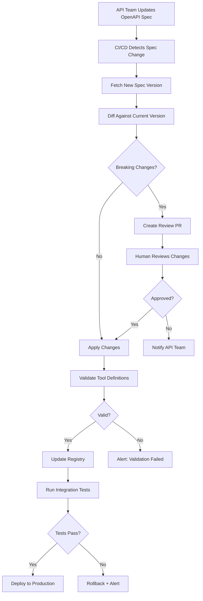

# Keeping Tools in Sync

## Introduction

You have built a pipeline that generates tools from OpenAPI specs, a registry that manages them at runtime, and a loader that hot-reloads when specs change. But in production, the harder problem is keeping everything synchronized over weeks and months. API teams ship changes on their own schedules. Endpoints get deprecated, parameters change types, and entirely new services come online — all without coordinating with your AI agent's deployment cycle.

In this lesson, we build the synchronization layer that detects spec changes, classifies them by impact, handles deprecation gracefully, and automates the update pipeline from API deployment to AI tool availability.

### What we'll cover

- Diffing OpenAPI specs to detect changes
- Classifying changes by severity (breaking, non-breaking, cosmetic)
- Deprecation workflows and sunset handling
- Automated sync pipelines with CI/CD
- Monitoring and alerting for sync failures

### Prerequisites

- Completed Lessons 01–04 on tool generation, schema conversion, discovery, and dynamic registration
- Familiarity with semantic versioning
- Basic understanding of CI/CD concepts

---

## Diffing OpenAPI specs

The foundation of sync is detecting what changed between two versions of a spec. We build a differ that compares operations, parameters, and schemas:

```python
from dataclasses import dataclass
from enum import Enum


class ChangeType(Enum):
    """Classification of changes between spec versions."""
    OPERATION_ADDED = "operation_added"
    OPERATION_REMOVED = "operation_removed"
    OPERATION_DEPRECATED = "operation_deprecated"
    PARAMETER_ADDED = "parameter_added"
    PARAMETER_REMOVED = "parameter_removed"
    PARAMETER_TYPE_CHANGED = "parameter_type_changed"
    PARAMETER_REQUIRED_CHANGED = "parameter_required_changed"
    DESCRIPTION_CHANGED = "description_changed"
    RESPONSE_CHANGED = "response_changed"


class Severity(Enum):
    """Impact level of a change."""
    BREAKING = "breaking"        # Will break existing tool calls
    NON_BREAKING = "non_breaking"  # Backward compatible
    COSMETIC = "cosmetic"        # No functional impact


@dataclass
class SpecChange:
    """A single change detected between two spec versions."""
    change_type: ChangeType
    severity: Severity
    operation_id: str
    detail: str
    old_value: str = ""
    new_value: str = ""


class SpecDiffer:
    """Compare two OpenAPI specs and produce a list of changes."""
    
    def diff(self, old_spec: dict, new_spec: dict) -> list[SpecChange]:
        """Compare two specs and return all changes.
        
        Args:
            old_spec: Previous version of the spec
            new_spec: New version of the spec
            
        Returns:
            List of changes, sorted by severity (breaking first)
        """
        changes = []
        
        old_ops = self._extract_ops(old_spec)
        new_ops = self._extract_ops(new_spec)
        
        old_ids = set(old_ops.keys())
        new_ids = set(new_ops.keys())
        
        # Detect added operations
        for op_id in new_ids - old_ids:
            changes.append(SpecChange(
                change_type=ChangeType.OPERATION_ADDED,
                severity=Severity.NON_BREAKING,
                operation_id=op_id,
                detail=f"New operation: {new_ops[op_id]['method']} {new_ops[op_id]['path']}",
            ))
        
        # Detect removed operations
        for op_id in old_ids - new_ids:
            changes.append(SpecChange(
                change_type=ChangeType.OPERATION_REMOVED,
                severity=Severity.BREAKING,
                operation_id=op_id,
                detail=f"Removed operation: {old_ops[op_id]['method']} {old_ops[op_id]['path']}",
            ))
        
        # Detect changes in shared operations
        for op_id in old_ids & new_ids:
            old_op = old_ops[op_id]
            new_op = new_ops[op_id]
            changes.extend(self._diff_operation(op_id, old_op, new_op))
        
        # Sort: breaking first, then non-breaking, then cosmetic
        severity_order = {Severity.BREAKING: 0, Severity.NON_BREAKING: 1, Severity.COSMETIC: 2}
        changes.sort(key=lambda c: severity_order[c.severity])
        
        return changes
    
    def _diff_operation(self, op_id: str, old_op: dict, new_op: dict) -> list[SpecChange]:
        """Compare two versions of the same operation."""
        changes = []
        
        # Check deprecation
        if not old_op.get("deprecated") and new_op.get("deprecated"):
            changes.append(SpecChange(
                change_type=ChangeType.OPERATION_DEPRECATED,
                severity=Severity.NON_BREAKING,
                operation_id=op_id,
                detail="Operation marked as deprecated",
            ))
        
        # Check parameter changes
        old_params = {p["name"]: p for p in old_op.get("parameters", [])}
        new_params = {p["name"]: p for p in new_op.get("parameters", [])}
        
        for name in set(new_params) - set(old_params):
            param = new_params[name]
            severity = Severity.BREAKING if param.get("required") else Severity.NON_BREAKING
            changes.append(SpecChange(
                change_type=ChangeType.PARAMETER_ADDED,
                severity=severity,
                operation_id=op_id,
                detail=f"Added parameter: {name} ({'required' if param.get('required') else 'optional'})",
            ))
        
        for name in set(old_params) - set(new_params):
            changes.append(SpecChange(
                change_type=ChangeType.PARAMETER_REMOVED,
                severity=Severity.BREAKING,
                operation_id=op_id,
                detail=f"Removed parameter: {name}",
            ))
        
        for name in set(old_params) & set(new_params):
            old_p = old_params[name]
            new_p = new_params[name]
            
            old_type = old_p.get("schema", {}).get("type", "string")
            new_type = new_p.get("schema", {}).get("type", "string")
            if old_type != new_type:
                changes.append(SpecChange(
                    change_type=ChangeType.PARAMETER_TYPE_CHANGED,
                    severity=Severity.BREAKING,
                    operation_id=op_id,
                    detail=f"Parameter '{name}' type changed",
                    old_value=old_type,
                    new_value=new_type,
                ))
            
            if old_p.get("required") != new_p.get("required"):
                # Optional → Required is breaking; Required → Optional is not
                becoming_required = new_p.get("required") and not old_p.get("required")
                changes.append(SpecChange(
                    change_type=ChangeType.PARAMETER_REQUIRED_CHANGED,
                    severity=Severity.BREAKING if becoming_required else Severity.NON_BREAKING,
                    operation_id=op_id,
                    detail=f"Parameter '{name}' required changed",
                    old_value=str(old_p.get("required", False)),
                    new_value=str(new_p.get("required", False)),
                ))
        
        # Check description changes
        old_desc = old_op.get("summary", "") + old_op.get("description", "")
        new_desc = new_op.get("summary", "") + new_op.get("description", "")
        if old_desc != new_desc:
            changes.append(SpecChange(
                change_type=ChangeType.DESCRIPTION_CHANGED,
                severity=Severity.COSMETIC,
                operation_id=op_id,
                detail="Description or summary updated",
            ))
        
        return changes
    
    def _extract_ops(self, spec: dict) -> dict:
        """Extract all operations indexed by operationId."""
        ops = {}
        for path, path_item in spec.get("paths", {}).items():
            for method in ["get", "post", "put", "patch", "delete"]:
                if method not in path_item:
                    continue
                op = path_item[method]
                op_id = op.get("operationId", f"{method}_{path}")
                ops[op_id] = {**op, "method": method.upper(), "path": path}
        return ops
```

**Output:**
```python
differ = SpecDiffer()
changes = differ.diff(spec_v1, spec_v2)

print(f"Found {len(changes)} changes:\n")
for change in changes:
    icon = {"breaking": "🔴", "non_breaking": "🟡", "cosmetic": "⚪"}
    print(f"  {icon[change.severity.value]} [{change.severity.value}] "
          f"{change.operation_id}: {change.detail}")
```

```
Found 5 changes:

  🔴 [breaking] deletePet: Removed operation: DELETE /pets/{petId}
  🔴 [breaking] updatePet: Added parameter: ownerId (required)
  🔴 [breaking] getPetById: Parameter 'petId' type changed (string → integer)
  🟡 [non_breaking] findPetsByStatus: Operation marked as deprecated
  ⚪ [cosmetic] listPets: Description or summary updated
```

---

## Change classification and impact assessment

Not all changes require the same response. We build a change report that recommends actions:

```python
@dataclass
class SyncReport:
    """Summary of spec changes with recommended actions."""
    
    old_version: str
    new_version: str
    changes: list[SpecChange]
    
    @property
    def has_breaking_changes(self) -> bool:
        return any(c.severity == Severity.BREAKING for c in self.changes)
    
    @property
    def breaking_count(self) -> int:
        return sum(1 for c in self.changes if c.severity == Severity.BREAKING)
    
    def recommend_action(self) -> str:
        """Recommend an action based on the changes detected."""
        if not self.changes:
            return "NO_ACTION: Specs are identical"
        
        if self.has_breaking_changes:
            return (
                f"MANUAL_REVIEW: {self.breaking_count} breaking change(s) detected. "
                "Review before deploying. Affected operations may fail if updated automatically."
            )
        
        has_non_breaking = any(c.severity == Severity.NON_BREAKING for c in self.changes)
        if has_non_breaking:
            return "AUTO_UPDATE: Non-breaking changes only. Safe to deploy automatically."
        
        return "AUTO_UPDATE: Cosmetic changes only. Safe to deploy automatically."
    
    def to_markdown(self) -> str:
        """Generate a markdown report for review."""
        lines = [
            f"# Spec Sync Report: v{self.old_version} → v{self.new_version}\n",
            f"**Total changes:** {len(self.changes)}",
            f"**Recommendation:** {self.recommend_action()}\n",
        ]
        
        # Group by severity
        for severity in [Severity.BREAKING, Severity.NON_BREAKING, Severity.COSMETIC]:
            group = [c for c in self.changes if c.severity == severity]
            if not group:
                continue
            
            icons = {
                Severity.BREAKING: "🔴 Breaking Changes",
                Severity.NON_BREAKING: "🟡 Non-Breaking Changes",
                Severity.COSMETIC: "⚪ Cosmetic Changes",
            }
            
            lines.append(f"\n## {icons[severity]}\n")
            lines.append("| Operation | Change | Detail |")
            lines.append("|-----------|--------|--------|")
            for c in group:
                lines.append(f"| `{c.operation_id}` | {c.change_type.value} | {c.detail} |")
        
        return "\n".join(lines)


# Usage
differ = SpecDiffer()
changes = differ.diff(old_spec, new_spec)

report = SyncReport(
    old_version=old_spec["info"]["version"],
    new_version=new_spec["info"]["version"],
    changes=changes,
)

print(report.to_markdown())
```

**Output:**
```markdown
# Spec Sync Report: v1.0.0 → v2.0.0

**Total changes:** 5
**Recommendation:** MANUAL_REVIEW: 3 breaking change(s) detected. Review before deploying.

## 🔴 Breaking Changes

| Operation | Change | Detail |
|-----------|--------|--------|
| `deletePet` | operation_removed | Removed operation: DELETE /pets/{petId} |
| `updatePet` | parameter_added | Added parameter: ownerId (required) |
| `getPetById` | parameter_type_changed | Parameter 'petId' type changed |

## 🟡 Non-Breaking Changes

| Operation | Change | Detail |
|-----------|--------|--------|
| `findPetsByStatus` | operation_deprecated | Operation marked as deprecated |

## ⚪ Cosmetic Changes

| Operation | Change | Detail |
|-----------|--------|--------|
| `listPets` | description_changed | Description or summary updated |
```

---

## Deprecation workflows

When an operation is marked as deprecated in the spec, we don't remove it immediately. Instead, we follow a deprecation workflow that gives consumers time to migrate:

```python
from datetime import datetime, timedelta


class DeprecationManager:
    """Manage the lifecycle of deprecated tools."""
    
    def __init__(self, grace_period_days: int = 30):
        self.grace_period = timedelta(days=grace_period_days)
        self._deprecated: dict[str, dict] = {}  # tool_name -> metadata
    
    def mark_deprecated(
        self,
        tool_name: str,
        reason: str = "",
        replacement: str | None = None,
        sunset_date: datetime | None = None,
    ) -> None:
        """Mark a tool as deprecated with transition metadata.
        
        Args:
            tool_name: Name of the deprecated tool
            reason: Why it's being deprecated
            replacement: Name of the replacement tool (if any)
            sunset_date: When the tool will be removed (defaults to grace period)
        """
        if sunset_date is None:
            sunset_date = datetime.now() + self.grace_period
        
        self._deprecated[tool_name] = {
            "deprecated_at": datetime.now(),
            "sunset_date": sunset_date,
            "reason": reason,
            "replacement": replacement,
            "usage_since_deprecation": 0,
        }
        
        print(f"⚠️ Deprecated: {tool_name}")
        print(f"   Reason: {reason}")
        if replacement:
            print(f"   Replacement: {replacement}")
        print(f"   Sunset: {sunset_date.strftime('%Y-%m-%d')}")
    
    def check_sunsets(self) -> list[str]:
        """Check for tools past their sunset date.
        
        Returns:
            List of tool names that should be removed
        """
        now = datetime.now()
        expired = []
        
        for name, meta in self._deprecated.items():
            if now >= meta["sunset_date"]:
                expired.append(name)
            else:
                days_left = (meta["sunset_date"] - now).days
                if days_left <= 7:
                    print(f"  ⏰ {name}: sunset in {days_left} days")
        
        return expired
    
    def get_deprecation_notice(self, tool_name: str) -> str | None:
        """Get a deprecation notice to include in the tool description.
        
        Returns:
            Notice string, or None if the tool is not deprecated
        """
        meta = self._deprecated.get(tool_name)
        if not meta:
            return None
        
        sunset = meta["sunset_date"].strftime("%Y-%m-%d")
        notice = f"DEPRECATED (sunset: {sunset})."
        
        if meta["reason"]:
            notice += f" {meta['reason']}."
        
        if meta["replacement"]:
            notice += f" Use '{meta['replacement']}' instead."
        
        return notice
    
    def update_tool_description(
        self,
        tool_definition: dict,
        tool_name: str,
    ) -> dict:
        """Prepend deprecation notice to a tool's description.
        
        Args:
            tool_definition: The tool definition to update
            tool_name: Name of the tool
            
        Returns:
            Updated tool definition with deprecation notice
        """
        notice = self.get_deprecation_notice(tool_name)
        if not notice:
            return tool_definition
        
        updated = {**tool_definition}
        current_desc = updated.get("description", "")
        updated["description"] = f"[{notice}] {current_desc}"
        
        return updated
```

**Output:**
```python
deprecation = DeprecationManager(grace_period_days=30)

deprecation.mark_deprecated(
    tool_name="findPetsByStatus",
    reason="Replaced by more flexible search endpoint",
    replacement="searchPets",
)

# Check the tool description
notice = deprecation.get_deprecation_notice("findPetsByStatus")
print(f"\nNotice: {notice}")
```

```
⚠️ Deprecated: findPetsByStatus
   Reason: Replaced by more flexible search endpoint
   Replacement: searchPets
   Sunset: 2025-08-15

Notice: DEPRECATED (sunset: 2025-08-15). Replaced by more flexible search endpoint. Use 'searchPets' instead.
```

> **🤖 AI Context:** When a tool's description starts with `[DEPRECATED...]`, models like GPT-4.1 and Claude will naturally prefer the replacement tool. This is more reliable than removing the tool immediately, which could break ongoing conversations.

---

## Automated sync pipeline

In production, spec sync is part of the CI/CD pipeline. When the API team updates their spec, the sync pipeline detects changes, validates them, and updates the AI agent's tools:



Here is the pipeline in code:

```python
import json
from pathlib import Path


class SyncPipeline:
    """Automated pipeline for keeping tools in sync with API specs."""
    
    def __init__(
        self,
        registry,
        loader,
        differ: SpecDiffer,
        deprecation: DeprecationManager,
        spec_store: Path = Path("./spec_versions"),
    ):
        self.registry = registry
        self.loader = loader
        self.differ = differ
        self.deprecation = deprecation
        self.spec_store = spec_store
        self.spec_store.mkdir(parents=True, exist_ok=True)
    
    def sync(
        self,
        source: str,
        api_name: str,
        auto_apply_non_breaking: bool = True,
    ) -> SyncReport:
        """Sync tools with a new spec version.
        
        Args:
            source: Path or URL to the new spec
            api_name: Name of the API
            auto_apply_non_breaking: Auto-apply non-breaking changes
            
        Returns:
            Sync report with changes and recommended actions
        """
        # Step 1: Load new spec
        new_spec = self.loader._fetch_spec(source)
        new_version = new_spec["info"]["version"]
        print(f"📥 Fetched {api_name} v{new_version}")
        
        # Step 2: Load current spec (if exists)
        current_path = self.spec_store / f"{api_name}_current.json"
        if current_path.exists():
            with open(current_path) as f:
                old_spec = json.load(f)
            old_version = old_spec["info"]["version"]
        else:
            old_spec = {"openapi": "3.1.0", "info": {"version": "0.0.0"}, "paths": {}}
            old_version = "0.0.0"
        
        # Step 3: Diff
        changes = self.differ.diff(old_spec, new_spec)
        report = SyncReport(old_version, new_version, changes)
        
        if not changes:
            print("✅ No changes detected")
            return report
        
        print(f"📊 Found {len(changes)} changes "
              f"({report.breaking_count} breaking)")
        
        # Step 4: Handle deprecations
        for change in changes:
            if change.change_type == ChangeType.OPERATION_DEPRECATED:
                self.deprecation.mark_deprecated(
                    tool_name=change.operation_id,
                    reason="Marked deprecated in API spec",
                )
        
        # Step 5: Check sunset dates
        expired = self.deprecation.check_sunsets()
        for tool_name in expired:
            self.registry.unregister(tool_name)
            print(f"🗑️ Removed sunset tool: {tool_name}")
        
        # Step 6: Decide whether to auto-apply
        if report.has_breaking_changes and not auto_apply_non_breaking:
            print(f"⚠️ Breaking changes detected — manual review required")
            print(report.recommend_action())
            return report
        
        if report.has_breaking_changes:
            print("⚠️ Breaking changes will be applied — review report carefully")
        
        # Step 7: Apply changes
        self._apply_changes(new_spec, api_name, changes)
        
        # Step 8: Save current spec
        with open(current_path, "w") as f:
            json.dump(new_spec, f, indent=2)
        
        # Step 9: Archive old spec
        if old_version != "0.0.0":
            archive_path = self.spec_store / f"{api_name}_v{old_version}.json"
            with open(archive_path, "w") as f:
                json.dump(old_spec, f, indent=2)
        
        print(f"✅ Sync complete: {api_name} v{old_version} → v{new_version}")
        return report
    
    def _apply_changes(
        self,
        new_spec: dict,
        api_name: str,
        changes: list[SpecChange],
    ) -> None:
        """Apply spec changes to the registry."""
        version = new_spec["info"]["version"]
        
        # Remove deleted operations
        for change in changes:
            if change.change_type == ChangeType.OPERATION_REMOVED:
                self.registry.unregister(change.operation_id)
        
        # Reload all remaining operations from new spec
        # (simpler and safer than incremental updates)
        self.loader.load_spec(
            json.dumps(new_spec),  # Pass as string
            api_name=api_name,
        )
    
    def rollback(self, api_name: str, target_version: str) -> bool:
        """Rollback to a previous spec version.
        
        Args:
            api_name: Name of the API
            target_version: Version to rollback to
            
        Returns:
            True if rollback succeeded
        """
        archive_path = self.spec_store / f"{api_name}_v{target_version}.json"
        
        if not archive_path.exists():
            print(f"❌ No archived spec found for {api_name} v{target_version}")
            return False
        
        with open(archive_path) as f:
            old_spec = json.load(f)
        
        # Save it as current
        current_path = self.spec_store / f"{api_name}_current.json"
        with open(current_path, "w") as f:
            json.dump(old_spec, f, indent=2)
        
        # Reload
        self.loader.load_spec(json.dumps(old_spec), api_name=api_name)
        
        print(f"↩️ Rolled back {api_name} to v{target_version}")
        return True
```

**Output:**
```python
pipeline = SyncPipeline(registry, loader, SpecDiffer(), DeprecationManager())

report = pipeline.sync("https://api.example.com/v2/openapi.json", "Petstore")
print(report.to_markdown())
```

```
📥 Fetched Petstore v2.0.0
📊 Found 5 changes (3 breaking)
⚠️ Deprecated: findPetsByStatus
   Reason: Marked deprecated in API spec
   Sunset: 2025-08-15
⚠️ Breaking changes will be applied — review report carefully
Loading spec: Petstore v2.0.0
✅ Sync complete: Petstore v1.0.0 → v2.0.0
```

---

## Monitoring and alerting

Track sync health with metrics and alerts:

```python
from datetime import datetime


class SyncMonitor:
    """Monitor tool sync health and alert on issues."""
    
    def __init__(self):
        self._sync_history: list[dict] = []
        self._alerts: list[dict] = []
    
    def record_sync(
        self,
        api_name: str,
        report: SyncReport,
        success: bool,
    ) -> None:
        """Record a sync event."""
        event = {
            "timestamp": datetime.now().isoformat(),
            "api_name": api_name,
            "old_version": report.old_version,
            "new_version": report.new_version,
            "total_changes": len(report.changes),
            "breaking_changes": report.breaking_count,
            "success": success,
        }
        self._sync_history.append(event)
        
        # Alert on breaking changes
        if report.has_breaking_changes:
            self._alerts.append({
                "level": "warning",
                "message": (f"{api_name}: {report.breaking_count} breaking changes "
                           f"in v{report.new_version}"),
                "timestamp": datetime.now().isoformat(),
            })
        
        # Alert on failures
        if not success:
            self._alerts.append({
                "level": "error",
                "message": f"{api_name}: Sync failed for v{report.new_version}",
                "timestamp": datetime.now().isoformat(),
            })
    
    def check_staleness(
        self,
        registry,
        max_age_hours: int = 24,
    ) -> list[str]:
        """Check for tools that haven't been synced recently.
        
        Returns:
            List of API names that may be stale
        """
        stale = []
        now = datetime.now()
        
        # Group sync history by API name
        latest_sync: dict[str, datetime] = {}
        for event in self._sync_history:
            api_name = event["api_name"]
            sync_time = datetime.fromisoformat(event["timestamp"])
            if api_name not in latest_sync or sync_time > latest_sync[api_name]:
                latest_sync[api_name] = sync_time
        
        for api_name, last_sync in latest_sync.items():
            age = now - last_sync
            if age.total_seconds() > max_age_hours * 3600:
                stale.append(api_name)
                hours_ago = age.total_seconds() / 3600
                print(f"  ⏰ {api_name}: last synced {hours_ago:.1f} hours ago")
        
        return stale
    
    def get_dashboard(self) -> str:
        """Generate a dashboard view of sync status."""
        lines = ["# Tool Sync Dashboard\n"]
        
        # Recent syncs
        lines.append("## Recent Syncs\n")
        lines.append("| Time | API | Version | Changes | Status |")
        lines.append("|------|-----|---------|---------|--------|")
        
        for event in self._sync_history[-10:]:
            status = "✅" if event["success"] else "❌"
            breaking = f" ({event['breaking_changes']} breaking)" if event["breaking_changes"] else ""
            lines.append(
                f"| {event['timestamp'][:19]} | {event['api_name']} | "
                f"v{event['new_version']} | {event['total_changes']}{breaking} | {status} |"
            )
        
        # Active alerts
        if self._alerts:
            lines.append("\n## Active Alerts\n")
            for alert in self._alerts[-5:]:
                icon = "🔴" if alert["level"] == "error" else "🟡"
                lines.append(f"- {icon} {alert['message']}")
        
        return "\n".join(lines)
```

**Output:**
```python
monitor = SyncMonitor()
monitor.record_sync("Petstore", report, success=True)
print(monitor.get_dashboard())
```

```markdown
# Tool Sync Dashboard

## Recent Syncs

| Time | API | Version | Changes | Status |
|------|-----|---------|---------|--------|
| 2025-07-16T14:30:00 | Petstore | v2.0.0 | 5 (3 breaking) | ✅ |

## Active Alerts

- 🟡 Petstore: 3 breaking changes in v2.0.0
```

---

## Putting it all together

Here is how all the sync components work together in a production setup:

```python
# Initialize the sync system
registry = ToolRegistry()
loader = DynamicToolLoader(registry, provider="openai")
differ = SpecDiffer()
deprecation = DeprecationManager(grace_period_days=30)
pipeline = SyncPipeline(registry, loader, differ, deprecation)
monitor = SyncMonitor()

# Scheduled sync job (runs periodically)
def scheduled_sync():
    """Run as a cron job or scheduled task."""
    apis_to_sync = [
        ("https://api.petstore.com/v3/openapi.json", "Petstore"),
        ("https://api.taskmanager.com/openapi.yaml", "Task Manager"),
        ("./specs/internal-api.yaml", "Internal API"),
    ]
    
    for source, api_name in apis_to_sync:
        try:
            report = pipeline.sync(source, api_name)
            monitor.record_sync(api_name, report, success=True)
        except Exception as e:
            print(f"❌ Sync failed for {api_name}: {e}")
            # Create a minimal report for monitoring
            empty_report = SyncReport("?", "?", [])
            monitor.record_sync(api_name, empty_report, success=False)
    
    # Check for stale APIs
    stale = monitor.check_staleness(registry, max_age_hours=24)
    if stale:
        print(f"\n⚠️ Stale APIs: {', '.join(stale)}")
    
    # Check for expired deprecations
    expired = deprecation.check_sunsets()
    for name in expired:
        registry.unregister(name)
        print(f"🗑️ Removed expired tool: {name}")
    
    print(f"\n📊 Registry: {len(registry.get_all())} active tools")
```

---

## Best practices

| Practice | Why it matters |
|----------|---------------|
| Always diff before applying changes | Prevents surprises from unexpected breaking changes |
| Auto-apply non-breaking changes, gate breaking ones | Balances automation speed with safety |
| Archive old spec versions | Enables rollback if new version causes problems |
| Use deprecation notices in tool descriptions | Models naturally prefer non-deprecated alternatives |
| Set sunset dates with grace periods | Gives consumers time to migrate |
| Monitor sync health with dashboards | Catches failures before they affect users |

---

## Common pitfalls

| ❌ Mistake | ✅ Solution |
|-----------|-------------|
| Removing deprecated tools immediately | Use grace periods with sunset dates |
| Treating all spec changes the same | Classify by severity: breaking, non-breaking, cosmetic |
| No rollback mechanism | Archive spec versions and support one-command rollback |
| Silent sync failures | Add monitoring, alerting, and a dashboard |
| Syncing on every request | Use scheduled jobs or webhook-triggered syncs |
| Not testing after sync | Run integration tests after applying changes |

---

## Hands-on exercise

### Your task

Build a complete sync pipeline that detects changes between two spec versions, classifies them, handles deprecations, and generates a report.

### Requirements

1. Create two versions of a spec: v1.0.0 and v2.0.0 where v2 has:
   - One new operation (non-breaking)
   - One deprecated operation (non-breaking)
   - One removed operation (breaking)
   - One parameter type change (breaking)
2. Run the `SpecDiffer` to detect all changes
3. Generate a `SyncReport` with the markdown output
4. Use `DeprecationManager` to handle the deprecated operation
5. Verify the report correctly classifies all changes by severity

### Expected result

A markdown report showing 4 changes: 2 breaking (red), 1 non-breaking (yellow), 1 non-breaking deprecation (yellow), with the correct recommendation (manual review required).

<details>
<summary>💡 Hints (click to expand)</summary>

- Define both specs as Python dicts — start with v1 and modify to create v2
- The differ returns changes sorted by severity (breaking first)
- Check that `report.has_breaking_changes` is `True`
- The recommendation should say "MANUAL_REVIEW" for any breaking changes

</details>

<details>
<summary>✅ Solution (click to expand)</summary>

```python
# Spec v1
spec_v1 = {
    "openapi": "3.1.0",
    "info": {"title": "Demo API", "version": "1.0.0"},
    "paths": {
        "/items": {
            "get": {
                "operationId": "listItems",
                "summary": "List items",
                "parameters": [
                    {"name": "limit", "in": "query",
                     "schema": {"type": "integer"}},
                ],
            },
            "post": {
                "operationId": "createItem",
                "summary": "Create an item",
            },
        },
        "/items/{id}": {
            "get": {
                "operationId": "getItem",
                "summary": "Get item by ID",
                "parameters": [
                    {"name": "id", "in": "path", "required": True,
                     "schema": {"type": "string"}},
                ],
            },
            "delete": {
                "operationId": "deleteItem",
                "summary": "Delete an item",
                "parameters": [
                    {"name": "id", "in": "path", "required": True,
                     "schema": {"type": "string"}},
                ],
            },
        },
    },
}

# Spec v2: changes
spec_v2 = {
    "openapi": "3.1.0",
    "info": {"title": "Demo API", "version": "2.0.0"},
    "paths": {
        "/items": {
            "get": {
                "operationId": "listItems",
                "summary": "List items",
                "deprecated": True,  # ← Deprecated
                "parameters": [
                    {"name": "limit", "in": "query",
                     "schema": {"type": "integer"}},
                ],
            },
            "post": {
                "operationId": "createItem",
                "summary": "Create an item",
            },
        },
        "/items/{id}": {
            "get": {
                "operationId": "getItem",
                "summary": "Get item by ID",
                "parameters": [
                    {"name": "id", "in": "path", "required": True,
                     "schema": {"type": "integer"}},  # ← Type changed
                ],
            },
            # deleteItem removed ← Breaking
        },
        "/items/search": {  # ← New operation
            "get": {
                "operationId": "searchItems",
                "summary": "Search items",
                "parameters": [
                    {"name": "q", "in": "query", "required": True,
                     "schema": {"type": "string"}},
                ],
            },
        },
    },
}

# Diff
differ = SpecDiffer()
changes = differ.diff(spec_v1, spec_v2)

# Report
report = SyncReport(
    old_version=spec_v1["info"]["version"],
    new_version=spec_v2["info"]["version"],
    changes=changes,
)

print(report.to_markdown())
print(f"\nHas breaking changes: {report.has_breaking_changes}")
print(f"Recommendation: {report.recommend_action()}")

# Handle deprecation
deprecation = DeprecationManager(grace_period_days=30)
for change in changes:
    if change.change_type == ChangeType.OPERATION_DEPRECATED:
        deprecation.mark_deprecated(
            tool_name=change.operation_id,
            reason="Deprecated in v2.0.0",
            replacement="searchItems",
        )
```

**Expected Output:**
```markdown
# Spec Sync Report: v1.0.0 → v2.0.0

**Total changes:** 4
**Recommendation:** MANUAL_REVIEW: 2 breaking change(s) detected. Review before deploying.

## 🔴 Breaking Changes

| Operation | Change | Detail |
|-----------|--------|--------|
| `deleteItem` | operation_removed | Removed operation: DELETE /items/{id} |
| `getItem` | parameter_type_changed | Parameter 'id' type changed |

## 🟡 Non-Breaking Changes

| Operation | Change | Detail |
|-----------|--------|--------|
| `searchItems` | operation_added | New operation: GET /items/search |
| `listItems` | operation_deprecated | Operation marked as deprecated |

Has breaking changes: True
Recommendation: MANUAL_REVIEW: 2 breaking change(s) detected. Review before deploying.

⚠️ Deprecated: listItems
   Reason: Deprecated in v2.0.0
   Replacement: searchItems
   Sunset: 2025-08-15
```

</details>

### Bonus challenges

- [ ] Add a webhook endpoint (using Flask or FastAPI) that API teams can call to trigger sync
- [ ] Implement email or Slack notifications for breaking changes
- [ ] Build a spec version timeline that shows the history of changes over time

---

## Summary

✅ The `SpecDiffer` compares old and new specs operation-by-operation, detecting additions, removals, deprecations, parameter changes, and description updates

✅ Changes are classified into three severity levels — breaking (blocks auto-deploy), non-breaking (safe to auto-apply), and cosmetic (no functional impact)

✅ Deprecation workflows use grace periods and sunset dates, with deprecation notices in tool descriptions so models naturally prefer replacements

✅ Automated sync pipelines integrate with CI/CD: fetch new spec → diff → classify → apply or gate → validate → deploy, with rollback support

✅ Monitoring dashboards track sync history, alert on breaking changes and failures, and detect stale APIs that haven't been synced recently

---

**Previous:** [Dynamic Tool Registration](./04-dynamic-tool-registration.md)

**Next:** [Lesson 13: Tool Versioning & Lifecycle →](../13-tool-versioning-lifecycle/00-tool-versioning-lifecycle.md)

<!--
Sources Consulted:
- OpenAPI Specification v3.1.1: https://spec.openapis.org/oas/v3.1.1.html
- Semantic Versioning 2.0.0: https://semver.org/
- OpenAI Function Calling: https://platform.openai.com/docs/guides/function-calling
- Anthropic Tool Use: https://docs.anthropic.com/en/docs/build-with-claude/tool-use
- Google Gemini Function Calling: https://ai.google.dev/gemini-api/docs/function-calling
- API Changelog Best Practices: https://web.dev/articles/api-design
-->
