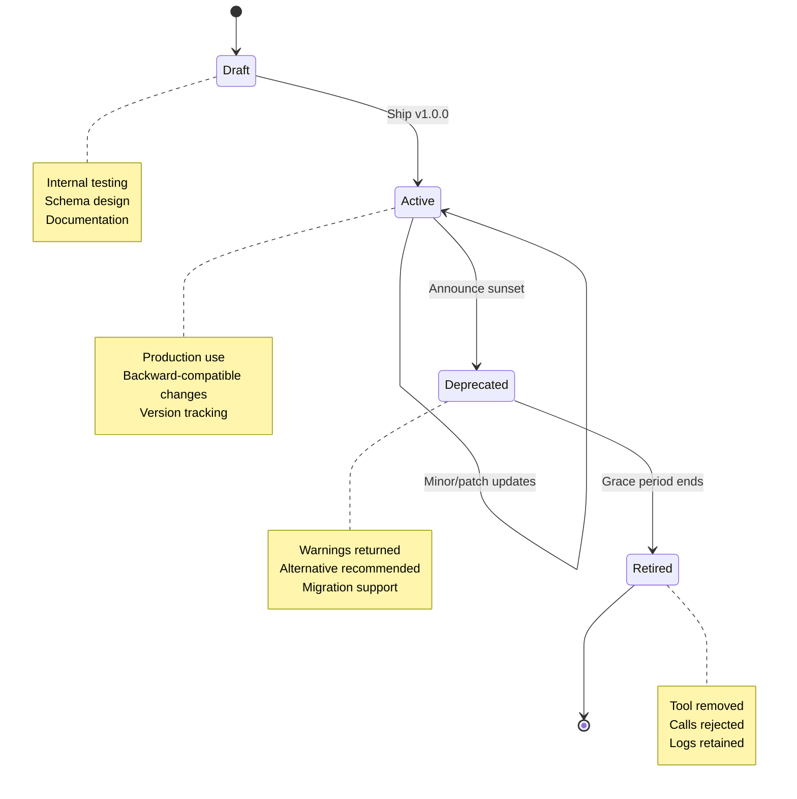

# Tool Versioning & Lifecycle

## Introduction

AI tools don't stay frozen. Parameters get added, descriptions get refined, entire tools get replaced with better alternatives. When your production system serves thousands of users and the model relies on specific tool schemas, even a small change can break everything — silently. The model might stop calling a tool, pass wrong arguments, or misinterpret renamed parameters.

Tool versioning is the discipline of managing these changes safely. It borrows proven practices from API lifecycle management — semantic versioning, backward compatibility, deprecation policies — and adapts them to the unique challenges of AI function calling, where the "consumer" of your API is a language model, not a human developer.

### Why tool versioning matters for AI

Traditional API versioning protects **human developers** from breaking changes. Tool versioning protects both developers **and AI models**:

| Audience | What breaks | Example |
|---|---|---|
| **Developers** | Code that constructs/parses tool calls | Renamed parameter: `location` → `city` |
| **AI Models** | Tool selection and argument generation | Changed description confuses tool choice |
| **End Users** | Application behavior and reliability | Removed tool causes silent failures |

### What we'll cover

This lesson is divided into six sub-lessons:

| # | Sub-lesson | Focus |
|---|---|---|
| 01 | [Tool Version Management](./01-tool-version-management.md) | Semantic versioning for tools, tracking versions, supporting multiple versions |
| 02 | [Backward Compatibility Strategies](./02-backward-compatibility-strategies.md) | Additive changes, optional parameters, aliases, safe migration paths |
| 03 | [Deprecation Patterns](./03-deprecation-patterns.md) | Warnings, sunset timelines, recommending alternatives, grace periods |
| 04 | [Tool Documentation Requirements](./04-tool-documentation-requirements.md) | Usage docs, parameter docs, example calls, changelogs |
| 05 | [Testing Tool Changes](./05-testing-tool-changes.md) | Unit testing, integration testing, AI behavior testing, regression prevention |
| 06 | [Rollback Procedures](./06-rollback-procedures.md) | Version rollback, state cleanup, user communication, incident response |

### Prerequisites

- Completed [OpenAPI/Swagger Integration](../12-openapi-swagger-integration/00-openapi-swagger-integration.md)
- Experience defining and handling function calls (Lessons 02–06)
- Understanding of JSON Schema for parameters (Lesson 03)

---

## The tool lifecycle at a glance

Every tool moves through predictable stages:

### Lifecycle stages

| Stage | Duration | What happens |
|---|---|---|
| **Draft** | Days–weeks | Tool designed, schema finalized, documentation written, tests created |
| **Active** | Months–years | Tool in production; receives minor/patch updates while maintaining backward compatibility |
| **Deprecated** | 30–90 days typical | Tool marked for removal; deprecation warnings returned; replacement tool promoted |
| **Retired** | Permanent | Tool removed from schema; calls return errors; historical logs preserved |

---

## How this connects to the rest of Unit 10

Tool versioning sits at the intersection of several topics we've already covered:

| Lesson | Connection |
|---|---|
| [Defining Functions](../02-defining-functions/00-defining-functions.md) | Schema design decisions directly affect versioning difficulty |
| [JSON Schema for Parameters](../03-json-schema-for-parameters/00-json-schema-for-parameters.md) | Schema evolution rules determine what's backward-compatible |
| [Error Handling](../08-error-handling/00-error-handling.md) | Deprecation warnings and version errors need proper error handling |
| [Tool Design Best Practices](../10-tool-design-best-practices/00-tool-design-best-practices.md) | Good design upfront reduces versioning pain |
| [OpenAPI/Swagger Integration](../12-openapi-swagger-integration/00-openapi-swagger-integration.md) | OpenAPI specs can version and document tool schemas |

---

## Key concepts preview

Before diving into the sub-lessons, here are the core ideas we'll build on:

### Semantic versioning for tools

We adapt **SemVer** (MAJOR.MINOR.PATCH) to tool schemas:

| Change type | Version bump | Example |
|---|---|---|
| Breaking (remove param, rename tool) | **MAJOR** | `get_weather` → v2.0.0 |
| New feature (add optional param) | **MINOR** | `get_weather` → v1.1.0 |
| Bug fix (fix description typo) | **PATCH** | `get_weather` → v1.0.1 |

### The AI compatibility challenge

Unlike traditional APIs where consumers read documentation, AI models "read" your tool schema at inference time. This means:

- **Description changes** can alter tool selection behavior
- **Parameter renames** are always breaking (the model generates the old name)
- **Adding required parameters** breaks existing prompts
- **Removing tools** causes silent failures (model can't find the tool)

> **🤖 AI Context:** With human API consumers, you can send an email about breaking changes. With AI models, you need to update every deployment that includes the old schema — simultaneously.

---

## Summary

✅ Tool versioning prevents silent failures when schemas change in production

✅ The tool lifecycle has four stages: **Draft → Active → Deprecated → Retired**

✅ AI models add unique versioning challenges — they "consume" schemas at inference time

✅ This lesson covers versioning, compatibility, deprecation, documentation, testing, and rollback across six sub-lessons

✅ Good upfront design (Lesson 10) directly reduces versioning complexity

**Next:** [Tool Version Management →](./01-tool-version-management.md)

---

*Previous:* [OpenAPI/Swagger Integration](../12-openapi-swagger-integration/05-keeping-tools-in-sync.md) | *Next:* [Tool Version Management →](./01-tool-version-management.md)

<!--
Sources Consulted:
- Semantic Versioning 2.0.0: https://semver.org/
- Google AIP-180 Backward Compatibility: https://google.aip.dev/180
- OpenAI Function Calling Guide: https://platform.openai.com/docs/guides/function-calling
- Anthropic Tool Use Documentation: https://platform.claude.com/docs/en/docs/build-with-claude/tool-use
- Microsoft API Design Best Practices: https://learn.microsoft.com/en-us/azure/architecture/best-practices/api-design
-->
