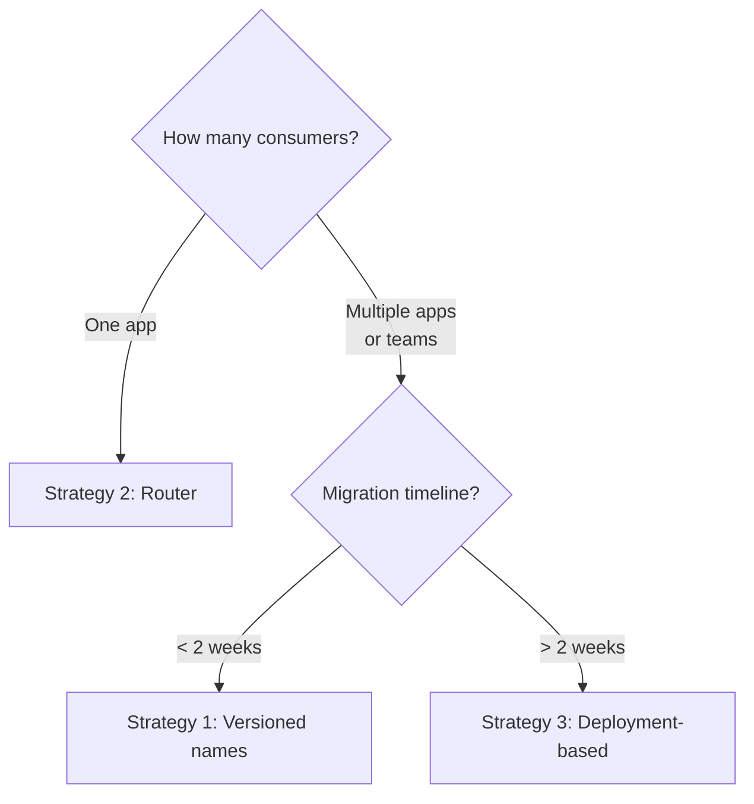

# Tool Version Management

## Introduction

When you ship a tool to production, it's no longer just code — it's a contract. Every deployment that includes `get_weather` with a `location` parameter has made a promise to the model: "this tool exists, it accepts this parameter, it returns this kind of result." Changing that contract without a plan is how production systems break.

Semantic versioning gives us a shared language for describing tool changes. Combined with a version registry and multi-version support, we can evolve tools safely — without forcing every consumer to update simultaneously.

### What we'll cover

- Applying Semantic Versioning (SemVer) to tool schemas
- Building a tool version registry
- Supporting multiple tool versions simultaneously
- Version selection strategies for AI applications

### Prerequisites

- Completed [Tool Versioning & Lifecycle Overview](./00-tool-versioning-lifecycle.md)
- Understanding of JSON Schema for tool parameters (Lesson 03)
- Experience defining tools for at least one provider (OpenAI, Anthropic, or Google)

---

## Semantic versioning for tool schemas

Semantic Versioning (SemVer) uses a three-part version number — **MAJOR.MINOR.PATCH** — where each part communicates the nature of the change.

### How SemVer maps to tool changes

```
MAJOR.MINOR.PATCH
  │     │     │
  │     │     └─ Bug fix (no behavior change)
  │     └─────── New feature (backward compatible)
  └───────────── Breaking change (incompatible)
```

| Version Bump | Rule | Tool Schema Examples |
|---|---|---|
| **PATCH** (1.0.0 → 1.0.1) | Fix that doesn't change behavior | Fix typo in description, clarify parameter wording |
| **MINOR** (1.0.0 → 1.1.0) | Backward-compatible addition | Add optional parameter, add new return field |
| **MAJOR** (1.0.0 → 2.0.0) | Breaking change | Remove parameter, rename tool, change required params |

### What counts as "breaking" for AI tools?

For traditional APIs, "breaking" means existing code won't compile or run. For AI tools, breaking also includes changes that alter how the model **selects or calls** the tool:

| Change | Breaking? | Why |
|---|---|---|
| Rename tool | ✅ Yes (MAJOR) | Model generates old name — call fails |
| Remove parameter | ✅ Yes (MAJOR) | Model may still send the removed param |
| Add **required** parameter | ✅ Yes (MAJOR) | Existing prompts won't include it |
| Change parameter type | ✅ Yes (MAJOR) | Model generates wrong type |
| Add **optional** parameter | ❌ No (MINOR) | Old calls still work without it |
| Improve description | ⚠️ Maybe (PATCH/MINOR) | Could change tool selection behavior |
| Add new enum value | ⚠️ Maybe (MINOR) | Model may or may not use it |
| Fix typo in description | ❌ No (PATCH) | Minimal behavioral impact |

> **Warning:** Description changes are a gray area. A "minor rewording" might cause the model to select a different tool. Always test description changes with your actual prompts before deploying.

### Example: version progression

```python
# v1.0.0 — Initial release
get_weather_v1 = {
    "type": "function",
    "name": "get_weather",
    "description": "Get the current weather for a city.",
    "parameters": {
        "type": "object",
        "properties": {
            "city": {
                "type": "string",
                "description": "The city name, e.g., 'London'"
            }
        },
        "required": ["city"],
    },
}

# v1.1.0 — Added optional 'units' parameter (MINOR)
get_weather_v1_1 = {
    "type": "function",
    "name": "get_weather",
    "description": "Get the current weather for a city.",
    "parameters": {
        "type": "object",
        "properties": {
            "city": {
                "type": "string",
                "description": "The city name, e.g., 'London'"
            },
            "units": {
                "type": "string",
                "enum": ["celsius", "fahrenheit"],
                "description": "Temperature units. Defaults to celsius."
            },
        },
        "required": ["city"],  # 'units' is optional — backward compatible
    },
}

# v2.0.0 — Renamed 'city' to 'location', added required 'country' (MAJOR)
get_weather_v2 = {
    "type": "function",
    "name": "get_weather",
    "description": "Get the current weather for a specific location.",
    "parameters": {
        "type": "object",
        "properties": {
            "location": {
                "type": "string",
                "description": "City name, e.g., 'London'"
            },
            "country": {
                "type": "string",
                "description": "ISO 3166-1 alpha-2 country code, e.g., 'GB'"
            },
            "units": {
                "type": "string",
                "enum": ["celsius", "fahrenheit"],
                "description": "Temperature units. Defaults to celsius."
            },
        },
        "required": ["location", "country"],
    },
}
```

---

## Building a tool version registry

A tool version registry tracks every version of every tool, making it possible to serve different versions to different deployments and roll back when needed.

### Registry data model

```python
from dataclasses import dataclass, field
from datetime import datetime
from enum import Enum
from typing import Any


class ToolStatus(Enum):
    DRAFT = "draft"
    ACTIVE = "active"
    DEPRECATED = "deprecated"
    RETIRED = "retired"


@dataclass
class ToolVersion:
    """A single version of a tool definition."""

    name: str
    version: str  # SemVer string, e.g. "1.2.0"
    status: ToolStatus
    schema: dict[str, Any]  # The full tool definition
    created_at: datetime = field(default_factory=datetime.now)
    deprecated_at: datetime | None = None
    sunset_date: datetime | None = None
    replacement: str | None = None  # e.g. "get_weather@2.0.0"
    changelog: str = ""

    @property
    def semver_tuple(self) -> tuple[int, int, int]:
        """Parse version string into comparable tuple."""
        parts = self.version.split(".")
        return (int(parts[0]), int(parts[1]), int(parts[2]))
```

**Output (usage):**
```python
tool = ToolVersion(
    name="get_weather",
    version="1.1.0",
    status=ToolStatus.ACTIVE,
    schema=get_weather_v1_1,
    changelog="Added optional 'units' parameter",
)
print(f"{tool.name}@{tool.version} [{tool.status.value}]")
# get_weather@1.1.0 [active]
```

### Registry implementation

```python
from collections import defaultdict


class ToolRegistry:
    """Manages versioned tool definitions."""

    def __init__(self):
        self._tools: dict[str, list[ToolVersion]] = defaultdict(list)

    def register(self, tool: ToolVersion) -> None:
        """Register a new tool version."""
        # Ensure version doesn't already exist
        existing = [t for t in self._tools[tool.name] if t.version == tool.version]
        if existing:
            raise ValueError(
                f"{tool.name}@{tool.version} already registered"
            )
        self._tools[tool.name].append(tool)
        # Keep sorted by version
        self._tools[tool.name].sort(key=lambda t: t.semver_tuple)

    def get_latest(self, name: str, *, include_deprecated: bool = False) -> ToolVersion:
        """Get the latest active version of a tool."""
        versions = self._tools.get(name, [])
        allowed = {ToolStatus.ACTIVE}
        if include_deprecated:
            allowed.add(ToolStatus.DEPRECATED)

        candidates = [v for v in versions if v.status in allowed]
        if not candidates:
            raise KeyError(f"No active version found for '{name}'")
        return candidates[-1]  # Last = highest version

    def get_version(self, name: str, version: str) -> ToolVersion:
        """Get a specific version of a tool."""
        for tool in self._tools.get(name, []):
            if tool.version == version:
                return tool
        raise KeyError(f"{name}@{version} not found")

    def get_all_active(self) -> list[ToolVersion]:
        """Get latest active version of every tool."""
        result = []
        for name in self._tools:
            try:
                result.append(self.get_latest(name))
            except KeyError:
                continue
        return result

    def get_tools_for_model(self) -> list[dict]:
        """Export active tool schemas for AI provider API calls."""
        return [tool.schema for tool in self.get_all_active()]
```

**Output (usage):**
```python
registry = ToolRegistry()
registry.register(ToolVersion(
    name="get_weather", version="1.0.0",
    status=ToolStatus.DEPRECATED, schema=get_weather_v1,
    changelog="Initial release",
))
registry.register(ToolVersion(
    name="get_weather", version="1.1.0",
    status=ToolStatus.ACTIVE, schema=get_weather_v1_1,
    changelog="Added optional 'units' parameter",
))

latest = registry.get_latest("get_weather")
print(f"Latest: {latest.name}@{latest.version}")
# Latest: get_weather@1.1.0

tools = registry.get_tools_for_model()
print(f"Active tools for model: {len(tools)}")
# Active tools for model: 1
```

---

## Supporting multiple versions simultaneously

In complex systems, you may need to run multiple versions of the same tool at once — for example, during a migration period or when different clients need different versions.

### Strategy 1: versioned tool names

The simplest approach — append the version to the tool name:

```python
tools = [
    {
        "type": "function",
        "name": "get_weather_v1",
        "description": "Get weather for a city. (Deprecated: use get_weather_v2)",
        "parameters": {
            "type": "object",
            "properties": {
                "city": {"type": "string", "description": "City name"}
            },
            "required": ["city"],
        },
    },
    {
        "type": "function",
        "name": "get_weather_v2",
        "description": "Get weather for a location with country code.",
        "parameters": {
            "type": "object",
            "properties": {
                "location": {"type": "string", "description": "City name"},
                "country": {"type": "string", "description": "ISO country code"},
            },
            "required": ["location", "country"],
        },
    },
]
```

**Pros:** Simple, explicit, easy to route.  
**Cons:** Pollutes the tool namespace; model may call the old version if the description isn't clear.

### Strategy 2: router-based versioning

Use a single tool name but route to the correct handler based on arguments:

```python
def handle_get_weather(arguments: dict) -> dict:
    """Route to the correct version based on arguments present."""
    if "city" in arguments and "country" not in arguments:
        # Legacy v1 call pattern
        return get_weather_v1_handler(arguments["city"])
    elif "location" in arguments and "country" in arguments:
        # Current v2 call pattern
        return get_weather_v2_handler(arguments["location"], arguments["country"])
    else:
        return {"error": "Invalid arguments. Use 'location' + 'country'."}
```

**Pros:** Single tool name, smooth migration.  
**Cons:** Ambiguous routing logic; hard to deprecate cleanly.

### Strategy 3: deployment-based versioning

Serve different tool sets to different deployments or environments:

```python
def get_tools_for_deployment(deployment: str) -> list[dict]:
    """Return the right tool versions for each deployment."""
    if deployment == "production-stable":
        return registry.get_version_schemas(max_major=1)  # v1.x only
    elif deployment == "production-canary":
        return registry.get_version_schemas(max_major=2)  # v1.x + v2.x
    elif deployment == "staging":
        return registry.get_all_active_schemas()           # Latest everything
    else:
        raise ValueError(f"Unknown deployment: {deployment}")
```

**Pros:** Safe rollout; canary testing with new versions.  
**Cons:** Multiple deployments to manage; version drift between environments.

### Choosing a strategy



---

## Version selection at request time

For systems that support multiple versions, you need a strategy to decide which version the model sees:

```python
class VersionSelector:
    """Select tool versions based on client context."""

    def __init__(self, registry: ToolRegistry):
        self.registry = registry

    def select_tools(
        self,
        *,
        pinned_versions: dict[str, str] | None = None,
        max_major: int | None = None,
        include_deprecated: bool = False,
    ) -> list[dict]:
        """
        Select tool schemas based on constraints.

        Args:
            pinned_versions: Pin specific tools to specific versions.
                             e.g. {"get_weather": "1.1.0"}
            max_major: Maximum major version to include.
            include_deprecated: Whether to include deprecated tools.

        Returns:
            List of tool schemas for the AI provider API.
        """
        result = []

        for tool_name in self.registry.list_tools():
            if pinned_versions and tool_name in pinned_versions:
                # Use the pinned version
                version = pinned_versions[tool_name]
                tool = self.registry.get_version(tool_name, version)
            else:
                # Use the latest active version
                tool = self.registry.get_latest(
                    tool_name, include_deprecated=include_deprecated
                )

            # Apply major version ceiling
            if max_major is not None and tool.semver_tuple[0] > max_major:
                # Fall back to latest within the allowed major version
                tool = self.registry.get_latest_within_major(
                    tool_name, max_major
                )

            if tool:
                result.append(tool.schema)

        return result
```

**Usage example:**

```python
selector = VersionSelector(registry)

# Production: pin to known-good versions
prod_tools = selector.select_tools(
    pinned_versions={"get_weather": "1.1.0", "search_docs": "2.3.1"}
)

# Staging: latest everything, including deprecated (for testing migration)
staging_tools = selector.select_tools(include_deprecated=True)

# Canary: allow v2 but nothing beyond
canary_tools = selector.select_tools(max_major=2)
```

---

## Best practices

| Practice | Why It Matters |
|----------|----------------|
| Follow SemVer strictly for tool changes | Predictable impact assessment; automated tooling can parse versions |
| Treat description changes as potential MINOR bumps | AI models rely on descriptions for tool selection — rewording can change behavior |
| Never reuse a version number | Once `1.0.0` is released, it must never change; publish `1.0.1` instead |
| Pin tool versions in production | Prevents unexpected behavior when new versions are registered |
| Test every version bump against real prompts | SemVer tells you the *type* of change, not the *impact* on model behavior |
| Store version metadata alongside schemas | Enables auditing, rollback, and lifecycle tracking |

---

## Common pitfalls

| ❌ Mistake | ✅ Solution |
|-----------|-------------|
| No versioning — just overwriting the tool in place | Always increment the version, even for "small" changes |
| Treating parameter renames as minor changes | Renames are always breaking (MAJOR) — the model generates the old name |
| Adding required parameters without a major bump | New required params break existing prompts; use MAJOR version |
| Versioning tool names like `tool_v1`, `tool_v2` without a registry | Use a proper registry to track versions; versioned names are a deployment strategy, not a substitute |
| Assuming the model will "figure out" schema changes | Models have no memory of previous schemas; they see only what you send |
| Not recording why a version was created | Changelogs are critical for debugging production issues months later |

---

## Hands-on exercise

### Your task

Build a tool version registry that manages versions of a `search_documents` tool through three versions.

### Requirements

1. Create the `ToolVersion` and `ToolRegistry` classes
2. Register three versions:
   - **v1.0.0** — `search_documents(query: str)` — basic search
   - **v1.1.0** — add optional `max_results: int` parameter
   - **v2.0.0** — rename `query` to `search_query`, add required `collection: str`
3. Mark v1.0.0 as deprecated, v1.1.0 as active, v2.0.0 as active
4. Implement `get_latest()` that returns v2.0.0
5. Implement `get_tools_for_model()` that returns only the latest active version of each unique tool
6. Print the registry state showing all versions and their statuses

### Expected result

```
Registry state:
  search_documents@1.0.0 [deprecated]
  search_documents@1.1.0 [active]
  search_documents@2.0.0 [active]

Latest: search_documents@2.0.0
Tools for model: 1 tool(s)
```

<details>
<summary>💡 Hints (click to expand)</summary>

- Use `@dataclass` for `ToolVersion` to avoid boilerplate
- Sort versions by parsing the SemVer string into a tuple of integers
- `get_latest()` should return the last item when filtered by status and sorted by version
- `get_tools_for_model()` should call `get_latest()` for each unique tool name

</details>

<details>
<summary>✅ Solution (click to expand)</summary>

```python
from dataclasses import dataclass, field
from datetime import datetime
from enum import Enum
from typing import Any
from collections import defaultdict


class ToolStatus(Enum):
    DRAFT = "draft"
    ACTIVE = "active"
    DEPRECATED = "deprecated"
    RETIRED = "retired"


@dataclass
class ToolVersion:
    name: str
    version: str
    status: ToolStatus
    schema: dict[str, Any]
    changelog: str = ""

    @property
    def semver_tuple(self) -> tuple[int, int, int]:
        parts = self.version.split(".")
        return (int(parts[0]), int(parts[1]), int(parts[2]))


class ToolRegistry:
    def __init__(self):
        self._tools: dict[str, list[ToolVersion]] = defaultdict(list)

    def register(self, tool: ToolVersion) -> None:
        self._tools[tool.name].append(tool)
        self._tools[tool.name].sort(key=lambda t: t.semver_tuple)

    def get_latest(self, name: str) -> ToolVersion:
        candidates = [
            t for t in self._tools[name] if t.status == ToolStatus.ACTIVE
        ]
        if not candidates:
            raise KeyError(f"No active version for '{name}'")
        return candidates[-1]

    def get_tools_for_model(self) -> list[dict]:
        return [self.get_latest(name).schema for name in self._tools]

    def print_state(self):
        print("Registry state:")
        for name in self._tools:
            for tool in self._tools[name]:
                print(f"  {tool.name}@{tool.version} [{tool.status.value}]")


# Define the three versions
v1 = {
    "type": "function",
    "name": "search_documents",
    "description": "Search documents by query.",
    "parameters": {
        "type": "object",
        "properties": {
            "query": {"type": "string", "description": "Search query"}
        },
        "required": ["query"],
    },
}

v1_1 = {
    "type": "function",
    "name": "search_documents",
    "description": "Search documents by query with optional result limit.",
    "parameters": {
        "type": "object",
        "properties": {
            "query": {"type": "string", "description": "Search query"},
            "max_results": {
                "type": "integer",
                "description": "Max results to return. Defaults to 10.",
            },
        },
        "required": ["query"],
    },
}

v2 = {
    "type": "function",
    "name": "search_documents",
    "description": "Search documents in a collection.",
    "parameters": {
        "type": "object",
        "properties": {
            "search_query": {"type": "string", "description": "Search text"},
            "collection": {
                "type": "string",
                "description": "Document collection to search",
            },
            "max_results": {
                "type": "integer",
                "description": "Max results. Defaults to 10.",
            },
        },
        "required": ["search_query", "collection"],
    },
}

# Build the registry
registry = ToolRegistry()
registry.register(ToolVersion("search_documents", "1.0.0", ToolStatus.DEPRECATED, v1))
registry.register(ToolVersion("search_documents", "1.1.0", ToolStatus.ACTIVE, v1_1))
registry.register(ToolVersion("search_documents", "2.0.0", ToolStatus.ACTIVE, v2))

registry.print_state()
latest = registry.get_latest("search_documents")
print(f"\nLatest: {latest.name}@{latest.version}")
tools = registry.get_tools_for_model()
print(f"Tools for model: {len(tools)} tool(s)")
```

</details>

### Bonus challenges

- [ ] Add a `get_latest_within_major(name, major_version)` method that returns the latest within a specific major version
- [ ] Add validation that prevents registering a version with a lower number than an existing version of the same status
- [ ] Implement a `diff_versions(name, v1, v2)` method that shows what changed between two versions

---

## Summary

✅ **Semantic Versioning** (MAJOR.MINOR.PATCH) applies to tool schemas — rename/remove is MAJOR, add optional param is MINOR, fix typo is PATCH

✅ AI tools have unique versioning challenges — the model "reads" the schema at inference time, so even description changes can alter behavior

✅ A **tool version registry** tracks all versions with metadata (status, changelog, dates) for safe lifecycle management

✅ **Multi-version support** strategies include versioned names, router-based routing, and deployment-based selection

✅ **Pin tool versions** in production and use canary/staging deployments to test new versions before rollout

**Next:** [Backward Compatibility Strategies →](./02-backward-compatibility-strategies.md)

---

*Previous:* [Tool Versioning & Lifecycle Overview](./00-tool-versioning-lifecycle.md) | *Next:* [Backward Compatibility Strategies →](./02-backward-compatibility-strategies.md)

<!--
Sources Consulted:
- Semantic Versioning 2.0.0: https://semver.org/
- Google AIP-180 Backward Compatibility: https://google.aip.dev/180
- OpenAI Function Calling Guide: https://platform.openai.com/docs/guides/function-calling
- Microsoft API Design Best Practices (Versioning): https://learn.microsoft.com/en-us/azure/architecture/best-practices/api-design
-->
