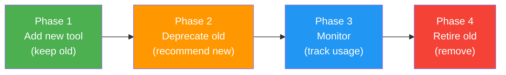

# Backward Compatibility Strategies

## Introduction

The best version bump is the one you never have to make. By designing tool changes that are **backward compatible** — meaning old calls still work with the new schema — you avoid the pain of coordinating major version migrations across deployments, retraining model behavior, and fixing broken production workflows.

This sub-lesson covers the specific strategies that keep your tools compatible: additive-only changes, optional parameters, alias support, and structured migration paths for when breaking changes are truly unavoidable.

### What we'll cover

- The golden rule: additive changes only
- Making new parameters optional with sensible defaults
- Supporting parameter aliases during transitions
- Designing safe migration paths for breaking changes
- Provider-specific compatibility considerations

### Prerequisites

- Completed [Tool Version Management](./01-tool-version-management.md)
- Understanding of JSON Schema `required` and default values
- Experience handling function calls (Lesson 04)

---

## The golden rule: additive changes only

Google's API compatibility guidelines (AIP-180) state it clearly: **existing client code must not be broken by a service updating to a new minor or patch release.** The same principle applies to AI tools — old prompts and old code must continue to work.

An **additive change** adds something new without removing or modifying anything existing:

| ✅ Additive (safe) | ❌ Non-additive (breaking) |
|---|---|
| Add new optional parameter | Remove existing parameter |
| Add new enum value | Rename existing parameter |
| Add new return field | Change parameter type |
| Expand description with more detail | Change existing default value |
| Add a new tool entirely | Remove or rename a tool |

### The additive change in action

```python
# v1.0.0 — Original tool
search_tool_v1 = {
    "type": "function",
    "name": "search_products",
    "description": "Search for products in the catalog.",
    "parameters": {
        "type": "object",
        "properties": {
            "query": {
                "type": "string",
                "description": "Search keywords"
            },
        },
        "required": ["query"],
    },
}

# v1.1.0 — Additive change (new optional params, no removals)
search_tool_v1_1 = {
    "type": "function",
    "name": "search_products",
    "description": "Search for products in the catalog.",
    "parameters": {
        "type": "object",
        "properties": {
            "query": {
                "type": "string",
                "description": "Search keywords"
            },
            # NEW — optional parameter with default
            "category": {
                "type": "string",
                "enum": ["electronics", "clothing", "books", "all"],
                "description": "Filter by category. Defaults to 'all'."
            },
            # NEW — optional parameter with default
            "max_results": {
                "type": "integer",
                "description": "Maximum number of results. Defaults to 10."
            },
        },
        "required": ["query"],  # Only 'query' is required — unchanged
    },
}
```

A call using the v1.0.0 pattern — `search_products(query="wireless headphones")` — still works perfectly with the v1.1.0 schema. The new parameters use their defaults.

---

## Making new parameters optional with defaults

The most common backward-compatible change is adding a new parameter. The key rule: **new parameters must never be required**.

### Pattern: optional parameter with documented default

```python
def handle_search_products(arguments: dict) -> dict:
    """Handle search_products with backward-compatible defaults."""
    query = arguments["query"]  # Always present (required)
    category = arguments.get("category", "all")  # Default if missing
    max_results = arguments.get("max_results", 10)  # Default if missing

    results = product_db.search(
        query=query,
        category=None if category == "all" else category,
        limit=max_results,
    )
    return {"results": results, "count": len(results)}
```

### The default value contract

When you add an optional parameter, its default value becomes part of your API contract:

> **Important:** Once published, default values must not change (per Google AIP-180). If `max_results` defaults to 10 in v1.1.0, it must still default to 10 in v1.2.0. Changing a default is a semantic breaking change — existing callers expect the old behavior.

```python
# ❌ WRONG — changing the default in a minor version
# v1.1.0: max_results defaults to 10
# v1.2.0: max_results defaults to 20  ← Breaking change!

# ✅ CORRECT — add a NEW parameter if you need different behavior
# v1.2.0: Add 'page_size' with default 20, keep max_results defaulting to 10
```

### Enum expansion

Adding new values to an enum is generally safe, but document it:

```python
# v1.1.0
"category": {
    "type": "string",
    "enum": ["electronics", "clothing", "books", "all"],
}

# v1.2.0 — Added "home" and "sports" (MINOR)
"category": {
    "type": "string",
    "enum": ["electronics", "clothing", "books", "home", "sports", "all"],
}
```

> **Note:** Adding enum values is safe for tool *input* parameters (the model generates them). Be more careful with enum values in *responses* — existing code that handles responses with a `match` statement may not handle unknown values.

---

## Supporting parameter aliases during transitions

Sometimes you need to rename a parameter but can't do a major version bump immediately. **Aliases** let you accept both the old and new name during a transition period.

### The alias pattern

```python
def handle_get_weather(arguments: dict) -> dict:
    """Handle get_weather with aliased parameter names."""
    # Accept both 'city' (old) and 'location' (new)
    location = arguments.get("location") or arguments.get("city")
    if not location:
        return {"error": "Missing required parameter: 'location' (or 'city')"}

    # Accept both 'temp_unit' (old) and 'units' (new)
    units = arguments.get("units") or arguments.get("temp_unit", "celsius")

    weather = weather_api.get_current(location=location, units=units)
    return {"temperature": weather.temp, "units": units, "location": location}
```

### Schema with alias documentation

```python
get_weather_with_alias = {
    "type": "function",
    "name": "get_weather",
    "description": "Get current weather. Use 'location' for the city name.",
    "parameters": {
        "type": "object",
        "properties": {
            "location": {
                "type": "string",
                "description": "City name, e.g., 'London'. (Previously named 'city')"
            },
            "city": {
                "type": "string",
                "description": "Deprecated: use 'location' instead."
            },
            "units": {
                "type": "string",
                "enum": ["celsius", "fahrenheit"],
                "description": "Temperature units. Defaults to celsius."
            },
        },
        "required": ["location"],  # New name is required
    },
}
```

### Alias management class

```python
from typing import Any


class ParameterAliases:
    """Manage parameter name transitions with aliases."""

    def __init__(self):
        self._aliases: dict[str, dict[str, str]] = {}
        # {tool_name: {old_param: new_param}}

    def add_alias(self, tool: str, old_name: str, new_name: str) -> None:
        """Register a parameter alias."""
        if tool not in self._aliases:
            self._aliases[tool] = {}
        self._aliases[tool][old_name] = new_name

    def resolve(self, tool: str, arguments: dict[str, Any]) -> dict[str, Any]:
        """Resolve aliased parameters, preferring new names."""
        if tool not in self._aliases:
            return arguments

        resolved = dict(arguments)
        for old_name, new_name in self._aliases[tool].items():
            if old_name in resolved and new_name not in resolved:
                # Old name present, new name absent — migrate
                resolved[new_name] = resolved.pop(old_name)
            elif old_name in resolved and new_name in resolved:
                # Both present — prefer new, discard old
                del resolved[old_name]

        return resolved
```

**Output (usage):**
```python
aliases = ParameterAliases()
aliases.add_alias("get_weather", "city", "location")
aliases.add_alias("get_weather", "temp_unit", "units")

# Old-style call
old_args = {"city": "London", "temp_unit": "celsius"}
resolved = aliases.resolve("get_weather", old_args)
print(resolved)
# {'location': 'London', 'units': 'celsius'}

# New-style call — passes through unchanged
new_args = {"location": "London", "units": "fahrenheit"}
resolved = aliases.resolve("get_weather", new_args)
print(resolved)
# {'location': 'London', 'units': 'fahrenheit'}
```

---

## Designing safe migration paths

When a breaking change is unavoidable, plan the migration in stages:



### Phase 1: introduce the new version alongside the old

```python
# Both tools available simultaneously
tools = [
    {
        "type": "function",
        "name": "search_orders",
        "description": "Search orders by customer name. Deprecated: use search_orders_v2.",
        "parameters": {
            "type": "object",
            "properties": {
                "customer_name": {"type": "string"},
            },
            "required": ["customer_name"],
        },
    },
    {
        "type": "function",
        "name": "search_orders_v2",
        "description": "Search orders with flexible filters.",
        "parameters": {
            "type": "object",
            "properties": {
                "customer_id": {"type": "string", "description": "Customer UUID"},
                "date_range": {
                    "type": "object",
                    "properties": {
                        "start": {"type": "string", "description": "ISO date"},
                        "end": {"type": "string", "description": "ISO date"},
                    },
                },
                "status": {
                    "type": "string",
                    "enum": ["pending", "shipped", "delivered", "cancelled"],
                },
            },
            "required": ["customer_id"],
        },
    },
]
```

### Phase 2: add deprecation signals

Update the old tool's description and add logging:

```python
import logging
from datetime import datetime

logger = logging.getLogger("tool_lifecycle")


def handle_tool_call(tool_name: str, arguments: dict) -> dict:
    """Route tool calls with deprecation tracking."""
    if tool_name == "search_orders":
        logger.warning(
            "Deprecated tool called: search_orders. "
            "Migrate to search_orders_v2. "
            f"Sunset date: 2026-04-01. Args: {arguments}"
        )
        # Still execute — don't break existing functionality
        return search_orders_legacy(arguments)

    elif tool_name == "search_orders_v2":
        return search_orders_current(arguments)

    else:
        return {"error": f"Unknown tool: {tool_name}"}
```

### Phase 3: monitor and validate

Track usage metrics to know when it's safe to retire:

```python
from collections import Counter

# Track calls per tool version
tool_call_counts: Counter = Counter()


def track_tool_call(tool_name: str) -> None:
    """Track tool usage for migration progress."""
    tool_call_counts[tool_name] += 1


def migration_report() -> dict:
    """Generate a migration progress report."""
    old_calls = tool_call_counts.get("search_orders", 0)
    new_calls = tool_call_counts.get("search_orders_v2", 0)
    total = old_calls + new_calls

    return {
        "old_version_calls": old_calls,
        "new_version_calls": new_calls,
        "migration_percentage": (
            round(new_calls / total * 100, 1) if total > 0 else 0
        ),
        "safe_to_retire": old_calls == 0,
    }
```

**Output:**
```python
print(migration_report())
# {
#     'old_version_calls': 12,
#     'new_version_calls': 847,
#     'migration_percentage': 98.6,
#     'safe_to_retire': False
# }
```

### Phase 4: retire the old version

Only after confirming zero usage:

```python
def retire_tool(registry: "ToolRegistry", name: str, version: str) -> None:
    """Retire a tool version after confirming zero usage."""
    report = migration_report()
    if not report["safe_to_retire"]:
        raise RuntimeError(
            f"Cannot retire {name}@{version}: "
            f"{report['old_version_calls']} calls still active"
        )

    tool = registry.get_version(name, version)
    tool.status = ToolStatus.RETIRED
    tool.retired_at = datetime.now()
    logger.info(f"Retired {name}@{version}")
```

---

## Provider-specific compatibility considerations

Each AI provider handles schema changes slightly differently:

| Consideration | OpenAI | Anthropic | Google Gemini |
|---|---|---|---|
| **Strict mode** | `strict: true` rejects non-conforming calls | `strict: true` available | `VALIDATED` mode available |
| **Extra properties** | Rejected in strict mode (`additionalProperties: false`) | Ignored by default | Depends on mode |
| **Unknown params** | May cause errors with strict | Typically ignored | Typically ignored |
| **Schema caching** | First-request processing, then cached | Per-request | Per-request |

### OpenAI strict mode and backward compatibility

OpenAI's strict mode requires `additionalProperties: false` and all fields marked as `required`. This creates a tension with backward compatibility:

```python
# With strict mode, "optional" params must still be in 'required',
# but can accept null to indicate "not provided"
strict_tool = {
    "type": "function",
    "name": "get_weather",
    "strict": True,
    "parameters": {
        "type": "object",
        "properties": {
            "location": {"type": "string"},
            "units": {
                "type": ["string", "null"],  # Nullable = optional
                "enum": ["celsius", "fahrenheit"],
            },
        },
        "required": ["location", "units"],  # Both "required"
        "additionalProperties": False,
    },
}
```

> **Tip:** When using OpenAI strict mode, use `"type": ["string", "null"]` to make a parameter functionally optional while satisfying the `required` constraint. The model sends `null` when the user doesn't specify a value.

---

## Best practices

| Practice | Why It Matters |
|----------|----------------|
| Default to additive changes whenever possible | Avoids MAJOR version bumps and coordinated migrations |
| Never change existing default values | Alters behavior for all callers who rely on the default |
| Use aliases for parameter renames during transition | Lets old and new patterns coexist without breaking either |
| Plan migration in 4 phases with usage tracking | Ensures you retire old versions only when no one uses them |
| Document backward compatibility guarantees | Teams need to know what's safe to change without a major bump |
| Test old call patterns against new schemas | The model may still generate old-style calls after schema updates |

---

## Common pitfalls

| ❌ Mistake | ✅ Solution |
|-----------|-------------|
| Making new parameters required in a minor version | Always make new parameters optional with sensible defaults |
| Changing enum values (removing or renaming) | Only add new enum values; never remove or rename existing ones |
| Assuming aliases work forever | Aliases are a transition tool — set a deadline and remove them |
| Skipping usage monitoring during migration | Without data, you don't know when it's safe to retire the old version |
| Updating default values in a patch release | Default value changes are semantic breaking changes — bump MAJOR |
| Forgetting strict mode constraints when adding optional params | In OpenAI strict mode, use nullable types instead of truly optional params |

---

## Hands-on exercise

### Your task

Implement a backward-compatible migration for a `create_ticket` tool that needs to transition from a flat structure to a nested one.

### Requirements

1. **v1.0.0** — `create_ticket(title, description, priority)` where `priority` is a string ("low", "medium", "high")
2. **v1.1.0** — Add optional `assignee` parameter (string, email) — backward compatible
3. **v2.0.0** — Restructure: `priority` becomes an object `{"level": "high", "sla_hours": 4}`, add required `project_id`
4. Build a handler that accepts **both** v1 and v2 call patterns using aliases and argument normalization
5. Track which version pattern each call uses

### Expected result

```
Handling v1-style call: {'title': 'Bug', 'description': 'Fix it', 'priority': 'high'}
  → Normalized: {'title': 'Bug', 'description': 'Fix it', 'priority': {'level': 'high', 'sla_hours': 24}, 'project_id': 'default'}
  → Pattern: v1

Handling v2-style call: {'title': 'Bug', 'description': 'Fix it', 'priority': {'level': 'high', 'sla_hours': 4}, 'project_id': 'PROJ-1'}
  → Pattern: v2
```

<details>
<summary>💡 Hints (click to expand)</summary>

- Check `type(arguments.get("priority"))` — if it's a string, it's a v1 call; if it's a dict, it's v2
- Map flat priority strings to SLA hours: `{"low": 72, "medium": 24, "high": 4, "critical": 1}`
- Use a default `project_id` for v1-style calls that don't include it
- Log the detected pattern version for migration tracking

</details>

<details>
<summary>✅ Solution (click to expand)</summary>

```python
from collections import Counter

# Default SLA mapping for v1 priorities
PRIORITY_SLA_MAP = {
    "low": 72,
    "medium": 24,
    "high": 4,
    "critical": 1,
}

call_patterns = Counter()


def normalize_create_ticket(arguments: dict) -> tuple[dict, str]:
    """
    Normalize create_ticket arguments to v2 format.
    Returns (normalized_args, detected_version).
    """
    normalized = dict(arguments)
    priority = arguments.get("priority")

    if isinstance(priority, str):
        # v1-style: flat priority string → convert to v2 object
        sla = PRIORITY_SLA_MAP.get(priority, 24)
        normalized["priority"] = {"level": priority, "sla_hours": sla}
        normalized.setdefault("project_id", "default")
        return normalized, "v1"
    elif isinstance(priority, dict):
        # v2-style: already structured
        return normalized, "v2"
    else:
        raise ValueError(f"Unexpected priority format: {type(priority)}")


def handle_create_ticket(arguments: dict) -> dict:
    """Handle create_ticket with backward compatibility."""
    normalized, version = normalize_create_ticket(arguments)
    call_patterns[version] += 1

    print(f"Handling {version}-style call: {arguments}")
    print(f"  → Normalized: {normalized}")
    print(f"  → Pattern: {version}")

    # Process with normalized v2 format
    ticket = {
        "id": "TICKET-001",
        "title": normalized["title"],
        "description": normalized["description"],
        "priority": normalized["priority"],
        "project_id": normalized["project_id"],
        "assignee": normalized.get("assignee"),
    }
    return ticket


# Test with v1-style call
handle_create_ticket({
    "title": "Bug",
    "description": "Fix it",
    "priority": "high",
})

print()

# Test with v2-style call
handle_create_ticket({
    "title": "Bug",
    "description": "Fix it",
    "priority": {"level": "high", "sla_hours": 4},
    "project_id": "PROJ-1",
})

print(f"\nMigration stats: {dict(call_patterns)}")
```

</details>

### Bonus challenges

- [ ] Add support for a v1.1.0 call pattern that includes `assignee`
- [ ] Implement a middleware function that automatically normalizes arguments before the handler sees them
- [ ] Add a `/migration-status` endpoint that reports the percentage of calls using each version pattern

---

## Summary

✅ The golden rule of backward compatibility: **only make additive changes** — add new optional parameters, add new enum values, add new return fields

✅ New parameters must always be **optional with documented defaults** — and those defaults must never change in future versions

✅ **Parameter aliases** let you rename parameters during a transition period — accept both old and new names in the handler

✅ **Safe migration paths** have four phases: introduce new → deprecate old → monitor usage → retire old

✅ Provider-specific constraints (like OpenAI strict mode) affect how you implement "optional" parameters — use nullable types

✅ **Track usage** of old vs. new patterns to make data-driven retirement decisions

**Next:** [Deprecation Patterns →](./03-deprecation-patterns.md)

---

*Previous:* [Tool Version Management](./01-tool-version-management.md) | *Next:* [Deprecation Patterns →](./03-deprecation-patterns.md)

<!--
Sources Consulted:
- Google AIP-180 Backward Compatibility: https://google.aip.dev/180
- Semantic Versioning 2.0.0: https://semver.org/
- OpenAI Function Calling (strict mode): https://platform.openai.com/docs/guides/function-calling
- Microsoft API Design Best Practices (versioning): https://learn.microsoft.com/en-us/azure/architecture/best-practices/api-design
-->
