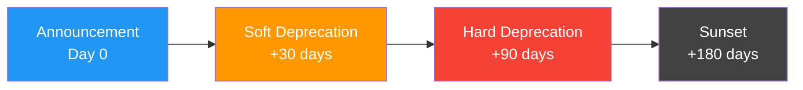

# Deprecation Patterns

## Introduction

Deprecation is the art of saying goodbye gracefully. When a tool version must eventually disappear — whether because its parameter structure is outdated, its functionality has been replaced, or its underlying API is shutting down — you need a structured process that gives every consumer enough time and guidance to migrate.

This sub-lesson covers the patterns and metadata that make deprecation predictable: clear warnings, sunset timelines, replacement pointers, and the communication strategies that prevent angry surprises.

### What we'll cover

- Deprecation metadata in tool schemas
- Sunset timelines and communication
- Warning injection in tool responses
- Graduated deprecation: soft → hard → removal
- Provider deprecation patterns in the wild

### Prerequisites

- Completed [Backward Compatibility Strategies](./02-backward-compatibility-strategies.md)
- Understanding of tool registries (from [Tool Version Management](./01-tool-version-management.md))
- Familiarity with logging and monitoring basics

---

## Deprecation metadata in tool schemas

A deprecated tool must tell consumers three things: **that it's deprecated**, **what to use instead**, and **when it will stop working**. We encode this information directly in the tool schema.

### Adding deprecation fields

```python
from dataclasses import dataclass, field
from datetime import date, datetime


@dataclass
class DeprecationInfo:
    """Metadata for a deprecated tool or parameter."""

    deprecated_at: date
    sunset_date: date
    replacement: str | None = None
    migration_guide_url: str | None = None
    reason: str = ""

    @property
    def days_until_sunset(self) -> int:
        return (self.sunset_date - date.today()).days

    @property
    def is_past_sunset(self) -> bool:
        return date.today() > self.sunset_date

    def warning_message(self) -> str:
        """Generate a user-facing deprecation warning."""
        msg = f"⚠️ This tool is deprecated (since {self.deprecated_at})."
        if self.replacement:
            msg += f" Use '{self.replacement}' instead."
        if self.days_until_sunset > 0:
            msg += f" Will be removed in {self.days_until_sunset} days"
            msg += f" ({self.sunset_date})."
        elif self.is_past_sunset:
            msg += " This tool is past its sunset date and may stop working."
        return msg
```

**Output:**
```python
info = DeprecationInfo(
    deprecated_at=date(2025, 6, 1),
    sunset_date=date(2025, 12, 1),
    replacement="search_orders_v2",
    reason="Flat parameter structure replaced by flexible filters",
)
print(info.warning_message())
# ⚠️ This tool is deprecated (since 2025-06-01). Use 'search_orders_v2'
# instead. Will be removed in 152 days (2025-12-01).
```

### Embedding deprecation in tool descriptions

The model reads tool descriptions to decide which tool to call. Update the description to steer the model away from deprecated tools:

```python
deprecated_tool = {
    "type": "function",
    "name": "search_orders",
    "description": (
        "DEPRECATED — Use search_orders_v2 instead. "
        "Sunset: 2025-12-01. "
        "Search orders by customer name only."
    ),
    "parameters": {
        "type": "object",
        "properties": {
            "customer_name": {
                "type": "string",
                "description": "Customer name to search for"
            },
        },
        "required": ["customer_name"],
    },
}

replacement_tool = {
    "type": "function",
    "name": "search_orders_v2",
    "description": (
        "Search orders with flexible filters including customer ID, "
        "date range, and status. Replaces search_orders."
    ),
    "parameters": {
        "type": "object",
        "properties": {
            "customer_id": {"type": "string"},
            "date_range": {
                "type": "object",
                "properties": {
                    "start": {"type": "string", "description": "ISO date"},
                    "end": {"type": "string", "description": "ISO date"},
                },
            },
            "status": {
                "type": "string",
                "enum": ["pending", "shipped", "delivered", "cancelled"],
            },
        },
        "required": ["customer_id"],
    },
}
```

> **🤖 AI Context:** Most LLMs respond well to the word "DEPRECATED" at the start of a description. They will prefer alternative tools when available, especially if the replacement description explicitly says "Replaces search_orders."

---

## Sunset timelines and communication

A deprecation without a timeline is just a suggestion. Define concrete dates:



### Timeline guidelines

| Phase | Duration | What happens |
|---|---|---|
| **Announcement** | Day 0 | Tool marked deprecated. Changelog updated. Team notified. |
| **Soft deprecation** | 30-60 days | Warnings in responses. Both old and new tools available. |
| **Hard deprecation** | 60-120 days | Stronger warnings. Metrics tracked. Migration support offered. |
| **Sunset** | 120-180 days | Tool removed or returns error. All traffic on new version. |

### Minimum timeline by impact

The timeline should scale with the blast radius:

| Impact Level | Minimum Timeline | Example |
|---|---|---|
| Internal tools, single team | 30 days | Renaming an internal helper tool |
| Internal tools, multiple teams | 60 days | Changing a shared utility's signature |
| External API, few consumers | 90 days | Beta tool restructuring |
| External API, many consumers | 180+ days | Production tool with published SDK |

### Communication template

```python
DEPRECATION_ANNOUNCEMENT = """
## Tool Deprecation Notice: {tool_name}

**Status:** Deprecated
**Deprecated:** {deprecated_date}
**Sunset:** {sunset_date}
**Replacement:** {replacement_tool}

### What's Changing
{reason}

### Migration Steps
1. Replace calls to `{tool_name}` with `{replacement_tool}`
2. Update parameter mapping:
{param_changes}
3. Test with the new tool before the sunset date

### Timeline
- **Now:** Both tools work. Warnings added to `{tool_name}` responses.
- **{warning_date}:** Increased warning frequency.
- **{sunset_date}:** `{tool_name}` will return an error.

### Support
Questions? Contact {support_channel}.
"""
```

---

## Warning injection in tool responses

Rather than silently accepting deprecated tool calls, inject warnings into the response:

### Response wrapper pattern

```python
from typing import Any


def wrap_deprecated_response(
    result: dict[str, Any],
    deprecation: DeprecationInfo,
) -> dict[str, Any]:
    """Wrap a tool response with deprecation warnings."""
    return {
        "result": result,
        "_deprecation": {
            "warning": deprecation.warning_message(),
            "replacement": deprecation.replacement,
            "sunset_date": str(deprecation.sunset_date),
            "migration_guide": deprecation.migration_guide_url,
        },
    }


# Usage in tool handler
def handle_search_orders_legacy(arguments: dict) -> dict:
    """Handle deprecated search_orders tool."""
    deprecation = DeprecationInfo(
        deprecated_at=date(2025, 6, 1),
        sunset_date=date(2025, 12, 1),
        replacement="search_orders_v2",
        migration_guide_url="https://docs.example.com/migrate-search",
    )

    # Execute the actual search
    results = legacy_order_search(arguments["customer_name"])

    # Wrap with deprecation metadata
    return wrap_deprecated_response(
        result={"orders": results, "count": len(results)},
        deprecation=deprecation,
    )
```

**Output:**
```json
{
    "result": {
        "orders": [{"id": "ORD-001", "status": "shipped"}],
        "count": 1
    },
    "_deprecation": {
        "warning": "⚠️ This tool is deprecated (since 2025-06-01). Use 'search_orders_v2' instead. Will be removed in 152 days (2025-12-01).",
        "replacement": "search_orders_v2",
        "sunset_date": "2025-12-01",
        "migration_guide": "https://docs.example.com/migrate-search"
    }
}
```

> **Note:** Some models may relay deprecation warnings to users. This is often desirable — it educates users about the migration. If you don't want users to see the warnings, place them in a metadata field the model's system prompt instructs it to ignore.

---

## Graduated deprecation: soft → hard → removal

Implement a graduated response based on how close the sunset date is:

```python
from enum import Enum


class DeprecationSeverity(Enum):
    """How aggressively to warn about deprecation."""
    SOFT = "soft"       # Informational warning
    HARD = "hard"       # Strong warning, recommend migration
    BLOCKED = "blocked" # Return error, refuse to execute


def get_severity(deprecation: DeprecationInfo) -> DeprecationSeverity:
    """Determine deprecation severity based on timeline."""
    days_left = deprecation.days_until_sunset
    if days_left <= 0:
        return DeprecationSeverity.BLOCKED
    elif days_left <= 30:
        return DeprecationSeverity.HARD
    else:
        return DeprecationSeverity.SOFT


def handle_deprecated_call(
    tool_name: str,
    arguments: dict,
    deprecation: DeprecationInfo,
    execute_fn: callable,
) -> dict:
    """Handle a deprecated tool call with graduated response."""
    severity = get_severity(deprecation)

    if severity == DeprecationSeverity.BLOCKED:
        return {
            "error": f"Tool '{tool_name}' has been retired.",
            "replacement": deprecation.replacement,
            "message": (
                f"This tool was sunset on {deprecation.sunset_date}. "
                f"Please use '{deprecation.replacement}' instead."
            ),
        }

    # Execute the tool
    result = execute_fn(arguments)

    if severity == DeprecationSeverity.HARD:
        return {
            "result": result,
            "_warning": (
                f"⛔ URGENT: '{tool_name}' will be removed in "
                f"{deprecation.days_until_sunset} days. "
                f"Migrate to '{deprecation.replacement}' immediately."
            ),
        }

    # SOFT
    return {
        "result": result,
        "_info": (
            f"ℹ️ '{tool_name}' is deprecated. "
            f"Consider switching to '{deprecation.replacement}'."
        ),
    }
```

---

## Provider deprecation patterns in the wild

Real-world AI providers have established deprecation patterns worth studying:

### Anthropic's versioned type approach

Anthropic uses **date-stamped type identifiers** for built-in tools. This avoids deprecation complexity — each version is an independent tool:

```python
# Anthropic built-in tools use versioned type names
tools = [
    {
        "type": "text_editor_20250124",  # Version embedded in type
        "name": "str_replace_editor",
    },
    {
        "type": "web_search_20250305",  # Different tool, different date
        "name": "web_search",
    },
]
# When a new version ships, both the old and new type remain valid
# until the model version that supports the old type is deprecated.
```

> **🤖 AI Context:** Anthropic's approach ties tool versions to model versions. When a model version is deprecated, the tool versions it supports are deprecated along with it. This simplifies lifecycle management — you deprecate models, not individual tools.

### OpenAI's schema caching and strict mode

OpenAI caches tool schemas on first use. Changing a schema in strict mode effectively creates a new cached definition:

```python
# OpenAI strict mode tools are cached by schema hash
# Changing any field creates a new cache entry
tool = {
    "type": "function",
    "name": "get_weather",
    "strict": True,  # Schema must not change
    "parameters": {
        "type": "object",
        "properties": {
            "location": {"type": "string"},
        },
        "required": ["location"],
        "additionalProperties": False,
    },
}
# To "deprecate", you create a new tool and remove the old one
# There's no in-schema deprecation marker in OpenAI's strict mode
```

### Comparison table

| Pattern | Provider | Key Mechanism | Lifecycle Coupling |
|---|---|---|---|
| Versioned types | Anthropic | Date in type name | Tied to model version |
| Schema caching | OpenAI | Hash-based cache | Per-deployment |
| Mode selection | Google Gemini | Function calling mode | Per-request |
| Custom metadata | Custom apps | `_deprecation` field | Application-managed |

---

## Best practices

| Practice | Why It Matters |
|----------|----------------|
| Set a concrete sunset date on day one | Without a deadline, migrations never happen |
| Put "DEPRECATED" in the tool description | LLMs will prefer non-deprecated alternatives |
| Inject warnings in responses, not just logs | Makes deprecation visible to the model and end users |
| Use graduated severity (soft → hard → blocked) | Gives consumers increasing urgency without sudden breakage |
| Track deprecated tool call volume daily | Data-driven retirement decisions prevent premature removal |
| Document the replacement tool and migration steps | Consumers can't migrate if they don't know where to go |

---

## Common pitfalls

| ❌ Mistake | ✅ Solution |
|-----------|-------------|
| Deprecating without a replacement | Always have the replacement ready before announcing deprecation |
| Setting a sunset date but never enforcing it | Automate enforcement with the graduated severity pattern |
| Removing tools without a deprecation phase | Even internal tools need at least 30 days of deprecation |
| Relying on logs alone for deprecation visibility | Inject warnings into tool responses so the model sees them |
| Making the deprecation timeline too short for external APIs | Give 180+ days for public APIs — migration takes longer than you think |
| Deprecating too many tools at once | Stagger deprecations to avoid migration fatigue |

---

## Hands-on exercise

### Your task

Build a `DeprecationManager` class that manages the lifecycle of deprecated tools across your application.

### Requirements

1. Register tools with deprecation metadata (deprecated date, sunset date, replacement)
2. Determine the severity level (soft/hard/blocked) based on current date
3. Generate deprecation warnings appropriate to the severity
4. Produce a summary report listing all deprecated tools and their status
5. Identify tools that are past their sunset date

### Expected result

```
Deprecation Report:
  search_orders: HARD (28 days until sunset) → search_orders_v2
  format_address: SOFT (95 days until sunset) → format_address_v2
  legacy_auth: BLOCKED (past sunset by 15 days) → oauth_authenticate

Past sunset: ['legacy_auth']
```

<details>
<summary>💡 Hints (click to expand)</summary>

- Store `DeprecationInfo` objects in a dictionary keyed by tool name
- Reuse the `DeprecationSeverity` enum and `get_severity` function from earlier
- For the report, iterate over all registered deprecations and format the output
- Use `date.today()` for calculations — you can override it in tests by passing a reference date

</details>

<details>
<summary>✅ Solution (click to expand)</summary>

```python
from dataclasses import dataclass
from datetime import date
from enum import Enum


class DeprecationSeverity(Enum):
    SOFT = "soft"
    HARD = "hard"
    BLOCKED = "blocked"


@dataclass
class DeprecationInfo:
    deprecated_at: date
    sunset_date: date
    replacement: str
    reason: str = ""

    @property
    def days_until_sunset(self) -> int:
        return (self.sunset_date - date.today()).days

    @property
    def is_past_sunset(self) -> bool:
        return date.today() > self.sunset_date


class DeprecationManager:
    """Manage deprecation lifecycle for multiple tools."""

    def __init__(self):
        self._deprecations: dict[str, DeprecationInfo] = {}

    def register(
        self,
        tool_name: str,
        deprecated_at: date,
        sunset_date: date,
        replacement: str,
        reason: str = "",
    ) -> None:
        """Register a tool deprecation."""
        self._deprecations[tool_name] = DeprecationInfo(
            deprecated_at=deprecated_at,
            sunset_date=sunset_date,
            replacement=replacement,
            reason=reason,
        )

    def get_severity(self, tool_name: str) -> DeprecationSeverity:
        """Get current deprecation severity for a tool."""
        info = self._deprecations.get(tool_name)
        if info is None:
            raise KeyError(f"No deprecation registered for '{tool_name}'")
        if info.is_past_sunset:
            return DeprecationSeverity.BLOCKED
        elif info.days_until_sunset <= 30:
            return DeprecationSeverity.HARD
        else:
            return DeprecationSeverity.SOFT

    def get_warning(self, tool_name: str) -> str:
        """Generate a warning message for a deprecated tool."""
        info = self._deprecations[tool_name]
        severity = self.get_severity(tool_name)
        if severity == DeprecationSeverity.BLOCKED:
            return (
                f"⛔ '{tool_name}' is past its sunset date "
                f"({info.sunset_date}). Use '{info.replacement}'."
            )
        elif severity == DeprecationSeverity.HARD:
            return (
                f"⚠️ URGENT: '{tool_name}' will be removed in "
                f"{info.days_until_sunset} days. "
                f"Migrate to '{info.replacement}' now."
            )
        else:
            return (
                f"ℹ️ '{tool_name}' is deprecated. "
                f"Switch to '{info.replacement}' before "
                f"{info.sunset_date}."
            )

    def past_sunset(self) -> list[str]:
        """Return names of tools past their sunset date."""
        return [
            name for name, info in self._deprecations.items()
            if info.is_past_sunset
        ]

    def report(self) -> str:
        """Generate a deprecation status report."""
        lines = ["Deprecation Report:"]
        for name, info in self._deprecations.items():
            severity = self.get_severity(name)
            days = info.days_until_sunset
            if severity == DeprecationSeverity.BLOCKED:
                status = f"BLOCKED (past sunset by {abs(days)} days)"
            else:
                status = f"{severity.value.upper()} ({days} days until sunset)"
            lines.append(f"  {name}: {status} → {info.replacement}")

        past = self.past_sunset()
        lines.append(f"\nPast sunset: {past}")
        return "\n".join(lines)


# Test
manager = DeprecationManager()
manager.register(
    "search_orders",
    deprecated_at=date(2025, 5, 1),
    sunset_date=date(2025, 7, 28),
    replacement="search_orders_v2",
)
manager.register(
    "format_address",
    deprecated_at=date(2025, 6, 1),
    sunset_date=date(2025, 10, 1),
    replacement="format_address_v2",
)
manager.register(
    "legacy_auth",
    deprecated_at=date(2025, 1, 1),
    sunset_date=date(2025, 6, 1),
    replacement="oauth_authenticate",
)

print(manager.report())
```

</details>

### Bonus challenges

- [ ] Add a `should_execute(tool_name)` method that returns `False` for blocked tools
- [ ] Implement email/Slack notification templates for each severity level
- [ ] Add a `migrate_call(tool_name, arguments)` method that automatically rewrites arguments for the replacement tool using an alias map

---

## Summary

✅ **Deprecation metadata** (dates, replacement, reason) should be attached directly to tool definitions so both code and models can read it

✅ **Sunset timelines** must be concrete and enforced — 30 days minimum for internal tools, 180+ days for external APIs

✅ **Warning injection** in tool responses makes deprecation visible at every layer — logs, model context, and end-user output

✅ **Graduated severity** (soft → hard → blocked) provides increasing pressure without sudden breakage

✅ Real providers use different patterns: Anthropic ties tool versions to **model versions**, OpenAI uses **schema caching**, and custom apps use **application-managed metadata**

**Next:** [Tool Documentation Requirements →](./04-tool-documentation-requirements.md)

---

*Previous:* [Backward Compatibility Strategies](./02-backward-compatibility-strategies.md) | *Next:* [Tool Documentation Requirements →](./04-tool-documentation-requirements.md)

<!--
Sources Consulted:
- Anthropic Tool Use (versioned types): https://docs.anthropic.com/en/docs/build-with-claude/tool-use
- OpenAI Function Calling (strict mode, caching): https://platform.openai.com/docs/guides/function-calling
- Semantic Versioning 2.0.0 (deprecation in FAQ): https://semver.org/
- Google AIP-180 (backward compatibility, sunset policy): https://google.aip.dev/180
-->
