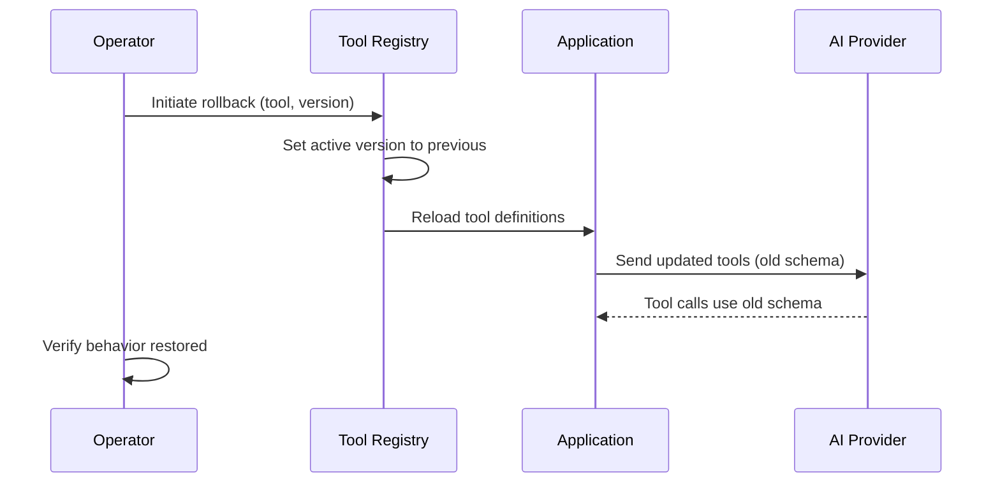
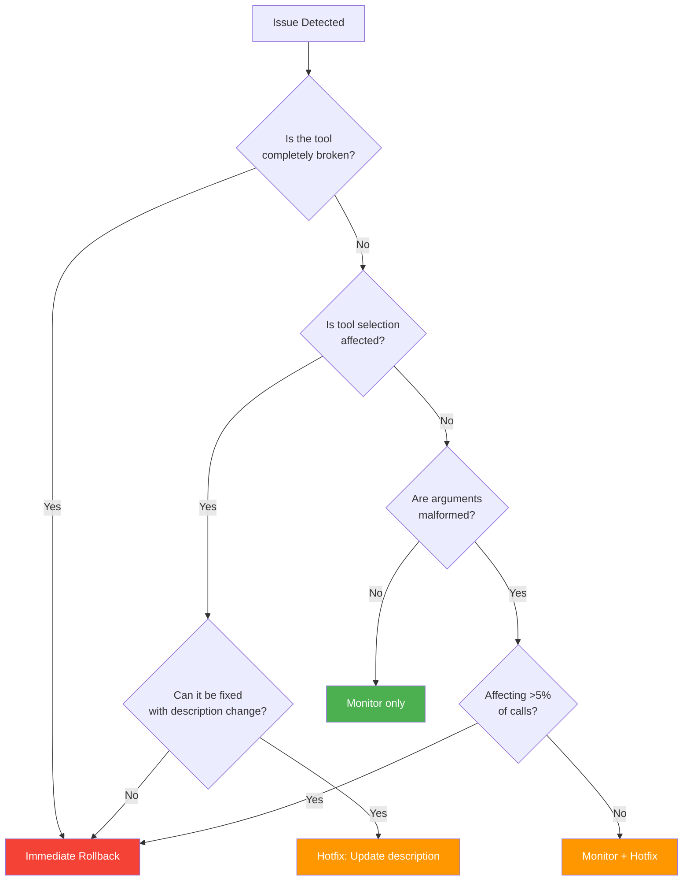

# Rollback Procedures

## Introduction

Sometimes a tool change makes it to production and immediately causes problems — the model stops calling the tool, arguments come back malformed, or a downstream service can't handle the new response format. When that happens, you need to **roll back quickly and safely**, restoring the previous version without creating new problems.

This sub-lesson covers the mechanics of rolling back tool versions: what to restore, how to handle state, how to communicate the rollback, and how to build an incident response playbook so your team reacts consistently.

### What we'll cover

- Version rollback mechanisms
- State cleanup during rollback
- Rollback decision framework
- Team communication during incidents
- Building an incident response playbook

### Prerequisites

- Completed [Testing Tool Changes](./05-testing-tool-changes.md)
- Understanding of tool registries (from [Tool Version Management](./01-tool-version-management.md))
- Familiarity with deployment basics

---

## Version rollback mechanisms

A rollback restores the previous tool schema and handler. The key challenge: **both the schema (what the model sees) and the handler (what your code executes) must be rolled back together**.

### Rollback architecture



### Registry-based rollback

Using the `ToolRegistry` from [Tool Version Management](./01-tool-version-management.md), rollback is straightforward:

```python
from dataclasses import dataclass, field
from datetime import datetime
from enum import Enum
from typing import Any


class ToolStatus(Enum):
    DRAFT = "draft"
    ACTIVE = "active"
    DEPRECATED = "deprecated"
    RETIRED = "retired"
    ROLLED_BACK = "rolled_back"


@dataclass
class RollbackRecord:
    """Record of a rollback event."""

    tool_name: str
    from_version: str
    to_version: str
    reason: str
    rolled_back_at: datetime
    rolled_back_by: str


class RollbackManager:
    """Manage tool version rollbacks with audit trail."""

    def __init__(self, registry: "ToolRegistry"):
        self.registry = registry
        self._history: list[RollbackRecord] = []

    def rollback(
        self,
        tool_name: str,
        target_version: str | None = None,
        reason: str = "",
        operator: str = "system",
    ) -> RollbackRecord:
        """
        Roll back a tool to a previous version.

        Args:
            tool_name: Name of the tool to roll back.
            target_version: Version to roll back to. If None, uses
                           the previous version.
            reason: Why the rollback is happening.
            operator: Who initiated the rollback.

        Returns:
            RollbackRecord documenting the action.
        """
        # Get current active version
        current = self.registry.get_latest(tool_name)
        if current is None:
            raise ValueError(f"No active version found for '{tool_name}'")

        # Determine target version
        if target_version is None:
            target = self._find_previous_version(tool_name, current.version)
        else:
            target = self.registry.get_version(tool_name, target_version)

        if target is None:
            raise ValueError(
                f"Target version not found for '{tool_name}'"
            )

        # Execute rollback
        current.status = ToolStatus.ROLLED_BACK
        target.status = ToolStatus.ACTIVE

        # Create audit record
        record = RollbackRecord(
            tool_name=tool_name,
            from_version=current.version,
            to_version=target.version,
            reason=reason,
            rolled_back_at=datetime.now(),
            rolled_back_by=operator,
        )
        self._history.append(record)
        return record

    def _find_previous_version(
        self, tool_name: str, current_version: str
    ) -> "ToolVersion | None":
        """Find the version immediately before the current one."""
        all_versions = self.registry.get_all_versions(tool_name)
        sorted_versions = sorted(all_versions, key=lambda v: v.version)
        for i, v in enumerate(sorted_versions):
            if v.version == current_version and i > 0:
                return sorted_versions[i - 1]
        return None

    def rollback_history(self, tool_name: str | None = None) -> list[RollbackRecord]:
        """Get rollback history, optionally filtered by tool."""
        if tool_name:
            return [r for r in self._history if r.tool_name == tool_name]
        return list(self._history)
```

**Output (usage):**
```python
manager = RollbackManager(registry)
record = manager.rollback(
    tool_name="search_products",
    reason="v2.0.0 causes model to generate invalid arguments",
    operator="oncall-engineer",
)
print(f"Rolled back {record.tool_name}: {record.from_version} → {record.to_version}")
print(f"Reason: {record.reason}")
print(f"At: {record.rolled_back_at}")
# Rolled back search_products: 2.0.0 → 1.1.0
# Reason: v2.0.0 causes model to generate invalid arguments
# At: 2025-07-01 14:30:22
```

---

## State cleanup during rollback

Rolling back the schema isn't enough if the new version introduced **state changes** — new database fields, new cache formats, or new downstream dependencies.

### Identifying rollback side effects

```python
from dataclasses import dataclass, field
from typing import Callable


@dataclass
class RollbackStep:
    """A single cleanup step in a rollback procedure."""

    name: str
    description: str
    execute: Callable[[], bool]
    rollback_on_failure: Callable[[], None] | None = None
    critical: bool = True  # If True, abort rollback on failure


@dataclass
class RollbackPlan:
    """A complete rollback plan with ordered cleanup steps."""

    tool_name: str
    from_version: str
    to_version: str
    steps: list[RollbackStep] = field(default_factory=list)

    def execute(self) -> dict[str, Any]:
        """Execute the rollback plan step by step."""
        results = {
            "tool": self.tool_name,
            "from": self.from_version,
            "to": self.to_version,
            "steps": [],
            "success": True,
        }

        for step in self.steps:
            try:
                success = step.execute()
                results["steps"].append({
                    "name": step.name,
                    "status": "✅ DONE" if success else "⚠️ PARTIAL",
                })
                if not success and step.critical:
                    results["success"] = False
                    results["steps"][-1]["status"] = "❌ FAILED (critical)"
                    break
            except Exception as e:
                results["steps"].append({
                    "name": step.name,
                    "status": f"❌ ERROR: {e}",
                })
                if step.critical:
                    results["success"] = False
                    # Try to undo this step
                    if step.rollback_on_failure:
                        step.rollback_on_failure()
                    break

        return results
```

### Common cleanup tasks

```python
def build_rollback_plan(
    tool_name: str,
    from_version: str,
    to_version: str,
) -> RollbackPlan:
    """Build a rollback plan with standard cleanup steps."""
    plan = RollbackPlan(
        tool_name=tool_name,
        from_version=from_version,
        to_version=to_version,
    )

    # Step 1: Switch schema version (always first)
    plan.steps.append(RollbackStep(
        name="Switch tool schema",
        description=f"Revert {tool_name} schema from {from_version} to {to_version}",
        execute=lambda: switch_schema_version(tool_name, to_version),
        critical=True,
    ))

    # Step 2: Clear cached schemas (provider-specific)
    plan.steps.append(RollbackStep(
        name="Clear schema cache",
        description="Invalidate any cached tool schemas at the provider",
        execute=lambda: clear_provider_cache(tool_name),
        critical=False,  # Non-critical — cache expires naturally
    ))

    # Step 3: Revert handler mapping
    plan.steps.append(RollbackStep(
        name="Revert handler",
        description=f"Map {tool_name} to {to_version} handler function",
        execute=lambda: revert_handler(tool_name, to_version),
        critical=True,
    ))

    # Step 4: Clean up new-version data artifacts
    plan.steps.append(RollbackStep(
        name="Data cleanup",
        description="Handle data created with new-version schema",
        execute=lambda: cleanup_new_version_data(tool_name, from_version),
        critical=False,  # Data can be cleaned up later
    ))

    # Step 5: Notify monitoring
    plan.steps.append(RollbackStep(
        name="Update monitoring",
        description="Notify monitoring system of version change",
        execute=lambda: notify_monitoring(tool_name, to_version),
        critical=False,
    ))

    return plan
```

**Output (execution):**
```python
plan = build_rollback_plan("search_products", "2.0.0", "1.1.0")
results = plan.execute()
for step in results["steps"]:
    print(f"  {step['status']}: {step['name']}")
# ✅ DONE: Switch tool schema
# ✅ DONE: Clear schema cache
# ✅ DONE: Revert handler
# ⚠️ PARTIAL: Data cleanup
# ✅ DONE: Update monitoring
```

---

## Rollback decision framework

Not every problem warrants a rollback. Use a structured framework to decide:



### Severity levels

| Severity | Symptoms | Action | Response Time |
|---|---|---|---|
| **P0 — Critical** | Tool never called, all calls fail, security issue | Immediate rollback | < 15 minutes |
| **P1 — Major** | Tool called but >20% arguments invalid | Rollback within 1 hour | < 1 hour |
| **P2 — Minor** | <5% arguments affected, edge cases only | Hotfix or next deploy | < 24 hours |
| **P3 — Low** | Cosmetic (description wording, minor format) | Normal release cycle | < 1 week |

### Automated rollback triggers

```python
from collections import deque
from datetime import datetime, timedelta


class AutoRollbackMonitor:
    """Monitor tool call success rates and trigger auto-rollback."""

    def __init__(
        self,
        rollback_manager: RollbackManager,
        error_threshold: float = 0.20,  # 20% error rate
        window_minutes: int = 10,
        min_calls: int = 20,
    ):
        self.rollback_manager = rollback_manager
        self.error_threshold = error_threshold
        self.window = timedelta(minutes=window_minutes)
        self.min_calls = min_calls
        self._calls: dict[str, deque] = {}  # tool_name: deque of (timestamp, success)

    def record_call(self, tool_name: str, success: bool) -> None:
        """Record a tool call result."""
        if tool_name not in self._calls:
            self._calls[tool_name] = deque()

        now = datetime.now()
        self._calls[tool_name].append((now, success))
        self._cleanup_old(tool_name, now)
        self._check_threshold(tool_name)

    def _cleanup_old(self, tool_name: str, now: datetime) -> None:
        """Remove calls outside the monitoring window."""
        q = self._calls[tool_name]
        while q and (now - q[0][0]) > self.window:
            q.popleft()

    def _check_threshold(self, tool_name: str) -> None:
        """Check if error rate exceeds threshold and trigger rollback."""
        calls = self._calls.get(tool_name, deque())
        if len(calls) < self.min_calls:
            return  # Not enough data

        errors = sum(1 for _, success in calls if not success)
        error_rate = errors / len(calls)

        if error_rate >= self.error_threshold:
            print(
                f"⚠️ AUTO-ROLLBACK: {tool_name} error rate "
                f"{error_rate:.1%} exceeds threshold {self.error_threshold:.1%}"
            )
            self.rollback_manager.rollback(
                tool_name=tool_name,
                reason=f"Auto-rollback: {error_rate:.1%} error rate "
                       f"over {len(calls)} calls",
                operator="auto-rollback-monitor",
            )
```

---

## Team communication during incidents

A rollback is an incident. Clear communication prevents panic and ensures the right people act:

### Communication template

```python
from dataclasses import dataclass
from datetime import datetime


@dataclass
class IncidentNotification:
    """Structured incident notification for tool rollbacks."""

    tool_name: str
    severity: str
    from_version: str
    to_version: str
    reason: str
    started_at: datetime
    operator: str

    def format_slack_message(self) -> str:
        """Format as a Slack-style notification."""
        emoji = {"P0": "🔴", "P1": "🟠", "P2": "🟡", "P3": "🔵"}.get(
            self.severity, "⚪"
        )
        return f"""
{emoji} **Tool Rollback — {self.severity}**

**Tool:** `{self.tool_name}`
**Action:** Rolled back `{self.from_version}` → `{self.to_version}`
**Reason:** {self.reason}
**Time:** {self.started_at.strftime('%Y-%m-%d %H:%M UTC')}
**Operator:** {self.operator}

**Impact:** Tool calls now use v{self.to_version} schema.
**Next Steps:** Investigate root cause, fix, and re-deploy.
""".strip()

    def format_status_page(self) -> str:
        """Format for a public/internal status page."""
        return (
            f"[{self.started_at.strftime('%H:%M UTC')}] "
            f"{self.tool_name}: Rolled back to v{self.to_version} "
            f"due to issues with v{self.from_version}. "
            f"All functionality restored."
        )
```

**Output:**
```python
notification = IncidentNotification(
    tool_name="search_products",
    severity="P1",
    from_version="2.0.0",
    to_version="1.1.0",
    reason="Model generating invalid arguments with new parameter structure",
    started_at=datetime(2025, 7, 1, 14, 30),
    operator="oncall-engineer",
)
print(notification.format_slack_message())
```

**Output:**
```
🟠 **Tool Rollback — P1**

**Tool:** `search_products`
**Action:** Rolled back `2.0.0` → `1.1.0`
**Reason:** Model generating invalid arguments with new parameter structure
**Time:** 2025-07-01 14:30 UTC
**Operator:** oncall-engineer

**Impact:** Tool calls now use v1.1.0 schema.
**Next Steps:** Investigate root cause, fix, and re-deploy.
```

---

## Building an incident response playbook

A playbook ensures consistent responses regardless of who is on call:

### The tool rollback playbook

```python
ROLLBACK_PLAYBOOK = """
# Tool Rollback Playbook

## 1. Detect (0-5 minutes)
- [ ] Identify the failing tool and version
- [ ] Check error rate in monitoring dashboard
- [ ] Determine severity (P0/P1/P2/P3)

## 2. Decide (5-10 minutes)
- [ ] Is rollback the right action? (See decision framework)
- [ ] Identify the target rollback version
- [ ] Confirm the target version is known-good

## 3. Execute (10-15 minutes)
- [ ] Run rollback: `python -m tools.rollback <tool_name> --to <version>`
- [ ] Verify schema updated in provider
- [ ] Send one test request to confirm

## 4. Communicate (15-20 minutes)
- [ ] Post in #incidents channel
- [ ] Update status page
- [ ] Notify affected teams

## 5. Verify (20-30 minutes)
- [ ] Monitor error rates for 10 minutes
- [ ] Confirm rates return to baseline
- [ ] Check no new errors introduced

## 6. Follow Up (within 24 hours)
- [ ] Write incident report
- [ ] Identify root cause
- [ ] Add regression test for the failure
- [ ] Plan re-deployment with fix
"""
```

### Runbook automation

```python
from typing import Any


class RollbackRunbook:
    """Automated incident response runbook for tool rollbacks."""

    def __init__(self, rollback_manager: RollbackManager):
        self.manager = rollback_manager
        self._log: list[str] = []

    def execute(
        self,
        tool_name: str,
        target_version: str | None = None,
        reason: str = "",
        operator: str = "unknown",
    ) -> dict[str, Any]:
        """Execute the full rollback runbook."""
        self._log = []
        results: dict[str, Any] = {"success": False, "steps": []}

        # Step 1: Pre-flight checks
        self._step("Pre-flight checks")
        current = self.manager.registry.get_latest(tool_name)
        if current is None:
            return self._fail(results, f"No active version for '{tool_name}'")
        self._log_action(f"Current version: {current.version}")

        if target_version:
            target = self.manager.registry.get_version(tool_name, target_version)
            if target is None:
                return self._fail(results, f"Target version {target_version} not found")
        self._step_done(results, "Pre-flight checks passed")

        # Step 2: Execute rollback
        self._step("Execute rollback")
        record = self.manager.rollback(
            tool_name=tool_name,
            target_version=target_version,
            reason=reason,
            operator=operator,
        )
        self._step_done(
            results,
            f"Rolled back: {record.from_version} → {record.to_version}",
        )

        # Step 3: Generate notification
        self._step("Generate notification")
        notification = IncidentNotification(
            tool_name=tool_name,
            severity="P1",
            from_version=record.from_version,
            to_version=record.to_version,
            reason=reason,
            started_at=record.rolled_back_at,
            operator=operator,
        )
        self._step_done(results, "Notification generated")
        results["notification"] = notification.format_slack_message()

        # Step 4: Verification guidance
        self._step("Verification")
        self._log_action("Monitor error rates for next 10 minutes")
        self._log_action("Confirm tool calls use restored schema")
        self._step_done(results, "Verification steps listed")

        results["success"] = True
        results["record"] = record
        return results

    def _step(self, name: str) -> None:
        self._log.append(f"▶ {name}")

    def _step_done(self, results: dict, message: str) -> None:
        results["steps"].append({"status": "✅", "message": message})
        self._log.append(f"  ✅ {message}")

    def _fail(self, results: dict, message: str) -> dict:
        results["steps"].append({"status": "❌", "message": message})
        self._log.append(f"  ❌ {message}")
        return results

    def _log_action(self, message: str) -> None:
        self._log.append(f"  → {message}")
```

---

## Best practices

| Practice | Why It Matters |
|----------|----------------|
| Always have a rollback target before deploying new versions | You can't roll back if there's no known-good version to restore |
| Automate rollback as a one-command operation | Under pressure, manual multi-step rollbacks invite mistakes |
| Set automated rollback triggers on error rate thresholds | Catches problems faster than human monitoring |
| Keep previous handler code deployed alongside new code | Rollback only works if the old handler is still available |
| Document rollback procedures in a runbook | Ensures consistent response regardless of who is on call |
| Test your rollback procedure periodically | A rollback that hasn't been tested is a rollback that might fail |

---

## Common pitfalls

| ❌ Mistake | ✅ Solution |
|-----------|-------------|
| Rolling back the schema but not the handler | Both must be rolled back together — schema + handler + data |
| No audit trail for rollbacks | Log every rollback with who, when, why, and what version |
| Setting auto-rollback thresholds too sensitive | Use enough calls (20+) and a meaningful window (10+ minutes) |
| Not communicating the rollback to affected teams | Use automated notifications on every rollback |
| Deleting old handler code after deploying new versions | Keep at least one previous version's code deployed and ready |
| Treating the rollback as the resolution | A rollback is first aid — you still need root cause analysis and a fix |

---

## Hands-on exercise

### Your task

Build a complete `EmergencyRollback` system that detects issues, executes rollback, and generates an incident report.

### Requirements

1. A `HealthChecker` that tracks success/failure rates per tool over a sliding window
2. A threshold-based trigger that initiates rollback when error rate exceeds a configurable limit
3. A rollback executor that switches tool versions and produces an audit record
4. An incident report generator that summarizes what happened, actions taken, and next steps
5. Demonstrate the full flow: simulate 100 calls with 25% failure rate → auto-trigger → rollback → report

### Expected result

```
Monitoring search_products...
  Call 1: ✅  Call 2: ✅  Call 3: ❌  ...  Call 20: ❌
  ⚠️ Error rate 25.0% exceeds threshold 20.0%

Auto-Rollback Triggered:
  Tool: search_products
  From: 2.0.0 → To: 1.1.0
  Reason: Error rate 25.0% over 20 calls

Incident Report:
  Duration: 2 minutes
  Calls affected: ~5
  Root cause: TBD — investigate argument parsing in v2.0.0
  Status: RESOLVED (rolled back)
```

<details>
<summary>💡 Hints (click to expand)</summary>

- Use `collections.deque` with `maxlen` for the sliding window
- Simulate calls with `random.random() < 0.75` for 75% success / 25% failure
- The health checker should call the rollback manager when threshold is breached
- For the incident report, track the timestamp when the issue was first detected

</details>

<details>
<summary>✅ Solution (click to expand)</summary>

```python
import random
from collections import deque
from dataclasses import dataclass
from datetime import datetime


@dataclass
class HealthRecord:
    timestamp: datetime
    success: bool


class HealthChecker:
    """Track tool call health with sliding window."""

    def __init__(self, window_size: int = 20, threshold: float = 0.20):
        self.window_size = window_size
        self.threshold = threshold
        self._windows: dict[str, deque] = {}

    def record(self, tool_name: str, success: bool) -> float | None:
        """Record a call and return error rate if threshold breached."""
        if tool_name not in self._windows:
            self._windows[tool_name] = deque(maxlen=self.window_size)

        self._windows[tool_name].append(
            HealthRecord(datetime.now(), success)
        )
        window = self._windows[tool_name]

        if len(window) < self.window_size:
            return None  # Not enough data

        error_rate = sum(1 for r in window if not r.success) / len(window)
        if error_rate >= self.threshold:
            return error_rate
        return None


class EmergencyRollback:
    """Full emergency rollback system."""

    def __init__(self, threshold: float = 0.20, window: int = 20):
        self.checker = HealthChecker(window, threshold)
        self.threshold = threshold
        self._rolled_back: set = set()
        self._incident_start: dict[str, datetime] = {}

    def process_call(
        self, tool_name: str, success: bool, version: str
    ) -> dict | None:
        """Process a tool call result. Returns incident report if rollback triggered."""
        symbol = "✅" if success else "❌"
        print(f"  {symbol}", end="", flush=True)

        if tool_name in self._rolled_back:
            return None  # Already rolled back

        error_rate = self.checker.record(tool_name, success)
        if error_rate is not None:
            self._rolled_back.add(tool_name)
            print(f"\n  ⚠️ Error rate {error_rate:.1%} exceeds {self.threshold:.1%}")
            return self._execute_rollback(tool_name, version, error_rate)

        return None

    def _execute_rollback(
        self, tool_name: str, current_version: str, error_rate: float
    ) -> dict:
        now = datetime.now()
        report = {
            "tool": tool_name,
            "from_version": current_version,
            "to_version": "1.1.0",  # Simulated previous version
            "error_rate": f"{error_rate:.1%}",
            "triggered_at": now.strftime("%H:%M:%S"),
            "status": "RESOLVED (rolled back)",
        }
        print(f"\nAuto-Rollback Triggered:")
        print(f"  Tool: {tool_name}")
        print(f"  From: {current_version} → To: 1.1.0")
        print(f"  Reason: Error rate {error_rate:.1%}")
        return report


# Simulate
print("Monitoring search_products...")
system = EmergencyRollback(threshold=0.20, window=20)

random.seed(42)
for i in range(50):
    success = random.random() < 0.75  # 75% success, 25% failure
    report = system.process_call("search_products", success, "2.0.0")
    if report:
        print(f"\nIncident Report:")
        print(f"  Status: {report['status']}")
        break
```

</details>

### Bonus challenges

- [ ] Add a "cooldown" period after rollback — don't allow re-deployment of the same version for 1 hour
- [ ] Implement a `RollForward` class that applies a hotfix instead of rolling back (for cases where rollback is more disruptive)
- [ ] Add Slack/email notification integration to the rollback trigger

---

## Summary

✅ **Registry-based rollback** makes version switching a single operation — set the previous version to active and the current to rolled-back

✅ **State cleanup** matters: rolling back the schema without the handler and data creates inconsistencies — use a `RollbackPlan` with ordered steps

✅ A **decision framework** prevents unnecessary rollbacks — P0/P1 warrant immediate rollback, P2/P3 can be hotfixed

✅ **Automated rollback triggers** based on error rate thresholds catch problems faster than human monitoring — but set thresholds carefully to avoid false positives

✅ **Communication templates** and **incident runbooks** ensure consistent, calm response regardless of who is on call

**Next:** [Lesson 14: Structured Outputs & Strict Mode →](../14-structured-outputs-strict-mode/00-structured-outputs-strict-mode.md)

---

*Previous:* [Testing Tool Changes](./05-testing-tool-changes.md) | *Next:* [Lesson 14: Structured Outputs & Strict Mode →](../14-structured-outputs-strict-mode/00-structured-outputs-strict-mode.md)

<!--
Sources Consulted:
- OpenAI Function Calling (strict mode caching): https://platform.openai.com/docs/guides/function-calling
- Anthropic Tool Use (versioned types): https://docs.anthropic.com/en/docs/build-with-claude/tool-use
- Google AIP-180 (backward compatibility, rollback): https://google.aip.dev/180
- Incident Management best practices: PagerDuty Incident Response documentation
-->
